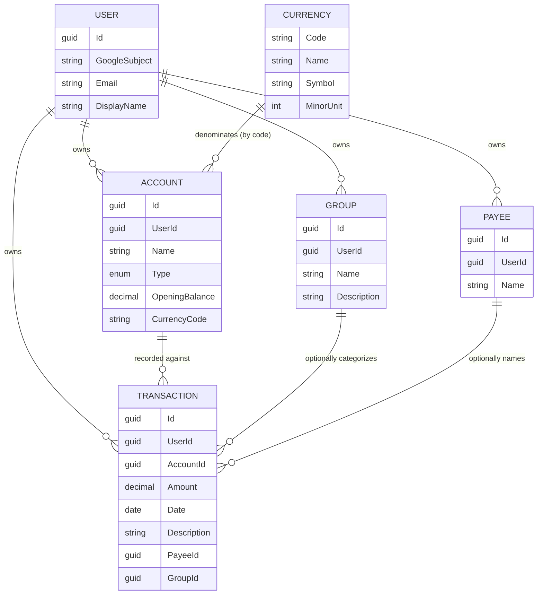

# Budgetoid — Business Logic Overview

## Business summary

Budgetoid is a **single-user personal budgeting app**. A person signs in with Google, then
records money movements so they can see where their money goes. Everything a signed-in person
sees and touches belongs to **them and only them** — there is no sharing, no admin, and no
multi-user visibility.

The core shape is: a user owns one or more **Accounts** (a checking account, a wallet of cash, a
credit card…). Against an account they record **Transactions** — a signed amount on a date, where
a **negative amount is money spent (an expense)** and a **positive amount is money received
(income)**. A transaction can optionally name a **Payee** (who the money went to or came from) and
be filed under a **Group** (a category like "Groceries" or "Rent"). **Currencies** are shared
reference data (ISO-4217) that accounts are denominated in.

Validation lives close to the data: each entity is created through a factory method that enforces
its own field rules (required fields, lengths, money precision). Rules that span more than one
entity (e.g. "you can't delete an account that still has transactions") live in the application
handlers. The single most important invariant — that a user can only ever see or change their own
data — is enforced centrally by a database-level ownership filter, described in
[users-and-ownership.md](users-and-ownership.md).

## Glossary

| Term | Definition |
|---|---|
| **User** | The one person who owns the data. Identified externally by their Google account (the OAuth `sub` claim), internally by a GUID. There is exactly one role — the owner. |
| **Account** | A place money lives (checking, savings, cash, credit card). Owned by a user, denominated in one currency, has an opening balance. |
| **Account Type** | Classification of an account: `Checking`, `Savings`, `Cash`, or `CreditCard`. A label, not a state machine. |
| **Opening Balance** | The account's starting balance at the moment it's created. The **only** balance concept modeled today — there is no computed running/current balance. |
| **Transaction** | A single money movement against an account on a given date. |
| **Amount** | The signed value of a transaction. **Negative = expense** (money out), **positive = income** (money in). Must be non-zero. |
| **Payee** | The counterparty of a transaction (a shop, a person, an employer). Entered as free text with autocomplete; created automatically on first use. Owned by the user. |
| **Group** | A user-defined **category** a transaction can be filed under (e.g. "Groceries"). Name + optional description. "Group" and "category" mean the same thing. |
| **Currency** | Shared ISO-4217 reference data (code, name, symbol, minor unit). Not owned by any user. |
| **Minor Unit** | The number of decimal places a currency uses (e.g. 2 for USD, 0 for JPY). |

## User roles

There is exactly **one role: the authenticated owner.** A signed-in user can create, read, update,
and delete their own accounts and groups; create and list their own transactions and payees; and
read the global currency list. There are **no** administrators, no shared budgets, and no ability
to see another user's data. Unauthenticated visitors can only reach the public welcome/login page.

## Domain area map

`CURRENCY` is global reference data — it has no `UserId` and is shared across all users. Every
other entity is scoped to exactly one user.

## Table of contents

- [Users & Ownership](users-and-ownership.md) — identity, Google provisioning, and the
  cross-cutting multi-tenant isolation invariant. **Read this first** — the ownership rule applies
  to every other area.
- [Accounts](accounts.md) — accounts, account types, currency denomination, delete guard.
- [Transactions](transactions.md) — transactions, the amount sign convention, payees, group tagging.
- [Groups](groups.md) — categories transactions can be filed under.
- [Currencies](currencies.md) — global ISO-4217 reference data.

Non-obvious decisions with their rationale are recorded in [_decision-log.md](_decision-log.md).
