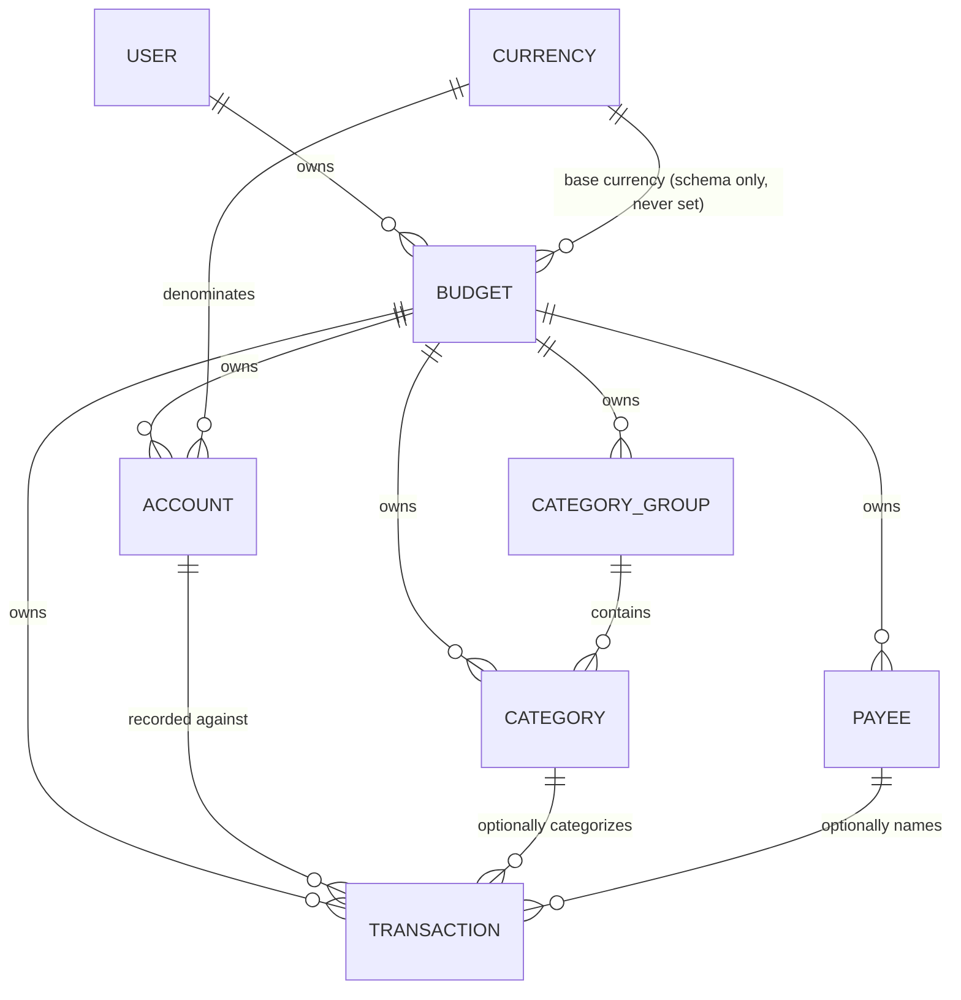

# Budgetoid — Business Logic Overview

## Business summary

Budgetoid is a **personal budgeting app with no sharing**. A person signs in with Google, then
records money movements so they can see where their money goes. There is no admin role and no
multi-user visibility: everything a signed-in person reaches belongs to a **Budget** they own, and a
budget belongs to exactly one user.

A user owns Budgets. A **Budget** owns **Accounts**, against which signed **Transactions** are
recorded. A negative amount is money spent; a positive amount is money received. A Transaction can
optionally name a **Payee** and select a **Category**. Every Category belongs to one **Category
Group**, while a Transaction may remain uncategorized. **Currencies** are shared ISO-4217 reference
data — the only reference table shared across every budget.

Today every user has **exactly one budget**, created for them at sign-in: there is no way to create,
rename, switch or delete one, and the concept never appears in the UI or in a URL. The schema is
multi-budget-ready anyway, and that gap between what the schema permits and what the release does is
itself a rule — see [budgets.md](budgets.md).

Entity factories enforce the field rules the schema cannot state declaratively and application
handlers enforce cross-entity rules, but whatever the schema can state, it owns: check constraints
bound account type and money magnitude, composite foreign keys refuse a cross-budget reference
whatever code path wrote it, and unique indexes are what make name uniqueness and provisioning
race-safe. Immutability is owned down there too: the application connects as a least-privilege role
whose `UPDATE` privileges are granted per column, so a column left off the list — `budget_id` on
every owned table, `accounts.currency_code`, `users.created_at_utc`, every column of `budgets` and
every column of `credentials` — is one PostgreSQL refuses to write at all (see
[ADR 0004](../decisions/0004-connect-as-a-least-privilege-role.md)). Tenancy is owned down there as
well, on both axes. `budget_isolation` policies on the five budget-owned tables mean that role
reaches no other budget's rows on any statement at all and can insert into no budget but the ambient
one, so the query filters above them shape the answer rather than hold the boundary (see
[ADR 0005](../decisions/0005-isolate-budget-owned-rows-with-row-level-security.md)); and the four
tables policed on the **user** instead by `user_isolation` — `users`, `budgets`, `sessions` and
`passkey_signature_counters` — are keyed there because a budget *is* the tenant and so has no
ambient budget to be checked against (see
[ADR 0011](../decisions/0011-police-the-user-owned-tables.md)). Carrying `user_id` is not by itself
what decides it: `credentials`, `passkey_public_keys` and `recovery_code_hashes` carry one and are
policed by neither rule, exempt by written decision because each is read *before* the request has an
identity a policy could be keyed on (see
[ADR 0012](../decisions/0012-split-a-passkeys-material-by-whether-it-is-read-before-identity.md)
and [data isolation](../engineering/data-isolation.md)). That split is a general rule rather than a
local one: each rule is owned by the lowest layer that can enforce it declaratively, and where one
deliberately sits higher the doc says why — see
[ADR 0002](../decisions/0002-enforce-rules-at-the-lowest-capable-layer.md). The central tenancy
invariant — the budget, not the user, is what everything belongs to — is documented in
[budgets.md](budgets.md); identity and provisioning are in
[users-and-ownership.md](users-and-ownership.md).

## Glossary

| Term | Definition |
|---|---|
| **User** | The owner, identified externally by Google `sub` and internally by GUID. |
| **Session** | An established sign-in recorded server-side, naming the credential that established it, which the product can end without asking any external party. Three things establish one — a verified passkey assertion, a redeemed recovery code, and a regeneration of a recovery-code set that was carrying live sessions, which opens one over the new set in their place; nothing issues a token for any of them yet — see [sessions.md](sessions.md). |
| **Passkey** | A WebAuthn discoverable credential held by the user's authenticator. One of the two credential types that open a session reaching budget content — see [passkeys.md](passkeys.md). |
| **Recovery code** | A secret the account holder writes down, so that losing the authenticator does not mean losing the account. **Minted in the browser; the server never sees one** — what it stores is `SHA-256` of a verifier the client derived. Redeeming one deletes its row, and there is no third state — see [recovery-codes.md](recovery-codes.md). |
| **Verifier** | `V = HKDF(canonical(code), …)`, exactly 32 bytes, derived on the client from a recovery code and the only thing about that code the server ever receives. The canonicalisation is part of the definition rather than a step in front of it — see [recovery-codes.md](recovery-codes.md). The account's key-encryption key comes off the same code on an **independent** HKDF branch, which is why a code reaching the server would hand the operator that key and a verifier does not. |
| **Recovery-code set** | The ten codes an account is issued together, standing in the schema as **one** `credentials` row with one `recovery_code_hashes` row per unredeemed code. An account holds at most one set; issuing replaces it rather than adding to it. |
| **Recovery factor** | One secret an account holder possesses that can get them back into the account — **not** the same as one credential. A registered passkey is one factor; a set of recovery codes is **ten**, because each code is a secret of its own and a person redeems whichever one they still have. A federated credential is neither: it returns claims rather than a secret. Each factor **carries its own wrapped copy of the account's keys**, written in the same save as the credential by the only two paths that create one. The cryptography that derives and unwraps them still has no caller in the browser. See [Account Keys](account-keys.md). |
| **Content key** | 32 random bytes an account owns, generated in the browser, that its narrative will be encrypted under. Never transmitted. One per account and never per credential — a key derived per credential would make text written on one authenticator unreadable on another. |
| **Index key** | 32 random bytes an account owns, drawn independently of the content key, that a blind index over a name will be computed under. Never transmitted. One per account, and the reason is stronger than the content key's: two index keys produce two index values for one name, so the uniqueness constraint stops colliding while appearing to work. |
| **Key-encryption key** | 32 bytes a recovery factor derives — from an authenticator's PRF output, or from a recovery code — and wraps the account's two keys under. Imported as a **non-extractable** `AES-GCM` key, never transmitted, and never readable back out of the browser. |
| **Wrapped key** | An account key sealed under a factor's key-encryption key, in the versioned envelope `version ‖ nonce ‖ ciphertext ‖ tag` — exactly 61 bytes over a 32-byte key, a width rather than a cap. The only one of these four that ever reaches the server. |
| **Factor identifier** | The client-minted `factor_id` of a `wrapped_account_keys` row, and the value a wrapped key's associated data binds it to, so a copy moved to another factor fails to authenticate. Deliberately **not** the credential id — see [ADR 0018](../decisions/0018-give-the-wrapped-account-keys-a-policed-table-and-their-own-factor-identifier.md). |
| **Submission** | One code's share of a generation request: that code's verifier, its own client-minted factor identifier, and the account's two keys wrapped under a key-encryption key derived from **that** code. `POST /api/me/recovery-codes` carries ten of them, never ten bare verifiers — the shape follows from a set being ten factors rather than one. See [recovery-codes.md](recovery-codes.md). |
| **Card** | The physical artifact a recovery-code set is written or printed on. Not a modelled thing — nothing in the schema, the API or the client knows it exists — but the word several rules turn on, because losing *it* is the event regeneration answers and transcribing *it* is what canonicalisation forgives. Use it only for the artifact; the ten codes themselves are the **recovery-code set**. |
| **WebAuthn ceremony** | One of the three exchanges a passkey takes part in: registration, which attaches a passkey to an account; assertion, which signs in with one; and re-authentication, which re-proves possession before an action too destructive to take on a bearer token alone. Each runs in two legs — a server-issued nonce, then a signed response. |
| **Revocation** | Removing one way of signing in. Revoking a **passkey** deletes its credential row, and the sessions, key and counter beneath it go with it; the account must keep at least one passkey, so the last one is refused. Revoking a **session** is the opposite shape — a column written, never a row removed. The federated credential is revoked by neither: it is replaced — see [passkeys.md](passkeys.md) and [sessions.md](sessions.md). |
| **PRF** | The WebAuthn `prf` extension: a secret the authenticator derives and the server never sees. Requested at registration and **required** for one to complete — a registration completes only when the client reports a `prf` result that is present and true, so reporting nothing and reporting `enabled: false` are alike refused. The claim is the client's and unverifiable, so the refusal is a product gate rather than a control; the product stores nothing about it. See [passkeys.md](passkeys.md). |
| **Relying party** | The site a passkey is bound to, named by its `rpId`. An authenticator signs over `SHA-256(rpId)`, so a credential registered here cannot be asserted anywhere else. |
| **Locked session** | A session established from a federated credential. `federated` is the **only** credential type that cannot reach budget content, because an authorization exchange returns claims rather than a secret a client can turn into a key. |
| **Full session** | The kind of session a credential the holder actually possesses opens: a passkey, held by their authenticator, or a set of recovery codes, which they wrote down. The key custody each is meant to carry has its cryptography built and nothing above it — no account outside the test suite has ever had a key wrapped under it, because this client cannot run the ceremony that would produce one — so possession is the whole of the reason today. Every path that establishes one gives 14 days — a verified assertion on the sign-in leg, a spent code on `POST /api/recovery-codes/redemption`, and `POST /api/me/recovery-codes` when replacing a set ends any of that set's sessions. |
| **Budget** | A coherent pool of money owned by one user, created for them at provisioning; the unit of tenancy and the thing that owns the money picture. |
| **Erasure** | Destroying an account and everything owned beneath it, so that no row in any table references the erased user or any budget it owned. Not a status and not a soft delete: nothing is marked, and no row survives to record that it happened — see [erasure.md](erasure.md). |
| **Export document** | The single JSON object an export answers with: a schema version, the user record, and every budget the user owns, each carrying its accounts, category groups, categories, payees and transactions as nested arrays. Nothing in it is summarized, sampled or paged, and assembling it writes no row — see [export.md](export.md). |
| **Schema version** | The integer identifying the shape of an export document. A saved file outlives the deployment that wrote it, so the version is the only thing telling a reader which shape they are holding. |
| **Provisioning** | The step that turns an authenticated Google principal into an internal user and an ambient budget, run on every authenticated request. |
| **Unnamed budget** | The budget provisioning creates when a user owns none. It has no name — `name` is null — and a client shows its own localized label in place of one. A user has at most one of these; named budgets are unconstrained in number. The invariant keys on the *absence of a name* rather than on a "default" flag or a well-known name, which is what makes provisioning race-safe — see [budgets.md](budgets.md#business-rules--invariants). "Default budget" names the same row from the provisioning side (`Budget.CreateDefault`, "find-or-create the user's default budget"); prefer "unnamed budget" when the rule turns on the missing name. |
| **Ambient budget** | The one budget a request is scoped to, resolved server-side at provisioning and read through `IBudgetContext`. Never supplied by the client. |
| **Base currency** | A nullable ISO-4217 code on the Budget, reserved for a planning layer. Nothing writes it, so it is null on every Budget. |
| **Account** | A budget-owned place money lives, denominated in one Currency. |
| **Account Type** | `Checking`, `Savings`, `Cash`, or `CreditCard`; a label, not a state machine. |
| **Opening Balance** | The starting balance at account creation; no current/running balance is modeled yet. |
| **Transaction** | A money movement against an Account on a calendar date. |
| **Amount** | Signed Transaction value: negative expense, positive income, zero a recorded event that nets to nothing. |
| **Payee** | Budget-owned counterparty, entered as find-or-create free text; never shared across budgets. Its name is correctable in place, which is the only write a payee accepts in its own right. |
| **Category Group** | Budget-owned, manually ordered container for Categories, e.g. “Essential Obligations.” |
| **Category** | Budget-owned transaction classification belonging to exactly one Category Group, e.g. “Groceries.” |
| **Position** | Zero-based persisted user order: budget-wide for Category Groups and group-scoped for Categories. |
| **Currency** | Shared ISO-4217 reference row that denominates Accounts. A Budget references the same table for its base currency, never populated. |
| **Minor Unit** | Currency decimal places — 0 for JPY, 2 for USD, 3 for BHD. Bounds the decimal places any amount recorded in that currency may carry. |

## User roles

There is exactly **one role: the authenticated owner.** Within their ambient budget a user manages
Accounts, Category Groups, and Categories; records, lists, edits and deletes Transactions; lists
Payees, creates them implicitly by naming one on a transaction, and renames them; and reads global
Currencies. The budget itself is not manageable — it is provisioned, never configured. The same
owner can download a complete copy of everything the server holds about them, can see the address
the account is registered under, can issue themselves a set of recovery codes and ask how many are
left, and can destroy the account outright; none of it is behind a support request.
Unauthenticated visitors can only reach public login/welcome behavior.

## Domain area map

Relationships only; each Tier 2 file carries its own entity attributes.

```mermaid
erDiagram
    USER ||--o{ BUDGET : owns
    BUDGET ||--o{ ACCOUNT : owns
    BUDGET ||--o{ CATEGORY_GROUP : owns
    BUDGET ||--o{ CATEGORY : owns
    BUDGET ||--o{ PAYEE : owns
    BUDGET ||--o{ TRANSACTION : owns
    ACCOUNT ||--o{ TRANSACTION : "recorded against"
    CATEGORY_GROUP ||--o{ CATEGORY : contains
    CATEGORY ||--o{ TRANSACTION : "optionally categorizes"
    PAYEE ||--o{ TRANSACTION : "optionally names"
    CURRENCY ||--o{ ACCOUNT : denominates
    CURRENCY ||--o{ BUDGET : "base currency (schema only, never set)"
```

Currency is global reference data. A Budget is scoped to exactly one user; every other entity is
scoped to exactly one Budget. Category membership and a Transaction's Account, Category and Payee
references are additionally constrained by composite foreign keys to a row in the same Budget.

## Table of contents

- [Users & Ownership](users-and-ownership.md) — identity, claims, and provisioning.
- [Passkeys](passkeys.md) — the three WebAuthn ceremonies, and one of the three paths that open a
  session.
- [Recovery Codes](recovery-codes.md) — the second way back into an account, minted in the browser
  and never seen by the server, and the other two paths that open a session.
- [Account Keys](account-keys.md) — the one pair of keys an account owns, the key-encryption key each
  recovery factor derives, and the cross-client cryptographic contract.
- [Sessions](sessions.md) — an established sign-in the product records and can end itself.
- [Budgets](budgets.md) — the pool of money a user presides over, the unit of tenancy, its default,
  and its base currency.
- [Accounts](accounts.md) — account types, currency denomination, and delete guard.
- [Transactions](transactions.md) — transaction rules, optional payee and category context, partial
  edit, and delete.
- [Payees](payees.md) — counterparties, created only by naming one on a transaction, and renamed in
  place.
- [Categories and Category Groups](categories.md) — hierarchy, uniqueness, ordering, movement, and
  delete guards.
- [Currencies](currencies.md) — global ISO-4217 reference data.
- [Erasure](erasure.md) — the one action that destroys an account and everything under it, and the
  order it has to delete in.
- [Export](export.md) — the complete copy of a person's own data, and why it refuses rather than
  hands back the part it can reach.

Non-obvious decisions are recorded in [_decision-log.md](_decision-log.md).
