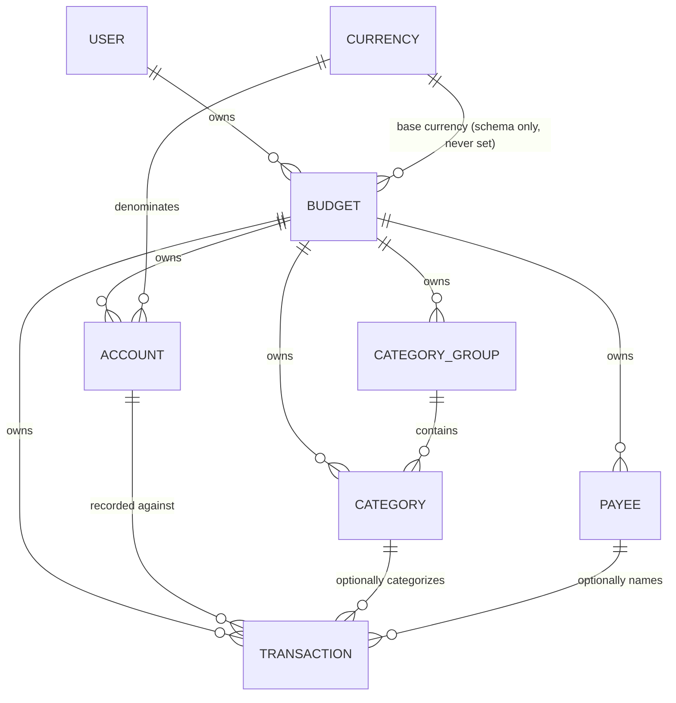

# Budgetoid — Business Logic Overview

## Business summary

Budgetoid is a **personal budgeting app with no sharing**. A person creates an account once, in a
single consented act vouched for by Google and completed with a passkey, and signs in with that
passkey afterwards; then they record money movements so they can see where their money goes. There
is no admin role and no multi-user visibility: everything a signed-in person reaches belongs to a
**Budget** they own, and a budget belongs to exactly one user.

A user owns Budgets. A **Budget** owns **Accounts**, against which signed **Transactions** are
recorded. A negative amount is money spent; a positive amount is money received. A Transaction can
optionally name a **Payee** and select a **Category**. Every Category belongs to one **Category
Group**, while a Transaction may remain uncategorized. **Currencies** are shared ISO-4217 reference
data — the only reference table shared across every budget.

Today every user has **exactly one budget**, created in the same save as the account: there is no
way to create, rename, switch or delete one, and the concept never appears in the UI or in a URL.
The schema is multi-budget-ready anyway, and that gap between what the schema permits and what the
release does is itself a rule — see [budgets.md](budgets.md).

Entity factories enforce the field rules the schema cannot state declaratively and application
handlers enforce cross-entity rules, but whatever the schema can state, it owns: check constraints
bound account type and money magnitude, composite foreign keys refuse a cross-budget reference
whatever code path wrote it, and unique indexes are what make name uniqueness and account creation
race-safe.

Immutability is owned down there too: the application connects as a least-privilege role whose
`UPDATE` privileges are granted per column, so a column left off the list — `budget_id` on every
owned table, `accounts.currency_code`, `users.created_at_utc`, every column of `budgets` and every
column of `credentials` — is one PostgreSQL refuses to write at all
([ADR 0004](../decisions/0004-connect-as-a-least-privilege-role.md)). Tenancy is owned down there as
well, on both axes. `budget_isolation` policies on the five budget-owned tables mean that role
reaches no other budget's rows on any statement and can insert into no budget but the ambient one,
so the query filters above them shape the answer rather than hold the boundary
([ADR 0005](../decisions/0005-isolate-budget-owned-rows-with-row-level-security.md)); the five
tables policed on the **user** instead by `user_isolation` — `users`, `budgets`, `sessions`,
`passkey_signature_counters` and `wrapped_account_keys` — are keyed there because a budget *is* the
tenant and so has no ambient budget to be checked against
([ADR 0011](../decisions/0011-police-the-user-owned-tables.md)). Carrying `user_id` is not by itself
what decides it: `credentials`, `passkey_public_keys`, `recovery_code_hashes` and `session_tokens`
carry one and are policed by neither, exempt by written decision because each is read *before* the
request has an identity a policy could be keyed on
([ADR 0012](../decisions/0012-split-a-passkeys-material-by-whether-it-is-read-before-identity.md)
and [data isolation](../engineering/data-isolation.md)).

That split is a general rule: each rule is owned by the lowest layer that can enforce it
declaratively, and where one deliberately sits higher the doc says why — see
[ADR 0002](../decisions/0002-enforce-rules-at-the-lowest-capable-layer.md). The central tenancy
invariant is documented in [budgets.md](budgets.md); identity, and the one act that brings it into
existence, are in [users-and-ownership.md](users-and-ownership.md).

## Glossary

| Term | Definition |
|---|---|
| **User** | The owner, identified externally by Google `sub` and internally by GUID. On the registration path that GUID is **derived from the ceremony's own challenge** rather than drawn at random, because it is also the WebAuthn user handle the authenticator stores — see [registration.md](registration.md). |
| **Registration** | The one request that brings an account into existence, and the **only** one: a caller the identity provider vouched for completes a WebAuthn ceremony, and the account, its budget, its three credentials, the passkey's key material, ten recovery-code hashes, eleven wrapped-key rows and the session it signs them in on all land in **one save, or none**. See [registration.md](registration.md). |
| **Session** | An established sign-in recorded server-side, naming the credential that established it, which the product can end without asking any external party. Four things establish one — a completed account registration, a verified passkey assertion, a redeemed recovery code, and a regeneration of a recovery-code set that was carrying live sessions, which opens one over the new set in their place. All four mint a handle and set the cookie; a request presenting it is authenticated from it, and `POST /api/me/session/revocation` ends it — see [sessions.md](sessions.md). |
| **Session token** | The handle a session will be presented by — an opaque value stored as `SHA-256(token)` on `session_tokens`, a table of its **own**, because it is read *before* the request has an identity while `sessions` is policed by a policy keyed on the very identity that read produces. Everything decided *after* that answer — expiry, revocation — stays on the policed row. It travels in the `__Host-budgetoid-session` cookie, is minted by all four paths that establish a session, and never appears in a response body — the cookie is `HttpOnly` so that nothing else is a handle. See [sessions.md](sessions.md) and [ADR 0019](../decisions/0019-authenticate-a-request-from-a-first-party-session-cookie.md). |
| **First-party request** | A request carrying a non-empty `X-Budgetoid-Client` header, which every route but `GET /health` requires. The CSRF control a cookie makes necessary: no cross-site form can add a header, and its *value* is deliberately unchecked because a value would be a shared secret shipped to every client. It covers the anonymous routes too — those are the ones that set a cookie. See [sessions.md](sessions.md). |
| **Passkey** | A WebAuthn discoverable credential held by the user's authenticator. One of the two credential types that open a session reaching budget content — see [passkeys.md](passkeys.md). |
| **Recovery code** | A secret the account holder writes down, so that losing the authenticator does not mean losing the account. **Minted in the browser; the server never sees one** — what it stores is `SHA-256` of a verifier the client derived. Redeeming one deletes its row, and there is no third state — see [recovery-codes.md](recovery-codes.md). |
| **Verifier** | `V = HKDF(canonical(code), …)`, exactly 32 bytes, derived on the client from a recovery code and the only thing about that code the server ever receives. The canonicalisation is part of the definition rather than a step in front of it — see [recovery-codes.md](recovery-codes.md). The account's key-encryption key comes off the same code on an **independent** HKDF branch, which is why a code reaching the server would hand the operator that key and a verifier does not. |
| **Recovery-code set** | The ten codes an account is issued together, standing in the schema as **one** `credentials` row with one `recovery_code_hashes` row per unredeemed code. An account holds at most one set; issuing replaces it rather than adding to it. Registration issues the **first** one, in the same act that creates the account. |
| **Recovery factor** | One secret an account holder possesses that can get them back into the account — **not** the same as one credential. A registered passkey is one factor; a set of recovery codes is **ten**, because each code is a secret of its own and a person redeems whichever one they still have. A federated credential is neither: it returns claims rather than a secret. Each factor **carries its own wrapped copy of the account's keys**, written in the same save as the credential by the only three paths that create one. A passkey opens its own copy in the browser, on a sign-in and again from the Account keys section of `/app/settings`; nothing redeems a code in a browser yet. See [Account Keys](account-keys.md). |
| **Locked account** | An account whose **browser** does not hold the content key. Every tab starts locked, because nothing about the keys survives a page load, and presenting a factor is what leaves the state — from a sign-in, or from the **Unlock** control in the Account keys section of `/app/settings`, which is the only one of the two a signed-in person can reach. Not to be confused with a **locked session** below: that is a fact about a row in `sessions` and about what the server will answer, while this is a fact about what one document in one browser is holding. A person on a full session whose tab was reloaded is signed in and locked. See [Account Keys](account-keys.md). |
| **Content key** | 32 random bytes an account owns, generated in the browser, that its narrative will be encrypted under. Never transmitted. One per account and never per credential — a key derived per credential would make text written on one authenticator unreadable on another. |
| **Index key** | 32 random bytes an account owns, drawn independently of the content key, that a blind index over a name **is** computed under — the browser computes one today, and `accounts.name_key`, `payees.name_key` and `category_groups.name_key` are the three columns that store one. Never transmitted. One per account, and the reason is stronger than the content key's: two index keys produce two index values for one name, so the uniqueness constraint stops colliding while appearing to work. |
| **Blind index** | The keyed fingerprint of a name that lets a server holding none of the plaintext find the rows sharing one: `HMAC-SHA-256` under the account's index key over the grammar's version, the table, the column and the **normalized** name, rendered as 43 characters of unpadded base64url. Deterministic on purpose — that is what a uniqueness constraint and an equality lookup need — and it carries **no row identifier**, which is the exact inverse of the narrative binding. Not an envelope and nothing to open. See [Account Keys](account-keys.md). |
| **Normalized name** | The bytes a blind index is taken over: trim, NFKC, **full** case fold, UTF-8, in that order, over a fold table this product ships at a Unicode version it chooses rather than the host's. A different transform from anything the sealing path does, which normalises nothing. Two consequences are contract rather than defect: `İstanbul` and `istanbul` are two names, and a blind index cannot be recomputed once written, because the plaintext behind it is encrypted. See [Account Keys](account-keys.md). |
| **Key-encryption key** | 32 bytes a recovery factor derives — from an authenticator's PRF output, or from a recovery code — and wraps the account's two keys under. Imported as a **non-extractable** `AES-GCM` key, never transmitted, and never readable back out of the browser's key store. That is a claim about the imported key; the bytes it was derived from exist for the length of the derivation and are zero-filled where it consumes them — see [Account Keys](account-keys.md). |
| **Ciphertext envelope** | The one AEAD framing everything this product encrypts is carried in: `version(1) ‖ nonce(12) ‖ ciphertext ‖ tag(16)`, unpadded base64url on the wire, with `0x01` — AES-256-GCM, 96-bit nonce, 128-bit tag — the only version defined. Twenty-nine bytes is its **floor** and not a width, because an empty plaintext is legal and seals to exactly that. The binding a ciphertext carries is **not inside it**: associated data is rebuilt from wherever the ciphertext was found, which is what makes one moved elsewhere fail to authenticate — and what makes a changed grammar byte unopen everything already sealed. Two consumers, two grammars, one format — see [Ciphertext Envelope](ciphertext-envelope.md). |
| **Narrative field** | Free text a person typed into their ledger, and the second consumer of the envelope above. Eight `table.column` pairs across six entities carry one. On the server it is a **value type** — the only thing a narrative column accepts — with no constructor, factory or conversion taking a `string`, so writing plaintext into one does not compile. That absent member, and not any test, is what holds "no narrative value is ever server-readable". **Five of the eight exist as columns**: `budgets.name` — `bytea`, nullable, with a length band and a version check, reached by no route, so every row is NULL; `accounts.name`, `payees.name` and `category_groups.name`, each `NOT NULL` and each carrying a blind index beside it; and `category_groups.description`, nullable and carrying no index, the first sealed **free-text** column in the product. All four of the latter are reached by routes that accept the sealed shape, though no browser sends one yet. See [Ciphertext Envelope](ciphertext-envelope.md), [Accounts](accounts.md), [Payees](payees.md) and [Categories and Category Groups](categories.md). |
| **Narrative field cap** | How large a sealed narrative field may be: **1024 bytes** for the five name columns, **2560** for the three description columns. Two numbers over field *classes*, never eight over fields. They bound the **envelope** and not the text — the only length this side can measure — so the plaintext underneath is 29 bytes shorter and the server never sees a character. Not to be read, or "corrected", as a character limit. Both numbers have live columns behind them now; the description class's first is `category_groups.description`. |
| **Indexed name** | A sealed name and the blind index over it, as the one value a searchable name column pair holds. It says a **call** cannot be half; the schema's `NOT NULL` pair says a **row** cannot, and neither replaces the other. There is deliberately no separate blind-index type: an index is meaningless apart from the name it was taken over. |
| **Wrapped key** | An account key sealed under a factor's key-encryption key, in the ciphertext envelope above — exactly 61 bytes over a 32-byte key, a width rather than a cap, and the entity's own rule rather than the format's. The only one of these four that ever reaches the server. |
| **Factor identifier** | The client-minted `factor_id` of a `wrapped_account_keys` row, and the value a wrapped key's associated data binds it to, so a copy moved to another factor fails to authenticate. Deliberately **not** the credential id — see [ADR 0018](../decisions/0018-give-the-wrapped-account-keys-a-policed-table-and-their-own-factor-identifier.md). |
| **Submission** | One code's share of a request that issues a set: that code's verifier, its own client-minted factor identifier, and the account's two keys wrapped under a key-encryption key derived from **that** code. `POST /api/me/recovery-codes` and `POST /api/registration` each carry ten of them on a member spelled `codes`, never ten bare verifiers — the shape follows from a set being ten factors rather than one, and the shared name is one wire contract for both write paths. See [recovery-codes.md](recovery-codes.md). |
| **Card** | The physical artifact a recovery-code set is written or printed on. Not a modelled thing — nothing in the schema, the API or the client knows it exists — but the word several rules turn on, because losing *it* is the event regeneration answers and transcribing *it* is what canonicalisation forgives. Use it only for the artifact; the ten codes themselves are the **recovery-code set**. |
| **WebAuthn ceremony** | One of the four exchanges a passkey takes part in: account registration, which creates the account the passkey will reach; registration, which attaches a further passkey to an account that exists; assertion, which signs in with one; and re-authentication, which re-proves possession before an action too destructive to take on a bearer token alone. Each runs in two legs — a server-issued nonce, then a signed response — and each nonce is bound to its own pool, spendable in no other. **An assertion the browser mints for itself is not one of the four**: unlocking an account runs a ceremony with no endpoint, no pool and nothing on the server to check it, because what it proves is proved by the envelopes opening — see [Account Keys](account-keys.md). |
| **User handle** | The `user.id` a registration ceremony hands the authenticator, which the authenticator stores forever and presents on every later assertion. It **is** the account identifier, compared byte-for-byte with nothing to look up first, which is why registration derives that identifier from the ceremony's own challenge rather than choosing it — see [registration.md](registration.md). |
| **Revocation** | Removing one way of signing in. Revoking a **passkey** deletes its credential row, and the sessions, key and counter beneath it go with it; the account must keep at least one passkey, so the last one is refused. Revoking a **session** is the opposite shape — a column written, never a row removed. The federated credential is revoked by neither: it is replaced — see [passkeys.md](passkeys.md) and [sessions.md](sessions.md). |
| **PRF** | The WebAuthn `prf` extension: a secret the authenticator derives and the server never sees. Requested at registration and **required** for one to complete — a registration completes only when the client reports a `prf` result that is present and true, so reporting nothing and reporting `enabled: false` are alike refused. The claim is the client's and unverifiable, so the refusal is a product gate rather than a control; the product stores nothing about it. See [passkeys.md](passkeys.md). |
| **Relying party** | The site a passkey is bound to, named by its `rpId`. An authenticator signs over `SHA-256(rpId)`, so a credential registered here cannot be asserted anywhere else. |
| **Locked session** | A session established from a federated credential. `federated` is the **only** credential type that cannot reach budget content, because an authorization exchange returns claims rather than a secret a client can turn into a key. |
| **Full session** | The kind of session a credential the holder actually possesses opens: a passkey, held by their authenticator, or a set of recovery codes, which they wrote down. The key custody each carries reaches every account there is — registration is the only way an account exists, and it wraps the account's keys under the passkey and under every one of its ten codes — and on the passkey half the browser now **opens** it, deriving a key-encryption key from the assertion and holding the account's two keys for the visit. Nothing redeems a code in a browser yet, so on that half possession is still the whole of the reason. All four establishing paths give 14 days. |
| **Budget** | A coherent pool of money owned by one user, created for them in the save that creates their account; the unit of tenancy and the thing that owns the money picture. Its **name is a sealed narrative envelope**, so this server can neither read it nor compare two of them: budget names are not unique per owner, and that uniqueness is **surrendered** rather than deferred — `budgets.name` gets no blind index — see [budgets.md](budgets.md). |
| **Erasure** | Destroying an account and everything owned beneath it, so that no row in any table references the erased user or any budget it owned. Not a status and not a soft delete: nothing is marked, and no row survives to record that it happened — see [erasure.md](erasure.md). |
| **Export document** | The single JSON object an export answers with: a schema version, the user record, and every budget the user owns, each carrying its accounts, category groups, categories, payees and transactions as nested arrays. Nothing in it is summarized, sampled or paged, and assembling it writes no row — see [export.md](export.md). |
| **Schema version** | The integer identifying the shape of an export document. A saved file outlives the deployment that wrote it, so the version is the only thing telling a reader which shape they are holding. |
| **Unnamed budget** | The budget registration creates in the account's own save. It has no name — `name` is null — and a client shows its own localized label in place of one. A user has at most one of these; named budgets are unconstrained in number. The invariant keys on the *absence of a name* rather than on a "default" flag or a well-known name, which is what makes it hold for a writer that does not exist yet — and it is now the **only** thing the unique index over `(user_id, name)` still refuses, since two seals of one name are two different byte strings. See [budgets.md](budgets.md#business-rules--invariants). "Default budget" names the same row from the factory's side (`Budget.CreateDefault`); prefer "unnamed budget" when the rule turns on the missing name. |
| **Ambient budget** | The one budget a request is scoped to, read from the account while the request authenticates and exposed through `IBudgetContext`. Never supplied by the client. |
| **Base currency** | A nullable ISO-4217 code on the Budget, reserved for a planning layer. Nothing writes it, so it is null on every Budget. |
| **Account** | A budget-owned place money lives, denominated in one Currency. Its **name is a sealed narrative envelope with a blind index beside it**, so this server cannot read it and can still refuse a duplicate: one name per budget survives the sealing, over `name_key` rather than over `name`. What did not survive is every server-side rule about the text — blankness, length, case folding — see [accounts.md](accounts.md). |
| **Account Type** | `Checking`, `Savings`, `Cash`, or `CreditCard`; a label, not a state machine. |
| **Opening Balance** | The starting balance at account creation; no current/running balance is modeled yet. |
| **Transaction** | A money movement against an Account on a calendar date. |
| **Amount** | Signed Transaction value: negative expense, positive income, zero a recorded event that nets to nothing. |
| **Payee** | Budget-owned counterparty, **created by a request of its own** and never shared across budgets. Its name is a sealed narrative envelope with a blind index beside it, so this server can neither read one nor look one up: find-or-create by name became unimplementable, and the client resolves the counterparty against the list it can decrypt before it posts. One counterparty is still one row, now refused by `IX_payees_budget_id_name_key`; what is lost is that a payee row implied a transaction. Its name is correctable in place, which is the only write a payee accepts in its own right — see [payees.md](payees.md). |
| **Category Group** | Budget-owned, manually ordered container for Categories, e.g. “Essential Obligations.” Its **name is a sealed narrative envelope with a blind index beside it**, so this server cannot read it and can still refuse a duplicate: one name per budget survives the sealing, over `name_key`. Its **note is a sealed envelope with nothing beside it** — the first sealed free-text column in the product, nullable, capped at the description class's number and never blind-indexed, because a note is not looked up. What did not survive is every server-side rule about either text — blankness, length, case folding — see [categories.md](categories.md). |
| **Category** | Budget-owned transaction classification belonging to exactly one Category Group, e.g. “Groceries.” Its name and description **still hold plaintext**, still collated case-insensitively and still measured by the server, which is the half of [categories.md](categories.md) that has not moved yet. |
| **Position** | Zero-based persisted user order: budget-wide for Category Groups and group-scoped for Categories. |
| **Currency** | Shared ISO-4217 reference row that denominates Accounts. A Budget references the same table for its base currency, never populated. |
| **Minor Unit** | Currency decimal places — 0 for JPY, 2 for USD, 3 for BHD. Bounds the decimal places any amount recorded in that currency may carry. |

## User roles

There is exactly **one role — the authenticated owner — reached by two tiers of session.**
Everything below describes an owner signed in on a **full** session, which is what a passkey or a
redeemed recovery code opens. A **locked** session, which only a federated sign-in opens, is the
same person with the same ownership and reaches exactly one route: ending itself. Every other route
answers `403`, including the export and the erasure. That is not a second role — nothing is scoped
differently and nobody else is admitted anywhere — it is the same owner whose credential cannot hold
the account's keys. See [sessions.md](sessions.md).

Within their ambient budget a user manages Accounts, Category Groups, and Categories; records,
lists, edits and deletes Transactions; lists Payees, creates one through a request of its own, reads
one by id and renames it; and reads global Currencies. The budget itself is not manageable — it
arrives with the account, never configured. The same owner can download a complete copy of
everything the server holds about them, can see the address the account is registered under, can
issue themselves a set of recovery codes and ask how many are left, and can destroy the account
outright; none of it is behind a support request. A visitor with no session reaches the welcome
screen — which both starts an account and signs a returning person in with their passkey, contacting
no third party to do it — and the registration flow, the one surface that turns a provider sign-in
into an account. Nothing else.

## Domain area map

Relationships only; each Tier 2 file carries its own entity attributes.

```mermaid
erDiagram
    USER ||--o{ BUDGET : owns
    BUDGET ||--o{ ACCOUNT : owns
    BUDGET ||--o{ CATEGORY_GROUP : owns
    BUDGET ||--o{ CATEGORY : owns
    BUDGET ||--o{ PAYEE : owns
    BUDGET ||--o{ TRANSACTION : owns
    ACCOUNT ||--o{ TRANSACTION : "recorded against"
    CATEGORY_GROUP ||--o{ CATEGORY : contains
    CATEGORY ||--o{ TRANSACTION : "optionally categorizes"
    PAYEE ||--o{ TRANSACTION : "optionally names"
    CURRENCY ||--o{ ACCOUNT : denominates
    CURRENCY ||--o{ BUDGET : "base currency (schema only, never set)"
```

Currency is global reference data. A Budget is scoped to exactly one user; every other entity is
scoped to exactly one Budget. Category membership and a Transaction's Account, Category and Payee
references are additionally constrained by composite foreign keys to a row in the same Budget.

## Table of contents

- [Users & Ownership](users-and-ownership.md) — identity, the provider claims that gate its
  creation, and how a request comes to name an account.
- [Registration](registration.md) — the one request that creates an account, the account identifier
  it derives rather than chooses, and one of the four paths that open a session.
- [Passkeys](passkeys.md) — the four WebAuthn ceremonies, and one of the four paths that open a
  session.
- [Recovery Codes](recovery-codes.md) — the second way back into an account, minted in the browser
  and never seen by the server, and two more paths that open a session.
- [Account Keys](account-keys.md) — the one pair of keys an account owns, the key-encryption key
  each recovery factor derives, the blind index and the normalization it is taken over, and the
  cross-client cryptographic contract.
- [Ciphertext Envelope](ciphertext-envelope.md) — the one AEAD framing both consumers share, the
  two grammars that bind a ciphertext to where it lives, and what the server can check without
  holding a key.
- [Sessions](sessions.md) — an established sign-in the product records and can end itself.
- [Budgets](budgets.md) — the pool of money a user presides over, the unit of tenancy, its default,
  and its base currency.
- [Accounts](accounts.md) — account types, currency denomination, and delete guard.
- [Transactions](transactions.md) — transaction rules, optional payee and category context, partial
  edit, and delete.
- [Payees](payees.md) — counterparties, created by a route of their own now that the server cannot
  look one up by name, and renamed in place.
- [Categories and Category Groups](categories.md) — hierarchy, uniqueness, ordering, movement, and
  delete guards — and the one chapter where a sealed level and a plaintext level sit side by side.
- [Currencies](currencies.md) — global ISO-4217 reference data.
- [Erasure](erasure.md) — the one action that destroys an account and everything under it, and the
  order it has to delete in.
- [Export](export.md) — the complete copy of a person's own data, and why it refuses rather than
  hands back the part it can reach.

Non-obvious decisions are recorded in [_decision-log.md](_decision-log.md).
