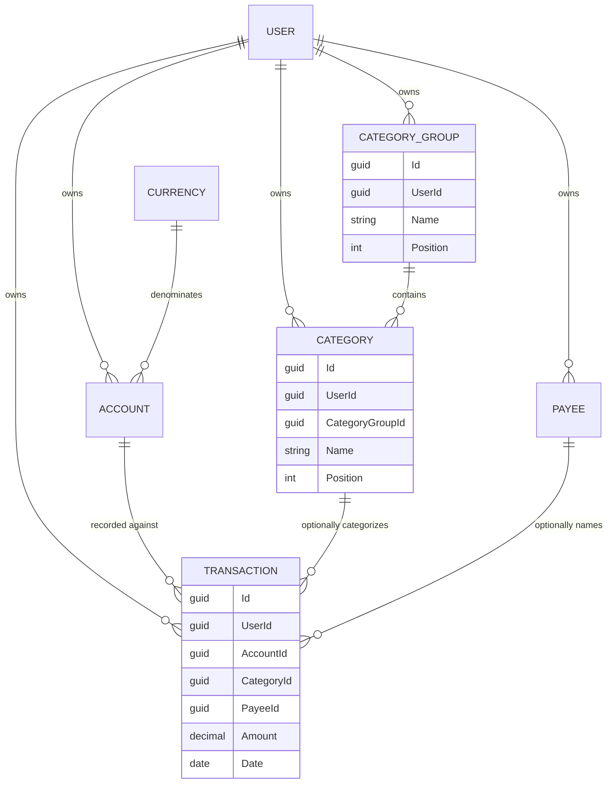

# Budgetoid — Business Logic Overview

## Business summary

Budgetoid is a **single-user personal budgeting app**. A person signs in with Google, then records
money movements so they can see where their money goes. Everything a signed-in person sees and
touches belongs to them alone — there is no sharing, admin role, or multi-user visibility.

A user owns **Accounts** and records signed **Transactions** against them. A negative amount is money
spent; a positive amount is money received. A Transaction can optionally name a **Payee** and select
a **Category**. Every Category belongs to one **Category Group**, while a Transaction may remain
uncategorized. **Currencies** are shared ISO-4217 reference data.

Entity factories enforce field rules; application handlers enforce cross-entity rules. PostgreSQL
constraints remain the race-safe backstop. The central ownership invariant is documented in
[users-and-ownership.md](users-and-ownership.md).

## Glossary

| Term | Definition |
|---|---|
| **User** | The owner, identified externally by Google `sub` and internally by GUID. |
| **Account** | A user-owned place money lives, denominated in one Currency. |
| **Account Type** | `Checking`, `Savings`, `Cash`, or `CreditCard`; a label, not a state machine. |
| **Opening Balance** | The starting balance at account creation; no current/running balance is modeled yet. |
| **Transaction** | A money movement against an Account on a calendar date. |
| **Amount** | Signed Transaction value: negative expense, positive income; never zero. |
| **Payee** | User-owned counterparty, entered as find-or-create free text. |
| **Category Group** | User-owned, manually ordered container for Categories, e.g. “Essential Obligations.” |
| **Category** | User-owned transaction classification belonging to exactly one Category Group, e.g. “Groceries.” |
| **Position** | Zero-based persisted user order: user-wide for Category Groups and group-scoped for Categories. |
| **Currency** | Shared ISO-4217 reference row used by Accounts. |
| **Minor Unit** | Currency decimal places, e.g. 2 for USD and 0 for JPY. |

## User roles

There is exactly **one role: the authenticated owner.** A user manages their own Accounts, Category
Groups, and Categories; creates/lists their Transactions and Payees; and reads global Currencies.
Unauthenticated visitors can only reach public login/welcome behavior.

## Domain area map

```mermaid
erDiagram
    USER ||--o{ ACCOUNT : owns
    USER ||--o{ CATEGORY_GROUP : owns
    USER ||--o{ CATEGORY : owns
    USER ||--o{ PAYEE : owns
    USER ||--o{ TRANSACTION : owns
    ACCOUNT ||--o{ TRANSACTION : "recorded against"
    CATEGORY_GROUP ||--o{ CATEGORY : contains
    CATEGORY ||--o{ TRANSACTION : "optionally categorizes"
    PAYEE ||--o{ TRANSACTION : "optionally names"
    CURRENCY ||--o{ ACCOUNT : denominates

    TRANSACTION {
        guid Id
        guid UserId
        guid AccountId
        guid CategoryId
        guid PayeeId
        decimal Amount
        date Date
    }
    CATEGORY_GROUP {
        guid Id
        guid UserId
        string Name
        int Position
    }
    CATEGORY {
        guid Id
        guid UserId
        guid CategoryGroupId
        string Name
        int Position
    }
```

Currency is global reference data. Every other entity is scoped to exactly one user. Category
membership is additionally constrained to a Category Group with the same owner.

## Table of contents

- [Users & Ownership](users-and-ownership.md) — identity, provisioning, and tenant isolation.
- [Accounts](accounts.md) — account types, currency denomination, and delete guard.
- [Transactions](transactions.md) — transaction rules, Payees, and optional categorization.
- [Categories and Category Groups](categories.md) — hierarchy, uniqueness, ordering, movement, and
  delete guards.
- [Groups (Legacy Terminology)](groups.md) — pointer retained for historical links.
- [Currencies](currencies.md) — global ISO-4217 reference data.

Non-obvious decisions are recorded in [_decision-log.md](_decision-log.md).
