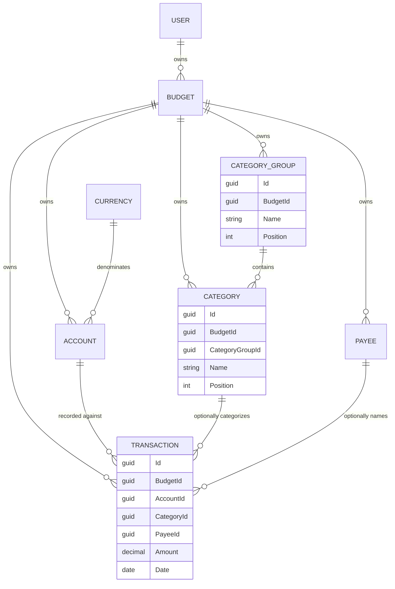

# Budgetoid — Business Logic Overview

## Business summary

Budgetoid is a **single-user personal budgeting app**. A person signs in with Google, then records
money movements so they can see where their money goes. There is no sharing, admin role, or
multi-user visibility: everything a signed-in person reaches belongs to a **Budget** they own, and a
budget belongs to exactly one user.

A user owns Budgets. A **Budget** owns **Accounts**, against which signed **Transactions** are
recorded. A negative amount is money spent; a positive amount is money received. A Transaction can
optionally name a **Payee** and select a **Category**. Every Category belongs to one **Category
Group**, while a Transaction may remain uncategorized. **Currencies** are shared ISO-4217 reference
data — the one table no budget owns.

Entity factories enforce field rules; application handlers enforce cross-entity rules. PostgreSQL
constraints remain the race-safe backstop. The central tenancy invariant — the budget, not the user,
is what everything belongs to — is documented in [budgets.md](budgets.md); identity and provisioning
are in [users-and-ownership.md](users-and-ownership.md).

## Glossary

| Term | Definition |
|---|---|
| **User** | The owner, identified externally by Google `sub` and internally by GUID. |
| **Budget** | A coherent pool of money owned by one user, created for them at provisioning; the unit of tenancy and the thing that owns the money picture. |
| **Base currency** | The unit a Budget plans in, an optional ISO-4217 code on the Budget. |
| **Account** | A budget-owned place money lives, denominated in one Currency. |
| **Account Type** | `Checking`, `Savings`, `Cash`, or `CreditCard`; a label, not a state machine. |
| **Opening Balance** | The starting balance at account creation; no current/running balance is modeled yet. |
| **Transaction** | A money movement against an Account on a calendar date. |
| **Amount** | Signed Transaction value: negative expense, positive income; never zero. |
| **Payee** | Budget-owned counterparty, entered as find-or-create free text; never shared across budgets. |
| **Category Group** | Budget-owned, manually ordered container for Categories, e.g. “Essential Obligations.” |
| **Category** | Budget-owned transaction classification belonging to exactly one Category Group, e.g. “Groceries.” |
| **Position** | Zero-based persisted user order: budget-wide for Category Groups and group-scoped for Categories. |
| **Currency** | Shared ISO-4217 reference row used by Accounts. |
| **Minor Unit** | Currency decimal places, e.g. 2 for USD and 0 for JPY. |

## User roles

There is exactly **one role: the authenticated owner.** Within their own budget a user manages
Accounts, Category Groups, and Categories; creates/lists Transactions and Payees; and reads global
Currencies.
Unauthenticated visitors can only reach public login/welcome behavior.

## Domain area map

```mermaid
erDiagram
    USER ||--o{ BUDGET : owns
    BUDGET ||--o{ ACCOUNT : owns
    BUDGET ||--o{ CATEGORY_GROUP : owns
    BUDGET ||--o{ CATEGORY : owns
    BUDGET ||--o{ PAYEE : owns
    BUDGET ||--o{ TRANSACTION : owns
    ACCOUNT ||--o{ TRANSACTION : "recorded against"
    CATEGORY_GROUP ||--o{ CATEGORY : contains
    CATEGORY ||--o{ TRANSACTION : "optionally categorizes"
    PAYEE ||--o{ TRANSACTION : "optionally names"
    CURRENCY ||--o{ ACCOUNT : denominates

    TRANSACTION {
        guid Id
        guid BudgetId
        guid AccountId
        guid CategoryId
        guid PayeeId
        decimal Amount
        date Date
    }
    CATEGORY_GROUP {
        guid Id
        guid BudgetId
        string Name
        int Position
    }
    CATEGORY {
        guid Id
        guid BudgetId
        guid CategoryGroupId
        string Name
        int Position
    }
```

Currency is global reference data. A Budget is scoped to exactly one user; every other entity is
scoped to exactly one Budget. Category membership and a Transaction's Account, Category and Payee
references are additionally constrained by composite foreign keys to a row in the same Budget.

## Table of contents

- [Users & Ownership](users-and-ownership.md) — identity, claims, and provisioning.
- [Budgets](budgets.md) — the pool of money a user presides over, the unit of tenancy, its default,
  and its base currency.
- [Accounts](accounts.md) — account types, currency denomination, and delete guard.
- [Transactions](transactions.md) — transaction rules, Payees, and optional categorization.
- [Categories and Category Groups](categories.md) — hierarchy, uniqueness, ordering, movement, and
  delete guards.
- [Currencies](currencies.md) — global ISO-4217 reference data.

Non-obvious decisions are recorded in [_decision-log.md](_decision-log.md).
