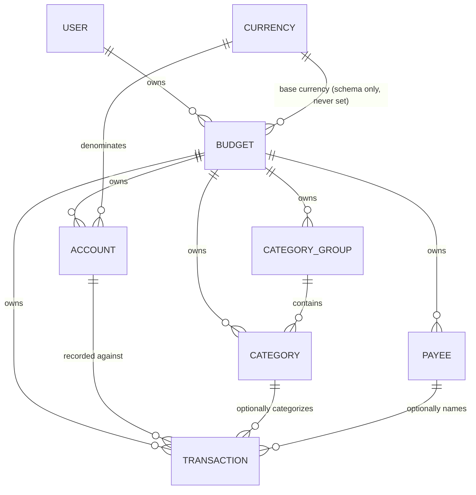

# Budgetoid — Business Logic Overview

## Business summary

Budgetoid is a **personal budgeting app with no sharing**. A person signs in with Google, then
records money movements so they can see where their money goes. There is no admin role and no
multi-user visibility: everything a signed-in person reaches belongs to a **Budget** they own, and a
budget belongs to exactly one user.

A user owns Budgets. A **Budget** owns **Accounts**, against which signed **Transactions** are
recorded. A negative amount is money spent; a positive amount is money received. A Transaction can
optionally name a **Payee** and select a **Category**. Every Category belongs to one **Category
Group**, while a Transaction may remain uncategorized. **Currencies** are shared ISO-4217 reference
data — the only reference table shared across every budget.

Today every user has **exactly one budget**, created for them at sign-in: there is no way to create,
rename, switch or delete one, and the concept never appears in the UI or in a URL. The schema is
multi-budget-ready anyway, and that gap between what the schema permits and what the release does is
itself a rule — see [budgets.md](budgets.md).

Entity factories enforce the field rules the schema cannot state declaratively and application
handlers enforce cross-entity rules, but whatever the schema can state, it owns: check constraints
bound account type and money magnitude, composite foreign keys refuse a cross-budget reference
whatever code path wrote it, and unique indexes are what make name uniqueness and provisioning
race-safe. Immutability is owned down there too: the application connects as a least-privilege role
whose `UPDATE` privileges are granted per column, so a column left off the list — `budget_id` on
every owned table, `accounts.currency_code`, `users.created_at_utc`, every column of `budgets` and
every column of `credentials` — is one PostgreSQL refuses to write at all (see
[ADR 0004](../decisions/0004-connect-as-a-least-privilege-role.md)). Tenancy is owned down there as
well, on both axes. `budget_isolation` policies on the five budget-owned tables mean that role
reaches no other budget's rows on any statement at all and can insert into no budget but the ambient
one, so the query filters above them shape the answer rather than hold the boundary (see
[ADR 0005](../decisions/0005-isolate-budget-owned-rows-with-row-level-security.md)); and the three
tables that name a person, `users`, `budgets` and `sessions`, are policed on the **user** instead by
`user_isolation`, because a budget *is* the tenant and so has no ambient budget to be checked
against (see [ADR 0011](../decisions/0011-police-the-user-owned-tables.md)). That split is a
general rule rather than a local one: each rule is owned by the lowest layer that can enforce it
declaratively, and where one deliberately sits higher the doc says why — see
[ADR 0002](../decisions/0002-enforce-rules-at-the-lowest-capable-layer.md). The central tenancy
invariant — the budget, not the user, is what everything belongs to — is documented in
[budgets.md](budgets.md); identity and provisioning are in
[users-and-ownership.md](users-and-ownership.md).

## Glossary

| Term | Definition |
|---|---|
| **User** | The owner, identified externally by Google `sub` and internally by GUID. |
| **Session** | An established sign-in recorded server-side, naming the credential that established it, which the product can end without asking any external party. A verified passkey assertion establishes one; nothing issues a token for it yet — see [sessions.md](sessions.md). |
| **Passkey** | A WebAuthn discoverable credential held by the user's authenticator. The only credential type that opens a session reaching budget content — see [passkeys.md](passkeys.md). |
| **WebAuthn ceremony** | One of the two exchanges a passkey takes part in: registration, which attaches a passkey to an account, and assertion, which signs in with one. Each runs in two legs — a server-issued nonce, then a signed response. |
| **PRF** | The WebAuthn `prf` extension: a secret the authenticator derives and the server never sees. Requested at registration and **required** for one to complete — a registration completes only when the client reports a `prf` result that is present and true, so reporting nothing and reporting `enabled: false` are alike refused. The claim is the client's and unverifiable, so the refusal is a product gate rather than a control; the product stores nothing about it. See [passkeys.md](passkeys.md). |
| **Relying party** | The site a passkey is bound to, named by its `rpId`. An authenticator signs over `SHA-256(rpId)`, so a credential registered here cannot be asserted anywhere else. |
| **Locked session** | A session established from a federated credential. It reaches no budget content, because an authorization exchange returns claims rather than a secret a client can turn into a key. |
| **Full session** | A session established from a passkey — the only credential type whose authenticator can hold the account's keys, and so the only one that opens a session reaching budget content. |
| **Budget** | A coherent pool of money owned by one user, created for them at provisioning; the unit of tenancy and the thing that owns the money picture. |
| **Erasure** | Destroying an account and everything owned beneath it, so that no row in any table references the erased user or any budget it owned. Not a status and not a soft delete: nothing is marked, and no row survives to record that it happened — see [erasure.md](erasure.md). |
| **Export document** | The single JSON object an export answers with: a schema version, the user record, and every budget the user owns, each carrying its accounts, category groups, categories, payees and transactions as nested arrays. Nothing in it is summarized, sampled or paged, and assembling it writes no row — see [export.md](export.md). |
| **Schema version** | The integer identifying the shape of an export document. A saved file outlives the deployment that wrote it, so the version is the only thing telling a reader which shape they are holding. |
| **Provisioning** | The step that turns an authenticated Google principal into an internal user and an ambient budget, run on every authenticated request. |
| **Unnamed budget** | The budget provisioning creates when a user owns none. It has no name — `name` is null — and a client shows its own localized label in place of one. A user has at most one of these; named budgets are unconstrained in number. The invariant keys on the *absence of a name* rather than on a "default" flag or a well-known name, which is what makes provisioning race-safe — see [budgets.md](budgets.md#business-rules--invariants). "Default budget" names the same row from the provisioning side (`Budget.CreateDefault`, "find-or-create the user's default budget"); prefer "unnamed budget" when the rule turns on the missing name. |
| **Ambient budget** | The one budget a request is scoped to, resolved server-side at provisioning and read through `IBudgetContext`. Never supplied by the client. |
| **Base currency** | A nullable ISO-4217 code on the Budget, reserved for a planning layer. Nothing writes it, so it is null on every Budget. |
| **Account** | A budget-owned place money lives, denominated in one Currency. |
| **Account Type** | `Checking`, `Savings`, `Cash`, or `CreditCard`; a label, not a state machine. |
| **Opening Balance** | The starting balance at account creation; no current/running balance is modeled yet. |
| **Transaction** | A money movement against an Account on a calendar date. |
| **Amount** | Signed Transaction value: negative expense, positive income, zero a recorded event that nets to nothing. |
| **Payee** | Budget-owned counterparty, entered as find-or-create free text; never shared across budgets. Its name is correctable in place, which is the only write a payee accepts in its own right. |
| **Category Group** | Budget-owned, manually ordered container for Categories, e.g. “Essential Obligations.” |
| **Category** | Budget-owned transaction classification belonging to exactly one Category Group, e.g. “Groceries.” |
| **Position** | Zero-based persisted user order: budget-wide for Category Groups and group-scoped for Categories. |
| **Currency** | Shared ISO-4217 reference row that denominates Accounts. A Budget references the same table for its base currency, never populated. |
| **Minor Unit** | Currency decimal places — 0 for JPY, 2 for USD, 3 for BHD. Bounds the decimal places any amount recorded in that currency may carry. |

## User roles

There is exactly **one role: the authenticated owner.** Within their ambient budget a user manages
Accounts, Category Groups, and Categories; records, lists, edits and deletes Transactions; lists
Payees, creates them implicitly by naming one on a transaction, and renames them; and reads global
Currencies. The budget itself is not manageable — it is provisioned, never configured. The same
owner can download a complete copy of everything the server holds about them, and can destroy the
account outright; neither is behind a support request. Unauthenticated visitors can only reach public
login/welcome behavior.

## Domain area map

Relationships only; each Tier 2 file carries its own entity attributes.

```mermaid
erDiagram
    USER ||--o{ BUDGET : owns
    BUDGET ||--o{ ACCOUNT : owns
    BUDGET ||--o{ CATEGORY_GROUP : owns
    BUDGET ||--o{ CATEGORY : owns
    BUDGET ||--o{ PAYEE : owns
    BUDGET ||--o{ TRANSACTION : owns
    ACCOUNT ||--o{ TRANSACTION : "recorded against"
    CATEGORY_GROUP ||--o{ CATEGORY : contains
    CATEGORY ||--o{ TRANSACTION : "optionally categorizes"
    PAYEE ||--o{ TRANSACTION : "optionally names"
    CURRENCY ||--o{ ACCOUNT : denominates
    CURRENCY ||--o{ BUDGET : "base currency (schema only, never set)"
```

Currency is global reference data. A Budget is scoped to exactly one user; every other entity is
scoped to exactly one Budget. Category membership and a Transaction's Account, Category and Payee
references are additionally constrained by composite foreign keys to a row in the same Budget.

## Table of contents

- [Users & Ownership](users-and-ownership.md) — identity, claims, and provisioning.
- [Passkeys](passkeys.md) — the two WebAuthn ceremonies, and the only path that opens a session
  reaching budget content.
- [Sessions](sessions.md) — an established sign-in the product records and can end itself.
- [Budgets](budgets.md) — the pool of money a user presides over, the unit of tenancy, its default,
  and its base currency.
- [Accounts](accounts.md) — account types, currency denomination, and delete guard.
- [Transactions](transactions.md) — transaction rules, optional payee and category context, partial
  edit, and delete.
- [Payees](payees.md) — counterparties, created only by naming one on a transaction, and renamed in
  place.
- [Categories and Category Groups](categories.md) — hierarchy, uniqueness, ordering, movement, and
  delete guards.
- [Currencies](currencies.md) — global ISO-4217 reference data.
- [Erasure](erasure.md) — the one action that destroys an account and everything under it, and the
  order it has to delete in.
- [Export](export.md) — the complete copy of a person's own data, and why it refuses rather than
  hands back the part it can reach.

Non-obvious decisions are recorded in [_decision-log.md](_decision-log.md).
