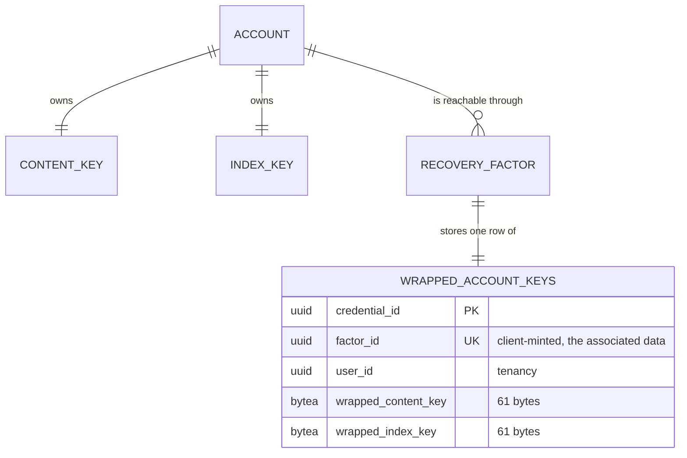

# Account Keys

## Table of Contents

- [Purpose](#purpose)
- [Key Entities](#key-entities)
- [Constraints](#constraints)
  - [MUST](#must)
  - [MUST NOT](#must-not)
- [Business Rules & Invariants](#business-rules--invariants)
- [Workflows & State Transitions](#workflows--state-transitions)
- [Decision Trees](#decision-trees)
- [Integration Points](#integration-points)
- [Edge Cases & Known Gotchas](#edge-cases--known-gotchas)

## Purpose

An account owns **one content key** and **one index key**. The content key is what the narrative
will be encrypted under; the index key is what a blind index over a name will be computed under.
Neither is derived from a credential. Every **recovery factor** — a registered passkey, or a set of
recovery codes — derives its own **key-encryption key** and stores its own **wrapped copy of both**.

That shape is the whole point, and reversing it fails in two different ways. Deriving the content
key per credential is a recovery problem: text written on one authenticator would be unreadable on
another. Deriving the *index* key per credential is worse, because it is a correctness failure —
two index keys produce two blind index values for one name, the uniqueness constraint stops
colliding, and a person signing in from a second device silently accumulates duplicate payees while
the constraint appears to work.

**What is built today is the cryptography, and the two write paths that store its output.** The
client can generate the keys, derive a key-encryption key from either kind of factor, wrap both keys
under it and unwrap them again; the server refuses to register a passkey or issue a set of recovery
codes unless the request carries a factor identifier and both wrapped keys, and files them in the
same save as the credential.

The two halves are not yet joined, and the gap is worth naming precisely: **this client cannot run a
WebAuthn ceremony**, so nothing in the browser can obtain a PRF output from a real authenticator,
and no screen calls the crypto module. The requests the server now demands wrapped keys on are made
today only by the integration suite. Unlocking, the locked state, the blind index and the encryption
of any narrative field are all later work.

## Key Entities

- **Content key** — 32 random bytes, generated in the browser. Never transmitted.
- **Index key** — 32 random bytes, generated in the browser, drawn independently of the content key.
  Never transmitted.
- **Key-encryption key** — 32 bytes derived from a recovery factor by HKDF-SHA-256, imported as a
  **non-extractable** `AES-GCM` `CryptoKey`. Never transmitted, and never readable back out of the
  browser's key store.
- **Wrapped key** — the versioned envelope of §5.3 over a 32-byte key. Exactly 61 bytes. This is the
  only one of the four that ever reaches the server.
- **Factor identifier** — the `factor_id` of the `wrapped_account_keys` row, minted by the client.
  It is the value the associated data binds a wrapped key to. It is deliberately **not** the
  credential id; [ADR 0018](../decisions/0018-give-the-wrapped-account-keys-a-policed-table-and-their-own-factor-identifier.md)
  gives the reason.

Deliberately **absent** from anything this module produces: any representation of an unwrapped key
on the wire, any key-encryption key outside the browser, any PRF output, and any recovery code.
`recovery-codes.ts` mints codes and `account-keys.ts` consumes their canonical form; neither ever
hands a code to a caller that could transmit it.



## Constraints

### MUST

- **The keys MUST come from a cryptographically secure random source, and the two MUST be drawn
  independently.**
  - **Why**: an index key derived from the content key is still 32 distinct-looking bytes, so every
    test that measures width or difference passes while the two keys share a secret.
  - **Enforced in**: the client, `generateAccountKeys` in
    `ClientApp/angular-budgetoid/src/app/+core/security/account-keys.ts`, drawing 64 bytes in one
    `crypto.getRandomValues` call and splitting them into copies. `account-keys.spec.ts` asserts the
    full 64 bytes were requested and that both returned regions appear in the output, and that
    `Math.random` was never called. No layer below the browser can check this.

- **Each recovery factor MUST derive its own key-encryption key on its own HKDF branch.**
  - **Why**: the branches are what keep two secrets derived from one recovery code independent. The
    server stores `SHA-256(verifier)`, and the verifier and the key-encryption key differ only by
    HKDF's `info` — so a database reader holding the hash is two one-way steps and a different
    `info` away from the key.
  - **Enforced in**: the client. `account-keys.spec.ts` pins the two branches distinct, and pins the
    recovery-code key-encryption key distinct from the verifier derived from the same code.

- **Both keys MUST be wrapped under every registered recovery factor.**
  - **Why**: a factor that cannot open the account's keys is not a way back in, however well it
    proves identity.
  - **Enforced in**: the database — `wrapped_account_keys` carries `wrapped_content_key` and
    `wrapped_index_key` both `NOT NULL`, one row per factor, so "both or neither" is a column
    definition rather than a rule a handler keeps.

- **A wrapped key MUST be bound to its factor and to which of the two keys it is.**
  - **Why**: binding only the factor leaves the two copies distinguishable solely by which column
    they land in, so swapping them gives the account a second index keyspace — the exact failure the
    single index key exists to prevent.
  - **Enforced in**: the client, through the associated data below. Nothing beneath the browser can
    check it; the database cannot tell one 61-byte envelope from another.

- **Every client MUST implement the identical contract below.** A field wrapped by one client is
  readable by another. Divergence is a defect in whichever client departs from it, not a
  negotiation.
  - **Enforced in**: frozen known-answer vectors in the client specs, restated in this document so a
    second implementation reads a specification rather than another client's test file.

### MUST NOT

- **No unwrapped key, key-encryption key, PRF output, or recovery code MUST reach the server.**
  - **Why**: the operator holding the database and every backup must recover nothing. A key-encryption
    key on the wire would hand over the account.
  - **Enforced in**: the shape of the request surface — no member of any endpoint's request type can
    hold one — and by there being no server-side type for any of them. What *does* cross is three
    members on each of two routes: a factor identifier and two envelopes, each of which the server
    can check the shape of and open none of.

- **A factor identifier MUST be one spelling on the wire.** The two write paths accept a UUID in the
  36-character hyphenated form and nothing else — not the braced, parenthesised or undashed
  spellings `Guid.TryParse` would take, and not the all-zero UUID.
  - **Why**: it is the value both envelopes were sealed against, so a client that sent one spelling
    and bound another finds its own envelopes unopenable, permanently and with no error naming the
    cause. The all-zero UUID is refused separately because it is what an unset field sends and it is
    the one value two accounts reach independently — on a unique index that spans the whole table,
    that turns a client bug into a cross-account collision.
  - **Enforced in**: `CompleteRegistrationHandler` and `GenerateRecoveryCodesHandler`, both through
    `Guid.TryParseExact(value, "D", …)`. The database refuses the empty UUID a second time, through
    the entity.

- **The key-encryption key MUST NOT be extractable.** It is imported with `extractable: false` and
  only `encrypt`/`decrypt` usages, so no later caller can export the bytes.

- **The PRF eval input, the two `info` strings and the associated-data prefix MUST NOT be edited.**
  - **Why**: each carries a `/v1` suffix, and a change to any of them changes every value derived
    under it. The symptom is silent — accounts that wrapped under the old value simply stop
    unwrapping. A change is a new version minted alongside the old, never an edit in place.

## Business Rules & Invariants

### The cryptographic contract

A second client implements from this table.

| | Passkey factor | Recovery-code set |
|---|---|---|
| Input keying material | the WebAuthn PRF output | UTF-8 of the **canonical** code |
| PRF eval input | `budgetoid/passkey/prf-eval-input/v1` (UTF-8) | n/a |
| KDF | HKDF-SHA-256, **empty salt** | HKDF-SHA-256, **empty salt** |
| `info` | `budgetoid/passkey/key-encryption-key/v1` | `budgetoid/recovery-code/key-encryption-key/v1` |
| Output | 32 bytes → non-extractable `AES-GCM` `CryptoKey` | same |

The canonical form of a recovery code is owned by `recovery-code-canonical.ts` and is the same rule
the verifier derivation uses: upper-case, strip whitespace and hyphens, fold `I` and `L` to `1` and
`O` to `0`, with `U` deliberately unmapped. One definition, imported by both branches.

**Envelope** — the byte sequence stored in a column and carried on the wire as unpadded base64url:

```
version (1 byte) || nonce (12 bytes) || ciphertext || tag (16 bytes)
```

Version `0x01` is AES-256-GCM with a 96-bit nonce and a 128-bit tag, and is the only version
defined. Over a 32-byte key the envelope is therefore exactly **61 bytes** — a width, not a cap,
because AES-GCM ciphertext is the length of its plaintext.

**Associated data** of a wrapped key:

```
"budgetoid/wrapped-key/v1" || 0x1F || <factor id, lower-case hyphenated> || 0x1F || <"content" | "index">
```

UTF-8. `0x1F` is the ASCII unit separator and cannot occur in any of the three fields, so no length
prefixes are needed. The factor id is **normalised** before it is used: the client accepts the
spellings a `Guid` can be written in and folds them to the lower-case hyphenated form, and refuses
anything that is not a UUID.

### Frozen known-answer vectors

A red result names which input changed. It never means updating the constant.

**Key-encryption key from a passkey factor**, observed through a seal because the key itself is
non-extractable:

| | |
|---|---|
| PRF output | `404142434445464748494a4b4c4d4e4f505152535455565758595a5b5c5d5e5f` |
| nonce | `b0b1b2b3b4b5b6b7b8b9babb` |
| plaintext | `202122232425262728292a2b2c2d2e2f303132333435363738393a3b3c3d3e3f` |
| associated data | `budgetoid/account-keys/spec/v1` |
| envelope (61 bytes) | `01b0b1b2b3b4b5b6b7b8b9babbcc175362fa23e1b57690d974afd12fd44aa18baa1184ae370fa0fef7711ca912e1b77dc29b673f8035c130ca48b65505` |

**Associated data** for factor `c1d2e3f4-5a6b-7c8d-9e0f-a1b2c3d4e5f6`, purpose `content`, 69 bytes:

```
6275646765746f69642f777261707065642d6b65792f76311f63316432653366342d356136622d376338642d396530662d6131623263336434653566361f636f6e74656e74
```

**Envelope**, independent of the account keys, with a fixed AES-256 key:

| | |
|---|---|
| key | `000102030405060708090a0b0c0d0e0f101112131415161718191a1b1c1d1e1f` |
| nonce | `a0a1a2a3a4a5a6a7a8a9aaab` |
| plaintext | `808182838485868788898a8b8c8d8e8f909192939495969798999a9b9c9d9e9f` |
| associated data | `budgetoid/key-envelope/spec/v1` |
| envelope (61 bytes) | `01a0a1a2a3a4a5a6a7a8a9aaab6699feaec14e8438eaec0d588bf74e51e03dcb830622d4fb0497bc1de336eb9e21d4cc389d668944133ecec0a071274d` |

### What the database can and cannot hold to account

`wrapped_account_keys` refuses an envelope that is not 61 bytes and one whose leading byte is not
`0x01`, on both columns, and it refuses a row against a `federated` credential. It **cannot** tell a
content key from an index key, and it cannot notice the two being written to each other's column —
both are 61 bytes, both carry version 1, both columns are `NOT NULL`. That binding is cryptographic
and lives in the associated data.

## Workflows & State Transitions

Steps 1–4 are the client module; no screen reaches them today. Step 5 is the server, and it is
reachable — the two routes refuse a request without it.

1. **Minting an account's keys.** 64 bytes are drawn in one call and split into two independent
   copies. No further state exists — the keys live only in memory.
2. **Deriving a key-encryption key.** From a PRF output, or from a code by way of its canonical
   form. An empty canonical form is refused, exactly as the verifier derivation refuses it.
3. **Wrapping.** Each key is sealed under the factor's key-encryption key with its own associated
   data, and rendered as unpadded base64url.
4. **Unwrapping.** Each wire value is decoded and opened with the same associated data. A copy moved
   to another factor, or to the other purpose, fails to authenticate rather than returning wrong
   bytes.
5. **Storing.** `POST /api/passkeys/registration` and `POST /api/me/recovery-codes` each carry
   `factorId`, `wrappedContentKey` and `wrappedIndexKey`. Each handler checks the identifier's
   spelling and each envelope's width and version, then writes the row **in the same `SaveChanges`**
   as the credential — four rows on the passkey path, twelve on the recovery-code path. There is no
   partial state in which a factor exists holding no share of the keys.

**Registration validates the wrapped keys after the `prf` gate, and the ordering is a rule.** A
client that cannot do PRF cannot have produced a wrapped key either, so those members are very often
absent on exactly the requests the gate is for. Judged first, such a request would be told its
payload was malformed — sending somebody holding a device that genuinely lacks the extension off to
debug their client. Generation validates them after its re-authentication gate, for the reason that
gate's own ordering already carries.

**Replacing a set of recovery codes replaces its wrapped keys by the database's cascade**, never by
the application: the role holds no `DELETE` on `wrapped_account_keys` at all, so a handler that
materialised the replaced row would die with `42501` rather than quietly take it. That is the same
never-materialise rule the recovery-code hashes already carry, binding a second table and failing
the opposite way — loudly.

## Decision Trees

**Which branch derives the key-encryption key?**

- the factor is a registered passkey → the PRF branch, over the authenticator's PRF output
- the factor is a set of recovery codes → the recovery-code branch, over the canonical code
- the factor is the account's federated credential → **there is none.** OAuth has no PRF equivalent,
  so a provider gates registration and an email change and never holds keys. The database refuses
  such a row.

**A wrapped key fails to open. What does that mean?**

- the wrong factor's key-encryption key → the associated data disagrees, or the key does
- the two stored copies were swapped → the purpose in the associated data disagrees
- the envelope was altered → the tag does not verify

All three are one symptom by design: the client learns the value is not usable and learns nothing
about why, because a wrapped key it cannot open is a wrapped key it cannot open.

## Integration Points

- **`recovery-codes.md`** — the code a key-encryption key is derived from, and why it never reaches
  the server. The verifier branch and this one are separated only by HKDF's `info`.
- **`passkeys.md`** — the ceremony that will supply a PRF output, and the three members registration
  now carries. The registration path refuses an authenticator that reports no enabled `prf` result;
  that check is a product gate on an unverifiable claim, and a wrapped key is **not** the evidence
  that replaces it — the server cannot tell a key-encryption key derived through PRF from one derived
  out of a constant. What the wrapped keys buy is narrower and real: a factor holding no share of the
  account keys is unstorable.
- **[ADR 0018](../decisions/0018-give-the-wrapped-account-keys-a-policed-table-and-their-own-factor-identifier.md)**
  — where the wrapped copies live, why the factor identifier is its own column, and why the table
  holds no `UPDATE` or `DELETE` grant.
- **[data-isolation.md](../engineering/data-isolation.md)** — `wrapped_account_keys` is policed by
  `user_isolation`, and the two isolation tests that read it are what justify its `SELECT` grant.

## Edge Cases & Known Gotchas

- **The client module has no caller, on purpose, while the server already demands its output.** That
  asymmetry is the story's shape, not an oversight: the crypto follows `recovery-codes.ts` — a pure
  module tested in place, shipped ahead of the ceremony that will use it, because its spec is the
  only place several of these rules can be checked at all — and the write paths were closed in the
  same change so that no factor can ever be registered without its share of the keys. Do not wire the
  module into a screen to "finish" it, and do not relax the server's demand to make a screen work.
- **The client's base64url decoder is stricter than the server's, deliberately.** The client refuses
  padding; `PasskeyEncoding.TryDecode` accepts it, because `Base64Url` does and the looser bound is
  the one that never refuses a member a client legitimately encoded. Nothing is lost by the
  difference — the column stores decoded bytes, so a padded envelope and an unpadded one become the
  same row. The strictness is a rule about what *this* client emits, not a claim about what the
  server admits, and a reader comparing the two decoders should not read the gap as a defect in
  either.
- **The PRF eval input is unused today and still load-bearing.** Nothing derives from it, so its
  pinned literal in the spec is the only thing that would notice it drifting — and a drifted eval
  input locks every account out silently, because the key-encryption key it produces is simply a
  different key.
- **The empty salt is deliberate.** RFC 5869 permits it, and a redemption arrives carrying a code and
  no identity at all, so there is no per-account value the derivation could take a salt from. `info`
  already spells the domain separation.
- **The base64url decoder is strict, and that is the point.** It refuses padding, the standard
  alphabet's `+` and `/`, any character outside the URL-safe set, an impossible length, and a
  non-canonical trailing group. A lenient decoder would accept a wrapped key the server's decoder
  rejects, and the symptom would arrive months later as a key that will not unwrap.
- **A factor id spelled differently is a different binding.** The normalisation exists because a
  client that wrapped under an upper-case or braced spelling and read back the canonical one would
  find its own envelope unopenable, permanently and with no error that names the cause.
- **Losing every registered factor destroys the narrative.** There is no escrow, no
  support-assisted decryption and no administrative override, and none may be added.
