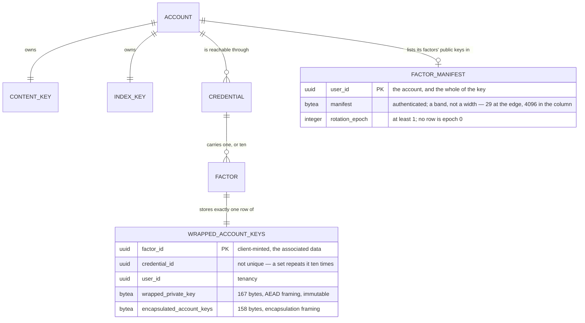

# Account Keys

## Table of Contents

- [Purpose](#purpose)
- [Key Entities](#key-entities)
- [Constraints](#constraints)
  - [MUST](#must)
  - [MUST NOT](#must-not)
- [Business Rules & Invariants](#business-rules--invariants)
- [Workflows & State Transitions](#workflows--state-transitions)
- [Decision Trees](#decision-trees)
- [Integration Points](#integration-points)
- [Edge Cases & Known Gotchas](#edge-cases--known-gotchas)

## Purpose

An account owns **one content key** and **one index key**. The content key is what the narrative is
encrypted under; the index key is what a blind index over a name **is** computed under — the browser
computes them today, and four columns store them, each under a uniqueness constraint. Neither is
derived from a credential.
Every **recovery factor** — a registered passkey, or one
recovery code — derives its own **key-encryption key** and holds an **ECDH P-256 key pair**: its
private key *wrapped under* that key-encryption key, and the account's two keys *encapsulated to* its
public half.

That shape is the whole point, and reversing it fails in two different ways. Deriving the content
key per credential is a recovery problem: text written on one authenticator would be unreadable on
another. Deriving the *index* key per credential is worse, because it is a correctness failure — two
index keys produce two blind index values for one name, the uniqueness constraint stops colliding,
and a person signing in from a second device silently accumulates duplicate payees while the
constraint appears to work.

**The key pair is a two-step opening rather than an extra layer, and reading it as belt-and-braces
is the mistake to avoid.** A factor presented yields a key-encryption key; that unwraps the factor's
private key; that decapsulates the account's two keys. What the indirection buys is
**[key rotation](key-rotation.md)**: encapsulating to a public half needs no secret at all, so a run
can produce a copy for a passkey in a drawer and for a code written on a card. Wrapping the account's
keys directly under each factor's key-encryption key — which is what this schema used to do — meant
re-wrapping needed that secret, and for a passkey the secret is a WebAuthn PRF output that exists
only while the authenticator is being touched. A rotation therefore needed every device present at
once.
[ADR 0025](../decisions/0025-give-every-recovery-factor-an-ecdh-key-pair.md) records the decision,
the widths it fixed and what it refused.

**What is built today is the schema, the three server-side paths that bring a factor into existence
and the fourth that takes one away, the one route that reads it all back, and the browser at both
ends of it.** The server refuses to register a passkey, issue a set of recovery codes, **or create
an account** unless the request carries, for every factor it brings into existence, a factor
identifier, a wrapped private key of exactly 167 bytes and an encapsulated pair of exactly 158, and
it files them in the same save as the credential. **All three demand a manifest beside them**, naming
the factor set that path leaves behind; the two that change a set an account already holds demand a
`rotationEpoch` as well, and refuse any number but one greater than the stored one. **The fourth
demands that pair and brings nothing into existence**: revoking a passkey takes a factor away, and
promotes the manifest in the same `SaveChanges` that deletes the credential.
`GET /api/me/account-keys` hands those two values
back per factor, one level down inside an answer that also carries the account's manifest and the
generation that manifest is in — see
[The one route that hands them back](#the-one-route-that-hands-them-back).

**The browser produces exactly that shape and reads it back.** `factor-keypair.ts` mints a factor's
pair and opens one; `factor-manifest.ts` seals the account's list of public halves and opens it; the
registration flow drives eleven of the first and one of the second in a single act, and custody runs
the read half on every sign-in and on every unlock. **Of the four paths that move a factor set, one
has a browser behind it** — registration, which *files* the account's first manifest. The three that
*promote* one are server-built and client-unbuilt: nothing in this client registers a second passkey,
replaces a card of codes or revokes a credential, so no browser has ever promoted a manifest and the
epoch arithmetic those routes refuse on is exercised only by the integration suite.

**`factor_manifests` has a writer on every path that changes an account's factor set;
`key_rotation_seals` still has none, and the two must not
be folded back together.** Registration writes the account's first manifest — at rotation epoch 1, in
the same `SaveChanges` as the eleven `wrapped_account_keys` rows it names. Registering a further
passkey, replacing a card of recovery codes and **revoking a passkey** each rewrite it and promote
the epoch **in the same unit of work as the factor change itself**, which is the property the read
beneath them rests on. The
application role holds `SELECT`, `INSERT` and a two-column `UPDATE` on that table. `key_rotation_seals`
has a writer in the begin and, since `POST /api/me/key-rotation` shipped, **a route above it** — so it
is a table a browser can now cause to be written. **Erasure is the one act that changes a factor
set and owes no manifest**, because it leaves nobody for a list to describe. The key pair beneath it
is in neither category: the pair is in the schema, refused by check constraints and required by
every path that creates a factor. See
[The manifest of factor public keys](#the-manifest-of-factor-public-keys) and
[key-rotation.md](key-rotation.md).

**The circle is closed on three paths, and each closes it differently.** `register.service.ts`
obtains a PRF output from a real authenticator, draws the account's keys, mints the set, derives
eleven key-encryption keys, mints a keypair under each, seals the manifest naming all eleven public
halves and posts the lot, so an account created there really does own a content key and an index key
that no server has seen — and on the `201` it hands the pair it already holds straight to custody,
with no round trip. `sign-in.service.ts` takes the second route: the assertion's PRF branch gives it
a key-encryption key, it hands that to custody, and custody reads the entries back, opens one and puts
what came out through the four refusals that make the account's manifest load-bearing — see
[The one class that holds them](#the-one-class-that-holds-them).
`AccountUnlockService`, on `/app/settings`, takes
the third and is the only one reachable **inside** the app — see
[The third way into custody](#the-third-way-into-custody). The other two write paths are still
reached only by the integration suite.

**The browser produces both an envelope and an index, and the places for them are complete rather
than accumulating.** All **eight** narrative columns are envelope columns — `budgets.name`,
`accounts.name`, `payees.name`, `category_groups.name`, `categories.name` and the three
descriptions on `category_groups`, `categories` and `transactions`. All **four** blind indexes exist — `accounts.name_key`,
`payees.name_key`, `category_groups.name_key` and `categories.name_key` — each under a unique index;
no description column has one or ever will. And every route but the budget's accepts the sealed
shape. **What reaches those columns is the product rather than the test suite**: `/app/accounts`,
the transaction form and **both** halves of `/app/categories` seal what they write, compute the
index where the column carries one, and open what they read, so no plaintext narrative value leaves
this browser. What holds the keys they spend is the **custody** —
[The one class that holds them](#the-one-class-that-holds-them) — and what they reach it through are
the operations that delegate to what it holds: `sealField`, `openField` and `blindIndex`, each with
callers of its own. The index arrived last and closed the one gap left in this class:
`#indexKey` has a reader, so the `no-unused-private-class-members` suppression that stood over it is
gone — the field's own declaration says so, and `reportUnusedDisableDirectives` is what makes a
directive kept past its reason an error in its own right. See
[The operations that delegate](#the-operations-that-delegate-and-the-shape-that-was-forced) and
[The blind index](#the-blind-index-and-what-it-refuses-to-be).

**The PRF output never leaves the ceremony module.** `createPasskey` and `assertPasskey` each derive
through `keyEncryptionKeyFromPasskey` themselves and hand back a **non-extractable `CryptoKey`**,
zero-filling the raw bytes behind them: a module that returned the output and let a caller derive
would put the value that unwraps the account's whole keyspace into a variable any screen could log.

## Key Entities

- **Content key** — 32 random bytes, generated in the browser. Never transmitted.
- **Index key** — 32 random bytes, generated in the browser, drawn independently of the content key.
  Never transmitted. Imported through the **HMAC** door, because what it is used for is a MAC.
- **Blind index** — `HMAC-SHA-256` under the index key over a message naming the grammar's version,
  the table, the column and the **normalized** name, rendered as unpadded base64url: **43
  characters, always**, since the tag is 32 bytes. It is a keyed digest and not an envelope —
  nothing about it can be opened again — so none of the ciphertext framing reaches it. The exact
  message grammar, the normalization and the frozen answers are in
  [`vectors/blind-index-v1.json`](vectors/blind-index-v1.json); it is not restated here, because a
  second copy of a byte-level contract is the copy that drifts. See
  [The blind index](#the-blind-index-and-what-it-refuses-to-be).
- **Normalized name** — the bytes a blind index is taken over, and a different transform from
  anything the narrative side does: trim, NFKC, full case fold, UTF-8, in that order. See
  [The normalization](#the-normalization-a-name-is-indexed-through).
- **Key-encryption key** — 32 bytes derived from a recovery factor by HKDF-SHA-256, imported as a
  **non-extractable** `AES-GCM` `CryptoKey` through `importAesGcmKey`. **Any other width is
  refused rather than trusted**: that function throws on material that is not exactly 32 bytes, so
  the width is enforced in code and not merely written down here — which it has to be, because
  WebCrypto would take 16 and 24 bytes as a quieter AES without a word. Never transmitted, and
  never readable back out of the browser's key store. The **bytes it was imported from** are a
  different thing and they do exist —
  two buffers per derivation, both zero-filled where the import consumes them. See
  [The two doors](#the-two-doors-and-the-five-decisions-each-holds) and
  [What becomes of the bytes](#what-becomes-of-the-bytes).
- **Factor key pair** — an ECDH P-256 key pair one recovery factor owns. **The private half is
  exportable in exactly one binary form**: measured on Chrome 152, Firefox 156 and WebKit 26.6, 120
  samples per engine, a PKCS#8 P-256 private key is **138 bytes** on all three, and `raw` import of
  an EC *private* key is refused by all three — so the bare 32-byte scalar is unreachable from a
  browser and PKCS#8 is the only thing there is to wrap. A `raw` **public** key is 65 bytes, an
  uncompressed SEC1 point.
- **Wrapped private key** — the factor's private half, *wrapped under* the key-encryption key that
  factor derives, in the AEAD framing. **Exactly 167 bytes** — the framing's 29 over a 138-byte
  plaintext — which is a width rather than a cap, so both sides of the bound are refused. It is the
  first step of the two-step opening, and the one value on a factor's row a rotation never rewrites,
  because a rotation does not change the factor's key-encryption key.
- **Encapsulated account keys** — the content key and the index key as **one 64-byte plaintext,
  content key first**, *encapsulated to* the factor's public half. **Exactly 158 bytes**, a width for
  the same reason. It is smaller than the wrapped private key beside it despite carrying a 65-byte
  ephemeral point, which is worth noticing before somebody "corrects" one of the two. **The order of
  the two halves is a contract between clients and is held by nothing on this side, ever**: a client
  that encapsulated them the other way round produces a value of exactly the right width carrying
  exactly the right version, which stores, reads back and opens — and yields an index key used to
  seal narrative text and a content key used to compute blind indexes.
- **Factor identifier** — the `factor_id` of the `wrapped_account_keys` row, minted by the client
  and the table's **primary key**. It is the value the associated data binds the wrapped private key
  to. Deliberately **not** the credential id;
  [ADR 0018](../decisions/0018-give-the-wrapped-account-keys-a-policed-table-and-their-own-factor-identifier.md)
  gives the reason.
- **Recovery factor** — one secret that can derive a key-encryption key, which is **not** the same
  as one credential. A passkey is one factor and one credential. A set of recovery codes is one
  credential and **ten** factors, because each code is a secret of its own. That distinction is what
  the primary key records: `credential_id` is an ordinary column and repeats ten times for a set.
- **Factor manifest** — one row of `factor_manifests`, keyed on `user_id` and on
  nothing else, carrying the authenticated bytes that name every recovery factor's public
  key and the `rotation_epoch` counting the generations of that list. Two columns beside
  the key and no third: the row records **no instant**, and that is a decision rather than a
  pending column. A generation is identified by its epoch rather than by when it landed, so the
  question somebody actually has here is the one `rotation_epoch` answers; an `updated_at_*` would
  be the only column of its kind in the schema, and a stamp nobody compares against anything is a
  fact about the row rather than about the account.
  `FactorManifest.For` is the only way to build one and refuses
  an empty manifest, one wider than `MaximumBytes`, and an epoch below
  `MinimumRotationEpoch`. **Registration writes one**, at `MinimumRotationEpoch`, in the save that
  writes the account, and **`FactorManifest.Promote` moves it** — an instance member on a row this
  unit of work already loaded, never a fresh `For` beside an `Update`, for the reason
  [The manifest of factor public keys](#the-manifest-of-factor-public-keys) sets out at length.
  `GET /api/me/account-keys` projects both columns
  beside the account's factor rows. **Epoch 0 is the
  absence of the row** and not a generation any row can hold, since the floor is 1 in the entity and
  again in the column's check — which is what lets one integer say "there is nothing stored" with no
  second member to disambiguate it. **Through the API that answer is unreachable**: a session exists
  only after a registration, and a registration files the manifest in the same save as the session,
  so the only account that ever answers 0 is one a test seeded by hand. See
  [The manifest of factor public keys](#the-manifest-of-factor-public-keys).
- **Locked account** — not a stored thing at all: an account whose **browser** does not hold the
  content key. Every tab starts in it, because nothing about the keys survives a page load, and
  presenting a factor is what leaves it. **There is one surface that asks for that factor from
  inside the app**: the Account keys section on `/app/settings`, whose Unlock control runs a passkey
  ceremony and hands what it derives to custody — see
  [The third way into custody](#the-third-way-into-custody). The other two producers of a
  key-encryption key sit behind `guestGuard`, so before that section the only exit was to sign out
  and sign in again. **It is not a locked session**, which is a different word
  for a different thing: a locked session is one a federated credential opened, a fact about a row in
  `sessions` and about what the *server* will answer — see [sessions.md](sessions.md). A person on a
  full session whose tab was reloaded is signed in and their account is locked, which is the ordinary
  case and would read as a contradiction under one word. The other direction cannot arise: a
  federated credential derives no key-encryption key, so nothing that opens a locked session could
  ever unlock an account. Blurring the two costs a reader the whole distinction, and the two chapters
  sit on either side of it.

Deliberately **absent** from anything this module produces: any representation of an unwrapped key
on the wire, any key-encryption key outside the browser, any PRF output, and any recovery code.
`recovery-codes.ts` mints codes and `account-keys.ts` consumes their canonical form; neither ever
hands a code to a caller that could transmit it.



## Constraints

### MUST

- **The keys MUST come from a cryptographically secure random source, and the two MUST be drawn
  independently.**
  - **Why**: an index key derived from the content key is still 32 distinct-looking bytes, so every
    test that measures width or difference passes while the two keys share a secret.
  - **Enforced in**: `generateAccountKeys` in `+core/security/account-keys.ts`, drawing 64 bytes in
    one `crypto.getRandomValues` call and splitting them into copies. `account-keys.spec.ts` asserts
    the full 64 bytes were requested, that both returned regions appear in the output, and that
    `Math.random` was never called. No layer below the browser can check this. The draw itself is
    zero-filled in a `finally` before the return.

- **Each recovery factor MUST derive its own key-encryption key on its own HKDF branch.**
  - **Why**: the branches are what keep two secrets derived from one recovery code independent. The
    server stores `SHA-256(verifier)`, and the verifier and the key-encryption key differ only by
    HKDF's `info` — so a database reader holding the hash is two one-way steps and a different
    `info` away from the key.
  - **Enforced in**: the client. `account-keys.spec.ts` pins the two branches distinct, and pins the
    recovery-code key-encryption key distinct from the verifier derived from the same code.

- **A buffer holding a secret that goes nowhere MUST be zero-filled where it is consumed**, in a
  `finally` rather than in a statement before the return.
  - **Why**: a copy made for the platform is a copy nothing outside that call names, so the code
    owning the original cannot reach it — its own `finally` clears the array it holds while the copy
    stays on the heap for the life of the tab. The `finally` rather than the plain statement is the
    same argument from the other end: the path that skips a wipe is the path where something has
    already gone wrong, which is the worst moment to leave the value that unwraps the account lying
    in a buffer.
  - **Enforced in**: the client, over the **four kinds of buffer** that hold one long enough to
    matter. Three are pinned by a spec that reads the buffer at the platform boundary before and
    after the call; the fourth — the buffers `factor-keypair.ts` owns — is held where it is
    written, by a `finally` per buffer, so a wipe deleted there reddens nothing →
    [What becomes of the bytes](#what-becomes-of-the-bytes).

- **Every recovery factor MUST hold a key pair and a copy of the account's keys — every passkey, and
  every one of a set's ten codes.**
  - **Why**: a factor that cannot open the account's keys is not a way back in, however well it
    proves identity. At code granularity the failure is worse than useless: nine of ten redemptions
    would open a session that unlocks nothing, and the person would meet that on the day they had
    already lost their authenticator.
  - **Enforced in**: two mechanisms holding different halves. `wrapped_private_key` and
    `encapsulated_account_keys` are both `NOT NULL` on a table keyed on `factor_id`, so "a factor
    carries both halves of its opening or no row at all" is a column definition. **That the row
    exists at all is not a schema fact** — one-to-optional is not expressible without a trigger, and
    ADR 0002 forbids pushing procedural logic down.
    - **What holds it is a property of the write surface, and the property is the rule rather than
      the count.** *Every* path that can bring a recovery factor into existence demands the members
      and writes the row in the **same `SaveChanges`** as the credential. There are three today, and
      the third arrived without weakening anything. Stated as a count it would have been wrong the
      day the count changed: a **fourth** path that keeps the property costs nothing, and a fourth
      that does not creates a factor holding no share of the keys and **reddens nothing**.

- **A wrapped private key MUST be bound to its factor, and the two account keys MUST travel in one
  fixed order inside a single encapsulation.**
  - **Why**: the binding is what makes a copy moved to another factor fail to authenticate rather
    than decrypt into something. The ordering is the half nothing can check — two keys encapsulated
    to the same public key under one KDF `info` would be two AES-GCM streams under one derived key,
    and an implementation that also reused the ephemeral pair across them reuses the keystream
    outright, so the exclusive-or of the two ciphertexts is the exclusive-or of the two account keys.
    One plaintext, one encapsulation, one nonce, and the question does not arise — at the price of an
    order, **content key first**.
  - **Enforced in**: the client, and by nothing beneath it in either direction. The **column swap**
    this rule used to be about is closed by the schema now — 167 bytes against 158, two framings and
    two version constants, each column judged by its own pair of checks, where both values were once
    61 bytes carrying the same version byte. What replaced it sits a level in, inside the
    encapsulated plaintext, and no `CHECK` constraint and no test on this side will ever notice it.

- **An account MUST hold at most one manifest, and a stored one MUST name a generation from 1 up.**
  - **Why**: a manifest is authenticated as a **set**, so a second row is a second claim about which
    factors an account has, and a client choosing which factor to encapsulate a value to would have no
    way to ask which of the two it was looking at. The floor is the same reading from the other end:
    **epoch 0 is the *absence* of a row.** An account with no manifest answers 0 — a state no route
    can produce and not an error — so a stored row claiming 0 would assert its own absence, and "this
    account has no manifest" and "this account's manifest is generation zero" would stop being
    distinguishable to the one read that has to tell them apart. A negative epoch falls to
    the same comparison, because no generation is numbered below the first.
  - **Enforced in**: `PK_factor_manifests` over `user_id`, which is the whole of the key, so a
    second row collides rather than being caught by a handler reading before it writes — two
    statements with a window between them wide enough for a second tab. The floor is
    `CK_factor_manifests_rotation_epoch`, rendered from `FactorManifest.MinimumRotationEpoch`
    rather than typed out beside it, so the database's refusal and the entity's cannot disagree;
    `FactorManifest.For` refuses the same values one ring up, and `FactorManifestTests` writes
    the bounds out as literals of its own, which is the only arrangement in which a drift in either
    constant is catchable. The creating writer reads `MinimumRotationEpoch` rather than typing `1`,
    so the first generation and the floor cannot disagree. **None of them reaches the step from one
    generation to the next**, which is `FactorManifest.Promote`'s and no declarative layer's — see
    [The manifest of factor public keys](#the-manifest-of-factor-public-keys).

- **A name MUST be normalised by trim, NFKC, full case fold and UTF-8, in that order, and the fold
  MUST be read from the version of Unicode this product names rather than from the host's.**
  - **Why**: two clients that normalise one name differently key it to two values, and the symptom
    is a duplicate that never merges on a column whose whole purpose is that equal names collide.
    Neither half of the order is arbitrary — measured, 50 code points disagree between
    trim-then-NFKC and NFKC-then-trim — and every platform API that is a fold reads whatever Unicode
    data the host shipped with, which is a property of the browser and not of this product.
  - **Enforced in**: `name-normalization.ts` and the table in `case-fold-table.ts`, both pinned
    against `vectors/blind-index-v1.json`. Nothing below the browser can check any of it: the server
    sees the MAC and never a name. See
    [The normalization](#the-normalization-a-name-is-indexed-through).

- **Every client MUST implement the identical contract below.** A field wrapped by one client is
  readable by another. Divergence is a defect in whichever client departs from it, not a
  negotiation.
  - **Enforced in**: frozen known-answer vectors in the client specs, restated in this document so a
    second implementation reads a specification rather than another client's test file.

### MUST NOT

- **No unwrapped key, key-encryption key, PRF output, or recovery code MUST reach the server.**
  - **Why**: the operator holding the database and every backup must recover nothing. A
    key-encryption key on the wire would hand over the account.
  - **Enforced in**: the shape of the request surface — no member of any endpoint's request type can
    hold one — and by there being no server-side type for any of them. What *does* cross is the same
    three members on each of three routes: a factor identifier, a wrapped private key and an
    encapsulated pair of account keys, each of which the server can check the shape of and open none
    of. On `POST /api/registration` that triple arrives eleven times over. **Every one of the three
    carries one member more**: the `manifest`, whose plaintext is public halves and which this server
    could not open if it wanted to, since it is sealed under a content key no request has ever
    carried. **A fourth route carries the `manifest` and none of the triple** — a revocation moves
    the set without bringing a factor into existence, so it has nothing to file. The **outbound**
    direction
    is held by `KeyMaterialSecrecyTests`, a census over every member of every type a route
    serialises: what leaves on `GET /api/me/account-keys` is that same triple per factor, and the
    census carries
    a written argument for each of the two payloads rather than one sentence covering both — they are
    values of two different cryptographic suites at two different widths, and a sentence about "an
    envelope" would tell a reader nothing about which of the two this deployment was judging.
    **The response's `manifest` member owes a third argument, and it runs the other way.** Those two
    payloads may cross because the key that would open them never reaches this server; the manifest
    may cross because there is **nothing in it to open** — public halves a value is *encapsulated
    to*, held in the clear, and an operator reading them opens no envelope and derives no key. Either
    argument pasted over the other is false, which is why the census makes the entry write its own:
    what it concedes is how many recovery factors the account holds and which public keys they are,
    and that concession is why `DataInventory` classifies the column *excluded* rather than harmless.

- **A factor identifier MUST be one spelling on the wire.** The write paths accept a UUID in the
  **lower-case** 36-character hyphenated form with no surrounding whitespace, and nothing else — not
  the braced, parenthesised or undashed spellings `Guid.TryParse` would take, not upper-case or
  mixed-case hex, not the same UUID with a leading or trailing space, and not the all-zero UUID.
  - **Why**: it is the value both envelopes were sealed against, so a client that sent one spelling
    and bound another finds its own envelopes unopenable, permanently and with no error naming the
    cause. The all-zero UUID is refused separately because it is what an unset field sends and it is
    the one value two accounts reach independently — on a unique index spanning the whole table,
    that turns a client bug into a cross-account collision.
  - **Enforced in**: `CanonicalFactorId.TryParse`, one definition `CompleteRegistrationHandler`,
    `GenerateRecoveryCodesHandler` and `RegisterAccountHandler` all call, because they write the
    same column and a rule that drifted on one would seal an account's keys under a spelling the
    others cannot reproduce. The third caller is where a copy would have been easiest to justify and
    worst to hold — it parses eleven identifiers on one request. It compares the supplied text
    **ordinally against what the parsed value renders as**: `Guid.TryParseExact(value, "D", …)` on
    its own does *not* pin a spelling, since `"D"` is a format rather than a spelling — it admits
    upper-case and mixed-case hex, and trims leading and trailing whitespace before it reads the
    format at all. A length check closes neither the case folding nor the trim; a regular expression
    can close both, but it is a second, hand-maintained copy of a rendering this code does not own.

- **The key-encryption key MUST NOT be extractable.** It is imported with `extractable: false` and
  only `encrypt`/`decrypt` usages.
  - **Read the claim at its real width: it is about the boundary.** What holds by construction is
    that **what leaves the derivation is a `CryptoKey`** — there is no API that reads one back out,
    so nothing downstream can log the value that unwraps the account's whole keyspace, serialise it
    into a request body, put it in `localStorage` or hand it to a crash reporter. It is **not** a
    claim that the value never exists as bytes: it does, twice per derivation, inside the module.
    That those bytes do not outlive the call is a separate and weaker kind of rule — a wipe somebody
    wrote rather than an absence nothing can undo.

- **An opened account key MUST NOT be persisted, and MUST NOT be shared with another tab.** Custody
  is per document and dies with it.
  - **Why**: a non-extractable `CryptoKey` is **structured-cloneable**, so both are reachable with
    no byte ever exposed and a reader who learns that will read their absence as an oversight rather
    than as a decision. IndexedDB is the expensive one: it makes the account's decryption capability
    outlive the browser closing, so whoever has the device and a live cookie reads the narrative
    with **no factor presented at all** — the requirement that a locked account stays locked failing
    while every check in the product still passes, because nothing about a stored key looks wrong.
    A `BroadcastChannel` hand-off is weaker and still wrong for the same reason one step down: it
    unlocks a tab in which nobody presented anything. What is left is the property the design rests
    on — **a page reload locks the account, and getting back in costs a ceremony.** The Settings
    screen's Unlock is where that ceremony is paid for, which is what keeps the property from being
    a dead end rather than what softens it.
  - **Enforced in**: the absence, and the absence is all there is. Nothing in the client writes a
    key anywhere, and no test can prove a `BroadcastChannel` will not be added tomorrow. What
    narrows it is that `AccountKeyCustodyService` holds both keys on ECMAScript `#` fields with no
    accessor, so there is no supported way to *read* one back out in order to send it — a caller
    would have to add the member first, which is the change this constraint is addressed to.

- **The PRF eval input, the two `info` strings and the associated-data prefix MUST NOT be edited.**
  - **Why**: each carries a `/v1` suffix, and a change to any of them changes every value derived
    under it. The symptom is silent — accounts that wrapped under the old value simply stop
    unwrapping. A change is a new version minted alongside the old, never an edit in place.

- **A manifest MUST NOT be written by a path that has not brought its own grant.** The application
  role holds `SELECT, INSERT, UPDATE (manifest, rotation_epoch)` on `factor_manifests`, and no
  `DELETE` of any shape.
  - **Why**: a missing privilege fails in opposite directions depending on which one it is, which is
    why the read could be granted ahead of a caller and the writes could not. An ungranted **read**
    fails quiet — measured on
    `key_rotations`, the plaintext scan behind the secrecy gates meets `42501`, reports the table
    unscannable, and two gates then pass while covering one table fewer than the schema holds, which
    is a census reading as complete while it is not. An ungranted **write** fails loud, with `42501`
    on the statement that wanted it, in the test exercising the path. So the read was granted while
    the table was still empty, the **`INSERT` arrived with the handler that needed it** —
    registration, writing the account's first manifest — and the **`UPDATE` arrived with the paths
    that promote a generation**, not before them. Three paths promote today and one column list
    covers them all, because a promotion writes those same two columns whichever path issues it.
    The `DELETE` is still missing on a reason of
    its own: a manifest leaves by `FK_factor_manifests_users` cascading from an account erasure,
    which runs with the referencing table's owner's privileges rather than this role's. It does not
    arrive from whoever is in a hurry.
  - **Enforced in**: `app-role-grants.sql`, the only place a privilege on this table can come from —
    grants and policies live there and never in a migration. **The `UPDATE` names two columns and
    `user_id` is not one of them**, which is the whole of why it is a column list rather than the
    table: an account's manifest is the single authenticated statement of which factors that account
    holds, so a table-wide `UPDATE` would let one statement re-file that whole set against another
    account. Immutability by omission from a `GRANT UPDATE` column list is the form this file uses
    everywhere, never a `REVOKE`.

## Business Rules & Invariants

### The cryptographic contract

A second client implements from this table. **It is normative here rather than in any client's
source: a second implementation cannot read another's test files, so anything stated only in code is
not part of the contract.**

**What this table covers is the derivation, and that half did not move.** A key-encryption key still
comes off a PRF output or a canonical recovery code by the branches below, and the vectors under
[Frozen known-answer vectors](#frozen-known-answer-vectors) still hold. What a factor then does with
that key **did** move — it unwraps a 167-byte private key rather than two 61-byte account keys — and
the rest of this section describes the arrangement both sides now implement.

| | Passkey factor | **One** recovery code |
|---|---|---|
| Input keying material | the WebAuthn PRF output | UTF-8 of the **canonical** code |
| PRF eval input | `budgetoid/passkey/prf-eval-input/v1` (UTF-8) | n/a |
| KDF | HKDF-SHA-256, **empty salt** | HKDF-SHA-256, **empty salt** |
| `info` | `budgetoid/passkey/key-encryption-key/v1` | `budgetoid/recovery-code/key-encryption-key/v1` |
| Output | 32 bytes → non-extractable `AES-GCM` `CryptoKey` | same |

**The unit is one code, not one set, and this is the single most likely thing to get wrong.** A set
is ten independent secrets, each deriving its own key-encryption key, so a set stores **ten**
`wrapped_account_keys` rows — one per code, each with its own client-minted factor identifier and
its own pair of envelopes.

Nothing links a code's `recovery_code_hashes` row to its `wrapped_account_keys` row, and that is
deliberate rather than missing: the link would have to live on the hash table, which is exempt from
row-level security and holds a pinned column set. A client that has just redeemed a code reads the
account's wrapped rows and **tries each in turn** — the associated data binds each pair to its own
factor, so exactly one opens and the rest fail to authenticate. An entry costs two AEAD opens and
one key agreement, so eleven of them is a cost nobody can measure.

**Empty salt** means the zero-length octet string. HKDF-Extract is HMAC keyed on the salt and HMAC
pads a short key with zeros to the block size, so a library taking `nil`, `""` or 32 zero bytes all
reach the same pseudo-random key. There is no per-account value a salt could be taken from anyway: a
redemption arrives carrying a code and no identity at all.

**The PRF eval input is the value handed to the extension, not the value the authenticator hashes.**
WebAuthn's `prf` extension takes it as `eval.first` and the platform hashes
`SHA-256("WebAuthn PRF" ‖ 0x00 ‖ input)` before the authenticator ever sees it. A client going
through WebAuthn gets that for free; a client speaking CTAP `hmac-secret` directly must apply the
prefix itself, or it derives a different key-encryption key from an authenticator that signs
perfectly. Only `eval.first` is used; `eval.second` is not part of this contract.

**The canonical form of a recovery code**, in full, because a pointer at a source file is not a
specification:

1. Upper-case by Unicode's **full** uppercase mapping, and **locale-independently** — two
   requirements, and neither of them is the word *invariant*, which names a specific API — .NET's
   `ToUpperInvariant` — that answers both of the cases below wrongly. **Full** means the step is
   **not length-preserving**: `ß` `U+00DF` upper-cases to the two characters `SS`, and the dotless
   `ı` `U+0131` upper-cases to `I`, which step 3 then folds to `1`. A simple mapping — one scalar
   in, one scalar out — reaches neither answer, and a platform may offer nothing else: .NET has no
   full-casing API at all, so the reproduction the server suite keeps carries the 103 code points
   where the two mappings disagree as data. **Locale-independent** is the other half: a Turkish
   locale maps `i` to `İ`, which no later step recognises. Both expansions are frozen rows in
   [`vectors/recovery-code-v1.json`](vectors/recovery-code-v1.json), so an implementation that
   reads *invariant* as an instruction reproduces neither.
2. Remove every hyphen-minus `U+002D`, and every character in exactly this set: `U+0009`, `U+000A`,
   `U+000B`, `U+000C`, `U+000D`, `U+0020`, `U+00A0`, `U+1680`, `U+2000`–`U+200A`, `U+2028`,
   `U+2029`, `U+202F`, `U+205F`, `U+3000`, `U+FEFF`. Enumerated rather than named, because
   "whitespace" is a different set in every regular-expression dialect — JavaScript's `\s` includes
   `U+FEFF` and excludes `U+0085`; .NET's excludes `U+FEFF` and includes `U+0085`; Java's without
   the Unicode flag is ASCII only. Two honest implementers reading the word would disagree, and the
   symptom is a code that will not redeem and keys that will not unwrap, with nothing naming the
   cause.
3. Fold `I` and `L` to `1`, and `O` to `0`. `U` is deliberately unmapped.

The steps are ordered and the order matters: folding before upper-casing would leave `il o` as `ILO`
rather than `110`. The same canonical form feeds the verifier the server stores; the two derivations
differ only in HKDF's `info`.

**Envelope** — the shared AEAD framing, its version byte, its wire form and the rules every
client implements it under are stated once in
[ciphertext-envelope.md](ciphertext-envelope.md), because a second consumer now reads the same
format and two copies of a layout drift silently. What belongs to *this* document is the one
number that follows from the payload: over a **138-byte PKCS#8** P-256 private key the envelope is
exactly **167 bytes** — a width, not a cap, because AES-GCM ciphertext is the length of its
plaintext. That equality is the entity's own rule and is enforced on top of the shared framing,
which carries a floor and no width at all. The account's manifest rides the same framing and takes
a **band** instead, because its plaintext grows with the number of factors it names — and the
band's two ends are owned by two different layers, which is the part a reader flattens into one
rule. The **29** is the framing's floor, applied at the edge by `FactorManifestEnvelope`; the
**4096** is the column's cap, which the entity restates. The **stored** rule is
`length(manifest) between 1 and 4096`, so the ceiling agrees to the byte and the floor does not:
anything below 29 is refused by the decode and by nothing underneath it.

**Nonce freshness is a rule of the format and is argued in
[ciphertext-envelope.md](ciphertext-envelope.md).** What this document owns is how little room the
current arrangement leaves for a counter to look safe in. A factor puts exactly **one** value under
its key-encryption key, `wrapped_private_key`; its `encapsulated_account_keys` is *encapsulated to*
the public half, and the encapsulation framing carries its own ephemeral public key, so the AEAD
beneath it runs under a key agreed **per encapsulation** rather than under the key-encryption key at
all. One value under that key leaves no second ciphertext beside it to XOR against — which makes the
repeat quieter rather than impossible: a client that re-derives a key-encryption key and re-wraps
under it, with a counter reset to zero, collides with the first wrap and nothing says so. The
requirement is unchanged and is held per (key, nonce) by the format, wherever the key came from.

#### The factor-keypair grammar

**Four messages, one label, one join.** `⌷` below is a single `0x1F`, the ASCII unit separator, one
between fields and none at either end.

```
AAD, wrapped private key  = "budgetoid/factor-keypair/v1" ⌷ <version> ⌷ <factorId> ⌷ "private-key"
AAD, encapsulated keys    = "budgetoid/factor-keypair/v1" ⌷ <version> ⌷ <factorId>
AAD, manifest             = "budgetoid/factor-keypair/v1" ⌷ <version> ⌷ <rotationEpoch, decimal digits>
HKDF info                 = "budgetoid/factor-keypair/v1" ⌷ <version> ⌷ <factorId>
                               ⌷ <ephemeral public key, 65 raw> ⌷ <factor public key, 65 raw>
```

The label and every identifier are UTF-8. **The version byte and both public keys are raw and are
never re-encoded**, which is why this grammar joins *bytes* where the narrative one joins strings: a
65-byte point pushed through UTF-8 comes out 129 bytes long — measured, with no error anywhere — and
a version composed as text is correct at 1 and silently wrong from `0x80` up, where UTF-8 widens one
byte into two. The frozen file carries a `0x80` message for exactly that, and it is the only vector
in it describing a version this scheme does not have.

The encapsulation key is the P-256 raw agreement through HKDF-SHA-256 — empty salt, that info, 32
bytes — imported as AES-256-GCM. **The encapsulation message is a strict prefix of the private-key
message**, and that is the whole reason both are pinned: an implementation that forgets the purpose
field does not produce garbage, it produces the *other* valid message of this same scheme, and a
factor's two envelopes become interchangeable.

**Both points go into the info, ephemeral first and recipient second.** Swapped, two matched
implementations still agree with each other and with nothing else. Binding the recipient's point is
what makes a substituted factor public key derive a different key — and **no vector can show it**;
the file says so about itself.

**Three version bytes are all `1` and none of them may be derived from another.** The AEAD suite's
leads a wrapped private key and a sealed manifest; the encapsulation suite's leads an encapsulated
value; and the **third** is this grammar's own, which appears inside every message above and inside
the HKDF info and versions neither suite. All three spell the same byte today, which is precisely
why only a source-text reading can tell them apart: a reader who aliases any two renumbers a suite
nobody meant to touch, and nothing anywhere would say so.

**There is deliberately no account identifier in any of these messages**, and the requirement was
revised to match rather than the grammar bent to meet it. Two reasons, and the second is the one
that makes the first affordable. The client **cannot obtain one**: `GET /api/me` publishes the
address and the ambient budget, and an account-keys response may never carry a user id — that value
is what every policy in the database is keyed on, and putting it in a body puts it in a browser's
network panel and a client log. And it would **defend nothing**: a factor identifier is a
client-minted uuid, unique across the whole table, and a duplicate is refused at every write path,
so one account's factor row cannot be presented as another's in the first place. The instinct is to
add one back for symmetry with the narrative grammar's row id; it buys no binding that the factor
identifier does not already carry.

The factor id is **normalised** before it is used: the client accepts the spellings a `Guid` can be
written in and folds them to the lower-case hyphenated form, and refuses anything that is not a
UUID. **The server normalises nothing** — it refuses any spelling but that one, so the two sides
agree on the bytes by the server never storing a value whose rendering differs from what it was
sent. A client that normalises the other way, or not at all, is turned away at the write rather than
discovering months later that its envelopes do not open.

**The epoch is decimal text and not a byte**, in the manifest's associated data and again at the
head of the manifest's own plaintext. Eleven factors is the two characters `11`; a byte would put a
ceiling of 255 into a format with no other reason for one, and the two spellings are
indistinguishable at epoch 1, which is why the frozen file pins epoch 10 beside it.

**The manifest plaintext is `count ⌷ factorId ⌷ publicKey ⌷ …`, entries ascending by the canonical
spelling of the identifier.** The bytes have to be reproducible from a *set*, and a set has no
order, so insertion order would make two clients holding one set write two different plaintexts. The
sort is over the **text** and never over the identifier's bytes: .NET's `Guid.ToByteArray()` is
mixed-endian, so a sort over raw UUID bytes agrees with this one on most sets and disagrees on some
— and the frozen three-factor vector is one it disagrees on, which is the only reason that
disagreement is visible anywhere. The count leads so that a truncated plaintext is a mismatch rather
than a smaller set: without it, chopping the tail off a manifest yields a shorter manifest that
parses, and the entry it drops is the authenticator somebody still has.

### Frozen known-answer vectors

A red result names which input changed. It never means updating the constant.

The **blind index** and its normalization are not in this section: their frozen answers live in
[`vectors/blind-index-v1.json`](vectors/blind-index-v1.json), together with the index key they were
computed under, the Unicode version the fold was read at and a digest of the shipped table. Four
specs read that one artifact rather than transcribing it, which is what stops a second copy of a
byte-level contract existing to drift from.

The **factor keypair** is not in this section either, and for the same reason:
[`vectors/factor-keypair-v1.json`](vectors/factor-keypair-v1.json) carries the four messages of the
grammar above, the HKDF info, the encapsulation key, both stored values at 167 and 158, the manifest
plaintext at three factors and at eleven, the sealed manifest at epoch 1, and **fourteen manifest
plaintexts a reader must refuse**. It was **authored by a
third implementation** — Node's OpenSSL-backed crypto — so that neither the browser's WebCrypto nor
the server suite's `System.Security.Cryptography` can certify itself against it, and both reproduce
every value in it.

Four things in that file are worth meeting here rather than being reconstructed from it.

- **The PKCS#8 is pinned, not the scalar.** A P-256 private key exported as PKCS#8 with its public
  key included is exactly **138 bytes**, and the 65-byte uncompressed point sits at **offset 73** —
  which is where a client lifts the factor's own public key from, satisfying the rule that the point
  be derived from the opened private key and taken from nothing stored or transmitted. The width is
  *enforced* rather than observed: an engine omitting the optional public-key field exports a shorter
  structure, and a lift at 73 out of that reads a well-formed-looking 65 bytes that are not this
  key's point.
- **A second, wholly independent instance sits beside the first** — a different key-encryption key,
  a different factor identifier, a different keypair and a different pair of account keys. Every
  other vector shares one instance, so an implementation that ignores its arguments and returns the
  frozen values passes all of them; it cannot pass both instances.
- **What it cannot hold, stated in the file and again here**: it shows the bytes are *present*, never
  that they *help*. The key-substitution property that binding both public keys into the info buys is
  pinned **nowhere, by anybody** — no round trip can see it, because two matched implementations that
  both dropped the recipient's point agree with each other perfectly.
- **`manifestPlaintextRefusals` is the one section whose cases a round trip cannot produce**, and
  **six of its fourteen are exactly the width of the frozen three-factor positive**. Each case is a
  stated mutation of that positive, built by a script importing no project code — a vector generated
  by the implementation under test pins today's behaviour, bug included, and then agrees with itself
  forever. A consumer seals each plaintext itself and hands the result to the reader the production
  path uses, so every case is exercised on the open-then-read path rather than against a parser
  called by hand. The same-width six are what make the section necessary rather than thorough: they
  authenticate, they are the right size, and nothing but a refusal inside the reader tells them from
  the real manifest. Filed beside them and **not** among them is the count `0` naming no entries,
  which is well formed — see [The one class that holds them](#the-one-class-that-holds-them) for the
  layer that turns that one away.

**Key-encryption key from a passkey factor**, observed through a seal because the key itself is
non-extractable:

| | |
|---|---|
| PRF output | `404142434445464748494a4b4c4d4e4f505152535455565758595a5b5c5d5e5f` |
| nonce | `b0b1b2b3b4b5b6b7b8b9babb` |
| plaintext | `202122232425262728292a2b2c2d2e2f303132333435363738393a3b3c3d3e3f` |
| associated data | `budgetoid/account-keys/spec/v1` |
| envelope (61 bytes) | `01b0b1b2b3b4b5b6b7b8b9babbcc175362fa23e1b57690d974afd12fd44aa18baa1184ae370fa0fef7711ca912e1b77dc29b673f8035c130ca48b65505` |

**Key-encryption key from one recovery code**, over the same code the verifier vector in
[recovery-codes.md](recovery-codes.md) uses — deliberately, so the pair proves the two branches are
separate on one input rather than merely different on two:

| | |
|---|---|
| code (already canonical) | `0123456789ABCDEFGHJKMNPQRS` |
| `info` | `budgetoid/recovery-code/key-encryption-key/v1` |
| derived key | `c0e5b232a2357e7af8f66b5a350c6c63bf90df1b8482f5e0e6adf2f9205e6875` |
| nonce | `c0c1c2c3c4c5c6c7c8c9cacb` |
| plaintext | `404142434445464748494a4b4c4d4e4f505152535455565758595a5b5c5d5e5f` |
| associated data | `budgetoid/recovery-code/spec/v1` |
| envelope (61 bytes) | `01c0c1c2c3c4c5c6c7c8c9cacbc989999fa07877001b181630c519f634e2508f0244b66f6a5f691a79c01bee8dd8bfbb2649838e3cf8266e86fa021bf1` |

The verifier derived from that same code under `budgetoid/recovery-code/verifier/v1` is
`aGr2Qher4pOLKZ335Uwyi92Ti9GAZ-Ek5G_9Br5plNE`. The two share an HKDF-Extract and differ only in
`info`; a client that computes one correctly and the other wrongly has swapped the labels, and
holding both vectors is the only way to see that.

**Envelope**, independent of the account keys, with a fixed AES-256 key:

| | |
|---|---|
| key | `000102030405060708090a0b0c0d0e0f101112131415161718191a1b1c1d1e1f` |
| nonce | `a0a1a2a3a4a5a6a7a8a9aaab` |
| plaintext | `808182838485868788898a8b8c8d8e8f909192939495969798999a9b9c9d9e9f` |
| associated data | `budgetoid/key-envelope/spec/v1` |
| envelope (61 bytes) | `01a0a1a2a3a4a5a6a7a8a9aaab6699feaec14e8438eaec0d588bf74e51e03dcb830622d4fb0497bc1de336eb9e21d4cc389d668944133ecec0a071274d` |

### The two doors, and the five decisions each holds

**A door is where bytes become a key an account uses**, and `+core/security/account-keys.ts` has
two of them: `importAesGcmKey` and `importHmacSha256Key`. They are two because the account's two
keys are two different kinds of key. The content key encrypts, so it goes through the AES-GCM door,
and so does every key-encryption key. The index key is what a blind index is computed under, which
is HMAC-SHA-256 and not a cipher at all, so it goes through the HMAC door. The platform agrees:
measured on this runner, `sign` under a key imported as AES-GCM and `encrypt` under a key imported
as HMAC are both refused with `InvalidAccessError`. So the shorter route — sending the index key
through `importAesGcmKey` because that line is already written — hands back an object that cannot
compute a single index and cannot be corrected afterwards, since by then it is non-extractable and
the bytes are zeroes.

**The number of doors is not the claim, and a reader who reads it as one will draw the wrong
conclusion from the two ECDH imports one file over.** What matters is that the count is not
**zero**: the alternative to a door is not a weaker door, it is a `crypto.subtle.importKey` written
out by hand beside the caller that needed it, holding **none** of the five decisions below. That is four lines, it compiles, and
it returns a perfectly good `CryptoKey`. Of the five, only a wrong *algorithm* is ever mentioned by
anything — and it is mentioned at the first call rather than at the import, by which time the
material has been wiped or not according to nobody's rule. A width silently downgraded, a usage
list widened to `wrapKey`, an extractable key and a copy of the bytes left on the heap all work,
forever, and are wrong for the life of the account. Two doors keep the claim; a third written by
hand destroys it.

- **The width.** Material that is not exactly `ACCOUNT_KEY_BYTES` is refused, by
  `requireAccountKeyWidth`, which both doors call and neither restates — one decision, one
  enforcement of it, however many doors are added later. The check is written against that constant
  rather than a literal `32`, or it would go on enforcing a number the module had stopped believing
  in. **How much work that check is doing differs enormously between the two doors**, and the
  difference is the next rule down.
- **The usage list.** `encrypt` and `decrypt` on the AES door; **`sign` and nothing else** on the
  HMAC one. A cipher list also carrying `wrapKey`/`unwrapKey` opens a second path out for key
  objects, unrelated to the bytes the import is refusing to give up. The HMAC omission is
  `verify`, and it is the one a reader adds without stopping, because HMAC has two halves and a key
  that does one looks unfinished: a blind index is computed here and *compared* on the server, so
  there is no verification for a browser to perform, and what `verify` would add is an oracle
  answering a boolean about a tag somebody else supplied, under the key that keys the account's
  entire search space.
- **Non-extractability.** `extractable: false` on both, which is why the derivations return a
  `CryptoKey` at all, and the one of the five anything downstream would notice being dropped —
  because `sealNarrativeField` refuses an extractable key.
- **The defensive copy.** The material is copied onto a buffer whose type WebCrypto's
  `BufferSource` accepts, for the reason `key-envelope.ts` states at length: narrowing by copying
  asserts nothing about the caller's buffer, where a cast would.
- **The death of the bytes.** Both copies — the one the door makes and the caller's `material` —
  are zero-filled in a `finally`, on the **refusal** path as well as the success one, because
  `requireAccountKeyWidth` is called from **inside** each door's `try`. Lifting that call above the
  `try` is the tidier-looking arrangement, reddens nothing, and leaves rejected key material on the
  heap.

**On the HMAC door the width check is not one guard among several. It is the only one.** The AES
door has the platform underneath it — measured, `importKey` accepts 16 and 24 bytes as AES-128 and
AES-192 and refuses every other non-32 width with `DataError`, so the module's own check there is
closing a gap two widths wide. HMAC has no such rule and wants none, which is correct of HMAC and
fatal here: **measured, `importKey` accepts 1, 15, 16, 24, 31, 32, 33 and 64 bytes as an
HMAC-SHA-256 key and signs a full 32-byte tag under every one of them, and refuses exactly one
width — zero — with `DataError`.** So truncated material imports, signs, and yields a blind index
that is stable, collision-free and keyed under a secret that is not the account's index key. Every
row the account ever writes is indexed under it; nothing anywhere names the moment it started; and
there is no way back once the rows exist, because a blind index cannot be recomputed without the
plaintext it was taken over. The platform *records* the width, on `key.algorithm.length`, and
nothing in this client reads it — which is the shape of the whole hazard: the mistake is visible
and unwatched.

**One rule here is held by nothing but itself, and the reason it was written down turns out to be
false.** That `finally` runs after an `await` on `importKey` rather than after a bare `return` of
its promise, and the argument used to be that WebCrypto reads the buffer asynchronously, so a
returned promise would let the wipe run mid-import and the key would be imported from zeros.
**Measured, and it does not happen**: `importKey` copies `keyData` in its synchronous prologue, so
importing the same 32 bytes with the `await` and without it yields byte-identical key material —
read back through an extractable import, and confirmed under the HMAC door by two identical tags
that are both unequal to the tag a zero key signs. Dropping the `await` also leaves every case in
`account-keys.spec.ts` green, which is the same finding from the other side.

Keeping it is still right, for two smaller reasons that are worth stating in place of the wrong
one. A rejection thrown inside the frame keeps the door in the stack trace, where a returned
promise rejects with the door's name nowhere on it. And the correctness of a bare `return` would
rest on a detail of the platform's prologue that nothing here states and no test can observe. So
say it plainly — this rule is held **by construction**, by the shape of the code and the comment
sitting on it, and **not by observation**. A reader who "tidies" the `await` away will find the
whole suite agreeing with them, and nothing about the account will be worse.

**Where the imports are written is pinned, and where they are *not* written is what the pin is
for.** `key-import-single-source.spec.ts` reads the source tree and requires
`crypto.subtle.importKey` to appear in exactly **three** non-spec files, each carrying its reason in
the census itself rather than in a bare list: `account-keys.ts`, holding the two doors; `hkdf.ts`,
which is **not** a door — it imports input keying material for a derivation and hands back a key
whose only usage is `deriveBits`, so nothing can seal, sign or export under it; and
`factor-keypair.ts`, which holds two more. **Three files, five call sites**, up from two and three.

**The third file earns its standing on a distinction, and the number is the least interesting part
of it.** What that module imports is a **factor's** keys and never the **account's**: a PKCS#8
private half whose only usage is `deriveBits` and which is re-imported non-extractable, and a peer
public point with an **empty** usage list. An account has one content key and one index key; a
factor has a private half it agrees under and a public point somebody else hands it. Moving those
two imports into `account-keys.ts` would put ECDH material through a file whose every decision is
about symmetric account material, and moving that file's doors here would put the account's keys
behind a factor's ceremony. The account key this module ends up with is **not** imported there at
all — it goes through `importAesGcmKey`, which is the door. Say the distinction or the count is the
only thing that moved and the reason is lost.

Three limits are stated in the census rather than papered over: it catches a member access and not a
call assembled at runtime; it is a rule *between* files, so a third door written **inside** an owner
passes it; and it says nothing about what an owner's imports do. What catches the second is an
**export** census, and three modules carry one — `account-keys.ts`, `factor-keypair.ts` and
`factor-manifest.ts`, each comparing the keys of its own module namespace against a written-out set.
**None of the three is filtered to functions**, so what is compared is the whole export surface
rather than its callable part: an exported `const`, a class, an object and a fourth door all redden
the same way, where a `typeof value === 'function'` filter is silent on every kind but the last.
Two gaps
follow and are named rather than assumed. A door written inside an owner and **not exported** is
caught by nothing, on any of the three. And `hkdf.ts` is the one owner with no export census at all,
so a hand-written import inside it has neither rule over it — which is the reason its standing in
the owner list is written as narrowly as it is. The call-site count is
deliberately **not** pinned there, because pinning it reddens on the legitimate change — a fourth
door, argued for — and stays green on the one that matters, a hand-written import in a file with no
standing. Specs are exempt, and that exemption is not a convenience — a non-extractable key has no
witness but a spy at the platform boundary, so every spec that pins a door has to name the function.

### What becomes of the bytes

**The boundary claim and the byte claim are two claims, and only the first holds by construction.**
A derivation hands back a non-extractable `CryptoKey` and nothing that holds one can read the value
out of it — a property of WebCrypto rather than of anybody's care. Inside the derivation the same
value is bytes, and what keeps *those* from outliving the call is an ordinary `fill(0)` that
somebody wrote and somebody else can delete.

Four kinds of buffer hold a secret long enough to matter, and each is cleared where it is consumed:

- **The 64-byte draw inside `generateAccountKeys`** — the one buffer in which the content key and
  the index key sit together in the clear. The irony is exact, and it is why this wipe cannot be
  left to a caller: the two keys are *copies* of regions of that draw precisely so that a caller
  wiping one does not wipe the other, and it is that copying which puts the originals somewhere no
  caller can name.
- **The copy a door makes for WebCrypto, and the material it was handed.** That material is a key
  in the clear — the key-encryption key itself on both derivation branches, and one of the account's
  own two keys wherever a door is called on the pair — on a buffer nothing outside the call names
  once `importKey` has been given it. Both derivations share the AES door, so a registration runs
  eleven derivations through it, and the wipe covers the refusal as well as the success. **Both
  doors wipe, identically**, which is what makes it safe for a caller to hand the pair straight into
  the two of them in one statement and keep no name for the bytes: registration and custody each do
  exactly that. See [The two doors](#the-two-doors-and-the-five-decisions-each-holds).
- **The plaintext copy `sealEnvelope` hands the cipher**, cleared in a `finally` once the cipher has
  resolved. The argument for that position used to be that WebCrypto reads the buffer
  asynchronously, so a wipe placed ahead of the `await` would seal zeros. **Measured, and it does
  not happen**: `encrypt` copies the plaintext in its synchronous prologue, so clearing the buffer
  the instant the call has returned its promise yields a ciphertext byte-identical to clearing it
  after the promise resolves — and neither is the ciphertext of an all-zero plaintext of the same
  width, which is the control that makes "identical" mean anything. It is the import doors' finding
  one file over, about the same prologue, so this ordering is held **by construction** and not by
  observation: it stays for the stack trace, and because an earlier wipe would rest on a platform
  detail nothing here states and no test can observe. Hoist it and the suite stays green. The wipe
  itself is not the negotiable part. One registration seals eleven private halves and one manifest,
  so **twelve** of these pass through a single sign-up.
- **The five buffers `factor-keypair.ts` owns**, which are the ones a reader will miss because that
  module is not where key hygiene is argued. The **PKCS#8** of a freshly drawn private key is wiped
  twice — once by the door that imports it and once by the frame that exported it, so a rejection out
  of the seal in between does not leave a private key on the heap. The **raw ECDH agreement** goes
  after the HKDF that consumes it. The **64-byte encapsulation plaintext** is hoisted expressly so it
  can be wiped, because inline it would be a third copy of both account keys, once per factor, that
  nothing names. The copies the mint's own **self-check** re-opened go next: that check runs the
  whole read path against what it just wrote, which by definition makes a second copy of the pair.
  - **And the fifth is `openFactorKeypair`'s own 64-byte plaintext, which none of the four sentences
    above reaches.** Two of those four are shared — the PKCS#8 door and the raw agreement are on
    both paths, and only the PKCS#8's *second* wipe belongs to the mint's frame alone — and the
    other two are the mint's only, the encapsulation plaintext and the self-check copies. This one
    exists on the **read** side and nowhere else: it is the buffer a decapsulation opens into,
    holding the content key and the index key together in the clear before the two copies are cut
    out of it. It is also the one that runs on the ordinary path, which is why leaving it unnamed
    was the costliest omission in the group — a mint happens once, at registration, while this runs
    on **every sign-in and every unlock**, once per entry tried. Its `finally` sits at the `return`,
    and that position is what forces the two keys handed back to be **copies rather than views**: a
    view would be zero-filled by the very line that is supposed to preserve it. Naming it here is
    not tidiness. This whole group is held by a `finally` per buffer and by nothing that runs, so a
    wipe deleted on the read side reddens exactly nothing, and this paragraph is the only thing
    holding it.

The first three are pinned by a spec that takes the buffer at the platform boundary and reads it
**twice** — once at the call, asserting it held key material that was not already zero, and once
after. The first reading is what makes a green result impossible for an implementation that drew,
derived or sealed nothing; the second is the rule. **The fourth is held where it is written**, by a
`finally` per buffer with its argument beside it: that module's spec is driven by the frozen vectors
and reaches `crypto.subtle` in three cases it names, none of them a reading of a buffer afterwards.
So a wipe deleted there is a wipe nothing reddens. The two specs that spy on `crypto.subtle` **call through**
rather than faking, because a buffer no real import and no real cipher ever consumed says nothing
about what production does with one. What a spec cannot reach is the second buffer at the import: it
observes the copy that crosses the boundary, and the material behind that copy is cleared in the
same `finally`.

**Two copies are deliberately left uncleared, and both need saying so nobody "fixes" them.** The
associated data `sealEnvelope` also copies is **not secret** — it names a factor and which of two
keys a copy holds, and is re-supplied from wherever the envelope was found in order to open it. The
recovery-code **verifier** branch keeps its uncleared copy for a sharper reason: a verifier is sent
to the server, so clearing it locally buys nothing the wire has not already given away.

**The wipe belongs to the consumer rather than to the producer.** `hkdfSha256` is a general utility
with several callers, so reshaping it into a callback or a disposable to suit one caller's hygiene
would be an API change every other caller pays for. Clearing at the point of consumption is local,
and it is the honest reading of ownership: the material dies where it is used, not where it was
made.

### The one client that produces them

There is exactly one place in this product where an account's keys exist **as bytes**, and it is the
registration flow. Six rules govern what it does with them, and each is invisible when broken.

**The account keys are drawn once for the whole set, and stop being bytes as soon as the eleven
mints are done.** One `generateAccountKeys()` call sits outside every loop; the two buffers are
zero-filled in a `finally`, so a mint that rejects halfway does not leave them alive — and the draw
those two buffers were split out of is wiped by `generateAccountKeys` itself, because this flow
cannot name it. Drawing a pair **per factor** is the mistake worth naming: it satisfies every type,
count, round trip and constraint the database holds, and it gives the second factor a second,
incompatible account.

**The order of the last three steps is forced in two directions at once, which is why the tidiest
arrangement cannot be written at all.** All eleven encapsulations run **before** the two import
doors, because a door zero-fills the material it is handed in a `finally`: import first and every
factor after it encapsulates thirty-two zero bytes — a value that mints, opens, posts and creates an
account whose every later read is against a key nobody drew. The manifest is sealed **after** the
doors, because it needs the content key as a `CryptoKey` and there is nowhere else to get one. So
*import once at the top and seal as you go* is refused by the first rule, and *seal the manifest
beside the eleven points* is refused by the second — and the arrangement that satisfies both makes
the manifest **the content key's first real use in this product**.

**What the flow keeps past the mints is two `CryptoKey` objects and never the bytes**, and the
distinction is the whole of why keeping anything is defensible. The pair goes through both doors —
the content key through the AES one, the index key through the HMAC one — in one statement that
names no local for the material, and both doors zero-fill what they were handed on the rejecting
path as thoroughly as on the succeeding one. So what survives that statement is two objects no API
in the platform reads back out, held on an ECMAScript `#` field: unreachable by
`(service as never)['accountKeys']`, unwalked by `JSON.stringify`, invisible to a devtools panel.
They are cleared by `restart()` and by every failure of the POST, beside the assembled body, and
**not** cleared on the `201` — by then custody is holding the same two objects and the screen is
being navigated away from.

**The eleven key-encryption keys are locals and never touch the service instance.** Each is an
expression handed straight to the mint, so none outlives the method whatever a later reader adds to
the class. That is belt *and* braces with the non-extractable import above, deliberately, and
neither half rests on the other. The wider rule the flow keeps: **a value is a signal only if a
template renders it**, because a signal on an injectable is one `effect()` away from being logged by
somebody debugging a re-render. The ten codes are the one secret published that way, because the
screen that shows them has to read them from somewhere.

**One code's five values are produced in one scope, from one code** — its verifier, its factor
identifier, its two envelopes and its **public key**, of which the first four are submitted and the
fifth goes to the manifest. The obvious implementation derives ten key-encryption keys into an
array, mints ten keypairs into a second, and zips the results against the ten factor identifiers at
post time.

**The public key is the member of the five with the quietest failure**, and it is the one that
arrived with the keypair, so nothing in the older shape of this rule covers it. It leaves the loop
for the manifest rather than for the wire, so a point zipped against another factor's identifier
produces a manifest naming eleven real points with two of them paired to the wrong factors. Every
envelope still opens, the set still validates, the account is still created, and the failure is a
**rotation** — which stages one seal per named point, and would seal two factors to keypairs nobody
holds.

**What must never come apart is the factor identifier and the envelopes beside it**, because that
identifier *is* the associated data both envelopes were sealed with. A submission holding one code's
identifier and another code's envelopes rebuilds associated data that reproduces neither seal, so
that factor opens nothing — ever, for anybody — and **nothing on either side of the wire can see
it**. The set validates, the account is created, a session is handed over, and it is found by
somebody who redeemed a code months later and met an account still locked.

**The verifier is the one member that could float without consequence, and naming that is the point
of this paragraph.** It lands in `recovery_code_hashes`, which carries no `factor_id` and no link of
any kind to `wrapped_account_keys`, so a set whose ten verifiers were permuted against its ten
identifier-and-envelope triples is indistinguishable from a correct one at redemption and forever
after: the hash locates the credential, and the code's own key-encryption key opens whichever of
that credential's ten envelope pairs it was sealed under. Building all five in one scope is still
the right shape, because a scope is cheaper than a rule about which members may be zipped — but the
member that makes it load-bearing is the identifier, and a reader holding the wrong half will defend
the wrong line.

**The factor identifier is minted by `+core/security/factor-id.ts` and by nothing else**, in the one
canonical spelling — `crypto.randomUUID()` lower-cased. The `toLowerCase` is not redundant even
though the platform is specified to emit lower-case hex: it costs one call and it is the single line
between this client and envelopes that never open again, on a contract this module does not own. Its
companion predicate **reports and does not fold**: a caller wanting a canonical value mints one.
That is the deliberate counterpart to `account-keys.ts` tolerating several spellings and folding
them — folding defends against values arriving from elsewhere, while emitting one spelling is a
property of the values this client creates.

**The flow seals the manifest at epoch 1 and sends no rotation epoch, and a reader will try to add
one for symmetry.** This path *files* a manifest; the three that *promote* one each move a
generation, so each sends the number it is moving to and the server refuses anything but the stored
value plus one. Here there is nothing stored, and the server derives the first epoch itself — which
is why the request body carries no `rotationEpoch` member at all. The number is still needed on this
side, because the epoch is the manifest's **associated data**: a client sealing at any other number
writes a manifest that opens at that number and at none of the ones a rotation will ever ask for.
The flow hands the eleven points over in the order it minted them and sorts nothing: ordering the
entries, folding the identifiers and refusing a repeat are the codec's, so a caller assembling a
card of ten beside a passkey has one rule to keep and not four.

### The one route that hands them back

`GET /api/me/account-keys` answers an **object carrying three members**: the account's `manifest`,
as unpadded base64url or `null`; its `rotationEpoch`, an integer; and `factors`, one entry per
factor. An entry is unchanged at three members of its own — `factorId`, `wrappedPrivateKey`,
`encapsulatedAccountKeys`, and nothing else in either direction. **The two member names are the
contract rather than a label**: *wrapped under* names a key over another key and *encapsulated to*
names a public key, so a client reading the first knows to unwrap it with the key-encryption key it
just derived, and a client reading the second knows to decapsulate with the private half that unwrap
produced. Renaming either to the other verb, or to a neutral one covering both, would describe two
steps as one, and a client that ran them in the wrong order would get an authentication failure
naming nothing. No credential id, no user id and no
registration instant: the first is a capability the browser has no use for, since it locates its
pair by trying each in turn; the second is the value every policy in the database is keyed on; the
third is **already in the caller's hands**, because every one of these rows carries its credential's
own instant — one clock read and one `SaveChanges` per write path — and `GET /api/me/credentials`
returns exactly that instant to the same session. It is **not** a recovery timeline: a set's ten
codes share one instant rather than carrying ten, so there is no sequence of issuings to disclose,
and the member would only widen a key-material response to repeat a fact the client can already
read. The identifier goes
back in the canonical lower-case hyphenated spelling it was stored in, because it **is** the
associated data the wrapped private key was wrapped with — the rule the write paths already keep.
Get that spelling wrong and the encapsulated value beside it is unreachable too, because the private
half that opens it is what the unwrap was for.

**Two levels, and which level a member belongs on is the test a proposed one has to pass.** A
manifest names the whole factor **set** and an epoch numbers the generation of that set: both are
true once per account, however many factors it holds, so both sit at the top. The shape a reader
reaches for while the body is only an array is to repeat them on every row — eleven copies of one
value on an ordinary account, kept consistent by nothing, inviting a client to read row zero's copy
and call it the account's. A *per-factor* spelling of the manifest is refused for a second reason on
top of that one: it is authenticated as a set, so a row-level slice of it is a fragment nothing can
verify, which is the same argument that keeps a public key column off `wrapped_account_keys`
altogether. **The wrapper is not permission to widen the entry — it is what lets the entry stay at
three**, because every account-level member a reader used to have nowhere to put now has somewhere
better, and the three refusals above lose nothing.

**Both levels come off one read because the comparison is what the pair is for, and the comparison
now runs.** `AccountKeyCustodyService` refuses a response carrying no manifest and refuses a served
factor set that is not the set the manifest names, in both directions — and that comparison means
nothing unless both halves describe one instant. Two routes would let a factor be enrolled between
them and hand somebody two correct answers to report to a person as tampering. **The caller is the
unlock and not a rotation**, which is the part worth reading exactly: nothing in this client rotates
anything, so the pair is spent on confirming that the account's material agrees with itself rather
than on choosing what to encapsulate a new generation to. The route was shaped for that second
caller ahead of it, and the first caller to arrive needed the same shape — which is the argument for
settling it early rather than a lucky outcome.

**One member is necessary for that and does not achieve it, and the difference is the kind a later
reader takes for a guarantee.** Two awaited queries behind one port member are two autocommitted
statements on one connection, each taking its own `READ COMMITTED` snapshot — the same window, moved
a layer down and out of sight — and wrapping them in a transaction closes nothing, because
`READ COMMITTED` takes a fresh snapshot per statement and no read on this path opens a transaction
of any kind. What holds the claim is that `AccountKeyReadService` reads both levels in **one SQL
statement**: rooted on `users`, with the manifest and the factors each hanging off it as a lateral,
because an account holding neither is a state this read is still shaped to answer — no route
produces one, but a seeded row can — and so neither of the two tables the
read is really about can be the root. Splitting that back into two awaits satisfies the port,
compiles, and reddens nothing. Reasoned rather than run: every writer lands both levels in a
single unit of work, so there is no window for this read to fall into and the race is still not
reproducible — which is exactly why the shape has to refuse it ahead of a writer that could
create one.
**One arm takes a first row and the other takes every row, and that asymmetry is the schema's**:
`factor_manifests` is keyed on `user_id` alone, so an account has one manifest or none and taking
the first truncates nothing, while `wrapped_account_keys` is keyed on `factor_id`, where taking a
first would be right for every passkey in the product and would drop nine of every ten
recovery-code envelopes.

**The one statement has a price, and it is paid deliberately.** The manifest sits in the **outer**
projection, so PostgreSQL repeats it once per factor row — an account holding eleven
factors and a manifest near the 4096-byte cap moves roughly 45 KB where two statements would move
roughly 4 KB. That is the ordinary cartesian cost of refusing a split query, and the snapshot the
second statement would give up is worth more than the bytes.

**One read is only half of one snapshot, and the other half is owed by every path that moves the
factor set.** A single statement makes the two levels self-consistent only if the path that changes
a set writes the `wrapped_account_keys` row it adds or takes away and the `factor_manifests` row
naming the result in **one unit of work**. Landed in two, this read observes the state between them
perfectly correctly — the factor present and the manifest not yet naming it, or the factor gone and
the manifest still naming it — and hands a client one
true snapshot of a database that was briefly inconsistent, which the client compares and reports as
**tampering** while somebody was merely enrolling or retiring an authenticator. Reshaping the
response buys nothing at all against a split write.

**Four paths move a factor set, all four meet this, and each meets it in the unit of work it
already had** — which is the part worth reading exactly, because the four are not one shape.
Registration
writes the eleven factor rows and the manifest naming them in **one `SaveChanges`** with **no
transaction on that path at all**: wrapping it would configure the connection before
`app.current_user_id` is published and every policed statement in the save would die with `22P02`,
so the atomicity there is the single save's and a reader who reads the obligation as "open a
transaction" will reach for the one thing that path may not do. Registering a further passkey rides
the same shape one row wider — the credential, the public key, the signature counter, the wrapped
keys and the manifest promotion in one save, no transaction. Replacing a card of recovery codes has
a transaction already, and its promotion sits **inside** the handler's retried delegate for a
reason [recovery-codes.md](recovery-codes.md) owns. Revoking a passkey has a transaction too, and
**two `SaveChanges` inside it** — the session sweep's and the delete's — so on that path the
obligation has to name one of the two: the promotion rides **the delete's**, because commit
atomicity is not statement order and only the delete's save is the one that knows whether the
credential is going. The factor row and the manifest naming it move together in one unit of
work, or the read beneath them cannot be trusted however few statements it takes.

**`manifest: null` is unreachable through this API, and it survives as the read's shape rather than
as a state anybody meets.** A session exists only after a registration, and a registration files the
manifest in the same `SaveChanges` as the session — so every account this product can produce
answers bytes and an epoch of at least `1`. What still answers `null` at epoch `0` is an account a
test seeded by hand, which is why the lateral and the two spellings below stay. It is not a class of
account with people in it, and writing it up as one would be stating a live fact about nobody.
**What the browser does with that answer is the opposite of what the shape suggests**: custody
refuses it and reports `inconsistent`, because every refusal in its gate is switched off by a `null`
and a bypass the party being watched can trigger is not a control. The read keeps the spelling
because the spelling is the honest description of a row that has no manifest; the client keeps the
refusal because nothing reachable can produce one — see
[The one class that holds them](#the-one-class-that-holds-them).

**An absent manifest is `null` and never `""`.** An empty string is a legal base64url rendering of
zero bytes, so encoding an absent value would make *there is no manifest* and *there is one and it
names nobody* the same answer on the wire — and the second of those is a value a client can
genuinely be sent, because nothing on this side can tell a manifest naming eleven factors from one
naming none. The ring below keeps the same distinction for the same
reason — `FactorManifest.For` refuses an empty manifest, so an empty buffer would spend a spelling
the domain has declared impossible on a state the read is shaped for. `rotationEpoch` answers `0`
beside it, a number no stored row can hold. Neither is an error and neither is a `404`. The two
absences are also independent — a full factor list beside a missing manifest is representable rather
than contradictory, which is what a seeded account looks like.

**It is keyed on the account, never on a credential, and that is a decision rather than a
convenience.** The keys belong to the *account*; a credential is only one way into it. An account
holding a passkey and a set of recovery codes has **eleven** rows across two credentials, and all
eleven come back — the count is the entry-per-factor distinction under
[Key Entities](#key-entities), which is what makes `factors` a list at all rather than a pair.

**The reason is that a ceremony can present any of the account's factors, and the client cannot know
in advance which one it will be.** Re-authentication looks a passkey up **by account**:
`PasskeyReauthentication` calls `IPasskeyRepository.FindByWebAuthnCredentialIdForUserAsync` with
`IUserContext.UserId`, never with the session's credential. And the assertion options carry **no
`allowCredentials`** — `PasskeyRequestOptions` and `BeginReauthenticationHandler` each state that as a
decision — so the *authenticator* chooses which credential answers. A read keyed on anything narrower
than the account therefore refuses a factor that was just presented and just verified.

**The failure that shape produced is reachable and silent.** Somebody signs in by redeeming a recovery
code, so `RedeemRecoveryCodeHandler` opens the session over the recovery-codes credential. They then
ask for a new set of codes, which `GenerateRecoveryCodesHandler` gates on a fresh **passkey**
assertion. The ceremony yields the passkey's key-encryption key; a credential-narrowed read hands back
the ten recovery-code envelopes; every unwrap fails to authenticate, and the client tells the person
to present another factor having just been given a perfectly valid one. Every row is correct, every
status code is a `200`, and nothing on the server sees it happen.

**What widening costs is real and is accepted.** A caller now receives envelopes it holds nothing to
open — material travelling further than the request needs it. Two things make that acceptable. The
operator already holds every one of these rows, so nothing is disclosed to the party this design
defends against. And a factor's entry opens only by starting from a key-encryption key derived from
that factor — a PRF output inside an authenticator, or a code written on a card — which unwraps that
factor's private key, which is what the encapsulated pair beside it opens to. Neither value is
reachable without the first step, so an entry the caller cannot open is ciphertext bound to
associated data it cannot reproduce. What is genuinely new is the
*count*: the answer now says how many factors the account holds, which the same principal can already
assemble from `GET /api/me/credentials` and `GET /api/me/recovery-codes`.

**Nothing is read off the request at all, and the route is shorter for it.** `AccountKeyEndpoints`
used to take the `session_id` claim its own authentication produced and hand it inward; there is now
no claim to read and no id to parse, so `GetAccountKeysQuery` declares no member — the same shape
`ListCredentialsQuery`, `GetSignedInUserQuery`, `CountRecoveryCodesQuery` and `ExportDataQuery` keep,
and for the same reason: the thing they are scoped to is the account, which comes from `IUserContext`.
No `ClaimsPrincipal` crosses into the Application ring. `GetAccountKeysHandler` asks
`IAccountKeyReadService.ListForAccountAsync` — a port the Application ring declares and
`AccountKeyReadService` implements one ring out — for that account's custody at both levels, naming
the owner explicitly on each arm
even though `user_isolation` would scope the read anyway, because a policy makes a wrong query answer
*empty* rather than *correct*. The member is still spelled for the bare list it no longer returns:
renaming it is the honest move and is deliberately deferred to a commit that can carry the chapters
naming it, this one included, because a doc changes in the commit that invalidates it.

**The route reads no session, which also means it can hold no liveness rule.** Whether a session is
live is the authentication pipeline's answer, applied before any handler is reached. That used to be a
restraint written in a comment; it is now structural, because there is no session in reach to check.
`AccountKeysEndpointTests` pins that the pipeline still refuses a revoked session here.

**`Cache-Control: no-store` is stated on this route and on one other.**
`SecurityHeadersMiddleware` declines to own a global value and says why — a blanket value would
settle cacheability in the one place that knows least about what was returned — so each route that
returns key material answers for itself. There are two: this one, and `GET /api/me/key-rotation`,
which hands back the staged seals of an interrupted rotation ([key-rotation.md](key-rotation.md)).
The **value** has a single owner, `Api.Infrastructure.ResponseCaching`, because two private copies of
a security header is the shape that drifts; the **decision** stays on each route, so nothing inherits
the header by being written in the same file. It is a direct header write rather than a second
`Response.OnStarting` callback: Kestrel runs those LIFO and abandons the whole stack on the first
throw, so a second one would both overwrite this header and put the four security headers behind its
own failure.

**An empty `factors` array, never a `404` — but not for the reason the narrowed route gave.** The old argument
was an enumeration oracle: a `404` would have told a caller that a guessed session id named a real
row. That argument does **not** survive the widening, because nothing is narrowed by an identifier a
caller could guess and an authenticated request can only ever ask about its own account. What holds
it now is the client, and both of its branches run on this route's answer.
`AccountKeyCustodyService` reads an empty list as `unopened` —
"present another factor" — and reads a `404` as `unreachable`, whose advice is "try the same
factor again in a minute". A `404` would hand somebody whose account holds nothing openable the one
instruction that can never work.
The other refusals the client tells apart are `401` and `403`, which are `unauthenticated`, and a
body it cannot read, which is `unrecognised`;
a `404` is not among either precisely because it says nothing about this browser's session. **The
array moving down a level changed none of that, and neither does the manifest arriving beside it**:
an account holding no factor and no manifest is a `200` carrying no manifest, epoch `0` and an empty
`factors`, and a `404` for the missing manifest would be the same mistake wearing a newer member's
clothes.

**Four ways to reach an empty answer, and the fourth is one this chapter used to deny.** The account
holds no recovery factor at all — a state no path reaches today, since registration creates eleven
factors or creates nothing. It was erased between this request authenticating and this read running.
Its factor-bearing credentials were revoked in that window, each revocation taking its wrapped rows by
the cascade from `credentials`. Or **a factor exists whose wrapped row was never written**: that every
path creating a factor writes its row in the same `SaveChanges` is a property of the three write paths
that exist, not a fact the schema holds — see the *MUST* constraint above, which says so in the same
words — so a fourth path that skipped them would create a keyless factor and redden nothing.

**`AccountKeyReadService` projects and materialises nothing**, for the reason the never-materialise
rule under [Workflows](#workflows--state-transitions) gives: the role holds no `DELETE` on this
table, so a tracked row a later cascade walks into dies with `42501`. A read-only request has no
cascade of its own, which is exactly why getting this wrong here would surface on some later request
instead. It is a **read service** rather than a member on a repository for that reason too — a
repository loads entities that rules are applied to, and on this table loading one is the hazard.

`AccountKeysEndpointTests` drives the whole of it over real HTTP, because half of what is measured is
*which session the request arrives as* — including the case the narrowed shape could not express: an
account holding a passkey **and** a set of recovery codes, signed in with one of them, is handed all
eleven factors.

**The browser reads it in one place**, `MeApiService.getAccountKeys`, whose only caller is
`AccountKeyCustodyService`, and it refuses **six** ways rather than one, because the six say six
different things to whoever reads the message. The body is not an object at all — which is where the
**retired** bare array now lands, so a client run against a server that still answers one says so
here instead of reading `undefined` off an array's `factors` property and calling the account empty.
The manifest is neither bytes nor `null`. The epoch is not a whole number from zero up. The manifest
and the epoch **disagree with each other**. `factors` is
not a list. Or an **entry** is missing its identifier or one of its two envelopes.

**One of the six is not a member check at all, and that is why it had to be added rather than
folded into either neighbour.** Taken separately the two members are well formed: any non-empty
string is a legal manifest and `0` is a legal epoch. What ties them is the invariant the response
type owns — `0` is the epoch of an account with no manifest row, because a stored generation starts
at 1 and the column refuses anything lower — so a manifest beside `0`, and `null` beside a stored
generation, are each faultless member by member and are a pair no account can be in. It is written
as one comparison of the two **absences**, never as a wider check of either value, because widening
either one is how a client ends up holding a second, weaker definition of what a manifest is.
**Where it is caught is the point of it.** Left through, a manifest served beside `0` reaches
`openFactorManifest`, whose associated data refuses an epoch below 1; that throw is caught by the
gate in `AccountKeyCustodyService`, which reads it as a statement about the account's **key
material**. Somebody would be told that nothing they hold will ever open this account, over two
members of a body that merely disagreed with each other. Refused at the boundary it stays the
boundary's own word, and a reload is the act that changes it.

The entry check is the one that matters most and matters here more
than on the neighbouring reads: a body that is not the right shape is a route or a proxy answering
something else entirely, while an **entry** missing a member is a version
skew on the right route. The per-entry check is what stops the second from being read as the first
kind of failure — an absent member reaches `decodeBase64Url` as `undefined` and throws *inside the
trial loop*, where a throw already means "this factor is not the one, try the next", so a malformed
body would be answered with "present another factor" and an account would be declared unopenable by
its own key custody with nothing naming the cause. It is deliberately **not** a check of the
envelopes' shape: width, version byte and alphabet belong to the decoder and the keypair codec, and
a second, weaker copy of them at the boundary would be a second definition of what an envelope is.

**All six throw one type of their own, `AccountKeyResponseError`, and the type is the whole point of
it.** A body this client cannot read is a statement about *this read* — the remedy is a reload, and
neither a retry nor another factor can change it — so custody branches on the type and answers
`unrecognised` rather than letting it fall through to `unreachable`, whose advice is "try again in a
minute" and can never succeed here. The branch is on the **type** and never on a message: six
messages are written at that boundary and more will be, and a reading matched against one of them
would quietly stop covering the rest.

**`Array.isArray` is part of the first condition and not an afterthought.** An array *is* an object
to `typeof`, so without it every member check below would run against a list and refuse for the
wrong reason, three layers from the fact that matters.

**The read carries `EXPECTS_UNAUTHENTICATED`, and that is custody's own rule enforced from the
outside.** `AccountKeyCustodyService` never calls anything on `SessionService`, because a key that
will not open is not a session that ended — and while this request was unmarked it made that call
anyway, through `sessionExpiryInterceptor`, over an edge no import graph shows. On the sign-in path
the damage arrived at the best moment of the flow: the assertion answers `200`,
`SessionService.established()` publishes `authenticated`, custody's read leaves, the router is sent
to `/app`, and a `401` on that read then publishes `anonymous` and navigates to `/welcome`. Being
later, it wins. The person lands anonymous on the welcome screen holding a cookie the server issued
a moment earlier, and the screen says **nothing**, because `SignInService` is provided on that
screen and the fresh instance has published no failure. A `401` that reproduces is a loop with no
exit and no sentence. Suppressed, the fact is deferred rather than lost: if the session really has
ended, the next unmarked read — the Settings email, the credential list, the export — answers `401`
from a screen that renders its own failure line. The token rides on the **method** and not on an
`HttpContext` a caller passes, which is the opposite of `getMe()`/`getSessionOwner()` and for the
reason that pair exists — there, one route is read by two callers asking two different questions;
here there is one caller, one question, and a `context?` parameter would advertise otherwise and let
the next caller restore the defect by omission.
`session-expiry.interceptor.spec.ts` wires the real chain and pins that a refused account-key read
navigates nowhere and ends no session, beside the `GET /api/me` pair that makes the same point in
both directions.

### The one class that holds them

`AccountKeyCustodyService` in `+core/security/` is where the account's two keys live once a factor
has opened them, and the one place in this client that holds them past the ceremony that produced
them. It reports two things about itself and answers a set of operations that is expected to grow,
and **no member of any of them is a key**: a three-word `status` — `locked`, `unlocking`,
`unlocked` — an `unlockFailure` when an attempt ended without custody, and the results of
`sealField`, `openField` and `blindIndex`, which
[the section below](#the-operations-that-delegate-and-the-shape-that-was-forced) is about.
Each decision below is worth the words, and every one of them is silent when reversed. They are
listed rather than counted: a count would have to be corrected by whoever adds the next caller, and
the one thing this class must not acquire is a rule nobody re-read. That has already happened once
here — the operations were "two" in this document until the third landed.

**It is root-provided, and that breaks the habit of the two services beside it deliberately.**
`RegisterService` and `SignInService` are provided on their screens, and that is right for them: an
attempt somebody abandoned should die with the screen that abandoned it rather than being readable
from an injector an hour later. These keys are not an attempt. They are state of the **session**,
which outlives every screen in the product — the whole point is that a person unlocks once and stays
unlocked while they move around the app.

**Route-providing on `app` is the near miss, and it is worse than it looks.** It reads as the tidier
answer: the keys would belong to the part of the route table that renders budget content and would
be dropped on the way out of it. What it actually does is hand their lifetime to the router.
`guestGuard` bounces an authenticated visitor off `/welcome`, and that bounce destroys and recreates
the `app` injector — so a back button, a bookmark or a stray redirect discards both keys and locks
the account. Nothing goes red. The only visible symptom is an account that was readable a moment ago
and is not now. **The loss is recoverable and the shape is still wrong**, and the narrower claim is
the one to hold: the Settings screen's Unlock control is a way back, so this is no longer a state
with no exit from it — what is left is a person being sent to find their authenticator because of a
navigation that had nothing to do with keys, on a lifetime no surface in the product explains and
no test would notice moving. A cost that can be paid is not an argument for arranging to pay it. The
cost of root-providing is
that ending custody has to be a method rather than a lifetime, because an injector nobody destroys
cannot forget anything on its own.

**Ending custody has one owner, and it is `SessionService.ended()`.** Two paths end a session today
— `sessionExpiryInterceptor` on a `401`, and the Settings screen's sign-out — and a third will be
added by somebody thinking about sign-out rather than about key material. Placed in that one method,
the third path clears the keys for free; placed in the two callers, it does not, and the symptom is
an ended session whose content key is still readable from the root injector for the life of the tab,
with nothing red either way. **Not an `effect()` over the session status**, which is the tidier shape
and is wrong twice: it fires on construction, so whether it wipes a set already adopted is decided
by injection order, and the only honest predicate it could carry is "lock on `anonymous`" — locking
on `unreachable` destroys both keys over one blinked request and demands a full WebAuthn ceremony to
get them back. `established()` deliberately clears nothing: a session beginning says nothing about
which factor opened it, and the paths that know hand the keys over themselves.

**A screenful of opened narrative lives for exactly one read, and that is what keeps the owner
single.** The transaction list opens its sealed columns in a batch — `openNarrativeBatch` in
`+core/security/narrative-batch.ts` — and everything about that map's lifetime is arranged so that
there is nothing here for `ended()` to gain. **No caller is ever handed the map.** It is created
inside one call, captured by the **opener** that call hands back, and unreachable from the module
the moment the promise settles: there is no collection to enumerate and no `.values()` to sum over,
and the whole of it dies with that closure. What the caller holds is that opener, in a local and
never on a field. Nothing in that module is injectable and nothing in it is module-level state, so
no injector and no importer can reach an opened value after the read that asked for it. Made
long-lived — a cache beside those functions, a field on the service that reads the list — it would
be a **second store of opened narrative**, and it would need a clearer of its own: `ended()` cannot
reach a `const` in a module it does not import, so the two would be wired together by somebody
remembering, and the one nobody remembered would outlive the session that filled it. Clearing
having exactly one owner is a property of what is kept, not only of who calls what.

**A refused unlock leaves custody exactly as it found it, and no failure branch may call `lock()`.**
Custody drops both keys the instant `unlock` starts, so an attempt that reached it and failed has
already left the account locked and there is nothing for a caller to tidy up; an attempt refused
*before* it reached custody — a cancelled system sheet, a browser with no WebAuthn, a device that
derived nothing — dropped nothing and must drop nothing. This is not a hazard invented to be
guarded against: an implementation that locked on the refusal branch passed its whole suite, and
what it costs in front of a person is an **open** account destroyed by a press they cancelled, with
every pixel on the screen looking correct and nothing on the server seeing it. The screen-side half
of the rule — not drawing the control at all once the keys are held — is
[components.md](../design/components.md)'s, and neither half substitutes for the other: the flow is
a class, so it outlives the one section that decides whether to offer a press.

**A key that will not open is not an authentication failure, and custody never calls anything on
`SessionService`.** The dependency runs one way — the session class reaches for custody, custody
reaches for nothing on it — which is also what keeps the two modules out of an import cycle.
Publishing `anonymous` from a failed unlock would sign somebody out of an account they are
demonstrably inside: the server answered, the session is live, and what failed is the factor they
presented. The five failure words are **never collapsed** for the same reason `SignInService` keeps
`refused` apart from `unknown` and `SessionService` keeps `anonymous` apart from `unreachable` — the
same rule three times over, because the mistake is available at all three:

- `unopened` — the envelopes were read and none opened under the factor presented, including the
  case where the list came back empty. The way forward is another factor.
- `unreachable` — no usable answer came back at all: a network that reached no server, a `5xx`, a
  `404` this route never gives, a timeout. The way forward is the same factor again in a minute.
- `unauthenticated` — the server *answered*, and the answer was that this browser may not read
  these envelopes: a `401`, or the `403` a locked session and the CSRF control give. Neither of the
  other two words is true of it. `unreachable`'s advice is to retry, and a `401` will not change on
  its own — there is no session, so there are no envelopes, this minute or any other — and it is
  false by that word's own definition, since a `401` is a usable answer from a server that was
  reached. `unopened`'s advice is another factor, and the factor was never judged. The way forward
  is to sign in again, which is a third next step and therefore a third word.
- `unrecognised` — the server answered and **this browser did not recognise the answer**. It is
  `unauthenticated`'s sentence applied to a different refusal: a statement about *this read*, and
  the only one of the five that is a statement about **the answer** rather than about the account,
  the factor or the network. It used to fall to `unreachable`, and `unreachable` is false about it in
  exactly the way it is false about a `401` — the server was reached and it answered — with the
  additional cost that *try again in a minute* can **never** succeed here: the next minute runs the
  same bundle against the same route and is refused the same way. The way forward is to **reload the
  tab**, which is the one act that fetches a different copy of the JavaScript from the static host,
  and that is a fourth next step and therefore a fourth word. It and `unreachable` are
  indistinguishable from inside a `catch` and are told apart only by the type a boundary throws,
  which is why those types exist at all.
  - **Two boundaries throw into this word, and the second is the manifest's own.** A manifest this
    client cannot **read** — a wire string its strict decoder refuses, or a sealed value outside the
    width window that module reads by — is answered here rather than by `inconsistent`. Both
    refusals are made **before any cipher runs**, so neither has observed a byte of the account's
    key material and neither is a statement about it: what was observed is an answer this bundle
    could not read, and a reload is the act that changes it. Filed as a dead end, a version skew
    would be told *nothing you hold will change this* over a state one reload clears — the same
    mistake the `unopened`/`inconsistent` split exists to stop, one layer down. The line is held by
    `FactorManifestWireError`, the type `factor-manifest.ts` throws for those two and for nothing
    past the tag, and never by a sentence either side agrees to keep.
  - **The word reports and never diagnoses, and the other four are why.** Each of them names what
    was *observed* — nothing opened, nothing answered, the answer was a refusal, the two halves do
    not agree. A word naming a **cause** is the one available mistake here, and the cause a reader
    reaches for is *this tab is older than the route*. The evidence cannot carry it: the same
    boundary refuses the **retired bare array**, which is a newer bundle meeting an older route, so
    the claim is false half the time and nothing in a refused body says which side moved. The
    reload is what survives that, because it is the only act available either way.
- `inconsistent` — a factor opened, and what came out of it does not agree with the account's own
  manifest. **It is the only one of the five that no act of the person's can clear**, which is
  exactly why it is a word and not a reuse of the nearest one: every factor of an account
  encapsulates the same two keys, so a pair that will not open this manifest will not open it under
  another passkey, under any of the ten recovery codes, in another browser or after a reload. There
  is no way forward to offer and the word says so. **Four observations share it and none of them is
  about the factor** — a response carrying no manifest, a manifest that **reached the cipher** and
  did not open, an epoch below one this device has watched the account pass, and a served factor set
  that is not the declared one — which is what lets the gate grow without growing this union. **The
  cipher is where the line against the word above is drawn**: a tag that does not verify, and any
  grammar refusal over an **authenticated** plaintext, are here — bytes that authenticated were
  written by somebody holding the content key, so a refusal over them is this client's own writer
  disagreeing with this client's own reader. Everything ahead of the cipher is `unrecognised`.

**The third word arrived with the context token above and is its other half.** While the read was
unmarked, a `401` was answered by the interceptor navigating away, so whatever custody published
about it was read by nobody; marked, this is the only place that answer is read at all. **The fourth
is the same sentence applied to a refusal made about an *answer* rather than about the account** —
the API boundary's over a body it cannot read, and the manifest codec's over bytes it cannot read,
neither of which has run a cipher. **The fifth is the one
state whose nearest word is worse than no word at all** — reported as `unopened`, its remedy is
*present another factor*, which over this state sends somebody through an entire recovery card on a
door that cannot open; the gate below is where that trade is argued in full. The
`401`/`403` reading is written out in `AccountKeyCustodyService` rather than borrowed from
`SessionService.readingOf`, which makes the same judgement four lines away: importing it is the one
thing this class may not do, because that edge closes the cycle and puts the rule above one call
away from being undone by somebody reusing what was already there. The words differ on purpose too —
`anonymous` is a statement about *who is asking*, `unauthenticated` is a statement about *this
read* — which is what keeps the two copies from being folded together later.

**`unlock` returns `void`, and that is enforcement rather than a signature that happens to be
convenient.** A `Promise<void>` is awaitable, and **both** its callers would be hurt by one being
available. On the sign-in, somebody would await it, a round trip would land on the path between a
verified assertion and the app, and one refactor later that `await` grows a `catch` — at which point
a key that did not open has become an authentication that failed. On the Settings unlock the
awaited version is even more tempting, because that flow has a screen to report to and would want
custody's answer to arrive as a rejection it can catch; what it would get is a second, competing
account of the same attempt beside the one `status` and `unlockFailure` already give, and no rule
about which of the two the section renders. Unreturned, the attempt is observable only through
`status` and `unlockFailure`, which
are exactly the two facts a caller is entitled to. The key-encryption key is a **parameter and never
a field** for the neighbouring reason: retained, this class could re-unlock with no factor presented
at all, which destroys the property the whole design rests on.

**Every entry is tried in turn, each under its own `factorId`.** An account holding one passkey and
nothing else is answered with one entry, so the list of one is what a reader optimises into
`entries[0]` — and it works, forever, on that kind of account. An ordinary account is answered with
eleven, of which exactly one opens under the factor just presented. What `entries[0]` does there is
read some other factor's envelopes under this factor's key-encryption key: the open fails to
authenticate, the loop that would have found the right pair is not there, and somebody who presented a
valid factor is told their account cannot be opened. Two AEAD opens and one key agreement per entry
is a cost nobody can measure. The associated data is rebuilt from `entry.factorId` and never from
anything this client remembers, because that identifier **is** what the envelopes were sealed
against — and the **entry itself** is what is handed to the codec, rather than two members picked off
it, so there is one spelling of the two envelopes from the wire to the open and no call site that can
pass them in the wrong order.

**Before an account is presented as unlocked, its material is made to agree with itself — four
refusals, in one order, answering one word.** They run once, after the trial loop and never inside
it, and `AccountKeyCustodyService.agreesWithTheManifest` is the whole of them. Each reads something
the one before it established: there is a manifest; it opened under the content key this factor
handed over; so the epoch it was sealed at is the epoch of a blob somebody holding that key really
wrote; and the set it declares is that same blob's.

1. **A response carrying no manifest is refused.** It used to proceed, and both halves of the
   argument for proceeding have since become false. The three refusals below are what an operator
   has to get past, and **every one of them is switched off by a body answering `null`** — so the
   bypass was never one branch of this gate, it was the gate. And no account this product can
   produce answers `null`: registration files the first generation in the **same save** as the
   session anybody would have to hold to ask, each of the four paths that move a factor set carries
   a manifest, and a promoting path meeting a missing row is a `500` rather than a repair. **The
   route itself still answers `null` at epoch 0** — that is its shape, kept for a row a test seeded
   by hand, and the client refusing it is not a claim that the read would. A `null` arriving here is
   therefore not an old account; it is a hand-seeded one or a response somebody shaped, and the
   browser cannot tell those apart either.
2. **A manifest that reaches the cipher and does not open under the content key just handed over.**
   This is the check that proves the content key *is* the content key. A decapsulation that succeeds proves the 64 bytes
   are what was encapsulated to that factor and **nothing whatever** about which half of them is
   which: the two keys sit in one plaintext told apart by position alone, with no separator, so a
   client that encapsulated them the other way round produces a value of exactly the right width
   leading with exactly the right version, which stores, reads back and opens. The manifest is
   *sealed under the **content** key*, so opening it is the one runtime check anywhere, on either
   side, that a reversed pair fails.
   - **Two refusals inside this step never reach the cipher and answer the other word**, and they
     are not a fifth refusal of this gate: a wire string the strict decoder will not read, and a
     sealed value outside the width window this client reads by. Neither has touched a key, so
     neither says anything about the account's material — both are `unrecognised`, and the way
     forward is the reload that word asks for. **Only the ceiling of that window is the column's**:
     the stored rule is `length(manifest) between 1 and 4096`, and the framing's floor of 29 is
     applied at the edge rather than by the column, so the two windows agree to the byte at the top
     and part at the bottom.
3. **An epoch below the highest this device has already watched this account reach** — FR-126.
   Every check above it passes on a replayed `(manifest, epoch)` pair, because such a pair is not
   forged: it is correctly sealed, correctly framed, opens under the content key and declares a set
   that really was this account's, and it is simply from before. Whoever can replay the manifest can
   replay the epoch beside it, so no value in the response can tell; only a party that watched the
   account move past it can, and on a browser that party is a device. **Not-lower rather than
   strictly-higher**, because an account that has not rotated answers the same epoch on every unlock.
4. **A served factor set that is not exactly the set the manifest names, in both directions** —
   FR-122. Opening the manifest says nothing about *who else* can open this account. The rows beside
   it are not evidence: an operator who can write the database can add one of their own, wrapped
   under a key-encryption key they chose, and every envelope in it is correctly framed and opens
   perfectly under it. The blob is sealed under a key this server has never held, so the set it
   declares is the only unforgeable statement of which factors exist. The two directions are two
   different events and neither is the other's mirror — a **served** factor the manifest does not
   account for is a row somebody added, and a **declared** factor that was not served is a row
   somebody removed or a set this client is being shown half of. Compared as **sets** and never as
   two lists walked in step: the manifest's order is fixed by its grammar and the response's is not,
   so a positional comparison is green on every account the query happens to serve ascending and
   refuses the rest with a word telling the person nothing they hold can help.

**The order is the security property, not a tidy arrangement, and the epoch's place in it is the
part a reader will move.** An epoch is worth comparing only once the manifest has authenticated it:
it is the manifest's **associated data**, so a blob that opens at that number is a blob somebody
holding the content key sealed at that number. Compared ahead of the open, the number is an
unauthenticated integer out of the same body the gate is judging — and a device that then advanced
its record from it would have been handed an oracle rather than an observation. So the record is
written **after all four refusals**, and never before one of them.

**What the record costs if that ordering is broken has a shape worth naming.** An operator answering
an absurd epoch beside anything at all would push this device's high-water mark past every
generation the account will ever reach, and this browser would then refuse the account's own genuine
manifest forever, with copy offering the person nothing to do. One request, and that browser is
finished with that account.

**The record is written before the attempt's own generation check, and that half is deliberate
too.** The generation check asks whether *this attempt* may still publish keys into a world that has
moved on from it; the record states what the **device** observed, and the device observed this
account at this epoch whatever happened next. The record only ever rises, so writing it costs a later
attempt nothing — while the other order would let anybody able to time a `lock()` against an unlock
in flight suppress the observation, and suppressing observations is the whole of the attack this
memory answers.

**What the absent-manifest refusal costs, stated plainly rather than softened.** An account whose
manifest row really did go missing cannot be opened in this client at all, and no act of the
person's changes it. That is the price of a gate that cannot be switched off by the party it is
pointed at, and it is paid against a state no route in the product can produce.

**The plaintext is parsed here now, and the parser refuses rather than repairs.**
`openFactorManifest` verifies the tag and then walks the bytes into entries — a factor identifier
and a 65-byte uncompressed point per entry — so one call both confirms the content key and says
which factors the account names. The walk is folded into that function rather than exported beside
it: a parser a caller has to remember to call is a gate that looks like it works, and the symptom of
forgetting it is a manifest nobody checked. It refuses a count that is not decimal digits, a count
that disagrees with what was read in either direction, a leading or trailing separator, an
identifier in any spelling but the canonical one, a repeat, entries that do not strictly ascend, a
truncated point, a point in any encoding but the uncompressed one, and bytes left over past an
entry. **The two most tempting repairs are the two that cost the format its meaning** — folding a
non-canonical identifier, and sorting entries found out of order — because either accepts a second
plaintext for one set, and from that moment the manifest stops being a function of the set it names.
Both are folds on the *writing* side, where a caller's spelling and a caller's order are inputs
rather than the contract. **A manifest naming nobody parses cleanly**, on purpose: what turns it away
is the set comparison above, never the grammar, and a parser that refused it would make an account
midway through losing its last factor unreadable at the one moment its owner most needs to see what
is left.

**Every refusal in that list is over an *authenticated* plaintext, and that is what files them all
under one word.** Bytes that verified were written by somebody holding the content key, so a grammar
refusal over them can only be this client's own writer disagreeing with this client's own reader —
`inconsistent`, with nothing a person holds able to change it. The two refusals this function makes
**before** the cipher are the other word and are not in that list: a wire string its strict decoder
will not read, and a sealed value outside its width window. Neither has touched a key, so neither
observes the account's material at all, and both leave as `FactorManifestWireError` so the gate above
can tell them apart without reading a message.

**Six of the fourteen frozen refusals are exactly the width of a legal manifest, and that is the
whole argument for parsing at all.** `manifestPlaintextRefusals` in
[`vectors/factor-keypair-v1.json`](vectors/factor-keypair-v1.json) carries fourteen malformed
plaintexts, each a stated mutation of the frozen three-factor positive beside them, and six of them
— the two count mismatches, an exchanged pair, a repeated identifier, an upper-cased identifier and
a hybrid-encoded point — are the same 310 bytes. A consumer seals each one itself, so they
authenticate. No width check, no version byte and no seal-and-open round trip can tell any of the
six from the real manifest: a reader that opens the envelope and trusts what falls out returns a
factor set the account does not have. Only a refusal inside the reader catches them, which is why
**the width of a manifest is never evidence about its contents**. The vectors are sealed and handed
to the reader the production path uses rather than to a parser called by hand, because a check that
exists and was never wired into the open-then-read path refuses nothing.

**The rollback record is a per-device high-water mark and lives in `rotation-epoch-record.ts`.**
Two functions and no service — there is no state beyond the store. It is `localStorage`, **one key
per account** rather than one JSON map: a map is a read-modify-write, so two tabs opening two
accounts lose an update between them and the loser is the lower record, which is the one direction
this defence cannot afford; a map is also a shape an attacker who can write the store gets to choose
for a `JSON.parse` reader to walk. The stored value is read as decimal digits and never coerced —
every coercion in the language is looser, and each is looser in a way that costs something — with a
floor of 1, because 0 is the server's *no manifest row* answer and a stored 0 would hand the refusal
a high-water mark below every real epoch. **A store that throws reads as "this device has not seen
the account", never as a refusal**: blocked-storage modes throw on the read as well as the write, and
an escaping throw would turn a manifest this client can perfectly well open into a permanent failure
and lock private browsing out of the product. A device holding no record answers nothing to compare
against, which is first-visit rather than refusal — ASM-016 written as a branch.

**It is keyed on `budgetId`, and the alternative a reader reaches for is the one that defeats the
control.** The budget is the only per-account identifier a browser ever holds: an account id is
derived server-side and never served, and a credential id names one factor rather than the account.
A pseudonym derived from the account's own index key looks stronger and is not — **a rotation
replaces the index key too**, so such a record would reset on exactly the event FR-126 exists to
detect, and the device would lose its memory at the moment it was about to be spent.

**The key this record is filed under is not authenticated, and that is an accepted limit stated
rather than a quiet one.** The same operator that serves the manifest serves `GET /api/me`, so a
response naming a budget this account does not hold files the epoch under a name nothing will ever
compare against — a first visit, forever, with the gate's other three refusals still standing and
this one switched off.

**The argument that used to make that loud does not hold, and reading exactly why is what stops it
being written back.** It ran: the budget is the blind-index tenancy, so a substituted value breaks
every indexed lookup in the product immediately. Two things are wrong with it. **The unlock's read of
`GET /api/me` is not the read an index is keyed from**: the tenancy every blind index in the product
carries is `SessionService`'s copy, and the unlock makes a read of its own because custody may not
inject that class — so an operator can answer custody falsely and the session truthfully, and every
lookup and every uniqueness comparison goes on matching. And a wrong tenancy would not be loud even where it did reach an index: a value computed
under material the account does not hold **matches no row**, so the lookup comes back empty rather
than failing, which is the silence
[The blind index](#the-blind-index-and-what-it-refuses-to-be) is arranged around.

**Both directions are reachable and the second is the worse one.** A budget this device has never
seen makes the record miss, the gate takes its first-visit branch, and a replayed `(manifest, epoch)`
pair is accepted. A budget belonging to an account this device *has* opened files a high-water mark
under somebody else's generation count, and that account is then refused on this device permanently,
with copy offering the person nothing to do.

**What would close it is a format change and nothing here is that change.** An account identifier
belongs **inside** the manifest's sealed plaintext, where a party holding the content key
authenticates it and no response can choose it; that plaintext names factors and their public halves
and says nothing about whose account it is. Until one is carried there, this record narrows the
window against an operator willing to serve one response honestly and another not at all — which is
ASM-016's shape one step out, and is written down here for ASM-016's reason.

**Which account this is arrives from a second read, and that read is a step of the gate rather than
an errand beside it.** The unlock asks `GET /api/me/account-keys` and `GET /api/me` together —
neither answer is an input to the other and somebody is waiting in front of a screen for both — and
both go through one reading of a failed read, so *a 401 or 403 is `unauthenticated`, an unreadable
body is `unrecognised`, everything else is `unreachable`* holds of both by construction rather than
by a second `catch` nobody pinned. **A 200 carrying no budget is `unrecognised` here**, where
`SessionService` reads the same absence as `null` and carries on: an unlock that cannot learn which
account it is opening can record nothing, and an unlock that records nothing cannot refuse a replay,
so shrugging would hand an operator a way to switch the rollback refusal off for every browser at
once by dropping one member. **Custody may not inject `SessionService` to get the value instead** —
that class injects custody, so the edge closes a cycle — and it would be wrong on its own terms
besides: the signal is still empty at the instant sign-in calls `unlock`, so the first unlock of
every session would be filed under nothing.

**FR-131 — a factor's public key is read from the manifest and from nowhere else — is held in two
halves, and neither is the other's backstop.** The server half is the wire-contract case in
`me-api.service.spec.ts`, built from [`vectors/account-keys-wire-v1.json`](vectors/account-keys-wire-v1.json),
whose entry names three members and no fourth; the C# suite reads the same file through
`WireContract.cs`, so a server that started publishing a per-factor point reddens both suites at
once. The client half is `factor-public-key-single-source.spec.ts`, a source-text census over `src/`:
a factor's public key may be constructed in exactly three non-spec files — `factor-keypair.ts`,
which lifts the point out of the PKCS#8 it has just imported (FR-132); `factor-manifest.ts`, which
copies it out of an opened plaintext; and `register.service.ts`, which pairs each minted identifier
with the point produced in the same scope. **The rule is not "exactly one file"** — three is what is
true, and what is defended is the absence of a fourth writer: a point taken off an account-keys
response, paired with the identifier sitting beside it and handed to a rotation is two lines that
compile, whose every envelope opens, and which seals a rotation to keys the account's owner does not
hold. **No runtime assertion can hold it**: a forged point is 65 bytes leading `0x04`, accepted by
the encoding guard, accepted by `importKey`, and it seals, stores and opens. What is checkable is
provenance, and provenance is a fact about the source text.

**Its position is what keeps two different failures apart.** Inside the loop the gate would be a
second reason an entry can be skipped, and the two would arrive at the same place by the same road:
*no factor opened* — present another one — and *a factor opened and the account's material does not
agree with itself*, which no other factor can help with, since every factor of an account
encapsulates the same two keys. Outside it they are two branches with two causes, and each has a
word. The second is **`inconsistent`**, not `unopened`: two branches sharing one word was the
position this chapter used to argue, on the grounds that growing the copy table cost more than
reusing the nearest word, and that trade was the wrong way round. `unopened`'s remedy is *present
another factor*, and over any of these four that is advice to spend a whole card of recovery codes
on a door that cannot open, in every browser, after every reload, with the screen encouraging the
attempt each time. So the word is about the **material and not the factor**, deliberately, which is
what lets all four states sit under it rather than growing the union by three.

**The cost of that order is written down rather than left to be discovered.** Somebody who presents
the wrong factor to a response somebody else has shaped is told `unopened` — *present another
factor* — because the loop runs first and the loop's verdict about that factor is true. It is the
cheaper of the two mistakes: the alternative announces that this account's material is not to be
trusted to a browser that has not yet shown it holds anything of the account's at all, over a factor
nothing has judged.

**What the epoch binding inside `openFactorManifest` is, and what it is not.** It takes
`rotationEpoch` as associated data, so a manifest sealed at one generation and presented as another
fails to authenticate — a **binding** between one blob and one number, which stops a blob from one
generation being passed off as another *by anything that cannot also choose the number beside it*.
It is not rollback detection and never was: the only source of that number inside the codec is the
body that carried the manifest, so whoever can replay one can replay the other and the pair verifies
exactly as it did the day it was written. Detecting that the account has moved on needs a value this
client kept for itself, which is the record above. **Neither makes the other redundant** — a binding
is a statement about one manifest, a high-water mark is a statement about an account over time — and
neither could move into the other's place: the codec is handed one blob and one number out of one
response and nothing else.

**Registration transfers the keys as objects, and does not re-read them through the route.** On the
`201` it calls `adopt`, handing over the two `CryptoKey`s it is already holding. The rejected
alternative is the interesting half, because it looks like the more principled one — drop them, let
custody read `wrapped_account_keys` back and open them under a key-encryption key derived from the
passkey just registered. Three things are wrong with it. It needs the passkey's key-encryption key
to survive the codes step on some instance, which is **the same power one step removed**. It puts a
round trip and a new failure mode on the happiest path in the product, whose entire purpose is to
arrive back where it started. And the verification it appears to buy is illusory — which is still true
now that the read spans the account. It hands back all eleven pairs, but the browser is holding the
**passkey's** key-encryption key and nothing else, so only the passkey factor's pair is ever opened
and the ten code pairs go untouched, which is precisely where the mispairing hazard the registration
loop is built around lives.

### The operations that delegate, and the shape that was forced

**The shape was forced rather than preferred, and that has to come first** — read as taste, it is
the next thing somebody simplifies. `sealNarrativeField`, `openNarrativeField` and
`computeBlindIndex` each take one of the account's keys as their **first parameter**, and no public
member of this class may return one. Put those two facts together and there is nowhere else the
operations could have gone: a module other than custody that wanted to seal a description, or key a
payee lookup, would have to be *handed* the key, which is the
member [The one class that holds them](#the-one-class-that-holds-them) exists to refuse. The
location was decided by the codecs' signatures. What was left to decide is narrower — which types
cross the boundary, and what a refusal looks like — and everything below is about that.

**Every one of the three now has callers in the product.** All eight narrative columns hold
envelopes, all four blind indexes are in the schema, and `/app/accounts`, the transaction form and
both halves of `/app/categories` reach `sealField`, `openField` and `blindIndex` through their view
models and services. They were settled one slice ahead of those callers on the terms
[ciphertext-envelope.md](ciphertext-envelope.md) sets for the codecs beneath them: a cross-client
format and the custody that will use it are cheaper to agree on before data exists under them than
after — and that ordering is what let the screens be wired without a single format decision being
reopened. That argument is **sharper** for the index than for the
envelope, and the difference is worth carrying: a grammar or a normalisation settled after a column
holds index values orphans every row in it, and nothing on this side of the wire can repair them.
**The window for settling either is now closed everywhere, not just on `accounts`** — every indexed
column, its width check and its unique index are in the schema, and there is no next one, so nothing
is left that could still choose a grammar rather than inherit it. The plaintext is
encrypted and the only key that could recompute a value lives in a browser, so the migration runs
through every account's own recovery factors or it does not run at all. **Which means the cheapness
this paragraph rests on is spent**: the argument for agreeing early was that agreement is free
until a value is written, and values are written — every screen that seals also writes an index
wherever its column carries one, so a grammar or a normalisation changed from here on orphans rows
that already exist.

**The rejected shape is an accessor, and it wears three costumes.** A `get contentKey()`, a
`Signal<CryptoKey | null>`, and a scoped
`withContentKey<T>(use: (key: CryptoKey) => Promise<T>): Promise<T>`.
All three hand a caller the object, and the callback is the **worst** of them rather
than the compromise it looks like: it *appears* scoped, which is exactly what invites the widening
— the key survives in a closure the moment somebody stores the callback, or awaits something else
inside it, and both edits read as ordinary asynchronous code. Non-extractability is no answer to
any of the three. It stops the **bytes** leaving and does nothing whatever about a caller that
holds the key object and decrypts a whole budget into a log line.

**The pressure toward that edit came from a linter, and both suppressions are now gone.** Two
`eslint-disable no-unused-private-class-members` directives stood on this class, because the other
reading of "this private field is never read" is "add a getter" — the smallest edit that satisfies
the rule on its own terms, and the one this class must never take. Each was retired the only way
available: by giving the field a genuine reader. `sealField` and `openField` did it for
`#contentKey`, and `blindIndex` did it for `#indexKey` — the directive went out with the throw it
stood over. Neither was tidied away; the rule stopped firing, and
`reportUnusedDisableDirectives` then makes a directive kept past its reason an error of its own,
which is what gives a suppression here an expiry rather than a habit.

**The pressure returns with the next field, so the answer is recorded rather than assumed.** A key
field arrives read by nothing — every capability in this client has landed one commit ahead of its
caller — and the linter will ask the same question about it. The answer is a suppression carrying
its reason until an *operation* reads the field, and never an accessor.

**The other rejected shape moves the seals themselves onto custody, and brings the eight
table-and-column pairs with them** — either eight methods, or one method branching on
`binding.table`. Custody would then know which table and which column every narrative value belongs
to, and a ninth pair would become two edits in two files with nothing forcing the second. That is
strictly worse than the hazard `NARRATIVE_FIELDS` already documents about its own derived type:
there, a member bolted onto the type past the array reddens nothing and is held by review; here, a
`switch` missing its ninth case falls through to `undefined` at **runtime**, on a value whose
associated data is then built out of it. Custody holds keys and knows nothing about a ledger, and
that sentence is only true while it names none of them.

**A `NarrativeCryptoService` that injects custody is the shape a reader proposes fresh, and it is
not a third one.** It reads as the tidy separation — a module for the ciphers, a module for the
keys — and it cannot work: to seal anything it needs the content key, so custody has to hand it
one, and the member that does is the accessor under a service name. It collapses into the first
rejected shape with an injector in front of it, and showing the collapse is what stops it coming
back, because proposing it again costs nothing.

**What holds "custody does not learn the eight pairs" is one type-only import and two source-text
rules, each with a negative control, and the second of them is what watches the import.** The
import is not a rule anything asserts: it is a fact about the class's own clause, held by the
compiler and by the comment standing over it, which is exactly why the second scan exists to watch
it. The class imports the codec's *operations* —
`sealNarrativeField`, `openNarrativeField`, `refuseInvalidBinding` and `NarrativeFieldMisuseError`
— together with the **type** `NarrativeFieldBinding`, and never `NARRATIVE_FIELDS`. At runtime the
type is erased, and so is the `type` specifier carrying it inside that mixed clause, so no list is
in the file. At compile time the type is *derived from* that list, which is the part worth stating:
custody follows the codec and can never lead it — a pair the codec does not carry is not a binding
custody will accept.

**The index codec is imported the same way, and the four pairs are covered without widening
anything.** Custody takes `computeBlindIndex`, `refuseInvalidIndexBinding` and the **type**
`BlindIndexBinding` from it, and never `BLIND_INDEXED_FIELDS` — the same distinction, made again
for the same reason: which pair a value belongs to is the caller's fact, and a class handed one
already assembled has no business enumerating them. The word rule below reaches those four for
free, because their vocabulary is a **subset** of the eight narrative pairs' — four of the six
tables, and the one column `name`. That is not a coincidence to rely on blindly: it holds because a
pair can only be indexed if it is encrypted, which the index codec states to the compiler.

**The import rule does not stretch that far as declared, and the gap is named rather than assumed.**
It derives the forbidden names by asking a module which of *its* exports are data, and the module
it asks is the narrative codec — so `BLIND_INDEXED_FIELDS` is not one of the names it forbids, and
an `import` of it would put four pairs inside custody with no forbidden **word** anywhere in the
file, which is precisely the hole that rule exists to close on the other list. Widening the question
to the index codec is the obvious follow-up, and until it is made that one edge is held by review.

The rest is read off the source text by three rules in the class's spec, and only the last two are
the pair above — the first holds a different invariant, that no key object can leave by a member:

- **No public member returns a `CryptoKey`.** One scanner censuses every `public` declaration
  against the set the class is meant to declare; a second looks for `CryptoKey` in a **return
  position** — read after the last `)`, so `unlock` and `adopt`, which legitimately *take* one, are
  not findings — and for a `return` of either key field at any accessibility.
- **None of the eight tables' or columns' words appears in the file**, comments included, with the
  word list derived from `NARRATIVE_FIELDS` rather than typed out, so a ninth pair is covered the
  day it is added. Comments are in scope on purpose: prose is where a second copy of the field list
  starts.
- **Nothing the codec exports as *data* is imported as a value.** The word rule has a hole exactly
  this shape, and it is the shape a reader would actually take: adding
  `import { NARRATIVE_FIELDS }` and branching on `NARRATIVE_FIELDS[0].table` puts the eight pairs
  inside the class with **no forbidden word anywhere in the file**, because the words live in the
  codec and the class only ever writes the identifier. So the rule is about the **edge** rather
  than the vocabulary: operations may cross, types may cross — they cross nothing into the bundle
  — and data may not. Which exports count as data is asked of the module rather than typed out, by
  `typeof` over its own exports; a class sorts as `'function'`, which is the right answer, so
  `NarrativeFieldMisuseError` is importable and the field list and the grammar prefix are not. A
  namespace import is a finding whatever it is called, because it puts every export one property
  access away.

The first two compare **sets**, and that is deliberate on both. A member moved up the file, or a
pair reordered, never reddens; only a widening does. A red bar over a reordering is a red bar a
reader learns to answer by editing the expectation, at which point a census has stopped meaning
anything. Their limits are worth stating rather than papering over. The word rule matches whole
words and is case-blind, so a word **assembled at runtime** passes, and so does the singular —
`payee`, `budget` and `transaction` are not the plurals the column list uses. The key rule reads
*declarations* and not what a body does, so it does not see a key handed back inside an object
literal, through a callback parameter, or from a member annotated `unknown`; the census catches
that last one from the other side, by reddening on the new member whatever it returns. The import
rule reads text and not the module graph, so it says nothing about a dynamic `import()` or about
the list arriving through a third module that re-exported it, and nothing about the eight pairs
written out here as literals — that is the word rule's half, and neither half sees the other's.
Each rule ships a negative control that plants the exact edit it exists to catch, so none of them
can pass by having nothing to find.

**Two bars stand in front of a new public member, and knowing which fires first saves the next
reader an argument.** `settings.component.spec.ts` declares its custody surface as a `Pick` over the
service's own `keyof` and stubs the class with one that `implements` it, so *any* new public member
is a compile error in that file before a single test runs. That is the outer bar and it always
fires first: every operation this class has grown arrived there as a compile error naming it, and
the stub carries them because answering that error is what each of those changes had to do.
The census is the **second** bar, not an impossible one — with the stub satisfied, the source-text
rule reddens against the file itself, because the expected surface is a set written out in the
class's own spec and a member absent from it is a finding by name. Both have to be answered, and
the order is a good one rather than a defect: the compiler says *the stub is out of date*, the
census says *somebody widened the surface a key could leave through*.

**Three rules looked held and were not, and every one of them was established by mutation.** Each
is worth recording because each was invisible:

- **A caller's own mistake could arrive dressed as damaged text.** The refusal on an extractable
  content key belongs to the codec and reaches `openField` from *inside* its `try`, where every
  other throw becomes `unreadable` — a defect wearing a sentence about damaged text, shown to
  somebody who can do nothing whatever with it, over a row that is perfectly fine. What keeps it
  out is the first line of that `catch`, which re-throws `NarrativeFieldMisuseError` and maps only
  the rest. Only a **rejection** pins that line: with it removed, every other case in the file
  stays green.
- **The order of the two gates was unpinned.** The narrative operations judge the binding — the
  pair, and the row id's spelling — **before** they read the key field, as the index judges its own
  field before reading the index key, and reversing that also left every
  case passing, because every other case that feeds a refused spelling in has adopted a key first.
  Reversed, the one caller defect that is unrecoverable — a row id in a spelling no later read of
  that row reproduces — is *reported* to an unlocked tab and *swallowed* by a locked one: found on
  the machines that happened to be open, silent on every reloaded one, which is to say surfacing
  exactly where nobody looks for it. Whether a factor has been presented is not a fact about
  whether the caller assembled its binding correctly.
- **A seal interrupted mid-cipher had one answer where it needs two**, and the counter that looks
  like the instrument cannot tell the two interruptions apart. The argument is below, under the
  two instruments; what belongs here is how it was settled — by copying the read's check onto the
  seal and watching one case green while its neighbour reddened, which is the shape of every entry
  on this list.

All three are pinned now, and two of them needed an arrangement rather than an assertion: the case
that holds the gate order adopts nothing at all, which is the only state in which a reversed order
is visible, and the two interruption cases have to land *inside* the cipher call, forced at the
platform boundary rather than by a timer.

**Reading a field has three answers and writing one has two, and the asymmetry is a decision.** A
read can fail against a ciphertext — the wrong key, the wrong binding, altered bytes, a wire value
the strict decoder refuses — one indistinguishable symptom by design, and that symptom is
`unreadable`. A write has no ciphertext to fail against: sealing under a key this client is already
holding cannot produce a damaged value. An `unreadable` member on the sealed side would be a state
no branch could reach while every exhaustive switch over the union still had to carry a case for
it, and a case nothing can produce is not caution — it is a branch somebody eventually fills in
with a guess. **Indexing a name joins the write side of that asymmetry rather than restating it**:
its input is a name the caller already holds and its output is a MAC over it, so nothing was opened
and there is no `unreadable` to have. Its word is `computed` rather than `sealed`, because a keyed
digest is not an envelope and a shared word would invite a reader to look for a round trip that does
not exist.

Four more decisions in and around those unions, each of which a reader will collapse or undo:

- **`unlocking` is not a fourth word**, and a caller that asks mid-unlock is told `locked`. What a
  screen can render is identical in both — no text, and the way forward is a factor. The difference
  is real, which is why `status` publishes it, to the one screen whose job is to say so; repeating
  it in a field's own answer would state one fact in two vocabularies and invite a template to draw
  a spinner over a description while the account's keys open.
- **A column holding no value is `NarrativeText | null`**, never a fourth member. An `absent` member
  would file a fact about the **row** inside a union about the **key**, and the first template
  written against it renders "we could not read this" over a field nobody ever filled in. The two
  facts are known at different moments as well: whether a column is null is known before any key is
  involved, and whether it opens only after one is.
- **And the union is not `null` either.** Collapsed to `string | null`, `locked` and `unreadable`
  become one word, and they are two different next steps for a person: present a factor and the
  whole screen comes back, against this one value is damaged and no ceremony anybody runs will
  change it. It is the split `SessionService` keeps between `anonymous` and `unreachable`, and
  custody's own three failure words one layer up.
- **`NarrativeOpener` and `NarrativeIndexer` are declared ahead of the mapper they are for, and
  both are now pinned assignable.** Each is one function — open this wire value under this
  binding, key this name for a lookup — and the argument behind them is real: a mapper handed the
  service could reach `unlock`, `lock` and `adopt` on the way past and would need a `TestBed` to be
  exercised at all, while a mapper handed one function takes exactly the capability it needs and a
  spec stands it up in two lines. The indexer exists because **no read hands a blind index back**:
  a payee crosses the wire carrying no `name_key` and no route returns one, so a mapper that has
  just opened a name has to recompute the value a lookup keys on — and the only thing that can is
  the index key, which one class holds and no member gives out.
- **Both pins call through the typed value, and that half is the rule.** Two cases in
  `account-key-custody.service.spec.ts` type `openField` as the first and `blindIndex` as the
  second and then *use* each one. A pin that assigned and stopped would prove the signature, which
  is not where the defect lives: `openField` reads a `#` field, so handing it over as
  `custody.openField` rather than as an arrow type-checks perfectly and answers every call with a
  `TypeError` on the wrong receiver — and `@typescript-eslint/unbound-method`, the rule that would
  find it, is switched **off** for `*.spec.ts`. Measured: an assign-only pin is green over exactly
  that defect, holding an opener that throws on every call.
- **There is deliberately no `NarrativeSealer`.** Nothing seals in a mapper — sealing happens on
  the way out of a screen, in a service that has already injected custody to save with. A third
  function type here would be precisely what the two above have just stopped being: named nowhere,
  assignable from nothing, symmetry standing in for a caller. `AccountsService`,
  `CategoriesService` and `TransactionsService` are where sealing happens, and no mapper in the
  client seals anything. What is still **not** enforced is that a mapper takes the narrow type
  rather than the service — every mapper in the client does: `account-view.ts`, `payee-view.ts`,
  `category-view.ts`, `category-group-view.ts` and `transaction-view.ts` each take an opener, and
  `payee-view.ts` an indexer beside it, none of them the class. No compiler can say so, and it
  stays held by review.

**What stays a rejection is as much of the rule as what becomes a result.** Two refusals keep
throwing: a binding this grammar cannot be built over — a table and column that are not one of the
codec's pairs, or a row id in any spelling but the canonical one — and an extractable content key.
The rule behind both is that custody turns into a result only the refusals **a person can act on**,
and everything else keeps throwing, because a caught throw rendered as a sentence is a bug wearing
a UI, shown to somebody who can do nothing whatever with it.

**The binding is judged by the codec and never by this class**, through `refuseInvalidBinding`
called **by name and for itself** at the top of both operations. That is the whole of what crosses:
the function returns `void`, so nothing here builds associated data the codec then builds again,
and this file holds no second definition of any of the three fields — a copy would pass every case
a round trip can see, because the half that drifted would still seal and still open everything it
had written itself. Asking for the refusal by name is also what keeps it from being deleted as
litter: a builder called in order to throw its answer away is a statement whose only visible effect
is a throw, which survives no tidy-up of the lines around it, and the day it goes the check goes
with it in silence.

**The extractable refusal is the codec's too, and custody keeps no copy of it.** It arrives from
**inside** `openField`'s `try`, where it would land as `unreadable` — precisely the reading this
method must never give a caller's mistake — and what stops that is the `catch` re-throwing on
`NarrativeFieldMisuseError` before it maps anything. The alternative is a local copy of the check
written above the `try`, and it is the weaker of the two: a copy covers the one refusal somebody
thought of, while the type covers the class — including the refusals the codec grows next — and it
cannot drift from what the codec really refuses, because it *is* what the codec refused.
`sealField` needs neither, having no `catch` for anything to be swallowed by.

**One of those two orderings is held and the other cannot be, and the difference is worth stating
so nobody goes looking for the missing half.** The binding refusal sits **above** the read of the
key field, and that ordering is held twice: by construction, because it is a statement in the body
with nothing between it and the entry to the method, and by the one case that adopts nothing at
all, which is the only state in which a reversed order is visible. The key refusal has no such
position available. When no key is held the frame has already returned `locked`, so there is
nothing to judge and no place above the held-key check for a judgement to sit; it necessarily
arrives from the codec, and the `catch` is what governs it. An ordering nobody can pin is not the
same as one nobody pinned.

**What is compared on the way out of a read is the generation counter, and on the way out of a seal
it is key identity — two instruments, because the frames are answering different questions.** The
index compares the counter, and the passage after this one says why it lands beside the read rather
than beside the seal it looks like. A read holds plaintext. Published into a tab whose keys were dropped mid-cipher it hands narrative
content to a browser no longer entitled to it, so the read drops its answer whenever the world
moved at all — and drops `unreadable` with it, because a word claiming the rest of the row is fine
is a claim about a state that frame has left. A seal holds a ciphertext, which is entitled to
nobody: it is readable only under the key it was sealed under, and the only question left is
*whose* key that now is. So the two interruptions must not answer alike. A `lock()` mid-seal drops
the account's keys and puts nothing in their place, and the wire is still that account's — handing
it back misleads nobody, while answering `locked` would silently discard text somebody had just
typed on their way out. An `adopt()` mid-seal publishes **another account's** keys, and returning
the wire invites the caller to write one account's ciphertext into a row belonging to the next,
where nothing in the product will ever open it and nothing on the server can see that it happened.

**The counter cannot tell those two apart, which is the whole reason it is the wrong instrument
here.** Everything that changes custody bumps it, by design, so `lock()` and `adopt()` move it
alike. The comparison is therefore against the key object the seal actually ran under: keep the
answer while the account holds that very object or holds none at all, drop it only when the key was
replaced. Object identity is the right test rather than an approximation of one — one private
method is the only writer, a `CryptoKey` is opaque, and re-adopting the same object is the same
account. A mutation proved the counter wrong before the identity check existed: copied onto the
seal, it greens the replacement case and reddens its neighbour, at which point signing out while a
save is in flight silently discards work. Both cases stand in the spec now, arranged identically at
the two platform boundaries so they read as one decision made twice.

### The blind index, and what it refuses to be

**The third operation is built.** `computeBlindIndex` in `+core/security/blind-index.ts` takes the
account's index key, a binding — a table-and-column pair with the budget it is being computed
inside — and a name, and answers 43 characters of unpadded base64url;
`AccountKeyCustodyService.blindIndex` is how a caller reaches it without being handed a key. The
grammar it computes over was settled by a revision of the specification, and the message carries a
**version prefix, the table, the column and the budget** in front of the normalized name. The bytes
are in [`vectors/blind-index-v1.json`](vectors/blind-index-v1.json) — ten frozen answers over four
tables, with the budget and the index key they were computed under — and this chapter deliberately
does not restate them, for the reason the vectors exist at all: a byte-level contract written down
twice is a contract whose second copy drifts, and the copy that drifted still passes its own file.

**The budget is in the message because the key alone could not keep two of them apart.** The key is
drawn once per **account**, so before this the same name in two budgets of one account produced a
byte-identical digest, and an operator with full read access saw that equality — which NFR-014
forbids. It sits in the **fourth** field, where the narrative grammar keeps its row id, so the two
codecs read alike. The value is **refused, never folded**: it arrives from one route in one
spelling, and folding would invent a second spelling at the writing end, where the damage cannot be
undone. `''` is the case worth naming — the old grammar had an empty field near that position, so a
half-finished refactor passing it computes one value for every budget and hands back the whole
defect wearing a digest that looks flawless.

**Deterministic, and that is the whole trade.** One name, one account, one field always gives the
same value, which is what lets a uniqueness constraint and an equality lookup work over data the
operator cannot read. What it costs is that the operator learns *which rows share a name*, and that
anybody holding the index key can dictionary-attack a name they can guess. Neither is a defect to
close here; both are why the key is per **account** and never global, so nothing learned about one
account transfers to another, and why the budget is in the message rather than in a second key.

**The message takes no row identifier, and that omission is the operation.** A blind index has to be
**equal** across rows — that is exactly what a uniqueness constraint over payee names and a lookup
for the payee somebody just typed are both asking of it. A row in the message makes every value
unique by construction: it still computes, still comes out 43 characters, still looks like a working
index, and answers no query anybody will ever write. It is the precise inverse of the narrative
grammar, which carries the row *so that* two rows can never share a value — which is why the two
grammars are two modules and not one with a flag. See
[ciphertext-envelope.md](ciphertext-envelope.md#two-grammars-one-join).

**The table separates and the column does not — yet — and both are in the message.** The frozen
vectors prove the first: one name under `payees`, `categories` and `accounts` is three unrelated
values, so an operator cannot learn that a payee and a category are called the same thing.
All four indexed pairs carry the value in `name`, so the **column** field is constant in every value
this product can compute today; it is there for the migration that is one step away — a second
indexed column on one of those four tables, a payee's alias beside its name, which would otherwise
collide with the first and answer a lookup with rows from a column nobody asked about. Adding the
field later is not available, because it changes every value already written. A reader who trims it
as dead weight is choosing the migration that cannot be done.

**A field is looked up as a *pair*, never as two membership tests.** `payees` is a real table and
`description` is a real column, and `payees.description` is not one of the four; two independent
questions both answer yes to it and hand back an index over a column nothing encrypts. The refusal
is `refuseInvalidIndexBinding`, which scans for one entry whose table **and** column both match,
and judges the budget's spelling in the same call. It is
the same rule `refuseInvalidBinding` keeps next door, and it is stated here because the shape a
reader copies is the one in front of them. **Nothing running can currently tell the two shapes
apart**, and the custody spec says so at the fixture it drives the case from: with `name` the column
of all four pairs, "is this column indexed" and "is this table's column indexed" are the same
question. The distinction becomes observable on the day the column field starts separating, and the
case for it belongs on that day.

**Which pairs are legal is derived by constraint and not by filter.** The four are written out and
constrained to be a subset of the eight narrative pairs — a column can only be blind-indexed if it
is encrypted, or the index is a keyed fingerprint of text sitting in the clear one column over. A
runtime `filter` over the narrative list looks like stronger derivation and is weaker: drop
`payees.name` from the eight and the filtered array is silently three entries long, with nothing red
and every index under that field simply never computed again. What the constraint does **not** hold
is that these four are *the* four — a fifth pair added here compiles — which is the same named gap
`NARRATIVE_FIELDS` carries about itself, held by review and by a census of the four against the
requirement's list in both directions.

**All three operations judge their argument before they look at whether a key is held, through a
refusal the owning codec exports.** `refuseInvalidBinding` for the two narrative ones,
`refuseInvalidIndexBinding` for this one; each is called **by name and for itself**, never as a
builder
whose answer is thrown away — a statement whose only visible effect is a throw is what a reader
deletes on the next tidy-up, with every round trip in the suite still green. Ordered the other way,
a caller's defect is *reported* to an unlocked tab and *swallowed* by a locked one, which is to say
surfaced exactly where nobody is looking for it; whether a factor has been presented is not a fact
about whether the caller assembled its argument correctly. Custody holds no second copy of the four
pairs, for the reason it holds no copy of the eight: the file that must be able to say it names none
of them cannot be the file that lists them.

**An interrupted index drops its answer in both cases, where an interrupted seal keeps one of
them — two neighbours, two instruments, and a reader who assumes the operations behave alike will
get this backwards.** The seal compares **key identity**: a plain `lock()` mid-seal leaves the wire
value still that account's, readable only under the key it was sealed under, so handing it back
misleads nobody and answering `locked` would silently discard text somebody had just typed on their
way out; only a **replacement** invalidates it. The index compares the **generation counter**, which
moves for both, so both interruptions answer `locked`. The reason is what the value is *for* rather
than how it was made: an index is not kept beside the key that produced it — it goes straight into a
query or a column — and one computed under a key the account no longer holds **matches no row**. The
lookup then comes back **empty rather than failing**: a silence over data that is all still sitting
there, with nothing on either side of the wire able to see that it happened. That is the failure
mode this whole chapter is arranged around, and it is the one an instrument chosen by symmetry would
have introduced.

**The write paths carry the other half of that, and it is theirs rather than this chapter's.**
`sealed` beside `locked` is a reachable pair — the seal keeps its answer through a plain `lock()`
and the index does not — so a caller that posted what it had would store a name whose column and
whose index disagree, through the one door the server cannot watch, since it holds no index key and
can never recompute one. `AccountsService`, `CategoriesService` and `TransactionsService` each post
both halves or neither.

**Two words on the result and no third**, for the reason the sealed side has two: computing an index
has no ciphertext to fail against, so there is no `unreadable` to have. The word is `computed`
rather than `sealed` because a keyed digest is not an envelope — no version byte, no nonce, no
tag, nothing to open — and a shared word would send a reader looking for the other half of a round
trip that does not exist. `locked` means what it means everywhere else: this browser holds no key,
and the way forward is a factor. **Which** key is missing is invisible to a caller by design: the
pair is taken in one `adopt` or one unlock and dropped in one `lock`, so a screen that can seal can
always index, and there is no state in which it can do one and not the other.

### The normalization a name is indexed through

**Four steps, in this order, and nothing else: trim, NFKC, full case fold, UTF-8.** They live in
`+core/security/name-normalization.ts` — a module of its own rather than a private helper of the
index, because this is the step a second client has to reproduce *exactly* and the one most likely
to be got wrong: every step has a plausible near-miss. `toLowerCase` for the fold. NFC for NFKC. A
trim that also collapses interior runs — `Trader Joe's` and `TraderJoe's` are two payees, and the
merge is silent in the direction that matters, since the second name simply never appears again. An
encoding that is not UTF-8. Named in one module those four decisions are a thing a reviewer can
search for and a second implementation can be diffed against; buried inside the index function they
are lines in the middle of a longer one.

**Nothing else in this client may call it, and the narrative side in particular must not.** Sealing
does **not** normalise: what was typed is what is stored, NFD included. Folding the two together
would write a person's payee to the database in a spelling nobody typed — `Straße` stored as
`strasse`, `film` as `film` — with no way back, because every step here but the first is lossy. **The
index is a key *over* the text and never the text**, and the distance between the two modules is
what says so.

**The order is the contract rather than a preference, and it is load-bearing on this host today.**
NFKC before the fold is what makes `film`, `FILM` and `film` one name; fold first and U+FB01 is left
standing, so the two spellings key to two rows for the life of the account. Trim before NFKC is the
half a reader assumes is arbitrary, and it is not: **measured over the whole plane, 50 code points
disagree between trim-then-NFKC and NFKC-then-trim.** The mechanism is not the one people look for —
no code point survives a trim and then becomes *entirely* whitespace under NFKC, and checking that
is how the claim was got wrong once. What NFKC does is put whitespace at the **edge** of a longer
result without the whole result being whitespace. U+00A8, the diaeresis, is the plainest: it
decomposes to a space and a combining mark, so `  ¨  ` is `20cc88` under the contract's order and
`cc88` under the other. Two spellings of one name, on this runner, with nothing anywhere reporting
which order a client used. Swapping the two lines silently rekeys every name whose first or last
character is one of those fifty.

**And nothing follows the fold.** The fold's output is not always NFKC — measured over the whole
plane against the shipped table, **26** code points fold to something NFKC would still rewrite, and
U+1E96 is the simplest of them. Seeing that, a reader reaches for a trailing `.normalize('NFKC')`.
It is wrong twice: it changes the bytes, so every index already written stops matching the names
that produced it, permanently and with no error naming the cause; and it buys nothing, because NFKC
already ran before the fold on every input, so two spellings of one name are one string by the time
the fold sees them. The output is bytes fed to a MAC, not text anybody reads, so "is it a normal
form" is a question with no consumer. Every frozen vector in the file passes with the extra call in
place, which is why the client keeps a case built specifically to see it.

**The Unicode version is the product's choice and not the platform's, and that is why a table is
shipped.** `+core/security/case-fold-table.ts` is `CaseFolding.txt` at **Unicode 17.0**, statuses
**C and F** — full folding — frozen into two base-36 strings that `case-fold.ts` decodes and nothing
else reads. Two measurements are what justify its weight, and both were run rather than reasoned:

- **`toLowerCase` is not a fold at all.** It is a lowercase *mapping* — a different transform that
  agrees on ASCII and diverges wherever the difference decides a match. Of the table's 1585 entries
  it gives a different answer for **239** and leaves 211 untouched. `ß` stays `ß` where the fold gives
  `ss`; the `fi` ligature survives; Cherokee folds *upward*, so a lowercasing transform can only ever
  go the wrong way. It is contextual besides — a final sigma lowercases differently from a
  mid-word one — where the fold maps both to U+03C3 unconditionally, which is why `ΟΔΟΣ`, `οδος` and
  `οδοσ` are one name in the frozen vectors.
- **Every platform API that *is* a fold reads the host's Unicode data.** Measured: the runtime this
  repository builds on reports Unicode **16.0**, and **52** code points fold in the shipped table
  that it does not fold at all. Two clients each calling their own platform would key one name to
  two values — a duplicate that never merges, on a column whose whole purpose is that equal names
  collide, which is what CON-009 forbids.

`Intl.Collator` at a case-insensitive sensitivity is the third candidate and is not one either: it
answers an *ordering*, and a blind index needs bytes to take a MAC over.

**A map is the whole of the transform, and that follows from the data.** Full folding at statuses C
and F is per-code-point, unconditional and locale-independent — no context, no lookahead, no locale,
no state carried between code points. Status **T**, the Turkic conditional pair, is exactly what was
left out, and it is the only part that would have needed any of them.

**So `İstanbul` and `istanbul` are two different names under this contract, and that is an accepted
consequence rather than a bug.** U+0130 folds to `i` followed by U+0307 under statuses C and F; the
two strings therefore normalize to different bytes and index to different rows. It will be reported
as a defect, so it is written down here: making the two agree would mean adopting status T, which
makes the fold **locale-dependent** — the single property the shipped table exists to remove. A
client that "fixed" it would disagree with every other implementation of the normalization, and with
whatever uniqueness a column of these values is later given: the database never sees either name and
only ever sees these bytes, so it cannot notice the disagreement or report it. It is silent in both
directions. The frozen
vectors carry both spellings side by side, with their two distinct answers, so that the contract is
the thing a reader meets rather than an argument they have to reconstruct.

**Raising the Unicode version is a format change, not a dependency bump.** Every blind index already
written was computed under the fold the version names, and a blind index cannot be recomputed
without the plaintext it was taken over — which this product does not hold, because the plaintext is
encrypted. A name that folds differently under a newer table becomes a row that no longer answers
its own search, silently and forever. The version and a digest of the table's two literals both ride
in the vectors file beside the frozen answers, so the constant, the data and what they produce are
held against one another and a regeneration is one line for a reviewer to look at rather than
hundreds of runs.

**Two smaller rules the module states and a reader will undo.** There is **no length rule and no
refusal of an empty result**: a name that trims away to nothing yields zero bytes and a perfectly
well-defined index, and whether an empty name should be indexed at all is a product rule about that
field, belonging to the screen that knows which field it is — which is where it is answered, by a
form that refuses an empty or blank name before anything is sealed or keyed, never by a client-side
trim of what is about to be sealed. And one loss is inherited rather than
chosen — `TextEncoder` substitutes U+FFFD for an unpaired surrogate, so two names differing only in
a lone surrogate index alike. Nothing at this layer can do better: the substitution is the
platform's, and the alternative is a refusal no caller could act on.

**NFKC stays the platform's, and that asymmetry is deliberate rather than unfinished.** Unicode's
normalization stability policy fixes the normal form of every code point once it is assigned, so two
hosts can disagree only about characters one of them has never heard of — and an unassigned code
point normalizes to itself. That is a far smaller surface than the fold's, and it is the whole
reason this product ships one table and not two.

### The third way into custody

`AccountUnlockService` is the only producer of a key-encryption key that a signed-in person can
reach, and it exists because the other two cannot be reached at all from inside the app: the
assertion on `/welcome` and the registration flow both sit behind `guestGuard`. It is provided
**on the Settings component**, which is the `RegisterService`/`SignInService` argument unchanged —
it holds an *attempt*, and an attempt abandoned on a screen should die with the screen. What the
attempt produces is not held there: it goes to custody, which is root-provided because the keys are
state of the session rather than of the screen.

**It injects the ceremony and custody and nothing else**, and the absence is the structural half of
a rule stated in prose above. With no `SessionService` and no `Router` in reach, "a refused unlock
never signs anybody out" is not something the flow is trusted to remember — it is something the
flow cannot do. Its five refusals (`unsupported`, `cancelled`, `no-prf`, `ceremony-failed`,
`unknown`) are facts about a **device** and are deliberately disjoint from custody's five, which
are facts about a **read**, a **factor**, an **answer** and the account's own **key material**;
neither union is derived from the other, and neither
carries a member the other's outcome could be filed under. The screen renders them, and
[components.md](../design/components.md) owns which sentence each one gets.

**`WebauthnCeremonyService.deriveKeyFromLocalAssertion()` is a third ceremony that talks to no
server.** It takes no parameters, mints its own 32-byte challenge, runs the assertion, discards
every byte of what the authenticator signed and hands back a bare non-extractable `CryptoKey`. Both
halves of that signature are enforcement rather than convenience: with no options object there is
no member through which a caller could thread a server's nonce, and with no wrapper type there is
no result object one member away from growing a payload to post. **Nothing verifies the assertion
and nothing needs to** — the wrapped envelopes are the proof. Associated data binds every envelope
to its own factor identifier, so a factor that is not this account's opens none of them; the
question a server would be asked is answered by the cryptography, on the device, and there is no
authorisation decision here for a forged ceremony to win. What comes back goes to `custody.unlock`
in **one statement**, never named on a field, a signal or a local — the rule `SignInService` keeps
about the same value, and the reason a second screen holding a key-encryption key costs nothing new.

**Two server nonce pools were rejected, and both look tidier than minting a challenge locally.**
`authentication` is minted by the **anonymous** sign-in options leg, so spending it here would make
an anonymous route load-bearing for a screen deep inside the authenticated app — and every press
would leave a live challenge in the pool that no request ever redeems. `reauthentication` is worse
for the opposite reason: **one pool authorizes three sensitive acts** — erasure, passkey revocation
and replacing a set of recovery codes, one handler each — and nothing on a nonce records which of
them it was asked for, so every press of Unlock would leave behind a live one spendable on any of
the three, the irreversible act included, on behalf of an act that destroys nothing. **Three makes
that worse than one would, not safer**: the whole value of a re-authentication nonce is the distance
between what it was minted for and what it can be spent on, and reading the pool as erasure's alone
is what makes borrowing it look harmless here. See
[passkeys.md](passkeys.md), which owns the pools and counts what spends them.

**The day something on the server does have to check a factor from this screen, that is a different
ceremony with a server's challenge behind it.** Replacing a set of recovery codes is the case, and
this ceremony may not grow into it — an options leg threaded through `deriveKeyFromLocalAssertion`
would be a locally-minted challenge and a server's challenge answered by one code path, with
nothing distinguishing the assertion that is thrown away from the one that authorizes a write.

### The manifest of factor public keys

**`factor_manifests` is read for every account and written by four paths, and what
separates them is not the bytes but the epoch.** The creating path files a row; the
three that change an account's factor set afterwards rewrite one that already exists and
move its generation on.
One row per account: `user_id` is the whole of the primary key, `manifest`
holds the authenticated bytes naming every recovery factor's public key, and
`rotation_epoch` numbers the generation of that list. Three columns and no fourth, and the
fourth a reader reaches for is an `updated_at_utc`: no requirement names one and it would
be the only `updated_at_*` column in the schema. **No path that writes a manifest
takes an instant either**, though each holds one — every other row in those saves carries the
same `now` — because a generation is identified by its epoch rather than by when it landed.
A stamp nobody compares against anything
is a fact about the row rather than about the account, and the question somebody
actually has here — which generation is in force — is the one `rotation_epoch` answers.
`FactorManifestConfiguration` maps it and declares one foreign key — straight to
`users`, cascading, naming the **account** rather than reaching it through a credential,
because a manifest lists every factor at once and a key to any one credential would claim
the set belongs to one member of it. The table is **policed** by `user_isolation` rather
than exempt, a verdict the coverage classifier reaches from the columns without being
told: nothing here is read before the request has an identity, so a policy costs nothing.
That the policy is `FOR ALL` while the grant stops short of `DELETE` is not a tension — a
policy says which *rows* a command may reach if the role ever holds that command, so the
`DELETE` arm stands unreachable rather than undecided, which is the ordering
with no silent failure in it. The `INSERT` and `UPDATE` arms are not in that position, and both are
doing work: `user_isolation`'s `WITH CHECK` compares `user_id` against
`app.current_user_id`, which every writing path publishes before the save opens its
connection. The two do not fail alike — a refused insert raises `42501` and a refused
cross-account update affects zero rows and says nothing — so each has a statement of its
own; [data-isolation.md](../engineering/data-isolation.md) owns both, and the one arm
neither statement can reach.

**The table is `factor_manifests` and not `factor_key_manifests`, and the missing word is
the decision.** A **factor key** is plain English for the key-encryption key — the 32
bytes a passkey's PRF output or a recovery code derives, and the one value this whole
design guarantees never reaches the server. A table named for it would announce that the
server keeps a list of them, which is the exact inverse of what these bytes are: public
halves, held in the clear, that a reader can encapsulate a value to and open nothing with.
This product's key vocabulary already refuses every other loose spelling of that idea —
three verbs at three exact widths, and a separate name for each kind of key — and a table
name is where the refusal is worth most, because a name is read far more often than the
chapter correcting it.

**One path files a manifest and three promote one, and what each can and cannot be held to
is the whole of this section.** `RegisterAccountHandler` is `For`'s one production caller:
it decodes the request's `manifest` at rung 12, builds the row at
`MinimumRotationEpoch`, and files it in the **same `SaveChanges`** as the user, the three
credentials and the eleven `wrapped_account_keys` rows the blob names. It rides that save
rather than a second call for the reason there is no transaction on the path at all — a
manifest written afterwards is a second commit, and an account committed without one
answers `201` while its client cannot learn what its own factor set is. The `INSERT`
arrived in `app-role-grants.sql` with that handler and not before it; the *MUST NOT* above
argues why the read could be granted early and the writes could not.

**`POST /api/passkeys/registration`, `POST /api/me/recovery-codes` and
`POST /api/me/credentials/{credentialId}/revocation` each carry a
`manifest` and a `rotationEpoch`, and each promotes in the unit of work that changed the
factor set.** One factor joins on the first, and the manifest update rides the **same
`SaveChanges`** as the credential, the public key, the signature counter and the wrapped
keys, with no transaction, exactly as registration's does. Ten factors leave and ten
arrive on the second, inside that handler's own **retried** `ExecuteAsync` — and the
manifest is loaded *inside* the retried region rather than above it, because two
`ChangeTracker.Clear()` calls sit earlier in the delegate and an entity loaded before
either is **detached**: the promotion is then applied to an instance EF is no longer
tracking, and is silently never emitted. Nothing about that is visible in the response, in
a SQLSTATE, or in the schema afterwards — the factor set moved and the list naming it did
not.

**One factor leaves on the third, whose transaction holds two saves — so there "the same
unit of work" has to name which of them.**
`RevokePasskeyHandler` sweeps the credential's sessions in one `SaveChanges` and deletes
the credential in another, both inside one transaction, and the promotion rides **the
delete's**. Both commit together, which is exactly what makes the wrong arrangement look
sound: commit atomicity is a fact about the transaction and statement order is a different
fact, and only the delete's save is the statement that knows whether the factor is going.
The detachment hazard of the recovery-code path applies here for the same reason and is
answered the same way — the manifest is loaded **inside** the delegate and **after the
second `ChangeTracker.Clear()`**. What is deliberately *not* inside the delegate is the
**decode**: the request's bytes are judged after the re-authentication gate and before the
transaction opens, because that judgement reads nothing and a decode inside a retried
region runs again on every retry. The factor's own `wrapped_account_keys` row needs
no statement here at all — it leaves by `FK_wrapped_account_keys_credentials`, cascading
from the `credentials` delete under the table owner's privileges, which is the only way it
can leave, since the role holds no `DELETE` on that table. **And it needs no widening of
the grant**: this promotion is `UPDATE (manifest, rotation_epoch)`, the two columns the
role already holds on this table.

**On the three promoting paths the client supplies the epoch and the server never
computes one**, which reads like laxity and is the opposite. Registration is the
exception and not a counterexample: it files the first generation, so there is
nothing stored for a supplied number to be judged against, the server uses
`MinimumRotationEpoch` and the request carries no epoch member at all. Everywhere
else the epoch is bound into the manifest's **associated data**, so
the number stored has to be exactly the number the client sealed under; a server-computed
value that ever diverged from it would leave a blob the client cannot open, on a row that
passes every check there is. What the server owes is therefore not arithmetic but a
refusal: the supplied epoch is stored, and anything that is not **stored + 1** is turned
away.

**`FactorManifest.Promote(manifest, rotationEpoch)` is an instance method on a loaded,
tracked entity, and that is load-bearing rather than stylistic.** `For` hands back a
**detached** instance, so the tidier-looking `For(user, bytes, epoch + 1)` followed by
`Update()` makes EF take the row's original values *from its current values* and emit
`WHERE rotation_epoch = <the new value>`. Read that predicate in both directions: it
matches nothing against the row it was computed from, and it **matches** against a row a
racing promotion has already moved to `N + 1` — which is precisely the statement the token
exists to refuse, let through by the shape that looked like the guard. The step itself is
computed as `(long)RotationEpoch + 1`, so `int.MaxValue` cannot wrap and bless
`int.MinValue` as the next generation.

**`rotation_epoch` is a concurrency token, and it produces no relational artifact at
all.** Measured: with the token declared, `HasPendingModelChanges()` reports nothing, so
there is no migration and the frozen baseline is not regenerated. That was established by
mutation rather than reasoned — renaming the column flipped the check, and reverting it
flipped the check back.

**Two refusals apply one rule to two different facts about the caller, and collapsing them
is the mistake to avoid.** `Promote` throwing is a **400**, keyed on the member: the epoch
this request carried was *never* one greater than the stored one, so the caller's own
arithmetic is wrong and reposting the same body cannot help. The token firing is a **409
`factor_set_moved`**: the epoch *was* right when this request read it and has since moved,
so nothing about the body was wrong and nothing here was written. The sentence says all
three of those — another change landed first, nothing was written, and the caller must
re-read and **re-seal**. Re-seal rather than re-send, because the epoch is the associated
data: a client that reposted the same blob under a bumped number would produce a manifest
nothing can open, and would produce it at exactly the moment somebody is recovering from a
race.

**A missing `factor_manifests` row on any promoting path is a `500`, deliberately.** It
is an `InvalidOperationException`, not a branch and not a repair. No account can exist
without a manifest — registration writes one in the same save as the account — so its
absence is an integrity violation rather than a state to handle. Filing a first manifest
from here is the repair a reader will reach for, and it is the one thing these routes may
not do: it would let any of them establish the account's whole factor set under an
epoch and a blob nothing upstream ever agreed to.

**A factor change re-encrypts nothing, and what holds that is a content digest rather than
a row count.** Each of the three promoting routes carries a whole-schema census comparing
the digest of every column's content across the request. A count passes over the failure
that matters: a re-seal rewrites a column in place without moving a row, so "the same rows
are still there" is true of precisely the database this rule exists to refuse.

**Each census carries an allow-list of its own, and the three are deliberately not one
list.** What a route may legitimately touch is a fact about that route. A revocation
removes the credential's sessions, the passkey's public key and its signature counter
beside the factor rows and the manifest, so `TablesARevocationMayTouch` names **eight**
tables, each argued on its own, and is not the generation route's list with entries added
to it. One shared list would widen every census to the union of what any of them does,
which is the licence this gate exists to withhold: on the day a route touched a table it
had no business in, the shared list would already permit it.

**What the server enforces is presence, framing and epoch. What the bytes *say* is not
checkable here and never will be.** The manifest is *sealed under* the account's content
key, and this server has never held one. So a well-formed envelope over an empty plaintext,
a manifest naming only the passkey and none of the ten codes, and 4096 bytes a client drew
at random are **one value** to every layer beneath the decode: each of them stores, reads
back, passes every constraint and reddens nothing, for the life of the account. The check
that matters — the served factor set against the set the manifest names — belongs to the
client, because only a client holding the content key can open the blob and verify its
authentication tag. **That check is built and runs on every unlock** —
`AccountKeyCustodyService.agreesWithTheManifest`, set equality in both directions beside a
refusal of a response carrying no manifest at all, argued at
[The one class that holds them](#the-one-class-that-holds-them). Where it does **not** run
is a rotation, which has no client at either end; [key-rotation.md](key-rotation.md) holds
that half. **This is a decision, not a gap**, and it is the same shape as the
content-key-first ordering inside the encapsulated plaintext: the next reader will try to
close it by parsing the manifest on this side, and there is nothing on this side to parse
with. `FactorManifestEnvelope` carries the argument beside the code.

**The read is one statement and one member.**
`AccountKeyReadService.ListForAccountAsync` projects `manifest` and `rotation_epoch`
through a lateral on the very statement that reads the account's factor rows, and
`GET /api/me/account-keys` is where the pair comes out — argued at
[The one route that hands them back](#the-one-route-that-hands-them-back), which is where
the reason for *one* statement rather than two belongs. It names the owner in the statement
even though `user_isolation` polices this table, for the reason every policed read here
does: a policy makes a wrong query answer *empty* rather than *correct*. **Every account
this product can produce answers bytes**, at epoch 1 or above, because registration files
the manifest in the same save as the account and in the same save as the session anybody
would have to hold to ask. What answers `null` at epoch 0 is a row a test seeded by hand
and nothing else: the absence is the read's defensive shape, not a class of account with
people in it. It keeps a spelling of its own all the same, which is why `null` may never
become `""` — see
[The one route that hands them back](#the-one-route-that-hands-them-back). Nothing could
repair a real one if it arose: a manifest is sealed under a content key this server has
never held, so no migration, no backfill and no administrative path can produce one for an
account whose browser is not in front of it.

**The key pair is built, and so is the list, on every path that moves the set.** Every
recovery factor holds an ECDH P-256 key pair today — the factor's private key *wrapped
under* the key-encryption key that factor derives, and the account's two keys
*encapsulated to* the
factor's public key, at 167 and 158 bytes, each refused by its own check constraints. The
manifest is the **sole authenticated carrier** of the public halves, with deliberately no
per-row public key column beside the
payloads: `wrapped_account_keys` carries none, and
`passkey_public_keys.public_key_cose` is a different key for a different
job — the one an assertion's signature is verified against, never one a value is
encapsulated to. What has to be unforgeable is the **set**. A per-row column is a row at a time, so an
added, removed or swapped row would each have to carry its own authentication, and a
client choosing what to encapsulate a value to would have no way to ask whether it was
looking at all of them. `rotation_epoch` counts the generations that list has been
through, and four paths lay it down or move it on — one at each end of a factor's life.
**Revoking a passkey closes the lifecycle**: the factor leaves in the same `SaveChanges`
as the manifest that stops naming it, so there is no account on which the stored list
names a set that has moved. Nothing on the server could ever notice if there were — it
cannot read the list — and the client that compares the two is the client that reports it
as tampering, which is why the comparison and the write have to land together. See
[The one route that hands them back](#the-one-route-that-hands-them-back).
[ciphertext-envelope.md](ciphertext-envelope.md) owns the two framings and the three
verbs.

**The two halves of the transition are held in two different places, and reading them as
one loses both.** That a write moving the epoch writes one exactly greater than the one it
read is not a rule this schema states: a `CHECK` sees the values of one row and never the
step between two, and a trigger is the procedural logic
[ADR 0002](../decisions/0002-enforce-rules-at-the-lowest-capable-layer.md) forbids pushing
down to buy the phrase "the database enforces it". So the **arithmetic** lives in
`FactorManifest.Promote`, in application code, with nothing beneath it that would notice
the day it goes. The **atomicity** — that nobody moved the epoch between the read and the
write — is the concurrency token on `rotation_epoch`, which emits
`WHERE rotation_epoch = @expected` on every update and refuses a statement matching
nothing. Neither stands in for the other: the token buys none of the arithmetic, because
`N + 17` satisfies that predicate exactly as `N + 1` does, and the arithmetic buys none of
the atomicity, because two requests can each read `N` and each compute `N + 1` correctly.
**Both halves rest on `Promote` being an instance method**, which is where the pair stops
being two independent rules: under the detached spelling argued above, the token guards
nothing while looking exactly as though it does, and the arithmetic is all that is left.

**The bytes are public material this server holds in the clear, and the export concedes
what that discloses before it declines to carry it.** All three columns are classified
*excluded* in `DataInventory`, and the `manifest` entry argues its exclusion by first
stating what publishing it would give up: how many recovery factors the account holds, and
what those factors' public keys are. Neither opens anything — a public key is the half a
value is encapsulated *to*, and the private half is wrapped under a key-encryption key
derived in a browser from a factor this server has never seen, so a reader holding the
whole blob could encapsulate a value nobody will open, and open nothing at all. It stays
out of the export because it is account-control machinery rather than content: no route in
this product enrols a factor from a file, so the person could do nothing with a copy but
read a map of their own front door, in an artefact that outlives every session which could
have vouched for whoever is holding it. The other two columns are excluded on arguments
of their own, and `rotation_epoch`'s is the one worth reading twice: a generation number
means nothing away from the live row it is compared against, so what a published one
discloses is how churned somebody's recovery setup has been.

### What the database can and cannot hold to account

`wrapped_account_keys` carries **four** checks over its two payload columns and one over the
credential type. `wrapped_private_key` must be exactly 167 bytes leading with the AEAD framing's
version; `encapsulated_account_keys` must be exactly 158 bytes leading with the encapsulation
framing's; and a row against a `federated` credential is refused, because OAuth has no PRF equivalent
so such a row would be a private key nothing in the world can unwrap, presented as a way back into
the account.

**A column swap is now refused and the hazard that replaces it sits a level in, where no constraint
can ever reach it.** The pair used to be two 61-byte AEAD envelopes carrying one version byte, so a
transposition satisfied every check on either side of the wire; two widths, two framings and two
version constants close that. What is left unguarded is **inside** `encapsulated_account_keys` — one
64-byte plaintext holding two 32-byte keys, content key first, which the server never sees. A client
that encapsulated them the other way round produces a value of exactly the right width carrying
exactly the right version, which stores, reads back and opens. No `CHECK` and no test on this side
will notice, because the bytes are ciphertext to everything here.

Note also what the four checks say nothing about: neither leading byte distinguishes the **framing**,
only the suite version within it. Both framings lead with `0x01` on different cryptography, so the
**column** is the only discriminator, which is why the two version checks stay two checks rendered
from two constants even while both constants hold `1`.

`factor_manifests` refuses a manifest that is empty or wider than 4096 bytes, an epoch
below 1, and a second row for one account. It **cannot** tell a well-formed manifest from
one naming a factor the account never enrolled, and it cannot see the step between two
epochs: a check constraint sees one row and never a pair, so the arithmetic that moves a
generation is `FactorManifest.Promote`'s and nothing below it will ever notice that rule
going. What the database *does* hold about a promotion is narrower and real — the
concurrency token on `rotation_epoch` refuses a statement whose expected value no longer
matches, which is atomicity and not arithmetic. What the bytes say is held by
the manifest's own authentication tag, checkable only by a client holding the key — the
same division the policy above keeps, which scopes which rows the role may reach and judges
none of their contents.

**The bound here is a band where its two neighbours are equalities, and the reason is the
plaintext rather than a difference in care.** `wrapped_private_key` is exactly 167 bytes and
`encapsulated_account_keys` exactly 158 because AES-GCM ciphertext is the length of its
plaintext and both of those plaintexts are fixed-width keys — one legal size each, and
anything else refused before it is stored. A manifest's plaintext is a list that grows with
the number of factors an account has, so no width exists to compare against and no check of
that kind can be written. A reader who "completes" the set by inventing one has invented a
factor count.

**And the column's own lower bound is vacuous — the floor that does the work is the
framing's, one ring out.** `CK_factor_manifests_manifest_length` reads
`length(manifest) between 1 and 4096`, and a one-byte manifest is not a manifest: it is not
even an envelope, since the shortest value of this framing is 29 bytes of version, nonce and
tag with no ciphertext between them. That `CHECK` is neither widened nor narrowed to match,
because what it can say declaratively is that a `bytea` is not empty, and moving it is a
schema change for a bound `FactorManifestEnvelope` already refuses at the edge. So the
catalog's `1` is the emptiness rule wearing a number, and the real floor is applied in the
handler.

## Workflows & State Transitions

Steps 1–4 are the client module and step 7 is the browser holding what came out of it. The
registration flow reaches 1, 2, 3 and 7; a passkey sign-in reaches 2, 4 and 7, and an unlock on
`/app/settings` reaches the same three from a ceremony no server issued. Steps 5 and 6 are the
server: the three write routes refuse a request without step 5, and step 6 is the only way anything
gets back out.

1. **Minting an account's keys.** 64 bytes are drawn in one call and split into two independent
   copies. No further state exists — the keys live only in memory.
2. **Deriving a key-encryption key.** From a PRF output, or from a code by way of its canonical
   form. An empty canonical form is refused, exactly as the verifier derivation refuses it.
3. **Minting a factor's keypair.** An ECDH P-256 pair is drawn, its private half exported as PKCS#8
   and *wrapped under* the factor's key-encryption key; the account's two keys go into one 64-byte
   plaintext, content key first, *encapsulated to* the public half; and the point the manifest will
   name is lifted out of that PKCS#8 at offset 73 rather than taken from the handle the draw
   returned. Both values are rendered as unpadded base64url, and **the pair is opened again before it
   is handed back** — a fault in the encapsulation is otherwise discovered by the person who needs
   this factor, which is by definition the moment they have lost the others.
4. **Opening one.** Each wire value is decoded, judged against its own exact width, and opened with
   the same associated data. A copy moved to another factor, or the wrapped private key presented
   under the encapsulation's message, fails to authenticate rather than returning wrong bytes.
   **Sealing the manifest is the step beside these two**: every factor's public half, sorted by the
   canonical spelling of its identifier, sealed under the account's content key at the epoch that
   generation will be filed under. **Opening one answers the set it names rather than its bytes** —
   the tag is verified and the plaintext is then walked into entries, refusing every shape the
   grammar forbids, so one call both confirms the content key and says which factors the account
   declares.
5. **Storing.** `POST /api/passkeys/registration` carries one `factorId`, `wrappedPrivateKey` and
   `encapsulatedAccountKeys`. `POST /api/me/recovery-codes` carries **ten** submissions, each a
   code's verifier beside that code's own factor identifier and that pair. `POST /api/registration`
   carries **both shapes at once**, because it brings **eleven** factors into existence in one act.
   **All three carry a `manifest`**, and the two that change a set the account already holds carry a
   `rotationEpoch` beside it, which must be exactly one greater than the stored one.
   Each handler checks every identifier's spelling, each payload's width and version — judged by its
   own framing's constants, never by the neighbour's, because a value accepted at 93 bytes has no
   room for an ephemeral point at all — and, wherever a set is presented, that no two identifiers in
   the set repeat; then it writes **in the same unit of work** as the credential: four inserted rows
   on the passkey path, twenty-one on the recovery-code path, and thirty-one on the registration
   path, of which eleven are factor rows and one is the manifest naming all eleven — with the
   manifest **promotion** riding beside the first two as an update rather than an insert. There is no
   partial state in which a factor exists holding no share of the keys, and none in which the factor
   set has moved and the list naming it has not. **The manifest is judged by a band rather
   than a width** — `FactorManifestEnvelope` takes the framing's floor of 29 and the column's cap of
   4096, because a manifest's plaintext grows with the factor count and its two neighbours' do not.

   **A fourth route carries the same pair and stores no factor at all.**
   `POST /api/me/credentials/{credentialId}/revocation` takes a `manifest` and a `rotationEpoch`
   and brings nothing into existence: the factor's row leaves by the cascade from `credentials` and
   the promotion rides the delete's own `SaveChanges`, inside that handler's transaction. So the
   same sentence holds from the other end — there is no state in which the factor set has shrunk
   and the list naming it has not. See
   [The manifest of factor public keys](#the-manifest-of-factor-public-keys).

   **Steps 3 and 4 describe what the browser does and step 5 describes what the routes take, and
   the two now meet on `POST /api/registration`.** The other three write paths have no client at
   all, so what they take is exercised by the integration suite alone.

   The set's ten identifiers must differ, and that rule lives in the handler rather than being left
   to the primary key: as a `23505` it would arrive *after* the previous set had already been
   deleted inside the same transaction, and it would say "that factor identifier is already
   registered" about a factor the client never registered. **Registration adds an eleventh
   comparison the other two paths have no need of** — the passkey's identifier against the ten,
   because those eleven land on one primary key in one save — and projects the set's rows from the
   one validated list rather than zipping them from three. See [registration.md](registration.md).

6. **Handing them back.** `GET /api/me/account-keys` answers an object: the account's manifest and
   the generation that manifest is in, and beneath `factors` the wrapped private key and the
   encapsulated account keys of every factor the
   authenticated account holds — one entry per registered passkey, ten per set of recovery codes, so
   eleven for an ordinary account — with an empty `factors` when it holds none, and no manifest at
   epoch 0 for an account with no `factor_manifests` row, which no route can produce. Both levels
   come off **one** statement, so what a
   caller compares describes one instant. It is not the only read of `wrapped_account_keys` a route
   can reach: `KeyRotationRepository.ListFactorsAsync` reads that table too — filtered on `user_id`
   alone, over **every** factor rather than the passkey ones, and materialising the rows
   `AsNoTracking` because `KeyRotationSeal.For` takes the loaded entity — and
   `BeginKeyRotationHandler` calls it on every begin, judging the seals a client staged against its
   keys in both directions. `POST /api/me/key-rotation` reaches it, and that read serves no client:
   it answers the gate and nothing of it is serialised. This route is still the only one that hands
   any of it back. The browser's one caller is custody, which reads both levels off this answer and
   spends all three members: the entries to try, the manifest to confirm the content key against and
   to name the account's factor set, and the epoch to compare against what this device has already
   watched the account reach. **That unlock reads `GET /api/me` in the same breath**, because the
   epoch record is filed per account and the ambient budget is the only per-account identifier a
   browser holds. See
   [The one route that hands them back](#the-one-route-that-hands-them-back) and
   [The one class that holds them](#the-one-class-that-holds-them).

7. **Holding them, and spending them.** Both keys are imported through their own door and kept as
   `CryptoKey` objects for the life of the document, on `AccountKeyCustodyService`, which spends
   them through operations that delegate — `sealField` and `openField` under the content key,
   `blindIndex` under the index key — and never through a member that returns one. All three have
   callers: `/app/accounts`, the transaction form and both halves of `/app/categories` reach them
   through their view models and services, each of which is handed a capability and never a key.
   **Three paths arrive here.** A
   sign-in reaches it through step 4. Registration reaches it directly, by handing over the pair it
   drew. And the Settings screen's Unlock reaches it through step 4 as well, from a passkey ceremony
   the browser mints and discards — the only one of the three that runs on a session that already
   exists, and therefore the only one that can be run twice. It ends at a sign-out, at a `401`, and
   at a page load — **nothing about it is written anywhere a reload survives**. See
   [The one class that holds them](#the-one-class-that-holds-them) and
   [The third way into custody](#the-third-way-into-custody).

**Both registering paths validate the wrapped keys after the `prf` gate, and the ordering is a
rule.** A client that cannot do PRF cannot have produced a wrapped key either, so those members are
very often absent on exactly the requests the gate is for. Judged first, such a request would be
told its payload was malformed — sending somebody holding a device that genuinely lacks the
extension off to debug their client.

**Replacing a set of recovery codes replaces all ten of its factor rows by the database's
cascade**, never by the application: the role holds no `DELETE` on `wrapped_account_keys` at all, so
a handler that materialised them **tracked** and left EF to cascade into them would die with `42501`
rather than quietly take them. That is the same never-materialise rule the recovery-code hashes
already carry, binding a second table and failing the opposite way — loudly. What changes at ten rows
is the temptation, since "load the replaced set's envelopes so we can check we are replacing as many
as we found" is a sentence nobody could write when there was one.

**The hazard is the tracking rather than the materialisation**, which is what lets
`KeyRotationRepository.ListFactorsAsync` read these rows as entities and **satisfy** that rule rather
than be exempted from it: it asks for `AsNoTracking`, and an untracked entity is never cascaded into
and is never in a save at all. What would bring the hazard back is dropping that call, or handing one
of those entities to anything that saves.

**Redeeming a code deletes its hash row and leaves its factor row standing**, and that asymmetry is
deliberate. Consuming a code removes its ability to *authenticate*; it cannot remove its ability to
*decrypt*, because the secret that unwraps that factor's private key is the code itself, written on a
card this system has never seen. Deleting the row would need a `DELETE` grant this table withholds on
purpose. Nothing is leaked that was not already reachable: whoever holds a spent code and a copy of
the database could have decrypted with it before redeeming too.

## Decision Trees

**Which branch derives the key-encryption key?**

- the factor is a registered passkey → the PRF branch, over the authenticator's PRF output
- the factor is **one recovery code** → the recovery-code branch, over that code's canonical form.
  Not "the set" and not "a code chosen from the set": each of the ten derives its own, and each gets
  its own row.
- the factor is the account's federated credential → **there is none.** OAuth has no PRF equivalent,
  so a provider gates registration and an email change and never holds keys. The database refuses
  such a row.

**Which key does an operation read, and what does it answer when the account is locked?**

- sealing or opening a narrative field → the **content** key. `SealedField` is `sealed` or
  `locked`; `NarrativeText` is `text`, `locked` or `unreadable`
- computing a blind index over a name → the **index** key. `BlindIndexValue` is `computed` or
  `locked`, and there is no `unreadable`: nothing was opened, so there is nothing to have failed
- **never**: tell a caller which of the two keys was missing. The pair is taken together and dropped
  together, so a screen that can seal can always index

**A blind index came back `locked`. What happened?**

- the browser holds no index key — a page load, a sign-out, an unlock that has not happened yet →
  present a factor, and every other field on the screen comes back with it
- custody moved while the MAC ran, by a `lock()` **or** an `adopt()` → the same answer, deliberately.
  A value computed under a key the account no longer holds matches no row, and a lookup on it comes
  back **empty rather than failing** — which is why this operation drops its answer where a seal
  keeps one
- **never**: a word about the value being damaged. There is no ciphertext here to fail against

**A factor's row fails to open. What does that mean?**

- the wrong factor's key-encryption key → the wrapped private key's associated data disagrees, or
  the key does
- the wrapped private key opened and the encapsulation did not → that pair belongs to another
  factor's public half
- either value was altered → the tag does not verify
- **not** a swap of the two columns: they are 167 and 158 bytes of two different suites, so the
  database refuses the transposition before it is ever read back

All of them are one symptom by design: the client learns the value is not usable and learns nothing
about why. **The failure that produces no symptom in any of that** is the account keys arriving in
the wrong order inside the encapsulated plaintext — the pair opens perfectly and yields two keys used
for each other's job. Nothing on the server can ever see it. What sees it is the client, one step
later and by a different mechanism: the manifest is sealed under the **content** key, so a reversed
pair fails to open it and the account is not presented as unlocked.

**An unlock did not end in custody. What does the browser say?**

- some entry opened → `unlocked`, and nothing is said at all
- the read came back and no entry opened, **including an empty list** → `unopened`. The next step is
  another factor. An empty list is not a word of its own: it means the account holds no wrapped rows
  this request can see, and the four ways that happens are indistinguishable to a client, so a fifth
  word would claim a difference this client was never told
- an entry opened and the account's material does not agree with itself → `inconsistent`, and
  **there is no next step**: every factor of an account encapsulates the same two keys, so a reversed
  or damaged pair is reversed or damaged for all of them, in every browser and after every reload.
  **Four observations reach this one word, in this order** — the response carried no manifest; the
  manifest reached the cipher and did not open under the content key that entry yielded; its epoch is
  below one this device has watched the account pass; the served factor set is not the set the
  manifest names, compared in both directions. The word is about the account's key material rather
  than about the factor, which is what lets all four file under it rather than growing the union by
  three. **A manifest that never reached the cipher is the word below and not this one**
- the read never produced a usable answer — no server, a `5xx`, a `404`, a timeout → `unreachable`.
  The next step is the same factor again in a minute
- the server refused the read itself — a `401`, or the `403` a locked session or the CSRF control
  gives → `unauthenticated`. The next step is signing in again, and it is neither of the two above:
  retrying cannot help, and no other factor can either
- the server answered and this client could not read the body → `unrecognised`. The next step is
  reloading the tab, and it is none of the three above. **Not a claim about which side is stale**:
  the same refusal covers this bundle meeting a newer route and this bundle meeting the retired
  response shape, so the word names the answer rather than the version
- the manifest itself is what this client could not read — a wire string the strict decoder refuses,
  or a sealed value outside the width window this client reads by → `unrecognised` as well. Both
  refusals happen **before any cipher runs**, so neither has observed the account's key material and
  neither may be filed under the word above
- **never**: sign the person out. No word here is a statement about the session

## Integration Points

- **[ciphertext-envelope.md](ciphertext-envelope.md)** — the shared framing, the wire form, and
  the second consumer of it. One note before anybody makes the two grammars agree: **the
  narrative grammar refuses a UUID spelling that this one folds**, deliberately. The factor id
  is minted by this client before any server has seen it, so folding is a defence against a
  value arriving from elsewhere; a narrative row id is whatever the row just read handed back,
  in the one spelling it comes in, so a fold there could only invent a second spelling of a
  value that has one — at the sealing end, where the damage is unrecoverable. **The blind index is
  not a third grammar of that chapter's kind**: it seals nothing and there is nothing to open, so
  none of the framing reaches it — that chapter indexes its vectors and this one owns the operation.
- **`recovery-codes.md`** — the code a key-encryption key is derived from, and why it never reaches
  the server. The verifier branch and this one are separated only by HKDF's `info`.
- **`registration.md`** — the **third** write path of `wrapped_account_keys`, the only one that
  writes eleven rows in one save, and the only path that **files** a `factor_manifests` row rather
  than promoting one. It is also
  where the passkey factor's identifier is compared against the set's ten, and where the manifest's
  rung sits: after the `prf` gate for the key-custody payload's reason, and after the eleventh-factor
  cross-check because it is one statement about the set those rungs have just established.
- **`passkeys.md`** — the ceremonies that supply the PRF output, the members registration
  carries, and the **fourth** path that moves a factor set: a revocation, gated by a fresh
  re-authentication, whose manifest promotion rides the delete's `SaveChanges` and whose two racing
  outcomes — the documented 404 on a double tap, the 409 on a lost promotion — that file owns
  together with the batch-ordering gap behind them. It owns the four server-side ceremonies and
  their nonce pools; the unlock ceremony is a
  fifth that spends none of them, which is why the two candidate pools were rejected rather than
  chosen between. The registration path refuses an authenticator that reports no enabled `prf`
  result; that
  check is a product gate on an unverifiable claim, and a wrapped key is **not** the evidence that
  replaces it — the server cannot tell a key-encryption key derived through PRF from one derived out
  of a constant. What the wrapped keys buy is narrower and real: a factor holding no share of the
  account keys is unstorable.
- **[ADR 0018](../decisions/0018-give-the-wrapped-account-keys-a-policed-table-and-their-own-factor-identifier.md)**
  — where a factor's share of the account lives, why the factor identifier is its own column, and
  why the table holds no `DELETE` grant. Read its amendments for what the `UPDATE` grant became: one
  column, `encapsulated_account_keys`, because a rotation replaces the account's keys and never the
  factor's own private key beside them.
- **[ADR 0025](../decisions/0025-give-every-recovery-factor-an-ecdh-key-pair.md)** — why a factor
  holds a key pair at all, the three curves and the two shapes that were refused, the measured widths
  that make both payloads equality checks rather than bands, and the consequences a reader will
  otherwise reconstruct: two framings leading with the same byte, epoch 0 as an absent row, and an
  epoch **step** no declarative layer holds — the token beside it holds atomicity and never the
  arithmetic.
- **[key-rotation.md](key-rotation.md)** — the one operation the key pair exists for, what a run
  stages, and the half of the factor-set guarantee the begin holds over its seals rather than over
  the manifest it cannot read.
- **[data-isolation.md](../engineering/data-isolation.md)** — `wrapped_account_keys` is policed by
  `user_isolation`. Its `SELECT` grant now has two kinds of reader: the route above, and the two
  isolation tests, which do not become redundant beside it — an endpoint answering correctly says
  nothing about what the policy refused. `factor_manifests` is policed by the same policy on the
  same argument and is reached by the **same member on the same statement**, and **every arm the
  role can reach is watched** — `USING` by
  `FactorManifestSchemaTests.Database_HidesAnotherAccountsManifest_FromASessionNamingThisUser`,
  `WITH CHECK`'s refusing direction on the insert by
  `RlsIsolationTests.Database_RefusesAManifestInsertNamingAnotherAccount`, and the `UPDATE` by
  `RlsIsolationTests.Database_RefusesToUpdateAnotherAccountsManifest_WhileStillAllowingItsOwn`,
  which counts rows rather than reading a status because a cross-account update is refused in
  silence. None of the three is the
  route, and the route could never have stood in for any of them: the lateral names `user_id` itself,
  so the endpoint answers correctly whether or not the policy does anything, which is exactly the
  property the two wrapped-key statements exist to test from the other side. What that insert's
  refusal needs beside it, what the update's two controls prove, and the one arm no statement here
  can reach, are that chapter's. Its
  `SELECT` was granted before any
  reader existed, so that the table could be read at all — an absence that would otherwise turn a
  plaintext scan into a skip. Its `INSERT` arrived with registration and its two-column `UPDATE`
  with the paths that promote a generation, each with the statement it exists for. Three paths
  promote today and the column list covers all three, because a promotion writes those same two
  columns whichever one issues it.
- **[sessions.md](sessions.md)** — where custody begins and ends. A session opening does **not**
  unlock an account: the paths that know which factor was presented hand the keys over themselves,
  and `SessionService.established()` clears nothing. The third of those paths is not a session event
  at all — an unlock on `/app/settings` mints its own challenge, spends none of the server's pools
  and changes no row; the two reads it makes on the way are ordinary authenticated `GET`s, so nothing
  that file describes can observe one. A session *ending* does lock an account, from
  `ended()` and from nowhere else. That file also owns the word **locked session**, which is a
  different thing from the locked account defined under [Key Entities](#key-entities).

## Edge Cases & Known Gotchas

- **Every function in the module has a live caller, so "keep it, something is waiting" is not the
  reason to keep any of it.** `/register` reaches `generateAccountKeys`,
  `keyEncryptionKeyFromRecoveryCode` and both doors, and `mintFactorKeypair` and `sealFactorManifest`
  one file over; the ceremony reaches
  `keyEncryptionKeyFromPasskey` on **all three** of its legs — `createPasskey`, `assertPasskey` and
  the local `deriveKeyFromLocalAssertion` an unlock runs, none of which lets the PRF output out of
  the module; and `openFactorKeypair` and `openFactorManifest` are called by
  `AccountKeyCustodyService` on every passkey
  sign-in and on every unlock, which is the same call from two screens and not two
  implementations of it. **The retired grammar left rather than being kept beside the new one** —
  the wrapped-key label, its purpose selector, its associated-data builder and the wrap and unwrap
  either side of it are **deleted**, and its frozen vectors went with them. A second grammar kept
  "in case" is a second grammar a later caller can reach, and the two spellings would be told apart
  by nothing in the bytes. What stayed is the pair of key-encryption-key vectors, because that half
  of the scheme genuinely did not move. **Nothing here is left standing on a spec alone**: `sealField`
  and `openField` use the content key and reach the codec one file over, `blindIndex` uses the index
  key and reaches the codec beside it, and all three are called by `/app/accounts`, the transaction
  form and both halves of `/app/categories`. **What that costs is the cheapness of changing any of
  them.** Every one of the three runs over columns that hold values, so an edit to a grammar, to the
  normalization, or to the Unicode version the fold is read at orphans rows that exist — and a
  blind index cannot be recomputed without the plaintext it was taken over, which only a browser
  holding that account's own factors can supply. **Both key fields have readers, so neither carries a
  `no-unused-private-class-members` suppression** — see
  [The operations that delegate](#the-operations-that-delegate-and-the-shape-that-was-forced), which
  also records the answer for the next field that arrives read by nothing. Do not answer that
  question by adding an accessor, and do not relax the server's demand for the envelopes to make a
  later screen easier to write.
- **Two clearing lines in the registration flow cannot be shown to fail, and they stay.** `restart()`
  and the failed-POST branch each drop the account keys beside the assembled body. Neither can be
  driven into producing a stale pair, because the minting writes the keys **before** the payload
  `create()` requires: there is no ordering in which a second attempt could read the first attempt's
  keys, so no test can distinguish the lines being there from the lines being gone. They are depth
  over a hazard the ordering already closes — written down here so the next reader deletes them as a
  decision rather than as dead weight, and so that whoever reorders the minting knows what those two
  lines start protecting.
- **Which door a key came through is observable only through an operation, and the observation
  arrives late.** No public member returns a key, so what a caller sees is `status`,
  `unlockFailure` and what the operations answer. Each key now has one that would fail under the
  wrong door — measured at [The two doors](#the-two-doors-and-the-five-decisions-each-holds), the
  platform refuses `sign` under an AES-imported key and `encrypt` under an HMAC one, both with
  `InvalidAccessError` — so an index key sent through the AES door reports `unlocked` exactly as the
  right one does, and goes on doing so until something computes an index. That is the shape of the
  whole hazard rather than a gap to close: the wrong door is invisible for as long as nothing uses
  the key. How long that is has an answer: the transactions screen indexes every payee it loads, so
  the window closes the first time somebody opens it. What watches both doors directly is the spy at `crypto.subtle.importKey`, censusing the
  algorithms an unlock imports under; the registration side is different only because `adopt` is a
  seam, where a spec can stand in for custody and read the two objects it is handed. That asymmetry
  is the cost of the rule under
  [The one class that holds them](#the-one-class-that-holds-them) — an accessor would close it and
  would hand any caller the key that decrypts the account.
- **The PRF output is never sent, and one line is what stops it.** `getClientExtensionResults()`
  carries `prf.results.first`, which *is* the PRF output. `toRegistrationPayload` therefore
  **projects** — it builds a new `{ prf: { enabled } }` rather than passing the results object
  through, filtering it, or spreading it with a member omitted. The two rejected shapes both start
  from the value they are trying to be rid of, so the next member an authenticator invents arrives
  inside them. A pass-through would hand the operator every account key in the product, in a request
  that would look ordinary in a log, a proxy and a review. The **value** of `enabled` is a separate
  question and the caller answers it — the ceremony reports what it established rather than what
  `create()` returned; see [passkeys.md](passkeys.md).
- **Signing in derives a key-encryption key too, and spends it rather than merely deriving it.**
  The cheaper reading — a sign-in only has to prove who is asking, so ask for no PRF and derive
  nothing — is what a reader will propose, and it is wrong: the wrapped account keys open under
  exactly that value, so an assertion that derived nothing would authenticate the person and leave
  every row on their account unreadable. `SignInService` takes the key and hands it straight on, in
  **one statement**, to `AccountKeyCustodyService.unlock` — never assigning it to a field, a signal
  or a local, so there is no name a later line could copy it from. That call is not awaited and is
  wrapped in a `try` that swallows: `unlock` is documented not to throw and this does not take that
  on trust, because an exception out of an RxJS `next` handler is not routed to the `error` callback
  beside it, so a throwing custody would strand somebody holding a valid session cookie on
  `/welcome` with the screen saying nothing. The failure is **not** published on the sign-in screen
  either — that screen says one thing however a sign-in was refused, and a sentence that varied by
  whether a key opened would rebuild the credential-enumeration oracle the server refuses to be.
- **The base64url decoder is strict, and the client's is stricter than the server's, deliberately.**
  It refuses padding, the standard alphabet's `+` and `/`, any character outside the URL-safe set,
  an impossible length, and a non-canonical trailing group. `PasskeyEncoding.TryDecode` admits
  **two** things this client will not emit: **padding**, and **whitespace anywhere in the string** —
  measured: `AAAA AAAA`, a tab, a newline and a leading space each validate and decode to the same
  bytes as `AAAAAAAA`. Both come from `Base64Url`, and the looser bound is the one that never
  refuses a member a client legitimately encoded. The full argument, and why neither leniency buys a
  way past the ceiling, is in [ciphertext-envelope.md](ciphertext-envelope.md) — stated once there
  because it is a fact about the shared decoder rather than about wrapped keys, and because two
  chapters describing one decoder differently is worse than one describing it short. Nothing is lost
  by the difference — the column stores decoded bytes, so a padded envelope and an unpadded one
  become the same row. The strictness is a rule about what *this* client emits, not a claim about
  what the server admits; a lenient decoder here would accept a wrapped key the server's decoder
  rejects, and the symptom would arrive months later as a key that will not unwrap.
- **The PRF eval input is read by the ceremony, and a drift in it is silent.** Both legs send it as
  the `prf` extension's evaluation input, so it decides what every authenticator hands back — and a
  drifted value locks every account out with no error naming the cause, because the key-encryption
  key it produces is simply a different key by a passkey that still authenticates perfectly. Two
  things watch it, and neither is redundant: the pinned literal in `account-keys.spec.ts` catches an
  edit to the constant, and `passkey-label-single-source.spec.ts` scans the source tree for a
  `budgetoid/passkey/` literal outside the one module that owns it — because a *second copy* equal
  to the constant passes every runtime assertion there is, and is exactly the thing that drifts
  next.
- **A factor id spelled differently is a different binding.** The normalisation exists because a
  client that wrapped under an upper-case or braced spelling and read back the canonical one would
  find its own envelope unopenable, permanently and with no error that names the cause.
- **Losing every registered factor destroys the narrative.** There is no escrow, no support-assisted
  decryption and no administrative override, and none may be added.
