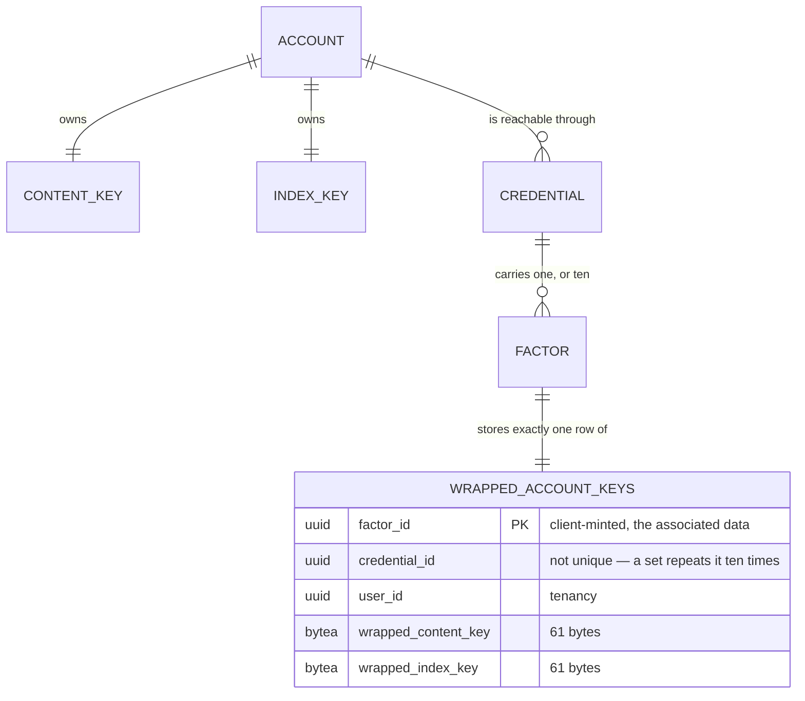

# Account Keys

## Table of Contents

- [Purpose](#purpose)
- [Key Entities](#key-entities)
- [Constraints](#constraints)
  - [MUST](#must)
  - [MUST NOT](#must-not)
- [Business Rules & Invariants](#business-rules--invariants)
- [Workflows & State Transitions](#workflows--state-transitions)
- [Decision Trees](#decision-trees)
- [Integration Points](#integration-points)
- [Edge Cases & Known Gotchas](#edge-cases--known-gotchas)

## Purpose

An account owns **one content key** and **one index key**. The content key is what the narrative
will be encrypted under; the index key is what a blind index over a name will be computed under.
Neither is derived from a credential. Every **recovery factor** — a registered passkey, or one
recovery code — derives its own **key-encryption key** and stores its own **wrapped copy of both**.

That shape is the whole point, and reversing it fails in two different ways. Deriving the content
key per credential is a recovery problem: text written on one authenticator would be unreadable on
another. Deriving the *index* key per credential is worse, because it is a correctness failure — two
index keys produce two blind index values for one name, the uniqueness constraint stops colliding,
and a person signing in from a second device silently accumulates duplicate payees while the
constraint appears to work.

**What is built today is the cryptography and the three write paths that store its output.** The
client can generate the keys, derive a key-encryption key from either kind of factor, wrap both keys
under it and unwrap them again; the server refuses to register a passkey, issue a set of recovery
codes, **or create an account** unless the request carries a factor identifier and both wrapped keys
for every factor it brings into existence, and files them in the same save as the credential.

**The two halves are joined on one path.** `register.service.ts` obtains a PRF output from a real
authenticator, draws the account's keys, mints the set, derives eleven key-encryption keys and posts
eleven pairs of envelopes, so an account created there really does own a content key and an index
key that no server has seen. The other two write paths are still reached only by the integration
suite. Unwrapping outside a spec, the locked state, the blind index and the encryption of any
narrative field are all later work — no screen decrypts anything, because nothing is encrypted yet.

**The PRF output never leaves the ceremony module.** `createPasskey` and `assertPasskey` each derive
through `keyEncryptionKeyFromPasskey` themselves and hand back a **non-extractable `CryptoKey`**,
zero-filling the raw bytes behind them: a module that returned the output and let a caller derive
would put the value that unwraps the account's whole keyspace into a variable any screen could log.

## Key Entities

- **Content key** — 32 random bytes, generated in the browser. Never transmitted.
- **Index key** — 32 random bytes, generated in the browser, drawn independently of the content key.
  Never transmitted.
- **Key-encryption key** — 32 bytes derived from a recovery factor by HKDF-SHA-256, imported as a
  **non-extractable** `AES-GCM` `CryptoKey`. Never transmitted, and never readable back out of the
  browser's key store. The **bytes it was imported from** are a different thing and they do exist —
  two buffers per derivation, both zero-filled where the import consumes them. See
  [What becomes of the bytes](#what-becomes-of-the-bytes).
- **Wrapped key** — the versioned envelope below over a 32-byte key. Exactly 61 bytes. The only one
  of the four that ever reaches the server.
- **Factor identifier** — the `factor_id` of the `wrapped_account_keys` row, minted by the client
  and the table's **primary key**. It is the value the associated data binds a wrapped key to.
  Deliberately **not** the credential id;
  [ADR 0018](../decisions/0018-give-the-wrapped-account-keys-a-policed-table-and-their-own-factor-identifier.md)
  gives the reason.
- **Recovery factor** — one secret that can derive a key-encryption key, which is **not** the same
  as one credential. A passkey is one factor and one credential. A set of recovery codes is one
  credential and **ten** factors, because each code is a secret of its own. That distinction is what
  the primary key records: `credential_id` is an ordinary column and repeats ten times for a set.

Deliberately **absent** from anything this module produces: any representation of an unwrapped key
on the wire, any key-encryption key outside the browser, any PRF output, and any recovery code.
`recovery-codes.ts` mints codes and `account-keys.ts` consumes their canonical form; neither ever
hands a code to a caller that could transmit it.



## Constraints

### MUST

- **The keys MUST come from a cryptographically secure random source, and the two MUST be drawn
  independently.**
  - **Why**: an index key derived from the content key is still 32 distinct-looking bytes, so every
    test that measures width or difference passes while the two keys share a secret.
  - **Enforced in**: `generateAccountKeys` in `+core/security/account-keys.ts`, drawing 64 bytes in
    one `crypto.getRandomValues` call and splitting them into copies. `account-keys.spec.ts` asserts
    the full 64 bytes were requested, that both returned regions appear in the output, and that
    `Math.random` was never called. No layer below the browser can check this. The draw itself is
    zero-filled in a `finally` before the return.

- **Each recovery factor MUST derive its own key-encryption key on its own HKDF branch.**
  - **Why**: the branches are what keep two secrets derived from one recovery code independent. The
    server stores `SHA-256(verifier)`, and the verifier and the key-encryption key differ only by
    HKDF's `info` — so a database reader holding the hash is two one-way steps and a different
    `info` away from the key.
  - **Enforced in**: the client. `account-keys.spec.ts` pins the two branches distinct, and pins the
    recovery-code key-encryption key distinct from the verifier derived from the same code.

- **A buffer holding a secret that goes nowhere MUST be zero-filled where it is consumed**, in a
  `finally` rather than in a statement before the return.
  - **Why**: a copy made for the platform is a copy nothing outside that call names, so the code
    owning the original cannot reach it — its own `finally` clears the array it holds while the copy
    stays on the heap for the life of the tab. The `finally` rather than the plain statement is the
    same argument from the other end: the path that skips a wipe is the path where something has
    already gone wrong, which is the worst moment to leave the value that unwraps the account lying
    in a buffer.
  - **Enforced in**: the client, at three sites, each pinned by a spec that reads the buffer at the
    platform boundary before and after the call →
    [What becomes of the bytes](#what-becomes-of-the-bytes).

- **Both keys MUST be wrapped under every recovery factor — every passkey, and every one of a set's
  ten codes.**
  - **Why**: a factor that cannot open the account's keys is not a way back in, however well it
    proves identity. At code granularity the failure is worse than useless: nine of ten redemptions
    would open a session that unlocks nothing, and the person would meet that on the day they had
    already lost their authenticator.
  - **Enforced in**: two mechanisms holding different halves. `wrapped_content_key` and
    `wrapped_index_key` are both `NOT NULL` on a table keyed on `factor_id`, so "a factor carries
    both keys or no row at all" is a column definition. **That the row exists at all is not a schema
    fact** — one-to-optional is not expressible without a trigger, and ADR 0002 forbids pushing
    procedural logic down.
    - **What holds it is a property of the write surface, and the property is the rule rather than
      the count.** *Every* path that can bring a recovery factor into existence demands the members
      and writes the row in the **same `SaveChanges`** as the credential. There are three today, and
      the third arrived without weakening anything. Stated as a count it would have been wrong the
      day the count changed: a **fourth** path that keeps the property costs nothing, and a fourth
      that does not creates a factor holding no share of the keys and **reddens nothing**.

- **A wrapped key MUST be bound to its factor and to which of the two keys it is.**
  - **Why**: binding only the factor leaves the two copies distinguishable solely by which column
    they land in, so swapping them gives the account a second index keyspace — the exact failure the
    single index key exists to prevent.
  - **Enforced in**: the client, through the associated data below. Nothing beneath the browser can
    check it; the database cannot tell one 61-byte envelope from another.

- **Every client MUST implement the identical contract below.** A field wrapped by one client is
  readable by another. Divergence is a defect in whichever client departs from it, not a
  negotiation.
  - **Enforced in**: frozen known-answer vectors in the client specs, restated in this document so a
    second implementation reads a specification rather than another client's test file.

### MUST NOT

- **No unwrapped key, key-encryption key, PRF output, or recovery code MUST reach the server.**
  - **Why**: the operator holding the database and every backup must recover nothing. A
    key-encryption key on the wire would hand over the account.
  - **Enforced in**: the shape of the request surface — no member of any endpoint's request type can
    hold one — and by there being no server-side type for any of them. What *does* cross is the same
    three members on each of three routes: a factor identifier and two envelopes, each of which the
    server can check the shape of and open none of. On `POST /api/registration` that triple arrives
    eleven times over.

- **A factor identifier MUST be one spelling on the wire.** The write paths accept a UUID in the
  **lower-case** 36-character hyphenated form with no surrounding whitespace, and nothing else — not
  the braced, parenthesised or undashed spellings `Guid.TryParse` would take, not upper-case or
  mixed-case hex, not the same UUID with a leading or trailing space, and not the all-zero UUID.
  - **Why**: it is the value both envelopes were sealed against, so a client that sent one spelling
    and bound another finds its own envelopes unopenable, permanently and with no error naming the
    cause. The all-zero UUID is refused separately because it is what an unset field sends and it is
    the one value two accounts reach independently — on a unique index spanning the whole table,
    that turns a client bug into a cross-account collision.
  - **Enforced in**: `CanonicalFactorId.TryParse`, one definition `CompleteRegistrationHandler`,
    `GenerateRecoveryCodesHandler` and `RegisterAccountHandler` all call, because they write the
    same column and a rule that drifted on one would seal an account's keys under a spelling the
    others cannot reproduce. The third caller is where a copy would have been easiest to justify and
    worst to hold — it parses eleven identifiers on one request. It compares the supplied text
    **ordinally against what the parsed value renders as**: `Guid.TryParseExact(value, "D", …)` on
    its own does *not* pin a spelling, since `"D"` is a format rather than a spelling — it admits
    upper-case and mixed-case hex, and trims leading and trailing whitespace before it reads the
    format at all. A length check closes neither the case folding nor the trim; a regular expression
    can close both, but it is a second, hand-maintained copy of a rendering this code does not own.

- **The key-encryption key MUST NOT be extractable.** It is imported with `extractable: false` and
  only `encrypt`/`decrypt` usages.
  - **Read the claim at its real width: it is about the boundary.** What holds by construction is
    that **what leaves the derivation is a `CryptoKey`** — there is no API that reads one back out,
    so nothing downstream can log the value that unwraps the account's whole keyspace, serialise it
    into a request body, put it in `localStorage` or hand it to a crash reporter. It is **not** a
    claim that the value never exists as bytes: it does, twice per derivation, inside the module.
    That those bytes do not outlive the call is a separate and weaker kind of rule — a wipe somebody
    wrote rather than an absence nothing can undo.

- **The PRF eval input, the two `info` strings and the associated-data prefix MUST NOT be edited.**
  - **Why**: each carries a `/v1` suffix, and a change to any of them changes every value derived
    under it. The symptom is silent — accounts that wrapped under the old value simply stop
    unwrapping. A change is a new version minted alongside the old, never an edit in place.

## Business Rules & Invariants

### The cryptographic contract

A second client implements from this table. **It is normative here rather than in any client's
source: a second implementation cannot read another's test files, so anything stated only in code is
not part of the contract.**

| | Passkey factor | **One** recovery code |
|---|---|---|
| Input keying material | the WebAuthn PRF output | UTF-8 of the **canonical** code |
| PRF eval input | `budgetoid/passkey/prf-eval-input/v1` (UTF-8) | n/a |
| KDF | HKDF-SHA-256, **empty salt** | HKDF-SHA-256, **empty salt** |
| `info` | `budgetoid/passkey/key-encryption-key/v1` | `budgetoid/recovery-code/key-encryption-key/v1` |
| Output | 32 bytes → non-extractable `AES-GCM` `CryptoKey` | same |

**The unit is one code, not one set, and this is the single most likely thing to get wrong.** A set
is ten independent secrets, each deriving its own key-encryption key, so a set stores **ten**
`wrapped_account_keys` rows — one per code, each with its own client-minted factor identifier and
its own pair of envelopes.

Nothing links a code's `recovery_code_hashes` row to its `wrapped_account_keys` row, and that is
deliberate rather than missing: the link would have to live on the hash table, which is exempt from
row-level security and holds a pinned column set. A client that has just redeemed a code reads the
account's wrapped rows and **tries each in turn** — the associated data binds each pair to its own
factor, so exactly one opens and the rest fail to authenticate. Twenty AEAD attempts is a cost
nobody can measure.

**Empty salt** means the zero-length octet string. HKDF-Extract is HMAC keyed on the salt and HMAC
pads a short key with zeros to the block size, so a library taking `nil`, `""` or 32 zero bytes all
reach the same pseudo-random key. There is no per-account value a salt could be taken from anyway: a
redemption arrives carrying a code and no identity at all.

**The PRF eval input is the value handed to the extension, not the value the authenticator hashes.**
WebAuthn's `prf` extension takes it as `eval.first` and the platform hashes
`SHA-256("WebAuthn PRF" ‖ 0x00 ‖ input)` before the authenticator ever sees it. A client going
through WebAuthn gets that for free; a client speaking CTAP `hmac-secret` directly must apply the
prefix itself, or it derives a different key-encryption key from an authenticator that signs
perfectly. Only `eval.first` is used; `eval.second` is not part of this contract.

**The canonical form of a recovery code**, in full, because a pointer at a source file is not a
specification:

1. Upper-case, with the **invariant** mapping — never a locale-sensitive one. A Turkish locale maps
   `i` to `İ`, which no later step recognises.
2. Remove every hyphen-minus `U+002D`, and every character in exactly this set: `U+0009`, `U+000A`,
   `U+000B`, `U+000C`, `U+000D`, `U+0020`, `U+00A0`, `U+1680`, `U+2000`–`U+200A`, `U+2028`,
   `U+2029`, `U+202F`, `U+205F`, `U+3000`, `U+FEFF`. Enumerated rather than named, because
   "whitespace" is a different set in every regular-expression dialect — JavaScript's `\s` includes
   `U+FEFF` and excludes `U+0085`; .NET's excludes `U+FEFF` and includes `U+0085`; Java's without
   the Unicode flag is ASCII only. Two honest implementers reading the word would disagree, and the
   symptom is a code that will not redeem and keys that will not unwrap, with nothing naming the
   cause.
3. Fold `I` and `L` to `1`, and `O` to `0`. `U` is deliberately unmapped.

The steps are ordered and the order matters: folding before upper-casing would leave `il o` as `ILO`
rather than `110`. The same canonical form feeds the verifier the server stores; the two derivations
differ only in HKDF's `info`.

**Envelope** — the byte sequence stored in a column and carried on the wire as unpadded base64url:

```
version (1 byte) || nonce (12 bytes) || ciphertext || tag (16 bytes)
```

Version `0x01` is AES-256-GCM with a 96-bit nonce and a 128-bit tag, and is the only version
defined. Over a 32-byte key the envelope is therefore exactly **61 bytes** — a width, not a cap,
because AES-GCM ciphertext is the length of its plaintext.

**Every nonce MUST be freshly drawn from a cryptographically secure random source, and this is a
requirement of the contract rather than an implementation detail.** A counter starting at zero per
factor is an ordinary, defensible choice for an implementer reading only the layout above — and it
repeats immediately, because **both of a factor's envelopes are sealed under the same key-encryption
key**. Two GCM ciphertexts under one (key, nonce) give
`C_content ⊕ C_index = contentKey ⊕ indexKey`, which destroys the independence of the two account
keys that this design's whole correctness argument rests on, and hands out the GHASH subkey with it.
Nothing observable goes wrong: both clients still open each other's envelopes, and every frozen
vector below still passes.

**Associated data** of a wrapped key:

```
"budgetoid/wrapped-key/v1" || 0x1F || <factor id, lower-case hyphenated> || 0x1F || <"content" | "index">
```

UTF-8. `0x1F` is the ASCII unit separator and cannot occur in any of the three fields, so no length
prefixes are needed. The factor id is **normalised** before it is used: the client accepts the
spellings a `Guid` can be written in and folds them to the lower-case hyphenated form, and refuses
anything that is not a UUID. **The server normalises nothing** — it refuses any spelling but that
one, so the two sides agree on the bytes by the server never storing a value whose rendering differs
from what it was sent. A client that normalises the other way, or not at all, is turned away at the
write rather than discovering months later that its envelopes do not open.

### Frozen known-answer vectors

A red result names which input changed. It never means updating the constant.

**Key-encryption key from a passkey factor**, observed through a seal because the key itself is
non-extractable:

| | |
|---|---|
| PRF output | `404142434445464748494a4b4c4d4e4f505152535455565758595a5b5c5d5e5f` |
| nonce | `b0b1b2b3b4b5b6b7b8b9babb` |
| plaintext | `202122232425262728292a2b2c2d2e2f303132333435363738393a3b3c3d3e3f` |
| associated data | `budgetoid/account-keys/spec/v1` |
| envelope (61 bytes) | `01b0b1b2b3b4b5b6b7b8b9babbcc175362fa23e1b57690d974afd12fd44aa18baa1184ae370fa0fef7711ca912e1b77dc29b673f8035c130ca48b65505` |

**Key-encryption key from one recovery code**, over the same code the verifier vector in
[recovery-codes.md](recovery-codes.md) uses — deliberately, so the pair proves the two branches are
separate on one input rather than merely different on two:

| | |
|---|---|
| code (already canonical) | `0123456789ABCDEFGHJKMNPQRS` |
| `info` | `budgetoid/recovery-code/key-encryption-key/v1` |
| derived key | `c0e5b232a2357e7af8f66b5a350c6c63bf90df1b8482f5e0e6adf2f9205e6875` |
| nonce | `c0c1c2c3c4c5c6c7c8c9cacb` |
| plaintext | `404142434445464748494a4b4c4d4e4f505152535455565758595a5b5c5d5e5f` |
| associated data | `budgetoid/recovery-code/spec/v1` |
| envelope (61 bytes) | `01c0c1c2c3c4c5c6c7c8c9cacbc989999fa07877001b181630c519f634e2508f0244b66f6a5f691a79c01bee8dd8bfbb2649838e3cf8266e86fa021bf1` |

The verifier derived from that same code under `budgetoid/recovery-code/verifier/v1` is
`aGr2Qher4pOLKZ335Uwyi92Ti9GAZ-Ek5G_9Br5plNE`. The two share an HKDF-Extract and differ only in
`info`; a client that computes one correctly and the other wrongly has swapped the labels, and
holding both vectors is the only way to see that.

**Associated data** for factor `c1d2e3f4-5a6b-7c8d-9e0f-a1b2c3d4e5f6`, purpose `content`, 69 bytes:

```
6275646765746f69642f777261707065642d6b65792f76311f63316432653366342d356136622d376338642d396530662d6131623263336434653566361f636f6e74656e74
```

**Envelope**, independent of the account keys, with a fixed AES-256 key:

| | |
|---|---|
| key | `000102030405060708090a0b0c0d0e0f101112131415161718191a1b1c1d1e1f` |
| nonce | `a0a1a2a3a4a5a6a7a8a9aaab` |
| plaintext | `808182838485868788898a8b8c8d8e8f909192939495969798999a9b9c9d9e9f` |
| associated data | `budgetoid/key-envelope/spec/v1` |
| envelope (61 bytes) | `01a0a1a2a3a4a5a6a7a8a9aaab6699feaec14e8438eaec0d588bf74e51e03dcb830622d4fb0497bc1de336eb9e21d4cc389d668944133ecec0a071274d` |

### What becomes of the bytes

**The boundary claim and the byte claim are two claims, and only the first holds by construction.**
A derivation hands back a non-extractable `CryptoKey` and nothing that holds one can read the value
out of it — a property of WebCrypto rather than of anybody's care. Inside the derivation the same
value is bytes, and what keeps *those* from outliving the call is an ordinary `fill(0)` that
somebody wrote and somebody else can delete.

Three buffers hold a secret long enough to matter, and each is cleared where it is consumed:

- **The 64-byte draw inside `generateAccountKeys`** — the one buffer in which the content key and
  the index key sit together in the clear. The irony is exact, and it is why this wipe cannot be
  left to a caller: the two keys are *copies* of regions of that draw precisely so that a caller
  wiping one does not wipe the other, and it is that copying which puts the originals somewhere no
  caller can name.
- **The copy `importKeyEncryptionKey` makes for WebCrypto, and the material it was handed.** That
  material is the key-encryption key itself, in the clear, on a buffer nothing outside the call
  names once `importKey` has been given it. Both derivations share this one import, so a
  registration runs eleven derivations through it.
- **The plaintext copy `sealEnvelope` hands the cipher**, cleared once the cipher resolves and never
  before: WebCrypto reads the buffer asynchronously, so a wipe placed ahead of the `await` seals
  zeros. One registration wraps two account keys under eleven factors, so twenty-two of these pass
  through a single sign-up.

Each is pinned by a spec that takes the buffer at the platform boundary and reads it **twice** —
once at the call, asserting it held key material that was not already zero, and once after. The
first reading is what makes a green result impossible for an implementation that drew, derived or
sealed nothing; the second is the rule. The two specs that spy on `crypto.subtle` **call through**
rather than faking, because a buffer no real import and no real cipher ever consumed says nothing
about what production does with one. What a spec cannot reach is the second buffer at the import: it
observes the copy that crosses the boundary, and the material behind that copy is cleared in the
same `finally`.

**Two copies are deliberately left uncleared, and both need saying so nobody "fixes" them.** The
associated data `sealEnvelope` also copies is **not secret** — it names a factor and which of two
keys a copy holds, and is re-supplied from wherever the envelope was found in order to open it. The
recovery-code **verifier** branch keeps its uncleared copy for a sharper reason: a verifier is sent
to the server, so clearing it locally buys nothing the wire has not already given away.

**The wipe belongs to the consumer rather than to the producer.** `hkdfSha256` is a general utility
with several callers, so reshaping it into a callback or a disposable to suit one caller's hygiene
would be an API change every other caller pays for. Clearing at the point of consumption is local,
and it is the honest reading of ownership: the material dies where it is used, not where it was
made.

### The one client that produces them

There is exactly one place in this product where an account's keys exist in the clear, and it is the
registration flow. Four rules govern what it does with them, and each is invisible when broken.

**The account keys are drawn once for the whole set, and wiped as soon as the eleven wraps are
done.** One `generateAccountKeys()` call sits outside every loop; the two buffers are zero-filled in
a `finally`, so a wrap that rejects halfway does not leave them alive — and the draw those two
buffers were split out of is wiped by `generateAccountKeys` itself, because this flow cannot name
it. Drawing a pair **per factor** is the mistake worth naming: it satisfies every type, count, round
trip and constraint the database holds, and it gives the second factor a second, incompatible
account. Keeping the keys "for the encryption epic" is the other temptation and has no upside at
all: nothing on this client encrypts anything yet, every path that retries re-draws them, and the
epic that needs them will unwrap them from an envelope as every later session must.

**The eleven key-encryption keys are locals and never touch the service instance.** Each is an
expression handed straight to the wrap, so none outlives the method whatever a later reader adds to
the class. That is belt *and* braces with the non-extractable import above, deliberately, and
neither half rests on the other. The wider rule the flow keeps: **a value is a signal only if a
template renders it**, because a signal on an injectable is one `effect()` away from being logged by
somebody debugging a re-render. The ten codes are the one secret published that way, because the
screen that shows them has to read them from somewhere.

**One code's four submitted members are produced in one scope, from one code** — its verifier, its
factor identifier and its two envelopes, pushed together. The obvious implementation derives ten
key-encryption keys into an array, wraps ten times into a second, and zips the results against the
ten factor identifiers at post time.

**What must never come apart is the factor identifier and the envelopes beside it**, because that
identifier *is* the associated data both envelopes were sealed with. A submission holding one code's
identifier and another code's envelopes rebuilds associated data that reproduces neither seal, so
that factor opens nothing — ever, for anybody — and **nothing on either side of the wire can see
it**. The set validates, the account is created, a session is handed over, and it is found by
somebody who redeemed a code months later and met an account still locked.

**The verifier is the one member that could float without consequence, and naming that is the point
of this paragraph.** It lands in `recovery_code_hashes`, which carries no `factor_id` and no link of
any kind to `wrapped_account_keys`, so a set whose ten verifiers were permuted against its ten
identifier-and-envelope triples is indistinguishable from a correct one at redemption and forever
after: the hash locates the credential, and the code's own key-encryption key opens whichever of
that credential's ten envelope pairs it was sealed under. Building all four in one scope is still
the right shape, because a scope is cheaper than a rule about which members may be zipped — but the
member that makes it load-bearing is the identifier, and a reader holding the wrong half will defend
the wrong line.

**The factor identifier is minted by `+core/security/factor-id.ts` and by nothing else**, in the one
canonical spelling — `crypto.randomUUID()` lower-cased. The `toLowerCase` is not redundant even
though the platform is specified to emit lower-case hex: it costs one call and it is the single line
between this client and envelopes that never open again, on a contract this module does not own. Its
companion predicate **reports and does not fold**: a caller wanting a canonical value mints one.
That is the deliberate counterpart to `account-keys.ts` tolerating several spellings and folding
them — folding defends against values arriving from elsewhere, while emitting one spelling is a
property of the values this client creates.

### What the database can and cannot hold to account

`wrapped_account_keys` refuses an envelope that is not 61 bytes and one whose leading byte is not
`0x01`, on both columns, and it refuses a row against a `federated` credential. It **cannot** tell a
content key from an index key, and cannot notice the two being written to each other's column — both
are 61 bytes, both carry version 1, both columns are `NOT NULL`. That binding is cryptographic and
lives in the associated data.

## Workflows & State Transitions

Steps 1–4 are the client module. The registration flow reaches all four; nothing else in the browser
reaches any of them. Step 5 is the server, and all three routes refuse a request without it.

1. **Minting an account's keys.** 64 bytes are drawn in one call and split into two independent
   copies. No further state exists — the keys live only in memory.
2. **Deriving a key-encryption key.** From a PRF output, or from a code by way of its canonical
   form. An empty canonical form is refused, exactly as the verifier derivation refuses it.
3. **Wrapping.** Each key is sealed under the factor's key-encryption key with its own associated
   data, and rendered as unpadded base64url.
4. **Unwrapping.** Each wire value is decoded and opened with the same associated data. A copy moved
   to another factor, or to the other purpose, fails to authenticate rather than returning wrong
   bytes.
5. **Storing.** `POST /api/passkeys/registration` carries one `factorId`, `wrappedContentKey` and
   `wrappedIndexKey`. `POST /api/me/recovery-codes` carries **ten** submissions, each a code's
   verifier beside that code's own factor identifier and envelope pair. `POST /api/registration`
   carries **both shapes at once**, because it brings **eleven** factors into existence in one act.
   Each handler checks every identifier's spelling, every envelope's width and version, and —
   wherever a set is presented — that no two identifiers in the set repeat, then writes **in the
   same `SaveChanges`** as the credential: four rows on the passkey path, twenty-one on the
   recovery-code path, and roughly thirty on the registration path, of which eleven are wrapped-key
   rows. There is no partial state in which a factor exists holding no share of the keys.

   The set's ten identifiers must differ, and that rule lives in the handler rather than being left
   to the primary key: as a `23505` it would arrive *after* the previous set had already been
   deleted inside the same transaction, and it would say "that factor identifier is already
   registered" about a factor the client never registered. **Registration adds an eleventh
   comparison the other two paths have no need of** — the passkey's identifier against the ten,
   because those eleven land on one primary key in one save — and projects the set's rows from the
   one validated list rather than zipping them from three. See [registration.md](registration.md).

**Both registering paths validate the wrapped keys after the `prf` gate, and the ordering is a
rule.** A client that cannot do PRF cannot have produced a wrapped key either, so those members are
very often absent on exactly the requests the gate is for. Judged first, such a request would be
told its payload was malformed — sending somebody holding a device that genuinely lacks the
extension off to debug their client.

**Replacing a set of recovery codes replaces all ten of its wrapped rows by the database's
cascade**, never by the application: the role holds no `DELETE` on `wrapped_account_keys` at all, so
a handler that materialised them would die with `42501` rather than quietly take them. That is the
same never-materialise rule the recovery-code hashes already carry, binding a second table and
failing the opposite way — loudly. What changes at ten rows is the temptation, since "load the
replaced set's envelopes so we can check we are replacing as many as we found" is a sentence nobody
could write when there was one.

**Redeeming a code deletes its hash row and leaves its wrapped row standing**, and that asymmetry is
deliberate. Consuming a code removes its ability to *authenticate*; it cannot remove its ability to
*decrypt*, because the secret that opens the envelope is the code itself, written on a card this
system has never seen. Deleting the row would need a `DELETE` grant this table withholds on purpose.
Nothing is leaked that was not already reachable: whoever holds a spent code and a copy of the
database could have decrypted with it before redeeming too.

## Decision Trees

**Which branch derives the key-encryption key?**

- the factor is a registered passkey → the PRF branch, over the authenticator's PRF output
- the factor is **one recovery code** → the recovery-code branch, over that code's canonical form.
  Not "the set" and not "a code chosen from the set": each of the ten derives its own, and each gets
  its own row.
- the factor is the account's federated credential → **there is none.** OAuth has no PRF equivalent,
  so a provider gates registration and an email change and never holds keys. The database refuses
  such a row.

**A wrapped key fails to open. What does that mean?**

- the wrong factor's key-encryption key → the associated data disagrees, or the key does
- the two stored copies were swapped → the purpose in the associated data disagrees
- the envelope was altered → the tag does not verify

All three are one symptom by design: the client learns the value is not usable and learns nothing
about why.

## Integration Points

- **`recovery-codes.md`** — the code a key-encryption key is derived from, and why it never reaches
  the server. The verifier branch and this one are separated only by HKDF's `info`.
- **`registration.md`** — the **third** write path, and the only one that writes eleven rows in one
  save. It is also where the passkey factor's identifier is compared against the set's ten.
- **`passkeys.md`** — the ceremony that supplies the PRF output, and the three members registration
  carries. The registration path refuses an authenticator that reports no enabled `prf` result; that
  check is a product gate on an unverifiable claim, and a wrapped key is **not** the evidence that
  replaces it — the server cannot tell a key-encryption key derived through PRF from one derived out
  of a constant. What the wrapped keys buy is narrower and real: a factor holding no share of the
  account keys is unstorable.
- **[ADR 0018](../decisions/0018-give-the-wrapped-account-keys-a-policed-table-and-their-own-factor-identifier.md)**
  — where the wrapped copies live, why the factor identifier is its own column, and why the table
  holds no `UPDATE` or `DELETE` grant.
- **[data-isolation.md](../engineering/data-isolation.md)** — `wrapped_account_keys` is policed by
  `user_isolation`, and the two isolation tests that read it are what justify its `SELECT` grant.

## Edge Cases & Known Gotchas

- **The chain reaches a person on one path and stops short on the other two.** `/register` runs the
  whole of it, so `generateAccountKeys`, `wrapAccountKeys`, `keyEncryptionKeyFromPasskey` and
  `keyEncryptionKeyFromRecoveryCode` all have live callers. `unwrapAccountKeys` does **not**:
  nothing in this product opens an envelope outside a spec, because nothing is encrypted yet, and
  the day that changes is the day the locked state and the blind index arrive with it. Do not relax
  the server's demand for the envelopes to make one of those screens easier to write later.
- **The PRF output is never sent, and one line is what stops it.** `getClientExtensionResults()`
  carries `prf.results.first`, which *is* the PRF output. `toRegistrationPayload` therefore
  **projects** — it builds a new `{ prf: { enabled } }` rather than passing the results object
  through, filtering it, or spreading it with a member omitted. The two rejected shapes both start
  from the value they are trying to be rid of, so the next member an authenticator invents arrives
  inside them. A pass-through would hand the operator every account key in the product, in a request
  that would look ordinary in a log, a proxy and a review. The **value** of `enabled` is a separate
  question and the caller answers it — the ceremony reports what it established rather than what
  `create()` returned; see [passkeys.md](passkeys.md).
- **Signing in derives a key-encryption key too, and that is a decision.** The cheaper reading — a
  sign-in only has to prove who is asking, so ask for no PRF and derive nothing — is what a reader
  will propose, and it is wrong for the day encryption lands: the wrapped account keys are opened
  under exactly that value, so an assertion that derived nothing would authenticate the person and
  leave every row on their account unreadable. Both ceremony legs ask for the input and both return
  a key; a caller that only wants the assertion takes the payload and lets the key go.
- **The base64url decoder is strict, and the client's is stricter than the server's, deliberately.**
  It refuses padding, the standard alphabet's `+` and `/`, any character outside the URL-safe set,
  an impossible length, and a non-canonical trailing group. `PasskeyEncoding.TryDecode` accepts
  padding, because `Base64Url` does and the looser bound is the one that never refuses a member a
  client legitimately encoded. Nothing is lost by the difference — the column stores decoded bytes,
  so a padded envelope and an unpadded one become the same row. The strictness is a rule about what
  *this* client emits, not a claim about what the server admits; a lenient decoder here would accept
  a wrapped key the server's decoder rejects, and the symptom would arrive months later as a key
  that will not unwrap.
- **The PRF eval input is read by the ceremony, and a drift in it is silent.** Both legs send it as
  the `prf` extension's evaluation input, so it decides what every authenticator hands back — and a
  drifted value locks every account out with no error naming the cause, because the key-encryption
  key it produces is simply a different key by a passkey that still authenticates perfectly. Two
  things watch it, and neither is redundant: the pinned literal in `account-keys.spec.ts` catches an
  edit to the constant, and `passkey-label-single-source.spec.ts` scans the source tree for a
  `budgetoid/passkey/` literal outside the one module that owns it — because a *second copy* equal
  to the constant passes every runtime assertion there is, and is exactly the thing that drifts
  next.
- **A factor id spelled differently is a different binding.** The normalisation exists because a
  client that wrapped under an upper-case or braced spelling and read back the canonical one would
  find its own envelope unopenable, permanently and with no error that names the cause.
- **Losing every registered factor destroys the narrative.** There is no escrow, no support-assisted
  decryption and no administrative override, and none may be added.
