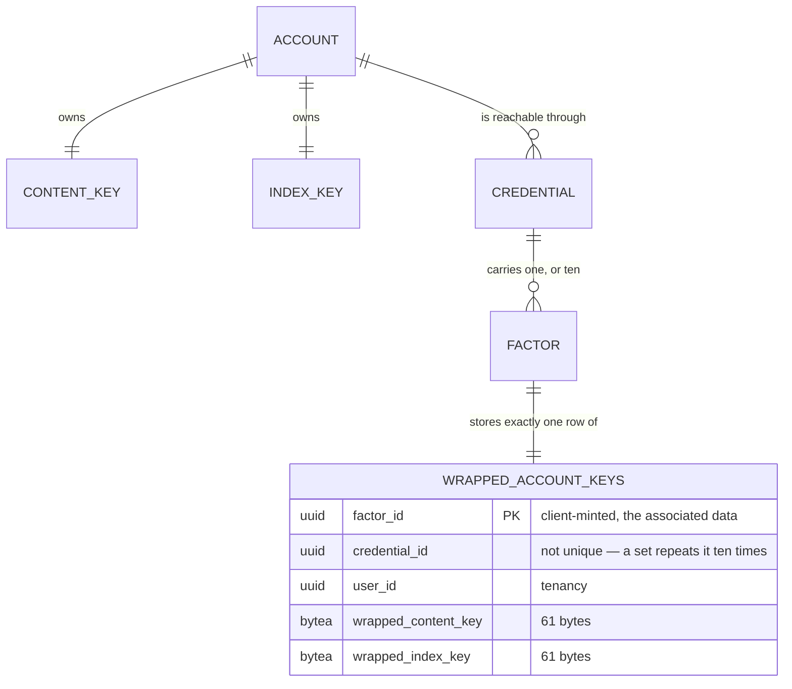

# Account Keys

## Table of Contents

- [Purpose](#purpose)
- [Key Entities](#key-entities)
- [Constraints](#constraints)
  - [MUST](#must)
  - [MUST NOT](#must-not)
- [Business Rules & Invariants](#business-rules--invariants)
- [Workflows & State Transitions](#workflows--state-transitions)
- [Decision Trees](#decision-trees)
- [Integration Points](#integration-points)
- [Edge Cases & Known Gotchas](#edge-cases--known-gotchas)

## Purpose

An account owns **one content key** and **one index key**. The content key is what the narrative
will be encrypted under; the index key is what a blind index over a name will be computed under.
Neither is derived from a credential. Every **recovery factor** — a registered passkey, or one
recovery code — derives its own **key-encryption key** and stores its own **wrapped copy of both**.

That shape is the whole point, and reversing it fails in two different ways. Deriving the content
key per credential is a recovery problem: text written on one authenticator would be unreadable on
another. Deriving the *index* key per credential is worse, because it is a correctness failure — two
index keys produce two blind index values for one name, the uniqueness constraint stops colliding,
and a person signing in from a second device silently accumulates duplicate payees while the
constraint appears to work.

**What is built today is the cryptography, the three write paths that store its output, the one
route that reads it back, and the browser that holds what comes out of it.** The client can generate
the keys, derive a key-encryption key from either kind of factor, wrap both keys under it and unwrap
them again; the server refuses to register a passkey, issue a set of recovery codes, **or create an
account** unless the request carries a factor identifier and both wrapped keys for every factor it
brings into existence, and files them in the same save as the credential.
`GET /api/me/account-keys` hands a signed-in browser back the envelopes of **every factor the account
holds** — see [The one route that hands them back](#the-one-route-that-hands-them-back).

**The circle is closed on two paths, and each closes it differently.** `register.service.ts` obtains
a PRF output from a real authenticator, draws the account's keys, mints the set, derives eleven
key-encryption keys and posts eleven pairs of envelopes, so an account created there really does own
a content key and an index key that no server has seen — and on the `201` it hands the pair it
already holds straight to custody, with no round trip. `sign-in.service.ts` takes the other route:
the assertion's PRF branch gives it a key-encryption key, it hands that to custody, and custody
reads the envelopes back and opens them. The other two write paths are still reached only by the
integration suite.

**What is *not* built is anything that uses the keys.** Nothing in this product is encrypted, so no
screen decrypts, no blind index is computed and no field is sealed. What exists is the **custody** —
[The one class that holds them](#the-one-class-that-holds-them) — and the operations that will
delegate to it arrive with the epic that needs them.

**The PRF output never leaves the ceremony module.** `createPasskey` and `assertPasskey` each derive
through `keyEncryptionKeyFromPasskey` themselves and hand back a **non-extractable `CryptoKey`**,
zero-filling the raw bytes behind them: a module that returned the output and let a caller derive
would put the value that unwraps the account's whole keyspace into a variable any screen could log.

## Key Entities

- **Content key** — 32 random bytes, generated in the browser. Never transmitted.
- **Index key** — 32 random bytes, generated in the browser, drawn independently of the content key.
  Never transmitted.
- **Key-encryption key** — 32 bytes derived from a recovery factor by HKDF-SHA-256, imported as a
  **non-extractable** `AES-GCM` `CryptoKey` through `importAesGcmKey`. **Any other width is
  refused rather than trusted**: that function throws on material that is not exactly 32 bytes, so
  the width is enforced in code and not merely written down here — which it has to be, because
  WebCrypto would take 16 and 24 bytes as a quieter AES without a word. Never transmitted, and
  never readable back out of the browser's key store. The **bytes it was imported from** are a
  different thing and they do exist —
  two buffers per derivation, both zero-filled where the import consumes them. See
  [The two doors](#the-two-doors-and-the-five-decisions-each-holds) and
  [What becomes of the bytes](#what-becomes-of-the-bytes).
- **Wrapped key** — the versioned envelope below over a 32-byte key. Exactly 61 bytes. The only one
  of the four that ever reaches the server.
- **Factor identifier** — the `factor_id` of the `wrapped_account_keys` row, minted by the client
  and the table's **primary key**. It is the value the associated data binds a wrapped key to.
  Deliberately **not** the credential id;
  [ADR 0018](../decisions/0018-give-the-wrapped-account-keys-a-policed-table-and-their-own-factor-identifier.md)
  gives the reason.
- **Recovery factor** — one secret that can derive a key-encryption key, which is **not** the same
  as one credential. A passkey is one factor and one credential. A set of recovery codes is one
  credential and **ten** factors, because each code is a secret of its own. That distinction is what
  the primary key records: `credential_id` is an ordinary column and repeats ten times for a set.
- **Locked account** — not a stored thing at all: an account whose **browser** does not hold the
  content key. Every tab starts in it, because nothing about the keys survives a page load, and
  presenting a factor is what leaves it. **It is not a locked session**, which is a different word
  for a different thing: a locked session is one a federated credential opened, a fact about a row in
  `sessions` and about what the *server* will answer — see [sessions.md](sessions.md). A person on a
  full session whose tab was reloaded is signed in and their account is locked, which is the ordinary
  case and would read as a contradiction under one word. The other direction cannot arise: a
  federated credential derives no key-encryption key, so nothing that opens a locked session could
  ever unlock an account. Blurring the two costs a reader the whole distinction, and the two chapters
  sit on either side of it.

Deliberately **absent** from anything this module produces: any representation of an unwrapped key
on the wire, any key-encryption key outside the browser, any PRF output, and any recovery code.
`recovery-codes.ts` mints codes and `account-keys.ts` consumes their canonical form; neither ever
hands a code to a caller that could transmit it.



## Constraints

### MUST

- **The keys MUST come from a cryptographically secure random source, and the two MUST be drawn
  independently.**
  - **Why**: an index key derived from the content key is still 32 distinct-looking bytes, so every
    test that measures width or difference passes while the two keys share a secret.
  - **Enforced in**: `generateAccountKeys` in `+core/security/account-keys.ts`, drawing 64 bytes in
    one `crypto.getRandomValues` call and splitting them into copies. `account-keys.spec.ts` asserts
    the full 64 bytes were requested, that both returned regions appear in the output, and that
    `Math.random` was never called. No layer below the browser can check this. The draw itself is
    zero-filled in a `finally` before the return.

- **Each recovery factor MUST derive its own key-encryption key on its own HKDF branch.**
  - **Why**: the branches are what keep two secrets derived from one recovery code independent. The
    server stores `SHA-256(verifier)`, and the verifier and the key-encryption key differ only by
    HKDF's `info` — so a database reader holding the hash is two one-way steps and a different
    `info` away from the key.
  - **Enforced in**: the client. `account-keys.spec.ts` pins the two branches distinct, and pins the
    recovery-code key-encryption key distinct from the verifier derived from the same code.

- **A buffer holding a secret that goes nowhere MUST be zero-filled where it is consumed**, in a
  `finally` rather than in a statement before the return.
  - **Why**: a copy made for the platform is a copy nothing outside that call names, so the code
    owning the original cannot reach it — its own `finally` clears the array it holds while the copy
    stays on the heap for the life of the tab. The `finally` rather than the plain statement is the
    same argument from the other end: the path that skips a wipe is the path where something has
    already gone wrong, which is the worst moment to leave the value that unwraps the account lying
    in a buffer.
  - **Enforced in**: the client, at three sites, each pinned by a spec that reads the buffer at the
    platform boundary before and after the call →
    [What becomes of the bytes](#what-becomes-of-the-bytes).

- **Both keys MUST be wrapped under every recovery factor — every passkey, and every one of a set's
  ten codes.**
  - **Why**: a factor that cannot open the account's keys is not a way back in, however well it
    proves identity. At code granularity the failure is worse than useless: nine of ten redemptions
    would open a session that unlocks nothing, and the person would meet that on the day they had
    already lost their authenticator.
  - **Enforced in**: two mechanisms holding different halves. `wrapped_content_key` and
    `wrapped_index_key` are both `NOT NULL` on a table keyed on `factor_id`, so "a factor carries
    both keys or no row at all" is a column definition. **That the row exists at all is not a schema
    fact** — one-to-optional is not expressible without a trigger, and ADR 0002 forbids pushing
    procedural logic down.
    - **What holds it is a property of the write surface, and the property is the rule rather than
      the count.** *Every* path that can bring a recovery factor into existence demands the members
      and writes the row in the **same `SaveChanges`** as the credential. There are three today, and
      the third arrived without weakening anything. Stated as a count it would have been wrong the
      day the count changed: a **fourth** path that keeps the property costs nothing, and a fourth
      that does not creates a factor holding no share of the keys and **reddens nothing**.

- **A wrapped key MUST be bound to its factor and to which of the two keys it is.**
  - **Why**: binding only the factor leaves the two copies distinguishable solely by which column
    they land in, so swapping them gives the account a second index keyspace — the exact failure the
    single index key exists to prevent.
  - **Enforced in**: the client, through the associated data below. Nothing beneath the browser can
    check it; the database cannot tell one 61-byte envelope from another.

- **Every client MUST implement the identical contract below.** A field wrapped by one client is
  readable by another. Divergence is a defect in whichever client departs from it, not a
  negotiation.
  - **Enforced in**: frozen known-answer vectors in the client specs, restated in this document so a
    second implementation reads a specification rather than another client's test file.

### MUST NOT

- **No unwrapped key, key-encryption key, PRF output, or recovery code MUST reach the server.**
  - **Why**: the operator holding the database and every backup must recover nothing. A
    key-encryption key on the wire would hand over the account.
  - **Enforced in**: the shape of the request surface — no member of any endpoint's request type can
    hold one — and by there being no server-side type for any of them. What *does* cross is the same
    three members on each of three routes: a factor identifier and two envelopes, each of which the
    server can check the shape of and open none of. On `POST /api/registration` that triple arrives
    eleven times over. The **outbound** direction is held by `KeyMaterialSecrecyTests`, a census over
    every member of every type a route serialises: what leaves on `GET /api/me/account-keys` is that
    same triple, sealed, and the census carries a written argument for each of the two envelopes
    rather than one sentence covering both — the two are the same width, carry the same version, and
    are indistinguishable to every check this server owns.

- **A factor identifier MUST be one spelling on the wire.** The write paths accept a UUID in the
  **lower-case** 36-character hyphenated form with no surrounding whitespace, and nothing else — not
  the braced, parenthesised or undashed spellings `Guid.TryParse` would take, not upper-case or
  mixed-case hex, not the same UUID with a leading or trailing space, and not the all-zero UUID.
  - **Why**: it is the value both envelopes were sealed against, so a client that sent one spelling
    and bound another finds its own envelopes unopenable, permanently and with no error naming the
    cause. The all-zero UUID is refused separately because it is what an unset field sends and it is
    the one value two accounts reach independently — on a unique index spanning the whole table,
    that turns a client bug into a cross-account collision.
  - **Enforced in**: `CanonicalFactorId.TryParse`, one definition `CompleteRegistrationHandler`,
    `GenerateRecoveryCodesHandler` and `RegisterAccountHandler` all call, because they write the
    same column and a rule that drifted on one would seal an account's keys under a spelling the
    others cannot reproduce. The third caller is where a copy would have been easiest to justify and
    worst to hold — it parses eleven identifiers on one request. It compares the supplied text
    **ordinally against what the parsed value renders as**: `Guid.TryParseExact(value, "D", …)` on
    its own does *not* pin a spelling, since `"D"` is a format rather than a spelling — it admits
    upper-case and mixed-case hex, and trims leading and trailing whitespace before it reads the
    format at all. A length check closes neither the case folding nor the trim; a regular expression
    can close both, but it is a second, hand-maintained copy of a rendering this code does not own.

- **The key-encryption key MUST NOT be extractable.** It is imported with `extractable: false` and
  only `encrypt`/`decrypt` usages.
  - **Read the claim at its real width: it is about the boundary.** What holds by construction is
    that **what leaves the derivation is a `CryptoKey`** — there is no API that reads one back out,
    so nothing downstream can log the value that unwraps the account's whole keyspace, serialise it
    into a request body, put it in `localStorage` or hand it to a crash reporter. It is **not** a
    claim that the value never exists as bytes: it does, twice per derivation, inside the module.
    That those bytes do not outlive the call is a separate and weaker kind of rule — a wipe somebody
    wrote rather than an absence nothing can undo.

- **An opened account key MUST NOT be persisted, and MUST NOT be shared with another tab.** Custody
  is per document and dies with it.
  - **Why**: a non-extractable `CryptoKey` is **structured-cloneable**, so both are reachable with
    no byte ever exposed and a reader who learns that will read their absence as an oversight rather
    than as a decision. IndexedDB is the expensive one: it makes the account's decryption capability
    outlive the browser closing, so whoever has the device and a live cookie reads the narrative
    with **no factor presented at all** — the requirement that a locked account stays locked failing
    while every check in the product still passes, because nothing about a stored key looks wrong.
    A `BroadcastChannel` hand-off is weaker and still wrong for the same reason one step down: it
    unlocks a tab in which nobody presented anything. What is left is the property the design rests
    on — **a page reload locks the account, and getting back in costs a ceremony.**
  - **Enforced in**: the absence, and the absence is all there is. Nothing in the client writes a
    key anywhere, and no test can prove a `BroadcastChannel` will not be added tomorrow. What
    narrows it is that `AccountKeyCustodyService` holds both keys on ECMAScript `#` fields with no
    accessor, so there is no supported way to *read* one back out in order to send it — a caller
    would have to add the member first, which is the change this constraint is addressed to.

- **The PRF eval input, the two `info` strings and the associated-data prefix MUST NOT be edited.**
  - **Why**: each carries a `/v1` suffix, and a change to any of them changes every value derived
    under it. The symptom is silent — accounts that wrapped under the old value simply stop
    unwrapping. A change is a new version minted alongside the old, never an edit in place.

## Business Rules & Invariants

### The cryptographic contract

A second client implements from this table. **It is normative here rather than in any client's
source: a second implementation cannot read another's test files, so anything stated only in code is
not part of the contract.**

| | Passkey factor | **One** recovery code |
|---|---|---|
| Input keying material | the WebAuthn PRF output | UTF-8 of the **canonical** code |
| PRF eval input | `budgetoid/passkey/prf-eval-input/v1` (UTF-8) | n/a |
| KDF | HKDF-SHA-256, **empty salt** | HKDF-SHA-256, **empty salt** |
| `info` | `budgetoid/passkey/key-encryption-key/v1` | `budgetoid/recovery-code/key-encryption-key/v1` |
| Output | 32 bytes → non-extractable `AES-GCM` `CryptoKey` | same |

**The unit is one code, not one set, and this is the single most likely thing to get wrong.** A set
is ten independent secrets, each deriving its own key-encryption key, so a set stores **ten**
`wrapped_account_keys` rows — one per code, each with its own client-minted factor identifier and
its own pair of envelopes.

Nothing links a code's `recovery_code_hashes` row to its `wrapped_account_keys` row, and that is
deliberate rather than missing: the link would have to live on the hash table, which is exempt from
row-level security and holds a pinned column set. A client that has just redeemed a code reads the
account's wrapped rows and **tries each in turn** — the associated data binds each pair to its own
factor, so exactly one opens and the rest fail to authenticate. Twenty AEAD attempts is a cost
nobody can measure.

**Empty salt** means the zero-length octet string. HKDF-Extract is HMAC keyed on the salt and HMAC
pads a short key with zeros to the block size, so a library taking `nil`, `""` or 32 zero bytes all
reach the same pseudo-random key. There is no per-account value a salt could be taken from anyway: a
redemption arrives carrying a code and no identity at all.

**The PRF eval input is the value handed to the extension, not the value the authenticator hashes.**
WebAuthn's `prf` extension takes it as `eval.first` and the platform hashes
`SHA-256("WebAuthn PRF" ‖ 0x00 ‖ input)` before the authenticator ever sees it. A client going
through WebAuthn gets that for free; a client speaking CTAP `hmac-secret` directly must apply the
prefix itself, or it derives a different key-encryption key from an authenticator that signs
perfectly. Only `eval.first` is used; `eval.second` is not part of this contract.

**The canonical form of a recovery code**, in full, because a pointer at a source file is not a
specification:

1. Upper-case, with the **invariant** mapping — never a locale-sensitive one. A Turkish locale maps
   `i` to `İ`, which no later step recognises.
2. Remove every hyphen-minus `U+002D`, and every character in exactly this set: `U+0009`, `U+000A`,
   `U+000B`, `U+000C`, `U+000D`, `U+0020`, `U+00A0`, `U+1680`, `U+2000`–`U+200A`, `U+2028`,
   `U+2029`, `U+202F`, `U+205F`, `U+3000`, `U+FEFF`. Enumerated rather than named, because
   "whitespace" is a different set in every regular-expression dialect — JavaScript's `\s` includes
   `U+FEFF` and excludes `U+0085`; .NET's excludes `U+FEFF` and includes `U+0085`; Java's without
   the Unicode flag is ASCII only. Two honest implementers reading the word would disagree, and the
   symptom is a code that will not redeem and keys that will not unwrap, with nothing naming the
   cause.
3. Fold `I` and `L` to `1`, and `O` to `0`. `U` is deliberately unmapped.

The steps are ordered and the order matters: folding before upper-casing would leave `il o` as `ILO`
rather than `110`. The same canonical form feeds the verifier the server stores; the two derivations
differ only in HKDF's `info`.

**Envelope** — the shared AEAD framing, its version byte, its wire form and the rules every
client implements it under are stated once in
[ciphertext-envelope.md](ciphertext-envelope.md), because a second consumer now reads the same
format and two copies of a layout drift silently. What belongs to *this* document is the one
number that follows from the payload: over a 32-byte key the envelope is exactly **61 bytes** —
a width, not a cap, because AES-GCM ciphertext is the length of its plaintext. That equality is
the entity's own rule and is enforced on top of the shared framing, which carries a floor and no
width at all.

**Nonce freshness is a rule of the format and is argued in
[ciphertext-envelope.md](ciphertext-envelope.md).** What this document owns is why a repeat is
especially cheap to reach here: **both of a factor's envelopes are sealed under the same
key-encryption key**, so a counter starting at zero per factor repeats on the very next
operation, and two GCM ciphertexts under one (key, nonce) give
`C_content ⊕ C_index = contentKey ⊕ indexKey` — which destroys the independence of the two
account keys that this design's whole correctness argument rests on.

**Associated data** of a wrapped key:

```
"budgetoid/wrapped-key/v1" || 0x1F || <factor id, lower-case hyphenated> || 0x1F || <"content" | "index">
```

UTF-8. `0x1F` is the ASCII unit separator and cannot occur in any of the three fields, so no length
prefixes are needed. The factor id is **normalised** before it is used: the client accepts the
spellings a `Guid` can be written in and folds them to the lower-case hyphenated form, and refuses
anything that is not a UUID. **The server normalises nothing** — it refuses any spelling but that
one, so the two sides agree on the bytes by the server never storing a value whose rendering differs
from what it was sent. A client that normalises the other way, or not at all, is turned away at the
write rather than discovering months later that its envelopes do not open.

### Frozen known-answer vectors

A red result names which input changed. It never means updating the constant.

**Key-encryption key from a passkey factor**, observed through a seal because the key itself is
non-extractable:

| | |
|---|---|
| PRF output | `404142434445464748494a4b4c4d4e4f505152535455565758595a5b5c5d5e5f` |
| nonce | `b0b1b2b3b4b5b6b7b8b9babb` |
| plaintext | `202122232425262728292a2b2c2d2e2f303132333435363738393a3b3c3d3e3f` |
| associated data | `budgetoid/account-keys/spec/v1` |
| envelope (61 bytes) | `01b0b1b2b3b4b5b6b7b8b9babbcc175362fa23e1b57690d974afd12fd44aa18baa1184ae370fa0fef7711ca912e1b77dc29b673f8035c130ca48b65505` |

**Key-encryption key from one recovery code**, over the same code the verifier vector in
[recovery-codes.md](recovery-codes.md) uses — deliberately, so the pair proves the two branches are
separate on one input rather than merely different on two:

| | |
|---|---|
| code (already canonical) | `0123456789ABCDEFGHJKMNPQRS` |
| `info` | `budgetoid/recovery-code/key-encryption-key/v1` |
| derived key | `c0e5b232a2357e7af8f66b5a350c6c63bf90df1b8482f5e0e6adf2f9205e6875` |
| nonce | `c0c1c2c3c4c5c6c7c8c9cacb` |
| plaintext | `404142434445464748494a4b4c4d4e4f505152535455565758595a5b5c5d5e5f` |
| associated data | `budgetoid/recovery-code/spec/v1` |
| envelope (61 bytes) | `01c0c1c2c3c4c5c6c7c8c9cacbc989999fa07877001b181630c519f634e2508f0244b66f6a5f691a79c01bee8dd8bfbb2649838e3cf8266e86fa021bf1` |

The verifier derived from that same code under `budgetoid/recovery-code/verifier/v1` is
`aGr2Qher4pOLKZ335Uwyi92Ti9GAZ-Ek5G_9Br5plNE`. The two share an HKDF-Extract and differ only in
`info`; a client that computes one correctly and the other wrongly has swapped the labels, and
holding both vectors is the only way to see that.

**Associated data** for factor `c1d2e3f4-5a6b-7c8d-9e0f-a1b2c3d4e5f6`, purpose `content`, 69 bytes:

```
6275646765746f69642f777261707065642d6b65792f76311f63316432653366342d356136622d376338642d396530662d6131623263336434653566361f636f6e74656e74
```

**Envelope**, independent of the account keys, with a fixed AES-256 key:

| | |
|---|---|
| key | `000102030405060708090a0b0c0d0e0f101112131415161718191a1b1c1d1e1f` |
| nonce | `a0a1a2a3a4a5a6a7a8a9aaab` |
| plaintext | `808182838485868788898a8b8c8d8e8f909192939495969798999a9b9c9d9e9f` |
| associated data | `budgetoid/key-envelope/spec/v1` |
| envelope (61 bytes) | `01a0a1a2a3a4a5a6a7a8a9aaab6699feaec14e8438eaec0d588bf74e51e03dcb830622d4fb0497bc1de336eb9e21d4cc389d668944133ecec0a071274d` |

### The two doors, and the five decisions each holds

**A door is where bytes become a key an account uses**, and `+core/security/account-keys.ts` has
two of them: `importAesGcmKey` and `importHmacSha256Key`. They are two because the account's two
keys are two different kinds of key. The content key encrypts, so it goes through the AES-GCM door,
and so does every key-encryption key. The index key is what a blind index is computed under, which
is HMAC-SHA-256 and not a cipher at all, so it goes through the HMAC door. The platform agrees:
measured on this runner, `sign` under a key imported as AES-GCM and `encrypt` under a key imported
as HMAC are both refused with `InvalidAccessError`. So the shorter route — sending the index key
through `importAesGcmKey` because that line is already written — hands back an object that cannot
compute a single index and cannot be corrected afterwards, since by then it is non-extractable and
the bytes are zeroes.

**The number of doors is not the claim, and a reader who reads it as one will draw the wrong
conclusion from a third.** What matters is that the count is not **zero**: the alternative to a
door is not a weaker door, it is a `crypto.subtle.importKey` written out by hand beside the caller
that needed it, holding **none** of the five decisions below. That is four lines, it compiles, and
it returns a perfectly good `CryptoKey`. Of the five, only a wrong *algorithm* is ever mentioned by
anything — and it is mentioned at the first call rather than at the import, by which time the
material has been wiped or not according to nobody's rule. A width silently downgraded, a usage
list widened to `wrapKey`, an extractable key and a copy of the bytes left on the heap all work,
forever, and are wrong for the life of the account. Two doors keep the claim; a third written by
hand destroys it.

- **The width.** Material that is not exactly `ACCOUNT_KEY_BYTES` is refused, by
  `requireAccountKeyWidth`, which both doors call and neither restates — one decision, one
  enforcement of it, however many doors are added later. The check is written against that constant
  rather than a literal `32`, or it would go on enforcing a number the module had stopped believing
  in. **How much work that check is doing differs enormously between the two doors**, and the
  difference is the next rule down.
- **The usage list.** `encrypt` and `decrypt` on the AES door; **`sign` and nothing else** on the
  HMAC one. A cipher list also carrying `wrapKey`/`unwrapKey` opens a second path out for key
  objects, unrelated to the bytes the import is refusing to give up. The HMAC omission is
  `verify`, and it is the one a reader adds without stopping, because HMAC has two halves and a key
  that does one looks unfinished: a blind index is computed here and *compared* on the server, so
  there is no verification for a browser to perform, and what `verify` would add is an oracle
  answering a boolean about a tag somebody else supplied, under the key that keys the account's
  entire search space.
- **Non-extractability.** `extractable: false` on both, which is why the derivations return a
  `CryptoKey` at all, and the one of the five anything downstream would notice being dropped —
  because `sealNarrativeField` refuses an extractable key.
- **The defensive copy.** The material is copied onto a buffer whose type WebCrypto's
  `BufferSource` accepts, for the reason `key-envelope.ts` states at length: narrowing by copying
  asserts nothing about the caller's buffer, where a cast would.
- **The death of the bytes.** Both copies — the one the door makes and the caller's `material` —
  are zero-filled in a `finally`, on the **refusal** path as well as the success one, because
  `requireAccountKeyWidth` is called from **inside** each door's `try`. Lifting that call above the
  `try` is the tidier-looking arrangement, reddens nothing, and leaves rejected key material on the
  heap.

**On the HMAC door the width check is not one guard among several. It is the only one.** The AES
door has the platform underneath it — measured, `importKey` accepts 16 and 24 bytes as AES-128 and
AES-192 and refuses every other non-32 width with `DataError`, so the module's own check there is
closing a gap two widths wide. HMAC has no such rule and wants none, which is correct of HMAC and
fatal here: **measured, `importKey` accepts 1, 15, 16, 24, 31, 32, 33 and 64 bytes as an
HMAC-SHA-256 key and signs a full 32-byte tag under every one of them, and refuses exactly one
width — zero — with `DataError`.** So truncated material imports, signs, and yields a blind index
that is stable, collision-free and keyed under a secret that is not the account's index key. Every
row the account ever writes is indexed under it; nothing anywhere names the moment it started; and
there is no way back once the rows exist, because a blind index cannot be recomputed without the
plaintext it was taken over. The platform *records* the width, on `key.algorithm.length`, and
nothing in this client reads it — which is the shape of the whole hazard: the mistake is visible
and unwatched.

**One rule here is held by nothing but itself.** That `finally` runs after an `await` on
`importKey`, not after a bare `return` of its promise: WebCrypto reads the buffer asynchronously,
so a returned promise would let the wipe run while the import was still in flight and the key
would be imported from zeros. **Measured: dropping the `await` leaves every case in
`account-keys.spec.ts` green**, because the runner is Node and Node's implementation reads the
buffer synchronously. So say it plainly — this rule is held **by construction**, by the shape of
the code and the comment sitting on it, and **not by observation**. A reader who "tidies" the
`await` away will find the whole suite agreeing with them.

**Where the doors are written is pinned, and where they are *not* written is what the pin is for.**
`key-import-single-source.spec.ts` reads the source tree and requires `crypto.subtle.importKey` to
appear in exactly two non-spec files, each carrying its reason: `account-keys.ts`, holding the two
doors, and `hkdf.ts`, which is **not** a door — it imports input keying material for a derivation
and hands back a key whose only usage is `deriveBits`, so nothing can seal, sign or export under it.
Two files, three call sites. Three limits are stated there rather than papered over: it catches a
member access and not a call assembled at runtime; it is a rule *between* files, so a third door
written **inside** `account-keys.ts` passes it and is caught only by that module's export census,
and only if the door is exported; and it says nothing about what an owner's imports do. Specs are
exempt, and that exemption is not a convenience — a non-extractable key has no witness but a spy at
the platform boundary, so every spec that pins a door has to name the function.

### What becomes of the bytes

**The boundary claim and the byte claim are two claims, and only the first holds by construction.**
A derivation hands back a non-extractable `CryptoKey` and nothing that holds one can read the value
out of it — a property of WebCrypto rather than of anybody's care. Inside the derivation the same
value is bytes, and what keeps *those* from outliving the call is an ordinary `fill(0)` that
somebody wrote and somebody else can delete.

Three buffers hold a secret long enough to matter, and each is cleared where it is consumed:

- **The 64-byte draw inside `generateAccountKeys`** — the one buffer in which the content key and
  the index key sit together in the clear. The irony is exact, and it is why this wipe cannot be
  left to a caller: the two keys are *copies* of regions of that draw precisely so that a caller
  wiping one does not wipe the other, and it is that copying which puts the originals somewhere no
  caller can name.
- **The copy a door makes for WebCrypto, and the material it was handed.** That material is a key
  in the clear — the key-encryption key itself on both derivation branches, and one of the account's
  own two keys wherever a door is called on the pair — on a buffer nothing outside the call names
  once `importKey` has been given it. Both derivations share the AES door, so a registration runs
  eleven derivations through it, and the wipe covers the refusal as well as the success. **Both
  doors wipe, identically**, which is what makes it safe for a caller to hand the pair straight into
  the two of them in one statement and keep no name for the bytes: registration and custody each do
  exactly that. See [The two doors](#the-two-doors-and-the-five-decisions-each-holds).
- **The plaintext copy `sealEnvelope` hands the cipher**, cleared once the cipher resolves and never
  before: WebCrypto reads the buffer asynchronously, so a wipe placed ahead of the `await` seals
  zeros. One registration wraps two account keys under eleven factors, so twenty-two of these pass
  through a single sign-up.

Each is pinned by a spec that takes the buffer at the platform boundary and reads it **twice** —
once at the call, asserting it held key material that was not already zero, and once after. The
first reading is what makes a green result impossible for an implementation that drew, derived or
sealed nothing; the second is the rule. The two specs that spy on `crypto.subtle` **call through**
rather than faking, because a buffer no real import and no real cipher ever consumed says nothing
about what production does with one. What a spec cannot reach is the second buffer at the import: it
observes the copy that crosses the boundary, and the material behind that copy is cleared in the
same `finally`.

**Two copies are deliberately left uncleared, and both need saying so nobody "fixes" them.** The
associated data `sealEnvelope` also copies is **not secret** — it names a factor and which of two
keys a copy holds, and is re-supplied from wherever the envelope was found in order to open it. The
recovery-code **verifier** branch keeps its uncleared copy for a sharper reason: a verifier is sent
to the server, so clearing it locally buys nothing the wire has not already given away.

**The wipe belongs to the consumer rather than to the producer.** `hkdfSha256` is a general utility
with several callers, so reshaping it into a callback or a disposable to suit one caller's hygiene
would be an API change every other caller pays for. Clearing at the point of consumption is local,
and it is the honest reading of ownership: the material dies where it is used, not where it was
made.

### The one client that produces them

There is exactly one place in this product where an account's keys exist **as bytes**, and it is the
registration flow. Five rules govern what it does with them, and each is invisible when broken.

**The account keys are drawn once for the whole set, and stop being bytes as soon as the eleven
wraps are done.** One `generateAccountKeys()` call sits outside every loop; the two buffers are
zero-filled in a `finally`, so a wrap that rejects halfway does not leave them alive — and the draw
those two buffers were split out of is wiped by `generateAccountKeys` itself, because this flow
cannot name it. Drawing a pair **per factor** is the mistake worth naming: it satisfies every type,
count, round trip and constraint the database holds, and it gives the second factor a second,
incompatible account.

**What the flow keeps past the wraps is two `CryptoKey` objects and never the bytes**, and the
distinction is the whole of why keeping anything is defensible. The pair goes through both doors —
the content key through the AES one, the index key through the HMAC one — in one statement that
names no local for the material, and both doors zero-fill what they were handed on the rejecting
path as thoroughly as on the succeeding one. So what survives that statement is two objects no API
in the platform reads back out, held on an ECMAScript `#` field: unreachable by
`(service as never)['accountKeys']`, unwalked by `JSON.stringify`, invisible to a devtools panel.
They are cleared by `restart()` and by every failure of the POST, beside the assembled body, and
**not** cleared on the `201` — by then custody is holding the same two objects and the screen is
being navigated away from.

**The eleven key-encryption keys are locals and never touch the service instance.** Each is an
expression handed straight to the wrap, so none outlives the method whatever a later reader adds to
the class. That is belt *and* braces with the non-extractable import above, deliberately, and
neither half rests on the other. The wider rule the flow keeps: **a value is a signal only if a
template renders it**, because a signal on an injectable is one `effect()` away from being logged by
somebody debugging a re-render. The ten codes are the one secret published that way, because the
screen that shows them has to read them from somewhere.

**One code's four submitted members are produced in one scope, from one code** — its verifier, its
factor identifier and its two envelopes, pushed together. The obvious implementation derives ten
key-encryption keys into an array, wraps ten times into a second, and zips the results against the
ten factor identifiers at post time.

**What must never come apart is the factor identifier and the envelopes beside it**, because that
identifier *is* the associated data both envelopes were sealed with. A submission holding one code's
identifier and another code's envelopes rebuilds associated data that reproduces neither seal, so
that factor opens nothing — ever, for anybody — and **nothing on either side of the wire can see
it**. The set validates, the account is created, a session is handed over, and it is found by
somebody who redeemed a code months later and met an account still locked.

**The verifier is the one member that could float without consequence, and naming that is the point
of this paragraph.** It lands in `recovery_code_hashes`, which carries no `factor_id` and no link of
any kind to `wrapped_account_keys`, so a set whose ten verifiers were permuted against its ten
identifier-and-envelope triples is indistinguishable from a correct one at redemption and forever
after: the hash locates the credential, and the code's own key-encryption key opens whichever of
that credential's ten envelope pairs it was sealed under. Building all four in one scope is still
the right shape, because a scope is cheaper than a rule about which members may be zipped — but the
member that makes it load-bearing is the identifier, and a reader holding the wrong half will defend
the wrong line.

**The factor identifier is minted by `+core/security/factor-id.ts` and by nothing else**, in the one
canonical spelling — `crypto.randomUUID()` lower-cased. The `toLowerCase` is not redundant even
though the platform is specified to emit lower-case hex: it costs one call and it is the single line
between this client and envelopes that never open again, on a contract this module does not own. Its
companion predicate **reports and does not fold**: a caller wanting a canonical value mints one.
That is the deliberate counterpart to `account-keys.ts` tolerating several spellings and folding
them — folding defends against values arriving from elsewhere, while emitting one spelling is a
property of the values this client creates.

### The one route that hands them back

`GET /api/me/account-keys` answers a **list**, one entry per factor, each carrying that factor's
identifier and its two envelopes as unpadded base64url — `factorId`, `wrappedContentKey`,
`wrappedIndexKey`, and nothing else in either direction. No credential id, no user id and no
registration instant: the first is a capability the browser has no use for, since it locates its
pair by trying each in turn; the second is the value every policy in the database is keyed on; the
third is a timeline of somebody's recovery history beside their key material. The identifier goes
back in the canonical lower-case hyphenated spelling it was stored in, because it **is** the
associated data both envelopes were sealed with — the rule the write paths already keep.

**It is keyed on the account, never on a credential, and that is a decision rather than a
convenience.** The keys belong to the *account*; a credential is only one way into it. An account
holding a passkey and a set of recovery codes has **eleven** rows across two credentials, and all
eleven come back — the count is the entry-per-factor distinction under
[Key Entities](#key-entities), which is what makes the answer a list at all rather than a pair.

**The reason is that a ceremony can present any of the account's factors, and the client cannot know
in advance which one it will be.** Re-authentication looks a passkey up **by account**:
`PasskeyReauthentication` calls `IPasskeyRepository.FindByWebAuthnCredentialIdForUserAsync` with
`IUserContext.UserId`, never with the session's credential. And the assertion options carry **no
`allowCredentials`** — `PasskeyRequestOptions` and `BeginReauthenticationHandler` each state that as a
decision — so the *authenticator* chooses which credential answers. A read keyed on anything narrower
than the account therefore refuses a factor that was just presented and just verified.

**The failure that shape produced is reachable and silent.** Somebody signs in by redeeming a recovery
code, so `RedeemRecoveryCodeHandler` opens the session over the recovery-codes credential. They then
ask for a new set of codes, which `GenerateRecoveryCodesHandler` gates on a fresh **passkey**
assertion. The ceremony yields the passkey's key-encryption key; a credential-narrowed read hands back
the ten recovery-code envelopes; every unwrap fails to authenticate, and the client tells the person
to present another factor having just been given a perfectly valid one. Every row is correct, every
status code is a `200`, and nothing on the server sees it happen.

**What widening costs is real and is accepted.** A caller now receives envelopes it holds nothing to
open — material travelling further than the request needs it. Two things make that acceptable. The
operator already holds every one of these rows, so nothing is disclosed to the party this design
defends against. And a factor's envelopes open **only** under a key-encryption key derived from that
factor — a PRF output inside an authenticator, or a code written on a card — so an entry the caller
cannot open is ciphertext bound to associated data it cannot reproduce. What is genuinely new is the
*count*: the answer now says how many factors the account holds, which the same principal can already
assemble from `GET /api/me/credentials` and `GET /api/me/recovery-codes`.

**Nothing is read off the request at all, and the route is shorter for it.** `AccountKeyEndpoints`
used to take the `session_id` claim its own authentication produced and hand it inward; there is now
no claim to read and no id to parse, so `GetAccountKeysQuery` declares no member — the same shape
`ListCredentialsQuery`, `GetSignedInUserQuery`, `CountRecoveryCodesQuery` and `ExportDataQuery` keep,
and for the same reason: the thing they are scoped to is the account, which comes from `IUserContext`.
No `ClaimsPrincipal` crosses into the Application ring. `GetAccountKeysHandler` asks
`IAccountKeyReadService.ListForAccountAsync` — a port the Application ring declares and
`AccountKeyReadService` implements one ring out — for that account's rows, naming the owner explicitly
even though `user_isolation` would scope the read anyway, because a policy makes a wrong query answer
*empty* rather than *correct*.

**The route reads no session, which also means it can hold no liveness rule.** Whether a session is
live is the authentication pipeline's answer, applied before any handler is reached. That used to be a
restraint written in a comment; it is now structural, because there is no session in reach to check.
`AccountKeysEndpointTests` pins that the pipeline still refuses a revoked session here.

**`Cache-Control: no-store` is stated on this route and nowhere else.** `SecurityHeadersMiddleware`
declines to own a global value and says why — no endpoint in the application states its cacheability,
so the question is open rather than delegated. This is the one endpoint that returns key material, so
it is the one that answers for itself. It is a direct header write rather than a second
`Response.OnStarting` callback: Kestrel runs those LIFO and abandons the whole stack on the first
throw, so a second one would both overwrite this header and put the four security headers behind its
own failure.

**An empty array, never a `404` — but not for the reason the narrowed route gave.** The old argument
was an enumeration oracle: a `404` would have told a caller that a guessed session id named a real
row. That argument does **not** survive the widening, because nothing is narrowed by an identifier a
caller could guess and an authenticated request can only ever ask about its own account. What holds now
is the client. `AccountKeyCustodyService` reads an empty list as `unopened` — "present another factor"
— and reads any failed read, a `404` included, as `unreachable`, whose advice is "try the same factor
again in a minute". A `404` would hand somebody whose account holds nothing openable the one
instruction that can never work.

**Four ways to reach an empty answer, and the fourth is one this chapter used to deny.** The account
holds no recovery factor at all — a state no path reaches today, since registration creates eleven
factors or creates nothing. It was erased between this request authenticating and this read running.
Its factor-bearing credentials were revoked in that window, each revocation taking its wrapped rows by
the cascade from `credentials`. Or **a factor exists whose wrapped row was never written**: that every
path creating a factor writes its row in the same `SaveChanges` is a property of the three write paths
that exist, not a fact the schema holds — see the *MUST* constraint above, which says so in the same
words — so a fourth path that skipped them would create a keyless factor and redden nothing.

**`AccountKeyReadService` projects and materialises nothing**, for the reason the never-materialise
rule under [Workflows](#workflows--state-transitions) gives: the role holds no `DELETE` on this
table, so a tracked row a later cascade walks into dies with `42501`. A read-only request has no
cascade of its own, which is exactly why getting this wrong here would surface on some later request
instead. It is a **read service** rather than a member on a repository for that reason too — a
repository loads entities that rules are applied to, and on this table loading one is the hazard.

`AccountKeysEndpointTests` drives the whole of it over real HTTP, because half of what is measured is
*which session the request arrives as* — including the case the narrowed shape could not express: an
account holding a passkey **and** a set of recovery codes, signed in with one of them, is handed all
eleven factors.

**The browser reads it in one place**, `MeApiService.getAccountKeys`, whose only caller is
`AccountKeyCustodyService`. Two refusals guard the body rather than one, and both matter here more
than on the neighbouring reads: a body that is not a list is a route or a proxy answering something
else entirely, while an **entry** missing its identifier or one of its two envelopes is a version
skew on the right route. The per-entry check is what stops the second from being read as the first
kind of failure — an absent member reaches `decodeBase64Url` as `undefined` and throws *inside the
trial loop*, where a throw already means "this factor is not the one, try the next", so a malformed
body would be answered with "present another factor" and an account would be declared unopenable by
its own key custody with nothing naming the cause. It is deliberately **not** a check of the
envelopes' shape: width, version byte and alphabet belong to the decoder and the envelope, and a
second, weaker copy of them at the boundary would be a second definition of what an envelope is.
The read carries **no** `EXPECTS_UNAUTHENTICATED`: this request is made by a browser that believes
it holds a session, so a `401` is that session having ended, which is the one fact
`sessionExpiryInterceptor` owns.

### The one class that holds them

`AccountKeyCustodyService` in `+core/security/` is where the account's two keys live once a factor
has opened them, and the one place in this client that holds them past the ceremony that produced
them. It reports two things and returns nothing else: a three-word `status` — `locked`, `unlocking`,
`unlocked` — and, when an attempt ended without custody, an `unlockFailure`. Six decisions are worth
the words, and every one of them is silent when reversed.

**It is root-provided, and that breaks the habit of the two services beside it deliberately.**
`RegisterService` and `SignInService` are provided on their screens, and that is right for them: an
attempt somebody abandoned should die with the screen that abandoned it rather than being readable
from an injector an hour later. These keys are not an attempt. They are state of the **session**,
which outlives every screen in the product — the whole point is that a person unlocks once and stays
unlocked while they move around the app.

**Route-providing on `app` is the near miss, and it is worse than it looks.** It reads as the tidier
answer: the keys would belong to the part of the route table that renders budget content and would
be dropped on the way out of it. What it actually does is hand their lifetime to the router.
`guestGuard` bounces an authenticated visitor off `/welcome`, and that bounce destroys and recreates
the `app` injector — so a back button, a bookmark or a stray redirect discards both keys and locks
the account with **no ceremony on screen to unlock it again**. Nothing goes red. The only visible
symptom is an account that was readable a moment ago and is not now. The cost of root-providing is
that ending custody has to be a method rather than a lifetime, because an injector nobody destroys
cannot forget anything on its own.

**Ending custody has one owner, and it is `SessionService.ended()`.** Two paths end a session today
— `sessionExpiryInterceptor` on a `401`, and the Settings screen's sign-out — and a third will be
added by somebody thinking about sign-out rather than about key material. Placed in that one method,
the third path clears the keys for free; placed in the two callers, it does not, and the symptom is
an ended session whose content key is still readable from the root injector for the life of the tab,
with nothing red either way. **Not an `effect()` over the session status**, which is the tidier shape
and is wrong twice: it fires on construction, so whether it wipes a set already adopted is decided
by injection order, and the only honest predicate it could carry is "lock on `anonymous`" — locking
on `unreachable` destroys both keys over one blinked request and demands a full WebAuthn ceremony to
get them back. `established()` deliberately clears nothing: a session beginning says nothing about
which factor opened it, and the two paths that know hand the keys over themselves.

**A key that will not open is not an authentication failure, and custody never calls anything on
`SessionService`.** The dependency runs one way — the session class reaches for custody, custody
reaches for nothing on it — which is also what keeps the two modules out of an import cycle.
Publishing `anonymous` from a failed unlock would sign somebody out of an account they are
demonstrably inside: the server answered, the session is live, and what failed is the factor they
presented. The two failure words are **never collapsed** for the same reason `SignInService` keeps
`refused` apart from `unknown` and `SessionService` keeps `anonymous` apart from `unreachable` — the
same rule three times, because the mistake is available at all three:

- `unopened` — the envelopes were read and none opened under the factor presented, including the
  case where the list came back empty. The way forward is another factor.
- `unreachable` — no usable answer came back at all: a network that reached no server, a `5xx`, a
  timeout, a body this client refused. The way forward is the same factor again in a minute.

**`unlock` returns `void`, and that is enforcement rather than a signature that happens to be
convenient.** A `Promise<void>` is awaitable, and its caller is a sign-in: somebody would await it,
a round trip would land on the path between a verified assertion and the app, and one refactor later
that `await` grows a `catch` — at which point a key that did not open has become an authentication
that failed. Unreturned, the attempt is observable only through `status` and `unlockFailure`, which
are exactly the two facts a caller is entitled to. The key-encryption key is a **parameter and never
a field** for the neighbouring reason: retained, this class could re-unlock with no factor presented
at all, which destroys the property the whole design rests on.

**Every entry is tried in turn, each under its own `factorId`.** An account holding one passkey and
nothing else is answered with one entry, so the list of one is what a reader optimises into
`entries[0]` — and it works, forever, on that kind of account. An ordinary account is answered with
eleven, of which exactly one opens under the factor just presented. What `entries[0]` does there is
read some other factor's envelopes under this factor's key-encryption key: the open fails to
authenticate, the loop that would have found the right pair is not there, and somebody who presented a
valid factor is told their account cannot be opened. Twenty-two AEAD attempts is a cost nobody can
measure. The associated data is rebuilt from `entry.factorId` and never from anything this client
remembers, because that identifier **is** what the envelopes were sealed against.

**Registration transfers the keys as objects, and does not re-read them through the route.** On the
`201` it calls `adopt`, handing over the two `CryptoKey`s it is already holding. The rejected
alternative is the interesting half, because it looks like the more principled one — drop them, let
custody read `wrapped_account_keys` back and open them under a key-encryption key derived from the
passkey just registered. Three things are wrong with it. It needs the passkey's key-encryption key
to survive the codes step on some instance, which is **the same power one step removed**. It puts a
round trip and a new failure mode on the happiest path in the product, whose entire purpose is to
arrive back where it started. And the verification it appears to buy is illusory — which is still true
now that the read spans the account. It hands back all eleven pairs, but the browser is holding the
**passkey's** key-encryption key and nothing else, so only the passkey factor's pair is ever opened
and the ten code pairs go untouched, which is precisely where the mispairing hazard the registration
loop is built around lives.

### What the database can and cannot hold to account

`wrapped_account_keys` refuses an envelope that is not 61 bytes and one whose leading byte is not
`0x01`, on both columns, and it refuses a row against a `federated` credential. It **cannot** tell a
content key from an index key, and cannot notice the two being written to each other's column — both
are 61 bytes, both carry version 1, both columns are `NOT NULL`. That binding is cryptographic and
lives in the associated data.

## Workflows & State Transitions

Steps 1–4 are the client module and step 7 is the browser holding what came out of it. The
registration flow reaches 1, 2, 3 and 7; a passkey sign-in reaches 2, 4 and 7. Steps 5 and 6 are the
server: the three write routes refuse a request without step 5, and step 6 is the only way anything
gets back out.

1. **Minting an account's keys.** 64 bytes are drawn in one call and split into two independent
   copies. No further state exists — the keys live only in memory.
2. **Deriving a key-encryption key.** From a PRF output, or from a code by way of its canonical
   form. An empty canonical form is refused, exactly as the verifier derivation refuses it.
3. **Wrapping.** Each key is sealed under the factor's key-encryption key with its own associated
   data, and rendered as unpadded base64url.
4. **Unwrapping.** Each wire value is decoded and opened with the same associated data. A copy moved
   to another factor, or to the other purpose, fails to authenticate rather than returning wrong
   bytes.
5. **Storing.** `POST /api/passkeys/registration` carries one `factorId`, `wrappedContentKey` and
   `wrappedIndexKey`. `POST /api/me/recovery-codes` carries **ten** submissions, each a code's
   verifier beside that code's own factor identifier and envelope pair. `POST /api/registration`
   carries **both shapes at once**, because it brings **eleven** factors into existence in one act.
   Each handler checks every identifier's spelling, every envelope's width and version, and —
   wherever a set is presented — that no two identifiers in the set repeat, then writes **in the
   same `SaveChanges`** as the credential: four rows on the passkey path, twenty-one on the
   recovery-code path, and roughly thirty on the registration path, of which eleven are wrapped-key
   rows. There is no partial state in which a factor exists holding no share of the keys.

   The set's ten identifiers must differ, and that rule lives in the handler rather than being left
   to the primary key: as a `23505` it would arrive *after* the previous set had already been
   deleted inside the same transaction, and it would say "that factor identifier is already
   registered" about a factor the client never registered. **Registration adds an eleventh
   comparison the other two paths have no need of** — the passkey's identifier against the ten,
   because those eleven land on one primary key in one save — and projects the set's rows from the
   one validated list rather than zipping them from three. See [registration.md](registration.md).

6. **Handing them back.** `GET /api/me/account-keys` returns the envelopes of every factor the
   authenticated account holds — one entry per registered passkey, ten per set of recovery codes, so
   eleven for an ordinary account — and an empty array when it holds none. It is the only read of
   `wrapped_account_keys` the application makes, and the browser's one caller is custody. See
   [The one route that hands them back](#the-one-route-that-hands-them-back).

7. **Holding them.** Both keys are imported through their own door and kept as `CryptoKey` objects
   for the life of the document, on `AccountKeyCustodyService`. A sign-in reaches this through step
   4; registration reaches it directly, by handing over the pair it drew. It ends at a sign-out, at
   a `401`, and at a page load — **nothing about it is written anywhere a reload survives**. See
   [The one class that holds them](#the-one-class-that-holds-them).

**Both registering paths validate the wrapped keys after the `prf` gate, and the ordering is a
rule.** A client that cannot do PRF cannot have produced a wrapped key either, so those members are
very often absent on exactly the requests the gate is for. Judged first, such a request would be
told its payload was malformed — sending somebody holding a device that genuinely lacks the
extension off to debug their client.

**Replacing a set of recovery codes replaces all ten of its wrapped rows by the database's
cascade**, never by the application: the role holds no `DELETE` on `wrapped_account_keys` at all, so
a handler that materialised them would die with `42501` rather than quietly take them. That is the
same never-materialise rule the recovery-code hashes already carry, binding a second table and
failing the opposite way — loudly. What changes at ten rows is the temptation, since "load the
replaced set's envelopes so we can check we are replacing as many as we found" is a sentence nobody
could write when there was one.

**Redeeming a code deletes its hash row and leaves its wrapped row standing**, and that asymmetry is
deliberate. Consuming a code removes its ability to *authenticate*; it cannot remove its ability to
*decrypt*, because the secret that opens the envelope is the code itself, written on a card this
system has never seen. Deleting the row would need a `DELETE` grant this table withholds on purpose.
Nothing is leaked that was not already reachable: whoever holds a spent code and a copy of the
database could have decrypted with it before redeeming too.

## Decision Trees

**Which branch derives the key-encryption key?**

- the factor is a registered passkey → the PRF branch, over the authenticator's PRF output
- the factor is **one recovery code** → the recovery-code branch, over that code's canonical form.
  Not "the set" and not "a code chosen from the set": each of the ten derives its own, and each gets
  its own row.
- the factor is the account's federated credential → **there is none.** OAuth has no PRF equivalent,
  so a provider gates registration and an email change and never holds keys. The database refuses
  such a row.

**A wrapped key fails to open. What does that mean?**

- the wrong factor's key-encryption key → the associated data disagrees, or the key does
- the two stored copies were swapped → the purpose in the associated data disagrees
- the envelope was altered → the tag does not verify

All three are one symptom by design: the client learns the value is not usable and learns nothing
about why.

**An unlock did not end in custody. What does the browser say?**

- some entry opened → `unlocked`, and nothing is said at all
- the read came back and no entry opened, **including an empty list** → `unopened`. The next step is
  another factor. An empty list is not a third word: it means the account holds no wrapped rows this
  request can see, and the four ways that happens are indistinguishable to a client, so a third word
  would claim a difference this client was never told
- the read never produced a usable answer — no server, a `5xx`, a timeout, a body this client
  refused → `unreachable`. The next step is the same factor again in a minute
- **never**: sign the person out. Neither word is a statement about the session

## Integration Points

- **[ciphertext-envelope.md](ciphertext-envelope.md)** — the shared framing, the wire form, and
  the second consumer of it. One note before anybody makes the two grammars agree: **the
  narrative grammar refuses a UUID spelling that this one folds**, deliberately. The factor id
  is minted by this client before any server has seen it, so folding is a defence against a
  value arriving from elsewhere; a narrative row id is whatever the row just read handed back,
  in the one spelling it comes in, so a fold there could only invent a second spelling of a
  value that has one — at the sealing end, where the damage is unrecoverable.
- **`recovery-codes.md`** — the code a key-encryption key is derived from, and why it never reaches
  the server. The verifier branch and this one are separated only by HKDF's `info`.
- **`registration.md`** — the **third** write path, and the only one that writes eleven rows in one
  save. It is also where the passkey factor's identifier is compared against the set's ten.
- **`passkeys.md`** — the ceremony that supplies the PRF output, and the three members registration
  carries. The registration path refuses an authenticator that reports no enabled `prf` result; that
  check is a product gate on an unverifiable claim, and a wrapped key is **not** the evidence that
  replaces it — the server cannot tell a key-encryption key derived through PRF from one derived out
  of a constant. What the wrapped keys buy is narrower and real: a factor holding no share of the
  account keys is unstorable.
- **[ADR 0018](../decisions/0018-give-the-wrapped-account-keys-a-policed-table-and-their-own-factor-identifier.md)**
  — where the wrapped copies live, why the factor identifier is its own column, and why the table
  holds no `UPDATE` or `DELETE` grant.
- **[data-isolation.md](../engineering/data-isolation.md)** — `wrapped_account_keys` is policed by
  `user_isolation`. Its `SELECT` grant now has two kinds of reader: the route above, and the two
  isolation tests, which do not become redundant beside it — an endpoint answering correctly says
  nothing about what the policy refused.
- **[sessions.md](sessions.md)** — where custody begins and ends. A session opening does **not**
  unlock an account: the two paths that know which factor was presented hand the keys over
  themselves, and `SessionService.established()` clears nothing. A session *ending* does lock one,
  from `ended()` and from nowhere else. That file also owns the word **locked session**, which is a
  different thing from the locked account defined under [Key Entities](#key-entities).

## Edge Cases & Known Gotchas

- **Every function in the module has a live caller, so "keep it, something is waiting" is not the
  reason to keep any of it.** `/register` reaches `generateAccountKeys`, `wrapAccountKeys`,
  `keyEncryptionKeyFromRecoveryCode` and both doors; the ceremony reaches
  `keyEncryptionKeyFromPasskey` on both of its legs; and `unwrapAccountKeys` is called by
  `AccountKeyCustodyService` on every passkey sign-in. What is still uncalled is anything that
  **uses** an opened key — nothing seals a field and nothing computes an index, because nothing in
  this product is encrypted — which is why the two keys sit on `#` fields that no member of this
  client reads. Do not answer that by adding an accessor, and do not relax the server's demand for
  the envelopes to make a later screen easier to write.
- **Two clearing lines in the registration flow cannot be shown to fail, and they stay.** `restart()`
  and the failed-POST branch each drop the account keys beside the assembled body. Neither can be
  driven into producing a stale pair, because the minting writes the keys **before** the payload
  `create()` requires: there is no ordering in which a second attempt could read the first attempt's
  keys, so no test can distinguish the lines being there from the lines being gone. They are depth
  over a hazard the ordering already closes — written down here so the next reader deletes them as a
  decision rather than as dead weight, and so that whoever reorders the minting knows what those two
  lines start protecting.
- **Nothing outside custody can see which door either key came through.** No public member returns a
  key, so a spec can observe `status` and `unlockFailure` and nothing else — which means an
  implementation that sent the index key through the AES door would report `unlocked` exactly as the
  right one does, and go on doing so until something tried to compute an index. The registration
  side is different only because `adopt` is a seam: a spec can stand in for custody and read the two
  objects it is handed. That asymmetry is the cost of the rule under
  [The one class that holds them](#the-one-class-that-holds-them) — an accessor would close it and
  would hand any caller the key that decrypts the account.
- **The PRF output is never sent, and one line is what stops it.** `getClientExtensionResults()`
  carries `prf.results.first`, which *is* the PRF output. `toRegistrationPayload` therefore
  **projects** — it builds a new `{ prf: { enabled } }` rather than passing the results object
  through, filtering it, or spreading it with a member omitted. The two rejected shapes both start
  from the value they are trying to be rid of, so the next member an authenticator invents arrives
  inside them. A pass-through would hand the operator every account key in the product, in a request
  that would look ordinary in a log, a proxy and a review. The **value** of `enabled` is a separate
  question and the caller answers it — the ceremony reports what it established rather than what
  `create()` returned; see [passkeys.md](passkeys.md).
- **Signing in derives a key-encryption key too, and spends it rather than merely deriving it.**
  The cheaper reading — a sign-in only has to prove who is asking, so ask for no PRF and derive
  nothing — is what a reader will propose, and it is wrong: the wrapped account keys open under
  exactly that value, so an assertion that derived nothing would authenticate the person and leave
  every row on their account unreadable. `SignInService` takes the key and hands it straight on, in
  **one statement**, to `AccountKeyCustodyService.unlock` — never assigning it to a field, a signal
  or a local, so there is no name a later line could copy it from. That call is not awaited and is
  wrapped in a `try` that swallows: `unlock` is documented not to throw and this does not take that
  on trust, because an exception out of an RxJS `next` handler is not routed to the `error` callback
  beside it, so a throwing custody would strand somebody holding a valid session cookie on
  `/welcome` with the screen saying nothing. The failure is **not** published on the sign-in screen
  either — that screen says one thing however a sign-in was refused, and a sentence that varied by
  whether a key opened would rebuild the credential-enumeration oracle the server refuses to be.
- **The base64url decoder is strict, and the client's is stricter than the server's, deliberately.**
  It refuses padding, the standard alphabet's `+` and `/`, any character outside the URL-safe set,
  an impossible length, and a non-canonical trailing group. `PasskeyEncoding.TryDecode` admits
  **two** things this client will not emit: **padding**, and **whitespace anywhere in the string** —
  measured: `AAAA AAAA`, a tab, a newline and a leading space each validate and decode to the same
  bytes as `AAAAAAAA`. Both come from `Base64Url`, and the looser bound is the one that never
  refuses a member a client legitimately encoded. The full argument, and why neither leniency buys a
  way past the ceiling, is in [ciphertext-envelope.md](ciphertext-envelope.md) — stated once there
  because it is a fact about the shared decoder rather than about wrapped keys, and because two
  chapters describing one decoder differently is worse than one describing it short. Nothing is lost
  by the difference — the column stores decoded bytes, so a padded envelope and an unpadded one
  become the same row. The strictness is a rule about what *this* client emits, not a claim about
  what the server admits; a lenient decoder here would accept a wrapped key the server's decoder
  rejects, and the symptom would arrive months later as a key that will not unwrap.
- **The PRF eval input is read by the ceremony, and a drift in it is silent.** Both legs send it as
  the `prf` extension's evaluation input, so it decides what every authenticator hands back — and a
  drifted value locks every account out with no error naming the cause, because the key-encryption
  key it produces is simply a different key by a passkey that still authenticates perfectly. Two
  things watch it, and neither is redundant: the pinned literal in `account-keys.spec.ts` catches an
  edit to the constant, and `passkey-label-single-source.spec.ts` scans the source tree for a
  `budgetoid/passkey/` literal outside the one module that owns it — because a *second copy* equal
  to the constant passes every runtime assertion there is, and is exactly the thing that drifts
  next.
- **A factor id spelled differently is a different binding.** The normalisation exists because a
  client that wrapped under an upper-case or braced spelling and read back the canonical one would
  find its own envelope unopenable, permanently and with no error that names the cause.
- **Losing every registered factor destroys the narrative.** There is no escrow, no support-assisted
  decryption and no administrative override, and none may be added.
