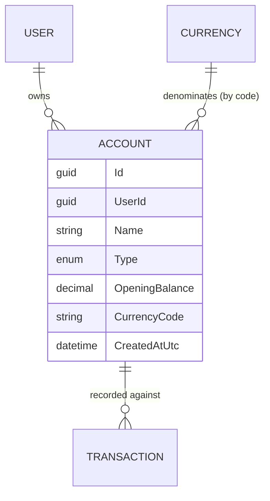

# Accounts

## Table of Contents

- [Purpose](#purpose)
- [Key Entities](#key-entities)
- [Constraints](#constraints)
- [Business Rules & Invariants](#business-rules--invariants)
- [Integration Points](#integration-points)
- [Edge Cases & Known Gotchas](#edge-cases--known-gotchas)

## Purpose

An **Account** is a place a user's money lives — a checking account, a savings pot, cash in a
wallet, or a credit card. It is the anchor every transaction is recorded against. Each account is
owned by one user (see [users-and-ownership.md](users-and-ownership.md)) and is denominated in a
single currency.

## Key Entities

- **Account** — `Id`, `UserId` (owner), `Name`, `Type` (an `AccountType`), `OpeningBalance`,
  `CurrencyCode`, `CreatedAtUtc`.
- **AccountType** — enum: `Checking`, `Savings`, `Cash`, `CreditCard`. A classification label; it
  has no lifecycle or transitions.

## Constraints

### MUST

- **An account's currency (`CurrencyCode`) must reference a currency that exists.**
  - **Why**: The account's currency drives how amounts are displayed (symbol, decimal places) and
    is denormalized into transaction responses. A dangling currency would break display and signal a
    broken data invariant.
  - **Enforced in**: `CreateAccountHandler` looks the code up via `ICurrencyReadService.GetByCodeAsync`
    and throws a validation error ("Currency was not found.") if absent. `Account.Create` also
    enforces the shape (exactly 3 ASCII uppercase letters).

### MUST NOT

- **An account's currency MUST NOT change after creation.**
  - **Why**: Existing transactions on the account are recorded and displayed in that currency.
    Switching the currency would silently reinterpret every historical amount (e.g. 100 USD becoming
    100 JPY), corrupting the meaning of past data.
  - **Enforced in**: `UpdateAccountCommand` / `UpdateAccountHandler` accept only name, type, and
    opening balance — there is no path to change `CurrencyCode`. The Angular UI reinforces this by
    hiding the currency field in edit mode (`accounts.service.ts`, `accounts.component.ts`).

- **An account MUST NOT be deleted while it still has transactions.**
  - **Why**: Deleting it would orphan or destroy financial history. The user must deal with the
    transactions first (a deliberate integrity guard rather than a silent cascade).
  - **Enforced in**: `DeleteAccountHandler` calls `IAccountRepository.HasTransactionsAsync` and
    throws "Account cannot be deleted because it has transactions." if any exist.

## Business Rules & Invariants

- **Rule**: An account requires a non-blank `Name` of at most 200 characters (trimmed).
- **Why**: The name is how the user tells accounts apart in every list and dropdown; blank or
  runaway names would make the UI unusable.
- **Enforced in**: `Account.Create` / `Account.Update` → `ValidateOrThrow` in `Domain/Accounts/Account.cs`.
- **Example**: `"  Everyday Checking  "` is accepted and stored trimmed as `"Everyday Checking"`.
- **Source**: `[SOURCE: code-audit]`

---

- **Rule**: `Type` must be one of the defined `AccountType` values.
- **Why**: Type is a closed classification; an undefined value has no meaning downstream.
- **Enforced in**: `ValidateOrThrow` via `Enum.IsDefined`.
- **Source**: `[SOURCE: code-audit]`

---

- **Rule**: `OpeningBalance` may be zero, must have at most 2 decimal places, and its absolute value
  must be ≤ 1,000,000,000.
- **Why**: Money is stored to cent precision; more than 2 places implies a rounding/entry error. The
  cap is a sanity bound against fat-finger entries. Zero is allowed because a brand-new account can
  legitimately start empty (unlike a transaction, which must move a non-zero amount).
- **Enforced in**: `ValidateOrThrow` in `Domain/Accounts/Account.cs`.
- **Example**: opening balance `0` is valid; `10.005` is rejected (3 decimals); `2000000000` is
  rejected (over the cap).
- **Source**: `[SOURCE: code-audit]`

---

- **Rule**: `CurrencyCode` is normalized to uppercase and must be exactly 3 ASCII letters (A–Z).
- **Why**: Matches ISO-4217 currency codes so it can join the shared currency table reliably
  regardless of input casing.
- **Enforced in**: `Account.Create` (`NormalizeCurrencyCode` + `ValidateOrThrow`).
- **Example**: `"usd"` is stored as `"USD"`; `"US"` and `"US1"` are rejected.
- **Source**: `[SOURCE: code-audit]`

## Integration Points

- **[Currencies](currencies.md)**: an account references a currency by its 3-letter code (not a
  GUID). `CreateAccountHandler` validates existence and denormalizes the currency's name, symbol,
  and minor unit into the `AccountDto` for display.
- **[Transactions](transactions.md)**: transactions are recorded against an account; the account's
  currency determines how each transaction's amount is presented. The delete guard above depends on
  the transaction data.
- **[Users & Ownership](users-and-ownership.md)**: every account is stamped with and filtered by its
  owner's `UserId`.

## Edge Cases & Known Gotchas

- **Delete guard is by existence of transactions, not a soft-delete**: there is no "archive" state.
  An account either has zero transactions (deletable) or has some (blocked). If archiving is ever
  needed, it's a new concept, not a tweak to this guard.
- **`OpeningBalance` is the only balance that exists**: there is deliberately no computed current
  balance (opening + sum of transactions) anywhere in the system. Do not assume a running balance is
  available — displaying one would be new domain logic, not a lookup.
