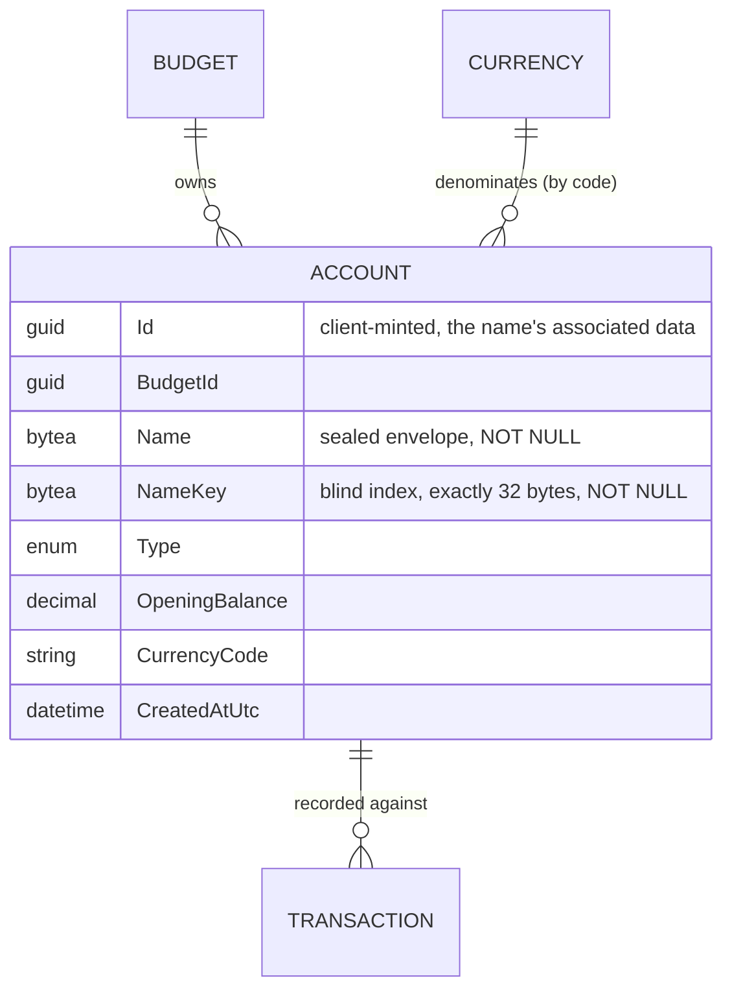

# Accounts

## Table of Contents

- [Purpose](#purpose)
- [Key Entities](#key-entities)
- [Constraints](#constraints)
- [Business Rules & Invariants](#business-rules--invariants)
- [Workflows & State Transitions](#workflows--state-transitions)
- [Decision Trees](#decision-trees)
- [Integration Points](#integration-points)
- [Edge Cases & Known Gotchas](#edge-cases--known-gotchas)

## Purpose

An **Account** is a place money lives — a checking account, a savings pot, cash in a wallet, or a
credit card. It is the anchor every transaction is recorded against. Each account belongs to one
budget (see [budgets.md](budgets.md)) and is denominated in a single currency.

## Key Entities

- **Account** — `Id`, `BudgetId` (the owning budget), `Name`, `NameKey`, `Type` (an `AccountType`),
  `OpeningBalance`, `CurrencyCode`, `CreatedAtUtc`.
  - **`Name` is a sealed narrative envelope and not text.** The property is typed `NarrativeField`
    and the column is `bytea NOT NULL`. That type has no constructor, factory or conversion taking a
    `string`, so writing plaintext into this column does not compile. See
    [ciphertext-envelope.md](ciphertext-envelope.md).
  - **`NameKey` is the blind index over the same name** — `ReadOnlyMemory<byte>`, exactly 32 bytes
    (`HMAC-SHA-256` under the account's index key, computed in the browser), on its own
    `bytea NOT NULL` column. It is what the uniqueness rule is now enforced over.
  - **Both are written from one `IndexedName` parameter and never separately.** `Account.Create` and
    `Account.Update` each take one, and neither offers a spelling for half a name — the remarks on
    `Account.Update` spell out what a member taking a bare `NarrativeField` would cost.
  - **`Id` is supplied to the factory, never minted inside it.** `Guid.CreateVersion7` has left
    `Account.cs` entirely; the identifier is the associated data the client sealed `Name` against.
- **AccountType** — enum: `Checking`, `Savings`, `Cash`, `CreditCard`. A classification label; it
  has no lifecycle or transitions.


```mermaid
erDiagram
    BUDGET ||--o{ ACCOUNT : owns
    CURRENCY ||--o{ ACCOUNT : "denominates (by code)"
    ACCOUNT ||--o{ TRANSACTION : "recorded against"
    ACCOUNT {
        guid Id "client-minted, the name's associated data"
        guid BudgetId
        bytea Name "sealed envelope, NOT NULL"
        bytea NameKey "blind index, exactly 32 bytes, NOT NULL"
        enum Type
        decimal OpeningBalance
        string CurrencyCode
        datetime CreatedAtUtc
    }
```

## Constraints

### MUST

- **An account's name reaches this server sealed, with its blind index beside it, and nothing on
  this side can read, measure, fold or compare it.** `accounts.name` is the second column in the
  product to hold ciphertext and the **first** to carry a blind index.
  - **Why**: an account name is narrative text, which is the one thing the product is built not to
    be able to read. What is different here from `budgets.name` is that **uniqueness had to survive
    the change rather than be surrendered** — one name per budget is a rule a person relies on to
    tell their accounts apart — and a blind index is the only construction that lets a server
    holding no plaintext still refuse a duplicate.
  - **Enforced in**: `Account.Name` is typed `NarrativeField` and `Account.NameKey` is a
    `ReadOnlyMemory<byte>`; both are assigned from one `IndexedName`, which refuses either half on
    its own. `AccountConfiguration` maps them to two `bytea` columns, each `IsRequired`, through
    value converters with **content** comparers over the bytes (without one EF compares a class by
    reference and a struct by pointer, so a value rebuilt from identical bytes reads as an edit and
    one rewritten in place inside the same buffer does not — on `name_key` the second is the one
    that bites, because an index the tracker misses is a row whose uniqueness value stops describing
    its own name). The table carries **three** `CHECK` constraints, each rendered from the constant
    that owns its number rather than from a literal: `CK_accounts_name_length` bounds the envelope
    between `CiphertextEnvelope.MinimumLength` and `NarrativeFieldLimits.NameBytes`,
    `CK_accounts_name_version` requires the leading version byte through `substring`, and
    `CK_accounts_name_key_length` is an **equality** on 32 bytes rather than a band, because
    `HMAC-SHA-256` has one output width and a ceiling would admit a short digest silently. The two
    `NOT NULL` columns say a **row** cannot be half a name; `IndexedName.Of` says a **call** cannot
    be. Neither restates the other for error quality — one refuses a statement reaching the
    database, the other refuses a caller who meant to write both and wrote one.

- **One name per budget, enforced over the index.** `IX_accounts_budget_id_name_key` is unique over
  `(budget_id, name_key)`.
  - **Why**: the rule did not change and the mechanism did not change — a unique B-tree index,
    scoped per budget, reported as `23505` under a name the repository matches. What changed is the
    **column**. Uniqueness over `name` would now enforce nothing at all: every seal draws a fresh
    nonce, so two rows holding one name hold different bytes. The blind index is what survives that,
    being deterministic under the account's index key, so equality of names comes back as equality
    of digests.
  - **Enforced in**: the unique index declared in `AccountConfiguration` and pinned there as
    `NameIndexName`, which `AccountRepository` matches `PostgresException.ConstraintName` against on
    both `AddAsync` and `UpdateAsync` to raise "Account name must be unique." rather than a 500 —
    on a create, that is the answer when the identifier beside the name is **fresh**, the
    qualification the identifier-conflict rule under [Business Rules](#business-rules--invariants)
    argues. The
    C# constant is still called `NameIndexName` while its **value** ends in `_name_key`: the index
    is for finding the row a name is already taken by, and the schema follows EF's own convention
    rather than carrying a hand-pinned exception to it. **Both verbs answer 400 here and a payee
    create answers 409 on the same shape of index**; the difference is that an account's name is
    typed into a form by a person and a payee's is resolved by the client against a list it
    decrypted, and the argument is in the [decision log](_decision-log.md).

- **An account's currency (`CurrencyCode`) must reference a currency that exists.**
  - **Why**: The account's currency drives the precision every amount on it may be recorded at and
    how amounts are displayed (symbol, decimal places), and is denormalized into transaction
    responses. A dangling currency would leave nothing to validate against, break display, and
    signal a broken data invariant.
  - **Enforced in**: `AccountConfiguration` maps `accounts.currency_code → currencies.code` with a
    `Restrict` foreign key, so PostgreSQL refuses a dangling code however the row was written and
    refuses to delete a currency any account uses — that is what makes the guarantee hold for every
    write path. `CreateAccountHandler` looks the code up via `ICurrencyReadService.GetByCodeAsync`
    first so the caller gets a validation error ("Currency was not found.") instead of a constraint
    violation, and `Account.Create` enforces the shape (exactly 3 ASCII uppercase letters).

### MUST NOT

- **An account's currency MUST NOT change after creation.**
  - **Why**: Existing transactions on the account are recorded and displayed in that currency.
    Switching the currency would silently reinterpret every historical amount (e.g. 100 USD becoming
    100 JPY), corrupting the meaning of past data. Every one of those amounts was also accepted at
    the old currency's precision, so a switch to a coarser one would leave rows the domain would now
    refuse to write.
  - **Enforced in**: **database-owned, and restated above it for the interface.** The application
    role's `UPDATE` grant on `accounts` names `name`, `name_key`, `type` and `opening_balance`;
    `currency_code` is not on that list, so a statement writing it is refused with `42501` before the
    row is touched, on the connection every request is served by and whatever produced the statement.
    The enforcement is the column's *omission from the grant's list* rather than a `REVOKE` —
    PostgreSQL column privileges are additive, so revoking a column out of a table-wide `UPDATE`
    grant subtracts nothing; the mechanism is in
    [ADR 0004](../decisions/0004-connect-as-a-least-privilege-role.md), and
    `AppRoleGrantsTests.Database_RefusesToChangeAnAccountsCurrency_WhileStillAllowingRename` pins
    both halves — the refusal, and a rename on the same row over the same connection that must
    succeed, without which the refusal would prove only that the role cannot write. **That success
    half now writes `name` and `name_key` in one statement, the way `Account.Update` does**, and
    that is not a detail: while it wrote `name` alone it was green throughout a period in which
    renaming an account was impossible for this role — see the pair rule under
    [Business Rules](#business-rules--invariants). Above that,
    `UpdateAccountCommand` / `UpdateAccountHandler` accept only name, type, and opening balance —
    there is no path to change `CurrencyCode` — and the Angular UI hides the currency field in edit
    mode (`accounts.service.ts`, `accounts.component.ts`). Both upper layers are there so the
    operation is never offered, not so the rule holds.

- **The server MUST NOT be given a rule about an account name's text** — not a minimum length, not
  a blankness check, not a trim, not a character cap, and not a case-folding rule.
  - **Why**: every one of them is a question about plaintext this deployment has never seen. A
    reader who finds the gap in `ValidateOrThrow` and restores a check can only restore it against
    the envelope, which measures the wrong thing; a reader who notices the collation is gone and
    reaches for a folding rule has nothing to fold. Both are argued in full under
    [Business Rules](#business-rules--invariants), because they are capabilities that **moved**
    rather than rules that were dropped, and that is what the next reader has to be told.
  - **Enforced in**: the absence of any name rule in `Account.ValidateOrThrow`, and the byte bounds
    under MUST above — the only lengths anything on this side can measure.

- **An account MUST NOT be deleted while it still has transactions.**
  - **Why**: Deleting it would orphan or destroy financial history. The user must deal with the
    transactions first (a deliberate integrity guard rather than a silent cascade).
  - **Enforced in**: **database-owned, with the application supplying the sentence.**
    `TransactionConfiguration` maps `(account_id, budget_id) → accounts` on `Restrict`, so PostgreSQL
    refuses to remove an account any transaction names, whatever wrote the delete — that is the half
    that is *correct*. `AccountRepository.DeleteAsync` catches that `23503` **by constraint name** and
    turns it into "Account cannot be deleted because it has transactions.", and
    `DeleteAccountHandler` asks `IAccountRepository.HasTransactionsAsync` first to raise the same
    sentence before the write; both are *error quality*. The precheck is check-then-act, so its answer
    can be stale in either direction by the time the delete runs — the split and both directions are
    described in [transactions.md](transactions.md#edge-cases--known-gotchas). Per
    [ADR 0002](../decisions/0002-enforce-rules-at-the-lowest-capable-layer.md) neither half is
    redundant cover for the other: do not drop the constraint because the check passes first, and do
    not drop the catch because the precheck usually gets there first.

## Business Rules & Invariants

- **Rule**: **The server can no longer refuse a blank or a runaway account name.** "A name is not
  just spaces" and the 200-character ceiling are now the client's, applied before it seals.
- **Why**: this is a **capability that moved**, not a rule that was quietly dropped, and the
  distinction is why it is written down rather than left as a gap in a validator. The value arriving
  is an AEAD envelope over text this server has never seen and holds no key for; "is this nothing
  but spaces?" and "is it longer than a label?" are questions about plaintext. A reader who finds
  the absence and restores a check can only restore it against the **envelope** — measuring bytes
  and calling them characters, or refusing a 29-byte envelope that is the correct sealing of an
  empty string. Both are wrong answers wearing the shape of the right one.
- **Enforced in**: what replaced each half is a byte rule and nothing more. The trim and the
  blankness check are replaced by **nothing on this side**; `Account.ValidateOrThrow` judges the
  identifier, the tenancy, the kind, the currency code and the two halves of the balance rule, and
  no name rule at all. The 200-character ceiling is replaced by `NarrativeFieldLimits.NameBytes` —
  a cap on **stored envelope bytes**, applied by `IndexedName.Of` and restated as the upper bound of
  `CK_accounts_name_length`. `CiphertextEnvelope.MinimumLength` is the floor of that same check, and
  it is **not** the blank-name rule restored: an envelope over an empty string satisfies it exactly.
- **Example**: a client that seals `"   "` gets a `201`. The row is well-formed, the constraints are
  satisfied, and nothing in this deployment can tell that value from `"Everyday Checking"`.
- **Counterexample**: adding `if (envelope.Length < 40)` to approximate "not blank". It refuses
  short real names, admits long blank ones, and is a rule about ciphertext claiming to be a rule
  about text.
- **Source**: `[SOURCE: discussion]`

---

- **Rule**: **Case folding relocated to the client; it did not disappear.** Two spellings of one
  name are still meant to collide, and the database no longer has any way to notice that they do.
- **Why**: the collation left the column **by force rather than by choice** — `case_insensitive` is
  a text collation and `bytea` is not a collatable type, so declaring one on this column is not an
  option that was weighed. What the collation was doing, making `"Groceries"` collide with
  `"groceries"` on the unique index, moved into the normalization the client applies before it
  computes the `HMAC`: trim, NFKC, full case fold, UTF-8, in that order. The database still
  guarantees two identical index values cannot coexist; it no longer guarantees two spellings of one
  name produce identical index values, and that half is now the client's to get right.
- **Enforced in**: the client, and by nothing beneath it. `AccountConfiguration` declares no
  collation on `name` and says why in place. The normalization, its order, the Unicode version its
  fold table is read at and its frozen answers are in
  [account-keys.md](account-keys.md#the-normalization-a-name-is-indexed-through) and
  `vectors/blind-index-v1.json`. **No test below the browser can check any of it** — the server sees
  a MAC and never a name.
- **Counterexample**: a client that folds with the host's `toLowerCase` instead of the shipped
  table. It agrees with a correct client on almost every name a person types, disagrees on the
  handful where the difference decides a match, and the symptom is a duplicate that never merges on
  a column whose entire purpose is that equal names collide. And a blind index **cannot be
  recomputed** after the fact — the plaintext behind it is encrypted — so there is no repair that
  does not run through the account's own recovery factors.
- **Source**: `[SOURCE: discussion]`

---

- **Rule**: **A name and its blind index move together or not at all.** That is a rule about
  blind-indexed name columns generally, and the grant is one of the places it has to hold.
- **Why**: such a column is a pair — the ciphertext nobody here can read, and the keyed digest that
  is the only way a row holding a given name can be found or refused as a duplicate. Both are
  computed from one piece of text by one client and written by one statement, so a rule that reaches
  one and not the other has only two outcomes and both are wrong. **Withholding one forbids the
  operation**: PostgreSQL checks column privileges per column named in the statement, `Account.Update`
  assigns both properties from a single `IndexedName`, EF emits one `UPDATE` naming both columns, and
  the whole statement is refused with `42501`. **Permitting one and not the other is worse, because
  it raises nothing**: the row would keep a digest taken over a name it no longer holds, the unique
  index would go on policing the name that left, a search for the new name would miss the row that
  has it, and a rename onto a name already taken would be accepted. Nothing on this side can notice
  — recomputing either half needs the account's index key, which lives in a browser.
- **Enforced in**: three places, holding three different moments. `Account.Create` and
  `Account.Update` take an `IndexedName` and offer no spelling for half a name, so a **call** cannot
  be half; the two `NOT NULL` columns mean a **row** cannot be; and the grant names
  `name, name_key` together, so the **statement** is permitted whole. The first live failure of this
  rule was the grant: it admitted `name` alone, and renaming an account was therefore impossible for
  the application role while the test that claimed to prove renaming worked issued a one-column
  `UPDATE` and stayed green — it exercised a **column privilege** and called it an **operation**.
  See the [decision log](_decision-log.md).
- **Counterexample**: a later `Rename(NarrativeField name)` overload added for a screen that "only
  changes the name". It compiles, it stores, it reads back, no constraint fires, and every one of
  the four symptoms above follows silently.
- **Source**: `[SOURCE: discussion]`

---

- **Rule**: An account's identifier is **supplied by the client and crosses as text**, in the
  lower-case 36-character hyphenated spelling and nothing else.
- **Why**: the identifier is the associated data the name was sealed against, and associated data is
  rebuilt from where a ciphertext was found rather than carried inside it — so this API has to hand
  back the same spelling it was sent, and therefore has to refuse the spellings it cannot reproduce.
  Bound as a `Guid`, `System.Text.Json` folds the braced, upper-case and canonical forms to one value
  before any handler sees text, and the refusal becomes **unwritable**: it compiles, every test that
  sends a canonical id passes, and it fails in a browser months later as a name that will not open.
- **Enforced in**: `CreateAccountCommand.Id` is a `string`, judged by `CanonicalIdentifier.TryParse`
  in `CreateAccountHandler` — first of the three opaque members, because a spelling this API cannot
  reproduce makes the envelope beside it irrelevant whatever that envelope looks like. All three are
  attempted and every failure is reported, since one piece of client code produces all three.
  `Account.Create` takes the id as a parameter and refuses `Guid.Empty` — reachable for
  the first time now that the value arrives from outside, and refused here rather than left to the
  primary key, which accepts all-zero as a legal uuid and would answer the *second* such row with
  the identifier conflict below: a sentence true of the row and wrong about the caller, telling
  somebody who chose no id at all to mint a fresh one.
- **Counterexample**: `UpdateAccountCommand.Id` is a `Guid` and the route parameter stays
  `{id:guid}`, and that asymmetry is deliberate rather than an oversight. On an update the client
  re-seals against the row's **existing** id, which it read back from this API in the one form a
  `Guid` renders; the text in the URL is never the text anything was sealed under, so there is no
  spelling to preserve. The rule lives where an identifier is *chosen*.
- **Source**: `[SOURCE: discussion]`

---

- **Rule**: **`POST /api/accounts` has two conflict answers, and the split is between the two
  constraints rather than between create and rename.** A duplicate **name** is a 400 keyed on
  `Name`, unchanged. A duplicate **identifier** is a 409 carrying its own sentence: `An account
  already exists with this identifier. If this request is a retry, read that account back by its
  identifier instead of posting it again; otherwise mint a fresh identifier and post again.`
- **Why**: the identifier is minted by the client — it is the associated data the name was sealed
  against — so **a retry after a network timeout carries a byte-identical body**, which is the
  ordinary behaviour of an HTTP client and used to answer 500. The two answers differ because the
  two collisions are different acts. A duplicate name is a person's typed value colliding with
  another row's: a correction to a field of the request, which is exactly what a validation problem
  document carries. A duplicate identifier is nothing anybody typed and no field a form could
  attach a message to — the remedy is to read the account back or to mint a new identifier, and
  neither is an edit to `Name`.
  - **"Read it back" is an instruction and not a promise.** The primary key spans the whole table
    while `GET /api/accounts/{id}` is scoped to the ambient budget, so an identifier held by another
    budget answers 409 here and 404 on the read-back, at which point the sentence's second reading
    — mint a fresh identifier — is the honest one. The disclosure that follows is one bit about a
    tenant the caller cannot otherwise see, over a client-minted 128-bit value, and it is accepted;
    the argument, and what closing it would cost, is written once in
    [payees.md](payees.md#business-rules--invariants), whose route carries the identical shape.
  - **The sentence is worded alongside the payee's twin deliberately.** The caller's situation is
    identical on both routes — nothing was written and the identifier its client chose is spoken
    for — so the two are read and changed together, and the fact that a duplicate *name* answers
    differently on the two tables is a separate rule that survives this one rather than being
    flattened by it.
- **Enforced in**: **database-owned for the refusal, application-owned for both sentences.**
  `AccountRepository.AddAsync` carries two `catch` arms over the **same** SQLSTATE, matched by
  constraint name — `AccountConfiguration.PrimaryKeyName` and `NameIndexName` — because SQLSTATE
  alone cannot tell an id collision from a name one and whichever answer was written first would be
  given to both. Which constraint a row breaking **both** is reported under is decided by **OID**
  and the measurement is in
  [ciphertext-envelope.md](ciphertext-envelope.md#which-constraint-a-row-is-reported-under-is-decided-by-oid);
  the answer is the key, which is what makes the 409 the answer to a byte-for-byte retry.
  `AccountIntegrationTests.CreateAccount_RetriedByteForByte_AnswersConflictNamingTheIdentifier`
  asserts the sentence in full rather than the status, which an implementation reaching for the
  wrong conflict would also satisfy;
  `…CreateAccount_ReusingAnIdentifierUnderAnotherName_AnswersConflictNamingTheIdentifier` breaks the
  key **alone**, the shape that used to reach the global handler; and
  `…CreateAccount_WithATakenName_AnswersBadRequestOnlyUnderAFreshIdentifier` sends one taken name
  twice, under a fresh identifier and under the seeded account's own, and pins the two answers side
  by side.
- **Example**: a create whose response was lost, re-sent unchanged, answers 409 naming the
  identifier and writes nothing; the same name under a fresh identifier answers 400 keyed on `Name`.
- **Counterexample**: `CreateAccount_WithDuplicateName_IsRejected` mints a fresh identifier for its
  second create — correctly, and silently. Inline that identifier, or reuse the first account's
  while editing the case later, and the same duplicate name answers 409, because the key is the
  constraint reported when a row breaks both. Every assertion in that case is about a 400, so it
  goes red without saying why, and the natural repair — changing the expected status — deletes the
  field-keyed refusal a person actually needs.
- **Source**: `[SOURCE: discussion]`

---

- **Rule**: `Type` must be one of the defined `AccountType` values.
- **Why**: Type is a closed classification; an undefined value has no meaning downstream.
- **Enforced in**: `CK_accounts_type` in `AccountConfiguration` limits the `type` column to the four
  member names the enum converts to, so the classification stays closed whatever wrote the row;
  `ValidateOrThrow` restates it via `Enum.IsDefined` so an undefined value is a validation error
  rather than a constraint violation. A check rather than a native PostgreSQL enum type is
  deliberate — `HasConversion<string>()` already stores the member name — and the price is that
  adding an `AccountType` member now costs a migration as well as a code change.
- **Example**: `Checking`, `Savings`, `Cash` and `CreditCard` are the whole set; `Brokerage` is
  rejected as a validation error by `ValidateOrThrow`, and the same value written straight into
  `accounts.type` by hand is refused by `CK_accounts_type`.
- **Source**: `[SOURCE: discussion]`

---

- **Rule**: `OpeningBalance` may be zero, must have at most as many decimal places as the account's
  currency has minor units, and its absolute value must be ≤ 1,000,000,000.
- **Why**: Precision belongs to the currency rather than to the column — a yen has no sub-unit, a
  dinar has three — so a place beyond what the currency has implies a rounding or entry error rather
  than a smaller amount. The cap is a sanity bound against fat-finger entries. Zero is allowed
  because a brand-new account can legitimately start empty.
- **Enforced in**: the two halves sit at different layers, and the split is forced rather than
  chosen. `CK_accounts_opening_balance` (`abs(opening_balance) <= 1000000000`) owns the magnitude
  bound, so it holds for write paths that do not exist yet. The decimal-places half stays with
  `ValidateOrThrow` in `Domain/Accounts/Account.cs`, against the minor unit `CreateAccountHandler`
  and `UpdateAccountHandler` read from `ICurrencyReadService`, because no lower layer can hold it:
  a column definition cannot reject an over-precise value — `numeric(14,4)` rounds it instead, and a
  coercion is not enforcement under
  [ADR 0002](../decisions/0002-enforce-rules-at-the-lowest-capable-layer.md) — and a check
  constraint cannot compare the balance against the row's currency without joining `currencies`. The
  reasoning is in [currencies.md](currencies.md#business-rules--invariants). `ValidateOrThrow`
  restates the magnitude bound too, so an over-cap entry is a sentence the caller can act on rather
  than a constraint violation.
- **Example**: opening balance `0` is valid; on a USD account `10.005` is rejected (3 decimals); on a
  JPY account `1000.5` is rejected (the yen has no sub-unit); `2000000000` is rejected (over the
  cap).
- **Counterexample**: rounding a USD `10.005` to `10.01` instead of rejecting it silently changes the
  number the user typed — and the column will not refuse first. `numeric(14,4)` stores `10.005`
  exactly, because the scale bounds only what is *representable* and three places fit; push past four
  and it still does not refuse, it stores `10.00005` as `10.0001` and raises nothing. That is why the
  decimal-places half cannot be pushed down to join the magnitude bound. Rounding hides the entry
  error, and it resurfaces later as a balance that never reconciles against the real account.
- **Source**: `[SOURCE: discussion]`

---

- **Rule**: `CurrencyCode` is normalized to uppercase and must be exactly 3 ASCII letters (A–Z).
- **Why**: Matches ISO-4217 currency codes so it can join the shared currency table reliably
  regardless of input casing.
- **Enforced in**: `Account.Create` (`NormalizeCurrencyCode` + `ValidateOrThrow`).
- **Example**: `"usd"` is stored as `"USD"`; `"US"` and `"US1"` are rejected.
- **Counterexample**: storing the code as typed leaves `usd` on the row while `currencies.code`
  holds `USD`. The `Restrict` foreign key rejects the insert outright — and if it did not, the
  currency join would drop the account out of its own list rather than fail visibly.
- **Source**: `[SOURCE: discussion]`

## Workflows & State Transitions

An Account has no lifecycle states and therefore no state machine. `AccountType` looks like one and
is not: it is a classification label with no transitions, and nothing in the system reads it to
decide what an account may do. The lifecycle is create → rename/retype/adjust opening balance →
guarded delete, with the currency fixed at creation.

## Decision Trees

Deleting an account (`DeleteAccountHandler`):

```
IF the account id does not resolve in the ambient budget
  THEN 404 "Account was not found."                       ← also the cross-budget answer
ELSE IF the account has any transaction
  THEN validation error "Account cannot be deleted because it has transactions."
ELSE
  THEN delete the account
```

## Integration Points

- **[Currencies](currencies.md)**: an account references a currency by its 3-letter code (not a
  GUID). `CreateAccountHandler` validates existence and denormalizes the currency's name, symbol,
  and minor unit into the `AccountDto` for display. The minor unit is also what the opening balance's
  precision is validated against, on create and on update alike — which is why
  `UpdateAccountHandler` resolves the currency even though it cannot change it.
- **[Transactions](transactions.md)**: transactions are recorded against an account; the account's
  currency determines both the precision each transaction's amount may carry and how it is
  presented, on creation and on an edit that moves a transaction here alike. The delete guard above
  depends on the transaction data.
- **[Ciphertext Envelope](ciphertext-envelope.md)**: `accounts.name` is the second column to store an
  envelope and the **first** to be reached by a route that accepts one. The framing, the byte caps,
  the value type the column accepts, the wire step for the index and the narrative grammar a name is
  bound to all live there. This file owns what an account name *means* and what the schema no longer
  refuses about it.
- **[Account Keys](account-keys.md)**: the index key the blind index is computed under, and the
  normalization it is taken over. One index key per **account** — two would produce two index values
  for one name, and the uniqueness rule above would stop colliding while appearing to work.
- **Angular client**: `/app/accounts` manages the list, and **it has not been moved onto the sealed
  contract** — this is a gap, named here rather than described as if it worked.
  `account-api.service.ts` still declares `name` as plain text on both request types, carries no
  `nameKey` and no client-minted `id`, and `accounts.component.ts` renders `account.name` straight
  into the list, where the API now returns base64url of an envelope. So today the screen cannot
  create or rename an account, and the sealed name column is exercised only from the test suite. The
  currency field is offered on create and hidden in edit mode, which matches — but does not enforce
  — the immutability rule above.
- **[Budgets](budgets.md)**: every account is stamped with and filtered by its owning `BudgetId`, and
  its name is unique within that budget — now over the blind index rather than over a
  case-insensitive collation, with the folding done in the browser. The same account name in two
  budgets is still two unrelated accounts, and the two rows hold **identical** `name_key` bytes: the
  index message carries the grammar's version, the table and the column, and **no budget**, while the
  key is one per account. What keeps them apart is `budget_id` being the leading column of
  `IX_accounts_budget_id_name_key`, not anything about the digest — which is why that index must
  never be narrowed to `name_key` alone.

## Edge Cases & Known Gotchas

- **Delete guard is by existence of transactions, not a soft-delete**: there is no "archive" state.
  An account either has zero transactions (deletable) or has some (blocked), and which of the two
  holds is read live on every attempt rather than marked on the row. Two acts empty an account and so
  make it deletable — deleting the last transaction that names it, and **editing that transaction
  onto another account** — which is what makes "Account cannot be deleted because it has
  transactions." an instruction the user can follow rather than a dead end. The refusal itself is
  the foreign key's, not the precheck's; [Constraints](#must-not) above states the split, and
  [transactions.md](transactions.md#edge-cases--known-gotchas) covers how a precheck answer goes stale
  in either direction. If archiving is ever needed, it's a new concept, not a tweak to this guard.

- **An account's currency is fixed, but the set of transactions denominated by it is not.** Editing a
  transaction onto this account re-validates that transaction's amount against **this** account's
  minor unit, so a `-40.50` entry moved here from a USD account is refused when this one is JPY —
  over a field the request never mentioned. Nothing about the account changes and nothing here
  enforces it; the rule and the awkward error message belong to the transaction edit path
  ([transactions.md](transactions.md#edge-cases--known-gotchas)). It is worth knowing from this side
  because it is the one way an account's currency constrains a write the account is not the subject
  of.
- **The guard covers deleting the account, not losing it.** `accounts` cascades from `budgets.id`, so
  an account disappears with its budget without this check ever running. That path has its own rule
  and its own protection — a budget holding transactions cannot be deleted at all
  (see [budgets.md](budgets.md#business-rules--invariants)).
- **`OpeningBalance` is the only balance that exists**: there is deliberately no computed current
  balance (opening + sum of transactions) anywhere in the system. Do not assume a running balance is
  available — displaying one would be new domain logic, not a lookup.

- **`GET /api/accounts` hands back the envelope, and no blind index.** `AccountDto.Name` is still a
  `string` and no longer holds a name: it is the envelope as **unpadded base64url**, the one alphabet
  every binary member of this API crosses JSON in — deliberately not `System.Text.Json`'s own
  `byte[]` handling, which emits padded standard base64, two spellings that disagree the first time
  somebody decodes one with the other. The index is on no read at all, and that absence is a
  decision: a client recomputes it from the name it just decrypted, under a key only it holds, and
  needs it solely to write. A member nobody reads would hand every caller a deterministic
  per-account fingerprint of a name, which is the one property of the pair that survives having no
  key. Anything that sorts, searches or groups this field client-side is sorting ciphertext.

- **Which of the three `CHECK` constraints reports a violation is decided by the constraint *name*,
  alphabetically** — not by declaration order and not left to right inside an `AND`. Today
  `CK_accounts_name_key_length` sorts first, then `CK_accounts_name_length`, then
  `CK_accounts_name_version`, so a zero-length name happens to answer `23514` rather than something
  fatal. That is held by nothing but the word *length* sorting before *version*, which is why the
  version check is written with `substring` and never with `get_byte` — the latter *raises* on a
  zero-length `bytea` instead of answering false, and `2202E` is not a constraint violation at all:
  no constraint name, no failing row, and nothing a handler filtering on `23514` will ever see. The
  whole argument, and the rule for whoever writes the next such constraint, is in
  [ciphertext-envelope.md](ciphertext-envelope.md#two-checks-on-one-column-and-which-one-bites).

- **A duplicate-name refusal is now unreadable by anybody holding the database.** The `23505` still
  arrives, `AccountRepository` still turns it into "Account name must be unique.", and the caller
  still gets a 400 naming the field — but *which* two accounts collided is a question only a browser
  holding the account's index key can answer. The same is true of support: there is no query anyone
  can run to find "the account called Groceries".

- **The width of a blind index is the whole of the server's defence, which is why it is an equality.**
  This side holds no index key, so it can never say a value is the index *of* the name beside it. A
  correct-width value computed over the wrong text, under the wrong key, or straight out of a random
  number generator is accepted, is stable, never collides, keys perfectly, and matches nothing for
  the life of the account. It is refused rather than padded or truncated into shape, in two places
  for two different arrivals: `IndexedName.Of` refuses a **call**, `CK_accounts_name_key_length`
  refuses a **row** reaching the database by any other path.
