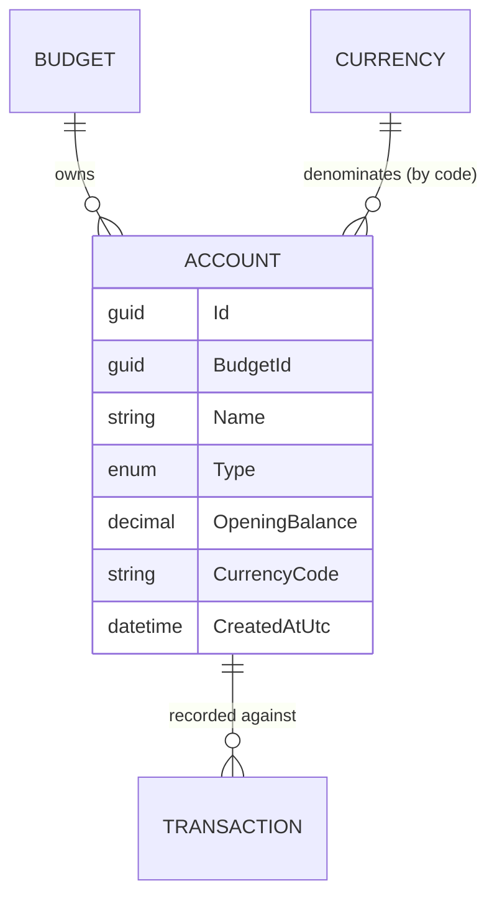

# Accounts

## Table of Contents

- [Purpose](#purpose)
- [Key Entities](#key-entities)
- [Constraints](#constraints)
- [Business Rules & Invariants](#business-rules--invariants)
- [Workflows & State Transitions](#workflows--state-transitions)
- [Decision Trees](#decision-trees)
- [Integration Points](#integration-points)
- [Edge Cases & Known Gotchas](#edge-cases--known-gotchas)

## Purpose

An **Account** is a place money lives — a checking account, a savings pot, cash in a wallet, or a
credit card. It is the anchor every transaction is recorded against. Each account belongs to one
budget (see [budgets.md](budgets.md)) and is denominated in a single currency.

## Key Entities

- **Account** — `Id`, `BudgetId` (the owning budget), `Name`, `Type` (an `AccountType`),
  `OpeningBalance`, `CurrencyCode`, `CreatedAtUtc`.
- **AccountType** — enum: `Checking`, `Savings`, `Cash`, `CreditCard`. A classification label; it
  has no lifecycle or transitions.


```mermaid
erDiagram
    BUDGET ||--o{ ACCOUNT : owns
    CURRENCY ||--o{ ACCOUNT : "denominates (by code)"
    ACCOUNT ||--o{ TRANSACTION : "recorded against"
    ACCOUNT {
        guid Id
        guid BudgetId
        string Name
        enum Type
        decimal OpeningBalance
        string CurrencyCode
        datetime CreatedAtUtc
    }
```

## Constraints

### MUST

- **An account's currency (`CurrencyCode`) must reference a currency that exists.**
  - **Why**: The account's currency drives the precision every amount on it may be recorded at and
    how amounts are displayed (symbol, decimal places), and is denormalized into transaction
    responses. A dangling currency would leave nothing to validate against, break display, and
    signal a broken data invariant.
  - **Enforced in**: `AccountConfiguration` maps `accounts.currency_code → currencies.code` with a
    `Restrict` foreign key, so PostgreSQL refuses a dangling code however the row was written and
    refuses to delete a currency any account uses — that is what makes the guarantee hold for every
    write path. `CreateAccountHandler` looks the code up via `ICurrencyReadService.GetByCodeAsync`
    first so the caller gets a validation error ("Currency was not found.") instead of a constraint
    violation, and `Account.Create` enforces the shape (exactly 3 ASCII uppercase letters).

### MUST NOT

- **An account's currency MUST NOT change after creation.**
  - **Why**: Existing transactions on the account are recorded and displayed in that currency.
    Switching the currency would silently reinterpret every historical amount (e.g. 100 USD becoming
    100 JPY), corrupting the meaning of past data. Every one of those amounts was also accepted at
    the old currency's precision, so a switch to a coarser one would leave rows the domain would now
    refuse to write.
  - **Enforced in**: `UpdateAccountCommand` / `UpdateAccountHandler` accept only name, type, and
    opening balance — there is no path to change `CurrencyCode`. The Angular UI reinforces this by
    hiding the currency field in edit mode (`accounts.service.ts`, `accounts.component.ts`).

- **An account MUST NOT be deleted while it still has transactions.**
  - **Why**: Deleting it would orphan or destroy financial history. The user must deal with the
    transactions first (a deliberate integrity guard rather than a silent cascade).
  - **Enforced in**: `DeleteAccountHandler` calls `IAccountRepository.HasTransactionsAsync` and
    throws "Account cannot be deleted because it has transactions." if any exist.

## Business Rules & Invariants

- **Rule**: An account requires a non-blank `Name` of at most 200 characters (trimmed).
- **Why**: The name is how the user tells accounts apart in every list and dropdown; blank or
  runaway names would make the UI unusable.
- **Enforced in**: `Account.Create` / `Account.Update` → `ValidateOrThrow` in `Domain/Accounts/Account.cs`.
- **Example**: `"  Everyday Checking  "` is accepted and stored trimmed as `"Everyday Checking"`.
- **Source**: `[SOURCE: discussion — 2026-07-26]`

---

- **Rule**: `Type` must be one of the defined `AccountType` values.
- **Why**: Type is a closed classification; an undefined value has no meaning downstream.
- **Enforced in**: `CK_accounts_type` in `AccountConfiguration` limits the `type` column to the four
  member names the enum converts to, so the classification stays closed whatever wrote the row;
  `ValidateOrThrow` restates it via `Enum.IsDefined` so an undefined value is a validation error
  rather than a constraint violation. A check rather than a native PostgreSQL enum type is
  deliberate — `HasConversion<string>()` already stores the member name — and the price is that
  adding an `AccountType` member now costs a migration as well as a code change.
- **Source**: `[SOURCE: discussion — 2026-07-26]`

---

- **Rule**: `OpeningBalance` may be zero, must have at most as many decimal places as the account's
  currency has minor units, and its absolute value must be ≤ 1,000,000,000.
- **Why**: Precision belongs to the currency rather than to the column — a yen has no sub-unit, a
  dinar has three — so a place beyond what the currency has implies a rounding or entry error rather
  than a smaller amount. The cap is a sanity bound against fat-finger entries. Zero is allowed
  because a brand-new account can legitimately start empty.
- **Enforced in**: the two halves sit at different layers, and the split is forced rather than
  chosen. `CK_accounts_opening_balance` (`abs(opening_balance) <= 1000000000`) owns the magnitude
  bound, so it holds for write paths that do not exist yet. The decimal-places half stays with
  `ValidateOrThrow` in `Domain/Accounts/Account.cs`, against the minor unit `CreateAccountHandler`
  and `UpdateAccountHandler` read from `ICurrencyReadService`, because no lower layer can hold it:
  a column definition cannot reject an over-precise value — `numeric(14,4)` rounds it instead, and a
  coercion is not enforcement under
  [ADR 0002](../decisions/0002-enforce-rules-at-the-lowest-capable-layer.md) — and a check
  constraint cannot compare the balance against the row's currency without joining `currencies`. The
  reasoning is in [currencies.md](currencies.md#business-rules--invariants). `ValidateOrThrow`
  restates the magnitude bound too, so an over-cap entry is a sentence the caller can act on rather
  than a constraint violation.
- **Example**: opening balance `0` is valid; on a USD account `10.005` is rejected (3 decimals); on a
  JPY account `1000.5` is rejected (the yen has no sub-unit); `2000000000` is rejected (over the
  cap).
- **Counterexample**: rounding a USD `10.005` to `10.01` instead of rejecting it silently changes the
  number the user typed — and the column will not refuse first. `numeric(14,4)` stores `10.005`
  exactly, because the scale bounds only what is *representable* and three places fit; push past four
  and it still does not refuse, it stores `10.00005` as `10.0001` and raises nothing. That is why the
  decimal-places half cannot be pushed down to join the magnitude bound. Rounding hides the entry
  error, and it resurfaces later as a balance that never reconciles against the real account.
- **Source**: `[SOURCE: discussion — 2026-07-28]`

---

- **Rule**: `CurrencyCode` is normalized to uppercase and must be exactly 3 ASCII letters (A–Z).
- **Why**: Matches ISO-4217 currency codes so it can join the shared currency table reliably
  regardless of input casing.
- **Enforced in**: `Account.Create` (`NormalizeCurrencyCode` + `ValidateOrThrow`).
- **Example**: `"usd"` is stored as `"USD"`; `"US"` and `"US1"` are rejected.
- **Counterexample**: storing the code as typed leaves `usd` on the row while `currencies.code`
  holds `USD`. The `Restrict` foreign key rejects the insert outright — and if it did not, the
  currency join would drop the account out of its own list rather than fail visibly.
- **Source**: `[SOURCE: discussion — 2026-07-26]`

## Workflows & State Transitions

An Account has no lifecycle states and therefore no state machine. `AccountType` looks like one and
is not: it is a classification label with no transitions, and nothing in the system reads it to
decide what an account may do. The lifecycle is create → rename/retype/adjust opening balance →
guarded delete, with the currency fixed at creation.

## Decision Trees

Deleting an account (`DeleteAccountHandler`):

```
IF the account id does not resolve in the ambient budget
  THEN 404 "Account was not found."                       ← also the cross-budget answer
ELSE IF the account has any transaction
  THEN validation error "Account cannot be deleted because it has transactions."
ELSE
  THEN delete the account
```

## Integration Points

- **[Currencies](currencies.md)**: an account references a currency by its 3-letter code (not a
  GUID). `CreateAccountHandler` validates existence and denormalizes the currency's name, symbol,
  and minor unit into the `AccountDto` for display. The minor unit is also what the opening balance's
  precision is validated against, on create and on update alike — which is why
  `UpdateAccountHandler` resolves the currency even though it cannot change it.
- **[Transactions](transactions.md)**: transactions are recorded against an account; the account's
  currency determines how each transaction's amount is presented. The delete guard above depends on
  the transaction data.
- **[Budgets](budgets.md)**: every account is stamped with and filtered by its owning `BudgetId`, and
  its name is unique within that budget case-insensitively. The same account name in two budgets is
  two unrelated accounts.

## Edge Cases & Known Gotchas

- **Delete guard is by existence of transactions, not a soft-delete**: there is no "archive" state.
  An account either has zero transactions (deletable) or has some (blocked). If archiving is ever
  needed, it's a new concept, not a tweak to this guard.
- **The guard covers deleting the account, not losing it.** `accounts` cascades from `budgets.id`, so
  an account disappears with its budget without this check ever running. That path has its own rule
  and its own protection — a budget holding transactions cannot be deleted at all
  (see [budgets.md](budgets.md#must-not)).
- **`OpeningBalance` is the only balance that exists**: there is deliberately no computed current
  balance (opening + sum of transactions) anywhere in the system. Do not assume a running balance is
  available — displaying one would be new domain logic, not a lookup.
