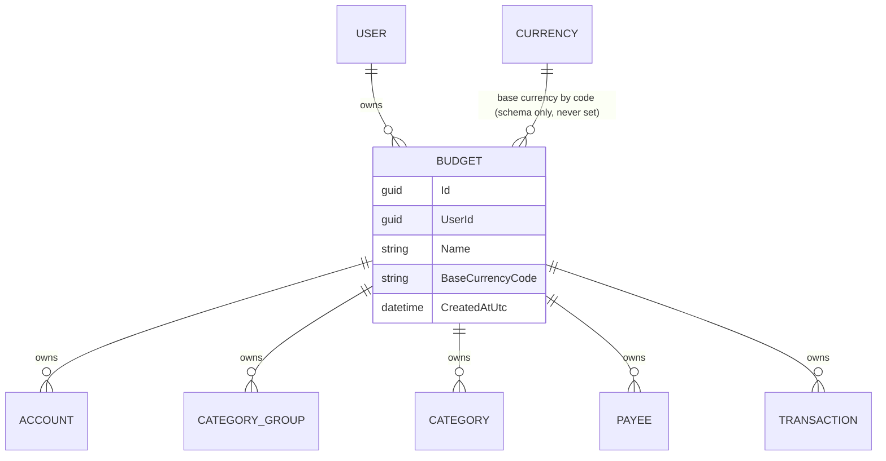
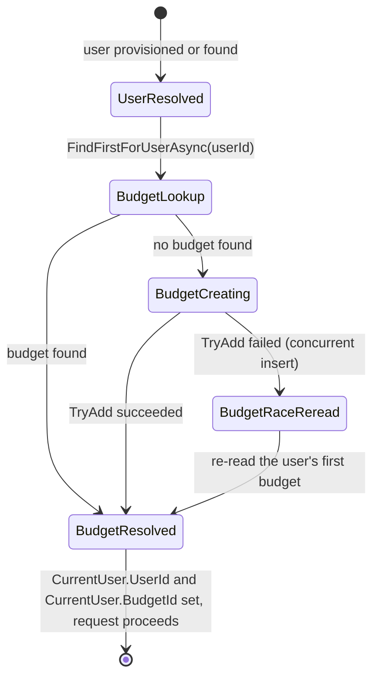

# Budgets

## Table of Contents

- [Purpose](#purpose)
- [Key Entities](#key-entities)
- [Constraints](#constraints)
- [Business Rules & Invariants](#business-rules--invariants)
- [Workflows & State Transitions](#workflows--state-transitions)
- [Decision Trees](#decision-trees)
- [Integration Points](#integration-points)
- [Edge Cases & Known Gotchas](#edge-cases--known-gotchas)

## Purpose

A **Budget** is a coherent pool of money with one owner-purpose, answering one affordability
question. It exists because a person can preside over more than one such pool — money they manage
for an event, a club, or a relative is under their control without being part of their own life —
and forcing those pools into a single total does not simplify the money picture, it falsifies it.
The budget, not the person, is therefore the thing that owns the money picture.

A user is the identity that signs in; see [users-and-ownership.md](users-and-ownership.md). A budget
is what that identity presides over. The product reasoning behind the split — why the boundary is
ownership and purpose rather than currency, and why budgets never aggregate — is in
`product-research/multi-budget.md` in the private `budgetoid-specs` repository, which holds the
unbuilt half of the design until the multi-budget surface ships.

The budget is deliberately invisible to a user who has one: it is created for them at sign-in, never
named in a URL, and never something they set up.

**The budget is also the unit of tenancy**, and this file is the canonical home of that invariant.
Accounts, category groups, categories, payees and transactions all belong to a budget; the user owns
budgets and nothing else. Every rule in [accounts.md](accounts.md),
[categories.md](categories.md) and [transactions.md](transactions.md) assumes the isolation defined
here and none of them re-document it.

## Key Entities

- **Budget** — `Id`, `UserId` (the owning user), `Name` (nullable), `BaseCurrencyCode` (nullable),
  `CreatedAtUtc`. Created through `Budget.Create(userId, name, createdAtUtc)`, which requires a name
  and trims it to at most 200 characters, or `Budget.CreateDefault(userId, createdAtUtc)`, which
  leaves `Name` null. The two factories differ in exactly that one respect — both run the same
  `ValidateOrThrow` and both reject `Guid.Empty` for the owner. A null name is the budget the user
  never asked for; what a client shows in place of one is presentation and lives in the client.
- **Base currency** — a nullable ISO-4217 code referencing the shared [Currency](currencies.md)
  reference data. It is null on every budget that exists: no factory takes one and `Budget` exposes
  no method that sets one. The column is schema readiness for a planning layer, not a setting a user
  has.



## Constraints

### MUST

- **Every budget has exactly one owning user.**
  - **Why**: A budget is the pool of money a specific person presides over. An ownerless budget
    could never be reached by any request, and a budget with two owners would be sharing — which the
    product does not have.
  - **Enforced in**: `Budget.UserId` is required (`Budget.Create` rejects `Guid.Empty`), and
    `BudgetConfiguration` maps it to a required `user_id` column with a foreign key to `users.id` on
    `Cascade`, so a budget can never outlive its owner as an unreachable row.

- **Budget names are unique per owner, case-insensitively.**
  - **Why**: The name is the only thing that distinguishes one named budget from another, so two
    budgets called "Wedding" and "wedding" would be a list the user cannot read. The same index
    carries a second, separate invariant — at most one *unnamed* budget per owner — and that half is
    what makes provisioning race-safe; it is stated in Business Rules & Invariants below.
    Case-insensitivity contributes nothing there: neither racing row has a name to fold.
  - **Enforced in**: `BudgetConfiguration` puts `name` on the `case_insensitive` collation and adds a
    unique index over `(user_id, name)`, declared `NULLS NOT DISTINCT`.

- **Every account, category group, category, payee and transaction belongs to exactly one budget, on
  both read and write.**
  - **Why**: The budget is the coherent pool of money the single picture describes. Data that belongs
    to no budget could never be reached by any request, and data mixed across budgets falsifies the
    picture — a total that includes money from another pool answers nobody's affordability question.
    This is also the tenant boundary: with a single shared database, a leak here means one person
    reading or changing money that is not theirs.
  - **Enforced in**: the lowest layer is PostgreSQL **row-level security**. A `budget_isolation`
    policy on each of the five tables compares `budget_id` against the session's ambient budget in
    both `USING` and `WITH CHECK`, so no statement on the connection every request is served by
    reaches another budget's rows and an insert can only land in the ambient budget, whatever
    produced the statement. `SessionContextInterceptor` puts that budget on every connection the
    context opens, alongside the authenticated user that `user_isolation` reads on `budgets` itself;
    the mechanism, its scope and what it deliberately does not cover are in
    [ADR 0005](../decisions/0005-isolate-budget-owned-rows-with-row-level-security.md) and
    [ADR 0011](../decisions/0011-police-the-user-owned-tables.md). Above it sit
    the EF Core global query filters named `BudgetIsolation` in
    `BudgetoidApp/Infrastructure/Persistence/BudgetoidDbContext.cs`, applied to `Transaction`,
    `Account`, `Payee`, `CategoryGroup` and `Category`, each comparing `BudgetId` against
    `IBudgetContext.BudgetId`: they turn another budget's row into a correct empty result and the 404
    or 400 stated under MUST NOT below, which is error quality rather than enforcement — and neither
    layer is cover for the other. Both rest on a required `budget_id` column on all five tables with
    a foreign key to `budgets.id`. That foreign key is `Cascade` on `accounts`, `category_groups`,
    `categories` and `payees`, so structure never survives its budget as unreachable rows, and
    `Restrict` on `transactions`, so recorded money movement pins the budget in place instead. That
    asymmetry is a rule in its own right and is stated in Business Rules & Invariants below.
    Once a row exists its `budget_id` never changes, and the lowest layer that can say so is the
    **application role's grants**: `UPDATE` is granted on each of the five tables by explicit column
    list, and `budget_id` is on none of them, so the write is refused with `42501` on the connection
    every request is served by. The two layers above it are each partial — no entity exposes
    `BudgetId`, which holds only for writes that go through the domain, and the composite foreign
    keys refuse a move only while a child row references the one being moved. Enforcement is the
    column's *omission from the grant's list* rather than a `REVOKE`, because PostgreSQL column
    privileges are additive; the mechanism and its consequences are in
    [ADR 0004](../decisions/0004-connect-as-a-least-privilege-role.md).
    `BudgetId` is stamped at creation from `IBudgetContext` by
    `CreateAccountHandler`, `CreateCategoryGroupHandler`, `CreateCategoryHandler`,
    `CreateTransactionHandler` and `PayeeRepository.GetOrCreateAsync`. There is no `UserId` on any of
    the five entities — `Budget.UserId` is the only owner link in the schema.

- **Every reference between two budget-owned rows points inside the same budget.** This covers a
  category's category group and a transaction's account, category and payee.
  - **Why**: A category attached to another budget's group would make the hierarchy read across
    pools, and a transaction pointing at another budget's account, category or payee would put one
    pool's money into another's picture. A query filter cannot enforce anything on a write, so
    leaving this to the resolving handlers means any future write path that bypasses them — an
    importer, a bulk endpoint, a background job — loses it silently, with no failure signal.
  - **Enforced in**: `CategoryGroupConfiguration`, `AccountConfiguration`, `CategoryConfiguration`
    and `PayeeConfiguration` each declare an alternate key `(Id, BudgetId)`; `CategoryConfiguration`
    maps `(category_group_id, budget_id)` and `TransactionConfiguration` maps `(account_id,
    budget_id)`, `(category_id, budget_id)` and `(payee_id, budget_id)` onto the matching principal
    keys, all on `Restrict`. PostgreSQL rejects the row regardless of how it was written.
    `payee_id` and `category_id` stay nullable: a multi-column check is skipped entirely when any of
    its columns is NULL (MATCH SIMPLE). These reference columns are also the only ones the
    application role may update besides the plain data columns — `categories.category_group_id` and
    `transactions.account_id | payee_id | category_id` are all on their tables' grant lists — and it
    is the composite keys that make granting them safe: repointing a row is a real operation, and
    the key is what confines it to the same budget.

- **Account, category group, category and payee names are unique per budget, case-insensitively.**
  - **Why**: The names are how the user tells things apart inside one pool of money. Two accounts
    called "Cash" and "cash" in one budget are an unreadable list, while the same name in two
    different budgets is normal — the event's "Cash" and the personal "Cash" are unrelated things.
    Scoping uniqueness any wider would make one pool's naming constrain another's.
  - **Enforced in**: each of the four configurations puts `name` on the `case_insensitive` collation
    and adds a unique index over `(budget_id, name)`. What happens on a collision differs by
    entity: `AccountRepository`, `CategoryRepository` and `CategoryGroupRepository` translate the
    unique violation into a validation error the user has to resolve, while `PayeeRepository`
    swallows it and re-reads, because for a find-or-create payee a name collision is the hit rather
    than a mistake (see [payees.md](payees.md#business-rules--invariants)). This is the
    canonical statement of the scope and mechanism; the category-specific scope is spelled out in
    [categories.md](categories.md#constraints).

- **Ordering is per budget.**
  - **Why**: Position is a deliberate personal arrangement of one pool's categories. Order that
    spanned budgets would let adding a group in one budget renumber another's.
  - **Enforced in**: `CategoryGroupConfiguration` indexes `(budget_id, position)`. Categories are
    indexed on `(category_group_id, position)` — group-scoped on purpose, because groups are
    themselves budget-scoped, so per-budget ordering holds transitively. The domain ordering services
    `CategoryGroupOrdering` and `CategoryOrdering` reindex whatever set they are handed; the query
    filter is what makes that set one budget's.

- **Code that reads `BaseCurrencyCode` MUST treat null as the normal value.** Every budget has a
  null base currency.
  - **Why**: The budget is created for the user at sign-in, before they have been asked anything.
    Requiring a base currency at creation would make the budget something the user must set up,
    which is exactly what the default budget exists to avoid — so neither factory takes one, and
    nothing has needed to set one since. Treating null as an exceptional state would therefore make
    the only reachable state the exceptional one.
  - **Enforced in**: `Budget.Create` and `Budget.CreateDefault` take no currency argument and
    `Budget` exposes no mutator for `BaseCurrencyCode`. `BudgetTests`, `EnsureUserHandlerTests` and
    `BudgetProvisioningTests` each assert the provisioned budget's `BaseCurrencyCode` is null.
    `base_currency_code` is a nullable `varchar(3)` with a `Restrict` foreign key to
    `currencies.code`, so if a value is ever written the currency behind it cannot be deleted out
    from under it. The bottom layer agrees and says something wider: the application role holds
    `SELECT` and `INSERT` on `budgets` and **no `UPDATE` grant of any shape**, so no column of a
    budget row can be written after the insert on the connection requests are served by
    ([ADR 0004](../decisions/0004-connect-as-a-least-privilege-role.md)).

### MUST NOT

- **A caller MUST NOT be able to load, update or delete an account, category group, category, payee
  or transaction that belongs to another budget.**
  - **Why**: Cross-budget access is a tenant breach — the worst possible failure for a money app —
    and even between two budgets of the same user it would put one pool's data into another's
    picture.
  - **Enforced in**: the `budget_isolation` policies are what make the row unreachable — the rule
    above states that half, and it holds under raw SQL as much as under EF. What is decided above
    them is only the *answer*: the `BudgetIsolation` filter makes the row resolve to `null`, and what
    the caller sees then depends on how it addressed the row. A row addressed **by id** — the target
    of the request itself — surfaces as **404**, and that is a property of the handler *shape* rather
    than of any particular handler: an update, move or delete resolves its target through a
    budget-filtered repository and throws `NotFoundException` on the null, which
    `NotFoundExceptionHandler` renders as a 404 `ProblemDetails`. `DeleteAccountHandler`,
    `DeleteCategoryGroupHandler` and `DeleteTransactionHandler` are the shape, not the extent of it;
    a handler added with a by-id target inherits the answer rather than deciding it, so read this as
    the rule for all of them instead of matching a name against a list. The by-id reads return a
    typed `NotFound` result instead of throwing, for the same status. A row named as a **reference
    inside another write** surfaces as a validation error → **400**:
    `CreateTransactionHandler` for the account and the category, `CreateCategoryHandler` and
    `PlaceCategoryHandler` for the destination category group. Both codes are correct for their own
    shape of request — a missing target is a missing resource, a bad reference is a bad field — so do
    not unify them. Neither is ever **403**: the
    caller cannot distinguish "not in your budget" from "does not exist", which is deliberate,
    because a 403 would confirm the row exists. Do not add a separate 403 path.

- **A response MUST NOT combine data from more than one budget.**
  - **Why**: Summing or listing pools with different owners or mandates produces a number that
    answers no one's question, and it is what mixing pools was rejected to avoid. Money genuinely
    moving between pools is two records — an expense in the budget it left, an income in the budget it
    entered.
  - **Enforced in**: there is one ambient budget per request (`IBudgetContext.BudgetId`) and every
    filtered query resolves against it, so no query can see two budgets at once. There is no
    cross-budget query, endpoint, or aggregate.

- **Payees MUST NOT be shared across budgets.**
  - **Why**: A counterparty paid from one pool is that pool's counterparty. The caterer paid from an
    event budget is the event's payee, not a personal one, and merging them would put the event's
    spending history into the user's own autocomplete and totals.
  - **Enforced in**: `Payee` carries a required `BudgetId`, is covered by the `BudgetIsolation`
    filter, and `PayeeRepository.GetOrCreateAsync` find-or-creates within the ambient budget only. The
    unique index is `(budget_id, name)`, so the same payee name in two budgets is two rows.

- **A route MUST NOT carry a budget identifier.**
  - **Why**: The budget is a singular ambient resource, resolved server-side from the authenticated
    principal. A client-supplied budget id would turn tenancy into a request parameter — something
    the caller can tamper with — and would make the concept visible in the URL bar of a user who has
    only one budget.
  - **Enforced in**: `BudgetRouteConstructionTests.Api_HasNoRouteContainingABudgetIdentifier` walks
    the API's `EndpointDataSource` and asserts that no route pattern segment and no route parameter
    name mentions a budget. This is a test asserting an absence: if a `/api/budgets/{budgetId}`
    endpoint is ever needed, the rule is being changed, not worked around.

## Business Rules & Invariants

- **Rule**: A budget with **no name** is created for a user when they are provisioned, and the step is
  idempotent — a user who already has a budget gets no new one.
- **Why**: A user must never encounter "budget" as something to set up. Signing in is the whole
  setup, so the pool of money their data hangs off has to already exist by the time their first
  request reaches a handler. It carries no name because nobody named it: naming a budget is an
  explicit act, and inventing a name on the user's behalf would both put a display decision in
  storage and make a budget they never touched look deliberately named.
- **Enforced in**: `IUserRepository.TryAddAsync` writes the user, its first credential and this budget
  in one save; `ResolveUserHandler` reads it back through `IBudgetRepository.FindFirstForUserAsync`
  for an account that already existed. Both return `ProvisionedUser(UserId, BudgetId)`.
  `Budget.CreateDefault` is the only path that produces a budget without a name.
- **Example**: A brand-new Google subject's first authenticated request ends with exactly one row in
  `budgets`, owned by the new user, with `name` and `base_currency_code` both null. Three more
  requests add nothing.
- **Counterexample**: Creating the budget only on the new-user branch would look correct and pass a
  first-sign-in test, but it would leave any user whose budget insert was lost permanently without
  one — and nothing would ever repair it.
- **Source**: `[SOURCE: user-story]`

---

- **Rule**: A user has **at most one unnamed budget**, plus any number of named ones.
- **Why**: The unnamed budget is the one provisioning creates, so "no second unnamed budget" is the
  same sentence as "provisioning is idempotent under concurrency" — two requests that both find no
  budget must not both succeed in creating one. Keying that on the *absence* of a name is what makes
  it hold: a shared default string would be a constant two callers have to write identically, it can
  drift, and the day it drifted both inserts would succeed and the user would silently own two
  budgets with no error anywhere. Nothing about "no name" can drift. The invariant is also exactly
  the shape multi-budget needs — named budgets are unconstrained in number, and the budget the user
  never asked for stays singular.
- **Enforced in**: the unique index over `(user_id, name)` in `BudgetConfiguration`, declared
  `NULLS NOT DISTINCT` (`AreNullsDistinct(false)`, PostgreSQL 15+). The rule is **database-owned**
  under [ADR 0002](../decisions/0002-enforce-rules-at-the-lowest-capable-layer.md) — the schema is
  the lowest layer that can state it declaratively, so it holds for write paths that do not exist
  yet. `BudgetRepository.TryAddAsync` restates nothing; it only translates a `23505` on
  `IX_budgets_user_id_name` into `false` so the caller can re-read, and lets every other rejection
  propagate. The caller answers `false` by re-reading the owner's budget, so only a collision on
  this rule guarantees a winning row is there to be read; a broader `false` would send provisioning
  hunting for a budget nobody inserted.
  `BudgetoidDbContextConstructionTests.Model_ScopesBudgetNameUniquenessToTheOwner` pins the
  declaration, and `BudgetRepositoryTests.Budgets_WithNoNameForOneUser_AreRejectedAfterTheFirst`
  pins the behaviour against PostgreSQL.
- **Example**: two concurrent first requests for one new Google subject both find no budget and both
  insert `(user_id, NULL)`. PostgreSQL accepts one and rejects the other with `23505`; the loser
  re-reads and adopts the winner's row, so the user ends up with one budget and sees no error.
- **Counterexample**: leaving the index at PostgreSQL's default NULL semantics, where every NULL is
  distinct from every other. Both racing rows would insert cleanly, the user would silently own two
  budgets, and nothing — no error, no log line, no other failing test — would say so. A store-level
  `DEFAULT` on `name` would not restore the guarantee either: EF sends every mapped,
  non-store-generated property in the INSERT, so the default would never fire, and it would put a
  UI-visible string in the schema where it cannot be localized.
- **Source**: `[SOURCE: discussion]`

---

- **Rule**: A user and its default budget are created in **one** `SaveChanges`, together with the
  user's first credential. There is no heal: a request that resolves an account and finds no budget
  **throws** rather than repairing anything.
- **Why**: the budget used to go in a second save, which made "a user row with no budget" reachable
  and bought a find-or-create on every authenticated request to repair it. One save removes the state
  instead of tolerating it, and the atomicity argument is the one
  [users-and-ownership.md](users-and-ownership.md) already makes for the credential, applied verbatim.
  What that buys beyond the round-trip: nothing on an unmarked route writes at all, and there is no
  unconditional repair a future reader can delete as apparent duplication.
  - **Unreachable from the only path that creates a user — not unreachable outright.** Nothing in
    the schema forbids the state, so a direct `DELETE FROM budgets` still produces it, and the
    account is then **dead rather than healed**: every resolve throws and the person cannot even
    erase. That is a deliberate trade, bounded by production holding no data. The stronger
    guarantee — a participation constraint, `users.default_budget_id`
    `NOT NULL DEFERRABLE INITIALLY DEFERRED` — was considered and deferred; see the decision log for
    what it would buy and what it costs.
- **Enforced in**: `IUserRepository.TryAddAsync(User, Credential, Budget, …)`, one save, one `catch`;
  `ResolveUserHandler` reads and throws `InvalidOperationException` — not a 404, because the invariant
  broke rather than the account being absent.
  `ResolveUserHandlerTests.ResolveUser_ForAnAccountWhoseBudgetRowIsMissing_FailsLoudlyAndHealsNothing`
  asserts both the throw and that `budgets` stays empty.
- **Example**: two concurrent first requests from one person. The loser's insert is refused, and it
  adopts the winner's budget — which is **guaranteed to exist**, because a reported unique violation
  means the winner's transaction committed and that transaction contained its budget row. Under the
  split save it did not.
- **Source**: `[SOURCE: user-story]`

---

- **Rule**: The ambient budget id is resolved once per request and carried alongside the user id.
- **Why**: Resolving it lazily deeper in the request would mean issuing a query from wherever it was
  first needed, potentially on the very context being queried. Resolving it at the edge means one
  lookup per request and a single place where "which budget is ambient" is decided.
- **Enforced in**: `UserProvisioningMiddleware` assigns both `ProvisionedUser` ids onto the scoped
  `CurrentUser` (`UserId`, `BudgetId`). `HttpContextBudgetContext` exposes `CurrentUser.BudgetId` as
  `IBudgetContext.ResolvedBudgetId`, and `IBudgetContext.BudgetId` — the strict accessor the query
  filters read — is that value with null rejected, so a request that somehow skipped provisioning
  fails loudly with `InvalidOperationException` instead of querying with a default budget id. The
  strict form is a default interface member rather than something each implementation writes, because
  the row-level security session variable reads one accessor and the query filters read the other:
  two separately written members could name different budgets and nothing would fail. The nullable
  one exists for the two callers that legitimately have no budget — provisioning itself, which runs
  before there is one, and infrastructure scopes such as health checks. `CurrentUser.UserId` still
  exists because the middleware needs a request-scoped home for the identity it provisioned; nothing
  downstream filters by it.
- **Example**: A handler creating an account never receives an owner id from the client — it reads
  `IBudgetContext.BudgetId` and stamps it. Removing the client's ability to name an owner is what
  makes tenancy untamperable.
- **Counterexample**: A handler that took the owner or budget id from the request — a body field, a
  query parameter, or a route segment — would work perfectly in every single-tenant test and still be
  a tenant breach: tenancy would become a request parameter, so any authenticated user could name
  another budget's id and read or write money that is not theirs. Ambient-only resolution is the whole
  protection; there is no second check behind it.
- **Source**: `[SOURCE: user-story]`

---

- **Rule**: A budget that holds at least one transaction cannot be deleted. A budget that holds
  structure but no transaction can, and its accounts, category groups, categories and payees go out
  with it. Account erasure is not an exception to this: it empties the transactions first and then
  deletes the *user*, so the budget leaves by the cascade with nothing left to hold it — see
  [erasure.md](erasure.md).
- **Why**: Recorded money movement is the only data in the system a user cannot reconstruct from
  memory, and losing it in bulk is the worst outcome a money app has. Empty scaffolding does not earn
  the same protection: a budget nobody recorded anything in was a mistake, and making it permanently
  undeletable would be a worse answer than letting the structure follow it out. Settling that
  asymmetry in the schema is what stops the first delete path anyone writes from deciding it by
  accident.
- **Enforced in**: deliberately split across two layers, and only the lower one exists today.
  - **The database owns the refusal.** `TransactionConfiguration` maps `transactions.budget_id →
    budgets.id` on `Restrict` while `AccountConfiguration`, `CategoryGroupConfiguration`,
    `CategoryConfiguration` and `PayeeConfiguration` map theirs on `Cascade`, so PostgreSQL decides
    the asymmetry for every write path — including the ones that do not exist yet. This is the lowest
    layer that can state the rule declaratively, so under
    [ADR 0002](../decisions/0002-enforce-rules-at-the-lowest-capable-layer.md) it is where the rule
    belongs, and it sits exactly there.
    `BudgetRepositoryTests.Database_RefusesToDeleteABudgetThatHoldsTransactions` and
    `Database_AllowsDeletingABudgetWithStructureButNoTransactions` pin both halves against a real
    PostgreSQL, each asserting the surviving rows as well as the outcome; `UserSchemaTests` re-proves
    the same pair one cascade hop up, where deleting the *user* cascades into the budget and meets
    these constraints from above.
  - **A future delete feature owns the explanation.** Nothing in the application deletes a budget —
    there is no command, handler or endpoint — so no layer above the schema states the rule today.
    Whoever writes that path needs an application precheck rather than a translated database error,
    because the refusal is guaranteed but the constraint that reports it is not (see Edge Cases
    below), so there is no error text that can be relied on to mean this. The seam already exists:
    `IBudgetRepository.HasTransactionsAsync` — `BudgetRepository`'s `BudgetIsolation`-filtered
    `Transactions.AnyAsync` — has no production caller. It takes no budget id, because the filter
    already scopes it to the ambient budget and tenancy as a caller-supplied argument would have no
    ownership check to pair with it.
  - **The precheck is check-then-act and racy by design, and neither half is a defect.** A
    transaction can land between the check and the delete, and the delete then fails on the
    constraint instead of on the check. That is the correct outcome: the precheck exists for the
    *message*, the constraint is what is *correct*. Do not "fix" the race with a lock, and do not
    drop the constraint on the grounds that the check already covers it.
- **Example**: a user who recorded a single transaction two years ago keeps that budget under the
  current schema, whatever a delete feature offers them. A budget holding two accounts, a category
  group, three categories and a payee, and no transaction, is deleted whole in one statement and
  those rows go with it.
- **Counterexample**: a delete handler that catches the foreign-key violation and renders it as
  "This budget still has transactions." It would be right most of the time and wrong at random,
  because which constraint PostgreSQL names is decided by foreign-key creation order rather than by
  anything the caller did (see Edge Cases below). Asking first is what makes the sentence true.
- **Source**: `[SOURCE: discussion]`

## Workflows & State Transitions

**Provisioning on an authenticated request** (`UserProvisioningMiddleware` → `EnsureUserHandler`).
The user branch is documented in [users-and-ownership.md](users-and-ownership.md#workflows--state-transitions);
this is the budget branch that runs after it, on every path:



| Transition | Triggered by | Validations |
|---|---|---|
| UserCreating → BudgetResolved | A new account: the budget is written in the same save as the user and its credential | `Budget.CreateDefault` validates the owner; there is no name to validate |
| UserResolved → BudgetLookup | An account that already existed | — |
| BudgetLookup → BudgetResolved | The user owns a budget | First budget by `CreatedAtUtc`, then `Id` |
| BudgetLookup → Broken | The user owns none | `InvalidOperationException`. Unreachable from any path that creates a user; nothing repairs it |
| UserCreating → CredentialRaceLost → BudgetResolved | The insert lost to a concurrent first request | Publish the winner, **then** read its budget — `budgets` is policed by `user_isolation`, so a read under the loser's phantom id matches nothing |

## Decision Trees

Resolving the ambient budget, after the user has been resolved:

```
IF the account already existed
  THEN read its first budget by CreatedAtUtc, then Id
  IF none                                                ← unreachable from any path that creates a user
    THEN InvalidOperationException                       ← the invariant broke; nothing repairs it
ELSE                                                     ← a new account
  the budget was written in the same save as the user    ← no lookup, no insert, no race
  IF that save lost the credential race
    publish the winner FIRST                             ← budgets is policed by user_isolation
    re-read the winner's first budget and adopt it       ← guaranteed present: the winner's commit held it
    IF it is still absent
      THEN InvalidOperationException                     ← a unique violation with nothing behind it
```

The user branch that runs before this is in
[users-and-ownership.md](users-and-ownership.md#decision-trees).

## Integration Points

- **[Users & Ownership](users-and-ownership.md)**: the owning user comes from provisioning, and the
  budget step is part of the same handler — "an account exists ⇒ it has its budget" is one idea, so
  splitting it would open a window where a user exists without a budget.
- **[Currencies](currencies.md)**: `BaseCurrencyCode` references the global ISO-4217 reference table
  by code with `Restrict`, so a base currency in use could not be deleted — no budget holds one
  today. `Currency` is the only reference table shared across every budget.
- **[Accounts](accounts.md)**, **[Transactions](transactions.md)**, **[Payees](payees.md)** and
  **[Categories and Category Groups](categories.md)**: all five entities are stamped with and
  filtered by `BudgetId`. Those files document their own field rules and lifecycles and rely on the
  isolation rules above.

## Edge Cases & Known Gotchas

- **`Budget` has no global query filter and cannot have one.** The provisioning lookup has to find a
  budget *before* any budget id exists, so there is nothing for a filter to close over. Consequently
  **every query over `db.Budgets` must scope by owner explicitly** — `BudgetRepository`
  `FindFirstForUserAsync` does this with an explicit `Where(budget => budget.UserId == userId)`. This
  is the easiest tenant leak to introduce in the codebase: a new `db.Budgets` query that forgets the
  owner predicate reads every user's budgets and no filter will save it.

- **"Exactly one budget per user" is a release-scope property, not a schema invariant.** The schema
  permits several budgets per user *on purpose* — it is multi-budget-ready from day one, and
  `BudgetConfiguration` deliberately carries no unique index or key over `user_id` alone. The
  one-per-user property holds today only because no code path creates a second budget: the
  provisioning handler's insert is the only insert and it is guarded by `FindFirstForUserAsync`, and
  there is no create-budget command or endpoint. It is pinned by
  `BudgetProvisioningTests.FirstAuthenticatedRequest_CreatesExactlyOneBudget` and
  `RepeatedSignIns_DoNotCreateAdditionalBudgets`, not by a constraint. Do not write code that relies
  on a user having at most one budget, and do not "fix" the missing constraint by adding one. The
  `NULLS NOT DISTINCT` index is not that constraint and must not be mistaken for it: it bounds the
  *unnamed* budgets at one and leaves named ones unlimited, which is why it survives multi-budget
  untouched.

- **Provisioning is one `SaveChanges`, and deliberately not a transaction port.** The user, its first
  credential and this budget are written together, so a concurrent request can no longer observe a
  user with no budget and there is no budget-insert race left to lose: each racer's `user_id` is a
  `Guid.CreateVersion7()` minted in its own call, so `IX_budgets_user_id_name` cannot be contended on
  this path at all. What races is the **credential**, and the loser adopts the winner's budget.
  **Do not wrap it in `ITransactionalExecutor`.** Beyond the reasons
  [users-and-ownership.md](users-and-ownership.md) already gives, there is a correctness one:
  `BeginTransactionAsync` is what opens the connection, and opening the connection is when
  `SessionContextInterceptor` writes `app.current_user_id`. Inside a transaction the interceptor runs
  **once**, at the begin — so a wrap whose delegate contains the identity publication configures the
  connection while the setting is still empty, and the `users` INSERT meets `''::uuid` in its
  `WITH CHECK` and fails `22P02`. That is the trap `CLAUDE.md` names for the passkey assertion path,
  reintroduced here. It is fixable by publishing outside the wrap, but the fix is a new ordering rule
  someone must not re-break; one save has no such rule.
- **The `NULLS NOT DISTINCT` declaration on `IX_budgets_user_id_name` is still load-bearing**, even
  though provisioning no longer contends it. It is what makes "one unnamed budget per owner" true of
  *any* writer, and `BudgetRepositoryTests.Budgets_WithNoNameForOneUser_AreRejectedAfterTheFirst` holds
  it through `IBudgetRepository.TryAddAsync` — a seam that now has no production caller and keeps its
  pins for that reason, exactly as `HasTransactionsAsync` does. Do not delete it as dead code.

- **`FindFirstForUserAsync`'s `CreatedAtUtc`-then-`Id` ordering is a contract, not an implementation
  detail.** Ordering by `Id` alone would make an in-memory implementation and the database-backed one
  pick different budgets for the same user; the reason is on `IBudgetRepository`.

- **The lookup is by owner, never by name.** `FindFirstForUserAsync` matches `UserId` alone, and it
  has to: the budget provisioning creates has no name, so there is no value to match on at all. The
  point survives renaming too — a name-based lookup would stop finding a budget the day the user
  renamed it, and provisioning would silently create a second one. Do not reintroduce a name — a
  well-known literal, a marker string, a flag column standing in for one — as the way the
  provisioned budget is recognized.

- **A budget with no name renders as the client's own localized default label.** That is the whole
  contract for the missing name, and it is written down before there is anything to write it into:
  there is no budget endpoint, DTO or UI today — `BudgetRouteConstructionTests` pins the absence of
  the route — so the first client to display a budget name is the one that would otherwise invent
  its own answer. The label is presentation, so it belongs to the client and only the client: the
  domain holds no display string to keep in sync with it and the schema holds none either, which is
  what makes the label translatable at all. A client MUST NOT write its label back into `name`.
  Doing so would turn a budget the user never named into one that looks deliberately named, freeze
  one language's string into storage, and make "default by design" and "named by the user"
  indistinguishable again — the exact ambiguity a nullable name removes.

- **`BaseCurrencyCode` is never written.** Not "rarely set" or "set once" — no factory takes it and
  `Budget` exposes no method that sets it, so the column holds null for every budget in existence.
  Do not build display, defaulting or conversion logic on the assumption that some budget somewhere
  has one, and do not document a rule for choosing a base currency before the operation that sets it
  exists. The database is arranged the same way and will say so loudly: with no `UPDATE` grant on
  `budgets`, the first operation that edits a budget — setting a base currency, renaming one — fails
  with `42501` until a column list for it is added to `app-role-grants.sql`. That is the intended
  order of events, not an obstacle to route around: the grant is where the decision that a budget
  column is mutable gets recorded.

- **How the `BudgetIsolation` filter captures the budget is the most dangerous edit in the
  persistence layer.** Rewriting the lambda to read a captured local, a `static`, or a service
  locator bakes the *first* request's budget id into EF's cached model, with no compiler error. What
  the row-level security policies change is the *shape* of the resulting defect, not its seriousness:
  the stale filter budget and the session's real one must both hold, so every later request reads an
  empty budget rather than the first tenant's rows. That is a breakage instead of a breach, and it is
  quieter — it survives every test that reads only one budget's data. `BudgetoidDbContext` explains
  what the lambda must close over and why. `BudgetIsolationTests` runs **two budgets inside one
  process** precisely to catch a regression here; never "clean it up" into two processes or two test
  hosts, because separate processes have separate model caches and the test would pass while the bug
  shipped.

- **`IBudgetContext` is intentionally optional on the DbContext constructor.** Design-time,
  migration, seeding and model-construction paths build the context without a resolved budget, and
  those paths never query the five filtered entities. Do not make the parameter required to "harden"
  it — that breaks `dotnet ef` and the model-assertion tests. The safety net is that the filters
  dereference it: a context built without a budget throws the moment a query touches accounts,
  category groups, categories, payees or transactions. So any seeding or maintenance path that wants
  to write those entities directly must supply an `IBudgetContext` rather than rely on the parameter
  being optional.

- **The composite foreign keys prove internal consistency, not that the ambient budget was the right
  one.** `(account_id, budget_id)`, `(category_id, budget_id)` and `(payee_id, budget_id)` guarantee
  that a transaction and every row it references agree on one budget id; they say nothing about
  *which* budget id that is. An importer or bulk endpoint could stamp a consistently cross-referenced
  set with the wrong `budget_id` and every constraint in the schema would accept it. Two other bottom
  layers close that on the connection requests are served by, and it is worth being exact about which
  half each one holds. `budget_id` is absent from every `UPDATE` column list, so a row that exists
  cannot be **moved** to another budget. And the `budget_isolation` policies' `WITH CHECK` refuses an
  insert naming any budget but the session's, so a row cannot be **created** in one either. What
  neither layer can check is whether the session named the right budget: ambient-budget resolution
  (see Business Rules & Invariants above) decides that from the authenticated principal, and it
  remains the whole protection for *whose* budget a write lands in — the database enforces
  consistency with that decision, never its correctness.

- **The delete policy across the five owned tables is deliberately not uniform.** `accounts`,
  `category_groups`, `categories` and `payees` cascade from `budgets.id`; `transactions` restricts.
  This looks like an oversight and is not one: the four cascading tables are structure, which is
  worth less than keeping an empty budget deletable, while `transactions` is the recorded money
  movement the whole app exists to keep. Making all five `Restrict` would leave an empty budget
  permanently undeletable; making all five `Cascade` would put months of financial history one
  unguarded delete away. Do not "normalize" the five into one policy.

- **The refusal is guaranteed, but which constraint reports it is not.** What makes `transactions`
  able to refuse is not that its foreign keys are `Restrict` — `categories → category_groups` is
  `Restrict` too — but that its rows *survive* the budget cascade, while every other owned table is
  emptied by the same statement and so has nothing left to dangle
  (`BudgetRepositoryTests.Database_AllowsDeletingABudgetWithStructureButNoTransactions` pins that).
  Which constraint then fires — `FK_transactions_budgets_budget_id`, or one of the composite
  `transactions → accounts | categories | payees` keys after their principals cascade — depends on
  foreign-key creation order. The delete always fails; the constraint name in the error is not a
  stable contract. That is why the delete rule above puts the explanation behind a precheck rather
  than behind a translated error, the way `DeleteAccountHandler` already prechecks with
  `IAccountRepository.HasTransactionsAsync`.

- **Resolving the ambient budget costs one extra indexed read per authenticated request.** The
  provisioning lookup hits the leading column of an index that already exists, and it runs on every
  request because it is also the heal path. Caching it — in the session, in a claim, or in a
  distributed cache — is a deliberate non-goal for now: a cached budget id is a stale tenant id, and
  the correctness of tenancy is worth more than the read.
