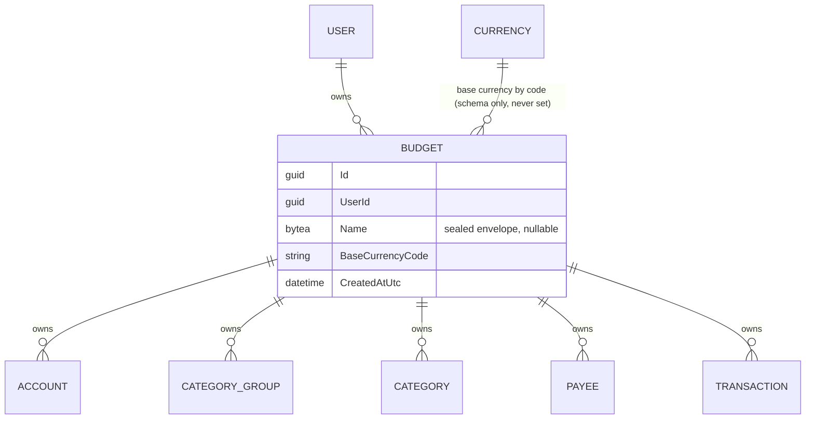
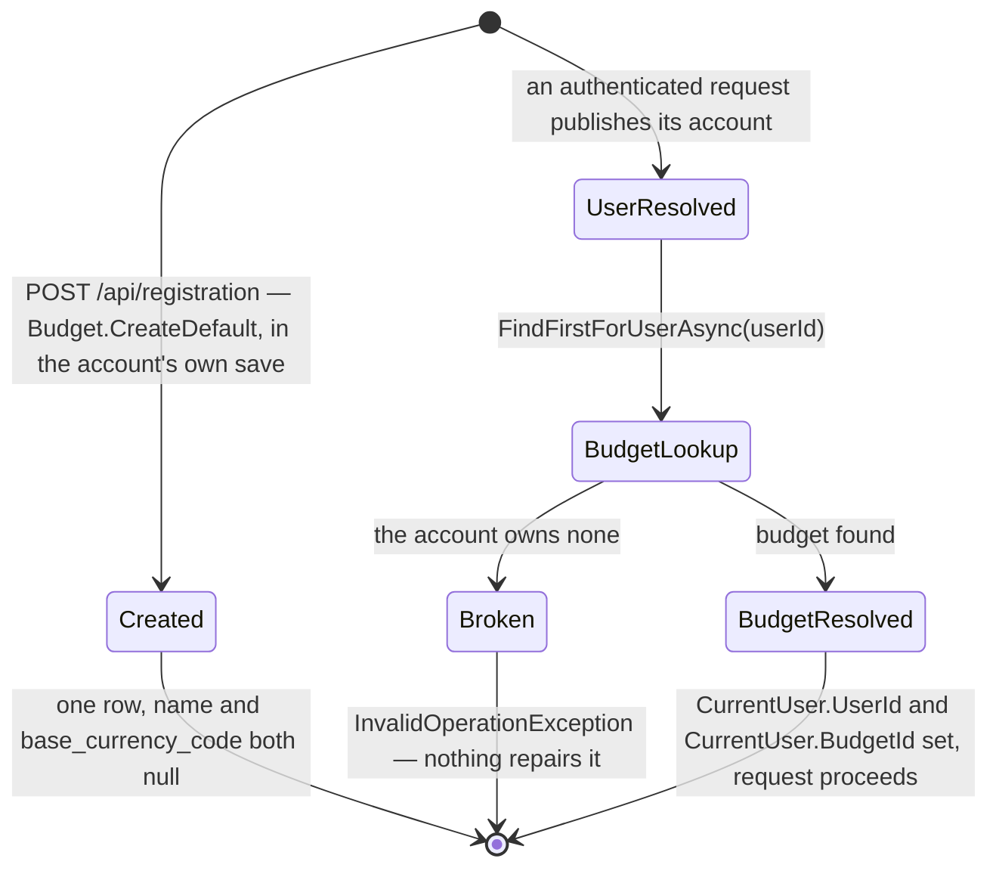

# Budgets

## Table of Contents

- [Purpose](#purpose)
- [Key Entities](#key-entities)
- [Constraints](#constraints)
- [Business Rules & Invariants](#business-rules--invariants)
- [Workflows & State Transitions](#workflows--state-transitions)
- [Decision Trees](#decision-trees)
- [Integration Points](#integration-points)
- [Edge Cases & Known Gotchas](#edge-cases--known-gotchas)

## Purpose

A **Budget** is a coherent pool of money with one owner-purpose, answering one affordability
question. It exists because a person can preside over more than one such pool — money they manage
for an event, a club, or a relative is under their control without being part of their own life —
and forcing those pools into a single total does not simplify the money picture, it falsifies it.
The budget, not the person, is therefore the thing that owns the money picture.

A user is the identity that signs in; see [users-and-ownership.md](users-and-ownership.md). A budget
is what that identity presides over. The product reasoning behind the split is in
`product-research/multi-budget.md` in the private `budgetoid-specs` repository.

The budget is deliberately invisible to a user who has one: it is created for them in the same save
that creates the account, never named in a URL, and never something they set up.

**The budget is also the unit of tenancy**, and this file is the canonical home of that invariant.
Accounts, category groups, categories, payees and transactions all belong to a budget; the user owns
budgets and nothing else. Every rule in [accounts.md](accounts.md), [categories.md](categories.md)
and [transactions.md](transactions.md) assumes the isolation defined here.

## Key Entities

- **Budget** — `Id`, `UserId`, `Name` (nullable), `BaseCurrencyCode` (nullable), `CreatedAtUtc`.
  **`Name` is a sealed narrative envelope and not text**: the property is typed `NarrativeField?`
  and the column is `bytea`. Created through `Budget.Create(id, userId, name, createdAtUtc)`, which
  requires a sealed name, or `Budget.CreateDefault(id, userId, createdAtUtc)`, which leaves `Name`
  null. Both take the row's identifier rather than minting one, and neither offers a minting
  overload — the rule below says why. A null name is the budget the user never asked for; what a
  client shows in place of one is presentation and lives in the client.
- **Base currency** — a nullable ISO-4217 code referencing the shared [Currency](currencies.md)
  reference data. It is null on every budget that exists: no factory takes one and `Budget` exposes
  no method that sets one. The column is schema readiness for a planning layer, not a setting a user
  has.



## Constraints

### MUST

- **Every budget has exactly one owning user.**
  - **Why**: an ownerless budget could never be reached by any request, and a budget with two owners
    would be sharing — which the product does not have.
  - **Enforced in**: `Budget.UserId` is required, and `BudgetConfiguration` maps it to a required
    `user_id` column with a foreign key to `users.id` on `Cascade`.

- **A budget's name reaches this server sealed, and nothing on this side can read, measure or
  compare it.** `budgets.name` is the first column in the product that holds ciphertext.
  - **Why**: a budget name is narrative text, which is the one thing the product is built not to be
    able to read. Everything the server used to do with the value followed from holding the
    characters, so all of it went with them — there is no collation, no length in characters, no
    trim and no blankness rule left on this side, and none can be added.
  - **Enforced in**: `Budget.Name` is typed `NarrativeField?` — the one type a narrative column
    accepts, which has no constructor, factory or conversion taking a `string`, so writing plaintext
    into this column **does not compile**. `BudgetConfiguration` maps it to a nullable `bytea`
    through a `ValueConverter` over that type, beside a `ValueComparer` over the envelope's bytes
    (without one, EF compares a class by reference and reads a rebuilt-but-identical field as an
    edit while missing an envelope rewritten in place). **No test holds any arm of that comparer,
    and this table sits furthest from one**: the product's single change-tracking class reads the
    statements a save composes for `category_groups`
    ([categories.md](categories.md#edge-cases--known-gotchas)) and nothing here is equivalent. A
    failure could not be quiet, though — the role holds **no `UPDATE` grant on `budgets` of any
    shape**, so a restatement the comparer failed to suppress is refused with `42501` rather than
    committing like an edit nobody asked for. It is also unreachable: no path modifies a tracked
    budget, so the comparer is depth for an operation the product does not have. The table carries
    two `CHECK` constraints, each rendered from the constant that owns its number rather than from a
    literal:
    `CK_budgets_name_length` bounds the stored envelope between `CiphertextEnvelope.MinimumLength`
    and `NarrativeFieldLimits.NameBytes`, and `CK_budgets_name_version` requires the leading version
    byte. Both are satisfied by NULL — `length(null)` is null and a null predicate is not a
    violation — which is how the nameless budget passes them with no arm written for it. See
    [ciphertext-envelope.md](ciphertext-envelope.md).

- **Every account, category group, category, payee and transaction belongs to exactly one budget, on
  both read and write.**
  - **Why**: the budget is the coherent pool of money the single picture describes. Data that
    belongs to no budget could never be reached by any request, and data mixed across budgets
    falsifies the picture. This is also the tenant boundary: with a single shared database, a leak
    here means one person reading or changing money that is not theirs.
  - **Enforced in**: the lowest layer is PostgreSQL **row-level security**. A `budget_isolation`
    policy on each of the five tables compares `budget_id` against the session's ambient budget in
    both `USING` and `WITH CHECK`, so no statement on the connection every request is served by
    reaches another budget's rows and an insert can only land in the ambient budget, whatever
    produced the statement. `SessionContextInterceptor` puts that budget on every connection the
    context opens, alongside the authenticated user that `user_isolation` reads on `budgets` itself;
    see [ADR 0005](../decisions/0005-isolate-budget-owned-rows-with-row-level-security.md) and
    [ADR 0011](../decisions/0011-police-the-user-owned-tables.md). Above it sit the EF Core global
    query filters named `BudgetIsolation` in `BudgetoidDbContext.cs`, applied to `Transaction`,
    `Account`, `Payee`, `CategoryGroup` and `Category`, each comparing `BudgetId` against
    `IBudgetContext.BudgetId`: they turn another budget's row into a correct empty result and the
    404 or 400 stated under MUST NOT below, which is error quality rather than enforcement — and
    neither layer is cover for the other.

    Both rest on a required `budget_id` column on all five tables with a foreign key to
    `budgets.id`. That key is `Cascade` on `accounts`, `category_groups`, `categories` and `payees`,
    so structure never survives its budget as unreachable rows, and `Restrict` on `transactions`, so
    recorded money movement pins the budget in place instead — a rule in its own right, stated
    below.

    Once a row exists its `budget_id` never changes, and the lowest layer that can say so is the
    **application role's grants**: `UPDATE` is granted on each of the five tables by explicit column
    list, and `budget_id` is on none of them, so the write is refused with `42501`. The two layers
    above it are each partial — no entity exposes `BudgetId`, which holds only for writes that go
    through the domain, and the composite foreign keys refuse a move only while a child row
    references the one being moved. Enforcement is the column's *omission from the grant's list*
    rather than a `REVOKE`, because PostgreSQL column privileges are additive; see
    [ADR 0004](../decisions/0004-connect-as-a-least-privilege-role.md). `BudgetId` is stamped at
    creation from `IBudgetContext` by `CreateAccountHandler`, `CreateCategoryGroupHandler`,
    `CreateCategoryHandler`, `CreateTransactionHandler` and `CreatePayeeHandler`.
    There is no `UserId` on any of the five entities — `Budget.UserId` is the only owner link in the
    schema.

- **Every reference between two budget-owned rows points inside the same budget.** This covers a
  category's category group and a transaction's account, category and payee.
  - **Why**: a category attached to another budget's group would make the hierarchy read across
    pools, and a transaction pointing at another budget's account, category or payee would put one
    pool's money into another's picture. A query filter cannot enforce anything on a write, so
    leaving this to the resolving handlers means any future write path that bypasses them — an
    importer, a bulk endpoint, a background job — loses it silently.
  - **Enforced in**: `CategoryGroupConfiguration`, `AccountConfiguration`, `CategoryConfiguration`
    and `PayeeConfiguration` each declare an alternate key `(Id, BudgetId)`; `CategoryConfiguration`
    maps `(category_group_id, budget_id)` and `TransactionConfiguration` maps
    `(account_id, budget_id)`, `(category_id, budget_id)` and `(payee_id, budget_id)` onto the
    matching principal keys, all on `Restrict`. `payee_id` and `category_id` stay nullable: a
    multi-column check is skipped entirely when any of its columns is NULL (MATCH SIMPLE). These
    reference columns are also the only ones the role may update besides the plain data columns, and
    it is the composite keys that make granting them safe: repointing a row is a real operation, and
    the key is what confines it to the same budget.

- **Account, category group, category and payee names are unique per budget, and two spellings of
  one name count as one.**
  - **Why**: the names are how the user tells things apart inside one pool of money. Two accounts
    called "Cash" and "cash" in one budget are an unreadable list, while the same name in two
    different budgets is normal. Scoping uniqueness any wider would make one pool's naming constrain
    another's.
  - **Enforced in**: a unique index per budget on all four, over **two different columns**, because
    three of the four have been sealed and one has not.
    - `accounts`, `payees` and `category_groups` are the sealed ones.
      `IX_accounts_budget_id_name_key`, `IX_payees_budget_id_name_key` and
      `IX_category_groups_budget_id_name_key` are unique over `(budget_id, name_key)` — the **blind
      index**, not the name. Uniqueness over `name` would enforce nothing there: every seal draws a
      fresh nonce, so two rows holding one name hold different bytes. Case folding did not disappear
      with the collation, which `bytea` cannot carry; it moved into the normalization the client
      applies before it computes the index, and **nothing on this side can check that it happened**.
      See [accounts.md](accounts.md#business-rules--invariants),
      [payees.md](payees.md#business-rules--invariants) and
      [categories.md](categories.md#constraints).
    - `categories` alone still holds plaintext: its configuration puts `name` on the
      `case_insensitive` collation and indexes `(budget_id, name)`, so PostgreSQL folds the case
      itself. It is the last of the four in that state.

    What happens on a collision differs by entity and by verb, and is unaffected by which column the
    index is over. `AccountRepository`, `CategoryRepository` and `CategoryGroupRepository` translate
    the unique violation into a validation error the user has to resolve, and so does
    `PayeeRepository` **on a rename**; on a payee **create** the same index produces a 409 instead.
    **Those four answers are one rule with two inputs — the verb, and who chose the name — and not
    three agreements with an exception.** A name a person typed into a form is a field they can
    correct, so the answer names it; a payee create's name was resolved by the client against a list
    it decrypted, so a collision means that list was stale and the remedy is to re-read and adopt the
    row already there, which no field-keyed 400 has anywhere to put. The create-against-rename half
    is argued in [payees.md](payees.md#business-rules--invariants); the payee-against-account half,
    which is the one a reader meets first in this paragraph, is argued in the
    [decision log](_decision-log.md). Sealing a table's name column does **not** move it between the
    two answers, and `category_groups` is the worked example: its name became ciphertext and its
    create still answers 400, because the person still typed it into a form. What *is* affected is
    who can read the collision: on the three
    sealed tables, which rows matched is a question only a browser holding the account's index key
    can answer.

    **A third answer exists on two of these tables and it is not about names at all.** `accounts`,
    `payees` and `category_groups` all take a **client-minted** row identifier now, so a create
    retried after a network timeout carries a byte-identical body and breaks the primary key rather
    than the name index; the account and payee repositories answer that with a 409 carrying its own
    sentence, and so does `CategoryGroupRepository`. `categories` has no such answer because its
    identifier is still the server's.

- **Ordering is per budget.**
  - **Why**: position is a deliberate personal arrangement of one pool's categories. Order that
    spanned budgets would let adding a group in one budget renumber another's.
  - **Enforced in**: `CategoryGroupConfiguration` indexes `(budget_id, position)`. Categories are
    indexed on `(category_group_id, position)` — group-scoped on purpose, because groups are
    themselves budget-scoped, so per-budget ordering holds transitively. The domain ordering
    services reindex whatever set they are handed; the query filter is what makes that set one
    budget's.

- **Code that reads `BaseCurrencyCode` MUST treat null as the normal value.** Every budget has a
  null base currency.
  - **Why**: the budget is created in the same save as the account, before the person has been asked
    anything beyond the passkey and the set of codes. Requiring a base currency at creation would
    make the budget something the user must set up, which is exactly what the default budget exists
    to avoid.
  - **Enforced in**: `Budget.Create` and `Budget.CreateDefault` take no currency argument and
    `Budget` exposes no mutator. `BudgetTests` and the registration suite each assert the created
    budget's `BaseCurrencyCode` is null. `base_currency_code` is a nullable `varchar(3)` with a
    `Restrict` foreign key to `currencies.code`. The bottom layer says something wider: the role
    holds `SELECT` and `INSERT` on `budgets` and **no `UPDATE` grant of any shape**, so no column of
    a budget row can be written after the insert.

### MUST NOT

- **A caller MUST NOT be able to load, update or delete an account, category group, category, payee
  or transaction that belongs to another budget.**
  - **Why**: cross-budget access is a tenant breach — the worst possible failure for a money app —
    and even between two budgets of the same user it would put one pool's data into another's
    picture.
  - **Enforced in**: the `budget_isolation` policies are what make the row unreachable, and they
    hold under raw SQL as much as under EF. What is decided above them is only the *answer*: the
    `BudgetIsolation` filter makes the row resolve to `null`, and what the caller sees depends on
    how it addressed the row. A row addressed **by id** — the target of the request itself —
    surfaces as **404**, and that is a property of the handler *shape* rather than of any particular
    handler: an update, move or delete resolves its target through a budget-filtered repository and
    throws `NotFoundException` on the null. `DeleteAccountHandler`, `DeleteCategoryGroupHandler` and
    `DeleteTransactionHandler` are the shape, not the extent of it. The by-id reads return a typed
    `NotFound` result instead of throwing, for the same status. A row named as a **reference inside
    another write** surfaces as a validation error → **400**: `CreateTransactionHandler` for the
    account and the category, `CreateCategoryHandler` and `PlaceCategoryHandler` for the destination
    group. Both codes are correct for their own shape of request — a missing target is a missing
    resource, a bad reference is a bad field — so do not unify them. Neither is ever **403**: a 403
    would confirm the row exists.

- **A response MUST NOT combine data from more than one budget.**
  - **Why**: summing or listing pools with different owners or mandates produces a number that
    answers no one's question. Money genuinely moving between pools is two records — an expense in
    the budget it left, an income in the budget it entered.
  - **Enforced in**: there is one ambient budget per request and every filtered query resolves
    against it. There is no cross-budget query, endpoint, or aggregate.

- **Payees MUST NOT be shared across budgets.**
  - **Why**: a counterparty paid from one pool is that pool's counterparty. The caterer paid from an
    event budget is the event's payee, and merging them would put the event's spending history into
    the user's own autocomplete and totals.
  - **Enforced in**: `Payee` carries a required `BudgetId`, is covered by the `BudgetIsolation`
    filter, and `CreatePayeeHandler` — the one path that inserts a payee — stamps
    `IBudgetContext.BudgetId` and accepts no budget from the caller. Beneath both, the
    `budget_isolation` policy's `WITH CHECK` refuses an insert naming any budget but the session's,
    which is what makes the rule hold for a write path that does not go through the handler.

- **A route MUST NOT carry a budget identifier.**
  - **Why**: the budget is a singular ambient resource, resolved server-side from the authenticated
    principal. A client-supplied budget id would turn tenancy into a request parameter, and would
    make the concept visible in the URL bar of a user who has only one budget.
  - **Enforced in**: `BudgetRouteConstructionTests.Api_HasNoRouteContainingABudgetIdentifier` walks
    the API's `EndpointDataSource` and asserts that no route pattern segment and no route parameter
    name mentions a budget. A test asserting an absence: if a `/api/budgets/{budgetId}` endpoint is
    ever needed, the rule is being changed, not worked around.

- **Per-owner budget-name uniqueness MUST NOT be reintroduced, and the unique index MUST NOT be
  deleted.** Both halves of that sentence are load-bearing and they point in opposite directions.
  - **Why**: uniqueness over this column is **surrendered**, not deferred — see the rule below for
    the whole argument. What the index still does is bound the *unnamed* budgets at one, which is
    the invariant registration's race safety rests on, so a reviewer who reads the surrender as a
    reason to drop the index takes the surviving half out with the dead one.
  - **Enforced in**: nothing refuses a duplicate name, deliberately.
    `BudgetoidDbContextConstructionTests.Model_ScopesBudgetNameUniquenessToTheOwner` and
    `BudgetRepositoryTests.Budgets_WithNoNameForOneUser_AreRejectedAfterTheFirst` hold the
    declaration and the `NULLS NOT DISTINCT` behaviour respectively.

- **The server MUST NOT be given a rule about a budget name's text** — not a minimum length, not a
  blankness check, not a trim, not a character cap.
  - **Why**: this is a **capability that moved to the client**, not a rule that was quietly dropped,
    and the distinction is the whole point of writing it down. The server holds an envelope; "is
    this name nothing but spaces?" and "is it longer than a label?" are questions about plaintext it
    has never seen and never will. A reader who finds the gap in the validator and restores a check
    can only restore it against the envelope — measuring bytes and calling them characters, or
    refusing a 29-byte envelope that is the correct sealing of an empty string. Both are wrong
    answers wearing the shape of the right one, and neither can be honest.
  - **Enforced in**: `Budget`'s shared `ValidateOrThrow` judges the identifier and the owner and
    nothing else; its `nameRequired` parameter went with the rules it selected between, because a
    switch with one arm is not a switch. "A name is not just spaces" is the client's, applied before
    it seals. What survives on this side is the envelope's framing and the two byte bounds under
    MUST above — the only length anything here can measure.

## Business Rules & Invariants

- **Rule**: A budget with **no name** is created for a user in the same save as their account, and
  nothing else ever creates one.
- **Why**: a user must never encounter "budget" as something to set up. Registering is the whole
  setup, so the pool of money their data hangs off has to already exist by the time their first
  request reaches a handler. It carries no name because nobody named it: inventing a name on the
  user's behalf would both put a display decision in storage and make a budget they never touched
  look deliberately named.
- **Enforced in**: `RegisterAccountHandler` builds it with `Budget.CreateDefault` and
  `IRegistrationRepository.RegisterAsync` writes it beside the user and its three credentials in one
  save; every later request reads it back through `IBudgetRepository.FindFirstForUserAsync` while
  authenticating. `Budget.CreateDefault` is the only path that produces a budget without a name, and
  `RegisterAccountHandler` is its only caller.
- **Example**: a completed registration ends with exactly one row in `budgets`, owned by the new
  user, with `name` and `base_currency_code` both null.
- **Counterexample**: writing the budget in a second save. It would make "a user row with no budget"
  reachable, and that state has no repair — every resolve throws and the person cannot even erase.
- **Source**: `[SOURCE: user-story]`

---

- **Rule**: A user has **at most one unnamed budget**, plus any number of named ones.
- **Why**: the unnamed budget is the one registration creates, so "no second unnamed budget" is what
  stops any writer — including one that does not exist yet — from giving an account a second budget
  nobody asked for. Keying that on the *absence* of a name is what makes it hold: a shared default
  string would be a constant two callers have to write identically, it can drift, and the day it
  drifted both inserts would succeed and the user would silently own two budgets with no error
  anywhere. Nothing about "no name" can drift. The invariant is also exactly the shape multi-budget
  needs — named budgets are unconstrained in number, and the budget the user never asked for stays
  singular.
  - **Keying on the absence of a name is now the only thing this index *can* key on.** A name is
    ciphertext, and two budgets carrying the same name carry different bytes, because every seal
    draws a fresh nonce. "No name" is NULL before and after, so the `NULLS NOT DISTINCT` half is
    untouched by the column's change of type while the named half stopped refusing anything — which
    is why the index survives a reviewer's proposal to delete it as dead weight.
- **Enforced in**: the unique index over `(user_id, name)` in `BudgetConfiguration`, declared
  `NULLS NOT DISTINCT` (`AreNullsDistinct(false)`, PostgreSQL 15+). **Database-owned** under
  [ADR 0002](../decisions/0002-enforce-rules-at-the-lowest-capable-layer.md) — the schema is the
  lowest layer that can state it declaratively, so it holds for write paths that do not exist yet.
  `BudgetRepository.TryAddAsync` restates nothing; it only translates a `23505` on
  `IX_budgets_user_id_name` into `false`, and lets every other rejection propagate. It has **no
  production caller** — the only insert of a budget rides on registration's single save — and keeps
  its pins for the reason `HasTransactionsAsync` does.
  `BudgetoidDbContextConstructionTests.Model_ScopesBudgetNameUniquenessToTheOwner` pins the
  declaration, and `BudgetRepositoryTests.Budgets_WithNoNameForOneUser_AreRejectedAfterTheFirst`
  pins the behaviour against PostgreSQL. Do not delete either as dead code.
- **Example**: two writers inserting `(user_id, NULL)` for one owner. PostgreSQL accepts one and
  rejects the other with `23505`.
- **Counterexample**: leaving the index at PostgreSQL's default NULL semantics, where every NULL is
  distinct from every other. Both racing rows would insert cleanly, the user would silently own two
  budgets, and nothing would say so. A store-level `DEFAULT` on `name` would not restore the
  guarantee either: EF sends every mapped, non-store-generated property in the INSERT, so the
  default would never fire, and it would put a UI-visible string in the schema where it cannot be
  localized.
- **Source**: `[SOURCE: discussion]`

---

- **Rule**: **Two budgets of one owner may carry the same name, and nothing anywhere refuses it.**
  That uniqueness is *surrendered*, not deferred.
- **Why**: the guarantee rested on the server holding the characters — a `case_insensitive`
  collation folding "Wedding" against "wedding", and a unique index comparing the folded values. The
  column now holds an AEAD envelope, and two seals of one name differ in every byte because each
  draws a fresh nonce, so a unique index over it can no longer see a duplicate whatever it is
  declared on. The collation did not survive either, and its departure was **forced rather than
  chosen**: `case_insensitive` is a text collation and `bytea` is not a collatable type — measured,
  declaring one raises `collations are not supported by type bytea`. What could bring the refusal
  back is a **blind index**, the keyed fingerprint that lets a server holding no plaintext see that
  two names are equal. **That mechanism now exists and is in use on three tables**:
  `accounts.name_key` is the first, `payees.name_key` the second and `category_groups.name_key` the
  third, and each unique index over
  `(budget_id, name_key)` is this same uniqueness rule surviving this same change, by the same
  mechanism, over bytes the database cannot interpret ([accounts.md](accounts.md#must),
  [payees.md](payees.md#must), [categories.md](categories.md#constraints)). So the exclusion here has
  been re-read against three working examples
  rather than against an idea nobody tried, and it stands: the requirement
  blind-indexes the name columns on `accounts`, `categories`, `category_groups` and `payees`, and
  leaves this one out. There is no later slice in which this comes back, and the honest word for it
  is surrendered. **A second exclusion has since joined it and is not the same kind of thing**: no
  *description* column gets a blind index either, because a description is never looked up — that is
  a mechanism nobody wanted, where this is a rule given up. Do not read the two absences as one
  policy. See [categories.md](categories.md#constraints).
- **Enforced in**: nothing, and the absence is the rule. What a reader will misread as the missing
  enforcement is the unique index over `(user_id, name)`, which still exists and still refuses
  something — a second *unnamed* budget, stated above.
- **Counterexample**: adding a blind-index column to `budgets` to restore the refusal. It would
  bring back a rule nobody asked for, at the cost of a second value per row that cannot be
  recomputed once written — the client holds the only key that can produce one — and a
  cross-client contract for a column the requirement leaves out. The cheaper mistake in the same
  direction is a client that refuses a duplicate name it can see in its own list: harmless as help,
  and not to be described anywhere as the invariant, because a second client would not have it.
- **Source**: `[SOURCE: discussion]`

---

- **Rule**: A budget's identifier is **supplied to the factory, never minted inside it** — and
  registration is the one place in the product that chooses a narrative row's id server-side.
- **Why**: a narrative row's id is the associated data its name was sealed against, so a row whose
  id the server picked holds a name nobody can ever open — with every constraint satisfied and
  nothing red. That is why the id is the client's for every narrative row
  ([ADR 0022](../decisions/0022-mint-narrative-row-identifiers-on-the-client.md)). The budget
  registration creates is the exception, and it is a narrow one: the row carries **no name**, so
  there is nothing sealed and nothing to seal against, and the browser has no basis on which to
  choose. A budget that is named is created by whoever sealed the name, and hands its id in with it.
- **Enforced in**: `Budget.Create` and `Budget.CreateDefault` each take `id` as a parameter, and
  `Guid.CreateVersion7()` has left `Budget.cs` entirely rather than moving behind an overload — a
  caller that simply forgot to thread the id through would otherwise compile, pass every test that
  does not assert the returned identifier, and produce exactly that row. The shared `ValidateOrThrow`
  refuses `Guid.Empty`, which is reachable for the first time now that the value arrives from
  outside: all-zero is a legal uuid, so the primary key would store the first such row and report
  the second under a constraint name that says nothing about a caller who never chose an id.
  `RegisterAccountHandler` is the one call site that mints one, on a line written out in the open.
- **Counterexample**: a `Budget.Create(userId, name, createdAtUtc)` overload that mints the id for
  convenience. Nothing in the domain can tell a good id from a wrong one, so the only protection is
  that inventing one has to be *written* on a line a reviewer reads in the diff.
- **Source**: `[SOURCE: discussion]`

---

- **Rule**: A user and its default budget are created in **one** `SaveChanges`, together with the
  account's three credentials. There is no heal: a request that resolves an account and finds no
  budget **throws** rather than repairing anything.
- **Why**: a second save for the budget makes "a user row with no budget" reachable, and paying for
  it means a find-or-create on every authenticated request to repair it. One save removes the state
  instead of tolerating it. What that buys beyond the round-trip: no route but the one that creates
  an account writes at all, and there is no unconditional repair a future reader can delete as
  apparent duplication.
  - **Do not wrap it in `ITransactionalExecutor`.** `BeginTransactionAsync` is what opens the
    connection, and opening the connection is when `SessionContextInterceptor` writes
    `app.current_user_id`. Inside a transaction the interceptor runs **once**, at the begin — so a
    wrap whose delegate contains the identity publication configures the connection while the
    setting is still empty, and the `users` INSERT meets `''::uuid` in its `WITH CHECK` and fails
    `22P02`. It is fixable by publishing outside the wrap, but the fix is a new ordering rule
    someone must not re-break; one save has no such rule.
  - **Unreachable from the only path that creates a user — not unreachable outright.** Nothing in
    the schema forbids the state, so a direct `DELETE FROM budgets` still produces it, and the
    account is then **dead rather than healed**. A deliberate trade, bounded by production holding
    no data. The stronger guarantee — `users.default_budget_id`
    `NOT NULL DEFERRABLE INITIALLY DEFERRED` — was considered and deferred; see the decision log.
- **Enforced in**: `IRegistrationRepository.RegisterAsync`, one save over a
  `Domain.Users.Registration` whose members are all required — so a registration missing its budget
  is unspellable rather than merely unwritten. `AuthenticateSessionHandler` reads that budget back
  on every request and throws `InvalidOperationException` if it is absent — not a 404, because the
  invariant broke rather than the account being absent.
- **Example**: two registrations racing on one Google identity. The loser's whole save is refused,
  so it leaves no user, no credential and no budget behind, and it is answered `409` rather than
  being signed into the winner's account. Each racer's `user_id` is derived from its own ceremony's
  challenge, so `IX_budgets_user_id_name` cannot be contended on this path at all; what races is the
  **credential**. See [registration.md](registration.md).
- **Source**: `[SOURCE: user-story]`

---

- **Rule**: The ambient budget id is resolved once per request and carried alongside the user id.
- **Why**: resolving it lazily deeper in the request would mean issuing a query from wherever it was
  first needed, potentially on the very context being queried. Resolving it at the edge means one
  lookup per request and a single place where "which budget is ambient" is decided.
- **Enforced in**: `AuthenticateSessionHandler` publishes both through `IUserContextWriter` — the
  identity first, the budget second, because `ResolveUser` clears it — onto the scoped
  `CurrentUser`. `HttpContextBudgetContext` exposes `CurrentUser.BudgetId` as
  `IBudgetContext.ResolvedBudgetId`, and `IBudgetContext.BudgetId` — the strict accessor the query
  filters read — is that value with null rejected, so a request whose budget was somehow never
  resolved fails loudly instead of querying with a default budget id. The strict form is a default
  interface member rather than something each implementation writes, because the row-level security
  session variable reads one accessor and the query filters read the other: two separately written
  members could name different budgets and nothing would fail. The nullable one exists for the two
  callers that legitimately have no budget — authentication itself, and infrastructure scopes such
  as health checks.
- **Example**: a handler creating an account never receives an owner id from the client — it reads
  `IBudgetContext.BudgetId` and stamps it.
- **Counterexample**: a handler that took the owner or budget id from the request would work
  perfectly in every single-tenant test and still be a tenant breach: tenancy would become a request
  parameter, so any authenticated user could name another budget's id. Ambient-only resolution is
  the whole protection; there is no second check behind it.
- **Source**: `[SOURCE: user-story]`

---

- **Rule**: A budget that holds at least one transaction cannot be deleted. A budget that holds
  structure but no transaction can, and its accounts, category groups, categories and payees go out
  with it. Account erasure is not an exception: it empties the transactions first and then deletes
  the *user*, so the budget leaves by the cascade with nothing left to hold it — see
  [erasure.md](erasure.md).
- **Why**: recorded money movement is the only data in the system a user cannot reconstruct from
  memory, and losing it in bulk is the worst outcome a money app has. Empty scaffolding does not
  earn the same protection: a budget nobody recorded anything in was a mistake, and making it
  permanently undeletable would be a worse answer than letting the structure follow it out. Settling
  that asymmetry in the schema is what stops the first delete path anyone writes from deciding it by
  accident.
- **Enforced in**: deliberately split across two layers, and only the lower one exists today.
  - **The database owns the refusal.** `TransactionConfiguration` maps
    `transactions.budget_id → budgets.id` on `Restrict` while the other four map theirs on
    `Cascade`, so PostgreSQL decides the asymmetry for every write path — including the ones that do
    not exist yet. This is the lowest layer that can state the rule declaratively.
    `BudgetRepositoryTests.Database_RefusesToDeleteABudgetThatHoldsTransactions` and
    `Database_AllowsDeletingABudgetWithStructureButNoTransactions` pin both halves against a real
    PostgreSQL, each asserting the surviving rows as well as the outcome; `UserSchemaTests`
    re-proves the same pair one cascade hop up.
  - **A future delete feature owns the explanation.** Nothing in the application deletes a budget,
    so no layer above the schema states the rule today. Whoever writes that path needs an
    application precheck rather than a translated database error, because the refusal is guaranteed
    but the constraint that reports it is not (see Edge Cases). The seam already exists:
    `IBudgetRepository.HasTransactionsAsync` has no production caller. It takes no budget id,
    because the filter already scopes it to the ambient budget.
  - **The precheck is check-then-act and racy by design, and neither half is a defect.** A
    transaction can land between the check and the delete, and the delete then fails on the
    constraint instead of on the check. That is correct: the precheck exists for the *message*, the
    constraint is what is *correct*. Do not "fix" the race with a lock, and do not drop the
    constraint on the grounds that the check already covers it.
- **Example**: a user who recorded a single transaction two years ago keeps that budget under the
  current schema. A budget holding two accounts, a category group, three categories and a payee, and
  no transaction, is deleted whole in one statement.
- **Counterexample**: a delete handler that catches the foreign-key violation and renders it as
  "This budget still has transactions." It would be right most of the time and wrong at random,
  because which constraint PostgreSQL names is decided by foreign-key creation order.
- **Source**: `[SOURCE: discussion]`

## Workflows & State Transitions

**Where a budget comes from, and how a request finds it.** It is written once, in the save that
creates the account; every request afterwards reads it while authenticating. The user branch is
documented in [users-and-ownership.md](users-and-ownership.md#workflows--state-transitions).



| Transition | Triggered by | Validations |
|---|---|---|
| → Created | `POST /api/registration`, in the one `SaveChanges` that writes the whole account | `Budget.CreateDefault` validates the owner and the supplied identifier; there is no name to validate, and there is nothing about a name this side could validate |
| UserResolved → BudgetLookup | Every authenticated request, after `ResolveUser` and never before it | `ResolveUser` clears the ambient budget, so the order is the rule |
| BudgetLookup → BudgetResolved | The account owns a budget | First budget by `CreatedAtUtc`, then `Id`. The read is scoped by owner explicitly — `Budget` carries no query filter |
| BudgetLookup → Broken | The account owns none | `InvalidOperationException`. Unreachable from the one path that creates an account |

## Decision Trees

Resolving the ambient budget, after the user has been resolved:

```
IF the request is creating the account                   ← POST /api/registration, and nothing else
  the budget is written in the same save as the user     ← no lookup, no insert, no race
  IF that save loses on any of four unique rules
    THEN nothing is written at all — 409                 ← the winner is never adopted
ELSE                                                     ← every other authenticated request
  publish the account FIRST                              ← budgets is policed by user_isolation, so a
                                                           read under an unpublished identity matches
                                                           nothing and fails 22P02
  read its first budget by CreatedAtUtc, then Id
  IF none                                                ← unreachable from the one path that creates
    THEN InvalidOperationException                         an account; nothing repairs it
```

The user branch that runs before this is in
[users-and-ownership.md](users-and-ownership.md#decision-trees).

## Integration Points

- **[Users & Ownership](users-and-ownership.md)**: the owning user comes from registration, and the
  budget is written in that same save — "an account exists ⇒ it has its budget" is one idea.
- **[Ciphertext Envelope](ciphertext-envelope.md)**: `budgets.name` is the first column in the
  product that stores an envelope, so the framing, the two byte caps, the value type the column
  accepts and the grammar a name is bound to all live there. This file owns what a budget name
  *means* and what the schema no longer refuses about it. `accounts.name` is the second, and the
  first to carry a blind index beside it — the difference between the two columns is the whole of
  what [accounts.md](accounts.md) has to say that this file does not.
- **[Currencies](currencies.md)**: `BaseCurrencyCode` references the global ISO-4217 reference table
  by code with `Restrict`. `Currency` is the only reference table shared across every budget.
- **[Accounts](accounts.md)**, **[Transactions](transactions.md)**, **[Payees](payees.md)** and
  **[Categories and Category Groups](categories.md)**: all five entities are stamped with and
  filtered by `BudgetId`. Those files document their own field rules and lifecycles.

## Edge Cases & Known Gotchas

- **`Budget` has no global query filter and cannot have one.** The lookup that resolves the ambient
  budget has to find one *before* any budget id exists, so there is nothing for a filter to close
  over. Consequently **every query over `db.Budgets` must scope by owner explicitly** —
  `FindFirstForUserAsync` does this with an explicit `Where(budget => budget.UserId == userId)`.
  This is the easiest tenant leak to introduce in the codebase: a new `db.Budgets` query that
  forgets the owner predicate reads every user's budgets and no filter will save it.

- **"Exactly one budget per user" is a release-scope property, not a schema invariant.** The schema
  permits several budgets per user *on purpose* — multi-budget-ready from day one, and
  `BudgetConfiguration` deliberately carries no unique index or key over `user_id` alone. The
  one-per-user property holds today only because no code path creates a second budget. Do not write
  code that relies on a user having at most one budget, and do not "fix" the missing constraint by
  adding one. The `NULLS NOT DISTINCT` index is not that constraint: it bounds the *unnamed* budgets
  at one and leaves named ones unlimited, which is why it survives multi-budget untouched.

- **`FindFirstForUserAsync`'s `CreatedAtUtc`-then-`Id` ordering is a contract, not an implementation
  detail.** Ordering by `Id` alone would make an in-memory implementation and the database-backed
  one pick different budgets for the same user; the reason is on `IBudgetRepository`.

- **The lookup is by owner, never by name.** It matches `UserId` alone, and it has to: the budget
  registration creates has no name. The point survives renaming too — a name-based lookup would stop
  finding a budget the day the user renamed it, and a future writer would silently create a second
  one. Do not reintroduce a name — a well-known literal, a marker string, a flag column standing in
  for one — as the way the default budget is recognized. The column's type now says the same thing
  from underneath: a `WHERE name = 'something'` over ciphertext matches nothing a person typed, so
  the mistake has stopped being expressible in SQL as well as forbidden here.

- **Which of the two `CHECK` constraints on `name` reports a violation is decided by the constraint
  *name*, alphabetically — not by declaration order and not left to right inside an `AND`.**
  Measured on PostgreSQL 17.10: one pair of predicates answered `23514` or `2202E` depending only on
  what the constraints were called. `get_byte` reads better — the leading byte is a number — and it
  *raises* on a zero-length `bytea` instead of answering false: `get_byte(''::bytea, 0)` fails with
  `2202E`, which is not a constraint violation at all — no constraint name, no failing row, and
  nothing a handler filtering on `23514` can ever see. **The length check next door saves it only by
  accident, and reading that accident as a guarantee is the trap.** `CK_budgets_name_length` sorts
  ahead of `CK_budgets_name_version`, so a zero-length name meets the band first, the version
  predicate is never evaluated on it, and a `get_byte` spelling here would be unreachable through the
  schema as declared rather than merely quiet. So `substring` is written for the **property** and not
  for the symptom: it makes the predicate total over every length this column can hold, which is what
  takes the ordering out of the answer. The whole argument, and the rule for whoever writes the next
  such constraint, is in
  [ciphertext-envelope.md](ciphertext-envelope.md#two-checks-on-one-column-and-which-one-bites).

- **A named budget is not a thing this product can create today, and the schema is ready for one
  anyway.** `Budget.Create` exists, takes a sealed name and a client-minted id, and the column, its
  converter, its comparer and its two check constraints are all live — but every budget that exists
  is the nameless one registration writes. Do not read the column's emptiness as permission to relax
  anything about it: the format is a cross-client contract, and it is cheaper to agree on before a
  row is written under it than after.

- **A budget with no name renders as the client's own localized default label.** That is the whole
  contract for the missing name, written down before there is anything to write it into: there is no
  budget endpoint, DTO or UI today, so the first client to display a budget name is the one that
  would otherwise invent its own answer. The label is presentation, so it belongs to the client and
  only the client. A client MUST NOT write its label back into `name`: that would turn a budget the
  user never named into one that looks deliberately named, freeze one language's string into
  storage, and make "default by design" and "named by the user" indistinguishable again.

- **`BaseCurrencyCode` is never written.** Not "rarely set" or "set once" — no factory takes it and
  `Budget` exposes no method that sets it. Do not build display, defaulting or conversion logic on
  the assumption that some budget somewhere has one. The database is arranged the same way and will
  say so loudly: with no `UPDATE` grant on `budgets`, the first operation that edits a budget fails
  with `42501` until a column list for it is added to `app-role-grants.sql`. That is the intended
  order of events: the grant is where the decision that a budget column is mutable gets recorded.

- **How the `BudgetIsolation` filter captures the budget is the most dangerous edit in the
  persistence layer.** Rewriting the lambda to read a captured local, a `static`, or a service
  locator bakes the *first* request's budget id into EF's cached model, with no compiler error. What
  the row-level security policies change is the *shape* of the resulting defect, not its
  seriousness: the stale filter budget and the session's real one must both hold, so every later
  request reads an empty budget rather than the first tenant's rows. That is a breakage instead of a
  breach, and it is quieter — it survives every test that reads only one budget's data.
  `BudgetIsolationTests` runs **two budgets inside one process** precisely to catch a regression
  here; never "clean it up" into two processes, because separate processes have separate model
  caches and the test would pass while the bug shipped.

- **`IBudgetContext` is intentionally optional on the DbContext constructor.** Design-time,
  migration, seeding and model-construction paths build the context without a resolved budget, and
  those paths never query the five filtered entities. Do not make the parameter required to "harden"
  it — that breaks `dotnet ef` and the model-assertion tests. The safety net is that the filters
  dereference it: a context built without a budget throws the moment a query touches one of the
  five. So any seeding or maintenance path that wants to write those entities directly must supply
  an `IBudgetContext`.

- **The composite foreign keys prove internal consistency, not that the ambient budget was the right
  one.** They guarantee that a transaction and every row it references agree on one budget id; they
  say nothing about *which* budget id that is. An importer could stamp a consistently
  cross-referenced set with the wrong `budget_id` and every constraint in the schema would accept
  it. Two bottom layers close that: `budget_id` is absent from every `UPDATE` column list, so a row
  that exists cannot be **moved**; and the `budget_isolation` policies' `WITH CHECK` refuses an
  insert naming any budget but the session's, so a row cannot be **created** in one either. What
  neither can check is whether the session named the right budget — ambient-budget resolution
  decides that, and it remains the whole protection for *whose* budget a write lands in.

- **The delete policy across the five owned tables is deliberately not uniform.** `accounts`,
  `category_groups`, `categories` and `payees` cascade from `budgets.id`; `transactions` restricts.
  Making all five `Restrict` would leave an empty budget permanently undeletable; making all five
  `Cascade` would put months of financial history one unguarded delete away. Do not "normalize"
  them.

- **The refusal is guaranteed, but which constraint reports it is not.** What makes `transactions`
  able to refuse is not that its foreign keys are `Restrict` — `categories → category_groups` is
  `Restrict` too — but that its rows *survive* the budget cascade, while every other owned table is
  emptied by the same statement and so has nothing left to dangle. Which constraint then fires —
  `FK_transactions_budgets_budget_id`, or one of the composite keys after their principals cascade —
  depends on foreign-key creation order. The delete always fails; the constraint name in the error
  is not a stable contract. That is why the delete rule above puts the explanation behind a
  precheck.

- **Resolving the ambient budget costs one extra indexed read per authenticated request.** It hits
  the leading column of an index that already exists, and runs on every request — the third of the
  three reads authenticating one takes. Caching it — in the session row, in a claim, or in a
  distributed cache — is a deliberate non-goal: a cached budget id is a stale tenant id. Putting it
  on the `sessions` row would additionally be a second copy of a fact `budgets` already owns.
