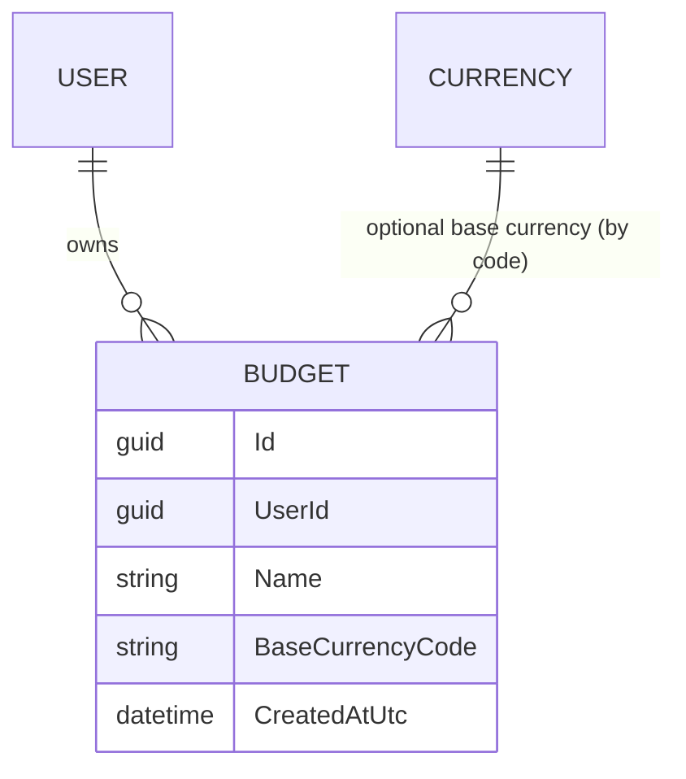
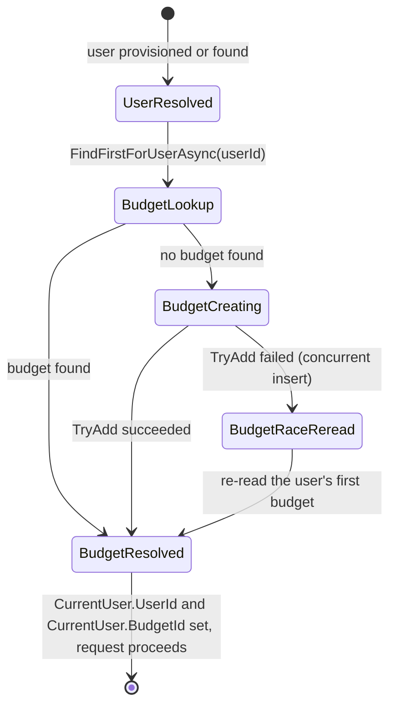

# Budgets

## Table of Contents

- [Purpose](#purpose)
- [Key Entities](#key-entities)
- [Constraints](#constraints)
- [Business Rules & Invariants](#business-rules--invariants)
- [Workflows & State Transitions](#workflows--state-transitions)
- [Integration Points](#integration-points)
- [Edge Cases & Known Gotchas](#edge-cases--known-gotchas)

## Purpose

A **Budget** is a coherent pool of money with one owner-purpose, answering one affordability
question. It exists because a person can preside over more than one such pool — money they manage
for an event, a club, or a relative is under their control without being part of their own life —
and forcing those pools into a single total does not simplify the money picture, it falsifies it.
The budget, not the person, is therefore the thing that owns the money picture.

A user is the identity that signs in; see [users-and-ownership.md](users-and-ownership.md). A budget
is what that identity presides over. The product reasoning behind the split — why the boundary is
ownership and purpose rather than currency, and why budgets never aggregate — is in
[docs/product/multi-budget.md](../product/multi-budget.md).

The budget is deliberately invisible to a user who has one: it is created for them at sign-in, never
named in a URL, and never something they set up.

## Key Entities

- **Budget** — `Id`, `UserId` (the owning user), `Name`, `BaseCurrencyCode` (nullable),
  `CreatedAtUtc`. Created through `Budget.Create(userId, name, createdAtUtc)` or
  `Budget.CreateDefault(userId, createdAtUtc)`, which uses the constant name `Budget.DefaultName`
  (`"My Budget"`).
- **Base currency** — the unit a budget plans its life in, held as a nullable ISO-4217 code
  referencing the shared [Currency](currencies.md) reference data. A budget may have none.

## Constraints

### MUST

- **Every budget has exactly one owning user.**
  - **Why**: A budget is the pool of money a specific person presides over. An ownerless budget
    could never be reached by any request, and a budget with two owners would be sharing — which the
    product does not have.
  - **Enforced in**: `Budget.UserId` is required (`Budget.Create` rejects `Guid.Empty`), and
    `BudgetConfiguration` maps it to a required `user_id` column with a foreign key to `users.id` on
    `Cascade` — deleting the user removes their budgets rather than leaving unreachable rows.

- **Budget names are unique per owner, case-insensitively.**
  - **Why**: The name is the only thing that will distinguish one budget from another when a user
    presides over several, so two budgets called "Wedding" and "wedding" would be a picker the user
    cannot read. Case-insensitive uniqueness is also what makes provisioning race-safe (see
    Workflows).
  - **Enforced in**: `BudgetConfiguration` puts `name` on the `case_insensitive` collation and adds a
    unique index over `(user_id, name)`. PostgreSQL folds case for that index and for plain-equality
    lookups on the same column alike, so a lookup and the constraint can never disagree about what
    counts as a duplicate.

- **A budget may exist with no base currency.**
  - **Why**: The budget is created for the user at sign-in, before they have been asked anything.
    Requiring a base currency at creation would make the budget something the user must set up, which
    is exactly what the default budget exists to avoid.
  - **Enforced in**: `Budget.BaseCurrencyCode` is nullable and is not set by either factory;
    `base_currency_code` is a nullable `varchar(3)` with a `Restrict` foreign key to
    `currencies.code`, so a currency that some budget uses as its base cannot be deleted out from
    under it.

### MUST NOT

- **A route MUST NOT carry a budget identifier.**
  - **Why**: The budget is a singular ambient resource, resolved server-side from the authenticated
    principal. A client-supplied budget id would turn tenancy into a request parameter — something
    the caller can tamper with — and would make the concept visible in the URL bar of a user who has
    only one budget.
  - **Enforced in**: `BudgetRouteConstructionTests.Api_HasNoRouteContainingABudgetIdentifier` walks
    the API's `EndpointDataSource` and asserts that no route pattern segment and no route parameter
    name mentions a budget. This is a test asserting an absence: if a `/api/budgets/{budgetId}`
    endpoint is ever needed, the rule is being changed, not worked around.

## Business Rules & Invariants

- **Rule**: A budget named `Budget.DefaultName` is created for a user when they are provisioned, and
  the step is idempotent — a user who already has a budget gets no new one.
- **Why**: A user must never encounter "budget" as something to set up. Signing in is the whole
  setup, so the pool of money their data hangs off has to already exist by the time their first
  request reaches a handler.
- **Enforced in**: `EnsureUserHandler.HandleAsync` resolves the user, then find-or-creates the
  budget via `IBudgetRepository.FindFirstForUserAsync` / `TryAddAsync`, returning
  `ProvisionedUser(UserId, BudgetId)`.
- **Example**: A brand-new Google subject's first authenticated request ends with exactly one row in
  `budgets`, owned by the new user, named `"My Budget"`, with `base_currency_code` null. Three more
  requests add nothing.
- **Counterexample**: Creating the budget only on the new-user branch would look correct and pass a
  first-sign-in test, but it would leave any user whose budget insert was lost permanently without
  one — and nothing would ever repair it.
- **Source**: `[SOURCE: user-story]`

---

- **Rule**: The find-or-create budget step runs on **every** authenticated request, not only for new
  users.
- **Why**: It is the heal path. Provisioning writes the user and the budget in two separate saves, so
  a state where a user row exists with no budget is reachable; running the step unconditionally means
  the next sign-in repairs it instead of the user being stuck. The lookup costs one indexed read on
  the leading column of an index that already exists.
- **Enforced in**: `EnsureUserHandler.HandleAsync` calls the budget step after both the existing-user
  and new-user paths converge, not inside either branch.
- **Example**: A user whose budget row was removed directly in the database signs in again and gets a
  fresh default budget; no error surfaces.
- **Source**: `[SOURCE: user-story]`

---

- **Rule**: The ambient budget id is resolved once per request and carried alongside the user id.
- **Why**: Resolving it lazily deeper in the request would mean issuing a query from wherever it was
  first needed, potentially on the very context being queried. Resolving it at the edge means one
  lookup per request and a single place where "which budget is ambient" is decided.
- **Enforced in**: `UserProvisioningMiddleware` assigns both `ProvisionedUser` ids onto the scoped
  `CurrentUser` (`UserId`, `BudgetId`).
- **Source**: `[SOURCE: user-story]`

## Workflows & State Transitions

**Provisioning on an authenticated request** (`UserProvisioningMiddleware` → `EnsureUserHandler`).
The user branch is documented in [users-and-ownership.md](users-and-ownership.md#workflows--state-transitions);
this is the budget branch that runs after it, on every path:

| Transition | Triggered by | Validations |
|---|---|---|
| UserResolved → BudgetLookup | Always, on both the new-user and existing-user paths | — |
| BudgetLookup → BudgetResolved | The user already owns a budget | First budget by `CreatedAtUtc`, then `Id` |
| BudgetLookup → BudgetCreating | The user owns no budget (new user, or the heal path) | `Budget.CreateDefault` validates owner and name |
| BudgetCreating → BudgetResolved | Insert succeeded | Unique `(user_id, name)` accepted the row |
| BudgetCreating → BudgetRaceReread → BudgetResolved | Unique-insert race lost | Re-read by owner; throws if still absent |

## Integration Points

- **[Users & Ownership](users-and-ownership.md)**: the owning user comes from provisioning, and the
  budget step is part of the same handler — "an account exists ⇒ it has its budget" is one idea, so
  splitting it would open a window where a user exists without a budget.
- **[Currencies](currencies.md)**: `BaseCurrencyCode` references the global ISO-4217 reference table
  by code with `Restrict`, so currencies stay shared reference data and a base currency in use cannot
  be deleted.

## Edge Cases & Known Gotchas

- **`Budget` has no global query filter and cannot have one.** The provisioning lookup has to find a
  budget *before* any budget id exists, so there is nothing for a filter to close over. Consequently
  **every query over `db.Budgets` must scope by owner explicitly** — `BudgetRepository`
  `FindFirstForUserAsync` does this with an explicit `Where(budget => budget.UserId == userId)`. This
  is the easiest tenant leak to introduce in the codebase: a new `db.Budgets` query that forgets the
  owner predicate reads every user's budgets and no filter will save it.

- **"Exactly one budget per user" is a release-scope property, not a schema invariant.** The schema
  permits several budgets per user *on purpose* — it is multi-budget-ready from day one, and
  `BudgetConfiguration` deliberately carries no unique index or key over `user_id` alone. The
  one-per-user property holds today only because no code path creates a second budget: the
  provisioning handler's insert is the only insert and it is guarded by `FindFirstForUserAsync`, and
  there is no create-budget command or endpoint. It is pinned by tests
  (`BudgetProvisioningTests.FirstAuthenticatedRequest_CreatesExactlyOneBudget`,
  `RepeatedSignIns_DoNotCreateAdditionalBudgets`, and the concurrency test below), not by a
  constraint. Do not write code that relies on a user having at most one budget, and do not "fix"
  the missing constraint by adding one.

- **Provisioning is two `SaveChanges` calls, not one transaction.** Between the user save and the
  budget save, a concurrent request for the same principal can see a user with no budget and try to
  create one too. That is safe because both racers build the budget from the same constant
  `Budget.DefaultName`, so they collide on the unique `(user_id, name)` index, the loser's
  `TryAddAsync` returns `false`, and the re-read adopts the winner's row. If a budget insert is lost
  entirely, the unconditional find-or-create heals it on the next sign-in. Do not wrap the two saves
  in a transaction port added for this one call site, and do not remove the re-read.

- **`FindFirstForUserAsync`'s `CreatedAtUtc`-then-`Id` ordering is a contract, not an implementation
  detail.** UUID v7 sorts by creation time under PostgreSQL's `uuid` byte order but *not* under
  .NET's `Guid.CompareTo`, so ordering by `Id` alone would make an in-memory implementation and the
  database-backed repository pick different budgets for the same user. Ordering by `CreatedAtUtc`
  first, with `Id` only as a deterministic tiebreaker, is what keeps them in agreement.

- **The lookup is by owner, never by name.** Finding the default budget by matching
  `Budget.DefaultName` would break the day a user can rename a budget: the renamed budget would stop
  being found and provisioning would silently create a second one.

- **`BaseCurrencyCode` has no mutator.** It is nullable and set-once by design; `Budget` exposes no
  method that changes it, and the rule for setting it is not documented before the operation exists.
  Reading code must treat a null base currency as a normal, expected state.
