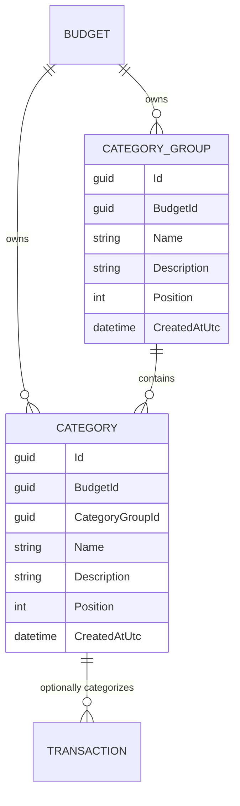

# Categories and Category Groups

## Table of Contents

- [Purpose](#purpose)
- [Key Entities](#key-entities)
- [Constraints](#constraints)
- [Business Rules & Invariants](#business-rules--invariants)
- [Workflows & State Transitions](#workflows--state-transitions)
- [Decision Trees](#decision-trees)
- [Integration Points](#integration-points)
- [Edge Cases & Known Gotchas](#edge-cases--known-gotchas)

## Purpose

A **Category** classifies a transaction, such as “Groceries” or “Utility Bills.” Every Category is
organized under exactly one user-defined **Category Group**, such as “Essential Obligations.” A
transaction may be uncategorized, but a Category itself may never be ungrouped. Both entities belong
to one budget (see [budgets.md](budgets.md)) and are manually managed by its owner.

## Key Entities

- **Category Group** — `Id`, `BudgetId`, `Name`, optional `Description`, `Position`, `CreatedAtUtc`.
- **Category** — `Id`, `BudgetId`, required `CategoryGroupId`, `Name`, optional `Description`,
  `Position`, `CreatedAtUtc`.



## Constraints

### MUST

- **Every Category must reference exactly one Category Group in the same budget.**
  - **Why**: An orphan or cross-budget Category would make the hierarchy invalid and could leak
    tenant data.
  - **Enforced in**: `Category.Create` requires a non-empty `CategoryGroupId`;
    `CreateCategoryHandler`/`PlaceCategoryHandler` resolve the destination through budget-filtered
    repositories; PostgreSQL enforces `(category_group_id, budget_id) → (id, budget_id)` with a
    non-nullable composite FK against the `category_groups` alternate key.

- **Names must be unique case-insensitively in their defined scope.**
  - Category Group names are unique per budget.
  - Category names are unique per budget **across all Category Groups**, not merely inside one group.
    Two groups therefore cannot each hold a "Groceries", and "Fees" cannot sit under both "Banking"
    and "Investments".
  - **Why**: the group a Category sits in is an arrangement its owner is free to change, not part of
    the Category's identity. `PATCH /api/categories/{id}/placement` moves a Category between groups
    at will, writes nothing to the Transactions that reference it, and never consults the name —
    `PlaceCategoryHandler` resolves the destination group and `CategoryRepository.PlaceAsync`
    reindexes positions, and neither touches the name index. Scoping uniqueness to the group would
    tie the legality of a name to that arrangement: two "Fees" would be legal while they sat apart
    and become a collision the moment their owner tidied one into the other's group, so a
    rearrangement meant to cost nothing could be refused for a reason that has nothing to do with
    rearranging. Budget-wide uniqueness makes a Category name mean exactly one thing inside the
    budget however the hierarchy is rearranged, which is the only scope under which the name stays a
    stable answer to what a past Transaction was filed as.
  - **Enforced in**: **database-owned.** Per-budget, case-insensitive name uniqueness and the index
    behind it are documented once, in [budgets.md](budgets.md#constraints); the scope stated here is
    that same rule's, not a second one. `CategoryRepository` and `CategoryGroupRepository` restate it
    only to turn the unique violation into "Category name must be unique." and "Category group name
    must be unique.", which is error quality rather than enforcement.
    `CategoryIntegrationTests.CategoryNames_AreCaseInsensitivelyUniqueAcrossGroups` pins the
    cross-group half specifically — a second group's "groceries" comes back 400 with an error on
    `Name` — and `CategoryGroupNames_AreCaseInsensitivelyUniquePerUser` pins the group half.

### MUST NOT

- **A Category Group must not be deleted while it contains Categories.**
  - **Why**: Deleting the heading out from under its Categories would either orphan them — which the
    hierarchy forbids — or silently take them and their transaction history with it. Making the user
    empty the group first keeps that decision explicit.
  - **Enforced in**: `DeleteCategoryGroupHandler` prechecks with `HasCategoriesAsync`, and the
    category-to-group FK is `Restrict` behind it.
  - **Error**: “Category group cannot be deleted because it has categories.”

- **A Category must not be deleted while a Transaction references it.**
  - **Why**: The classification is part of what a recorded movement means; dropping it would rewrite
    history the user cannot reconstruct. Recategorizing first is a decision only the user can make.
  - **Enforced in**: **database-owned, with the application supplying the sentence.**
    `TransactionConfiguration` maps `(category_id, budget_id) → categories` on `Restrict`, so
    PostgreSQL refuses to remove a Category any transaction names, whatever wrote the delete — that
    is the half that is *correct*. `CategoryRepository.DeleteAsync` catches that `23503` **by
    constraint name** and turns it into the sentence below, and `DeleteCategoryHandler` asks
    `HasTransactionsAsync` first to raise the same sentence before the write; both are *error
    quality*. The precheck is check-then-act, so its answer can be stale in either direction by the
    time the delete runs — the split and both directions are described in
    [transactions.md](transactions.md#edge-cases--known-gotchas). Per
    [ADR 0002](../decisions/0002-enforce-rules-at-the-lowest-capable-layer.md) neither half is
    redundant cover for the other: do not drop the constraint because the precheck passes first, and
    do not drop the catch because the precheck usually gets there first.
  - **Error**: “Category cannot be deleted because it has transactions.”

## Business Rules & Invariants

- **Rule**: `Name` is required, trimmed, and at most 200 characters for both entities. `Description`
  is optional, trimmed, stored as null when blank, and at most 500 characters.
- **Why**: The name is how the user tells things apart in every picker; blank or runaway names make
  the list unusable, and an empty description should not be a second way of saying "none".
- **Enforced in**: `CategoryGroup.Create` / `Category.Create` and their `Update` counterparts.
- **Example**: `"  Groceries  "` is stored as `"Groceries"`; a whitespace-only description is stored
  as null.
- **Source**: `[SOURCE: discussion — 2026-07-26]`

---

- **Rule**: `Position` is a zero-based, non-negative integer, and positions are **contiguous** within
  their scope. The two scopes differ:
  - a budget's Category Groups occupy exactly `0..n-1`, **budget-wide**;
  - the Categories inside one Category Group occupy exactly `0..m-1`, **within that group**.
- **Why**: Order is a deliberate personal arrangement, so it is persisted rather than derived.
  Contiguity is what makes a position mean anything: it is the only thing that turns "position 3"
  into "the fourth item", which is what a client sends when someone drops a row into the fourth slot.
  With gaps or duplicates in the stored list, that number stops naming the slot they aimed at. The
  two scopes differ because groups are arranged against each other while categories are arranged
  inside their heading.
- **Enforced in**: **domain-owned**, in `CategoryOrdering` (`Place`, `CloseGap`) and
  `CategoryGroupOrdering` (`MoveToPosition`, `CloseGap`), which reindex the whole affected list on
  every insertion, move and removal; `CategoryRepository.PlaceAsync` / `DeleteAsync` and
  `CategoryGroupRepository.MoveToPositionAsync` / `DeleteAsync` load the siblings and delegate rather
  than reimplementing the algorithm. The database holds only the non-negative half —
  `CK_categories_position` and `CK_category_groups_position` (`position >= 0`) — plus the ordering
  indexes described in [budgets.md](budgets.md#constraints), which are **not** unique.
  `CategoryIntegrationTests.Ordering_StaysContiguousAndZeroBasedAcrossASequenceOfMovesPlacementsAndDeletes`
  asserts the whole invariant as a set over the **stored rows**, read with raw SQL rather than
  through `/api/categories`, because both read services tie-break on `Id` —
  `CategoryReadService.GetAllAsync` orders by `categoryGroup.Position, category.Position,
  category.Id` and `CategoryGroupReadService.GetAllAsync` by `Position` then `Id`. A duplicate
  position is therefore deterministic: it never surfaces as flakiness, only as an item sitting
  quietly in the wrong place.

  **Why contiguity is not at the bottom.** It sits above the layer that could hold *some* of it, and
  under [ADR 0002](../decisions/0002-enforce-rules-at-the-lowest-capable-layer.md) a rule left above
  its lowest capable layer has to say why. Checking contiguity on a write means comparing the row
  against every one of its siblings, and the only PostgreSQL construct that can do that is a deferred
  constraint trigger — procedural logic in the database, which is exactly the boundary ADR 0002 draws
  around "lowest capable layer". So the rule stays in the domain, where it is a loop over an ordered
  list the unit suite can read and test. Do not read the principle as licence to push this down: a
  trigger here would be the thing the ADR names as its one worked example of what not to do.

  A **`DEFERRABLE INITIALLY DEFERRED` unique constraint on `(category_group_id, position)`** is the
  near-miss worth naming, because it catches duplicates declaratively and *is* a constraint rather
  than a trigger — the declarative boundary is satisfied, so the boundary is not what rules it out.
  Three other things do. First, the consequence it would prevent is cosmetic: both read services
  tie-break on `Id`, so a duplicate produces a deterministic-but-wrong order that the next reindex of
  that list repairs on its own — nothing like the tenancy breach or the bulk loss of recorded money
  the rules that do live at the bottom prevent — and the bottom layer's price is paid on every later
  change. Second, EF has no `DEFERRABLE` support, so it would be hand-written SQL inside the single
  baseline migration this repository regenerates by convention; grants can live outside migrations
  because provisioning owns them, but schema has nowhere else to go. Third, it buys half the
  invariant at best: `0, 1, 5` holds no duplicate, is equally broken to the person reading the list,
  and would stay legal.
- **Example**: the first group a budget receives is position `0`, and so is the first category in
  each group. Deleting the group at position `1` of four leaves the survivors at `0, 1, 2`, not
  `0, 2, 3`; moving a Category to another group closes the gap it left behind and renumbers the
  destination around where it landed, in one save.
- **Counterexample**: scoping Category positions per budget rather than per Category Group makes
  position `0` mean "first in this budget" instead of "first under this heading", so adding one
  category renumbers every other group's — the user's deliberate arrangement is destroyed by an
  edit they made somewhere else. Equally wrong, and far quieter: removing an item and leaving the
  survivors alone. Nothing rejects `0, 2, 3` — the check constraint reads each number in isolation
  and the ordering index is not unique — so the list still renders in the right order, and the defect
  surfaces only later, when the next drag lands a row one slot away from where it was dropped.
- **Source**: `[SOURCE: discussion — 2026-07-29]`

---

- **Rule**: Empty Category Groups are valid, and a new budget receives no default group.
- **Why**: A starter hierarchy would be someone else's idea of how this person's money is organized,
  and deleting the parts that do not fit is more work than creating the parts that do.
- **Enforced in**: `Budget.CreateDefault` creates the budget only; no handler seeds groups.
- **Example**: a brand-new user's `/categories` screen is empty until they add a group.
- **Source**: `[SOURCE: discussion — 2026-07-14]`

---

- **Rule**: There is no nesting below Category Group → Category, and no many-to-many membership.
- **Why**: Two levels are enough to produce a readable picker; deeper trees make the choice at entry
  time slower, which is the moment the model most needs to stay fast.
- **Enforced in**: `Category` has a single required `CategoryGroupId`; `CategoryGroup` has no parent.
- **Example**: "Essential Obligations → Groceries" is expressible; "Essential Obligations → Food →
  Groceries" is not.
- **Source**: `[SOURCE: discussion — 2026-07-14]`

## Workflows & State Transitions

Neither entity has lifecycle states — both have a create, read, rename and guarded-delete lifecycle
with nothing to transition between. The stateful behaviour is **ordering**, which is rewritten as a
set on every move:

- New Category Groups append to the budget's group order; new Categories append within their selected
  Category Group.
- `PATCH /api/category-groups/{id}/position` moves one group and reindexes all groups contiguously.
- `PATCH /api/categories/{id}/placement` reorders a Category within its current group or moves it to
  another group, reindexing both source and destination contiguously in one database save.
- Position-bounds validation runs in the same two ordering services that own contiguity; a position
  below zero or past the end of the destination siblings is a validation error, not a clamp. Where
  the invariant lives and why is in Business Rules & Invariants above.
- Reads use persisted position, with ID only as a deterministic tie-breaker for unexpected duplicate
  positions. They are not alphabetically resorted.

## Decision Trees

Placing a Category (`PlaceCategoryHandler`, `PATCH /api/categories/{id}/placement`):

```
IF the category id does not resolve in the ambient budget
  THEN 404 "Category was not found."
ELSE IF the destination group id does not resolve in the ambient budget
  THEN validation error "Category group was not found."   ← also the cross-budget answer
ELSE IF the requested position is negative or past the end of the destination siblings
  THEN validation error
ELSE IF the destination group is the category's current group
  THEN reorder within that group and reindex it contiguously
ELSE                                                      ← mutually exclusive with the above
  THEN reindex the source group to close the gap, insert into the destination,
       and reindex it too — one database save
```

## Integration Points

- **[Transactions](transactions.md)**: a transaction accepts an optional `CategoryId` and derives the
  Category Group from it rather than storing one.
- **[Budgets](budgets.md)**: both entities are stamped with and filtered by `BudgetId`, and a
  composite foreign key keeps a Category and its Category Group in the same budget at the schema
  level rather than only in the query filter. The rule and its reasoning are in
  [budgets.md](budgets.md#constraints).
- **Angular client**: `/app/categories` manages both levels with drag-and-drop. Transaction entry
  groups Category options under Category Group headings.

## Edge Cases & Known Gotchas

- **Names are live data, not snapshots.** Renaming a Category or Category Group, or moving a Category
  to another group, immediately changes how every historical Transaction displays, because the
  hierarchy is joined at read time. This is the intended behaviour, not a defect: the user reorganized
  their own labels, and past rows should follow. Nothing is written to the transactions themselves.
- Deleting an empty Category Group is allowed; deleting a non-empty one is not. Categories must be
  moved or deleted first.
- **A Category's deletability is read live, not marked on the row.** Deleting the last Transaction
  filed under a Category makes that Category deletable again, which is what turns “Category cannot be
  deleted because it has transactions.” into an instruction the user can follow rather than a dead
  end. The refusal is the foreign key's rather than the precheck's; [Constraints](#must-not) above
  states the split.
- Moving a Category does not touch Transactions, because a Transaction references the Category, not
  the Category Group.
- There are no spending limits or allocations, colors, icons, income/expense restrictions, reports, or
  nested Category Groups in this model.
- Positions in one budget are independent of every other budget's: reordering groups in one budget
  never renumbers another's, because the reindex only ever sees the ambient budget's rows.
