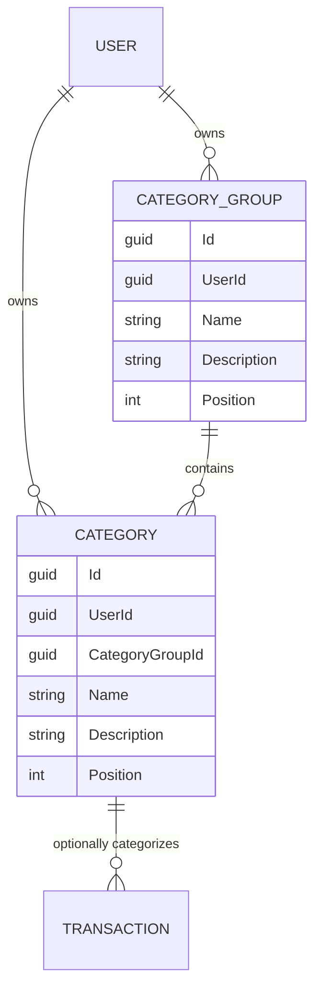

# Categories and Category Groups

## Table of Contents

- [Purpose](#purpose)
- [Key Entities](#key-entities)
- [Constraints](#constraints)
- [Business Rules & Invariants](#business-rules--invariants)
- [Ordering and Movement](#ordering-and-movement)
- [Integration Points](#integration-points)
- [Edge Cases & Known Gotchas](#edge-cases--known-gotchas)

## Purpose

A **Category** classifies a transaction, such as “Groceries” or “Utility Bills.” Every Category is
organized under exactly one user-defined **Category Group**, such as “Essential Obligations.” A
transaction may be uncategorized, but a Category itself may never be ungrouped. Both entities are
owned and manually managed by one user.

## Key Entities

- **Category Group** — `Id`, `UserId`, `Name`, optional `Description`, `Position`, `CreatedAtUtc`.
- **Category** — `Id`, `UserId`, required `CategoryGroupId`, `Name`, optional `Description`,
  `Position`, `CreatedAtUtc`.

## Constraints

### MUST

- **Every Category must reference exactly one Category Group owned by the same user.**
  - **Why**: An orphan or cross-owner Category would make the hierarchy invalid and could leak
    tenant data.
  - **Enforced in**: `Category.Create` requires a non-empty `CategoryGroupId`;
    `CreateCategoryHandler`/`PlaceCategoryHandler` resolve the destination through ownership-filtered
    repositories; PostgreSQL enforces `(category_group_id, user_id) → (id, user_id)` with a
    non-nullable composite FK.

- **Names must be unique case-insensitively in their defined scope.**
  - Category Group names are unique per user.
  - Category names are unique per user across all Category Groups, not merely inside one group.
  - **Enforced in**: case-insensitive PostgreSQL collation and unique indexes; repositories translate
    unique violations into validation errors.

### MUST NOT

- **A Category Group must not be deleted while it contains Categories.**
  - **Enforced in**: `DeleteCategoryGroupHandler` pre-check and restrictive category-to-group FK.
  - **Error**: “Category group cannot be deleted because it has categories.”

- **A Category must not be deleted while a Transaction references it.**
  - **Enforced in**: `DeleteCategoryHandler` pre-check and restrictive transaction-to-category FK.
  - **Error**: “Category cannot be deleted because it has transactions.”

## Business Rules & Invariants

- `Name` is required, trimmed, and at most 200 characters for both entities.
- `Description` is optional, trimmed, stored as null when blank, and at most 500 characters.
- `Position` is a zero-based, non-negative integer. Positions are user-wide for Category Groups and
  scoped to one Category Group for Categories.
- Empty Category Groups are valid. New users do not receive a default group; users create groups
  manually.
- Categories and Category Groups have full create, read, rename, and guarded-delete lifecycles.
- A Category can be moved to another Category Group through a typed placement operation.
- There is no nesting below Category Group → Category and no many-to-many membership.

## Ordering and Movement

- New Category Groups append to the user's group order.
- New Categories append within their selected Category Group.
- `PATCH /api/category-groups/{id}/position` moves one group and reindexes all groups contiguously.
- `PATCH /api/categories/{id}/placement` reorders a Category within its current group or moves it to
  another group, reindexing both source and destination contiguously in one database save.
- Contiguous reindexing and position-bounds validation are implemented once, in the domain services
  `CategoryOrdering` and `CategoryGroupOrdering`; persistence delegates to them.
- Reads use persisted position, with ID only as a deterministic tie-breaker for unexpected duplicate
  positions. They are not alphabetically resorted.

## Integration Points

- **[Transactions](transactions.md)**: a transaction accepts an optional `CategoryId`. Reads derive
  current Category and Category Group names, so renaming or moving a Category changes historical
  transaction display immediately.
- **[Users & Ownership](users-and-ownership.md)**: both entities are stamped with and filtered by
  `UserId`; the composite FK additionally protects same-owner membership in PostgreSQL.
- **Angular client**: `/categories` manages both levels with drag-and-drop. Transaction entry groups
  Category options under Category Group headings.

## Edge Cases & Known Gotchas

- Deleting an empty Category Group is allowed; deleting a non-empty one is not. Categories must be
  moved or deleted first.
- Moving a Category does not rewrite Transactions because Transactions reference the Category, not
  the Category Group.
- Category and Category Group names are live data, not snapshots on Transactions.
- There are no budgets, limits, colors, icons, income/expense restrictions, reports, or nested
  Category Groups in this model.

**Source:** `[SOURCE: discussion — 2026-07-14]`, implemented in the Category and Category Group
Domain/Application/Infrastructure slices.
