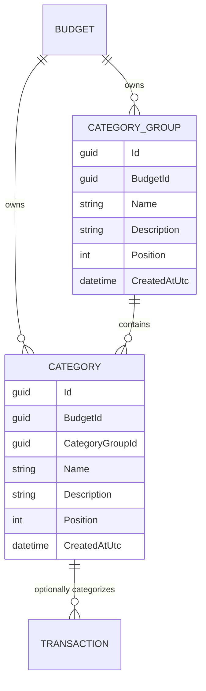

# Categories and Category Groups

## Table of Contents

- [Purpose](#purpose)
- [Key Entities](#key-entities)
- [Constraints](#constraints)
- [Business Rules & Invariants](#business-rules--invariants)
- [Workflows & State Transitions](#workflows--state-transitions)
- [Decision Trees](#decision-trees)
- [Integration Points](#integration-points)
- [Edge Cases & Known Gotchas](#edge-cases--known-gotchas)

## Purpose

A **Category** classifies a transaction, such as “Groceries” or “Utility Bills.” Every Category is
organized under exactly one user-defined **Category Group**, such as “Essential Obligations.” A
transaction may be uncategorized, but a Category itself may never be ungrouped. Both entities belong
to one budget (see [budgets.md](budgets.md)) and are manually managed by its owner.

## Key Entities

- **Category Group** — `Id`, `BudgetId`, `Name`, optional `Description`, `Position`, `CreatedAtUtc`.
- **Category** — `Id`, `BudgetId`, required `CategoryGroupId`, `Name`, optional `Description`,
  `Position`, `CreatedAtUtc`.



## Constraints

### MUST

- **Every Category must reference exactly one Category Group in the same budget.**
  - **Why**: An orphan or cross-budget Category would make the hierarchy invalid and could leak
    tenant data.
  - **Enforced in**: `Category.Create` requires a non-empty `CategoryGroupId`;
    `CreateCategoryHandler`/`PlaceCategoryHandler` resolve the destination through budget-filtered
    repositories; PostgreSQL enforces `(category_group_id, budget_id) → (id, budget_id)` with a
    non-nullable composite FK against the `category_groups` alternate key.

- **Names must be unique case-insensitively in their defined scope.**
  - Category Group names are unique per budget.
  - Category names are unique per budget across all Category Groups, not merely inside one group. Two
    groups therefore cannot each hold a "Groceries".
  - **Why**: A Category is chosen from one flat picker grouped by heading, so two Categories with the
    same name in different groups would be indistinguishable at the point of use.
  - Per-budget, case-insensitive name uniqueness and the mechanism that enforces it are documented
    once, in [budgets.md](budgets.md#constraints).

### MUST NOT

- **A Category Group must not be deleted while it contains Categories.**
  - **Why**: Deleting the heading out from under its Categories would either orphan them — which the
    hierarchy forbids — or silently take them and their transaction history with it. Making the user
    empty the group first keeps that decision explicit.
  - **Enforced in**: `DeleteCategoryGroupHandler` prechecks with `HasCategoriesAsync`, and the
    category-to-group FK is `Restrict` behind it.
  - **Error**: “Category group cannot be deleted because it has categories.”

- **A Category must not be deleted while a Transaction references it.**
  - **Why**: The classification is part of what a recorded movement means; dropping it would rewrite
    history the user cannot reconstruct. Recategorizing first is a decision only the user can make.
  - **Enforced in**: `DeleteCategoryHandler` prechecks with `HasTransactionsAsync`, and the
    transaction-to-category FK is `Restrict` behind it.
  - **Error**: “Category cannot be deleted because it has transactions.”

## Business Rules & Invariants

- **Rule**: `Name` is required, trimmed, and at most 200 characters for both entities. `Description`
  is optional, trimmed, stored as null when blank, and at most 500 characters.
- **Why**: The name is how the user tells things apart in every picker; blank or runaway names make
  the list unusable, and an empty description should not be a second way of saying "none".
- **Enforced in**: `CategoryGroup.Create` / `Category.Create` and their `Update` counterparts.
- **Example**: `"  Groceries  "` is stored as `"Groceries"`; a whitespace-only description is stored
  as null.
- **Source**: `[SOURCE: code-audit — unconfirmed]`

---

- **Rule**: `Position` is a zero-based, non-negative integer. Positions are budget-wide for Category
  Groups and scoped to one Category Group for Categories.
- **Why**: Order is a deliberate personal arrangement, so it is persisted rather than derived. The
  two scopes differ because groups are arranged against each other while categories are arranged
  inside their heading.
- **Enforced in**: the domain ordering services `CategoryGroupOrdering` and `CategoryOrdering`, with
  `CK_category_groups_position` and `CK_categories_position` (`position >= 0`) as the database
  backstop. Ordering scope is indexed per [budgets.md](budgets.md#constraints).
- **Example**: the first group a budget receives is position `0`; the first category in each group is
  also position `0`.
- **Source**: `[SOURCE: code-audit — unconfirmed]`

---

- **Rule**: Empty Category Groups are valid, and a new budget receives no default group.
- **Why**: A starter hierarchy would be someone else's idea of how this person's money is organized,
  and deleting the parts that do not fit is more work than creating the parts that do.
- **Enforced in**: `Budget.CreateDefault` creates the budget only; no handler seeds groups.
- **Example**: a brand-new user's `/categories` screen is empty until they add a group.
- **Source**: `[SOURCE: discussion — 2026-07-14]`

---

- **Rule**: There is no nesting below Category Group → Category, and no many-to-many membership.
- **Why**: Two levels are enough to produce a readable picker; deeper trees make the choice at entry
  time slower, which is the moment the model most needs to stay fast.
- **Enforced in**: `Category` has a single required `CategoryGroupId`; `CategoryGroup` has no parent.
- **Example**: "Essential Obligations → Groceries" is expressible; "Essential Obligations → Food →
  Groceries" is not.
- **Source**: `[SOURCE: discussion — 2026-07-14]`

## Workflows & State Transitions

Neither entity has lifecycle states — both have a create, read, rename and guarded-delete lifecycle
with nothing to transition between. The stateful behaviour is **ordering**, which is rewritten as a
set on every move:

- New Category Groups append to the budget's group order; new Categories append within their selected
  Category Group.
- `PATCH /api/category-groups/{id}/position` moves one group and reindexes all groups contiguously.
- `PATCH /api/categories/{id}/placement` reorders a Category within its current group or moves it to
  another group, reindexing both source and destination contiguously in one database save.
- Contiguous reindexing and position-bounds validation are implemented once, in `CategoryOrdering`
  and `CategoryGroupOrdering`; persistence delegates to them.
- Reads use persisted position, with ID only as a deterministic tie-breaker for unexpected duplicate
  positions. They are not alphabetically resorted.

## Decision Trees

Placing a Category (`PlaceCategoryHandler`, `PATCH /api/categories/{id}/placement`):

```
IF the category id does not resolve in the ambient budget
  THEN 404 "Category was not found."
ELSE IF the destination group id does not resolve in the ambient budget
  THEN validation error "Category group was not found."   ← also the cross-budget answer
ELSE IF the requested position is negative or past the end of the destination siblings
  THEN validation error
ELSE IF the destination group is the category's current group
  THEN reorder within that group and reindex it contiguously
ELSE                                                      ← mutually exclusive with the above
  THEN reindex the source group to close the gap, insert into the destination,
       and reindex it too — one database save
```

## Integration Points

- **[Transactions](transactions.md)**: a transaction accepts an optional `CategoryId` and derives the
  Category Group from it rather than storing one.
- **[Budgets](budgets.md)**: both entities are stamped with and filtered by `BudgetId`, and a
  composite foreign key keeps a Category and its Category Group in the same budget at the schema
  level rather than only in the query filter. The rule and its reasoning are in
  [budgets.md](budgets.md#constraints).
- **Angular client**: `/app/categories` manages both levels with drag-and-drop. Transaction entry
  groups Category options under Category Group headings.

## Edge Cases & Known Gotchas

- **Names are live data, not snapshots.** Renaming a Category or Category Group, or moving a Category
  to another group, immediately changes how every historical Transaction displays, because the
  hierarchy is joined at read time. This is the intended behaviour, not a defect: the user reorganized
  their own labels, and past rows should follow. Nothing is written to the transactions themselves.
- Deleting an empty Category Group is allowed; deleting a non-empty one is not. Categories must be
  moved or deleted first.
- Moving a Category does not touch Transactions, because a Transaction references the Category, not
  the Category Group.
- There are no spending limits or allocations, colors, icons, income/expense restrictions, reports, or
  nested Category Groups in this model.
- Positions in one budget are independent of every other budget's: reordering groups in one budget
  never renumbers another's, because the reindex only ever sees the ambient budget's rows.
