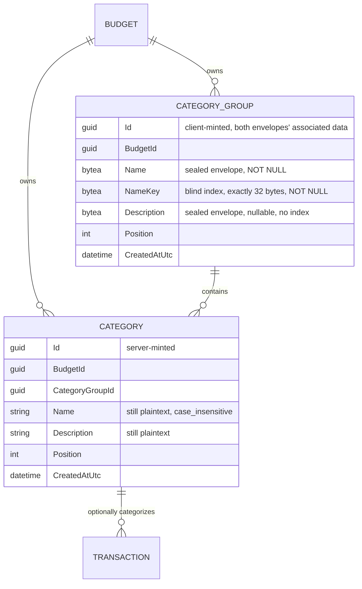

# Categories and Category Groups

## Table of Contents

- [Purpose](#purpose)
- [Key Entities](#key-entities)
- [Constraints](#constraints)
- [Business Rules & Invariants](#business-rules--invariants)
- [Workflows & State Transitions](#workflows--state-transitions)
- [Decision Trees](#decision-trees)
- [Integration Points](#integration-points)
- [Edge Cases & Known Gotchas](#edge-cases--known-gotchas)

## Purpose

A **Category** classifies a transaction, such as “Groceries” or “Utility Bills.” Every Category is
organized under exactly one user-defined **Category Group**, such as “Essential Obligations.” A
transaction may be uncategorized, but a Category itself may never be ungrouped. Both entities belong
to one budget (see [budgets.md](budgets.md)) and are manually managed by its owner.

**The two levels are in different states, and almost every difference in this chapter follows from
it.** A Category Group's name and note are **sealed**: `category_groups.name` is an AEAD envelope with
a blind index beside it, and `category_groups.description` is an envelope with nothing beside it — the
first sealed free-text column in the product. A Category's name and description are still plaintext,
still collated case-insensitively, still trimmed and measured by this server. So one entity has
surrendered every server-side rule about its text and the other has kept all of them, and a rule
stated here about one of them is not a rule about the other. That asymmetry lasts until
`categories.name` and `categories.description` are sealed too.

## Key Entities

- **Category Group** — `Id`, `BudgetId`, `Name`, `NameKey`, optional `Description`, `Position`,
  `CreatedAtUtc`.
  - **`Name` is a sealed narrative envelope and not text.** The property is typed `NarrativeField`
    and the column is `bytea NOT NULL`. That type has no constructor, factory or conversion taking a
    `string`, so writing plaintext into this column does not compile — see
    [ciphertext-envelope.md](ciphertext-envelope.md). What the type forecloses on *this* table is a
    particular disclosure: a group name is the coarsest label in a person's ledger — "Medical",
    "Legal", "Debt" — so a handful of rows describe a life with no amount beside them.
  - **`NameKey` is the blind index over the same name** — `ReadOnlyMemory<byte>`, exactly 32 bytes
    (`HMAC-SHA-256` under the account's index key, computed in the browser), on its own
    `bytea NOT NULL` column. It is what the uniqueness rule is enforced over, and the reading it
    carries is the accounts one rather than the payees one: two groups under one name are a confusion
    a person can see and fix, not a deduplication mechanism the domain rests on.
  - **Both are written from one `IndexedName` parameter and never separately.** `CategoryGroup.Create`
    and `CategoryGroup.Update` each take one, and neither offers a spelling for half a name.
  - **`Description` is a sealed narrative envelope too, and it is the first sealed free-text column in
    the product.** Typed `NarrativeField?` against a **nullable** `bytea`, capped at
    `NarrativeFieldLimits.DescriptionBytes` rather than the name class's `NameBytes`, and carrying
    **no blind index, ever** — a description is not looked up, is not unique and is not a name. Its
    own rules are below; they are not the name's with a nullability note attached.
  - **`Id` is supplied to the factory, never minted inside it.** `Guid.CreateVersion7` has left
    `CategoryGroup.cs` entirely; the identifier is the associated data the client sealed **both**
    narrative members against.
- **Category** — `Id`, `BudgetId`, required `CategoryGroupId`, `Name`, optional `Description`,
  `Position`, `CreatedAtUtc`. **Both of its narrative columns still hold plaintext**, so not one of
  the five bullets above is true of them: `Category.Create` mints its own identifier, `categories.name`
  carries the `case_insensitive` collation and a unique index over the column itself, and the server
  still trims, measures and blanks the text. They are the next pair to be sealed.



## Constraints

### MUST

- **Every Category must reference exactly one Category Group in the same budget.**
  - **Why**: An orphan or cross-budget Category would make the hierarchy invalid and could leak
    tenant data.
  - **Enforced in**: **database-owned.** PostgreSQL maps `(category_group_id, budget_id) → (id,
    budget_id)` as a non-nullable composite foreign key against the `category_groups` alternate key,
    so both halves — that there is a group, and that it is this budget's — hold whatever code path
    wrote the row. Above it, `Category.Create` requires a non-empty `CategoryGroupId` and
    `CreateCategoryHandler` / `PlaceCategoryHandler` resolve the destination through budget-filtered
    repositories, which is what turns another budget's group id into "Category group was not found."
    instead of a constraint violation — error quality rather than enforcement.

- **A category group's name reaches this server sealed, with its blind index beside it, and its
  description reaches it sealed with nothing beside it.** `category_groups.name` is the **fourth**
  column in the product to hold ciphertext and the **third** to carry a blind index;
  `category_groups.description` is the **fifth**, and the first sealed **free-text** column anywhere
  in the product.
  - **Why**: both are narrative text, which is the one thing this product is built not to be able to
    read. The name had to keep its uniqueness rather than surrender it — one group name per budget is
    how a person tells their headings apart — and a blind index is the only construction that lets a
    server holding no plaintext still refuse a duplicate. The description gets **no** index for the
    opposite reason: an index answers "which row holds this value", and a description is never looked
    up, never unique and never a name, so one would publish a deterministic per-account fingerprint of
    somebody's free text with nothing on the other side asking for it. That is a decision, not a gap
    to close in a later slice.
  - **Enforced in**: `CategoryGroup.Name` is typed `NarrativeField`, `CategoryGroup.NameKey` is a
    `ReadOnlyMemory<byte>` and both are assigned from one `IndexedName`, which refuses either half on
    its own; `CategoryGroup.Description` is typed `NarrativeField?` and reaches the entity through
    `NarrativeField.SealedOrAbsent`, the one factory that reads "nothing was supplied" as a value
    rather than as a malformed envelope. `CategoryGroupConfiguration` maps three `bytea` columns
    through value converters with **content** comparers over the bytes, and — because the name is
    `NOT NULL` and the description is not — through **two** converters of different nullability, which
    a reviewer will propose unifying and which the file argues against in place. What holds those
    comparers is this table's own change-tracking class and nothing product-wide — the other three
    sealed tables have no equivalent, and the snapshot arm is held by review on all four; see
    [Edge Cases](#edge-cases--known-gotchas). The table carries **five** `CHECK` constraints over its
    sealed and keyed columns — four narrative, one over the
    blind index — each rendered from the constant that owns its number rather than from a literal:
    `CK_category_groups_name_length` and
    `CK_category_groups_description_length` bound their envelopes between
    `CiphertextEnvelope.MinimumLength` and the **two different caps**
    `NarrativeFieldLimits.NameBytes` and `NarrativeFieldLimits.DescriptionBytes`;
    `CK_category_groups_name_version` and `CK_category_groups_description_version` require the leading
    version byte through `substring`; and `CK_category_groups_name_key_length` is an **equality** on
    32 bytes rather than a band, because `HMAC-SHA-256` has one output width and a ceiling would admit
    a short digest silently. The two `NOT NULL` name columns say a **row** cannot be half a name;
    `IndexedName.Of` says a **call** cannot be. Neither restates the other for error quality — one
    refuses a statement reaching the database, the other refuses a caller who meant to write both and
    wrote one.

- **Category Group names are unique per budget, enforced over the blind index.**
  `IX_category_groups_budget_id_name_key` is unique over `(budget_id, name_key)`.
  - **Why**: the rule did not change and the mechanism did not change — a unique B-tree index, scoped
    per budget, reported as `23505` under a name the repository matches. What changed is the
    **column**. Uniqueness over `name` would now enforce nothing at all: every seal draws a fresh
    nonce, so two rows holding one name hold different bytes. The blind index survives that, being
    deterministic under the account's index key, so equality of names comes back as equality of
    digests.
  - **Enforced in**: the unique index declared in `CategoryGroupConfiguration` and pinned there as
    `NameIndexName`, which `CategoryGroupRepository` matches `PostgresException.ConstraintName`
    against on both `AddAsync` and `UpdateAsync` to raise "Category group name must be unique."
    The C# constant is still called `NameIndexName` while its **value** ends in `_name_key`: the index
    is for finding the row a name is already taken by, and the schema follows EF's own convention
    rather than carrying a hand-pinned exception to it. `UseCollation("case_insensitive")` left the
    column **by force** — `bytea` is not a collatable type — and what it was doing did not disappear
    but **moved**: see the case-folding rule under
    [Business Rules](#business-rules--invariants). Both verbs answer **400** here, and a payee create
    answers 409 on the same shape of index; the difference is who chose the name, and the argument is
    in the [decision log](_decision-log.md).

- **Category names must be unique case-insensitively per budget, across all Category Groups**, not
  merely inside one group. Two groups therefore cannot each hold a "Groceries", and "Fees" cannot sit
  under both "Banking" and "Investments".
  - **Why**: the group a Category sits in is an arrangement its owner is free to change, not part of
    the Category's identity. `PATCH /api/categories/{id}/placement` moves a Category between groups
    at will, writes nothing to the Transactions that reference it, and never consults the name —
    `PlaceCategoryHandler` resolves the destination group and `CategoryRepository.PlaceAsync`
    reindexes positions, and neither touches the name index. Scoping uniqueness to the group would
    tie the legality of a name to that arrangement: two "Fees" would be legal while they sat apart
    and become a collision the moment their owner tidied one into the other's group, so a
    rearrangement meant to cost nothing could be refused for a reason that has nothing to do with
    rearranging. Budget-wide uniqueness makes a Category name mean exactly one thing inside the
    budget however the hierarchy is rearranged, which is the only scope under which the name stays a
    stable answer to what a past Transaction was filed as.
  - **Enforced in**: **database-owned**, and this is the half of the old shared rule that survives
    unchanged. `categories.name` still carries the `case_insensitive` collation and
    `IX_categories_budget_id_name` is still unique over `(budget_id, name)`, so PostgreSQL folds the
    case itself; the scope is stated once, in [budgets.md](budgets.md#constraints).
    `CategoryRepository` restates it only to turn the unique violation into "Category name must be
    unique.", which is error quality rather than enforcement.
    `CategoryIntegrationTests.CategoryNames_AreCaseInsensitivelyUniqueAcrossGroups` pins the
    cross-group half specifically — a second group's "groceries" comes back 400 with an error on
    `Name`. **Its group-level counterpart is gone with no replacement**: the rule it named does not
    exist on this side any more, because nothing here can fold a group name. See the case-folding rule
    under [Business Rules](#business-rules--invariants).

### MUST NOT

- **A Category Group must not be deleted while it contains Categories.**
  - **Why**: Deleting the heading out from under its Categories would either orphan them — which the
    hierarchy forbids — or silently take them and their transaction history with it. Making the user
    empty the group first keeps that decision explicit.
  - **Enforced in**: **database-owned, with the application supplying the sentence** — the same split
    as the Category rule below, and for the same reasons. `CategoryConfiguration` maps
    `(category_group_id, budget_id) → category_groups` on `Restrict`, so PostgreSQL refuses to remove
    a group any Category names, whatever wrote the delete — that is the half that is *correct*.
    `CategoryGroupRepository.DeleteAsync` catches that `23503` **by constraint name**
    (`CategoryConfiguration.CategoryGroupForeignKeyName`), detaches the rejected entity so its failed
    state cannot leak into a later save, and turns it into the sentence below;
    `DeleteCategoryGroupHandler` asks `HasCategoriesAsync` first to raise the same sentence before
    the write. Both are *error quality*. The precheck is check-then-act, so its answer can be stale
    in either direction by the time the delete runs, exactly as
    [transactions.md](transactions.md#edge-cases--known-gotchas) describes for the account and
    category guards. Per [ADR 0002](../decisions/0002-enforce-rules-at-the-lowest-capable-layer.md)
    neither half is redundant cover for the other.
  - **Error**: “Category group cannot be deleted because it has categories.”

- **A Category must not be deleted while a Transaction references it.**
  - **Why**: The classification is part of what a recorded movement means; dropping it would rewrite
    history the user cannot reconstruct. Recategorizing first is a decision only the user can make.
  - **Enforced in**: **database-owned, with the application supplying the sentence.**
    `TransactionConfiguration` maps `(category_id, budget_id) → categories` on `Restrict`, so
    PostgreSQL refuses to remove a Category any transaction names, whatever wrote the delete — that
    is the half that is *correct*. `CategoryRepository.DeleteAsync` catches that `23503` **by
    constraint name** and turns it into the sentence below, and `DeleteCategoryHandler` asks
    `HasTransactionsAsync` first to raise the same sentence before the write; both are *error
    quality*. The precheck is check-then-act, so its answer can be stale in either direction by the
    time the delete runs — the split and both directions are described in
    [transactions.md](transactions.md#edge-cases--known-gotchas). Per
    [ADR 0002](../decisions/0002-enforce-rules-at-the-lowest-capable-layer.md) neither half is
    redundant cover for the other: do not drop the constraint because the precheck passes first, and
    do not drop the catch because the precheck usually gets there first.
  - **Error**: “Category cannot be deleted because it has transactions.”
  - **Erasure does not bypass this, and does not delete categories at all.** It empties the budget's
    transactions and then deletes the *user*; the categories leave by the cascade descending from
    that row, with nothing left referencing them — see [erasure.md](erasure.md).

- **The server MUST NOT be given a rule about a Category Group's name or description text** — not a
  minimum length, not a blankness check, not a trim, not a character cap, and not a case-folding rule.
  The same prohibition does **not** reach `Category`, whose columns still hold text.
  - **Why**: every one of them is a question about plaintext this deployment has never seen. A reader
    who finds the gap in `CategoryGroup.ValidateOrThrow` and restores a check can only restore it
    against the **envelope** — measuring bytes and calling them characters, or refusing a 29-byte
    envelope that is the correct sealing of an empty string. A reader who notices the collation is
    gone and reaches for a folding rule has nothing to fold. Both are wrong answers wearing the shape
    of the right one, and they are argued in full under
    [Business Rules](#business-rules--invariants), because these are capabilities that **moved**
    rather than rules quietly dropped.
  - **Enforced in**: the absence of any name or description rule in `CategoryGroup.ValidateOrThrow`,
    which now judges the identifier, the tenancy and the position and nothing else, and the byte bands
    under MUST above — the only lengths anything on this side can measure.

- **`NormalizeDescription` MUST NOT return, in any form.** It mapped a whitespace-only description
  onto `null`, and that fold is the one thing this column may never do again.
  - **Why**: an empty note seals to exactly `CiphertextEnvelope.MinimumLength` bytes — AES-GCM
    ciphertext is the length of its plaintext — while a note nobody wrote is `NULL`. Both are legal
    rows, the schema distinguishes them, and they mean different things: *cleared* and *never filled*.
    Folding them together destroys a distinction the storage layer is capable of keeping.
  - **Enforced in**: the parameter's type, which is what makes the removal forced rather than chosen —
    there is no `string` here to normalise. The wire edge holds the other half: the two handlers test
    `command.Description is null` and **never** `string.IsNullOrEmpty` or
    `string.IsNullOrWhiteSpace`, because the decoder underneath refuses `null` and `""` identically,
    so the distinction cannot live down there. Either forgiving spelling folds a malformed `""` into
    "absent" and writes `NULL` where a 400 was owed — a legal row, a 201 or a 204 on the wire, and the
    note the person typed silently gone.

## Business Rules & Invariants

- **Rule**: On a **Category**, `Name` is required, trimmed, and at most 200 characters, and
  `Description` is optional, trimmed, stored as null when blank, and at most 500 characters. **None of
  that is true of a Category Group any more**, and the next three rules are why.
- **Why**: the name is how the user tells things apart in every picker; blank or runaway names make
  the list unusable, and an empty description should not be a second way of saying "none". Those
  reasons never stopped applying — what stopped is this server's ability to act on them, and only for
  the entity whose columns moved.
- **Enforced in**: `Category.Create` and `Category.Update`, through the shared validator they both
  run. `CategoryGroup.Create` and `CategoryGroup.Update` no longer share it and no longer carry any
  such rule.
- **Example**: a Category named `"  Groceries  "` is stored as `"Groceries"`, and a whitespace-only
  Category description is stored as null. Send the same two values to a group and neither happens: the
  server receives envelopes, and a whitespace-only note is a note somebody wrote.
- **Source**: `[SOURCE: discussion]`

---

- **Rule**: **The server can no longer refuse a blank or a runaway Category Group name, and it can no
  longer refuse an over-long Category Group description either.** "A name is not just spaces", the
  200-character ceiling on the name and the 500-character ceiling on the description are all the
  client's now, applied before it seals.
- **Why**: these are **capabilities that moved**, not rules that were quietly dropped, and the
  distinction is why they are written down rather than left as a gap in a validator. What arrives is
  an AEAD envelope over text this server has never seen and holds no key for; "is this nothing but
  spaces?" and "is it longer than a label?" are questions about plaintext. A reader who finds the
  absence and restores a check can only restore it against the **envelope** — measuring bytes and
  calling them characters, or refusing a 29-byte envelope that is the correct sealing of an empty
  string. Both are wrong answers wearing the shape of the right one.
- **Enforced in**: what replaced each half is a byte rule and nothing more. The trims and the
  blankness check are replaced by **nothing on this side**. The two character ceilings are replaced by
  `NarrativeFieldLimits.NameBytes` and `NarrativeFieldLimits.DescriptionBytes` — caps on **stored
  envelope bytes**, applied by `IndexedName.Of` and `NarrativeField.SealedOrAbsent` and restated as
  the upper bounds of `CK_category_groups_name_length` and `CK_category_groups_description_length`.
  **The two caps are field *classes* and not two guesses at one number**: a helper that sealed a
  description under the name's ceiling would refuse values this column is meant to accept, and one
  that sealed a name under the description's would widen a column nobody asked to widen.
  `CiphertextEnvelope.MinimumLength` is the floor of both checks and is **not** the blank-name rule
  restored: an envelope over an empty string satisfies it exactly.
- **Example**: a client that seals `"   "` as a group name gets a `201`. The row is well-formed, the
  constraints are satisfied, and nothing in this deployment can tell that value from `"Essentials"`.
- **Counterexample**: adding a floor above the format's own to approximate "not blank". It refuses
  short real names, admits long blank ones, and is a rule about ciphertext claiming to be a rule about
  text.
- **Source**: `[SOURCE: discussion]`

---

- **Rule**: **Case folding on group names left this server and did not disappear.** "Essentials" and
  "essentials" are still one group — if, and only if, the client folds the text the same way before it
  computes the blind index.
- **Why**: the old guarantee was the `case_insensitive` collation on `category_groups.name`, and that
  collation's departure was **forced rather than chosen** — `case_insensitive` is a text collation and
  `bytea` is not a collatable type. What replaced it is the normalization
  [account-keys.md](account-keys.md#the-normalization-a-name-is-indexed-through) defines — trim, NFKC,
  **full** case fold, UTF-8 — applied in the browser before the `HMAC`. The database still guarantees
  two identical index values cannot coexist; it no longer guarantees two spellings of one name produce
  identical index values, and that half is now the client's to get right.
- **Enforced in**: the client, and by nothing beneath it. Nothing on this side folds anything and
  nothing on this side needs to: the write stores whatever pair it was handed, and only a *different*
  index value can collide. The integration case that asserted the server folded a group's name went
  with the mechanism and has **no replacement and no possible one** — there is nothing below the
  browser that could take its place, because the server sees a MAC and never a name, exactly as
  happened to the payee case that asserted case-insensitive reuse. `categories.name`
  is the counterexample sitting one table away: it still folds, in PostgreSQL, because it is still
  text.
- **Counterexample**: a client that folds with the host's `toLowerCase` instead of the shipped fold
  table. It agrees with a correct client on almost every name a person types and disagrees on the
  handful where the difference decides a match, and a blind index **cannot be recomputed** afterwards
  — the plaintext behind it is encrypted.
- **Source**: `[SOURCE: discussion]`

---

- **Rule**: **"Cleared" and "never filled" are two different rows, and they must stay two.** An empty
  note is an envelope of exactly `CiphertextEnvelope.MinimumLength` bytes; a note nobody wrote is
  `NULL`. **And a lost description is invisible where a lost name is `23502`.**
- **Why**: the second sentence is the hazard this column adds to the product. **A nullable sealed
  column is not new — `budgets.name` is one, with the same converter shape and the same
  NULL-tolerant `CHECK`s — but it is reached by no route**, so nothing before this ever had to decide
  what an absent member on the wire means, and nothing before this could have a write path that
  dropped one. `description` is nullable, so a write path
  that decoded a description and then forgot to assign it writes `NULL`: a legal row, violating no
  constraint, byte-identical to one belonging to somebody who deliberately filed no note. On the
  `NOT NULL` name the same omission is refused by the database. **Nothing in the schema can tell a bug
  from an operation on this column** — which is exactly why the two states have to be kept apart
  everywhere else, since the only evidence that a note survived a round trip is the note itself coming
  back.
- **Enforced in**: four layers keeping one distinction, and each could collapse it on its own.
  `CategoryGroup.Description` is **assigned and never normalised** — `NormalizeDescription` is deleted
  and cannot return, per [MUST NOT](#must-not) above. Both handlers test `command.Description is null`
  and nothing more forgiving. `CategoryGroupDto.Description` stays `string?` and must never gain a
  `?? string.Empty`: `TransactionDto` coerces a null description because a screen has to render
  something, but here the member is an envelope, `""` is not a legal one, and a client cannot tell the
  coercion from a value it is expected to decode. And **both wire shapes refuse a member they do not
  declare**, which is the one exposure the three above cannot reach, because it arrives on a path
  named by no member of either shape — the rule below. What holds the *invisible* half is neither a
  constraint nor a type but a **test shape**: every write path is covered by a case that reads a
  **non-null** description back, never one asserting the member is merely present or that the response
  was a 204.
- **Example**: a person clears the note on a group. The row keeps a 29-byte envelope, which is what
  they wrote — nothing. A person who never filed one keeps `NULL`. Both render as no note and the
  rows are not the same row.
- **Counterexample**: a `PUT` handler that decodes the description into a local and then calls
  `Update` with the name alone. It compiles, it answers 204, every constraint is satisfied, and the
  note is gone.
- **Source**: `[SOURCE: discussion]`

---

- **Rule**: **Both category-group write shapes refuse a member they do not declare**, and answer
  **400**. `CreateCategoryGroupCommand` and `CategoryGroupEndpoints.UpdateCategoryGroupRequest` carry
  `[JsonUnmappedMemberHandling(JsonUnmappedMemberHandling.Disallow)]`; the API's shared JSON options
  carry no such setting, and no sibling shape gets the attribute for company.
- **Why**: these two bind a **nullable narrative column**, where an unmapped member is
  indistinguishable from an absent one. Measured under `JsonSerializerDefaults.Web` with the options
  `Api/Program.cs` registers — whose `UnmappedMemberHandling` is the default `Skip` — a body sending
  `descriptionn` and a body sending no description at all both leave `Description` null. On the
  `POST` that is a **201 carrying a note that never arrived**; on the `PUT`, which replaces, it is a
  **204 and the note the group held is gone**. The second is the destructive half and the harder one
  to see: clearing a note is a real operation this route performs, so no status, no constraint and no
  later read separates "the caller asked" from "the caller typed the member wrong". It is the same
  hazard the null-versus-`""` care above exists to close, reached by a path outside every member
  either shape names.
  - **This is not the transaction shapes' argument, and the two must not be folded together.** There
    the attribute answers wire **drift**: `CreateTransactionCommand` and
    `TransactionEndpoints.UpdateTransactionRequest` retired `payeeName`, a member a released client
    still sends, and refusing it visibly beat dropping it in silence. Nothing here is retired — every
    member is new — so a shape that binds no nullable narrative member earns nothing from either
    argument.
  - **What it costs**: any client sending an unknown member to these two routes now gets a 400,
    dressed as `application/problem+json` by this product's pipeline and naming no field; the
    unmappable member reaches the server log and not the response. Nothing sends to them today —
    `category-groups-api.service.ts` still posts a plaintext name, so that screen already cannot
    write.
- **Enforced in**: the attribute on those two declarations, and **per type is the whole discipline**.
  `PostCategoryGroup_WithAnUnknownMember_IsRefusedAndWritesNothing` and
  `PutCategoryGroup_WithAnUnknownMember_IsRefusedAndLeavesTheNoteStanding` hold one shape each — the
  second is owed separately, because an attribute on a record in `Application` says nothing about a
  record declared in `Api` — and each misspells the member whose loss is **invisible**, never a
  required one, which `System.Text.Json` would refuse on its own. Beside them
  `PatchCategoryGroupPosition_WithAnUnknownMember_StillIgnoresIt` is the **negative control** over
  `MoveCategoryGroupRequest`, declared in the same file on the same route group and deliberately
  bare: without it a global `UnmappedMemberHandling` in `Api/Program.cs` satisfies both of its
  neighbours while silently changing the contract of every route in the product.
- **Example**: a `PUT` that renames a group and misspells `description` is refused, and both the name
  and the note are exactly as they were. A `PATCH` to the position route carrying an extra member is
  still a 204, and the position it did declare takes effect.
- **Counterexample**: moving the setting into `Api/Program.cs` to "apply it everywhere". Whether a
  shape refuses what it was not asked for is a contract decision each shape makes for itself, and the
  shapes that bind no nullable narrative member have not made it.
- **Source**: `[SOURCE: discussion]`

---

- **Rule**: **A group's name and its blind index move together or not at all**, and on this table the
  `UPDATE` grant is where that is hardest to see.
- **Why**: such a column is a pair — the ciphertext nobody here can read, and the keyed digest that is
  the only way a row holding a given name can be found or refused as a duplicate. A row carrying new
  ciphertext under the previous name's index satisfies every constraint, reads back fine, and leaves
  `IX_category_groups_budget_id_name_key` guarding a name the row no longer holds while the name it
  *does* hold stays free for a second group to take. Nothing on this side can notice — recomputing a
  digest needs the account's index key, which lives in a browser.
- **Enforced in**: three places holding three different moments, exactly as on
  [accounts](accounts.md#business-rules--invariants) and
  [payees](payees.md#business-rules--invariants).
  `CategoryGroup.Create` and `CategoryGroup.Update` take an `IndexedName` and offer no spelling for
  half a name, so a **call** cannot be half; the two `NOT NULL` columns mean a **row** cannot be; and
  the role's grant is `UPDATE (name, name_key, description, position)`, so the **statement** is
  permitted whole.
  - **What is new here, and it makes a half grant harder to see than on accounts or payees**: this
    table's update writes **three** columns the client sealed or keyed — the narrative pair `name`
    and `description`, plus the blind index `name_key`, which is **not** narrative: `NarrativeField`
    types exactly `name` and `description`, and `KeyMaterialSecrecyTests` gives the index a kind of
    its own. EF names only the ones that changed. On those two tables every rename emits a statement
    naming both name columns, so a half grant refuses the whole of it with `42501` on the first
    rename anybody exercises. Here a rename that leaves the description alone emits two columns and
    **succeeds** under a grant missing `description`. Measured on `postgres:17.10` under
    `GRANT UPDATE (name, name_key, position)`: name plus index is `UPDATE 1`, name plus index plus
    description is `42501`, `set description = null` alone is `42501`, and `set position = 3` is
    `UPDATE 1`.
  - **So two different cases guard two different defects, and they must not be collapsed into one
    sentence.** A route case that changes a **non-empty description** is what catches the broken
    grant — the `PUT` then emits three columns and the statement is refused, whether or not anything
    reads the description afterwards. A route case that **reads that description back** is what
    catches a handler silently dropping it. Drop the read-back and the grant is still guarded; drop
    the read-back *and* let the handler drop the description, and the case passes. The raw control
    beside them writes all **four** granted columns in one statement, because `position` shares the
    list and a three-column control cannot tell a four-column grant from a three-column one.
- **Counterexample**: a later `Update(NarrativeField name, …)` overload added for a screen that "only
  changes the name". It compiles, it stores, it reads back, no constraint fires, and both failures
  above follow silently.
- **Source**: `[SOURCE: discussion]`

---

- **Rule**: A Category Group's identifier is **supplied by the client and crosses as text**, in the
  lower-case 36-character hyphenated spelling and nothing else. A Category's is still minted by the
  server.
- **Why**: the identifier is the associated data **both** narrative members were sealed against, and
  associated data is rebuilt from where a ciphertext was found rather than carried inside it — so this
  API has to hand back the same spelling it was sent, and therefore has to refuse the spellings it
  cannot reproduce. Bound as a `Guid`, `System.Text.Json` folds the braced, upper-case and canonical
  forms to one value before any handler sees text, and the refusal becomes **unwritable**: it
  compiles, every test sending a canonical id passes, and it fails in a browser months later. The
  blast radius here is one member wider than on accounts or payees — a spelling this API cannot
  reproduce costs a name **and** a note together, with every constraint satisfied and nothing red.
- **Enforced in**: `CreateCategoryGroupCommand.Id` is a `string`, judged by
  `CanonicalIdentifier.TryParse` in `CreateCategoryGroupHandler` — first of the four opaque members,
  because a spelling this API cannot reproduce makes the envelopes beside it irrelevant whatever they
  look like. All four are attempted and every failure is reported, since one piece of client code
  produces all four. `CategoryGroup.Create` takes the id as a parameter and refuses `Guid.Empty`,
  reachable for the first time now that the value arrives from outside, and refused here rather than
  left to the primary key, which accepts all-zero as a legal uuid and would answer the *second* such
  row with the identifier conflict below — a sentence true of the row and wrong about the caller.
- **Counterexample**: `UpdateCategoryGroupCommand.Id` is a `Guid` and the route parameter stays
  `{id:guid}`, and that asymmetry is deliberate. On an update the client re-seals against the row's
  **existing** id, which it read back from this API in the one form a `Guid` renders; the text in the
  URL is never what anything was sealed under, so there is no spelling to preserve. The rule lives
  where an identifier is *chosen*.
- **Source**: `[SOURCE: discussion]`

---

- **Rule**: A duplicate group name answers **400 keyed on `Name`, on the create as well as on the
  update** — and a duplicate **identifier** on the create answers **409 with a sentence of its own**.
- **Why**: **what differs between this table and payees is who chose the name.** A group is named by a
  person, in a form, so a collision is a mistake about a field they are looking at: the answer names
  the field, the message attaches to the input, and retyping resolves it. There is nothing to re-read
  — the group already holding the name is not the group they were opening. A payee create answers 409
  on the identical shape of index because a payee's name was **resolved** by the client against a list
  it decrypted, so a collision says that list was stale rather than that anybody chose badly. One rule
  with two inputs, the verb and the author of the name; the full argument is in the
  [decision log](_decision-log.md), and the two must not be aligned.
  The **identifier** conflict is a third answer because it is not about a name at all: the id is the
  client's, so a POST retried after a network timeout carries a byte-identical body, and the row
  already wearing that id may hold a different name — or sit in a budget the caller cannot read — so
  sending them off to re-read their group list would send them looking for something that is not on
  it.
- **Enforced in**: **database-owned for the refusal, application-owned for the sentence.**
  `CategoryGroupRepository.AddAsync` carries two `catch` arms over the **same** `23505` from the same
  statement, each matched by **constraint name** — `CategoryGroupConfiguration.PrimaryKeyName` and the
  name index — so SQLSTATE alone cannot tell the two apart and whichever sentence was written first
  would be given to both. The key's arm is written first because that is the one PostgreSQL reports
  when a row breaks both, decided by **OID** (creation order) and measured for payees rather than
  re-run here; the two filters are mutually exclusive, so the order documents the measurement and
  changes no behaviour. `AK_category_groups_id_budget_id` is therefore unreachable as a reported name
  and nothing matches it. `UpdateAsync` matches the name index alone and raises the same 400.
- **Example**: a person creating a second "Essentials" gets a 400 with the error on `Name`. A browser
  whose create response was lost sends the same body again and gets a 409 telling it to read the group
  back by its identifier, or to mint a fresh one.
- **Counterexample**: answering **200 with the row that already exists**, the tidy-looking idempotent
  create. It means deciding whether the existing row is the same group — a comparison over AEAD
  envelopes this server cannot open — and it would still have to choose an answer for the case where
  the id matches and the name does not.
- **Source**: `[SOURCE: discussion]`

---

- **Rule**: `PUT /api/category-groups/{id}` is a **full replacement**, so an absent or null
  `description` **clears** the note the group held. There is no third state and no `Optional<T>` on
  this path.
- **Why**: a `PUT` has no "leave it alone" reading to express. The transaction routes carry
  `Optional<T>` because they are `PATCH` and genuinely have three states; inventing one here would
  invent a state the route does not have and no client has ever sent. `""` is not that state either —
  it is a malformed envelope and a 400.
- **Enforced in**: `UpdateCategoryGroupRequest` declares `Name`, `NameKey` and a nullable
  `Description`; `CategoryGroup.Update` assigns all three columns or none, with its null refusal on
  the name **above** all three assignments — an implementation that assigned the description first and
  only then dereferenced the name would leave a group with a cleared note and its old name, which is a
  reachable state and the one the refusal cases read all three columns back to rule out.
- **Example**: a `PUT` carrying only `name` and `nameKey` renames the group and removes its note. A
  `PUT` carrying `"description": null` does the same thing and says so.
- **Source**: `[SOURCE: discussion]`

---

- **Rule**: `Position` is a zero-based, non-negative integer, and positions are **contiguous** within
  their scope. The two scopes differ:
  - a budget's Category Groups occupy exactly `0..n-1`, **budget-wide**;
  - the Categories inside one Category Group occupy exactly `0..m-1`, **within that group**.
- **Why**: Order is a deliberate personal arrangement, so it is persisted rather than derived.
  Contiguity is what makes a position mean anything: it is the only thing that turns "position 3"
  into "the fourth item", which is what a client sends when someone drops a row into the fourth slot.
  With gaps or duplicates in the stored list, that number stops naming the slot they aimed at. The
  two scopes differ because groups are arranged against each other while categories are arranged
  inside their heading.
- **Enforced in**: **domain-owned**, in `CategoryOrdering` (`Place`, `CloseGap`) and
  `CategoryGroupOrdering` (`MoveToPosition`, `CloseGap`), which reindex the whole affected list on
  every insertion, move and removal; `CategoryRepository.PlaceAsync` / `DeleteAsync` and
  `CategoryGroupRepository.MoveToPositionAsync` / `DeleteAsync` load the siblings and delegate rather
  than reimplementing the algorithm. The database holds only the non-negative half —
  `CK_categories_position` and `CK_category_groups_position` (`position >= 0`) — plus the ordering
  indexes described in [budgets.md](budgets.md#constraints), which are **not** unique.
  `CategoryIntegrationTests.Ordering_StaysContiguousAndZeroBasedAcrossASequenceOfMovesPlacementsAndDeletes`
  asserts the whole invariant as a set over the **stored rows**, read with raw SQL rather than
  through `/api/categories`, because both read services tie-break on `Id` —
  `CategoryReadService.GetAllAsync` orders by `categoryGroup.Position, category.Position,
  category.Id` and `CategoryGroupReadService.GetAllAsync` by `Position` then `Id`. A duplicate
  position is therefore deterministic: it never surfaces as flakiness, only as an item sitting
  quietly in the wrong place.

  **Why contiguity is not at the bottom.** It sits above the layer that could hold *some* of it, and
  under [ADR 0002](../decisions/0002-enforce-rules-at-the-lowest-capable-layer.md) a rule left above
  its lowest capable layer has to say why. Checking contiguity on a write means comparing the row
  against every one of its siblings, and the only PostgreSQL construct that can do that is a deferred
  constraint trigger — procedural logic in the database, which is exactly the boundary ADR 0002 draws
  around "lowest capable layer". So the rule stays in the domain, where it is a loop over an ordered
  list the unit suite can read and test. Do not read the principle as licence to push this down: a
  trigger here would be the thing the ADR names as its one worked example of what not to do.

  A **`DEFERRABLE INITIALLY DEFERRED` unique constraint on `(category_group_id, position)`** is the
  near-miss worth naming, because it catches duplicates declaratively and *is* a constraint rather
  than a trigger — the declarative boundary is satisfied, so the boundary is not what rules it out.
  Three other things do. First, the consequence it would prevent is cosmetic: both read services
  tie-break on `Id`, so a duplicate produces a deterministic-but-wrong order that the next reindex of
  that list repairs on its own — nothing like the tenancy breach or the bulk loss of recorded money
  the rules that do live at the bottom prevent — and the bottom layer's price is paid on every later
  change. Second, EF has no `DEFERRABLE` support, so it would be hand-written SQL inside the single
  baseline migration this repository regenerates by convention; grants can live outside migrations
  because provisioning owns them, but schema has nowhere else to go. Third, it buys half the
  invariant at best: `0, 1, 5` holds no duplicate, is equally broken to the person reading the list,
  and would stay legal. The decision is recorded in [_decision-log.md](_decision-log.md) as
  "Ordering contiguity stays in the domain, and the near-miss constraint is named" (2026-07-29).
- **Example**: the first group a budget receives is position `0`, and so is the first category in
  each group. Deleting the group at position `1` of four leaves the survivors at `0, 1, 2`, not
  `0, 2, 3`; moving a Category to another group closes the gap it left behind and renumbers the
  destination around where it landed, in one save.
- **Counterexample**: scoping Category positions per budget rather than per Category Group makes
  position `0` mean "first in this budget" instead of "first under this heading", so adding one
  category renumbers every other group's — the user's deliberate arrangement is destroyed by an
  edit they made somewhere else. Equally wrong, and far quieter: removing an item and leaving the
  survivors alone. Nothing rejects `0, 2, 3` — the check constraint reads each number in isolation
  and the ordering index is not unique — so the list still renders in the right order, and the defect
  surfaces only later, when the next drag lands a row one slot away from where it was dropped.
- **Source**: `[SOURCE: discussion]`

---

- **Rule**: Empty Category Groups are valid, and a new budget receives no default group.
- **Why**: A starter hierarchy would be someone else's idea of how this person's money is organized,
  and deleting the parts that do not fit is more work than creating the parts that do.
- **Enforced in**: `Budget.CreateDefault` creates the budget only; no handler seeds groups.
- **Example**: a brand-new user's `/categories` screen is empty until they add a group.
- **Source**: `[SOURCE: discussion]`

---

- **Rule**: There is no nesting below Category Group → Category, and no many-to-many membership.
- **Why**: Two levels are enough to produce a readable picker; deeper trees make the choice at entry
  time slower, which is the moment the model most needs to stay fast.
- **Enforced in**: `Category` has a single required `CategoryGroupId`; `CategoryGroup` has no parent.
- **Example**: "Essential Obligations → Groceries" is expressible; "Essential Obligations → Food →
  Groceries" is not.
- **Source**: `[SOURCE: discussion]`

## Workflows & State Transitions

Neither entity has lifecycle states — both have a create, read, edit and guarded-delete lifecycle
with nothing to transition between. On a Category Group that edit is `PUT /api/category-groups/{id}`,
a **full replacement** of the name, its index and the note in one statement, so "rename" is the
common case rather than the shape of the operation. The stateful behaviour is **ordering**, which is
rewritten as a set on every move:

- New Category Groups append to the budget's group order; new Categories append within their selected
  Category Group.
- `PATCH /api/category-groups/{id}/position` moves one group and reindexes all groups contiguously.
- `PATCH /api/categories/{id}/placement` reorders a Category within its current group or moves it to
  another group, reindexing both source and destination contiguously in one database save.
- Position-bounds validation runs in the same two ordering services that own contiguity; a position
  below zero or past the end of the destination siblings is a validation error, not a clamp. Where
  the invariant lives and why is in Business Rules & Invariants above.
- Reads use persisted position, with ID only as a deterministic tie-breaker for unexpected duplicate
  positions. They are not alphabetically resorted — on groups they now *cannot* be, because the
  first differing byte of a sealed name after the version is the nonce.

## Decision Trees

Creating a Category Group (`CreateCategoryGroupHandler`, `POST /api/category-groups`):

```
IF the body carries a member this shape does not declare ← body binding, above the handler: the
  THEN 400 naming no field                                 shape carries Disallow, so the tree
                                                           below is never entered
judge all four opaque members and collect every failure  ← one piece of client code produced all
  IF Id is not the lower-case 36-character hyphenated      four, so a caller that got two wrong must
     uuid, or is the all-zero one                          not learn about the second only after
    THEN an error keyed on Id                              fixing the first
  IF Name is not base64url decoding to a v1 envelope
     within NarrativeFieldLimits.NameBytes
    THEN an error keyed on Name
  IF NameKey is not base64url decoding to exactly
     IndexedName.BlindIndexLength bytes
    THEN an error keyed on NameKey
  IF Description is present and is not base64url         ← `is null` and never IsNullOrEmpty: an
     decoding to a v1 envelope within                      absent member is a group with no note,
     NarrativeFieldLimits.DescriptionBytes                 "" is a malformed one
    THEN an error keyed on Description
IF any error was collected
  THEN 400 naming every member that failed
ELSE
  position = the next free slot in the budget            ← the one member the server still computes,
  CategoryGroup.Create(id, ambient budget,                 because position is the one value it can
                       IndexedName.Of(envelope, index),    still read
                       SealedOrAbsent(description),
                       position, now)
  try to insert
  IF PK_category_groups refused it                       ← checked first because it is the one
    THEN 409 "A category group already exists with this    PostgreSQL reports when a row breaks
              identifier. If this request is a retry,      both; the two catches are mutually
              read that group back by its identifier       exclusive either way
              instead of posting it again; otherwise
              mint a fresh identifier and post again."
  ELSE IF IX_category_groups_budget_id_name_key
          refused it
    THEN 400 "Category group name must be unique."       ← a person typed this name, so the remedy
                                                           is a field they can correct — the payee
  ELSE                                                     create answers 409 for the opposite reason
    THEN 201 with the group, and a Location naming
         GET /api/category-groups/{id}
```

Placing a Category (`PlaceCategoryHandler`, `PATCH /api/categories/{id}/placement`):

```
IF the category id does not resolve in the ambient budget
  THEN 404 "Category was not found."
ELSE IF the destination group id does not resolve in the ambient budget
  THEN validation error "Category group was not found."   ← also the cross-budget answer
ELSE IF the requested position is negative or past the end of the destination siblings
  THEN validation error
ELSE IF the destination group is the category's current group
  THEN reorder within that group and reindex it contiguously
ELSE                                                      ← mutually exclusive with the above
  THEN reindex the source group to close the gap, insert into the destination,
       and reindex it too — one database save
```

## Integration Points

- **[Transactions](transactions.md)**: a transaction accepts an optional `CategoryId` and derives the
  Category Group from it rather than storing one.
- **[Budgets](budgets.md)**: both entities are stamped with and filtered by `BudgetId`, and a
  composite foreign key keeps a Category and its Category Group in the same budget at the schema
  level rather than only in the query filter. The rule and its reasoning are in
  [budgets.md](budgets.md#constraints).
- **[Ciphertext Envelope](ciphertext-envelope.md)**: `category_groups.name` is the fourth column to
  store an envelope, `category_groups.name_key` the third blind index, and
  `category_groups.description` the fifth column and the **first from the description field class**.
  The framing, the two byte caps, the value type a narrative column accepts, the wire step for the
  index and the grammar each envelope is bound to all live there. This file owns what a group's name
  and note *mean* and what the schema no longer refuses about them.
- **[Account Keys](account-keys.md)**: the content key both envelopes are sealed under, the index key
  the blind index is computed under, and the normalization it is taken over. One index key per
  **account** — two would produce two index values for one name, and the uniqueness rule would stop
  colliding while appearing to work.
- **Angular client**: `/app/categories` manages both levels with drag-and-drop, and **the group half
  of it can no longer write.** `category-groups-api.service.ts` still declares `name` as plain text,
  sends no `id` and no `nameKey`, and renders the response's `name` straight into a list where it is
  now base64url — so a create is refused on three members at once (`id`, `name`, `nameKey`) and a
  rename on two. The category half still works, because `categories.name` is still text. That is a
  gap, named here rather than described as though it worked; it is the third screen in this state,
  after `/app/accounts` and `/app/transactions`. Transaction entry groups Category options under
  Category Group headings, and those headings are envelopes now too.

## Edge Cases & Known Gotchas

- **Names are live data, not snapshots.** Renaming a Category or Category Group, or moving a Category
  to another group, immediately changes how every historical Transaction displays, because the
  hierarchy is joined at read time. This is the intended behaviour, not a defect: the user reorganized
  their own labels, and past rows should follow. Nothing is written to the transactions themselves.
  **On the group's name that is now a property of the envelope as well as of the join**: a snapshot
  copied onto each transaction would be sealed against the **transaction's** row id, so nothing could
  ever compare two of them or tell that one had gone stale.

- **Nothing orders category groups by name, and that is why this slice moved no ordering.** The
  category-group read service orders by `Position` then `Id`, the category read service by
  `categoryGroup.Position, category.Position, category.Id`, and the export read service by
  `CreatedAtUtc` then `Id`. The accounts and payees slices each had to move an ordering that had
  silently become an ordering by the nonce; this one had none to move. `Position` is an `int` this
  server can still read, so sealing took no capability away from it — and a reader looking for the
  missing ordering fix should stop here rather than conclude it was forgotten. What a name ordering
  *would* now be is worth stating so nobody adds one: the first differing byte after the version is
  the nonce, freshly drawn on every seal, so the list would be stable within one read and reshuffled
  by every save.

- **Which of the six `CHECK` constraints reports a violation is decided by the constraint *name*,
  alphabetically — and on this table that ordering crosses two columns.** Measured on
  `postgres:17.10` over exactly these six: `description_length`, `description_version`,
  `name_key_length`, `name_length`, `name_version`, `position`. So a row breaking a **name** rule and
  a **description** rule is reported under the description, and a row breaking a description rule and
  the position rule is reported under the description too. Nothing in the schema depends on that —
  every predicate here is **total** over every value its column can hold, the two version checks
  through `substring` and the three length checks through `length`, so none of them can raise and
  every ordering yields `23514` naming *some* constraint. What it does forbid is a test asserting a
  constraint
  **name** for a row carrying more than one violation: a zero-length-name case must leave the
  description `NULL`, or it reports the description's constraint.

- **A `get_byte` spelling on *either* version check is caught by nothing in the suite, and the reason
  is the alphabet above.** `get_byte` reads better and *raises* `2202E` on a zero-length
  `bytea` instead of answering false — no constraint name, no failing row, nothing a `catch` filtering
  on `23514` will ever see — which is why both version checks are written with `substring`. The
  instinct that a nullable column is safe from it is wrong: measured, `get_byte(NULL::bytea, 0)`
  answers NULL and does not raise, so the trap bites only on a **present, zero-length** value, which is
  exactly what a client sending an empty `bytea` produces. But `description_length` sorts before
  `description_version`, and `name_key_length` and `name_length` both sort before `name_version`, so a
  length band gets there first on both columns and **shields** the wrong spelling on every value the
  schema can be handed. Measured on `postgres:17.10` over a table carrying all six constraints with
  both version checks spelled `get_byte`: nothing produced `2202E`, and every refusal came back
  `23514` under `name_length`, `name_key_length` or `description_length`. **So the length band is
  what earns the `23514` here and the spelling is not** — `substring` is right because it is *total*
  over every length the column can hold, which is a property no ordering can take away. Measuring
  either wrong spelling needs a container probe against a table carrying that version check alone;
  the suite cannot see it. The whole argument, and the rule
  for whoever writes the next such constraint, is in
  [ciphertext-envelope.md](ciphertext-envelope.md#two-checks-on-one-column-and-which-one-bites).

- **A duplicate-name refusal is unreadable by anybody holding the database.** The `23505` still
  arrives and still becomes a sentence, but *which* two groups collided is a question only a browser
  holding the account's index key can answer. The same is true of support: there is no query anyone
  can run to find "the group called Essentials". `categories` is the counterexample one table away,
  where the same question is still an ordinary `WHERE`.

- **A blind index of the right width and the wrong value is accepted.** This side holds no index key,
  so it can never say a value is the index *of* the name beside it. A correct-width value computed
  over the wrong text, under the wrong key, or straight out of a random number generator is stable,
  never collides, keys perfectly, and stands for a name the row does not hold for the life of the
  account. The width is the whole of the defence, refused in two places for two arrivals:
  `IndexedName.Of` refuses a **call**, `CK_category_groups_name_key_length` refuses a **row** reaching
  the database by any other path.

- **`CategoryGroupDto` carries no `nameKey`, and that absence is a decision.** A client recomputes the
  index from the name it just decrypted, under a key only it holds, and needs it solely to write. A
  member nobody reads would hand every caller a deterministic per-account fingerprint of every group
  name — enough to tell which two accounts label their spending the same way, with no key anywhere in
  the exchange. Anything that sorts, searches or groups the DTO's `name` client-side is sorting
  ciphertext.

- **The move and delete paths load groups as *tracked* entities and are the first to do so over a
  nullable converted narrative column.** `MoveToPositionAsync` and `DeleteAsync` materialise every
  group in the budget and reindex through `SetPosition`, emitting `UPDATE … SET position` per row.
  `position` is granted, so nothing about the sealing changes them — named here so that their silence
  is not read as coverage of the converter.

- **This table's comparers are the only ones over a sealed column that a test holds, and their
  snapshot arm is still held by review.** `CategoryGroupChangeTrackingTests` composes a context over a
  statement-recording interceptor and asserts **which columns an `UPDATE` names**, so dropping either
  comparer — the narrative one `name` and `description` share, or the blind index's — or falsifying
  the equality arm reddens it. Two things follow that a reader will otherwise take for a product-wide
  guarantee. **`accounts`, `payees` and `budgets` have no equivalent class**, so their comparer arms
  are held by review alone — and on `accounts` and `payees` a broken one is **quiet**: EF restates a
  column with the bytes the row already holds, both halves of the name sit inside that table's
  `UPDATE` grant, so nothing answers `42501` and the spurious statement commits exactly like a rename
  would. And **the snapshot arm could not be held by a test on any of the four**: an aliased snapshot
  diverges from the tracked value only if an accepted envelope's bytes are overwritten **in place**,
  and `NarrativeField` gives nothing the means — the buffer is private, `Envelope` is a window onto a
  copy the factory made, and every write path replaces the whole field. The copy stays anyway,
  because that unobservability is a property of the type as it stands rather than a permanent one.
- Deleting an empty Category Group is allowed; deleting a non-empty one is not. Categories must be
  moved or deleted first.
- **A Category's deletability is read live, not marked on the row.** Deleting the last Transaction
  filed under a Category makes that Category deletable again, which is what turns “Category cannot be
  deleted because it has transactions.” into an instruction the user can follow rather than a dead
  end. The refusal is the foreign key's rather than the precheck's; [Constraints](#must-not) above
  states the split.
- Moving a Category does not touch Transactions, because a Transaction references the Category, not
  the Category Group.
- There are no spending limits or allocations, colors, icons, income/expense restrictions, reports, or
  nested Category Groups in this model.
- Positions in one budget are independent of every other budget's: reordering groups in one budget
  never renumbers another's, because the reindex only ever sees the ambient budget's rows.
