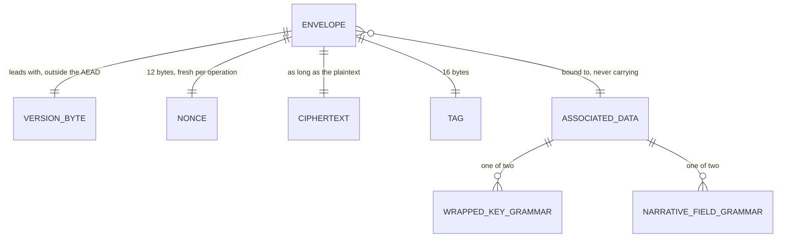

# Ciphertext Envelope

## Table of Contents

- [Purpose](#purpose)
- [Key Entities](#key-entities)
- [Constraints](#constraints)
  - [MUST](#must)
  - [MUST NOT](#must-not)
- [Business Rules & Invariants](#business-rules--invariants)
- [Workflows & State Transitions](#workflows--state-transitions)
- [Decision Trees](#decision-trees)
- [Integration Points](#integration-points)
- [Edge Cases & Known Gotchas](#edge-cases--known-gotchas)

## Purpose

One AEAD envelope for everything this product encrypts, and one version byte in front of it
saying which one:

```
version (1 byte) || nonce (12 bytes) || ciphertext || tag (16 bytes)
```

Version `0x01` is AES-256-GCM with a 96-bit nonce and a 128-bit tag, and it is the only
version defined. On the wire and in a column the bytes are rendered as **unpadded
base64url**.

**This chapter is normative.** The requirement it serves fixes the binding *property* — a
ciphertext is bound to where it lives — and not the grammar that expresses it, so somebody
had to choose the bytes, and the choice has to be written down somewhere a second
implementation can read. That place is here rather than in any client's source: a second
implementation cannot read another's test files, so anything stated only in code is not part
of the contract. A client that reproduces the frozen vectors byte for byte agrees with every
other client; one that does not is the one in the wrong.

Two consumers share the format. **Wrapped account keys** are a fixed 61-byte payload over a
32-byte key, and are described in [account-keys.md](account-keys.md) — this chapter owns the
framing beneath them and nothing about what they mean. **Narrative fields** — the free text a
person types into a ledger — are variable length, because AES-GCM ciphertext is exactly as
long as its plaintext. Two envelope formats would be two places for the nonce width, the tag
width or the associated-data binding to drift apart, and every symptom of drift here is
silent: bytes of exactly the right shape that decrypt to nothing on a device that did not
seal them.

**Nothing is encrypted today, and no screen seals or opens a field.** No column holds a narrative
envelope. The two functions do have a production caller — `AccountKeyCustodyService.sealField` and
`openField` delegate to them, because the account's content key never leaves that class — and
nothing but a spec calls *that*. See
[account-keys.md](account-keys.md#the-two-operations-that-delegate-and-the-shape-that-was-forced),
which argues why the operations sit there and not beside the codec. That is a deliberate order
rather than a module left behind: the format is a cross-client contract, so it can be pinned
against an answer computed outside this codebase before a single column holds an envelope, and a
format is far cheaper to agree on before it has data written under it than after. The same is said
again under
[Edge Cases](#edge-cases--known-gotchas), because whoever lands in one place and not the other
reads the module as dead code and deletes it.

**The other consumer is in a different position, and the difference is worth holding on to.**
Wrapped account keys are sealed on every registration and **opened on every passkey sign-in**, so
this framing has a live reader as well as a live writer. What that buys the narrative side is
nothing at all — a format exercised by one consumer is not a format checked for the other, since
the two grammars differ and only the frozen vectors speak to both.

## Key Entities

- **Envelope** — the byte sequence above. Not a type anywhere in the client: `sealEnvelope`
  returns bytes and `openEnvelope` takes them, because a wrapper would be a second place the
  layout is stated.
- **Version byte** — the leading byte, `0x01`. **Outside the authenticated data on purpose.**
  GCM has no opinion about it, which is why the reader has to check it deliberately — and why
  a later reader can look at it *before* it knows the layout, rather than having to guess a
  layout in order to authenticate the byte that names one.
- **Nonce** — 12 bytes, drawn per operation. Twelve is the one width GCM uses directly as the
  counter block's prefix instead of hashing the nonce down to one, which is what makes a nonce
  drawn at random per message safe. Another width is a new version, not an edit.
- **Tag** — 16 bytes, the full tag. A shorter one is a weaker forgery bound that nothing
  downstream would notice: the envelope keeps its shape, every round trip still succeeds, and
  only an attacker sees the difference.
- **Associated data** — authenticated, **not** encrypted, and **not carried inside the
  envelope**. It is rebuilt from wherever the ciphertext was found. Two grammars exist, one
  per consumer.
- **Wire form** — unpadded base64url over the whole envelope, and what a column stores.
- **Narrative field** — one table-and-column pair from the closed list below, together with
  the row it names.



## Constraints

### MUST

- **The layout MUST be `version(1) || nonce(12) || ciphertext || tag(16)`, and version `0x01`
  MUST mean AES-256-GCM with a 96-bit nonce and a 128-bit tag.**
  - **Why**: these three widths are what a client's AES-GCM implementation slices on. A byte
    moved from the nonce to the tag keeps the total length and produces envelopes that open
    perfectly against themselves and against nothing else.
  - **Enforced in**: `key-envelope.ts` on the client, which builds the layout from named
    constants rather than from literals — **two** of them exported, `ENVELOPE_NONCE_BYTES` and
    `ENVELOPE_TAG_BYTES`, while the version's own width is the private `VERSION_BYTES = 1`.
    The module's third export, `ENVELOPE_VERSION`, is the version **value** and not a width;
    the two must not be read as a set of three. Keeping `VERSION_BYTES` private is argued at
    its declaration: it is the arithmetic the format is made of rather than a setting, so a
    reader who needs it can read the layout and a writer who wants to change it is changing
    the format. `Domain/Security/CiphertextEnvelope` holds the same layout on the server, its
    `MinimumLength` being const arithmetic over the three parts. Each of the three widths and
    the version value are pinned as literals in `CiphertextEnvelopeTests` — the one place in
    that file where a literal is correct, because a test computing the sum from the same
    constants it is checking agrees with any three numbers the type later chooses.

- **Every nonce MUST be freshly drawn from a cryptographically secure random source, once per
  operation. This is a requirement of the contract, not an implementation detail.**
  - **Why**: a counter is an ordinary, defensible choice for an implementer reading only the
    layout, and **nothing in this format gives them grounds to reject it** — which is why the
    rule is stated here rather than left where a nonce happens to be drawn. Two GCM
    ciphertexts under one (key, nonce) give `C₁ ⊕ C₂ = P₁ ⊕ P₂` and hand out the GHASH subkey
    with it, which turns every tag under that key into something an attacker can forge.
    Nothing observable goes wrong on the way there: both clients still open each other's
    envelopes, and every frozen vector still passes. **Both consumers reach the failure, and
    the counter that looks safest is the one the larger consumer breaks.**
    - On the **wrapped-key** side a counter per factor repeats on the very next operation,
      because both of a factor's envelopes are sealed under the same key-encryption key.
      That is the loudest case and also the smallest one: an account seals roughly
      twenty-two of these envelopes in its whole life.
    - The **narrative** side is the one that dominates. Every field of every row is sealed
      under **one** content key, once per field per save, for the life of the account — so a
      counter scoped per *row* never repeats within that row and collides against every other
      row on the account, and a counter scoped per *field* collides on the second save of that
      field. There is no scope at which a counter under a single account-wide key is safe, and
      a reader of the layout alone has nothing to tell them so.
  - **Enforced in**: `sealEnvelope`, which draws from `crypto.getRandomValues` and from
    nowhere else. `narrative-cipher.spec.ts` seals the same string twice under one key and one
    binding and compares the **nonce region** — not the whole envelope, because a counter that
    never moved would still produce two different envelopes the moment anything else about the
    call changed, and comparing envelopes would report that as freshness.

- **Text MUST cross into bytes as UTF-8, and the ciphertext length is what catches a wrong
  encoder.**
  - **Why**: a self-consistent wrong encoder round-trips perfectly — it seals and reopens its
    own ciphertext, so no test inside a single client can see the fault. What separates the
    readings is a length, and a length is only meaningful against a value some other
    implementation produced.
  - **Enforced in**: the `mixed-width` frozen vector, whose plaintext spans one-, two-, three-
    and four-byte sequences. Measured over that exact string: **UTF-8 gives 20 bytes; a
    `charCodeAt` loop emitting UTF-16LE gives 26; a latin1 truncation gives 13 and mangles the
    emoji; NFD instead of NFC gives 21.** Four different numbers, so one assertion on the
    ciphertext width separates all four.

- **Associated data MUST be rebuilt from wherever the ciphertext was found, and MUST NOT
  travel inside the envelope.**
  - **Why**: that is the whole of what makes a ciphertext moved to another row, another column
    or another table fail to authenticate rather than decrypt into something. An envelope
    carrying its own binding authenticates its own lie.
  - **Enforced in**: the signature. `openEnvelope` takes the associated data as a parameter and
    there is no member on an envelope that could hold it. The consequence is the price:
    **a changed grammar byte makes every value already sealed unopenable, with no error naming
    the cause.**

- **Both narrative operations MUST refuse a key whose `extractable` is true, before reaching
  the cipher.**
  - **Why**: there is no API that undoes an extractable import, so a key that arrives
    extractable can already be logged, posted to a crash reporter or written to
    `localStorage`, whatever this module does with it afterwards. The **ordering** carries more
    on the reading side: a reader that refused *after* calling `decrypt` has already put the
    account's narrative text in memory under a key that was never allowed to touch it, and
    then reported a failure — it did the thing the refusal exists to prevent.
  - **Enforced in**: `refuseExtractableKey`, called at the top of both functions. A rejection
    cannot tell "refused first" from "refused last", so the spec spies on
    `crypto.subtle.encrypt` and `crypto.subtle.decrypt` themselves and asserts the cipher was
    never called — **calling through** rather than substituting, because a spy on a
    substituted cipher would be a statement about the substitute.

- **A refusal the codec makes about its *caller* MUST be distinguishable from a ciphertext
  that did not open.**
  - **Why**: a rejection out of `openNarrativeField` means one of two entirely different
    things — *you asked for something impossible*, or *this stored value did not open* — and
    only the second is a state a person can be shown and can act on. The first is a defect in
    the call that no ceremony, no retry and no recovery factor fixes; rendered as damaged
    text it is a bug wearing a UI, put in front of somebody over a row that is perfectly
    fine. Without a type the only way a caller can keep the two apart is to re-apply this
    module's own pre-cipher checks above its own `catch` — a second copy of every rule here,
    in every caller, drifting quietly from the copy the cipher path runs.
  - **Enforced in**: `NarrativeFieldMisuseError`, exported from `narrative-cipher.ts` and
    thrown by that module's two pre-cipher refusals — `refuseInvalidBinding` and
    `refuseExtractableKey` — and by nothing else. It is **never** thrown for a value that
    failed to authenticate: a wrong key, a ciphertext presented under another row, column or
    table, altered bytes, a wire value the strict decoder refuses and bytes that authenticate
    but are not UTF-8 all keep arriving as whatever the platform or the decoder threw, and
    stay the one indistinguishable failure the entry below argues for. It is a class
    extending `Error` whose `name` is written as a class **field** rather than left on the
    prototype, so it is an own enumerable property — the second answer for the case
    `instanceof` cannot see, two copies of the module loaded into one page. The declaration
    states the limit of that, measured on Node 22: `structuredClone` does not carry the name,
    and nothing in this client crosses a worker or a message port today.

- **Every client MUST implement the identical format.** A field sealed by one client opens in
  another. Divergence is a defect in whichever client departs from it, not a negotiation.
  - **Enforced in**: the frozen vectors, and by nothing below the browser. The server holds no
    key and can check framing only.

### MUST NOT

- **Narrative text MUST NOT be normalised, trimmed, or capped by this format.**
  - **Why**: the client seals exactly what was typed. Normalising would store text nobody
    wrote and would overwrite the original on the next save; trimming destroys a field of
    nothing but spaces, turning a stored string into one that reads as never filled in. A
    **cap** is a product rule of its own and belongs where a person can be told, in the screen
    they typed it in, that their text is too long — a limit invented at this layer would
    measure the envelope rather than the text, and would arrive as a rejected promise carrying
    the same error a corrupted key gives.
  - **Enforced in**: `sealNarrativeField`, which encodes and does nothing else. The spec seals
    `e` + combining acute and the single composed code point and asserts **three ciphertext
    bytes against two** — both frozen plaintexts are already NFC, so a `.normalize('NFC')`
    before sealing is a no-op on every vector and green on every other case in the file. That
    one case is the only thing that can see it.

- **The narrative grammar MUST NOT fold a row id, and the wrapped-key grammar MUST NOT stop
  folding a factor id.** Read both directions before making either match the other.
  - **Why**: they are answering different questions. See
    [Two grammars, one join](#two-grammars-one-join).

- **The two grammar prefixes and the version byte MUST NOT be edited.**
  - **Why**: each carries a `/v1` suffix, and associated data is re-supplied rather than
    stored, so a changed prefix stops every envelope already written from opening — and the
    version byte changed means this deployment stops recognising what it is handed *and* reads
    what is already written under a rule it was not sealed with. A change is a new version
    minted alongside the old, never an edit in place.

- **The server MUST NOT hold a value that opens an envelope, and no member that could carry
  one MUST be added.**
  - **Why**: every key-encryption key is derived in a browser from a recovery factor this
    server never sees. A member accepting an unwrapped key, a key-encryption key, a PRF output
    or a recovery code would put the whole account's plaintext within reach of the operator —
    and would do so **without failing a single test**, because there is no test that can notice
    a value the design says never arrives.

## Business Rules & Invariants

### The layout, and the two widths that follow from it

`MinimumLength` is `1 + 12 + 16 = 29`: a version, a nonce and a tag with **no ciphertext
between them**. That is **a floor, not a width.** An empty plaintext is a legitimate value — a
transaction with no memo, a category note somebody cleared — and it seals to exactly 29 bytes,
which is why every length rule over this format compares with `>=` and the client's refusal is
`<` rather than `<=`.

A wrapped account key is **61 bytes**, which is `29 + 32`: the shared framing stretched over
one AES-256 key. That is a **width**, and it belongs to the entity rather than to the format —
see [below](#why-the-wrapped-key-entity-keeps-its-own-exact-width).

The version byte sits **outside** the authenticated data. GCM ignores it, which is deliberate
twice over: the reader has to check it on purpose, and a reader of a later version can look at
it before it knows the layout. A reader that skipped it has only two readings available —
refuse, or decode as v1 anyway — and the second is how a future format silently becomes
unreadable, because the day a successor ships with a different nonce width, every v1 reader
slices the nonce in the wrong place and reports genuine data as corrupt.

### Two grammars, one join

Both grammars are UTF-8, and both join their fields with `0x1F`, the ASCII unit separator. The
separator goes **between** the fields, never around them, and no field is dropped for being
empty — dropping one seals two different field lists to the same bytes, which is the one
ambiguity a separator exists to remove.

**A wrapped account key:**

```
"budgetoid/wrapped-key/v1" || 0x1F || <factor id, lower-case hyphenated> || 0x1F || <"content" | "index">
```

**A narrative field:**

```
"budgetoid/field/v1" || 0x1F || <table> || 0x1F || <column> || 0x1F || <rowId>
```

All four narrative fields are load-bearing and each catches a different swap. Without the
column, a category's name and its description are interchangeable ciphertexts and swapping
them is a silent, successful decryption. Without the table, a payee's name opens as a
category's, since the two share the column word. Without the row, every row in a column is
interchangeable with every other.

`0x1F` cannot occur in any field of either grammar, which is what makes "no length prefixes
are needed" a fact rather than a hope — and that claim belongs to each **grammar** rather than
to the shared join, because only a grammar knows what its fields are: the wrapped-key one
because its fields are a literal, a canonical UUID and one of two words; the narrative one
because its fields are a literal, a table and a column looked up as a pair in a list this
client owns, and a UUID. `buildAssociatedData` checks
nothing about a field's contents, deliberately: it could only refuse a value it cannot
describe, or repair one — and the repair is worse, since it would silently change bytes a
caller believed it had chosen.

**The wrapped-key grammar folds a UUID's spelling. The narrative grammar refuses one. Both
directions need stating, so that nobody makes one match the other.**

*Why the wrapped-key grammar folds*: the factor id is minted by this client before any server
has seen it, so nothing upstream hands that module a canonical value and its fold is the only
place one is made. Folding is a **defence against a value arriving from elsewhere**.

*Why the narrative grammar refuses*: nothing is chosen here. The row id is whatever the row
the client just read handed back, in the one spelling the server renders a `uuid` as. There is
nothing to be tolerant of, so a fold could only invent a **second** spelling of a value that
has one — and it would invent it at the **sealing** end, which is precisely where the damage is
unrecoverable. A refusal costs a caller one bug report; a fold costs a person their ledger.

The two ends meet at one predicate: `narrative-cipher.ts` imports `isCanonicalFactorId` from
`factor-id.ts` under the alias `isCanonicalRowId` rather than writing a second regular
expression. A row id is not a factor id; the **shape** they have to be is the same, and two
copies of one spelling drift while each still opens the envelopes it wrote. The spec's
`refuses a row id that is not a UUID at all` case exists because that drift was **run**:
replacing the shared call with a local `/^[0-9a-f-]{36}$/` and deleting the import left the
whole file green until a row id of thirty-six hyphens was added to the list.

### Database-style names, not API member names

The narrative grammar names `transactions.description`, never `Transaction.description` or
whatever a request DTO happens to spell it. An API member name is renameable without a
migration — a rename is a routine, reviewable, green change — and binding to one would make
every envelope already written unopenable the day somebody made it, **silently**. A table and
a column cannot be renamed without a migration, which is a change nobody makes in passing.

### The eight narrative fields

```
transactions.description   categories.name           category_groups.name
payees.name                categories.description    category_groups.description
accounts.name              budgets.name
```

They are a **runtime list** in the client — `NARRATIVE_FIELDS` — with the `NarrativeField`
type *derived* from it. The other way round, a hand-written union beside a hand-written list,
can be widened without any value moving, and the only check available against that is a
type-level assertion, which looks identical whether it is asserting or has quietly stopped.

**The limit of that, measured rather than reasoned.** A ninth entry appended to the array —
the edit somebody adding a narrative field actually makes — reddens **two** cases in
`narrative-cipher.spec.ts`: the one that counts the list, and the one that pins the list of
fields against the list of per-field reasons in both directions. But a ninth member **bolted
onto the derived type past the array** reddens **nothing at all**: the array still has eight
entries, so both counts still agree. That was run, not assumed.

So the second shape is **held by review, not by a build error** — the same answer `CLAUDE.md`
gives about a second account-creating path, and for the same reason: it is one line that
reddens no build. It is left that way on purpose. The guard available for it would read the
module's own source as *text* and demand the exact declaration, which catches one spelling and
no other way of assembling the same type — a partial guard wearing the face of a total one.
Better a named gap than a check that looks like it closed one.

**They are pairs, and not a cross product.** `transactions` is a real table, `name` is a real
column, and `transactions.name` does not exist. So a binding is looked up as a **pair** — one
scan for an entry whose table *and* column both match — and never as two independent
membership tests. "Is the table one of the eight tables" and "is the column one of the eight
columns" both answer yes for `transactions.name`, so a check written that way waves through a
binding that points at nothing, and text sealed under it is sealed under a grammar no read of
any row will ever rebuild, because there is no column to read it back out of. Both fields have
to come off the **same** entry, which is what the single predicate in `refuseInvalidBinding`
does; splitting it into two `some` calls is the same mistake wearing a different shape.

**The caller that produces such a binding is a mapper, which is the next slice's work.**
Nothing assembles one today: the table and the column are closed unions derived from
`NARRATIVE_FIELDS`, so a binding the compiler built has already been through them. The runtime
lookup is for the binding the compiler never saw — a table name arriving as data, out of a
configuration, off a response, through one `as NarrativeFieldBinding` in a view-model mapper
that took its table from one place and its column from another. That shape is also what the
lookup buys the join: with it in place, "no field of this grammar can contain the separator" is
a runtime fact for two of the three fields rather than a property of the type alone, and the
third cannot hold a `0x1F` and still be a canonical UUID.

**A scan of eight entries, and not a prebuilt `Set` of joined keys.** A set needs a separator
to join a table to a column with, and a separator here is a second grammar over the same two
fields sitting next to the one that reaches envelopes — one that would then have to be argued
not to collide with it. Eight comparisons of two short strings is not a cost anybody can
measure against a `subtle.encrypt`.

### Nothing normalises, and the normalisation this product will need is a different transform

The client seals exactly what was typed, NFD included, and hands back the same code points
rather than the ones they render as — **for every well-formed string, which is the one
qualification this claim needs**: an unpaired surrogate is replaced at the crossing into UTF-8,
before the cipher, and [Edge Cases](#edge-cases--known-gotchas) states that in full. Measured on
the `mixed-width` vector's plaintext —
`Café €250` with two emoji — that is **20 UTF-8 bytes in NFC and 21 in NFD**, because `U+00E9`
is the one code point in it with a canonical decomposition.

The normalisation this product does need belongs to the **blind index**, which is later work.
Its transform is a different one — a trim, a compatibility form, and full case folding — and
it is applied where the comparison happens rather than where the text is stored. Folding the
two together here would buy the index nothing and would silently rewrite what a person
entered.

### What the server checks, and what it cannot

The server holds no value that opens an envelope, so **framing is the whole of what is
checkable on that side, and that is not a shortcoming.** A nonce of zeros and a tag of zeros
are well-formed by every rule it owns. Anything stronger would need a key, and a design in
which the server had one is the design this product exists to avoid.

Two types split the job:

- **`Domain/Security/CiphertextEnvelope`** owns the format: at least 29 bytes, leading with
  version 1. Length is judged **before** version, and the order is a correctness rule rather
  than a style one — an empty buffer has no leading byte for a version check to look at, so an
  implementation reaching for `envelope[0]` first would not answer `false`; it would throw, out
  of a method whose entire contract is to answer without one.
- **`Application/Security/CiphertextEnvelopeText`** is the edge: base64url within a ceiling the
  caller names, then the domain's rules. It defines no number of its own — the floor and the
  version come from the domain, the ceiling comes from the caller — which is what keeps the
  edge and the format from drifting apart.

**The ceiling is applied once, and not by that type.** The shared base64url decoder bounds
the *encoded* text against an allowance computed in the **padded** form, which overshoots the
true ceiling by up to two characters. Measured: with a ceiling of **29** bytes the allowance
is **40** characters, and a **30**-byte envelope encodes to exactly 40 — so it passes every
check that can be made on text. `PasskeyEncoding.TryDecode` therefore measures the decoded
buffer as well, immediately after the decode, and that second comparison is what makes the
number a caller names the number it gets. It lives in the decoder because the decoder is what
creates the slack, so it is the lowest layer that can close it declaratively; left to each
caller it would be closed at whichever of them remembered, and a limit widened by a byte or
two is invisible in every other. Measured before it existed: six of `PasskeyPayloadLimits`'
seven members admitted one or two bytes past what they declared — 1024 admitted 1026, 512
admitted 513, 64 admitted 66 — and `CredentialIdBytes` was the only one that did not.

**`CiphertextEnvelopeText` deliberately does not re-apply it**, and says so where the second
comparison would go: "a second comparison against `maxDecodedBytes` would be one rule with
two owners." The owner that got edited would be whichever one the next reader opened.

**So what that type exists for is the framing, not the ceiling.** It is the one place a
decoded buffer meets the format's *floor* and its *version byte*, in that order and taken
from the type that owns them, for every sealed member the API accepts as text. It still
declares no number of its own. Fold it away and those two rules are restated in each caller
that decodes a sealed member, which is exactly the drift a shared edge exists to prevent.

**The wrapped-key path never showed the symptom, which is why the slack went unnoticed as
long as it did.** Its exact 61-byte width sat behind the same decode and refused the one or
two extra bytes the text-side allowance let through, so the only member carrying a
post-decode rule of its own was also the only one that could not be over-admitted. A member
holding nothing but a **floor** has nothing behind it. Today the decoder refuses those bytes
first, so the width never sees them.

### Why the wrapped-key entity keeps its own exact width

`WrappedAccountKeys` refuses anything that is not **exactly** 61 bytes, on both columns, and
that rule stays where it is. It is the **entity's** rule, not the format's: substituting the
shared floor for it would weaken an equality into a lower bound, and what it would stop
catching is the band the shared rules cannot see — an envelope of 29 to 60 bytes clears the
format's floor, carries the right version byte, and is still not a wrapped key.

Only the *short* side of that is reachable today. An envelope **wider** than 61 is refused by
the shared ceiling before the width is consulted, and the ceiling and the width are the same
number **by construction**: `PasskeyPayloadLimits.WrappedKeyBytes` is declared as
`WrappedAccountKeys.EnvelopeLength`, so the ceiling *is* the width rather than a second
number that happens to agree with it. The upper half of this check is therefore unreachable,
and it stays written as an inequality against the width rather than as a lower bound of its
own: it becomes reachable again the day somebody replaces that derivation with a separate
literal — one silent step, and then a loud one when the two numbers part.

Folding the width the other way — into the shared format — would refuse every narrative entry
longer than an empty one, and the person would find out by not being able to save what they
typed.

### Why there is no backend known-answer test, and it is not a prohibition

The next reader will propose one, so the argument is written down. It is **not** that the
server may not run AES-GCM: the integration suite already does, deliberately, where it stands
in for a client's key custody.

The reason is that a **second implementation of a client-side format, in a language nothing in
production reads, is a spelling that can drift while staying green.** It would agree with the
vectors on the day it was written and would then be maintained by nobody, because no shipped
code path depends on it. The client's own spec already runs the vectors on the only side that
has an implementation, and runs them in both directions — sealing to the frozen wire value and
opening the frozen wire value back — with the key import, the cipher and the encoder all
production's and only the nonce fed through a seam.

What the server asserts over the format is exactly what it **enforces** at the edge — the
base64url alphabet, the minimum length, the version byte, and the wrapped path's exact width —
and nothing more. A check the server does not enforce is a check nothing keeps honest.

### The vector index, which is kept in two places

Narrative-field vectors live in [`vectors/narrative-field-v1.json`](vectors/narrative-field-v1.json):
one binding-only vector, one ASCII vector and the mixed-width vector. **That file is not the
complete registry.** The generic envelope vector, the two key-encryption-key vectors (the
passkey branch and the recovery-code branch), the wrapped-key associated-data vector and the
recovery-code verifier are still under
[Frozen known-answer vectors](account-keys.md#frozen-known-answer-vectors) in
`account-keys.md`, because the specs that read them were outside the change that produced the
JSON file. A second implementation needs both.

Two rules the JSON file states about itself and this chapter restates, because they are
contract rather than commentary. **`plaintextUtf8Hex` is normative and `plaintextForHumans` is
a caption on it** — a JSON string cannot distinguish NFC from NFD and an editor may silently
re-normalise it on save, and since nothing normalises narrative text before sealing, the byte
sequence is the contract. And **no separator anywhere is written as a character**: a raw
`U+001F` does not survive ordinary tooling, and while those vectors were produced it was
silently swallowed twice, each time leaving a plausible-looking string with the separator
simply gone.

## Workflows & State Transitions

**Sealing a narrative field** — every step is the client's, and no step exists on the server.

1. **Refuse an extractable key.** Before anything else, and before the cipher in particular.
2. **Refuse a binding this grammar cannot be built over**, at the door of the operation and by
   name, through `refuseInvalidBinding`: the table and the column looked up as a **pair**, and
   the row id required in the canonical spelling. Both throw `NarrativeFieldMisuseError`, and
   nothing has been built at this point — the function returns `void`, so what a caller asks
   for is the refusal rather than bytes it then drops.
3. **Build the associated data** through `narrativeFieldAssociatedData`, never inline — which
   calls that same refusal again on its own account, because it owes it to its own callers.
   The four fields joined by hand would produce byte-identical bytes and skip the refusal,
   which passes every case a round trip can see and seals under a binding no later read of
   that row can reproduce. The two calls are not redundancy and they are not a red bar either:
   deleting the one at the door reddens nothing, which
   [Edge Cases](#edge-cases--known-gotchas) states in full.
4. **Encode the text as UTF-8.** Nothing else: no normalisation, no trim, no cap.
5. **Draw a fresh nonce, seal, and assemble** `version || nonce || ciphertext || tag`.
   WebCrypto returns the tag appended to the ciphertext — the same order this layout specifies
   — so there is no split to make, and appending the tag a second time is the shape that
   mistake takes.
6. **Render as unpadded base64url.**

**Which of those orderings is watched, and which is only true.** Step 1's position before the
cipher is pinned by the spies on `crypto.subtle.encrypt` and `crypto.subtle.decrypt`, because
a function that sealed first and threw on the way out rejects identically. Step 2's is held
**by construction** and by nothing running: the pair lookup sits inside the same function as
the row-id check, reached from the same two call sites above the same `sealEnvelope` and
`openEnvelope`, so there is no arrangement of those lines in which one binding refusal is
pre-cipher and the other is not. No spy watches either of them, and the cases over them ask
only which *type* was thrown — which is said out loud at the check itself, because a reader
who assumed the ordering was pinned could move it under the cipher with everything still
green.

**Opening one** runs the same steps in reverse and rejects — never returns a partial reading —
on a wire value the strict decoder refuses, an input too short to be an envelope, a version
byte this code does not know, associated data other than what it was sealed under, a single
flipped bit anywhere, and bytes that authenticate but are not UTF-8. That last decode is
`fatal: true`, and it is load-bearing: a lenient decoder turns bytes that are not UTF-8 into
`U+FFFD`, which reads as damaged text a person typed, is indistinguishable from it, and gets
written straight back on the next save.

**The server's step**, on the one consumer that exists there today: decode base64url within a
ceiling — which the decoder applies to the encoded text and then to the buffer it produced —
and then the floor and the version. `CiphertextEnvelopeText` has exactly one caller,
`WrappedKeyEnvelope`, which adds its exact width on top. **The narrative side is the next
story's work**: nothing in the API decodes a narrative envelope today, and when something does
it reaches the same member with a ceiling of its own rather than a second decode. Nothing on
that side opens anything.

## Decision Trees

**Which grammar seals this value?**

- an account key wrapped under a recovery factor → the wrapped-key grammar, over the factor
  id and the purpose. See [account-keys.md](account-keys.md).
- free text in one of the eight columns → the narrative grammar, over the table, the column
  and the row id.
- anything else → **there is no third grammar.** A new one is a new prefix, argued in the
  chapter that owns the values it binds, never a field bolted onto one of these two.

**An envelope will not open. What does that mean?**

- the wrong key → the tag does not verify
- the right key, the wrong row, column, table, factor or purpose → the associated data
  disagrees, and the tag does not verify
- the bytes were altered → the tag does not verify

All three are **one indistinguishable failure by design**: a caller learns the value is
unusable and learns nothing about why, because anything finer is an oracle over data the
caller was not given.

A fourth answer is not on that list and is the reason the list can stay silent: **the call was
one this codec could not make** — a table and column that are not one of its pairs, a row id in
another spelling, a key whose bytes can be read back out. That is `NarrativeFieldMisuseError`,
it is thrown before any cipher runs, and it says nothing whatever about the stored value. A
caller wrapping an open in a `catch` has to answer "is this column damaged?", and the answer is
*no* whenever the throw was of that type.

**Where does a new length rule belong?**

- "an envelope of this kind has exactly one legal size" → the entity that owns that payload,
  the way `WrappedAccountKeys` does. Never the shared format.
- "text in this field may not exceed N characters" → the product rule that owns the field, and
  a screen that can say so. Never this format, which would measure the envelope and refuse
  through a rejected promise.
- "this request body may not be arbitrarily large" → the ceiling parameter at the edge, named
  by the caller, per field.

## Integration Points

- **[account-keys.md](account-keys.md)** — the first consumer: what a wrapped key is, why a
  factor is not a credential, and the wrapped-key associated-data grammar with its frozen
  vectors. The **exact 61-byte width lives there**, and this chapter's floor deliberately does
  not replace it.
- **[ADR 0022](../decisions/0022-mint-narrative-row-identifiers-on-the-client.md)** — why a
  narrative row identifier is minted by the client, and in which canonical spelling. The
  narrative grammar's fourth field is unreachable at insert time without it.
- **[ADR 0018](../decisions/0018-give-the-wrapped-account-keys-a-policed-table-and-their-own-factor-identifier.md)**
  — the same call, made first for `factor_id`, and where the database's own width and version
  checks live.
- **[recovery-codes.md](recovery-codes.md)** and **[passkeys.md](passkeys.md)** — where the
  key-encryption keys that seal the wrapped copies come from. Neither reaches this format
  directly.
- **[registration.md](registration.md)** — the only envelope-writing path a screen reaches:
  eleven factors, twenty-two wrapped keys, in one save. It is one of **three** production
  handlers that write envelopes — `RegisterAccountHandler`, `CompleteRegistrationHandler` and
  `GenerateRecoveryCodesHandler` — and the other two are still reached only by the integration
  suite. [account-keys.md](account-keys.md) is where the three are counted.

## Edge Cases & Known Gotchas

- **Nothing is encrypted today, and the narrative functions are reached by one caller that nothing
  calls.** `sealNarrativeField` and `openNarrativeField` are reached through
  `AccountKeyCustodyService.sealField` and `openField`, which hold the content key they need; no
  screen calls those, because no column holds an envelope for one to seal or open. **The
  wrapped-key side is the counter-example rather than a companion, and citing the two together is
  the mistake to avoid**: `unwrapAccountKeys` is called on every passkey sign-in, because what it
  needed was a route to hand it an envelope and a class to hold what came out, and it has both. The
  narrative path has the class and waits on the other half — a ciphertext existing anywhere in the
  product. **Do not delete any of it for want of a caller, and do not relax anything here to make a
  later screen easier to write.** The format is a contract with every client that will ever seal an
  envelope; it is being agreed while agreement is still cheap.
- **An empty plaintext is legal and seals to exactly 29 bytes.** A reader tempted to treat
  "too short" as "empty is not allowed" would refuse a value the format produces. The spec
  seals an empty string and opens it back, which is the half that stops the misreading.
- **`openNarrativeField` does not hand back exactly what was sealed for a *lone surrogate*, and
  the loss happens before the cipher rather than in the reader.** `TextEncoder` substitutes
  U+FFFD for an unpaired surrogate — measured: `'café \uD83D'` comes back `'café �'` — so what
  is sealed is already the replacement, and the reader returns exactly what was sealed. The
  strict decoder cannot object either, because those bytes *are* valid UTF-8, which is the
  whole reason the substitution is invisible. And it is **permanent**: the next save re-seals
  the replacement, and nothing later can tell that a surrogate pair was ever there. The
  concrete path is a caller rather than a codec fault, and it follows from the rule that this
  format holds **no cap of its own** — a caller slicing narrative text to fit a column or a
  preview is exactly the caller who splits a pair: `'lunch 🍕'.slice(0, 7)` seals and returns
  `'lunch �'`. Text that has to be shortened is shortened **by code point**, never by UTF-16
  unit.
- **The client's base64url decoder is stricter than the server's, deliberately — and the list
  of what the server lets through has to be complete.** The client refuses padding, the
  standard alphabet's `+` and `/`, any character outside the URL-safe set, an impossible
  length, and a non-canonical trailing group. `Base64Url.IsValid`, which the server decodes
  through, admits **two** things the client will not emit: **padding**, and **whitespace
  anywhere in the string**. Measured: `AAAA AAAA`, a tab, a newline and a leading space each
  validate and decode to the same bytes as `AAAAAAAA`. Stopping this list at padding is a
  defect of its own, because the list is normative. Neither leniency buys a way past the
  ceiling: whitespace spends the character budget like any other character, so the decoded
  length cannot grow because of it. Nothing is lost by the difference either — the column
  stores decoded bytes. The looser bound is the one that never refuses a member a client
  legitimately encoded, and the strictness is a rule about what *this* client emits, not a
  claim about what the server admits.
- **A wrong encoder is invisible on ASCII.** Every assertion that can be made inside one client
  passes for a client that is consistently wrong about UTF-8. Only the frozen `mixed-width`
  vector separates the readings, and only because AES-GCM makes the ciphertext length equal to
  the plaintext length.
- **One transcription trap in that vector, worth naming**: the currency sign is `U+20AC` EURO
  SIGN and not `U+20B4` HRYVNIA SIGN. The two differ by a single UTF-8 byte, `e282ac` against
  `e282b4`, and produce a completely different ciphertext with every other input identical.
- **A red vector never means updating the constant.** It names which input changed, and every
  one of those changes makes fields already written unreadable by the client that wrote them.
- **A ninth narrative field added to the *type* rather than to the *list* reddens nothing.**
  Held by review. Add the pair to `NARRATIVE_FIELDS`, and add its reason to the spec's map, or
  two cases go red — which is the intended cost.
- **The binding refusal at the door of each operation can be deleted with nothing going red,
  and it is kept anyway.** Measured: removing the `refuseInvalidBinding` call from
  `sealNarrativeField` reddens no case in the suite, because the builder a few statements on
  refuses the same binding and every case that can see a refusal sees that one. What the door
  buys is that the claim — everything refused about the *call* is refused before a cipher runs
  — is readable in one place on each operation instead of resting on what a builder further
  down happens to do on the way past. So it is held by review, and the argument is written out
  at the call rather than left as a shape somebody is expected to recognise.
- **A binding whose table and column are each real but which name nothing together is the
  refusal a reader is most likely to weaken.** `transactions.name` passes two membership
  tests and fails the pair lookup; see [the eight narrative fields](#the-eight-narrative-fields).
