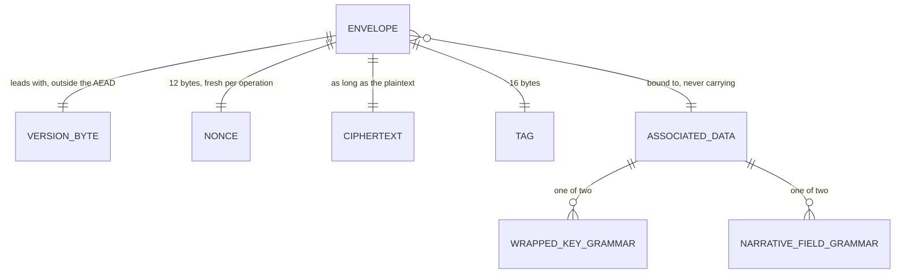

# Ciphertext Envelope

## Table of Contents

- [Purpose](#purpose)
- [Key Entities](#key-entities)
- [Constraints](#constraints)
  - [MUST](#must)
  - [MUST NOT](#must-not)
- [Business Rules & Invariants](#business-rules--invariants)
- [Workflows & State Transitions](#workflows--state-transitions)
- [Decision Trees](#decision-trees)
- [Integration Points](#integration-points)
- [Edge Cases & Known Gotchas](#edge-cases--known-gotchas)

## Purpose

One AEAD envelope for everything this product encrypts, and one version byte in front of it
saying which one:

```
version (1 byte) || nonce (12 bytes) || ciphertext || tag (16 bytes)
```

Version `0x01` is AES-256-GCM with a 96-bit nonce and a 128-bit tag, and it is the only
version defined. On the wire and in a column the bytes are rendered as **unpadded
base64url**.

**This chapter is normative.** The requirement it serves fixes the binding *property* — a
ciphertext is bound to where it lives — and not the grammar that expresses it, so somebody
had to choose the bytes, and the choice has to be written down somewhere a second
implementation can read. That place is here rather than in any client's source: a second
implementation cannot read another's test files, so anything stated only in code is not part
of the contract. A client that reproduces the frozen vectors byte for byte agrees with every
other client; one that does not is the one in the wrong.

Two consumers share the format. **Wrapped account keys** are a fixed 61-byte payload over a
32-byte key, and are described in [account-keys.md](account-keys.md) — this chapter owns the
framing beneath them and nothing about what they mean. **Narrative fields** — the free text a
person types into a ledger — are variable length, because AES-GCM ciphertext is exactly as
long as its plaintext. Two envelope formats would be two places for the nonce width, the tag
width or the associated-data binding to drift apart, and every symptom of drift here is
silent: bytes of exactly the right shape that decrypt to nothing on a device that did not
seal them.

**All eight columns hold a narrative envelope, and every screen now seals and opens one.**
`budgets.name` is the first: `bytea`, **nullable**, mapped through a converter over
`NarrativeField`, with a length band and a version check on the table. Every budget that exists is
the nameless one registration writes, so that column stores NULL in every row.
`accounts.name` is the second and is different in three ways that matter: it is `bytea` **NOT
NULL**, it carries a **blind index** on `accounts.name_key` — the first in the product — and it is
the first sealed column a **route** accepts a value for, since `POST /api/accounts` and
`PUT /api/accounts/{id}` both take a sealed name and an index as base64url. `payees.name` is the
third, shaped exactly like the second — `NOT NULL`, three `CHECK`s, a blind index on
`payees.name_key`, two routes accepting the pair — and it is the first column whose sealing
**removed a capability the server had**: `payees` was the one table this side looked rows up in *by
name*, and find-or-create went with the plaintext. See [payees.md](payees.md).
`category_groups.name` is the fourth and adds nothing new in kind — `NOT NULL`, a blind index on
`category_groups.name_key`, two routes — but it arrives beside the fifth, which does.
`category_groups.description` is the **first sealed free-text column in the product**: `bytea`
**nullable**, capped at `NarrativeFieldLimits.DescriptionBytes` rather than `NameBytes`, reached by
the same two routes, and carrying **no blind index and never one**. See
[categories.md](categories.md). The **last three landed together and have no ordinal between
them**: `categories.name` with the fourth and last blind index on `categories.name_key`,
`categories.description`, and `transactions.description`. What changed with the
first column is that the format left the edge and entered the schema, which is where its rules stop
being reversible; what changed with the second is that a *contract with a client* now runs over it;
what changed with the third is that a domain behaviour was written out of the server rather than
merely re-expressed; what changed with the fifth is that a column can now be **absent** as well
as sealed, which is a distinction no earlier sealed column with a route had to carry; and what
changes with the last is that `transactions` is the **first sealed table with no name column at
all** — no blind index, no unique name rule, no `IndexedName`, and nothing in the established
pattern silently assuming one, because the two types that would are reachable only through a name.
See [transactions.md](transactions.md).

**With those three the set is closed.** There is no ninth column and no later slice: the eight
`table.column` pairs the grammar names are the eight the schema now carries, so a reader who finds
a sentence here promising the next one is reading a sentence this slice should have taken out.
The codec's two functions — `sealNarrativeField` and `openNarrativeField` — are reached through
`AccountKeyCustodyService.sealField` and `openField`, because the account's content key never
leaves that class, and every screen that writes a narrative value calls those —
`/app/accounts`, the transaction form and both halves of
`/app/categories`, each minting its own row id and computing a blind index where the column
carries one. See
[account-keys.md](account-keys.md#the-operations-that-delegate-and-the-shape-that-was-forced),
which argues why the operations sit there and not beside the codec. **The format was agreed a
slice ahead of those callers on purpose, and that is what every clause of it rests on**: a
cross-client contract can be pinned against answers computed outside this codebase while no row
holds an envelope, and a format is far cheaper to agree on before it has data written under it
than after. The window that made it cheap is shut — columns hold envelopes and indexes, and an
edited grammar byte, cap or version orphans them with no error naming the cause. The same is said
again under
[Edge Cases](#edge-cases--known-gotchas), because whoever lands in one place and not the other
reads a settled contract as an adjustable one and relaxes a clause to make the next screen
easier.

**Each consumer has a live writer and a live reader, and neither one's traffic says anything about
the other.** Wrapped account keys are sealed on every registration and **opened on every passkey
sign-in**; narrative fields are sealed on every write those screens make and opened on every read
they answer. What either buys the other is nothing at all — a format exercised by one consumer is
not a format checked for the other, since the two grammars differ and only the frozen vectors
speak to both.

**The server's format edge now has a column behind it.** Four types stand between a client's bytes
and storage: `Domain/Security/NarrativeFieldLimits` (the two byte caps),
`Domain/Security/NarrativeField` (the one type a narrative column accepts),
`Domain/Security/IndexedName` (a sealed name and its blind index as one value) and
`Application/Security/BlindIndexText` (the wire step for an index). None of them can open anything —
the server holds no key and never will — so what they add is *shape*, before a value is stored. They
are argued below under [the two caps](#the-two-caps-and-what-they-measure) onward. Eight columns are
what they now stand in front of, and the schema restates their rules in SQL — two `CHECK`s on the
budget column, three each on the account's and the payee's, the third being the index's exact width,
**five each on `category_groups` and `categories`** — four narrative, one the index's width — beside
the position rule those two tables already had, because they are the ones carrying two narrative
columns at once, and **two on `transactions`**, beside the amount rule that table already had:
see [two checks on one column](#two-checks-on-one-column-and-which-one-bites). The order was the one
this format asked for and got — agree while agreement is cheap, and let the persistence step arrive
against rules that are already written.

**`budgets.name` is a narrative field with no blind index, and it is the only one of the five name
columns like that.** The other four — `accounts`, `categories`, `category_groups`, `payees` — are
the indexed set: an index rides beside each ciphertext so that equal names can be found equal, which
is what `IndexedName` exists to carry. A budget name is neither searched nor constrained, so it is
sealed and nothing more, and its column takes a bare `NarrativeField`.
[budgets.md](budgets.md) carries what that costs, which is per-owner name uniqueness, surrendered
rather than deferred.

**None of the three description columns is indexed either, and that is a rule about the field class
rather than a third case.** An index answers "which row holds this name"; a description is not
looked up, is not unique and is not a name, so a `description_key` would publish a deterministic
per-account fingerprint of somebody's free text with nothing on the other side asking for it. Read
that beside the budget's exclusion and the difference is worth keeping: the budget's is a
uniqueness rule **surrendered**, the descriptions' is a mechanism that was never wanted. So the
question "does this column get an index?" is answered by the field class first and by the column's
own rule second, and `IndexedName.Of` says so from the other end — it names `NameBytes` itself and
takes no ceiling parameter, because every blind-indexed column in the product is a `name`.

**`accounts` is the first of that indexed set to be built, and it is where the pair pays for
itself.** `IX_accounts_budget_id_name_key` is unique over `(budget_id, name_key)`: the same shape of
rule budgets gave up — one name inside its owning scope, here a budget — enforced by the same
mechanism, a unique B-tree index, over bytes the database cannot interpret. Note what carries the
scoping: the index message names the grammar's version, the table and the column and **no budget**,
so one name under one account keys to one value everywhere it is written; it is `budget_id`, the
index's leading column, that keeps two budgets apart.

**`payees` is the second, and it is where the pair stops being a convenience.**
`IX_payees_budget_id_name_key` is the identical declaration over the identical mechanism, and what
it carries is different in kind: on accounts a duplicate name is a confusing list, while on payees
one index value per budget **is** counterparty deduplication — the property a server-side
find-or-create used to hold by folding case and re-reading the table, and which nothing on this side
can hold any more.

**`category_groups` is the third, and it is the accounts reading rather than the payees one.**
`IX_category_groups_budget_id_name_key` is again the identical declaration over the identical
mechanism, and two groups under one name are a confusion a person can see and fix rather than a
deduplication mechanism the domain rests on — nothing looks a group up by name, and no read path in
the product orders or matches on one, so the index's whole job is to refuse the second row.

**`categories` is the fourth and the last, and it closes the set rather than continuing it.**
`IX_categories_budget_id_name_key` is the same declaration again, and the old
`IX_categories_budget_id_name` is **gone** rather than left standing beside it — a unique index over
ciphertext refuses nothing and nobody would ever see it fire. Its reading is the group's: two
categories under one name are a confusion somebody can fix. What is worth carrying away is that the
`case_insensitive` collation left this column **by force**, `bytea` not being collatable, and with
it **the schema's last narrative use of that collation** — `users.email` is now the only column
anywhere carrying one. Read all five name columns together, because there is no sixth to hold the
argument open: **surrendering uniqueness and keeping it are both live outcomes of the same change,
and which one applies is decided by whether the column has an index beside it.** Four have one and
`budgets.name` does not; that is the whole of the split, permanently.

## Key Entities

- **Envelope** — the byte sequence above. Not a type anywhere in the client: `sealEnvelope`
  returns bytes and `openEnvelope` takes them, because a wrapper would be a second place the
  layout is stated.
- **Version byte** — the leading byte, `0x01`. **Outside the authenticated data on purpose.**
  GCM has no opinion about it, which is why the reader has to check it deliberately — and why
  a later reader can look at it *before* it knows the layout, rather than having to guess a
  layout in order to authenticate the byte that names one.
- **Nonce** — 12 bytes, drawn per operation. Twelve is the one width GCM uses directly as the
  counter block's prefix instead of hashing the nonce down to one, which is what makes a nonce
  drawn at random per message safe. Another width is a new version, not an edit.
- **Tag** — 16 bytes, the full tag. A shorter one is a weaker forgery bound that nothing
  downstream would notice: the envelope keeps its shape, every round trip still succeeds, and
  only an attacker sees the difference.
- **Associated data** — authenticated, **not** encrypted, and **not carried inside the
  envelope**. It is rebuilt from wherever the ciphertext was found. Two grammars exist, one
  per consumer.
- **Wire form** — unpadded base64url over the whole envelope, and what a column stores.
- **Narrative field** — one table-and-column pair from the closed list below, together with
  the row it names. On the server it is also a **type**: `NarrativeField`, the only thing a
  narrative column accepts, holding an envelope and offering no way in from a `string`.
- **Narrative field cap** — one of `NarrativeFieldLimits`' two numbers, in **envelope** bytes.
  One per field *class*, not one per field.
- **Indexed name** — a sealed name and the blind index taken over it, as the single value a
  searchable name column pair holds. `IndexedName`, and there is deliberately no `BlindIndex`
  type beside it.
- **Blind index text** — the 43 characters of unpadded base64url an index arrives as, and
  `BlindIndexText`, the one member that turns them into bytes. Built on the shared base64url
  decoder and **not** on `CiphertextEnvelopeText`, because an index is not an envelope.



## Constraints

### MUST

- **The layout MUST be `version(1) || nonce(12) || ciphertext || tag(16)`, and version `0x01`
  MUST mean AES-256-GCM with a 96-bit nonce and a 128-bit tag.**
  - **Why**: these three widths are what a client's AES-GCM implementation slices on. A byte
    moved from the nonce to the tag keeps the total length and produces envelopes that open
    perfectly against themselves and against nothing else.
  - **Enforced in**: `key-envelope.ts` on the client, which builds the layout from named
    constants rather than from literals — **two** of them exported, `ENVELOPE_NONCE_BYTES` and
    `ENVELOPE_TAG_BYTES`, while the version's own width is the private `VERSION_BYTES = 1`.
    The module's third export, `ENVELOPE_VERSION`, is the version **value** and not a width;
    the two must not be read as a set of three. Keeping `VERSION_BYTES` private is argued at
    its declaration: it is the arithmetic the format is made of rather than a setting, so a
    reader who needs it can read the layout and a writer who wants to change it is changing
    the format. `Domain/Security/CiphertextEnvelope` holds the same layout on the server, its
    `MinimumLength` being const arithmetic over the three parts. Each of the three widths and
    the version value are pinned as literals in `CiphertextEnvelopeTests` — the one place in
    that file where a literal is correct, because a test computing the sum from the same
    constants it is checking agrees with any three numbers the type later chooses.

- **Every nonce MUST be freshly drawn from a cryptographically secure random source, once per
  operation. This is a requirement of the contract, not an implementation detail.**
  - **Why**: a counter is an ordinary, defensible choice for an implementer reading only the
    layout, and **nothing in this format gives them grounds to reject it** — which is why the
    rule is stated here rather than left where a nonce happens to be drawn. Two GCM
    ciphertexts under one (key, nonce) give `C₁ ⊕ C₂ = P₁ ⊕ P₂` and hand out the GHASH subkey
    with it, which turns every tag under that key into something an attacker can forge.
    Nothing observable goes wrong on the way there: both clients still open each other's
    envelopes, and every frozen vector still passes. **Both consumers reach the failure, and
    the counter that looks safest is the one the larger consumer breaks.**
    - On the **wrapped-key** side a counter per factor repeats on the very next operation,
      because both of a factor's envelopes are sealed under the same key-encryption key.
      That is the loudest case and also the smallest one: an account seals roughly
      twenty-two of these envelopes in its whole life.
    - The **narrative** side is the one that dominates. Every field of every row is sealed
      under **one** content key, once per field per save, for the life of the account — so a
      counter scoped per *row* never repeats within that row and collides against every other
      row on the account, and a counter scoped per *field* collides on the second save of that
      field. There is no scope at which a counter under a single account-wide key is safe, and
      a reader of the layout alone has nothing to tell them so.
  - **Enforced in**: `sealEnvelope`, which draws from `crypto.getRandomValues` and from
    nowhere else. `narrative-cipher.spec.ts` seals the same string twice under one key and one
    binding and compares the **nonce region** — not the whole envelope, because a counter that
    never moved would still produce two different envelopes the moment anything else about the
    call changed, and comparing envelopes would report that as freshness.

- **Text MUST cross into bytes as UTF-8, and the ciphertext length is what catches a wrong
  encoder.**
  - **Why**: a self-consistent wrong encoder round-trips perfectly — it seals and reopens its
    own ciphertext, so no test inside a single client can see the fault. What separates the
    readings is a length, and a length is only meaningful against a value some other
    implementation produced.
  - **Enforced in**: the `mixed-width` frozen vector, whose plaintext spans one-, two-, three-
    and four-byte sequences. Measured over that exact string: **UTF-8 gives 20 bytes; a
    `charCodeAt` loop emitting UTF-16LE gives 26; a latin1 truncation gives 13 and mangles the
    emoji; NFD instead of NFC gives 21.** Four different numbers, so one assertion on the
    ciphertext width separates all four.

- **Associated data MUST be rebuilt from wherever the ciphertext was found, and MUST NOT
  travel inside the envelope.**
  - **Why**: that is the whole of what makes a ciphertext moved to another row, another column
    or another table fail to authenticate rather than decrypt into something. An envelope
    carrying its own binding authenticates its own lie.
  - **Enforced in**: the signature. `openEnvelope` takes the associated data as a parameter and
    there is no member on an envelope that could hold it. The consequence is the price:
    **a changed grammar byte makes every value already sealed unopenable, with no error naming
    the cause.**

- **Both narrative operations MUST refuse a key whose `extractable` is true, before reaching
  the cipher.**
  - **Why**: there is no API that undoes an extractable import, so a key that arrives
    extractable can already be logged, posted to a crash reporter or written to
    `localStorage`, whatever this module does with it afterwards. The **ordering** carries more
    on the reading side: a reader that refused *after* calling `decrypt` has already put the
    account's narrative text in memory under a key that was never allowed to touch it, and
    then reported a failure — it did the thing the refusal exists to prevent.
  - **Enforced in**: `refuseExtractableKey`, called at the top of both functions. A rejection
    cannot tell "refused first" from "refused last", so the spec spies on
    `crypto.subtle.encrypt` and `crypto.subtle.decrypt` themselves and asserts the cipher was
    never called — **calling through** rather than substituting, because a spy on a
    substituted cipher would be a statement about the substitute.

- **A refusal the codec makes about its *caller* MUST be distinguishable from a ciphertext
  that did not open.**
  - **Why**: a rejection out of `openNarrativeField` means one of two entirely different
    things — *you asked for something impossible*, or *this stored value did not open* — and
    only the second is a state a person can be shown and can act on. The first is a defect in
    the call that no ceremony, no retry and no recovery factor fixes; rendered as damaged
    text it is a bug wearing a UI, put in front of somebody over a row that is perfectly
    fine. Without a type the only way a caller can keep the two apart is to re-apply this
    module's own pre-cipher checks above its own `catch` — a second copy of every rule here,
    in every caller, drifting quietly from the copy the cipher path runs.
  - **Enforced in**: `NarrativeFieldMisuseError`, exported from `narrative-cipher.ts` and
    thrown by that module's two pre-cipher refusals — `refuseInvalidBinding` and
    `refuseExtractableKey` — and by nothing else. It is **never** thrown for a value that
    failed to authenticate: a wrong key, a ciphertext presented under another row, column or
    table, altered bytes, a wire value the strict decoder refuses and bytes that authenticate
    but are not UTF-8 all keep arriving as whatever the platform or the decoder threw, and
    stay the one indistinguishable failure the entry below argues for. It is a class
    extending `Error` whose `name` is written as a class **field** rather than left on the
    prototype, so it is an own enumerable property — the second answer for the case
    `instanceof` cannot see, two copies of the module loaded into one page. The declaration
    states the limit of that, measured on Node 22: `structuredClone` does not carry the name,
    and nothing in this client crosses a worker or a message port today.

- **A narrative column MUST be typed as `NarrativeField`, and that type MUST NOT gain a
  constructor, factory or conversion taking a `string`.**
  - **Why**: it is the strongest mechanical expression this codebase can give the rule that no
    narrative value is ever server-readable. With the column typed this way, writing plaintext
    into one **does not compile** — the rule moves out of review and into the build. That
    matters because the mistake is invisible afterwards: a row holding plaintext is a
    well-formed row, nothing reads back wrong, no constraint fires, and the operator simply has
    the ledger.
  - **Enforced in**: the absence of such a member on `NarrativeField`, and by nothing else. See
    [what no test can hold](#the-strongest-claim-here-is-held-by-an-absence).

- **A sealed narrative value MUST be at most its field class's cap, in envelope bytes.** 1024
  for the five name columns, 2560 for the three description columns.
  - **Why**: a cap is a product rule about how much a person may type into two different kinds
    of field, and this side can measure only one thing — stored bytes. See
    [the two caps](#the-two-caps-and-what-they-measure).
  - **Enforced in**: `NarrativeFieldLimits`' two constants, applied by `NarrativeField.Sealed`
    (which takes the number as a parameter) and by `IndexedName.Of` (which names `NameBytes`
    itself and takes none). `CiphertextEnvelopeTextTests` runs the wire step at both caps, one
    byte either side of each.

- **A sealed name and its blind index MUST arrive together, and neither MUST be repaired.**
  - **Why**: a name ciphertext with no index is a row no lookup can find and no uniqueness
    constraint can police; an index with no ciphertext is a keyed fingerprint of text that is
    stored nowhere. A padded or truncated index is worse than a refused one — it stores a
    well-formed row holding a value that is stable, never collides, keys perfectly and matches
    nothing for the life of the account.
  - **Enforced in**: `IndexedName.Of`, whose two parameters are both non-nullable, and — for the
    row rather than the call — the four `NOT NULL` pairs the schema carries on `accounts.name` /
    `accounts.name_key`, `payees.name` / `payees.name_key`, `category_groups.name` /
    `category_groups.name_key` and `categories.name` / `categories.name_key`. A third guard joined them on the way
    to the database and it is not in this chapter, because it is not about the format: the role's
    `UPDATE` grant names **both** columns of each pair, so the *statement* cannot be half a name
    either. See [two guards, two moments](#a-pair-type-says-a-call-cannot-be-half),
    [accounts.md](accounts.md#business-rules--invariants) — where the live defect that rule was
    found by is recorded — [payees.md](payees.md#business-rules--invariants), where the same
    half-a-name row produces two further failures because that table's index is what deduplicates
    counterparties, and [categories.md](categories.md#business-rules--invariants), where the grant
    is hardest to test because a **second narrative column** shares the list beside the name and its
    index, EF names only the columns that changed, and the rule was broken **twice** in live grants —
    once on `accounts` and once on `categories`, each shipping green. That file also corrects the
    reading a reviewer takes from this one: whether a half grant is loud is decided by **which
    column the list is missing**, never by which table it sits on.

- **A blind index MUST be decoded through the shared base64url decoder, never through
  `CiphertextEnvelopeText`.**
  - **Why**: that type applies the framing rules of an envelope — a 29-byte floor and a leading
    `0x01`. A blind index is a keyed digest whose first byte is whatever HMAC-SHA-256 produced,
    so the envelope type would refuse roughly 255 values in 256. What the two genuinely share is
    the alphabet, and that is the layer `BlindIndexText` reuses.
  - **Enforced in**: `BlindIndexText.TryDecode`, calling `PasskeyEncoding.TryDecode` with
    `IndexedName.BlindIndexLength` as the ceiling and then comparing the decoded width.
    `TryDecode_WithAnIndexWhoseLeadingByteIsNotTheVersion_Decodes` and
    `TryDecode_WithAnAllZeroIndexOfTheLegalWidth_Decodes` are the two cases that would redden if
    somebody moved it onto the envelope decoder.

- **Every client MUST implement the identical format.** A field sealed by one client opens in
  another. Divergence is a defect in whichever client departs from it, not a negotiation.
  - **Enforced in**: the frozen vectors, and by nothing below the browser. The server holds no
    key and can check framing only.

### MUST NOT

- **Narrative text MUST NOT be normalised, trimmed, or capped by this format.**
  - **Why**: the client seals exactly what was typed. Normalising would store text nobody
    wrote and would overwrite the original on the next save; trimming destroys a field of
    nothing but spaces, turning a stored string into one that reads as never filled in. A
    **cap** is a product rule of its own and belongs where a person can be told, in the screen
    they typed it in, that their text is too long — a limit invented at this layer would
    measure the envelope rather than the text, and would arrive as a rejected promise carrying
    the same error a corrupted key gives.
  - **Enforced in**: `sealNarrativeField`, which encodes and does nothing else. The spec seals
    `e` + combining acute and the single composed code point and asserts **three ciphertext
    bytes against two** — both frozen plaintexts are already NFC, so a `.normalize('NFC')`
    before sealing is a no-op on every vector and green on every other case in the file. That
    one case is the only thing that can see it.

- **The narrative grammar MUST NOT fold a row id, and the wrapped-key grammar MUST NOT stop
  folding a factor id.** Read both directions before making either match the other.
  - **Why**: they are answering different questions. See
    [Two grammars, one join](#two-grammars-one-join).

- **The two grammar prefixes and the version byte MUST NOT be edited.**
  - **Why**: each carries a `/v1` suffix, and associated data is re-supplied rather than
    stored, so a changed prefix stops every envelope already written from opening — and the
    version byte changed means this deployment stops recognising what it is handed *and* reads
    what is already written under a rule it was not sealed with. A change is a new version
    minted alongside the old, never an edit in place.

- **The two caps MUST NOT be restated as character limits, and MUST NOT be written out per
  column.**
  - **Why**: the server never sees a character, so a cap on characters is a cap nothing on this
    side can enforce — and a limit nothing enforces is a comment. Written per column, one rule
    would have eight owners, six of them redundant, and the copy that drifted upward would still
    store, still read back and still open. See
    [the two caps](#the-two-caps-and-what-they-measure).

- **The read side MUST NOT re-validate what a column already holds.**
  - **Why**: a validating read makes a lowered cap **retroactive**, and turns a one-integer diff
    into data loss. The same argument protects a future version 2 from destroying the version 1
    rows it exists to rewrite. See
    [the read side does not judge](#the-read-side-does-not-judge-and-that-is-the-decision).
  - **Enforced in**: `NarrativeField.FromStore`, which copies and does nothing else. It is
    `internal`, and `Domain` grants its internals to `Infrastructure` alone, so the one caller
    that needs it — the read arm of a persistence configuration's converter — reaches it and no
    other ring can.

- **The server MUST NOT hold a value that opens an envelope, and no member that could carry
  one MUST be added.**
  - **Why**: every key-encryption key is derived in a browser from a recovery factor this
    server never sees. A member accepting an unwrapped key, a key-encryption key, a PRF output
    or a recovery code would put the whole account's plaintext within reach of the operator —
    and would do so **without failing a single test**, because there is no test that can notice
    a value the design says never arrives.

## Business Rules & Invariants

### The layout, and the two widths that follow from it

`MinimumLength` is `1 + 12 + 16 = 29`: a version, a nonce and a tag with **no ciphertext
between them**. That is **a floor, not a width.** An empty plaintext is a legitimate value — a
transaction with no memo, a category note somebody cleared — and it seals to exactly 29 bytes,
which is why every length rule over this format compares with `>=` and the client's refusal is
`<` rather than `<=`.

A wrapped account key is **61 bytes**, which is `29 + 32`: the shared framing stretched over
one AES-256 key. That is a **width**, and it belongs to the entity rather than to the format —
see [below](#why-the-wrapped-key-entity-keeps-its-own-exact-width).

The version byte sits **outside** the authenticated data. GCM ignores it, which is deliberate
twice over: the reader has to check it on purpose, and a reader of a later version can look at
it before it knows the layout. A reader that skipped it has only two readings available —
refuse, or decode as v1 anyway — and the second is how a future format silently becomes
unreadable, because the day a successor ships with a different nonce width, every v1 reader
slices the nonce in the wrong place and reports genuine data as corrupt.

### Two grammars, one join

Both grammars are UTF-8, and both join their fields with `0x1F`, the ASCII unit separator. The
separator goes **between** the fields, never around them, and no field is dropped for being
empty — dropping one seals two different field lists to the same bytes, which is the one
ambiguity a separator exists to remove.

**A wrapped account key:**

```
"budgetoid/wrapped-key/v1" || 0x1F || <factor id, lower-case hyphenated> || 0x1F || <"content" | "index">
```

**A narrative field:**

```
"budgetoid/field/v1" || 0x1F || <table> || 0x1F || <column> || 0x1F || <rowId>
```

All four narrative fields are load-bearing and each catches a different swap. Without the
column, a category's name and its description are interchangeable ciphertexts and swapping
them is a silent, successful decryption. Without the table, a payee's name opens as a
category's, since the two share the column word. Without the row, every row in a column is
interchangeable with every other.

`0x1F` cannot occur in any field of either grammar, which is what makes "no length prefixes
are needed" a fact rather than a hope — and that claim belongs to each **grammar** rather than
to the shared join, because only a grammar knows what its fields are: the wrapped-key one
because its fields are a literal, a canonical UUID and one of two words; the narrative one
because its fields are a literal, a table and a column looked up as a pair in a list this
client owns, and a UUID. `buildAssociatedData` checks
nothing about a field's contents, deliberately: it could only refuse a value it cannot
describe, or repair one — and the repair is worse, since it would silently change bytes a
caller believed it had chosen.

**The wrapped-key grammar folds a UUID's spelling. The narrative grammar refuses one. Both
directions need stating, so that nobody makes one match the other.**

*Why the wrapped-key grammar folds*: the factor id is minted by this client before any server
has seen it, so nothing upstream hands that module a canonical value and its fold is the only
place one is made. Folding is a **defence against a value arriving from elsewhere**.

*Why the narrative grammar refuses*: nothing is chosen here. The row id is whatever the row
the client just read handed back, in the one spelling the server renders a `uuid` as. There is
nothing to be tolerant of, so a fold could only invent a **second** spelling of a value that
has one — and it would invent it at the **sealing** end, which is precisely where the damage is
unrecoverable. A refusal costs a caller one bug report; a fold costs a person their ledger.

**A third message shares the join and is not a third grammar.** The blind index is built through
the same `buildAssociatedData` and the same `0x1F`, deliberately, so that "the fields are joined
by the unit separator in UTF-8" has one definition and not a second one that drifts. It is still
not associated data: it authenticates nothing and seals nothing, and its defining rule is the
**opposite** of the narrative grammar's — it carries no row id, because it has to be *equal*
across rows where the narrative binding exists to make two rows differ. Its own leading literal
is what keeps the two apart at the first field, so an index can never collide with a value some
envelope was bound to. See
[account-keys.md](account-keys.md#the-blind-index-and-what-it-refuses-to-be).

The two ends meet at one predicate: `narrative-cipher.ts` imports `isCanonicalFactorId` from
`factor-id.ts` under the alias `isCanonicalRowId` rather than writing a second regular
expression. A row id is not a factor id; the **shape** they have to be is the same, and two
copies of one spelling drift while each still opens the envelopes it wrote. The spec's
`refuses a row id that is not a UUID at all` case exists because that drift was **run**:
replacing the shared call with a local `/^[0-9a-f-]{36}$/` and deleting the import left the
whole file green until a row id of thirty-six hyphens was added to the list.

### Database-style names, not API member names

The narrative grammar names `transactions.description`, never `Transaction.description` or
whatever a request DTO happens to spell it. An API member name is renameable without a
migration — a rename is a routine, reviewable, green change — and binding to one would make
every envelope already written unopenable the day somebody made it, **silently**. A table and
a column cannot be renamed without a migration, which is a change nobody makes in passing.

### The eight narrative fields

```
transactions.description   categories.name           category_groups.name
payees.name                categories.description    category_groups.description
accounts.name              budgets.name
```

They are a **runtime list** in the client — `NARRATIVE_FIELDS` — with the `NarrativeField`
type *derived* from it. The other way round, a hand-written union beside a hand-written list,
can be widened without any value moving, and the only check available against that is a
type-level assertion, which looks identical whether it is asserting or has quietly stopped.

**The limit of that, measured rather than reasoned.** A ninth entry appended to the array —
the edit somebody adding a narrative field actually makes — reddens **two** cases in
`narrative-cipher.spec.ts`: the one that counts the list, and the one that pins the list of
fields against the list of per-field reasons in both directions. But a ninth member **bolted
onto the derived type past the array** reddens **nothing at all**: the array still has eight
entries, so both counts still agree. That was run, not assumed.

So the second shape is **held by review, not by a build error** — the same answer `CLAUDE.md`
gives about a second account-creating path, and for the same reason: it is one line that
reddens no build. It is left that way on purpose. The guard available for it would read the
module's own source as *text* and demand the exact declaration, which catches one spelling and
no other way of assembling the same type — a partial guard wearing the face of a total one.
Better a named gap than a check that looks like it closed one.

**They are pairs, and not a cross product.** `transactions` is a real table, `name` is a real
column, and `transactions.name` does not exist. So a binding is looked up as a **pair** — one
scan for an entry whose table *and* column both match — and never as two independent
membership tests. "Is the table one of the eight tables" and "is the column one of the eight
columns" both answer yes for `transactions.name`, so a check written that way waves through a
binding that points at nothing, and text sealed under it is sealed under a grammar no read of
any row will ever rebuild, because there is no column to read it back out of. Both fields have
to come off the **same** entry, which is what the single predicate in `refuseInvalidBinding`
does; splitting it into two `some` calls is the same mistake wearing a different shape.

**The caller that produces such a binding is a mapper, and five of them exist.**
`account-view.ts`, `payee-view.ts`, `category-view.ts`, `category-group-view.ts` and
`transaction-view.ts` each take the opener as a function and hand it a binding, and `payee-view.ts`
takes the indexer beside it — so the hazard this lookup is written for is **live** rather than
anticipated. Most bindings are still the compiler's: the table and the column are closed unions
derived from `NARRATIVE_FIELDS`, so a binding written out as a literal has already been through
them. The runtime
lookup is for the binding the compiler never saw — a table name arriving as data, out of a
configuration, off a response, through one `as NarrativeFieldBinding` in a view-model mapper
that took its table from one place and its column from another. That shape is also what the
lookup buys the join: with it in place, "no field of this grammar can contain the separator" is
a runtime fact for two of the three fields rather than a property of the type alone, and the
third cannot hold a `0x1F` and still be a canonical UUID.

**A scan of eight entries, and not a prebuilt `Set` of joined keys.** A set needs a separator
to join a table to a column with, and a separator here is a second grammar over the same two
fields sitting next to the one that reaches envelopes — one that would then have to be argued
not to collide with it. Eight comparisons of two short strings is not a cost anybody can
measure against a `subtle.encrypt`.

### Nothing normalises here, and the blind index's normalisation is a different transform

The client seals exactly what was typed, NFD included, and hands back the same code points
rather than the ones they render as — **for every well-formed string, which is the one
qualification this claim needs**: an unpaired surrogate is replaced at the crossing into UTF-8,
before the cipher, and [Edge Cases](#edge-cases--known-gotchas) states that in full. Measured on
the `mixed-width` vector's plaintext —
`Café €250` with two emoji — that is **20 UTF-8 bytes in NFC and 21 in NFD**, because `U+00E9`
is the one code point in it with a canonical decomposition.

The normalisation this product does have belongs to the **blind index**, and it is built:
`name-normalization.ts` on the client, four steps in order — trim, NFKC, full case folding,
UTF-8. It is applied where the comparison happens and never where the text is stored, and no
caller here may reach for it. Folding the two together would buy the index nothing and would
silently rewrite what a person entered, storing `Straße` as `strasse` with no way back.

**Full case folding, and not the simple fold.** Those are two transforms with nearly the same
name and nearly the same output: the simple one leaves `ß` where it stands and the full one
takes it to `ss`, so a client that picked the wrong one agrees with a client that picked the
right one on almost every name a person types and disagrees on the handful where the
difference decides a match. The exact transform, the Unicode version it is read at and the
frozen answers are in [`vectors/blind-index-v1.json`](vectors/blind-index-v1.json) rather than
here, because nothing in that file is an envelope and the envelope is what this chapter owns;
what the transform *means*, and why its order and its Unicode version are contract rather than
preference, is
[account-keys.md](account-keys.md#the-normalization-a-name-is-indexed-through).

### What the server checks, and what it cannot

The server holds no value that opens an envelope, so **framing is the whole of what is
checkable on that side, and that is not a shortcoming.** A nonce of zeros and a tag of zeros
are well-formed by every rule it owns. Anything stronger would need a key, and a design in
which the server had one is the design this product exists to avoid.

Two types split the **framing** job, and four more sit above them for the narrative side — the
caps, the value type, the pair type and the index's wire step, each argued in its own section
below:

- **`Domain/Security/CiphertextEnvelope`** owns the format: at least 29 bytes, leading with
  version 1. Length is judged **before** version, and the order is a correctness rule rather
  than a style one — an empty buffer has no leading byte for a version check to look at, so an
  implementation reaching for `envelope[0]` first would not answer `false`; it would throw, out
  of a method whose entire contract is to answer without one.
- **`Application/Security/CiphertextEnvelopeText`** is the edge: base64url within a ceiling the
  caller names, then the domain's rules. It defines no number of its own — the floor and the
  version come from the domain, the ceiling comes from the caller — which is what keeps the
  edge and the format from drifting apart.

**The ceiling is applied once, and not by that type.** The shared base64url decoder bounds
the *encoded* text against an allowance computed in the **padded** form, which overshoots the
true ceiling by up to two characters. Measured: with a ceiling of **29** bytes the allowance
is **40** characters, and a **30**-byte envelope encodes to exactly 40 — so it passes every
check that can be made on text. `PasskeyEncoding.TryDecode` therefore measures the decoded
buffer as well, immediately after the decode, and that second comparison is what makes the
number a caller names the number it gets. It lives in the decoder because the decoder is what
creates the slack, so it is the lowest layer that can close it declaratively; left to each
caller it would be closed at whichever of them remembered, and a limit widened by a byte or
two is invisible in every other. Measured before it existed: six of `PasskeyPayloadLimits`'
seven members admitted one or two bytes past what they declared — 1024 admitted 1026, 512
admitted 513, 64 admitted 66 — and `CredentialIdBytes` was the only one that did not.

**`CiphertextEnvelopeText` deliberately does not re-apply it**, and says so where the second
comparison would go: "a second comparison against `maxDecodedBytes` would be one rule with
two owners." The owner that got edited would be whichever one the next reader opened.

**So what that type exists for is the framing, not the ceiling.** It is the one place a
decoded buffer meets the format's *floor* and its *version byte*, in that order and taken
from the type that owns them, for every sealed member the API accepts as text. It still
declares no number of its own. Fold it away and those two rules are restated in each caller
that decodes a sealed member, which is exactly the drift a shared edge exists to prevent.

**The wrapped-key path never showed the symptom, which is why the slack went unnoticed as
long as it did.** Its exact 61-byte width sat behind the same decode and refused the one or
two extra bytes the text-side allowance let through, so the only member carrying a
post-decode rule of its own was also the only one that could not be over-admitted. A member
holding nothing but a **floor** has nothing behind it. Today the decoder refuses those bytes
first, so the width never sees them.

### The two caps, and what they measure

Eight narrative columns, **two** numbers. `NarrativeFieldLimits.NameBytes` is **1024** and covers
the five name columns; `NarrativeFieldLimits.DescriptionBytes` is **2560** and covers the three
description columns. The specification states a two-row table — one row for names, one for
descriptions — so the code declares two constants and not eight. Written per column, one rule would
have eight owners and six of them would be restatements, which is six chances for the table and the
code to disagree with no way to see it: a column whose constant drifted upward still stores, still
reads back, still opens, and differs from every other column of its class only in what it accepts
from a client nobody is exercising that day.

**They bound the envelope, not the text, and the difference is not slack to reclaim.** The number
is a bound on what a column stores — version byte, nonce and tag included — because that is the
only length anything on this side can measure. AES-GCM ciphertext is exactly as long as its
plaintext, so the text underneath is `CiphertextEnvelope.MinimumLength` bytes shorter than the cap:
at most 995 bytes of UTF-8 in a name and 2531 in a description. **The server cannot say so, and
the cap must not be "corrected" into a limit on characters.** It never sees a character. A limit
expressed in anything but stored bytes is a limit this side cannot enforce, and a limit nothing
enforces is a comment.

**Neither number is derived from the other and neither is derived from the format.** They are
product decisions about how much a person may type into two different kinds of field. Writing them
as sums over `CiphertextEnvelope.MinimumLength` would dress a choice up as a consequence — unlike
the wrapped key's 61, where the framing plus one fixed plaintext genuinely *is* the width.

They live in `Domain` and are `const`, and the type names two call sites as the reason for both: the
`[Arguments(...)]` that pin them, and the interpolated check constraints a persistence configuration
is written from. **Both call sites exist now.** `BudgetConfiguration` renders
`CK_budgets_name_length` from `CiphertextEnvelope.MinimumLength` and
`NarrativeFieldLimits.NameBytes` rather than from a typed `29` and `1024`, which is what stops the
column and the domain drifting into two versions of one rule — the copy that drifted would still
store, still read back and still open, differing only in what it accepts from a client nobody
exercised that day. An attribute argument admits nothing but a constant expression, so a static
property would not compile at the first of those sites and would have nothing to offer at the
second. `AccountConfiguration` does the same for `CK_accounts_name_length`, and renders a third
constraint the budget column has no equivalent of: `CK_accounts_name_key_length` from
`IndexedName.BlindIndexLength`, which is the same discipline applied to a number that belongs to an
algorithm rather than to a product decision. `PayeeConfiguration` renders the same three from the
same three constants, `CategoryGroupConfiguration` and `CategoryConfiguration` render **five** each,
and `TransactionConfiguration` renders **two** — the reason to note it is that a second copy of a
spelling is where a typed literal creeps back in, and the family is now six members that all have to
agree.

**`DescriptionBytes` has three production columns behind it, and that is what makes the two
constants a pair rather than a constant and a spare.** Until `category_groups.description` landed,
the 2560 was exercised only by the tests that pin it: no column was rendered from it, no handler
named it, and the only thing standing between it and the name's 1024 was that nobody had written a
line where the wrong one would fit. Now `category_groups.description`, `categories.description` and
`transactions.description` each render two `CHECK`s from it, and each of their write paths names it
twice more in the decode step — once for `CiphertextEnvelopeText.TryDecode` and once for
`NarrativeField.SealedOrAbsent`. The
failure a swap produces is quiet in both directions: `NameBytes` on a description refuses values
that column is meant to accept, and `DescriptionBytes` on a name widens a column nobody asked to
widen. **The name's cap is stated twice on each write path and the description's effectively once**
— `IndexedName.Of` picks `NameBytes` for itself, so a name ceiling mistyped at the edge is refused
by the domain as a defect in this codebase, while a mistyped description ceiling lets an over-cap
value travel the whole ring and land on that column's `_description_length` check as a `23514`
nothing translates.

**The constraint is a band and not a width, and both bounds are inclusive.** Unlike
`wrapped_account_keys`, whose payload has one legal size — and unlike `accounts.name_key` beside it,
whose 32 bytes come out of `HMAC-SHA-256` and are therefore an **equality** — AES-GCM ciphertext is
exactly as long as its plaintext, so a name is as long as whatever somebody typed: the floor is the
format's own `MinimumLength` and the ceiling is the field class's cap, and each names a length that
is legal. A band and a width sitting on two columns of one table is not an inconsistency to tidy;
each follows from what its column holds.
Nothing in it says "or null". A `CHECK` is satisfied by NULL — `length(null)` is null, and a null
predicate is not a violation — so a nameless row passes without an arm written for it, and adding
one would be noise that reads like a rule. `Domain` is the home for the same reason `CiphertextEnvelope` is: a limits type one ring out
would be a second owner of a rule the innermost ring already holds, and the column constraint would
then be built from whichever copy the configuration happened to import.

**Where the cap is applied, and by which of the two shapes.** `NarrativeField.Sealed` takes the
number as a **parameter**, because it serves both classes and one number standing for both would
refuse whichever field it was not written for. `IndexedName.Of` takes **none** and names
`NameBytes` itself, because every blind-indexed column in the product is a `name` — a ceiling
parameter there would be a way to file a description-sized value into a name column, offered for no
reason anybody could state. The pair of cases that catches a factory reaching for the wrong
constant is `Of_WithAnEnvelopeAtTheNameCap_IsAccepted` against
`Of_WithAnEnvelopeOneByteOverTheNameCap_ReportsTheEnvelope`: the value in between clears nothing
else in that file.

### Two checks on one column, and which one bites

A narrative column carries **two** `CHECK` constraints: the length band above, and a version check
requiring the leading byte to be the one version this deployment defines. The version is bounded in
the schema rather than left to the client because the successor does not exist — a row carrying
version 2 is a client claiming a contract nothing here has implemented, and storing it files bytes no
version of this system can interpret, discovered on the day somebody needs the text back. Like the
band, it is rendered from the constant that owns the number, two hex digits wide; a typed `'\x01'`
would be a second home for a version the Domain already holds.

**Write the version check with `substring`, never with `get_byte`, and the reason is measured.**
`get_byte` reads better — the leading byte is a number and comparing it as one keeps the constraint
reading the way the domain does — but on a zero-length `bytea` it **raises instead of answering
false**: measured on PostgreSQL 17.10, `get_byte(''::bytea, 0)` fails with SQLSTATE `2202E`, *index
0 out of valid range, 0..-1*. That is not a constraint violation at all — no constraint name, no
failing row, and nothing a `catch` filtering on `23514` will ever see.

**The length check next door saves it only by accident, and reading that accident as a guarantee is
the trap.** Which of two `CHECK`s on one column runs first is decided by the **constraint name**,
alphabetically — not by
declaration order, and not left to right inside an `AND`. Measured on the same server: a table
declaring the version check first still reported the *length* violation, and renaming the version
check so it sorted ahead of the length one produced `2202E` from an identical pair of predicates.
Today `CK_budgets_name_length` sorts before `CK_budgets_name_version`, so a zero-length name happens
to answer `23514` — held by nothing but the word *length* sorting before *version*, which is not a
decision anybody took. Folding the two into one `AND`-joined constraint only moves the same coin
flip inside the expression: PostgreSQL does not promise it evaluates `AND` left to right either.

**A blind-indexed column makes it three names to sort, and the accident holds by the same
alphabet.** `accounts` declares `CK_accounts_name_key_length`, `CK_accounts_name_length` and
`CK_accounts_name_version`, which sort in exactly that order, so the version check is last there
too and a zero-length name answers `23514` for the same reason it does on `budgets` — one that has
nothing to do with either table. `payees` inherits the identical ordering, having chosen nothing:
its three names are forced by its column names, and measured against the real three-constraint table
a zero-length name reports `CK_payees_name_length`. It follows from that ordering — reasoned from
the names rather than probed on those two tables — that a `get_byte` spelling would be shielded
there too, because a length check reaches a zero-length value before a version check named after it
ever runs. **What `substring` buys is that the ordering stops mattering** — no predicate can raise,
so every ordering yields `23514` naming *some*
constraint, and the alphabet decides only which of two true violations is named first. Nobody adding
a fourth constraint to a narrative table should have to work out where it lands, which is why the
rule below is written about **predicates** and not about names.

**`category_groups` is where the alphabet stops being one column's business, and where the blind
spot was measured rather than reasoned.** Six constraints sort `description_length`,
`description_version`,
`name_key_length`, `name_length`, `name_version`, `position` — measured on PostgreSQL 17.10 over
exactly those six — so a row breaking a **name** rule and a **description** rule is reported under
the *description*, and a row breaking a description rule and the position rule is reported under the
description too. `categories` carries the identical six and was measured again on the same server
with the identical answer; that second run is what turns "alphabetical" from a plausible reading
into the rule, because it includes a row breaking `name_key_length` and `name_length` together,
reported under `name_key_length` — a constraint created **after** the one it beat, which creation
order cannot explain. Two consequences, and the second is the one to carry away.

First, a test asserting a constraint **name** must not hand the row more than one violation: a
zero-length-name case has to leave the description NULL, or it reports the neighbour's constraint.

Second — and this corrects the obvious guess — **on neither of this table's version checks can a
`get_byte` spelling be told from a `substring` one by its behaviour, and the shielding is not the
nullable column's peculiarity.** Read that at exactly its width: the checks themselves fire, and a
legal-length value carrying the wrong leading byte is reported under the version constraint's own
name. What is out of reach is only the **difference between the two spellings**. The instinct about the
description is that a nullable column escapes the zero-length trap, and that is wrong: measured,
`get_byte(NULL::bytea, 0)` answers NULL and does not raise, so a `get_byte`-spelled check is green
on every row holding a NULL *and* every row holding a valid envelope, and bites only on a
**present, zero-length** value. But `description_length` sorts *before* `description_version`, so
the length band reaches that value first and answers `23514`. The **name** is shielded the same way
and by two neighbours rather than one — `name_key_length` and `name_length` both sort ahead of
`name_version` — so a zero-length name is refused as a length violation before the version predicate
is evaluated at all. Measured on PostgreSQL 17.10 over a table carrying all six shipped constraints
with **both** version checks spelled `get_byte`: no probe produced `2202E`, and every refusal came
back `23514` under a length constraint — `name_length`, `name_key_length` or `description_length`.
So on both columns the wrong predicate's **behaviour** is not merely quiet, it is **unreachable
through the schema as declared**: observing it needs a container probe over a table carrying a
version check alone, which no test in this repository is. **The length band is what earns the
`23514` on that value; the spelling does not** — so nothing here may be written as though
`substring` were the reason a refusal arrives with
a constraint name on it. The rule below is what makes the ordering stop mattering, and **it** is the
part held by review; the spelling is caught by a snapshot over the rendered definitions, which is a
different job and is described where the eight checks are counted together.

`substring` carries no such dependency. It answers a zero-length `bytea` for a zero-length input,
that is not the version byte, the check is false rather than fatal, and the violation is `23514`
under every ordering, on `INSERT` and on `UPDATE` alike — measured on all four. NULL still satisfies
it, also measured, so a nameless row is unaffected by the spelling.

**`transactions` is where the alphabet stops being narrative business at all, and it has no
precedent on any earlier table.** Three constraints sort `amount`, `description_length`,
`description_version` — measured on PostgreSQL 17.10 over exactly those three — so the **money**
rule sorts ahead of both sealed ones. Every earlier sealed table's neighbours were narrative or a
position; here the constraint that gets there first is the one about the value the server *can*
still read. The consequence is a trap in a shape no earlier chapter warns about: **a description
probe written beside an out-of-range amount reports `CK_transactions_amount` and passes for the
wrong reason**, green and green for the wrong rule. On `category_groups` the habit was "keep the
name beside it well-formed"; here it is "keep the **amount** beside it legal". Nothing in the suite
catches a probe that gets this wrong — only the reviewer, which is why the ordering is written at
the configuration and again here. `CK_transactions_description_version` is reachable and does fire,
measured, so that case is worth writing; the zero-length one is shielded by `description_length`
exactly as on the other tables.

**The rule for the next such constraint, which is the point of writing this down**: a predicate over
a narrative column has to be **total over every length its column can hold**, including zero, because
nothing guarantees a companion check gets there first. Total predicates make a column's error
behaviour a property of the column; partial ones make it a property of the alphabet.

**The shielding now covers every sealed column in the product, measured on all six tables rather
than reasoned from four — and what it shields is narrower than "the version check".** Be exact about
the two halves, because the loose reading is the one that spreads. **The version checks fire.** A
value of legal length whose leading byte is not `0x01` is refused and reported under that check's
own constraint name, on every one of the eight. What no value can reach is the **difference between
the two spellings**: they disagree only on a present, zero-length `bytea`, and on every one of the
eight the column's own length band sorts ahead of its version check and refuses that value first.
On `transactions` the money check sorts ahead of both, but it is not what does the shielding — it
pre-empts only a row whose amount is *also* illegal, and the description's length band is still what
answers a legal-amount row carrying an empty envelope. So the
*behaviour* of a wrong spelling is unobservable, and observing it would need a container probe over
a table carrying that version check alone.

**That is not the same as the spelling being uncaught, and the two must not be folded.**
`SchemaConstraintSnapshotTests` pins each constraint's rendered definition, so swapping `substring`
for `get_byte` moves text the snapshot holds and the suite goes red by name. What that red bar
cannot supply is the *reason*: a moved literal reads as a paste, and the natural repair is to update
the expectation. So the test holds the spelling and the argument at the element holds why it must
not be updated away — two different jobs, and neither does the other's.

One more obstacle sits in front of measuring the behaviour from inside the suite at all: changing a
`CHECK` in a configuration desynchronises the frozen migration baseline, so
`PendingModelChangesWarning` kills the run before the database is handed the new constraint. A
mutation aimed at one of these reddens on drift and never on the SQLSTATE it was written for.

### Which constraint a row is reported under is decided by OID

The rule above governs **one column's `CHECK` constraints**, and it is decided by the constraint
*name*, alphabetically. A reader who learns it will carry it over to the other question a rejected
row raises — **which of two unique rules is named when a row breaks both** — and it does not reach
that far. That one is decided by **OID**, which is creation order. Two unrelated mechanisms
answering questions phrased the same way, written side by side here so that nobody applies the
alphabet to a question it has never governed.

**Measured twice on PostgreSQL 17.10**, over a table carrying a primary key, an alternate key and a
unique index. With the primary key created **alongside the table**, a row violating both the key
and the index is reported under the **key**. With a unique index created **before** a primary key
added by a later `ALTER TABLE`, the **index** wins. Inverting the creation order inverts the
report — which is what makes this OID rather than any preference for keys over indexes, and what a
single measurement of the first shape could never have established.

**What it decides on the five tables with client-minted ids, and what it must not be leaned
on for.** `accounts`, `payees`, `category_groups`, `categories` and `transactions` each declare
their primary key with the table, so a create retried byte for byte — a row
breaking the key **and**, on the four that have one, the name index — is reported under the key,
which is what puts the identifier's answer in front of the name's on those routes
([accounts.md](accounts.md#business-rules--invariants),
[payees.md](payees.md#business-rules--invariants),
[categories.md](categories.md#business-rules--invariants)). `transactions` is the one where the
question does not arise, because it has no second unique rule for a row to break. That is a fact
about today's creation
order and not a promise, so no repository rests on it: the `catch` arms are matched **by constraint
name** and are mutually exclusive — a `PostgresException` carries exactly one — so the order they
are written in documents the measurement and changes no behaviour. **It was measured once, on
`payees`, and the four later tables inherit it rather than re-running it**, which is worth saying out
loud: they inherit a property of *creation order*, which their own configurations reproduce by
declaring the key with the table, and not a property anybody re-observed.

**One constraint on four of those tables is unreachable as a reported name, and a `catch` naming it
would be dead code that reads convincingly.** `AK_payees_id_budget_id` and its counterparts on
`accounts`, `category_groups` and `categories` — the alternate keys the composite foreign keys point
at — can never be the name a
failure arrives under: every row that violates one duplicates the id, so it violates the
lower-OID primary key as well, and the key is what is reported. **No black-box test can see the
difference.** An arm matching that name and throwing anything at all leaves the whole suite green,
because nothing any route can send produces a violation it gets to report. A guard that cannot fire
costs a reader a rule to understand and buys nothing, which is the argument for refusing it in
review — there is no test that will.

**`transactions` has no such alternate key at all, and the asymmetry is the reference graph showing
through rather than an oversight.** Every other budget-owned table carries `(id, budget_id)`
*because `transactions` references it compositely* — that is the whole reason those four keys exist,
and the transaction configuration names all four as principals. `transactions` is the **leaf**:
nothing in the schema references it, so an alternate key there would be a constraint no foreign key
points at and no failure can ever report, which is the same dead-code argument one paragraph up
applied before the constraint is written rather than after. A reader meeting the missing key will
read it as an inconsistency; it is the opposite.

### The type is the rule, and it is the strongest one available here

The only type a narrative column accepts has **no constructor, no factory and no conversion taking
a `string`**, and none may be added. With the column typed that way, writing plaintext into one
does not compile — the rule leaves review and enters the build. That matters because the mistake it
prevents is invisible afterwards: a row holding plaintext is a well-formed row, nothing reads back
wrong, no constraint fires, and the operator simply has the ledger.

**Two nearby arrangements were rejected, and they fail in different ways.** A private length check
per entity is six copies of one rule, and the copy that drifts still stores, still reads back and
still opens. A shared static validator fixes that and leaves the worse half standing: the property
is still typed as raw bytes, so it is still assignable from any buffer in scope, and the next member
added to the entity — an update, a rename, a correction on some later path — assigns bytes nothing
judged, with the validator sitting one file over looking like the rule was kept. What closes that is
the property's *type*, because a type is the one guard a later caller cannot forget to call.

**A sealed class, deliberately not a `readonly struct`.** A struct carries a public parameterless
constructor no author can hide, so `default(NarrativeField)` would be a narrative field holding no
envelope: assignable to a non-nullable property, satisfying every signature, and carrying zero bytes
into a column whose whole point is that nothing reaches it unjudged. That value is exactly what an
entity built by a path which forgot to seal a member would hold — the one case the type exists to
make impossible.

**What it refuses is framing and a ceiling, and nothing more.** A nonce of zeros and a tag of zeros
are well-formed by every rule here. Anything stronger needs a key, and a design in which this side
had one is the design the product exists to avoid. It **throws** rather than answering, because the
`Try` shape belongs at the wire edge where a refusal is worded for a caller; by the time bytes reach
the domain factory they have already been through that edge, so a value it refuses is a defect in
this codebase rather than in a request. The refusal is deliberately *not* `ValidationException` —
that type keys its message on the property a value lands in, and this one is shared by eight columns
and owns none of them, so all eight would key under one word and produce a 400 naming a member no
request carries.

**Absent is not empty**, which is why there are two factories rather than a nullable parameter.
Three of the eight columns are nullable — the descriptions — and for those, no value is a legal
state of the row. But `default(ReadOnlyMemory<byte>)` is a non-null, zero-length buffer, which is
precisely what a caller that passed nothing hands over; folded together, an absent description would
be judged as an envelope, fail the floor, and be refused for a rule written about values that exist.
Split, the question "is there one?" is answered by which member the caller named, before anything is
measured — and a zero-length buffer that *was* supplied stays refused.

**`SealedOrAbsent` is reached by every write path of all three description columns now, and the
split it argued for turned out to have a sharper edge than the parameter type shows.** The
`category_groups`, `categories` and `transactions` description handlers all reach it,
and each carries the supplied envelope as a `ReadOnlyMemory<byte>?` rather than as a `byte[]?` —
because a null **array** converts to a *non-null*, zero-length `ReadOnlyMemory<byte>?`, which this
member then judges as a supplied value and refuses with an exception no caller can act on. The
nullable struct is what carries "nothing was supplied" all the way to the one member that asks.
Its own zero-length-supplied refusal stays **unreachable in production**, because the wire edge
already refused an empty string; it is kept for the reason the type's own tests give — it is the
guard against a *different* caller, and its unreachability is a fact about today's edge rather than
about the type.

### A pair type says a call cannot be half

`IndexedName` holds a sealed name and the blind index over it as one value, and refuses either half
on its own. The schema's four `NOT NULL` pairs — `accounts.name` with `accounts.name_key`,
`payees.name` with `payees.name_key`, `category_groups.name` with `category_groups.name_key`, and
`categories.name` with `categories.name_key` — say a **row** cannot be half. This type says a
**call** cannot be. **That set of four is now closed**: `budgets.name` is the one sealed name column
that will never join it, and `transactions` has no name to pair anything with, so a fifth pair is
not a slice anybody is waiting for. They are two guards over two different moments — one runs when a statement
reaches the database, the other when a factory is invoked — and the reason to keep both is that the
first cannot see a caller that meant to write both columns and wrote one, on a path that also writes
something else the same transaction keeps.

**Collapsing them is the mistake, not the tidy-up.** Read as duplication, either can be deleted with
everything green. Drop the pair type and the database still refuses a null, so nothing fails until a
caller finds the shape where it does not — and by then the refusal arrives as a constraint name in a
500 rather than as a signature nobody could satisfy. Drop the `NOT NULL` and the guarantee becomes a
property of application code alone, against the rule that a rule belongs to the lowest layer that
can enforce it declaratively.

**There is no separate `BlindIndex` type, and that is a deliberate stop.** An index never appears
alone: it is computed from the name it indexes, written with it, replaced with it and meaningless
without it. A type for it would have one member, one width check and exactly one place it could ever
be constructed — the factory one line further down. What it would buy is nothing; what it would cost
is a reader holding three types to understand one column pair, and a plausible-looking way to build
an index that is attached to no name.

**And the pair is not two envelopes.** The name is AEAD ciphertext with the framing this chapter
owns. The index is a keyed digest: no version byte, no nonce, no tag, nothing to open, and no way
back to the text it was taken over. They travel together and are judged by rules that come from two
different places.

### The read side does not judge, and that is the decision

`NarrativeField.FromStore` rebuilds a value from bytes a column already holds **without checking
them**, and a reviewer will propose that it should check. The symmetry is the mistake: the write
side judges what is arriving, the read side hands back what is already there, and the two are
answering different questions.

A validating read makes the caps **retroactive**. Lower `DescriptionBytes` by one byte and every row
written under the old number stops materialising — not refused at an edge where somebody could be
told, but thrown out of the middle of a query, so the screen listing them fails whole and the value
is unreachable by every path including the export. A limit change would have become data loss,
silently, in a release whose diff is one integer. The same argument covers the version byte: the day
a version 2 exists, every version 1 row still has to come back so it can be read and rewritten, and
a read side that refused it would have destroyed the migration it was meant to protect.

What keeps stored bytes honest is the column's `CHECK` constraint and the fact that the write-side
factory is the only way they got there — not a second inspection on the way out. This is the
arrangement `WrappedAccountKeys` already has, written down here because there it is implicit and the
next reader has nothing to weigh the proposal against.

**It copies even though it does not judge, and those are separate questions.** Only the second is
the one argued above. The envelope property promises a buffer nobody else holds, and a promise kept
on one construction path and not the other would oblige every later reader to know which factory
built the instance in front of them.

**The cost is one grant, and it has been made.** The member is `internal` — public, it would be the
hole the type was built to close, a way to put unjudged bytes into a narrative column on a call site
that reads like bookkeeping — so the persistence configuration that materialises these columns could
not reach it. `Domain.csproj` now carries `<InternalsVisibleTo Include="Infrastructure" />`, the
first in this solution, argued in place beside the element rather than in a commit message. It names
one assembly: `Application`, `Api` and both test projects still cannot call `FromStore`. Nothing
about it inverts the Dependency Rule — `Domain` still references nothing and `Infrastructure`
already reaches `Domain` — what travels is visibility, not a dependency. See the
[decision log](_decision-log.md) for what the grant buys and what it rejects.

### The blind index gets its own wire type, and the near miss it avoids

`BlindIndexText` decodes the 43 characters an index arrives as. It is built on the shared base64url
decoder and **not** on `CiphertextEnvelopeText`, which sits beside it in the same request and the
same row and looks like the natural base. That type applies the framing rules of an envelope: a
29-byte floor and a leading version byte. A blind index is a keyed digest whose first byte is
whatever HMAC-SHA-256 produced, so requiring `0x01` would admit roughly one value in 256 and refuse
the rest as malformed. What the two genuinely share is the alphabet, and that is the layer this type
reuses. Two cases hold the distinction —
`TryDecode_WithAnIndexWhoseLeadingByteIsNotTheVersion_Decodes` and
`TryDecode_WithAnAllZeroIndexOfTheLegalWidth_Decodes` — and both would redden the moment somebody
moved it onto the envelope decoder.

**What is left after the shared decoder is the width, and only the width.** The alphabet and the
bound on decoded bytes belong to the decoder, because they are the same rules for every binary
member this API accepts as text. This type declares no number of its own: the width comes from
`IndexedName.BlindIndexLength`, which is what keeps the edge and the column from drifting apart.

**Why the width is worth refusing at all, given the server can check nothing else.** This side holds
no index key, so it can never say a value is the index *of* the name beside it. A correct-width
value computed over the wrong text, under the wrong key, or straight out of a random number
generator is accepted and is wrong for the life of the account, silently, because a blind index
cannot be recomputed by anything but the browser that made it. The width is the whole of the
defence, which is precisely why it is not left out as the small one — and why it is refused rather
than padded or truncated into shape.

Two limits of it are measured rather than reasoned, and both are in
[Edge Cases](#edge-cases--known-gotchas): only the **short** side is this type's own work, and the
width check cannot today be told apart from a lower bound by anything in the suite.

### The strongest claim here is held by an absence

**"No narrative value is ever server-readable" is held by the type having no member that could take
one** — no constructor, no factory, no conversion accepting a `string`. A test cannot exercise a
call that does not exist, so nothing in the suite covers it and nothing can. `NarrativeFieldTests`
says so at the top of its own file rather than letting the case count imply otherwise; what those
cases cover is the smaller half — given bytes, what is accepted and what is refused.

That is worth stating twice, because the property is otherwise held by nothing a build can see. The
comparison is the second account-creating path `CLAUDE.md` describes: one line, nothing red. Typing
the column is that shape of mistake with the compiler put in front of it — and the compiler is the
only thing in front of it.

**The other half of that sentence does have a test, and it is a different claim.** The absence
covers the eight columns somebody remembered to type; it says nothing about a *copy* landing
somewhere else, which is the shape a leak actually takes. `NarrativeSecrecyTests` reads every column
of every relation on a connection holding the application role's credentials and a valid budget
session, and demands that none of them hold the words a person typed. Two details there are load
bearing rather than thorough. It scans a `bytea` column **as bytes** and never over its `::text`
rendering, because that rendering is hex — a write path that skipped sealing and put UTF-8 into
`accounts.name` is invisible to a text search forever while the plaintext sits in the column. And
the text leg forces `collate "C"`, because `users.email` is the last column in the schema still
carrying `case_insensitive`: on **postgres:17.10**, the version the suite runs against, a substring
search over a nondeterministic collation either raises `0A000` or — when the needle is longer than
the value — **quietly answers false**, which is the branch that shipped this file green for the wrong
reason. Measured on **postgres:18.3** the search simply succeeds: 18 lifted the restriction for
`LIKE` and substring search, leaving it on `ILIKE` and regular expressions. A reader on a newer
server must not conclude the trap was imaginary.

**On 18 the `collate "C"` stops being required and does not become a no-op**, which is why it stays
written rather than being tidied away as legacy. Dropping the collation makes the comparison fold
case under the column's own rules; keeping it makes the comparison ordinal. This scan wants ordinal —
it hunts bytes and applies its own `lower()` — so `collate "C"` is the correct spelling on both
servers for *this* use and is emphatically not a spelling to copy into a query that wants to find a
person by their address. `users-and-ownership.md` has that half.

**Its teeth are in its three controls, not in the census.** The marker plaintext never crosses the
wire — the client seals it and sends an envelope — so the census cannot fail because of anything the
*server* does with a value it was handed; it can only fail because a value arrived readable and was
stored. Each control therefore puts a readable value in front of the same scan through a path a
client really has, and demands the scan name it. Delete the byte leg and the census stays green over
an `accounts.name` column literally holding the marker, with only the control reddening. That is
measured, not argued, and it is why no control may be retired as a duplicate of the census.

**The third control is over a *synthetic* relation, and that is forced rather than lazy.** The
predicate has three branches — bytes for binary columns, folded text for text ones, and a third for
everything else — and the first two have a control each while the third had none: a predicate
answering `false` for every `uuid`, `jsonb`, array, numeric or `timestamptz` column passed the whole
census. Measured against the baseline migration, **no shipped column of a third-branch type can be
made to hold a marker**, so there was no real column the control could have used; it creates its own
relation with a `jsonb` and a `text[]` column, and per-test databases keep it invisible to everything
else. Do not "correct" it onto a real column later.

**Two limits the census has by construction, recorded so they are not mistaken for coverage.** A
plaintext copy that was **re-encoded** — base64, hex, UTF-16, compressed, JSON-escaped — is invisible
to a byte search, and the enumeration of encodings has no end, so the scan does not chase them. And a
row **hidden from this session by RLS** returns no rows and is reported read-and-clean rather than
unread: a copy sitting in another tenant's rows is out of scope by the criterion's own wording, which
names *this* session.

**One non-vacuity guard is derived rather than authored, and the reason is a measurement.** Counting
the columns a probe was actually built for — rather than the columns the catalog listed — is the
honest count, and on its own it would still not have caught the defect: the floor sits far enough
below the real number that fifteen skipped columns leave it green, measured. So a catalog column that
receives no probe is **reported** into the unscannable set the census already asserts empty. Derived
from the catalog, it catches a future probe arm that declines a column with nobody remembering to
say so.

### Why the wrapped-key entity keeps its own exact width

`WrappedAccountKeys` refuses anything that is not **exactly** 61 bytes, on both columns, and
that rule stays where it is. It is the **entity's** rule, not the format's: substituting the
shared floor for it would weaken an equality into a lower bound, and what it would stop
catching is the band the shared rules cannot see — an envelope of 29 to 60 bytes clears the
format's floor, carries the right version byte, and is still not a wrapped key.

Only the *short* side of that is reachable today. An envelope **wider** than 61 is refused by
the shared ceiling before the width is consulted, and the ceiling and the width are the same
number **by construction**: `PasskeyPayloadLimits.WrappedKeyBytes` is declared as
`WrappedAccountKeys.EnvelopeLength`, so the ceiling *is* the width rather than a second
number that happens to agree with it. The upper half of this check is therefore unreachable,
and it stays written as an inequality against the width rather than as a lower bound of its
own: it becomes reachable again the day somebody replaces that derivation with a separate
literal — one silent step, and then a loud one when the two numbers part.

Folding the width the other way — into the shared format — would refuse every narrative entry
longer than an empty one, and the person would find out by not being able to save what they
typed.

### Why there is no backend known-answer test, and it is not a prohibition

The next reader will propose one, so the argument is written down. It is **not** that the
server may not run AES-GCM: the integration suite already does, deliberately, where it stands
in for a client's key custody.

The reason is that a **second implementation of a client-side format, in a language nothing in
production reads, is a spelling that can drift while staying green.** It would agree with the
vectors on the day it was written and would then be maintained by nobody, because no shipped
code path depends on it. The client's own spec already runs the vectors on the only side that
has an implementation, and runs them in both directions — sealing to the frozen wire value and
opening the frozen wire value back — with the key import, the cipher and the encoder all
production's and only the nonce fed through a seam.

What the server asserts over the format is exactly what it **enforces** at the edge — the
base64url alphabet, the minimum length, the version byte, and the wrapped path's exact width —
and nothing more. A check the server does not enforce is a check nothing keeps honest.

### The vector index, which is kept in three places

Narrative-field vectors live in [`vectors/narrative-field-v1.json`](vectors/narrative-field-v1.json):
one binding-only vector, one ASCII vector and the mixed-width vector.

Blind-index vectors live beside them in
[`vectors/blind-index-v1.json`](vectors/blind-index-v1.json): nine frozen answers over four
tables, with the message grammar, the normalisation and the index key they were computed under.
**Nothing in that file is an envelope.** A blind index is a keyed digest over a normalised name
— no version byte, no nonce, no tag, nothing to open — so none of this chapter's framing
reaches it, and `budgetoid/blind-index/v1` is not a third associated-data grammar. The
[decision tree](#decision-trees) that says there is no third one is asking which grammar
*seals* a value, and this seals nothing. The file is indexed here because the registry is one
registry, not because the format is shared.

**The answers were frozen first, the client computes against them, and four columns store what it
computes** — the order that argument asked for and got. Every spec that pins
them **reads this file** rather than a transcribed copy — the fold, the normalisation, the index
itself, and the custody operation that delegates to it, which reads the same answers precisely to
tell "it delegated" from "it reimplemented the grammar inline and got my one case right". The
reason is a sharper version of what
[Purpose](#purpose) says about this format: **a blind index value cannot be migrated.** The
client holds the only key that can recompute one, so a grammar or a normalisation settled after
a column holds values orphans every row in it, and there is no way back that does not run
through every account's own recovery factors. Agreement is free until the first value is
written and unbuyable afterwards. **The window is shut on all four**:
`accounts.name_key`, `payees.name_key`, `category_groups.name_key` and `categories.name_key` all
exist, each width is a `CHECK`, a unique index enforces one
name per budget over each, and the browser computes a value into every one of them on every name
it seals. The transaction form goes one step further and **matches** a typed payee name against
the rows it already holds **on the index**, never on decrypted text, so the local match and the
database's uniqueness are decided by the same bytes. There is no fifth coming — the indexed set
is closed — so no edit to this file can be made under the protection of a column holding
nothing. It is a contract in force.

**The table is in the message for a disclosure, not for tidiness.** Without it, one name
produces one value wherever it lives — so a payee and a category called the same thing collide,
and an operator reading the database learns that the two match. Uniqueness is enforced per
table and never across tables, so that disclosure buys nothing in exchange for what it gives
away.

**The column separates nothing today and is in the message anyway.** All four indexed tables
carry the value in `name`, so the field is constant in every vector in the file. It is there so
that a second indexed column on one of those tables cannot later collide with the first, and so
that this grammar reads like the narrative one above it. The file says as much in its own
words; a reader who trims the field as dead weight is choosing the migration that cannot be
done.

**Neither file is the complete registry.** The generic envelope vector, the two
key-encryption-key vectors (the passkey branch and the recovery-code branch), the wrapped-key
associated-data vector and the recovery-code verifier are still under
[Frozen known-answer vectors](account-keys.md#frozen-known-answer-vectors) in
`account-keys.md`, because the specs that read them were outside the change that produced the
JSON files. A second implementation needs all three.

Two rules the narrative JSON file states about itself and this chapter restates, because they
are contract rather than commentary. **`plaintextUtf8Hex` is normative and `plaintextForHumans`
is a caption on it** — a JSON string cannot distinguish NFC from NFD and an editor may silently
re-normalise it on save, and since nothing normalises narrative text before sealing, the byte
sequence is the contract. And **no separator anywhere is written as a character**: a raw
`U+001F` does not survive ordinary tooling, and while those vectors were produced it was
silently swallowed twice, each time leaving a plausible-looking string with the separator
simply gone.

**The second of those reaches both files and the first does not**, which is the difference
between them. The blind-index inputs are deliberately written as characters, because the
spellings *are* the vector and there is nothing a caption could add to them; what they are
checked against is the `normalizedUtf8Hex` beside them, the byte sequence every spelling in
that group has to reach.

## Workflows & State Transitions

**Sealing a narrative field** — every step is the client's, and no step exists on the server.

1. **Refuse an extractable key.** Before anything else, and before the cipher in particular.
2. **Refuse a binding this grammar cannot be built over**, at the door of the operation and by
   name, through `refuseInvalidBinding`: the table and the column looked up as a **pair**, and
   the row id required in the canonical spelling. Both throw `NarrativeFieldMisuseError`, and
   nothing has been built at this point — the function returns `void`, so what a caller asks
   for is the refusal rather than bytes it then drops.
3. **Build the associated data** through `narrativeFieldAssociatedData`, never inline — which
   calls that same refusal again on its own account, because it owes it to its own callers.
   The four fields joined by hand would produce byte-identical bytes and skip the refusal,
   which passes every case a round trip can see and seals under a binding no later read of
   that row can reproduce. The two calls are not redundancy and they are not a red bar either:
   deleting the one at the door reddens nothing, which
   [Edge Cases](#edge-cases--known-gotchas) states in full.
4. **Encode the text as UTF-8.** Nothing else: no normalisation, no trim, no cap.
5. **Draw a fresh nonce, seal, and assemble** `version || nonce || ciphertext || tag`.
   WebCrypto returns the tag appended to the ciphertext — the same order this layout specifies
   — so there is no split to make, and appending the tag a second time is the shape that
   mistake takes.
6. **Render as unpadded base64url.**

**Which of those orderings is watched, and which is only true.** Step 1's position before the
cipher is pinned by the spies on `crypto.subtle.encrypt` and `crypto.subtle.decrypt`, because
a function that sealed first and threw on the way out rejects identically. Step 2's is held
**by construction** and by nothing running: the pair lookup sits inside the same function as
the row-id check, reached from the same two call sites above the same `sealEnvelope` and
`openEnvelope`, so there is no arrangement of those lines in which one binding refusal is
pre-cipher and the other is not. No spy watches either of them, and the cases over them ask
only which *type* was thrown — which is said out loud at the check itself, because a reader
who assumed the ordering was pinned could move it under the cipher with everything still
green.

**Opening one** runs the same steps in reverse and rejects — never returns a partial reading —
on a wire value the strict decoder refuses, an input too short to be an envelope, a version
byte this code does not know, associated data other than what it was sealed under, a single
flipped bit anywhere, and bytes that authenticate but are not UTF-8. That last decode is
`fatal: true`, and it is load-bearing: a lenient decoder turns bytes that are not UTF-8 into
`U+FFFD`, which reads as damaged text a person typed, is indistinguishable from it, and gets
written straight back on the next save.

**The server's step on a wrapped key**: decode base64url within
a ceiling — which the decoder applies to the encoded text and then to the buffer it produced — and
then the floor and the version. `WrappedKeyEnvelope` reaches `CiphertextEnvelopeText` and adds its
exact width on top.

**The narrative side has its edge, eight columns, and traffic on seven of them.** A narrative value
takes the same three steps and two more: `CiphertextEnvelopeText.TryDecode` with one of
`NarrativeFieldLimits`' two caps as the ceiling — never a second decode of its own — then
`NarrativeField.Sealed` with the same cap, `NarrativeField.SealedOrAbsent` where the column is
nullable, or `IndexedName.Of` where a blind index rides beside it,
in which case `BlindIndexText.TryDecode` runs on the index through the *shared* decoder rather than
through the envelope one. **Every table but `budgets` runs those steps on requests a screen
sends**, so all seven of those columns carry values a person typed into this product rather than
values a suite made up. `CreateAccountHandler` and `CreatePayeeHandler` each decode three
opaque members —
the identifier through `CanonicalIdentifier`, the envelope through `CiphertextEnvelopeText`, the
index through `BlindIndexText` — attempting **every** one and reporting **every** failure, because
the three arrive together from one piece of client code and a caller that got two wrong would
otherwise learn about the second only after fixing the first; `UpdateAccountHandler` and
`RenamePayeeHandler` do the same for two members, the route carrying the identifier.
`CreateCategoryGroupHandler` and `CreateCategoryHandler` decode **four** each and their update legs
three, and the fourth
is the one at risk of losing that property, because it sits behind a branch: a description judged
inside an early return, or after the throw, would never be reported alongside the others. That
branch's test is `is null` and never `string.IsNullOrEmpty` — the decoder underneath refuses `null`
and `""` identically, so the distinction between *absent* and *malformed* cannot live down there and
has to live in the handler. **`transactions` is the shape with no name in it**: its create decodes an
identifier and a description and no index at all, and its `PATCH` decodes a description through an
`Optional<string?>`, which adds a state the others do not have — absent, explicit null, an envelope,
and `""`, the last a 400 keyed on the member. `budgets.name`
is the one column with no request end: it is mapped, constrained and reachable, its converter calls
`FromStore` on the way out and `Envelope` on the way in, and no route accepts a sealed budget name
for either arm to run on. **Storing is where the rules
stop being reversible**, which is why they were agreed first and why nothing here may be relaxed to
make a screen easier to write. Nothing on this side opens anything, and nothing ever will.

## Decision Trees

**Which grammar seals this value?**

- an account key wrapped under a recovery factor → the wrapped-key grammar, over the factor
  id and the purpose. See [account-keys.md](account-keys.md).
- free text in one of the eight columns → the narrative grammar, over the table, the column
  and the row id.
- anything else → **there is no third grammar.** A new one is a new prefix, argued in the
  chapter that owns the values it binds, never a field bolted onto one of these two.

**An envelope will not open. What does that mean?**

- the wrong key → the tag does not verify
- the right key, the wrong row, column, table, factor or purpose → the associated data
  disagrees, and the tag does not verify
- the bytes were altered → the tag does not verify

All three are **one indistinguishable failure by design**: a caller learns the value is
unusable and learns nothing about why, because anything finer is an oracle over data the
caller was not given.

A fourth answer is not on that list and is the reason the list can stay silent: **the call was
one this codec could not make** — a table and column that are not one of its pairs, a row id in
another spelling, a key whose bytes can be read back out. That is `NarrativeFieldMisuseError`,
it is thrown before any cipher runs, and it says nothing whatever about the stored value. A
caller wrapping an open in a `catch` has to answer "is this column damaged?", and the answer is
*no* whenever the throw was of that type.

**Where does a new length rule belong?**

- "an envelope of this kind has exactly one legal size" → the entity that owns that payload,
  the way `WrappedAccountKeys` does. Never the shared format.
- "text in this field may not exceed N characters" → the product rule that owns the field, and
  a screen that can say so. Never this format, which would measure the envelope and refuse
  through a rejected promise. **Never `NarrativeFieldLimits` either**: those two numbers are
  envelope bytes, and a character count expressed there is a rule the server cannot apply.
- "a sealed field of this **class** may not exceed N stored bytes" → `NarrativeFieldLimits`, as
  one number for the whole class. Not one per column, and not a sum over the format's floor.
- "this request body may not be arbitrarily large" → the ceiling parameter at the edge, named
  by the caller, per field.
- "this value has one legal width and it follows from an algorithm" → the domain type that owns
  the value, the way `IndexedName.BlindIndexLength` does, applied at the edge and restated
  nowhere.

## Integration Points

- **[account-keys.md](account-keys.md)** — the first consumer: what a wrapped key is, why a
  factor is not a credential, and the wrapped-key associated-data grammar with its frozen
  vectors. The **exact 61-byte width lives there**, and this chapter's floor deliberately does
  not replace it. It also owns what a **blind index means** — the index key, the message and
  the normalization it is taken over; this chapter owns only the width the server checks and
  the wire step that applies it, because an index is not an envelope.
- **[ADR 0022](../decisions/0022-mint-narrative-row-identifiers-on-the-client.md)** — why a
  narrative row identifier is minted by the client, and in which canonical spelling. The
  narrative grammar's fourth field is unreachable at insert time without it.
- **[ADR 0018](../decisions/0018-give-the-wrapped-account-keys-a-policed-table-and-their-own-factor-identifier.md)**
  — the same call, made first for `factor_id`, and where the database's own width and version
  checks live.
- **[budgets.md](budgets.md)** — the first column that stores a narrative envelope, `budgets.name`,
  and what its type cost: per-owner name uniqueness, and every server-side rule about the text. It
  is also the one sealed name column with **no** blind index beside it.
- **[accounts.md](accounts.md)** — the second column, `accounts.name`, and the **first** blind index,
  `accounts.name_key`. Read it against the entry above: it is the same change to the same kind of
  column with the opposite outcome for uniqueness, and the difference is the index. It also owns what
  the pair costs — the server can no longer refuse a blank or over-long name, case folding is the
  client's, and a name and its index have to move together in the domain, in the schema **and on the
  `UPDATE` grant**.
- **[payees.md](payees.md)** — the third column, `payees.name`, and the **second** blind index,
  `payees.name_key`. Read it for what the two entries above cannot show: the same change on a table
  the server used to **look rows up in**. Find-or-create by name became unimplementable rather than
  unfashionable, creating a payee became a route of its own, and a payee row stopped implying a
  transaction. It also owns the one place a duplicate index answers two different statuses — 409 on
  a create, 400 on a rename — and why that follows from the remedy rather than from the constraint.
- **[categories.md](categories.md)** — **four of the eight columns**, more than any other chapter:
  `category_groups.name` with the **third** blind index, `category_groups.description` (the first
  sealed column from the **description** field class), `categories.name` with the **fourth and last**
  blind index, and `categories.description`. Read it for the things the three entries
  above cannot show: a sealed column that may legitimately be **absent**, where *cleared* and *never
  filled* are two rows and a write path that drops the value writes a legal one; two tables carrying
  two narrative columns at once, where the `UPDATE` grant is hardest to test because EF names only the
  columns that changed; and the live grant defect that hid behind exactly that, which is where the
  correction to this chapter's half-a-grant reading comes from — loudness follows the **missing
  column**, not the table. It is also where the `case_insensitive` collation left the schema for
  good.
- **[transactions.md](transactions.md)** — the last column, `transactions.description`, and the
  **only sealed table with no name column at all**. Read it for what every entry above assumes
  without saying: that a sealed table has a name to index, a uniqueness rule to keep or surrender,
  and an `IndexedName` somewhere in its write path. This one has none of the three, and nothing in
  the pattern broke when it turned out that way — which is a fact about the types rather than a
  lucky escape, since `IndexedName` and its ceiling are reachable only through a name.
- **[recovery-codes.md](recovery-codes.md)** and **[passkeys.md](passkeys.md)** — where the
  key-encryption keys that seal the wrapped copies come from. Neither reaches this format
  directly.
- **[registration.md](registration.md)** — the one path a screen reaches that writes a
  **wrapped-key** envelope: eleven factors, twenty-two wrapped keys, in one save. The other two
  producers of one — registering a further passkey, and replacing a set of recovery codes — sit
  behind controls that are inert on `/app/settings`, so their handlers are reached only by the
  integration suite. Narrative envelopes come from a different set of handlers entirely — the
  create and update legs of the seven columns a route accepts, listed where the server's steps are
  walked through under
  [Workflows](#workflows--state-transitions).
  [account-keys.md](account-keys.md) is where the wrapped-key writers are counted.

## Edge Cases & Known Gotchas

- **Every browser screen seals, and one column has no screen behind it.**
  `sealNarrativeField` and `openNarrativeField` are reached through
  `AccountKeyCustodyService.sealField` and `openField`, which hold the content key they need, and
  `/app/accounts`, the transaction form and both halves of `/app/categories` all call those. Each
  mints its own row id, seals what it writes, computes the blind index where the column carries one,
  and opens what it reads.

  **The column that holds NULL in every row is not an oversight**: `budgets.name` has no route
  at all, so nothing can write it. Of the eight, that is the only one no screen reaches.

  **A screen that disagrees with its routes has to fail visibly, and the refusals are what buy
  that.** Both transaction wire shapes refuse the retired `payeeName` **by name** with a 400; under
  a binder that skips an unknown member the same body is accepted with the payee silently dropped,
  which is the one way a wire disagreement loses data rather than rendering it wrongly. Failing
  visibly is the cheaper failure, and it is why a screen cannot be wired half way — the half-wired
  state is loud by construction. **The wrapped-key side is a companion here rather than a
  counter-example**: `unwrapAccountKeys` is called on every passkey sign-in, and what each consumer
  needs is the same pair — a route to hand it an envelope, and a class to hold what came out.
  **Nothing here may be relaxed to make a later screen easier to write.** The format is a contract
  with every client that will ever seal an envelope, and rows are written under it.
- **An empty plaintext is legal and seals to exactly 29 bytes.** A reader tempted to treat
  "too short" as "empty is not allowed" would refuse a value the format produces. The spec
  seals an empty string and opens it back, which is the half that stops the misreading.
- **`openNarrativeField` does not hand back exactly what was sealed for a *lone surrogate*, and
  the loss happens before the cipher rather than in the reader.** `TextEncoder` substitutes
  U+FFFD for an unpaired surrogate — measured: `'café \uD83D'` comes back `'café �'` — so what
  is sealed is already the replacement, and the reader returns exactly what was sealed. The
  strict decoder cannot object either, because those bytes *are* valid UTF-8, which is the
  whole reason the substitution is invisible. And it is **permanent**: the next save re-seals
  the replacement, and nothing later can tell that a surrogate pair was ever there. The
  concrete path is a caller rather than a codec fault, and it follows from the rule that this
  format holds **no cap of its own** — a caller slicing narrative text to fit a column or a
  preview is exactly the caller who splits a pair: `'lunch 🍕'.slice(0, 7)` seals and returns
  `'lunch �'`. Text that has to be shortened is shortened **by code point**, never by UTF-16
  unit.
- **The client's base64url decoder is stricter than the server's, deliberately — and the list
  of what the server lets through has to be complete.** The client refuses padding, the
  standard alphabet's `+` and `/`, any character outside the URL-safe set, an impossible
  length, and a non-canonical trailing group. `Base64Url.IsValid`, which the server decodes
  through, admits **two** things the client will not emit: **padding**, and **whitespace
  anywhere in the string**. Measured: `AAAA AAAA`, a tab, a newline and a leading space each
  validate and decode to the same bytes as `AAAAAAAA`. Stopping this list at padding is a
  defect of its own, because the list is normative. Neither leniency buys a way past the
  ceiling: whitespace spends the character budget like any other character, so the decoded
  length cannot grow because of it. Nothing is lost by the difference either — the column
  stores decoded bytes. The looser bound is the one that never refuses a member a client
  legitimately encoded, and the strictness is a rule about what *this* client emits, not a
  claim about what the server admits.
- **A wrong encoder is invisible on ASCII.** Every assertion that can be made inside one client
  passes for a client that is consistently wrong about UTF-8. Only the frozen `mixed-width`
  vector separates the readings, and only because AES-GCM makes the ciphertext length equal to
  the plaintext length.
- **One transcription trap in that vector, worth naming**: the currency sign is `U+20AC` EURO
  SIGN and not `U+20B4` HRYVNIA SIGN. The two differ by a single UTF-8 byte, `e282ac` against
  `e282b4`, and produce a completely different ciphertext with every other input identical.
- **A red vector never means updating the constant.** It names which input changed, and every
  one of those changes makes fields already written unreadable by the client that wrote them.
- **A ninth narrative field added to the *type* rather than to the *list* reddens nothing.**
  Held by review. Add the pair to `NARRATIVE_FIELDS`, and add its reason to the spec's map, or
  two cases go red — which is the intended cost.
- **The binding refusal at the door of each operation can be deleted with nothing going red,
  and it is kept anyway.** Measured: removing the `refuseInvalidBinding` call from
  `sealNarrativeField` reddens no case in the suite, because the builder a few statements on
  refuses the same binding and every case that can see a refusal sees that one. What the door
  buys is that the claim — everything refused about the *call* is refused before a cipher runs
  — is readable in one place on each operation instead of resting on what a builder further
  down happens to do on the way past. So it is held by review, and the argument is written out
  at the call rather than left as a shape somebody is expected to recognise.
- **A binding whose table and column are each real but which name nothing together is the
  refusal a reader is most likely to weaken.** `transactions.name` passes two membership
  tests and fails the pair lookup; see [the eight narrative fields](#the-eight-narrative-fields).
- **The wide side of the blind index's width is not caught by the type that declares it, and
  that is measured.** A 31-byte value encodes to 42 characters, the allowance for a ceiling of
  32 is 44, and the shared decoder's post-decode comparison is a `>`, so it clears every gate
  below `BlindIndexText` and arrives with 31 bytes in hand. A 33-byte value encodes to exactly
  44 — the whole allowance — so it clears the *text* gate and is refused two types down, by the
  decoder's own comparison on the buffer it just produced. **Exactly one case therefore holds
  this type's own work, and it is the short side.** A reviewer who reads
  `TryDecode_WithAnIndexOneByteWiderThanTheWidth_Refuses` as covering the width check will skip
  a mutation it cannot catch.
- **That width check cannot be told apart from a lower bound by anything in the suite today**,
  because the ceiling and the width are the same number. Written `< BlindIndexLength` rather
  than `!=`, it survives the whole suite — and `<` is the spelling that most looks like caution.
  It becomes wrong the day those two numbers diverge, which is why it stays written as an
  inequality against the width rather than as a bound of its own. `WrappedKeyEnvelope` records
  the same shape for its own upper bound, for the same reason.
- **A cap over-admitting by a byte or two is width-dependent, so both caps are exercised.**
  Measured: for a ceiling of 1024 the decoder's text allowance is 1368 characters and a
  1025-byte envelope encodes to 1367; for 2560 the allowance is 3416 and a 2561-byte envelope
  encodes to 3415. Both slip past every gate the *text* can carry, so in both cases the refusal
  comes from the comparison made on the decoded buffer. A limit that admits more than it names
  is not a limit, and here the excess is silent — the row simply stores a field larger than the
  product says a field may be.
- **`NarrativeField.FromStore` is `internal`, and exactly one assembly may call it.**
  `Domain.csproj` grants its internals to `Infrastructure` and to nothing else — the solution's
  first such grant, argued beside the element. What no test can weigh is whether the grant
  *deserves* to exist; `ProjectReferenceGraphTests` renders it as one row per grant and pins the
  set, so a second `InternalsVisibleTo` reddens the pin **by name** instead of arriving with
  nothing red. One row per grant and never a count or a flag, because "Domain grants its internals
  to somebody" would stay true while the somebody changed.
- **The narrative column's `CHECK` constraints are the one thing keeping stored bytes honest, and
  which of them reports a violation depends on their *names*.** See
  [two checks on one column](#two-checks-on-one-column-and-which-one-bites): `get_byte` raises
  rather than answering false on a zero-length `bytea`, and the neighbouring length check saves it
  only by alphabetical accident. Write the version predicate with `substring`.
- **That accident now covers every sealed column in the product, and what it hides is the spelling's
  *behaviour* rather than the spelling.** On `category_groups` and `categories` alike the alphabet
  puts `description_length` ahead of `description_version`, and `name_key_length` and `name_length`
  both ahead of `name_version`; on `transactions` the **amount** check sorts ahead of both
  description ones without being what shields them, since it pre-empts only a row whose amount is
  also illegal. So the one value on which `substring` and `get_byte` disagree — a present,
  zero-length `bytea` — is refused by the column's own length band first, on all eight. Measured
  with them spelled `get_byte`: nothing produced `2202E`, and every refusal was a `23514` under a
  length constraint. **The version checks themselves are not hidden**: a legal-length value carrying
  the wrong leading byte is reported under the version constraint's own name, which is why those
  cases are worth writing. And the **spelling** is held by
  `SchemaConstraintSnapshotTests`, which pins each rendered definition, so a swap reddens by name —
  what is held by review is the argument for not answering that red bar by updating the expectation.
  Measuring the behaviour needs a container probe over a table carrying the version check alone,
  which the suite cannot stage either, because editing a `CHECK` in a configuration desynchronises
  the frozen baseline and `PendingModelChangesWarning` kills the run first. The nullable columns do
  **not** escape the trap — NULL is safe under both spellings and the dangerous value is the present,
  zero-length one — so nobody should read the nullability as the reason the two spellings agree, and
  nobody should read a `NOT NULL` name as the column where the difference is still observable.
- **`transactions` is the one where the shield is not narrative, and a probe written for it can pass
  for the wrong reason.** Its amount check sorting first means a description case carrying an
  out-of-range amount is refused as `CK_transactions_amount` and never reaches the rule it was
  written for. Nothing catches that but the reviewer. Every earlier chapter's habit — "keep the name
  beside it well-formed" — has to be read here as "keep the amount beside it legal".
- **The claim the whole type exists for is covered by no case, and no case can cover it.** See
  [the strongest claim](#the-strongest-claim-here-is-held-by-an-absence). Do not read the
  spec files' size as evidence for it.
