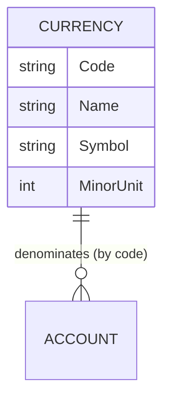

# Currencies

## Table of Contents

- [Purpose](#purpose)
- [Key Entities](#key-entities)
- [Constraints](#constraints)
- [Business Rules & Invariants](#business-rules--invariants)
- [Integration Points](#integration-points)
- [Edge Cases & Known Gotchas](#edge-cases--known-gotchas)

## Purpose

A **Currency** is shared ISO-4217 reference data — code, display name, symbol, and how many decimal
places it uses. Currencies are **global**: they are not owned by any user, are seeded into the
database, and are read-only from the app's perspective. An account picks a currency at creation
time; that choice drives how the account's and its transactions' amounts are displayed.

## Key Entities

- **Currency** — `Code` (the primary key, e.g. `USD`), `Name` (e.g. "US Dollar"), `Symbol`
  (e.g. "$"), `MinorUnit` (decimal places, e.g. 2). **No `Id`, no `UserId`** — it is keyed by code
  and shared across everyone.

## Constraints

### MUST

- **Currencies are read-only reference data — the app never creates, updates, or deletes them.**
  - **Why**: They are a stable, standardized lookup (ISO-4217). Letting users edit them would let one
    user's change affect everyone and could desync codes from the standard.
  - **Enforced in**: there is no repository and no write endpoint — only `GET /api/currencies` via
    `ICurrencyReadService` (`GetAllAsync` / `GetByCodeAsync`). Rows are seeded by migration.

- **Every account's currency code must resolve to a seeded currency.**
  - **Why**: The currency supplies the symbol and decimal precision used to display every amount on
    the account and its transactions. A missing currency breaks display and indicates a broken
    invariant.
  - **Enforced in**: validated at account creation (`CreateAccountHandler`); a missing currency at
    transaction-display time throws `InvalidOperationException` in `CreateTransactionHandler` (fail
    loud — see gotcha below).

## Business Rules & Invariants

- **Rule**: `Code` is normalized to uppercase and must be exactly 3 ASCII letters (A–Z).
- **Why**: This is the ISO-4217 code shape; normalizing on the way in makes lookups
  case-insensitive and reliable.
- **Enforced in**: `Currency.Create` (`NormalizeCode` + `ValidateOrThrow`) in `Domain/Currencies/Currency.cs`.
- **Example**: `"usd"` normalizes to `"USD"`; `"US"` or `"US1"` is rejected.
- **Source**: `[SOURCE: code-audit]`

---

- **Rule**: `Name` is required and ≤ 100 characters; `Symbol` is required and ≤ 8 characters;
  `MinorUnit` is an integer between 0 and 4 inclusive.
- **Why**: Name and symbol are display fields with sane length bounds. `MinorUnit` is the number of
  decimal places for the currency (0 for JPY, 2 for USD, up to 4 for some) — outside 0–4 is not a
  real-world currency precision.
- **Enforced in**: `Currency.Create` → `ValidateOrThrow`.
- **Example**: `Code="JPY", Name="Japanese Yen", Symbol="¥", MinorUnit=0` is valid.
- **Source**: `[SOURCE: code-audit]`

## Integration Points

- **[Accounts](accounts.md)**: an account references a currency by code; the account create handler
  validates the code and denormalizes name/symbol/minor-unit into the account response.
- **[Transactions](transactions.md)**: transaction responses carry the account's currency code and
  symbol so lists render amounts consistently with the account view.

## Edge Cases & Known Gotchas

- **Referenced by code, not by GUID**: unlike every user-owned entity, a currency is joined by its
  3-letter `Code`. Don't expect a currency `Id`.
- **A missing seeded currency is a schema failure, not user error**: if an account's currency code
  has no matching row, transaction creation throws `InvalidOperationException` rather than guessing a
  symbol. The design chooses to fail loudly so the create-response and the list-view never disagree
  on how an amount is shown. If you add currencies, seed them via migration.
