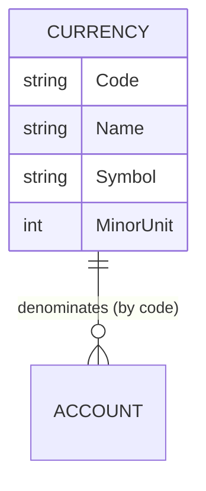

# Currencies

## Table of Contents

- [Purpose](#purpose)
- [Key Entities](#key-entities)
- [Constraints](#constraints)
- [Business Rules & Invariants](#business-rules--invariants)
- [Workflows & State Transitions](#workflows--state-transitions)
- [Decision Trees](#decision-trees)
- [Integration Points](#integration-points)
- [Edge Cases & Known Gotchas](#edge-cases--known-gotchas)

## Purpose

A **Currency** is shared ISO-4217 reference data — code, display name, symbol, and how many decimal
places it uses. Currencies are **global**: they are not owned by any user or budget, are seeded into
the database, and are read-only from the app's perspective. They are the only reference table shared
across every budget. An account picks a currency at creation time; that choice drives both the
precision the account's and its transactions' amounts may carry and how those amounts are displayed.

## Key Entities

- **Currency** — `Code` (the primary key, e.g. `USD`), `Name` (e.g. "US Dollar"), `Symbol`
  (e.g. "$"), `MinorUnit` (decimal places, e.g. 2). **No `Id`, no `BudgetId`** — it is keyed by code
  and shared across everyone.

```mermaid
erDiagram
    CURRENCY ||--o{ ACCOUNT : "denominates (by code)"
    CURRENCY {
        string Code
        string Name
        string Symbol
        int MinorUnit
    }
```

## Constraints

### MUST

- **Currencies are read-only reference data — the app never creates, updates, or deletes them.**
  - **Why**: They are a stable, standardized lookup (ISO-4217). Letting users edit them would let one
    user's change affect everyone and could desync codes from the standard.
  - **Enforced in**: there is no repository and no write endpoint — only `GET /api/currencies` via
    `ICurrencyReadService` (`GetAllAsync` / `GetByCodeAsync`). Rows are seeded by migration.

- **Every account's currency code must resolve to a seeded currency.**
  - **Why**: The currency supplies the symbol every amount on the account and its transactions is
    displayed with, and the decimal precision each of them is validated against before it is stored.
    A missing currency leaves nothing to validate against, breaks display, and indicates a broken
    invariant.
  - **Enforced in**: the `accounts.currency_code → currencies.code` foreign key on `Restrict`
    (`AccountConfiguration`), which refuses both a dangling code on write and the deletion of a
    currency any account uses. `CreateAccountHandler` looks the code up first via
    `ICurrencyReadService.GetByCodeAsync` so the caller gets a validation error rather than a
    constraint violation, but the foreign key is what makes the guarantee hold for every write path.

## Business Rules & Invariants

- **Rule**: `Code` is normalized to uppercase and must be exactly 3 ASCII letters (A–Z).
- **Why**: This is the ISO-4217 code shape; normalizing on the way in makes lookups
  case-insensitive and reliable.
- **Enforced in**: `CK_currencies_code` (`code ~ '^[A-Z]{3}$'`) and `Currency.Create`
  (`NormalizeCode` + `ValidateOrThrow`) in `Domain/Currencies/Currency.cs`, which is also the only
  layer that *normalizes* — the constraint rejects `usd`, it does not fold it to `USD`. This
  constraint earns its place on narrower grounds than the schema's others, and the narrowness is
  worth knowing: `varchar(3)` already bounds the length, so all the regex adds is the ISO-4217
  shape, and the only row it stops is one that never went through `Currency.Create` — inserted by
  hand, or by `migrationBuilder.InsertData`, as `'usd'`. `GetByCodeAsync` upper-cases its input
  before matching, so such a row would sit in the table permanently unfindable: a silently broken
  currency rather than a loud error. "Currencies are seeded, so the domain always runs" is a weaker
  reply than it looks — `HasData` is not the only way a row reaches this table, and correcting a
  symbol directly against production is an ordinary thing to do.
- **Example**: `"usd"` normalizes to `"USD"`; `"US"` or `"US1"` is rejected.
- **Counterexample**: matching the code as given makes `GetByCodeAsync("usd")` miss the seeded
  `USD` row, so account creation rejects a currency that plainly exists. `Code` is the primary key,
  so an unnormalized seed would be worse still: two rows for one currency, and accounts joining
  whichever they happened to reference. `CK_currencies_code` is what closes that second door — the
  lower-case row is refused rather than accepted and then never found.
- **Source**: `[SOURCE: discussion — 2026-07-26]`

---

- **Rule**: `Name` is required and ≤ 100 characters; `Symbol` is required and ≤ 8 characters;
  `MinorUnit` is an integer between 0 and 4 inclusive.
- **Why**: Name and symbol are display fields with sane length bounds. `MinorUnit` is the number of
  decimal places for the currency (0 for JPY, 2 for USD, 3 for BHD and KWD) — outside 0–4 is not a
  real-world currency precision. `MinorUnit` is also the only one of the three that changes a
  number rather than a label: it is what every amount on an account is validated against and
  presented at, so a bad value either refuses money the currency can express or accepts money it
  cannot, instead of producing a visibly broken row.
- **Enforced in**: `CK_currencies_minor_unit` (`minor_unit between 0 and 4`) owns the precision
  bound, and `Currency.Create` → `ValidateOrThrow` restates it for the message. The bound is not an
  arbitrary sanity range — its ceiling is the scale of the money columns `accounts.opening_balance`
  and `transactions.amount`, both `numeric(14,4)`, so the two numbers move together and changing one
  without the other is the mistake this constraint exists to catch. The length bounds
  need no check of their own — `varchar(100)` and `varchar(8)` *reject* an over-long value with
  `22001` rather than truncating it, which is enforcement in the sense
  [ADR 0002](../decisions/0002-enforce-rules-at-the-lowest-capable-layer.md) means. What stays
  domain-owned is non-blankness: `NOT NULL` refuses a null name or symbol but accepts a
  whitespace-only one, and `ValidateOrThrow` is the only layer that reads `"   "` as absent.
- **Example**: `Code="JPY", Name="Japanese Yen", Symbol="¥", MinorUnit=0` is valid.
- **Counterexample**: widening `CK_currencies_minor_unit` to accept 5 so a currency with five decimal
  places can be seeded, without widening `numeric(14,4)` underneath it. Nothing fails at seed time
  and nothing fails on the way in: `Account.Create` accepts `0.00001` because the currency now claims
  five places, and the column then rounds it to `0.0000` and raises nothing. The amount the user
  typed is silently gone, and the currency they were promised is one the schema cannot store — which
  is why the ceiling is the column's scale rather than an arbitrary sanity bound, and why the two
  numbers have to move together.
- **Source**: `[SOURCE: discussion — 2026-07-26]`

---

- **Rule**: `MinorUnit` bounds the decimal places of every `accounts.opening_balance` and
  `transactions.amount` recorded in that currency, and that rule is **domain-owned by necessity**
  rather than by preference.
- **Why**: Precision is a property of the currency, not a constant: a yen has no sub-unit and a
  dinar has three, so a fixed two places both accepts money that does not exist (half a yen) and
  refuses money that does (a dinar's smallest unit). Enforcing it lower would mean checking each row
  against the `currencies` row it references, which PostgreSQL can only do procedurally, in a
  trigger — the one thing
  [ADR 0002](../decisions/0002-enforce-rules-at-the-lowest-capable-layer.md) rules out even where
  the database *could* hold the rule. What the schema owns instead is the envelope: the column scale
  bounds what is representable and `CK_currencies_minor_unit` bounds what a currency may claim, and
  the domain picks the right value inside it. The scale coerces rather than rejects — it stores three
  places against a two-place currency without complaint — so the rejection has nowhere lower to go
  either. This is a rule deliberately sitting above its nominally lowest layer, and this paragraph is
  the reason, so that the next reader does not read the gap as an oversight and start writing
  triggers.
- **Enforced in**: `Account.Create`, `Account.Update`, `Transaction.Create` and `Transaction.Update`
  each take an `int minorUnit` and reject any amount `decimal.Round` would change, wording the error
  from it ("Amount must be a whole number." at 0, "…no more than N decimal places." above it).
  `CreateAccountHandler`, `UpdateAccountHandler`, `CreateTransactionHandler` and
  `UpdateTransactionHandler` read it from `ICurrencyReadService`. It is always **the account's own**
  currency, and an account's currency never changes — but a transaction's does, because an edit can
  move it to an account denominated differently, so `UpdateTransactionHandler` resolves the currency
  from the account the transaction will *end up* on rather than the one it came from (see
  [transactions.md](transactions.md#edge-cases--known-gotchas)). A value outside 0–4 is an
  `ArgumentOutOfRangeException`, not a validation error: it could only come from a `currencies` row
  `CK_currencies_minor_unit` would have refused, so it is a broken caller rather than something a
  user typed.
- **Example**: a JPY account refuses `1000.5` with "Opening balance must be a whole number."; a BHD
  account accepts `0.125` and refuses `0.1255`.
- **Counterexample**: rounding every amount to the widest precision any currency may declare. It
  moves the falsehood rather than removing it — a USD account would accept `10.0001`, which is not
  money in the currency that account is denominated in.
- **Source**: `[SOURCE: discussion — 2026-07-28]`

## Workflows & State Transitions

A Currency has no lifecycle: rows arrive by migration seed and are only ever read. There is nothing
to transition between.

## Decision Trees

None. Nothing branches on a currency's own state, because a currency has none. Every conditional
that *involves* a currency belongs to the entity referencing it and is documented there — resolving
the code and its minor unit while creating or updating an account
([accounts.md](accounts.md#decision-trees)), and while creating or editing a transaction
([transactions.md](transactions.md#decision-trees)).

## Integration Points

- **[Accounts](accounts.md)**: an account references a currency by code; the account create handler
  validates the code and denormalizes name/symbol/minor-unit into the account response. Both the
  create and update handlers validate the opening balance's precision against the minor unit.
- **[Transactions](transactions.md)**: the create and update handlers each resolve the account's
  currency to validate the amount's precision — the update handler against the account the
  transaction will end up on, which is what lets a move between differently denominated accounts
  refuse an amount that was valid before it. Transaction responses carry the account's currency code
  and symbol so lists render amounts consistently with the account view.
- **[Budgets](budgets.md)**: `budgets.base_currency_code` references this table by code with a
  `Restrict` foreign key. Nothing writes that column — it is null on every budget — so no currency
  is currently held in place by a budget.

## Edge Cases & Known Gotchas

- **Referenced by code, not by GUID**: unlike every budget-owned entity, a currency is joined by its
  3-letter `Code`. Don't expect a currency `Id`.
- **No query filter applies to currencies, and none should**: they are shared reference data, so a
  budget-scoped filter would hide the list from every request. Do not treat the absence of a filter
  here as precedent for the budget-owned entities.
- **The missing-currency failure paths are unreachable, and are assertions rather than error
  handling**: `CreateTransactionHandler`, `UpdateTransactionHandler` and `UpdateAccountHandler` each
  throw `InvalidOperationException` when an account's currency has no row — the first two rather than
  guessing a symbol, the third rather than validating a balance against a precision it does not know
  — and `AccountReadService` inner-joins currencies rather than left-joining. The foreign key is what
  makes them safe — no account can carry a code with no row, and no currency in use can be deleted —
  so none of these paths can fire against a healthy schema. Read them as statements of that
  invariant, not as handling for a state the database permits, and do not soften any of them into a
  fallback symbol. If you add currencies, seed them via migration.
