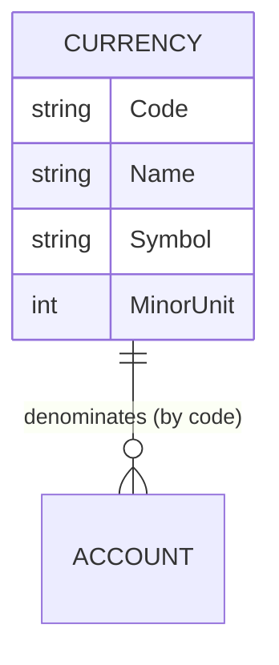

# Currencies

## Table of Contents

- [Purpose](#purpose)
- [Key Entities](#key-entities)
- [Constraints](#constraints)
- [Business Rules & Invariants](#business-rules--invariants)
- [Workflows & State Transitions](#workflows--state-transitions)
- [Integration Points](#integration-points)
- [Edge Cases & Known Gotchas](#edge-cases--known-gotchas)

## Purpose

A **Currency** is shared ISO-4217 reference data — code, display name, symbol, and how many decimal
places it uses. Currencies are **global**: they are not owned by any user or budget, are seeded into
the database, and are read-only from the app's perspective. They are the only reference table shared
across every budget. An account picks a currency at creation time; that choice drives how the
account's and its transactions' amounts are displayed.

## Key Entities

- **Currency** — `Code` (the primary key, e.g. `USD`), `Name` (e.g. "US Dollar"), `Symbol`
  (e.g. "$"), `MinorUnit` (decimal places, e.g. 2). **No `Id`, no `BudgetId`** — it is keyed by code
  and shared across everyone.

```mermaid
erDiagram
    CURRENCY ||--o{ ACCOUNT : "denominates (by code)"
    CURRENCY {
        string Code
        string Name
        string Symbol
        int MinorUnit
    }
```

## Constraints

### MUST

- **Currencies are read-only reference data — the app never creates, updates, or deletes them.**
  - **Why**: They are a stable, standardized lookup (ISO-4217). Letting users edit them would let one
    user's change affect everyone and could desync codes from the standard.
  - **Enforced in**: there is no repository and no write endpoint — only `GET /api/currencies` via
    `ICurrencyReadService` (`GetAllAsync` / `GetByCodeAsync`). Rows are seeded by migration.

- **Every account's currency code must resolve to a seeded currency.**
  - **Why**: The currency supplies the symbol and decimal precision used to display every amount on
    the account and its transactions. A missing currency breaks display and indicates a broken
    invariant.
  - **Enforced in**: the `accounts.currency_code → currencies.code` foreign key on `Restrict`
    (`AccountConfiguration`), which refuses both a dangling code on write and the deletion of a
    currency any account uses. `CreateAccountHandler` looks the code up first via
    `ICurrencyReadService.GetByCodeAsync` so the caller gets a validation error rather than a
    constraint violation, but the foreign key is what makes the guarantee hold for every write path.

## Business Rules & Invariants

- **Rule**: `Code` is normalized to uppercase and must be exactly 3 ASCII letters (A–Z).
- **Why**: This is the ISO-4217 code shape; normalizing on the way in makes lookups
  case-insensitive and reliable.
- **Enforced in**: `Currency.Create` (`NormalizeCode` + `ValidateOrThrow`) in `Domain/Currencies/Currency.cs`.
- **Example**: `"usd"` normalizes to `"USD"`; `"US"` or `"US1"` is rejected.
- **Counterexample**: matching the code as given makes `GetByCodeAsync("usd")` miss the seeded
  `USD` row, so account creation rejects a currency that plainly exists. `Code` is the primary key,
  so an unnormalized seed would be worse still: two rows for one currency, and accounts joining
  whichever they happened to reference.
- **Source**: `[SOURCE: discussion — 2026-07-26]`

---

- **Rule**: `Name` is required and ≤ 100 characters; `Symbol` is required and ≤ 8 characters;
  `MinorUnit` is an integer between 0 and 4 inclusive.
- **Why**: Name and symbol are display fields with sane length bounds. `MinorUnit` is the number of
  decimal places for the currency (0 for JPY, 2 for USD, up to 4 for some) — outside 0–4 is not a
  real-world currency precision.
- **Enforced in**: `Currency.Create` → `ValidateOrThrow`.
- **Example**: `Code="JPY", Name="Japanese Yen", Symbol="¥", MinorUnit=0` is valid.
- **Source**: `[SOURCE: discussion — 2026-07-26]`

## Workflows & State Transitions

A Currency has no lifecycle and no branching logic: rows arrive by migration seed and are only ever
read. There is nothing to transition and no decision tree to document — the only conditional
behaviour that touches currencies belongs to the entities that reference them, in
[accounts.md](accounts.md#decision-trees) and [transactions.md](transactions.md#decision-trees).

## Integration Points

- **[Accounts](accounts.md)**: an account references a currency by code; the account create handler
  validates the code and denormalizes name/symbol/minor-unit into the account response.
- **[Transactions](transactions.md)**: transaction responses carry the account's currency code and
  symbol so lists render amounts consistently with the account view.
- **[Budgets](budgets.md)**: `budgets.base_currency_code` references this table by code with a
  `Restrict` foreign key. Nothing writes that column — it is null on every budget — so no currency
  is currently held in place by a budget.

## Edge Cases & Known Gotchas

- **Referenced by code, not by GUID**: unlike every budget-owned entity, a currency is joined by its
  3-letter `Code`. Don't expect a currency `Id`.
- **No query filter applies to currencies, and none should**: they are shared reference data, so a
  budget-scoped filter would hide the list from every request. Do not treat the absence of a filter
  here as precedent for the budget-owned entities.
- **The missing-currency failure paths are unreachable, and are assertions rather than error
  handling**: `CreateTransactionHandler` throws `InvalidOperationException` instead of guessing a
  symbol when an account's currency has no row, and `AccountReadService` inner-joins currencies
  rather than left-joining. The foreign key is what makes both safe — no account can carry a code
  with no row, and no currency in use can be deleted — so neither path can fire against a healthy
  schema. Read them as statements of that invariant, not as handling for a state the database
  permits, and do not soften either into a fallback symbol. If you add currencies, seed them via
  migration.
