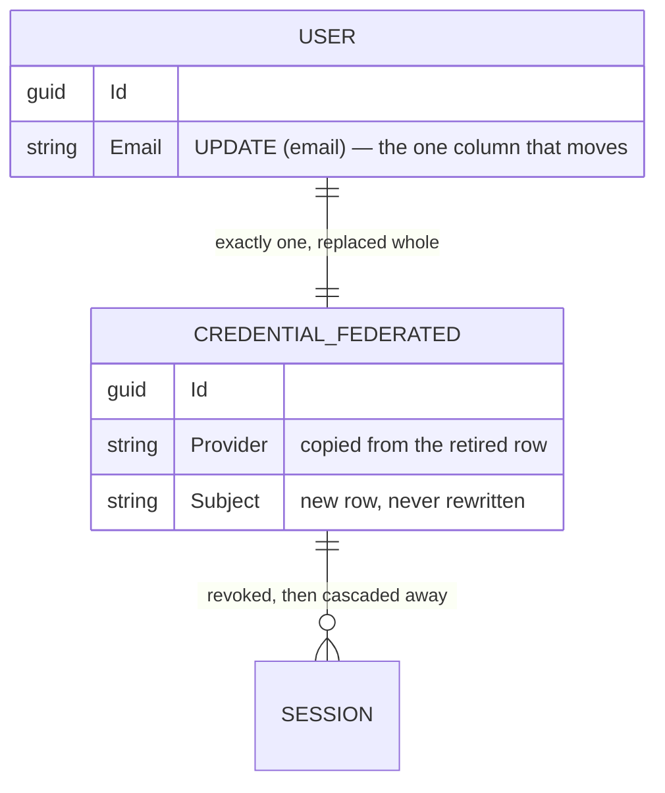
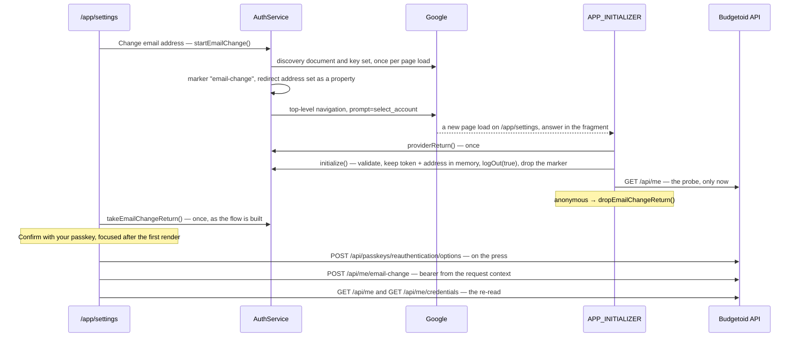

# Email Change

## Table of Contents

- [Purpose](#purpose)
- [Key Entities](#key-entities)
- [Constraints](#constraints)
- [Business Rules & Invariants](#business-rules--invariants)
- [Workflows & State Transitions](#workflows--state-transitions)
- [Decision Trees](#decision-trees)
- [Integration Points](#integration-points)
- [Edge Cases & Known Gotchas](#edge-cases--known-gotchas)

## Purpose

The email change moves an existing account to the Google identity and address a fresh provider
sign-in asserts. It is the one route besides the two registration routes that reads a provider token,
and the one path in the product that writes `users.email` after the account exists. It creates no account:
`RegisterAccountHandler` is still the only code that brings one into existence, and nothing here
inserts a `users` row.

**Both halves are built.** `POST /api/me/email-change` answers, and the integration suite drives it
end to end. On `/app/settings`, **Change email address** sends the tab to Google's account chooser,
Google redirects back to `/app/settings`, and **Confirm with your passkey** sends the one changing
request. The rules run server first and client second: the client's start at *The trip to Google*
under *Business Rules & Invariants*, each with the spec that holds it. What the screen looks like is
the **Changing the email address** chapter of [components.md](../design/components.md).

The act asks for **three proofs at once, and each has one owner**: a full session, a provider token
judged beside it, and a fresh passkey assertion. The rules, the order they run in, and what each
refusal leaves behind live here rather than being split across
[users-and-ownership.md](users-and-ownership.md), [sessions.md](sessions.md) and
[passkeys.md](passkeys.md), which point at this file.

## Key Entities

The change owns no table. It moves rows that already exist:

- **`FederatedIdentityChange`** — a *decision*, never an act. `Decide` compares the provider's
  subject and address with the account's stored federated credential and address, and answers one
  of three shapes: nothing to do (`IsNoChange`), an address to move with the credential kept, or a
  credential to retire (`Retired`) and a replacement to file (`Filed`) beside the address. It
  touches neither the `User` nor the `Credential` it was asked about.
- **`EmailChangeOutcome`** — what one save came to: `SubjectTaken` (`0`, so `default` is a refusal),
  `Applied`, `EmailTaken`, `FederatedCredentialMoved`. `EmailTaken` is ambiguous by construction,
  exactly as registration's is.
- **`IEmailChangeRepository`** / **`EmailChangeRepository`** — two reads, both keyed on the account
  id the session names, and one save.
- **`ProviderAuthorizationGate.VouchedIdentity`** — the subject and address the provider's token
  carried, as the gate judged them. Set on `HttpContext.Features` by the gate and read by the route
  through `ProviderAuthorizationGate.IdentityOf`, which throws when the gate is absent.
- **`EmailChange`** — the response, `{"sessionsEnded": n}`.



Deliberately **absent** from the request: a subject, an address, or an account id. The body carries
the five members of a passkey assertion and nothing else. Deliberately **absent** from the response:
the new address, the new subject and any identifier. The caller sent the first two, and a value in a
response body is a value in a log.

## Constraints

### MUST

- **Be authenticated by a live full session**, on the fallback policy. A session opened by the
  federated credential answers `403`, and a provider token with no session answers the fallback's
  own `401`. → the three-proofs rule below.
- **Carry a provider token the provider scheme validates**, with a usable `sub` and `email` and the
  address asserted as verified — judged by `ProviderAuthorizationGate`, never by a policy. → the
  two-principals rule below.
- **Carry a fresh passkey assertion over a `reauthentication` challenge**, for a passkey registered
  to the account the session names. → the passkey rule below.
- **Judge the provider token before the passkey**, so a refused token spends no nonce. → the order
  rule below.
- **Write the retired credential's delete, the replacement's insert and the address in one save,
  inside one transaction with the session sweep.** → the one-save rule below.
- **Revoke the retired credential's sessions before deleting it**, and report how many ended.
  → the sweep rule below.

### MUST NOT

- **Read the new subject or address from anywhere but the provider's principal** — not from
  `HttpContext.User`, whose `sub` is the account id, and not from the body.
- **Merge the provider's principal into the session's.** → the two-principals rule below.
- **Return a refusal from the transactional delegate.** Every refusal throws, or the sweep commits
  behind it. → the one-save rule below.
- **Rewrite a credential's subject in place.** `credentials` holds no `UPDATE` grant of any shape.
- **Name an account in the command.** The account is the session's, read from `IUserContext`.
- **Name the address or the subject in any refusal body.**

## Business Rules & Invariants

- **Rule**: Three proofs, three owners, and none stands in for another. The **session** is the
  fallback policy's: cookie scheme, `RequireAuthenticatedUser`, `FullSessionRequirement`. The
  **provider token** is `ProviderAuthorizationGate`'s, an endpoint filter the route adds through
  `RequireProviderAuthorization()`. The **passkey** is `PasskeyReauthentication`'s, called at the
  top of `ChangeEmailHandler`.
- **Why**: each proves something the other two cannot.
  - **The session** says which account is being changed. It is also the only one of the three the
    product can end, and the only one that carries a kind — a session a federated sign-in opened
    must not reach this route, because the Google identity is exactly what such a session holds.
  - **The provider token** says the person controls the Google identity and the address being moved
    to, *now*. Nothing else in the product can vouch for an address.
  - **The passkey** says the person holding the session is the account's owner. See the passkey rule
    below for why a session is not enough on its own.
- **Enforced in**: the route declares no policy and no scheme, so it inherits the fallback — see
  `EmailChangeEndpoints` and `ProviderAuthorizationEndpointExtensions.RequireProviderAuthorization`.
  `EmailChangeEndpointTests` holds each proof's absence separately:
  - `EmailChange_WithAProviderTokenAndNoSession_IsRefused401_AndChangesNothing` — a valid token and a
    valid assertion, no cookie: the fallback's `401`, with **no** `refusal` member.
  - `EmailChange_ForALockedSession_IsRefused403_WhileAFullSessionOnTheSameAccountSucceeds` — the
    same account, a locked session refused `403` and a full one answered `200`.
  - `EmailChange_WithAFullSessionAndNoProviderToken_IsRefused401ProviderToken_AndChangesNothing` and
    `EmailChange_WithAnInvalidPasskeyAssertion_IsRefused401Assertion_AndChangesNothing` for the
    other two.
  - `EmailChange_WithoutTheClientHeader_IsRefused403` for the first-party control in front of all
    three.
- **Source**: `[SOURCE: user-story]`

---

- **Rule**: The provider's principal and the session's principal meet on this one request and are
  **never merged**. The gate calls `AuthenticateAsync(ProviderAuthentication.SchemeName)` itself and
  judges *that* result. `HttpContext.User` stays the session's for the whole request.
- **Why**: the session principal's `sub` is this installation's account id; the provider
  principal's `sub` is a Google subject. Two claims of one name with two meanings on one request is
  the whole hazard.
  - **A filter that read `HttpContext.User` would find a usable `sub`** — the account's own id — and
    file a credential under it. It would answer `200`.
  - **A policy naming both schemes would merge them.** `AuthorizationMiddleware` combines the
    principals of every scheme a policy names into `HttpContext.User`, and a merged principal carries
    two `sub` claims; whichever a reader found first would decide whose identity was filed. Naming a
    scheme on the route would also take it off the fallback policy and its `FullSessionRequirement`.
    [ADR 0027](../decisions/0027-authenticate-the-email-change-on-the-session-and-a-fresh-provider-token-side-by-side.md)
    records the alternatives.
  - **`AuthenticateAsync` returns a result and replaces nothing**, which is why the session stays the
    request's identity for everything after the gate.
- **Enforced in**: `ProviderAuthorizationGate.InvokeAsync`, which sets a `VouchedIdentity` on
  `HttpContext.Features`; the route reads it through `IdentityOf` and nowhere else.
  `EmailChangeRequest` has no member for a subject or an address.
  `EmailChange_WithANewSubjectAndAddress_StoresBothFromTheProviderToken` asserts the filed subject is
  **not** the account id before it asserts it is the token's — the trap first.
  `EmailChange_TheRequestBodyCannotCarryAnAddressOrSubject` sends both in the body and asserts
  neither landed and the token's did. `FederatedIdentityChangeTests` asserts the same "not the
  account id" at the domain.
- **Counterexample**: `httpContext.User.FindFirstValue("sub")` in the route delegate. It compiles,
  every status is right, and every account moves to a "Google identity" equal to its own id.
- **Source**: `[SOURCE: discussion]`

---

- **Rule**: Which routes reach the provider scheme is readable off the route table, through a marker.
  `RequireProviderAuthorization()` adds `RequiresProviderAuthorizationMetadata` and the gate as one
  act, and the marker's constructor is `internal`, so nothing outside `Api` can add it alone.
- **Why**: an endpoint filter is a delegate, not metadata. A dump of the email change's
  `RouteEndpoint.Metadata` shows the handler's method, binding and response metadata and the marker,
  and no trace of the filter type (measured, as `RegistrationRouteTests` records). Without the
  marker, a census of which routes reach the provider scheme would read the registration group's
  policy and miss this route entirely.
- **Enforced in**: `RegistrationRouteTests.TheProviderScheme_IsReachedByExactlyTheRegistrationRoutesAndTheEmailChange`
  pins two sets, each against a written-out list: the routes whose policy names the provider scheme
  (the two registration routes), and the routes carrying the marker (`/api/me/email-change`). A
  registration route that moved onto the gate, or this route moving into a policy, is a red in both.
  It also pins the fallback's own schemes to the session cookie's alone.
  - **What it cannot see**: a route whose own code calls `AuthenticateAsync` with the provider scheme,
    or adds `ProviderAuthorizationGate` directly without the marker. Review holds that.
- **Source**: `[SOURCE: discussion]`

---

- **Rule**: The provider's claims are judged by **one** definition, `ProviderClaims.RefusalFor`,
  shared with `RegistrationClaimGate`: a non-blank `sub` and `email`, and `email_verified` read by
  `bool.TryParse` as `true`. The missing-claim check runs first.
- **Why**: two copies of three checks is how one gate starts admitting `"1"` as verified while the
  other refuses it. The verdict is shared; the response is not. Registration answers by title
  alone; this route answers with a `refusal` word, because here a `401` has three causes with three
  different next steps — sign in to Google again, choose an address Google verifies, retry the
  passkey.
- **Enforced in**: `ProviderAuthorizationGate` maps `ProviderClaims.Refusal.MissingClaims` and a
  failed authentication to `refusal: "provider_token"`, and `UnverifiedEmail` to
  `refusal: "email_unverified"`, each under its own title. `EmailChangeEndpointTests` drives the
  real `JwtBearer` handler for the bearer-shaped cases:
  - `EmailChange_WithAProviderTokenTheBearerHandlerRejects_IsRefused401ProviderToken_AndChangesNothing`
    — a forged signature, a wrong audience, an expired token and a wrong issuer.
  - `EmailChange_WithAProviderTokenTheBearerHandlerValidates_StoresItsSubjectAndAddress` is the
    control, without which a filter refusing every bearer would pass the four above.
  - `EmailChange_WithoutSubOrEmailClaims_IsRefused401ProviderToken` and
    `EmailChange_WithABlankSubOrEmailClaim_IsRefused401ProviderToken` for the claim shapes, and
    `EmailChange_WhenTheProviderDoesNotVerifyTheAddress_IsRefused401EmailUnverified_AndChangesNothing`
    for `"false"` and an absent claim.
- **Source**: `[SOURCE: user-story]`

---

- **Rule**: The change is also authorized by a **fresh passkey assertion** over a
  `reauthentication` challenge, exactly as erasure is. The gate runs first in the handler, to
  completion, **outside** the transactional delegate, and publishes no identity.
- **Why**: a stolen full-session cookie plus the attacker's own Google account is otherwise enough
  to re-point the account's Google identity and address at the attacker. The session proves only
  that *somebody* holds the cookie; the provider token proves only that the *caller* controls the
  Google account they chose, which the attacker does. Neither says the caller is the account's
  owner. This gate was added above the story's acceptance criteria, by decision — see
  [the decision log](_decision-log.md).
  - **Outside the delegate**, for erasure's two reasons, which `ChangeEmailHandler` repeats at the
    call: the nonce must stay spent when the change rolls back, and the delegate is replayed by the
    execution strategy, where a second consume would refuse a valid request.
  - **First in the handler**, because the next statement is the subject pre-check, which asks the
    exempt discovery lookup whether a Google identity holds an account. Asked by an unproven caller,
    that lookup is an oracle for which Google identities hold accounts.
  - **No identity is published**, for the reason [passkeys.md](passkeys.md) gives on the
    re-authentication ceremony: `PasskeyReauthentication` takes `IUserContext` and looks the key up
    owner-scoped, so another account's passkey answers nothing.
- **Enforced in**: `ChangeEmailHandler.HandleAsync`, its first call.
  `ChangeEmailHandlerTests.HandleAsync_WhenTheAssertionFails_ReadsAndWritesNothing` asserts that a
  refused assertion reaches no lookup, no repository, no executor and no sweep.
  `EmailChange_WithAnotherAccountsPasskey_IsRefused401Assertion_AndChangesNeitherAccount` asserts
  both accounts survive.
- **Counterexample**: dropping the gate because "the provider already re-authenticated them". The
  provider re-authenticated whoever holds the Google account they chose, which is not the question.
- **Source**: `[SOURCE: discussion]`

---

- **Rule**: The provider token is judged **before** the passkey. A refused token spends no
  challenge.
- **Why**: the passkey gate consumes its nonce whatever happens next. A person told their Google
  sign-in lapsed has to be able to sign in again and retry with the assertion they already made. The
  reverse order would spend it on every provider refusal and make them run the ceremony twice.
- **Enforced in**: the pipeline order itself — an endpoint filter runs before the route delegate,
  and the passkey gate is inside the handler the delegate calls.
  `EmailChange_RefusedForItsProviderToken_LeavesThePasskeyChallengeUnspent` sends one assertion
  twice: refused `401 provider_token` with no token, then `200` with a valid one.
  - **The cost**: a filter runs after model binding, so a malformed body is a framework `400` before
    the token is looked at — the same accepted cost `RegistrationClaimGate` argues.
- **Source**: `[SOURCE: discussion]`

---

- **Rule**: A new subject is a credential **retired and one filed**, never a subject rewritten, and
  the delete, the insert and the address update land in **one save**.
- **Why**: `credentials` holds `INSERT` and `DELETE` and no `UPDATE` of any shape, so "replace" can
  only be delete plus insert. One save rather than two is what makes a refusal write nothing: split,
  the swap commits and the address is refused after it, and the account answers to a Google identity
  the caller was told did not attach.
  - **EF sends the `DELETE` ahead of the `INSERT`, and that is measured.**
    `IX_credentials_user_id_federated` allows one federated row per account, so an insert first would
    collide with the row about to go. A variant saving the insert ahead of the delete reddened seven
    of the fourteen cases in `EmailChangeRepositoryTests`, six on a `23505`.
  - **The address goes through `UPDATE (email)`**, the one column grant on `users`. `users.email`
    has two writers: registration's insert, and this route's `UPDATE (email)` through
    `User.ChangeEmail`. The repository loads the user and moves its one property, so EF emits an `UPDATE`
    naming `email` alone; a detached `Update(user)` would name every column and die with `42501` on
    `created_at_utc`.
  - **The replacement's provider is read off the retired row**, never named in `Decide`, so a
    replacement cannot be filed under an issuer the account did not already hold.
- **Enforced in**: `EmailChangeRepository.ApplyAsync`.
  `ApplyAsync_WithANewSubject_DeletesTheRetiredInsertsTheFiledAndUpdatesTheEmail_InOneSave` is the
  success path, and the case that goes red if an EF upgrade reorders the batch; it also reads
  `created_at_utc` back unchanged. `ApplyAsync_WithAnAddressOnlyChange_UpdatesOnlyTheEmail` asserts on
  the wire that one `UPDATE users` names `email` and not `created_at_utc`, and nothing touches
  `credentials`. `ApplyAsync_ToAnAddressAnotherAccountHolds_AnswersEmailTaken_AndChangesNothing`
  carries a new subject beside the taken address, so "nothing" covers the credential swap too. Every
  case runs on the least-privilege role, because a superuser skips the grant checks the design rests
  on.
- **Source**: `[SOURCE: user-story]`

---

- **Rule**: Retiring the federated credential **revokes its sessions, then deletes it**, and the
  response reports the count as `sessionsEnded`. The sweep is keyed on the **retired** credential.
  The requesting session was opened by a passkey and survives.
- **Why**: the rule every credential-removal path follows, from [sessions.md](sessions.md). The
  cascade from `credentials` removes the same session rows either way, so the count is the only
  evidence the sweep ran. Keyed on the filed credential it would report zero; keyed on the account
  it would sign the person out of the browser in their hand.
  - **A second `DiscardTrackedEntities()` sits between the sweep and the save.** The sweep loads the
    retired credential's sessions into the change tracker; removing the credential with them tracked
    makes EF emit its own `DELETE FROM sessions`, on a table the role holds no `DELETE` on, and the
    request dies with `42501`. The answer is the discard, never a grant.
- **Enforced in**: `ChangeEmailHandler`, through `RevokeSessionsForCredentialHandler`.
  `HandleAsync_WithANewSubject_RevokesTheRetiredCredentialsSessionsBeforeApplying` compares the call
  order and names the swept credential. `HandleAsync_WithANewSubject_ReportsTheSessionsItEnded` seeds
  three sessions on the retired credential and one on the passkey, and requires `3` and the passkey's
  session live. `EmailChange_ReplacingTheCredential_EndsTheSessionsTheRetiredCredentialOpened_AndReportsThem`
  does it end to end and reads `GET /api/me` on the requesting session afterwards.
  - **No unit test pins the second discard** — the fakes have no change tracker, as the handler says
    at the call. Two endpoint tests do, measured: with the discard deleted,
    `EmailChange_ReplacingTheCredential_EndsTheSessionsTheRetiredCredentialOpened_AndReportsThem` and
    `EmailChange_ForALockedSession_IsRefused403_WhileAFullSessionOnTheSameAccountSucceeds` both went
    red with `42501`, from the EF cascade into the tracked sessions. Each seeds a session on the
    credential the change retires.
- **Source**: `[SOURCE: user-story]`

---

- **Rule**: The sweep and the save share **one transaction**, and every refusal leaves the delegate
  by **throwing**.
- **Why**: the sweep commits on a save of its own before the change is applied. A delegate that
  *returned* a refusal would hand the executor a commit of that sweep, signing the person's other
  browsers out of a Google credential the response says is still theirs.
  - **Replay hygiene**: the delegate discards tracked entities as its first line, because the
    execution strategy replays it against a database that rolled back and a change tracker that did
    not.
- **Enforced in**: `ChangeEmailHandler`, with the argument on the class and at the throw.
  `HandleAsync_OnEmailTaken_WithTheSubjectNowHeldElsewhere_AnswersProviderIdentityInUse`,
  `HandleAsync_OnSubjectTaken_WithTheSubjectNowHeldByNobody_AnswersProviderIdentityInUse` and
  `HandleAsync_OnFederatedCredentialMoved_AnswersAccountIdentityMoved` each assert the executor
  committed nothing. `EmailChange_RefusedAfterTheSweepWouldRun_LeavesTheRetiredCredentialsSessionsLive`
  holds it end to end: a locked session on the retired credential, a taken address, a `409`, and the
  session still live. `HandleAsync_WhenTheUnitOfWorkIsReplayed_DiscardsTrackedEntitiesAtTheStartOfEveryAttempt`
  holds the replay discard, measured: with that first discard deleted it went red with `[]` against
  `[1,2]`.
- **Source**: `[SOURCE: discussion]`

---

- **Rule**: What counts as a change. The subject is compared **ordinally after trimming**; the
  address is compared **ordinally once normalised** through `Email.Create`. The same subject and the
  same address is **no change**: `200`, `sessionsEnded: 0`, nothing written. The same subject with a
  new address moves the address and **keeps** the credential and its sessions.
- **Why**: `CreateFederated` stored the subject trimmed, and the `sub` claim is case-sensitive, so a
  case-only difference is another Google identity. The address comparison is ordinal on purpose:
  the unique index's case-insensitive collation says who *else* may hold an address, not whether this
  one changed — re-casing one's own address is a change that lands. Ending sessions on an
  address-only change would sign a person out over a column no session depends on.
- **Enforced in**: `FederatedIdentityChange.Decide`, held by `FederatedIdentityChangeTests` —
  `Decide_SubjectDifferingOnlyInCase_IsANewSubject`, `Decide_SubjectWithSurroundingWhitespace_IsComparedAfterTrim`,
  `Decide_AddressDifferingOnlyInCase_IsAnAddressChange` and the rest.
  `EmailChange_ToTheAddressAlreadyStoredUnderTheSameSubject_Answers200AndWritesNothing` records every
  statement the API sends and finds no write to `users` or `credentials`.
  `EmailChange_ForTheSameSubjectWithANewAddress_KeepsTheCredentialAndUpdatesTheAddress` and
  `ApplyAsync_ToTheSameAddressInAnotherCase_OnTheSameAccount_Succeeds` cover the other two shapes.
- **Source**: `[SOURCE: user-story]`

---

- **Rule**: Three `409`s, each with its own `conflictKind`, and none names the address or the
  subject.
  - `provider_identity_in_use` — the chosen Google identity is attached to another account.
  - `email_already_linked` — the address is held by another account, and the chosen Google
    identity is attached to nobody else. Registration's member, for the same fact.
  - `account_identity_moved` — another change of this account's own Google credential landed between
    this request's read and its save.
- **Why**: the three have different next steps. The first two are both answered by choosing a
  different Google account, but tell the person different facts. The third is a timing fact: read the
  address back, and change it again only if it is not the one chosen. `ConflictKind` carries the
  argument for each.
  - **`provider_identity_in_use` is reached three ways**: a pre-check before any transaction opens,
    so the common case needs no sweep to roll back; a `SubjectTaken` save whose re-read finds another
    account on the subject, or nobody; and an `EmailTaken` save whose re-read finds another account.
  - **`SubjectTaken` and `EmailTaken` are both ambiguous, and a re-read of the subject settles
    each.** `EmailTaken` is ambiguous as registration's is: one save can breach the subject and the
    address at once, and PostgreSQL names one. `SubjectTaken` is ambiguous because the credential
    holding the subject can be this account's own: two confirms for the same new subject race, and
    the loser's `INSERT` meets `IX_credentials_provider_subject` before the other indexes (measured
    against PostgreSQL 17; that the order is the indexes' creation order is [Guessing]). The re-read
    runs inside the
    delegate, which works because EF takes a savepoint before a save inside an open transaction. The
    account's **own** id is never "another account": after `EmailTaken` it means the address alone
    collided; after `SubjectTaken` it means this account's identity moved under the request. A
    `SubjectTaken` whose re-read finds nobody still answers `provider_identity_in_use` — the
    database refused on a committed row, and "moved" would claim something nobody observed.
  - **`account_identity_moved` is reached three ways**: the retired row's `DELETE` matching nothing;
    the filed row's `INSERT` meeting the winner's replacement on `IX_credentials_user_id_federated`
    (measured); and a `SubjectTaken` whose re-read finds this account (measured).
  - **Not an enumeration oracle.** Reaching the subject lookup takes a full session, a passkey
    assertion and a provider token for that exact subject, so a caller can only ask about a Google
    identity they already control.
- **Enforced in**: `ChangeEmailHandler.RefusalFor` and the pre-check; `EmailChangeRepository.ApplyAsync`
  narrows each catch on a pinned constraint name, so any other `23505` escapes as a `500`.
  - End to end: `EmailChange_WithASubjectAnotherAccountIsFiledUnder_IsRefused409ProviderIdentityInUse_AndChangesNeitherAccount`
    and `EmailChange_ToAnAddressAnotherAccountHolds_IsRefused409EmailAlreadyLinked_AndChangesNeitherAccount`
    (exact and re-cased), each asserting the body names neither value.
    `EmailChange_WhenTheSameChangeOfThisAccountCommitsFirst_IsRefused409AccountIdentityMoved` commits
    a racing change of the same account mid-save and reads `account_identity_moved`, not
    `provider_identity_in_use`.
  - In the handler: `HandleAsync_WhenTheSubjectBelongsToAnotherAccount_RefusesBeforeTheTransaction`,
    the three kind tests above, `HandleAsync_OnEmailTaken_WithTheSubjectHeldByNobodyElse_AnswersEmailAlreadyLinked`
    and `HandleAsync_WithASubjectInSurroundingWhitespace_PreChecksAndReReadsTheTrimmedSubject`.
  - In the repository: `ApplyAsync_WithASubjectAnotherAccountHolds_AnswersSubjectTaken_AndChangesNeitherAccount`,
    `ApplyAsync_ToAnAddressAnotherAccountHoldsInAnotherCase_AnswersEmailTaken`,
    `ApplyAsync_WhenTheRetiredCredentialWasAlreadyDeleted_AnswersFederatedCredentialMoved`,
    `ApplyAsync_WhenARacingChangeAlreadyReplacedTheRetiredCredential_AnswersFederatedCredentialMoved`,
    `ApplyAsync_WhenAnotherUniqueRuleIsBroken_LetsTheViolationEscape` and
    `ApplyAsync_AfterARefusedSave_LeavesTheTransactionUsable` for the savepoint.
  - Which kind each site raises, in source order: the `ChangeEmailHandler` row of
    `ConflictKindDispositionCensusTests`.
- **Source**: `[SOURCE: user-story]`

---

- **Rule**: The account changed is the session's, and nothing else can name one. `ChangeEmailCommand`
  carries a subject, an address and an assertion. The credential read is scoped on the owner **and**
  the type.
- **Why**: `credentials` is exempt from row-level security, so the owner in the predicate is the only
  thing narrowing the read, and the credential it returns is the one the save deletes. The type keeps
  a passkey or a recovery-code credential from ever being handed to `Decide` as the one to retire.
  The delete that follows takes the loaded entity, which is what [ADR 0014](../decisions/0014-scope-the-credential-delete-in-the-application.md)
  requires of every credential delete.
- **Enforced in**: `EmailChangeRepository.FindFederatedCredentialAsync`, and `ChangeEmailHandler`
  reading `IUserContext.UserId`.
  `EmailChangeRepositoryTests.FindFederatedCredentialAsync_ReturnsOnlyThisAccountsFederatedCredential`
  seeds a stranger that sorts first and a passkey filed ahead of the account's federated row, so a
  read missing either predicate returns the wrong row. `EmailChange_ForOneAccount_LeavesAnotherAccountsFederatedCredentialWhereItWas`
  holds the isolation end to end. `HandleAsync_UsesTheSessionsAccountIdAndNeverAnIdFromTheCommand`
  asserts every port was handed the session's id and nothing else.
  `Decide_WhenCurrentBelongsToAnotherUser_Throws` and `Decide_WhenCurrentIsNotFederated_Throws` hold
  the same two rules again at the domain.
- **Source**: `[SOURCE: user-story]`

---

- **Rule**: An account with no federated credential, or a session naming no user row, is a `500` on
  purpose.
- **Why**: every account is registered with exactly one federated credential, so its absence is an
  integrity failure, not a request error. Nothing the caller sent is wrong and nothing they could
  send would help — the reasoning `RevokePasskeyHandler` applies to a missing manifest.
- **Enforced in**: `ChangeEmailHandler`, throwing `InvalidOperationException`.
  `HandleAsync_WhenTheAccountHoldsNoFederatedCredential_Throws`.
- **Source**: `[SOURCE: discussion]`

---

The rules from here down are the web client's.

- **Rule**: **The trip to Google.** A press of **Change email address** calls
  `AuthService.startEmailChange`, which prepares the provider client, marks the tab, points the
  client at `auth.google.emailChangeRedirectUri` and leaves the page through
  `initLoginFlow('', { prompt: 'select_account' })`. The return is recognised by
  `AuthService.providerReturn()`, and only when three things hold at once: the tab's marker names
  this trip, the page sits at exactly that trip's redirect address — origin and path — and the
  fragment carries an answer.
- **Why**: each piece closes one way of being wrong about which trip came back.
  - **One client, one preparation per page load.** `signIn` and `startEmailChange` share the memo
    `AuthService` keeps, so a page that came back from a registration and then starts an email
    change makes one discovery fetch, not two. The redirect address is written as a **property**
    after preparing, never through a second `configure()`, which would reset the login endpoint the
    discovery document taught the client. Because the property outlives the press, `signIn` writes
    the registration address back before it leaves.
  - **The marker carries the trip.** `budgetoid-provider-exchange` holds `email-change` for this
    trip and `started` for registration — the value a tab that left under the previous bundle still
    holds, which is why registration kept it. A marker from one trip beside the other trip's address
    is nobody's return.
  - **The marker is written only once the provider has been reached**, and removed again if the
    library refuses the departure, so a press that goes nowhere leaves nothing that makes a later
    load look like a return. With no redirect address configured the press answers `unavailable` and
    contacts nobody.
  - **The account chooser is asked for on every trip**, because the person is choosing an address.
- **Enforced in**: `auth-service.spec.ts`:
  - `startEmailChange leaves for the settings screen with the account chooser, marked as an email
    change`;
  - `signIn after startEmailChange on the same page load still returns to the registration screen`;
  - `startEmailChange answers unavailable and leaves no marker when the departure throws`, and the
    two siblings for no configured address and an unreachable provider;
  - the `providerReturn reads $shape as $expected` table, which crosses every marker with every
    address, including a longer path, an extended path and an extended host;
  - against the real library, `startEmailChange after a read and discarded registration answer
    leaves once, with a fresh nonce and no second fetch`.

  The address itself is pinned by `src/email-change-redirect-uri.spec.ts` over the **emitted**
  `app-config*.json`: declared, on `/app/settings`, on the registration address's origin, and never
  equal to the registration address.
- **Source**: `[SOURCE: user-story]`

---

- **Rule**: **The hand-off is memory only, taken once, and the address comes from claims the library
  validated.** On an email-change return, `AuthService.initialize()` reads the `id_token` off the URL
  before preparing, lets the library read the answer, and keeps an answer only when preparation
  succeeded **and** the token the library stored is the one on the URL. The address is then read
  from the claims the library decoded — the `email` member and nothing else, a non-empty string or
  nothing — and the token and the address go into one `#` field. Anything else is `unconfirmed`: a
  refusal, a nonce that does not match, an unreachable provider, a validated token asserting no
  address. Whatever it concluded, `initialize()` then runs `logOut(true)` and removes the marker.
  `takeEmailChangeReturn` hands the answer over once and a second call answers `null`;
  `dropEmailChangeReturn` discards it untaken.
- **Why**: the id token is a credential.
  - **A copy in any storage would outlive the page load that read it**, and a reload would hand it
    over a second time. Memory dies with the load, by construction.
  - **The library's copy goes at once, nonce included.** A nonce left behind by a failed return is
    exactly what a crafted answer would need, so the discard runs on every outcome, from a `finally`.
  - **The validated claims, never the raw fragment**, because anybody can write a fragment. Today
    the two readings name the same address — see the gotchas.
  - **`forgetProviderToken()` never touches the hand-off.** It empties the library's storage; the
    hand-off is this service's memory, and a session being published is no reason for the settings
    screen to lose an answer it has not read yet.
  - **`EmailChangeFlowService` takes it in its constructor**, not on a first read: the answer is read
    before the first route draws, so the first render is already the waiting state, and a second
    reader of the same load finds nothing.
- **Enforced in**: `auth-service.spec.ts`, against the real library:
  - `an email-change return hands the id token over once and leaves none of the library keys behind`;
  - `an email-change return writes the id token and the address to no storage`;
  - `an email-change return whose token carries $shape is unconfirmed` — no claim, a non-string, a
    blank;
  - the three `… is unconfirmed` cases for a nonce that does not match, a provider refusal and an
    unreachable provider, each asserting the library's keys are gone;
  - `an email-change return refused on its nonce is unconfirmed even beside an abandoned registration
    token` — a validated token and its claims left in storage by an abandoned registration are not
    answered out of;
  - `a registration return hands nothing over to the email change`;
  - `forgetProviderToken leaves a captured email-change answer in place`;
  - `dropEmailChangeReturn leaves nothing for a later take`.

  On the flow's side, `email-change-flow.service.spec.ts` holds `takes the hand-off once, when it is
  built`, and its *web storage* block holds that neither the token nor the address reaches
  `sessionStorage` or `localStorage` through a press that lands or a refusal that keeps waiting.
- **Source**: `[SOURCE: discussion]`

---

- **Rule**: **The bootstrap reads an email-change answer before it asks who the visitor is.** The
  `APP_INITIALIZER` in `core.providers.ts` loads the config, asks `providerReturn()` **once**, and on
  an email change awaits `initialize()`; only then does it run the session probe. After the probe it
  drops the hand-off when, and only when, the probe answered `anonymous`. The registration leg
  decides from the same one answer, after the probe, and only for a visitor the probe did not
  recognise.
- **Why**: the email change comes back to a tab that holds a session.
  - **The probe's authenticated arm discards the provider's tokens**, through
    `forgetProviderToken()`, and the nonce goes with them — the value the answer is checked against.
    Read after the probe, every email change would come back `unconfirmed`. The registration leg is
    the other way round, for the reason [sessions.md](sessions.md) gives.
  - **Dropped on `anonymous` alone.** Nobody signed in means no account to change an address for,
    and an answer carried on to `/welcome` or `/register` would read as a registration nobody asked
    for. `unreachable` and `unknown` are not "nobody", which is what the four-valued status exists
    to keep apart.
  - **One read of `providerReturn()`**, so an email-change boot can never reach `initialize()` a
    second time through the registration leg.
- **Enforced in**: `core.providers.spec.ts`, in *an email change coming back from the provider*:
  `is read before the server is asked who the visitor is`, `holds the probe back until the answer has
  been read`, `is not read on a signed-in boot the provider is not answering`, `is dropped once the
  probe finds nobody signed in` and `is kept when the probe answers %s`. Against the real library,
  `core.providers.cold-boot.spec.ts` holds `hands a signed-in email change the id token the provider
  sent back` — the regression for the ordering — and `leaves no provider token or marker behind after
  an email-change boot`.
- **Source**: `[SOURCE: discussion]`

---

- **Rule**: **The bearer rides on the request, never out of storage.** `MeApiService.changeEmail`
  puts the token on the `PROVIDER_CREDENTIAL` context token and marks the request
  `EXPECTS_UNAUTHENTICATED`; it writes no header. `apiCredentialsInterceptor` attaches it only after
  it has settled that the request is going to this API's origin, only on the exact path
  `EMAIL_CHANGE_PATH`, and only from that context. An empty string is no credential.
- **Why**: a signed-in browser holds nothing in the library's storage — the session's beginning
  discarded it — so the stored token there would be whatever an abandoned registration left, sent on
  a request that was handed none.
  - **A header written in the service would reach the wire whatever origin the request went to.**
    Handed to the interceptor, the token is subject to the same origin-first, path-second order the
    registration bearer is, and a credential on the context of any other request is dropped.
  - **The path is declared beside the interceptor and imported by the service**, the registration
    paths' arrangement and for their reason: two spellings of one route fail silently in both
    directions.
  - **The body is the five assertion members, projected one by one**, for `eraseAccount`'s reason.
  - **Two readings of a `200`, kept apart at the boundary.** A body that is not an object at all is
    thrown, and the flow reads that as `undetermined`. An object carrying no readable count is a
    change that happened, answered with `sessionsEnded: null`, which the screen renders with no
    clause about other browsers.
- **Enforced in**: `api-credentials.interceptor.spec.ts`, in *apiCredentialsInterceptor on the email
  change*: the bearer from the context beside the cookie and the client header, no stored token when
  the request carries none, a carried credential ignored on every other route, the registration
  routes left to their own rule, nothing to the path on another origin, no bearer below, beside or
  with a trailing slash on the path, and none for an empty credential. `me-api.service.spec.ts`
  holds `carries the provider token on the request context and writes no bearer itself`, `marks the
  request as one whose refusal is not a session ending` and `refuses a 200 whose body is a list`.
- **Source**: `[SOURCE: discussion]`

---

- **Rule**: **The flow is one attempt per screen, and its words are read from the problem body's
  members.** `EmailChangeFlowService` is provided by `SettingsComponent`. Change and Confirm each read
  one predicate in both the attribute and the handler: Change is pressable when no walked rotation,
  no export in flight and no running unlock holds it off, the flow is not on its way to Google, and no
  Confirm press is in flight; Confirm only while the flow is waiting. A Confirm press runs in this
  order: the browser's ability, a challenge from the re-authentication pool, the passkey, and the one
  changing request — nothing posted until the passkey has answered.
- **Why**: every word raised before the changing request exists makes *nothing changed* a fact about
  this client. How each answer reads:
  - **The challenge.** It is unmarked, so a `401` is a session that really ended: the interceptor's,
    and the flow says nothing. **Every other way it fails is `unstarted`** — a `5xx`, no answer, and
    a `400` or `403` the server judged — and the Google answer stays, because nothing has been sent
    that could change anything.
  - **The ceremony.** `cancelled`, `no-prf`, `failed` and `duplicate` keep the answer;
    `unsupported`, raised before the challenge or by the ceremony, drops it.
  - **A `401` on the changing request** is read only after one unmarked `GET /api/me`: a `401` there
    is an ended session and the flow says nothing; anything else lets `refusal` decide —
    `provider_token`, `email_unverified`, `assertion` — and a member missing or unknown to this bundle
    is `failed`.
  - **A `409`** reads `conflictKind` the same way; `account_identity_moved` also re-reads the address
    row, and only that row.
  - **Any other `4xx` is `failed`. A `5xx`, status `0` and a `200` that does not read are
    `undetermined`.** Every `4xx` is a judgement — nothing changed — and only silence leaves the
    question open.
  - **No retry, automatic or otherwise.** Every word but the five that keep waiting drops the token,
    so nothing is left to send again.
  - **A `200` clears the token and keeps the address** until the re-read ends the flow: Confirm is
    still drawn while `changing` and its lead line names that address. The flow calls
    `loadCredentials()` and then awaits `SettingsService.loadEmail()`, which settles with that
    read's own outcome: `'loaded'` is `changed`, `'failed'` is `changed-unread`. Nothing is inferred
    from the row: a read can answer before anybody sees it blank, and an older read landing late
    would put the old address there. `loadEmail()` keeps one read in flight — a newer call cancels
    the older, and the superseded caller settles with the newer read's outcome.
  - **Nothing is published once the screen has gone**, the re-read's answer included: it is past the
    press's abort, so the flow checks the teardown itself before it publishes.
  - **The screen's teardown aborts a press that has not posted** — the device's prompt comes down
    and nothing more is asked or sent. A request already out cannot be recalled.
  - **A press of Change while an answer is held drops the answer**: a trip replaces whatever this
    load held. Change is not drawn in the waiting state, so only a press reaching the handler by
    another path meets this.
- **Enforced in**: `email-change-flow.service.spec.ts`, case by case — among them `fetches the
  challenge on the press, from the re-authentication pool, unmarked`, `posts nothing until the passkey
  has answered`, `says unstarted and keeps waiting when the challenge cannot be fetched`, `asks once,
  unmarked, whether the session is still there`, `reads $shape as failed, never undetermined`, `reads
  a $status as undetermined, withdraws the confirm and keeps Change`, `never sends the changing
  request a second time`, `keeps the address Google sent back while the re-read is outstanding`,
  `says changed when the re-read answers at once`, `concludes nothing from an address that lands
  before the re-read answers`, `says the re-read failed in its own word when the address row cannot
  be read back`, `publishes nothing when the re-read answers after the screen went`, `sends no
  changing request when the screen goes while the device is asked` and `drops a held answer when
  Change is pressed`. The component's `keeps naming the address Google sent back until the re-read
  lands` holds the lead line against the real flow. The challenge case drives a `503`; **no case drives a `400` or a `403` on
  the challenge**, so that half of `unstarted` is held by the one branch in `challenge()` and by
  review. `settings.component.spec.ts` holds the handler's gate against the real flow (`starts no trip
  when pressed while an unlock is running`) and that the flow is provided on the component and
  nowhere above it.
- **Source**: `[SOURCE: user-story]`

---

- **Rule**: **A return moves focus once, after the first render; a word that ends the waiting state
  moves it to Change; and every line from the flow waits for that first render.**
  `SettingsComponent` sets `painted` in `afterNextRender` and the region renders nothing from the
  flow until then. In the same callback it focuses Confirm when the return brought an answer, or
  Change when it ended on `unconfirmed`. An `afterRenderEffect` watches Confirm leave the DOM and
  focuses Change then.
- **Why**: the load is the second half of a press the person made, so the next thing it needs is
  Confirm. A word that ends the waiting state takes away the control focus stood on, and watching the
  control leave rather than listing words means a word the flow grows lands on the right side by what
  it does. A line present at the first paint is announced unreliably — the erasure dialog's reason.
- **Enforced in**: `settings.component.spec.ts`, in *SettingsComponent changing the email address*:
  the *focus* block — `moves to Confirm after the first render of a return into the waiting state`,
  `moves to Change after a return ending on unconfirmed`, `moves nothing on a load that brought no
  return`, `moves to Change when %s ends the waiting state` and `moves nothing when %s keeps the
  waiting state` — and `says unconfirmed one render after the first paint, not at it`. Whether a
  screen reader hears that line is unproven, for the reason the erasure dialog gives.
- **Source**: `[SOURCE: discussion]`

## Workflows & State Transitions

There is no state to move through. The account has one federated credential and one address before
and after; a change swaps them, and nothing records that it happened beyond the new credential's own
`created_at_utc`.

```mermaid
sequenceDiagram
    participant C as Client
    participant O as POST /api/passkeys/reauthentication/options
    participant R as POST /api/me/email-change
    participant F as ProviderAuthorizationGate
    participant H as ChangeEmailHandler
    participant D as PostgreSQL

    C->>O: session cookie
    O->>D: issue a reauthentication challenge
    O-->>C: challenge
    Note over C: the authenticator signs it; Google is signed in to separately
    C->>R: cookie + provider bearer + the five assertion members
    Note over R: fallback policy — a full session, or 401/403
    R->>F: after model binding
    F->>F: AuthenticateAsync(provider scheme) — never HttpContext.User
    F->>F: ProviderClaims.RefusalFor — or 401 provider_token / email_unverified
    F->>R: VouchedIdentity(subject, email) on Features
    R->>H: ChangeEmailCommand(subject, email, assertion)
    H->>D: consume the nonce, verify the passkey — outside the transaction
    H->>D: is the subject another account's? — or 409, no transaction opened
    H->>D: BEGIN
    H->>D: load the federated credential (owner + type) and the user
    H->>H: Decide — no change, address only, or retire and file
    H->>D: revoke the retired credential's sessions (own save)
    H->>H: DiscardTrackedEntities()
    H->>D: DELETE credential, INSERT credential, UPDATE users (email) — one save
    D-->>D: cascade: the retired credential's sessions and tokens
    H->>D: COMMIT
    R-->>C: 200 {"sessionsEnded": n}
```

The client's half spans two page loads, and the second is a fresh one:



## Decision Trees

How `POST /api/me/email-change` is answered:

```
IF the request carries no X-Budgetoid-Client header
  THEN 403 from FirstPartyRequestMiddleware
ELSE IF no live session cookie                               ← a provider bearer alone is not one
  THEN 401 from the fallback policy, no refusal member
ELSE IF the session was opened by the federated credential
  THEN 403 from FullSessionRequirement
ELSE IF the body does not bind
  THEN 400 from the framework                                ← before the token is looked at
ELSE IF the provider token is absent, invalid, or lacks a usable sub or email
  THEN 401 refusal "provider_token"                          ← no nonce spent
ELSE IF the provider does not assert the address as verified
  THEN 401 refusal "email_unverified"                        ← no nonce spent
ELSE IF the passkey gate refuses the assertion
  THEN 401 refusal "assertion", the nonce spent
ELSE IF another account holds the chosen Google identity
  THEN 409 provider_identity_in_use                          ← no transaction opened
ELSE open the transaction
  IF the account holds no federated credential or no user row
    THEN 500
  ELSE IF the subject and the address both match what is stored
    THEN 200 {"sessionsEnded": 0}, nothing written
  ELSE IF the address is not one this product accepts
    THEN 400 keyed under Email
  ELSE
    IF the subject changed
      revoke the retired credential's sessions, discard the tracker
    save once
    IF the save lost on the provider subject
      re-read the subject                                    ← it may be this account's own
      IF this account holds it now
        THEN 409 account_identity_moved
      ELSE
        THEN 409 provider_identity_in_use
    ELSE IF it lost on the address
      re-read the subject                                    ← the name alone cannot separate them
      IF another account holds it now
        THEN 409 provider_identity_in_use
      ELSE
        THEN 409 email_already_linked
    ELSE IF the retired credential was already gone, or another replacement stands
      THEN 409 account_identity_moved
    ELSE
      THEN 200 {"sessionsEnded": n}
```

Every arm from the passkey gate down has spent the challenge. Every refusal inside the transaction
rolls the sweep back.

## Integration Points

- **[Registration](registration.md)** — the other route that reads a provider token. It reaches the
  scheme through its group's **policy**, because its caller holds no session; this route reaches it
  through a **filter**, beside a session. The claim judgement is shared through `ProviderClaims`; the
  response shapes are not.
- **[Sessions](sessions.md)** — the fallback policy and `FullSessionRequirement` gate the route; the
  sweep is `RevokeSessionsForCredentialHandler`, and this is one of its callers.
- **[Passkeys](passkeys.md)** — the `reauthentication` pool and `PasskeyReauthentication`, shared
  with erasure, passkey revocation, recovery-code generation and the rotation begin. Every passkey
  refusal in the product carries the constant `refusal: "assertion"` from
  `PasskeyVerificationExceptionHandler`, so a client here can tell "retry the passkey" from "sign in
  to Google again" without the refusal telling anybody *why* the passkey failed.
- **[Users & Ownership](users-and-ownership.md)** — the federated credential, `users.email`, the
  `UPDATE (email)` grant this route spends, and the rule that the provider changes a stored account
  only on a request the person makes for it.
- **The grant matrix** — `credentials` `INSERT` and `DELETE`, `users` `UPDATE (email)`, `sessions`
  `UPDATE (revoked_at_utc)`. Nothing new was granted for this route. See
  [data isolation](../engineering/data-isolation.md) for the credential reads and the delete.
- **[Log redaction](../engineering/log-redaction.md)** — `ProviderAuthorizationGate` writes nothing
  to the log. `LogRedactionTests` drives the route on both hosts: on the main host a
  `409, 409, 401, 200` sequence covering both conflicts, the unverified address and a success, and on
  the real-bearer host a forged token (`401`) and a valid one (`200`).
- **The web client** — `EmailChangeFlowService` on `/app/settings` is the one caller, through
  `MeApiService.changeEmail`, and `apiCredentialsInterceptor` attaches the bearer that request
  carries on its context. The screen is the **Changing the email address** chapter of
  [components.md](../design/components.md); the trip and the bootstrap order are the client rules
  above.
- **[No third-party origins](../engineering/no-third-party-origins.md)** — the trip is the second of
  the two moments the browser contacts the identity provider, and that chapter names the specs that
  hold when and from where.

## Edge Cases & Known Gotchas

- **The Google Cloud console has to list `/app/settings` among the OAuth client's authorized
  redirect URIs**, beside `/register`. Nothing in this repository can see that half: a mismatch is
  refused by Google with `redirect_uri_mismatch` before a line of this application runs, the browser
  never comes back, and the only thing that goes red is a person's browser.
  `email-change-redirect-uri.spec.ts` says so at its head and holds only the config's half.
- **The return is a page load, so it locks the account.** Custody holds the account's keys in memory
  and nothing survives a load, so somebody who unlocked before pressing Change unlocks again after
  coming back, and a rotation this tab was walking would stop where it is — which is why a walked run
  holds Change off. The screen's consequence block says both. The session survives the trip.
- **An email-change return contacts Google on the boot that reads it.** `initialize()` fetches the
  discovery document and the key set before the probe runs, and on every such boot, signed in or not
  — the cold-boot spec counts both requests. A crafted answer in a tab that never pressed contacts
  nobody, for the marker's reason.
- **Nothing forces the service to import the path rather than spell it.** `MeApiService.changeEmail`
  posts to `EMAIL_CHANGE_PATH` today, and the interceptor spec pins that constant against the route
  the server declares. A literal typed into the service instead compiles, passes the service's own
  spec while the two agree, and loses the bearer silently the day the constant moves. Review holds it.
- **The address is read from the validated claims, and today that equals the raw fragment.** The
  hand-off is kept only when the token the library stored is the token on the URL, so the decoded
  claims are that token's claims and its `email` is the fragment token's `email`. No test separates
  the two readings; reading the claims is what keeps it true if validation ever stops implying that
  equality. [Guessing] that the library decodes `id_token_claims_obj` from the same token it stores:
  argued from the equality check, and consistent with the real-library cases, not read out of the
  library's source.
- **A field on `AuthService` holding more of the claims would be held by review alone.** The specs
  compare the hand-off whole, so a third member on it reddens; a separate private field keeping the
  decoded claims beside it would redden nothing, and `assertedEmail` reading one member is a property
  of the code, not of a test.
- **`sessionsEnded` is `0` on every real account today.** The sweep can only find sessions the
  federated credential opened, and nothing opens a locked session yet — see
  [sessions.md](sessions.md). Every test that expects a non-zero count seeds the locked session
  through the database.
- **The repository's concurrency catch is narrowed by a clause no test reaches.** The catch admits a
  `DbUpdateConcurrencyException` only when a credential was retired **and** every conflicting entry
  is that credential's delete. The first half is held by
  `ApplyAsync_WhenTheAccountIsErasedUnderneathTheSave_LetsTheConcurrencyFailureEscape`. The entries
  clause is not: cut it to "a credential was retired" and every case stays green, so the narrowing
  to the retired credential, and `All` over `Any`, rest on the argument in `EmailChangeRepository`
  alone.
- **An erasure racing a subject change answers `409 account_identity_moved`.** [Guessing] Argued in
  `EmailChangeRepository`, not run: the erasure's cascade takes the retired credential too, so its
  `DELETE` is the first statement to fail and the catch reads it as a racing change. The person is
  told another change landed, when the account is gone. An **address-only** change racing an erasure
  escapes as a `500` instead, which is the tested case above.
- **There is no rate limit.** Each attempt costs the caller a fresh passkey assertion and a valid
  provider token, but nothing counts attempts. The same accepted gap as the rest of the API —
  [passkeys.md](passkeys.md) records it for the anonymous options leg.
- **A provider token's freshness is bounded only by its own `exp`.** The bearer handler's only
  time check is `ValidateLifetime` in `Api/Program.cs`, and nothing here reads `iat` or `auth_time`,
  so a token minted up to its expiry ago is accepted. "A fresh provider sign-in" means "an unexpired
  one".
- **A refused address and every `409` come after the passkey gate, so the challenge is spent.** An
  address `Email.Create` refuses (over 254 characters, or blank after trimming) is a `400` from
  inside the transaction; the pre-check's `409` comes before the transaction and the save's `409`s
  inside it, and the nonce was consumed ahead of all of them. The person runs the ceremony again, as
  on every assertion-gated route.
- **The response carries no address.** The web client reads `GET /api/me` after a `200`, and after
  `account_identity_moved`, and the success line names what that read shows.
- **Nothing records that a change happened**, beyond the replacement credential's `created_at_utc`
  (and, in the database's own write-ahead log and backups, that a row changed). An address-only
  change leaves no trace in any column. That is the product's no-audit-trail rule holding, not a
  gap — see [users-and-ownership.md](users-and-ownership.md#must).
