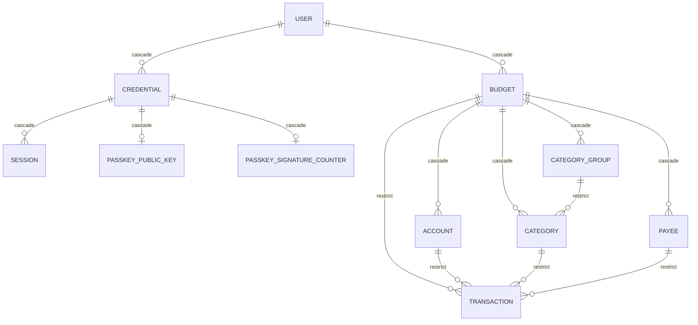
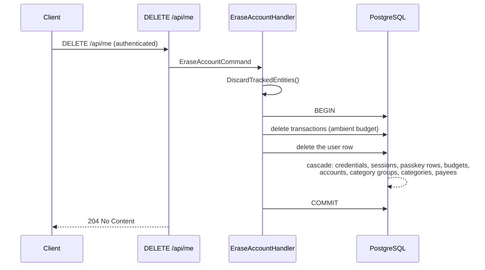

# Erasure

## Table of Contents

- [Purpose](#purpose)
- [Key Entities](#key-entities)
- [Constraints](#constraints)
- [Business Rules & Invariants](#business-rules--invariants)
- [Workflows & State Transitions](#workflows--state-transitions)
- [Integration Points](#integration-points)
- [Edge Cases & Known Gotchas](#edge-cases--known-gotchas)

## Purpose

Erasure is the one action that destroys an account and everything owned beneath it. It exists so
that leaving the product means actually leaving, rather than being archived: after it completes, no
row in any table references the erased user or any budget it owned.

It cuts across almost every domain area — `users` and `credentials` from
[users-and-ownership.md](users-and-ownership.md), the identity material in
[passkeys.md](passkeys.md) and [sessions.md](sessions.md), and every budget-owned table — so the
ordering rule and the post-condition live here rather than being split across the files whose rows
it removes.

## Key Entities

Erasure owns no entity of its own. It acts on the account graph that already exists, and the shape
of that graph is what the rules below are about:

Every edge is `ON DELETE CASCADE` except the five marked `restrict`, and that distinction is the
whole of the deletion order below. Four of the five have `transactions` as their child, which is why
that is the one table erasure empties itself.

## Constraints

### MUST

- Erasure **MUST** leave no row in any table referencing the erased user or any budget it owned.
  That is the post-condition the feature exists to deliver, and it is what a verification query
  asserts rather than a count of statements issued.
- Erasure **MUST** run as the least-privilege application role, on the connection serving the
  request. Doing it on an elevated connection would dissolve
  [ADR 0004](../decisions/0004-connect-as-a-least-privilege-role.md), and an administrator is not
  subject to row-level security at all.
- The handler **MUST** discard the context's tracked entities before deleting the user row. This is
  not retry hygiene; see the rule below, where the reason is the grant matrix.
- Erasure **MUST** delete, in dependency order and before the user row, every table a `RESTRICT`
  edge would otherwise block.

### MUST NOT

- Erasure **MUST NOT** take the account's identity from the request — not from the route, not from
  the body, not from a query string. It reads `IUserContext` and nothing else.
- Erasure **MUST NOT** answer `404` for an account that is already gone. It states a post-condition
  rather than acting on a row, and a `404` would tell someone their data might still be there.
- The application role **MUST NOT** be granted `DELETE` on `budgets`. Budget rows leave by the
  database's own cascade from `users`, which runs with the referencing table owner's privileges. A
  `42501` naming `budgets` is a change-tracker fault, never a missing grant — see the rule below.

## Business Rules & Invariants

---

- **Rule**: Erasure deletes explicitly **only what a `RESTRICT` edge would otherwise block**, in
  dependency order; everything joined to the account by `CASCADE` alone is left to the cascade.
  Today exactly one table satisfies that, and the sequence is **transactions → the user row**.
- **Why**: the rule is stated as a rule rather than as a list of statements because the list is what
  a future table has to be measured against. The owned graph carries five `RESTRICT` edges, and
  `transactions` is the child of four of them — `→ budgets`, `→ accounts`, `→ categories`,
  `→ payees`. Those four are the guard that stops an ordinary delete taking recorded money movement
  with it, so a delete that leant on the cascade answers `23503` for any account that ever recorded a
  transaction, which in a budgeting product is the ordinary case rather than the corner. Emptying
  that one table is also what disarms the fifth edge, because a `RESTRICT` edge cannot bite once its
  child rows are gone.
- **`categories → category_groups` is left to the cascade, and that does not rest on constraint
  ordering.** Both tables cascade from `budgets`, so one `budgets` delete reaches two tables joined
  to each other by a `RESTRICT` edge — but PostgreSQL queues the check for that edge as an after-row
  trigger when the `category_groups` row is deleted, which is strictly after the cascade into
  `categories` was already queued, and the after-trigger queue is FIFO. `RESTRICT` being
  non-deferrable does not make the check fire mid-statement. Verified on PostgreSQL 17 against
  schemas built with the two constraints created in either order, so that their OIDs — and with them
  the RI trigger names that decide firing order — were reversed: both leave the tables empty.
- **Enforced in**: `EraseAccountHandler`, whose two saves are ordered by the method rather than by
  EF. `AccountErasureEndpointTests.Delete_ForAFullyFurnishedAccount_ReturnsNoContent` seeds a
  categorized transaction, which puts four of the five edges in the path;
  `…Delete_ForAnAccountWithCategoriesAndNoTransaction_LeavesNoneOfEither` is the one that covers the
  fifth in isolation, and is what goes red if the FIFO behaviour above ever stops holding.
  `EraseAccountHandlerTests.HandleAsync_DeletesTheTransactionsBeforeTheUser` pins the order itself,
  against a fake that models the real edge. `SchemaConstraintSnapshotTests.Schema_PinsEveryForeignKeyAndItsDeleteRule`
  is the schema tripwire: a new `RESTRICT` edge into the owned graph moves a line there, which forces
  someone to come back and measure it against this rule.
- **Example**: an account with one categorized transaction. Deleting the user row first cascades into
  `budgets`, which is refused by `FK_transactions_budgets_budget_id` with `23503`.
- **Counterexample**: collapsing the two saves into one and letting EF order the batch. EF sorts
  topologically by the foreign keys *between the entity types in the batch* — `Transaction` points at
  `Budget`, `Budget` points at `User`, and `Budget` is not in the tracker — so there is no edge and
  no guarantee. It may draw the right order today and a different one after an EF upgrade.
- **Source**: `[SOURCE: user-story]`

---

- **Rule**: The handler discards the context's tracked entities before it deletes anything, and that
  call is load-bearing on the **first** attempt of the **first** request, not only under retry.
- **Why**: `UserProvisioningMiddleware` has already resolved the request's identity through the same
  scoped context, which leaves the `Budget` entity tracked. Removing the `User` with that dependent
  still in the tracker makes EF cascade to the copy it can see and emit its own
  `DELETE FROM budgets` — and the application role holds `SELECT` and `INSERT` on `budgets` and
  deliberately no `DELETE`, so the request dies with `42501` before it deletes anything. **The
  failure names a permission and the cause is the change tracker.** Answering it with a grant would
  widen the role's reach, fail `AppRoleGrantMatrixTests`, and leave the real fault in place.
- **Enforced in**: `IPersistenceState.DiscardTrackedEntities()`, called as the first line inside the
  `ITransactionalExecutor` delegate in `EraseAccountHandler`, with the reason written on the call.
  Every test in `AccountErasureEndpointTests` that expects `204` fails with `42501` without it,
  including the one that seeds nothing at all.
- **Source**: `[SOURCE: user-story]`

---

- **Rule**: The whole sequence runs on **one** session shape, not two.
- **Why**: `transactions` is policed by `budget_isolation`, which reads
  `app.current_budget_id`, while `users` is policed by `user_isolation`, which reads
  `app.current_user_id`. Those are two policies, but not two connections:
  `SessionContextInterceptor` writes both settings in the same statement on every connection open,
  so the connection serving an authenticated request already names both.
- **Enforced in**: `SessionContextInterceptor`, unchanged by this feature — see
  [ADR 0008](../decisions/0008-read-the-ambient-budget-inside-the-policy.md) for why it must stay a
  connection-opened interceptor.
- **Source**: `[SOURCE: user-story]`

---

- **Rule**: The account erased is whichever one the request is authenticated as. The identity comes
  from `IUserContext` and from nowhere else, and `EraseAccountCommand` is parameterless so that no
  field exists for a caller to name one in.
- **Why**: `user_isolation` is `FOR ALL`, so a `DELETE` naming another user's id affects **zero rows
  and reports success**. There is no error to catch and no refusal to log; a handler that took an id
  from the request and got it wrong would answer `204` having erased nothing. Keeping the id out of
  the command makes that state unreachable by the type system rather than by a check.
- **Enforced in**: `EraseAccountCommand` (no members), `EraseAccountHandler` (reads
  `IUserContext.UserId`), and the route, which carries no id segment.
  `AccountErasureEndpointTests.Delete_LeavesAnotherAccountUntouched` is the counterweight: without
  it, a handler that emptied every table in the database would satisfy every other assertion.
- **Counterexample**: `DELETE /api/me/{userId}`. Even with an ownership check it would be a second
  place the identity could come from, and the check would be the only thing between a typo and a
  silent no-op.
- **Source**: `[SOURCE: user-story]`

---

- **Rule**: Erasing an account that is already gone completes with `204`.
- **Why**: the caller asked for a post-condition — that the account not exist — and that
  post-condition holds. A `404` would be an answer about a row, and the one thing it would
  communicate to the person asking is uncertainty about whether their data is still there.
- **Enforced in**: `UserRepository.DeleteAsync`, which removes whatever the id matched and saves; an
  absent row leaves an empty set and the save is a no-op rather than a branch. The handler never
  reads the user first.
- **This holds for a row that leaves between the read and the save, too.** Two erasures of the same
  account in flight at once — a double-click, or a client retrying a slow response — both load the
  rows; the loser blocks on the winner's locks, then finds nothing to delete and gets zero rows
  affected against EF's expected one. Left alone that is a `DbUpdateConcurrencyException` and a
  `500`, which tells the user their erasure failed when it succeeded, and is a worse version of the
  `404` this rule already rejects. Both repositories therefore treat a conflict **naming only rows
  this call marked deleted** as the post-condition already holding, and let any other conflict
  propagate. They also detach those rows from the change tracker, sweeping the tracker rather than
  the entries the exception reported — EF reports only the first mismatching command's entries, so a
  surplus entry would otherwise be re-flushed by the next save and abort the erasure outright.
- **Enforced in**: `TransactionRepository.DeleteAllForAmbientBudgetAsync` and
  `UserRepository.DeleteAsync`. `…_WhenAnotherRequestDeletedTheRowsFirst_LetsTheErasureFinish` is the
  one that matters: it stages the conflict on **two** rows, because one row passes under the broken
  shape as well, and then runs erasure's real next step on the same context.
  `…_WhenTheConflictNamesAnotherEntity_LetsItEscape` pins the narrowing on both.
- **Source**: `[SOURCE: user-story]`

---

- **Rule**: Erasure reaches every budget the user owns, which today is exactly one.
- **Why**: the repositories it calls are scoped by the `BudgetIsolation` query filter, which resolves
  the **ambient** budget, and a user has exactly one budget with no way to create a second — see
  [budgets.md](budgets.md). So "every budget it owns" and "the ambient budget" name the same rows.
- **This is the assumption a multi-budget change must revisit.** The schema is multi-budget-ready
  and this handler is not: a second budget's transactions would sit outside the ambient filter, be
  left in place, and refuse the user delete with `23503`. The failure would at least be loud rather
  than silent, but it is the first thing to fix on the day a second budget can exist.
- **Enforced in**: `ITransactionRepository.DeleteAllForAmbientBudgetAsync` and
  `ICategoryRepository.DeleteAllForAmbientBudgetAsync`, neither of which takes a budget id — the
  filter is the tenancy, and an id parameter would be a tenancy argument with no ownership check to
  pair with it.
- **Source**: `[SOURCE: user-story]`

## Workflows & State Transitions

There is no state to transition through: an account is present or it is not. Nothing is marked,
scheduled or flagged, and no row survives to record that an erasure happened.

## Integration Points

- **The grant matrix** — `app-role-grants.sql` gives the role `DELETE` on `users` and `transactions`,
  which is everything erasure needs. `AppRoleGrantMatrixTests` pins the set in both directions, so a
  grant added to make an erasure problem go away fails a test rather than shipping.
- **Row-level security** — `user_isolation` scopes the `users` delete, `budget_isolation` scopes the
  `transactions` delete. Both are `FOR ALL`, so they constrain a delete exactly as they constrain a
  read. See [data isolation](../engineering/data-isolation.md).
- **The referential cascade** — everything not listed above leaves because PostgreSQL performs the
  referential action through internal triggers running with the **referencing table owner's**
  privileges, not the caller's. That is why no grant on any child table is needed, and why adding
  one would widen the role's reach without extending what erasure can do.
- **`ITransactionalExecutor`** — both saves run in one transaction.

## Edge Cases & Known Gotchas

- **A `42501` naming `budgets` is a change-tracker fault.** It means the tracked `Budget` from user
  provisioning was still attached; the fix is `DiscardTrackedEntities()`, never a grant. This is the
  single most likely wrong turn in this area, because the error message points at exactly the wrong
  layer.
- **Erasing twice creates an account in between.** `UserProvisioningMiddleware` runs on every
  authenticated request, and the first erasure took the credential, so the second request resolves
  nothing and provisions a **brand-new** user and default budget before the handler is reached —
  which is then erased in the same request. The endpoint is idempotent to the caller and is not a
  no-op to the database.
- **The request's own session row is deleted mid-request.** Nothing in the request path reads a
  `sessions` row today — the API authenticates with a bearer token from the identity provider — so
  the row cascades away and the response completes normally. The moment a session-bearing token
  authenticates a request, this endpoint will be deleting the row that authorizes the request it is
  running inside, and that is worth checking then rather than assuming.
- **`webauthn_challenges` is not in the verification query, and that is not an oversight.** A
  challenge belongs to a ceremony rather than to a person and carries neither `user_id` nor
  `budget_id`, so "no row references the erased user" holds vacuously.
