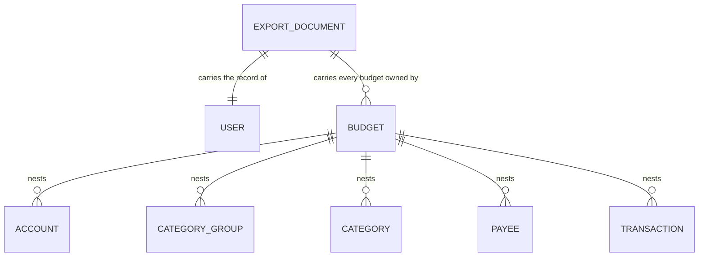
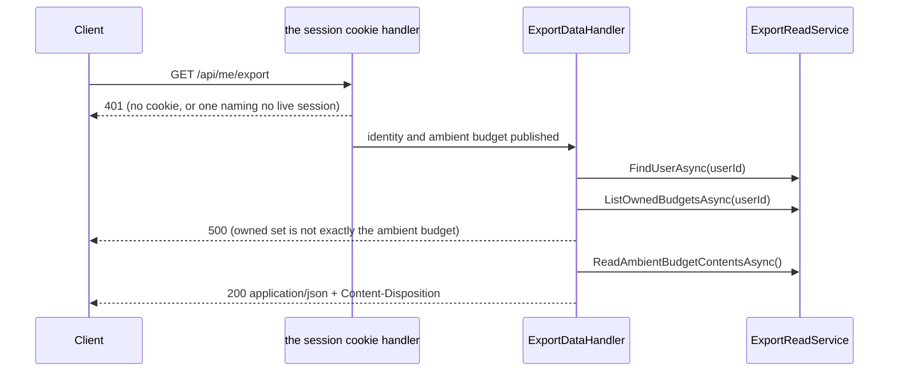

# Export

## Table of Contents

- [Purpose](#purpose)
- [Key Entities](#key-entities)
- [Constraints](#constraints)
- [Business Rules & Invariants](#business-rules--invariants)
- [Workflows & State Transitions](#workflows--state-transitions)
- [Decision Trees](#decision-trees)
- [Integration Points](#integration-points)
- [Edge Cases & Known Gotchas](#edge-cases--known-gotchas)

## Purpose

Export hands a person a complete copy of what the server holds about them: one authenticated
request, one JSON document, no queue, no emailed link, no waiting period. It is the counterweight to
[erasure](erasure.md), and neither is reachable behind a support request. It cuts across every
domain area — the `users` row, the budget, every budget-owned table — so the completeness rule lives
here rather than split across the files whose rows it reads.

What it **cannot** do decides that rule: both isolation layers beneath it are scoped to the
*ambient* budget and neither takes an argument, so one request reads one budget. When the owned set
is not exactly that budget, the export refuses rather than returning the part it can reach.

## Key Entities

Export owns no entity and writes no row. It reads the account graph that already exists, and nests
it:



The document carries a schema version, the user record, and an array of budgets each holding its
five collections as nested arrays. Property names are camelCase. Every persisted column of every row
it names ships, **including the parent ids the nesting already implies** — `budgets.userId` and each
row's `budgetId`.

Out of the document: `credentials`, `sessions`, `passkey_public_keys`, `passkey_signature_counters`,
`webauthn_challenges` and `recovery_code_hashes` are identity material rather than the person's own
records — the last has a rule of its own below. `currencies` is global reference data belonging to
no tenant.

## Constraints

### MUST

- **Carry every persisted column of every row it names** — a row present with a null name, a zeroed
  balance or a dropped parent id satisfies a set comparison exactly, and a person restoring from
  that file would find the rows there and the data gone. `ExportDocument`, pinned by
  `DataExportCompletenessTests`.
- **Carry a schema version identifier** — a saved file outlives the deployment that wrote it, and
  the version is the only thing telling a reader which shape they hold.
- **Order every array by `CreatedAtUtc`** — without an `ORDER BY`, PostgreSQL row order is
  unspecified and shifts on any update, vacuum or plan change. → the ordering rule below.
- **Answer in the same request-response exchange** — an export behind a queue or an emailed link is
  an export behind an operator, and the point of the feature is that a copy of one's own data is
  not. `DataExportEndpoints` answers directly; no job table, queue or notification path exists here.
- **Refuse rather than answer partially** when it cannot reach everything the user owns. → the
  central rule below.
- **Carry `application/json` and a filename-bearing content disposition, rendered in the Gregorian
  calendar whatever culture the serving thread holds.** → the disposition rule below.

### MUST NOT

- **Summarize, sample, aggregate, paginate or truncate** — every one of those looks correct at small
  volumes and silently loses data at large ones. No pagination parameter exists on the route.
- **Write a row, a column or a log line** — a row recording that an export happened is a remnant an
  [erasure](erasure.md) would have to destroy, and a log line naming the exporting user is the same
  remnant kept where no erasure gate can reach it. → the persists-nothing rule below.
- **Take the account's identity from the request** — not from the route, not from a query string. An
  identity a caller supplies is an identity a caller chooses. The route pattern carries no parameter
  and `ExportDataHandler` reads `IUserContext` and nothing else.
- **Bring an account into existence** — a route that minted an account in order to answer a read
  would let a provider token outliving an erasure bring the account back as an empty shell. Nothing
  on this route does, and that is the point: `RegisterAccountHandler` is the only code that creates
  an account, reachable only from `/api/registration`, and the fallback policy this route inherits
  names the session cookie scheme, so a provider bearer here authenticates nothing.
- **Name a budget id in the refusal message** — in Development `GlobalExceptionHandler` echoes the
  message *and* the full stack trace into the response body, so an id there leaks twice.
  `ExportCompletenessException` names counts.
- **Carry recovery-code material of any kind** — no verifier hash, no remaining count, no issued
  instant, no row for the set's credential. → the rule below.

## Business Rules & Invariants

- **Rule**: The export refuses when the set of budgets the user owns is not **exactly** the ambient
  budget. Set equality, in both directions — not "more than one".
- **Why**: the five collection reads are scoped by the `BudgetIsolation` filter and the
  `budget_isolation` policy, neither of which takes an argument or can be re-pointed mid-request. A
  user owning two budgets would get one budget's contents under a document claiming to hold
  everything — the truncation the constraint forbids, shipped green. Refusing is the honest answer,
  and the tripwire on the day a second budget becomes creatable.
  - **Both directions, because they fail differently.** Owning a budget the request is not inside
    means rows are missing; being inside a budget the user does not own means one budget's rows
    filed under another's id. A count-only guard passes the second cleanly.
  - **`500`, deliberately with no `IExceptionHandler` of its own.** `404` would say the export does
    not exist; `400` would blame a request with no field to correct; `409` implies a resolution the
    client cannot perform, since no endpoint creates, deletes or selects budgets. A *named* 5xx
    mapping is what a later reader could soften into "return the ambient budget and a warning";
    leaving it on the catch-all means the only way to change the answer is to change the throw.
- **Enforced in**: `ExportDataHandler.HandleAsync` throws `ExportCompletenessException` before the
  contents are read.
  `ExportDataHandlerTests.HandleAsync_WhenTheUserOwnsABudgetOtherThanTheAmbientOne_`
  `RefusesRatherThanTruncating` and `…HandleAsync_WhenTheAmbientBudgetIsNotOneTheUserOwns_Refuses`
  hold the two directions — the second is red against a `Count > 1` guard that passes the first —
  and `…ForAnOwnerOfOnlyTheAmbientBudget_ReturnsThatBudget` is the control without which a handler
  throwing on every request would satisfy both. Over HTTP,
  `DataExportRefusalTests.Export_ForAnOwnerOfASecondBudget_IsRefusedWithoutABody` and its answered
  control.
- **Example**: an owner of only the budget registration created gets the complete document and a
  `200`. Handed a second budget out of band, the same person gets a bodyless `500` on every export
  until it can read both.
- **Counterexample**: a document listing both budgets with one budget's accounts and transactions
  repeated under each. Nothing says which rows are real, the totals are wrong, and a person
  restoring from it would create duplicate money movement.
- **Source**: `[SOURCE: user-story]`

---

- **Rule**: The export document has **its own records**. It does not reuse the DTOs the list
  endpoints return.
- **Why**: those DTOs are shaped for display and lossy for an archive. `TransactionDto` coerces a
  null `Description` to `string.Empty`, turning "wrote no description" into "wrote an empty string";
  `PayeeDto` is `(Id, Name)` and carries neither `CreatedAtUtc` nor `BudgetId`; `AccountDto`
  denormalizes currency name and symbol, adding fields no column holds. The read services behind
  them order for display — `PayeeReadService` orders by name, the one order an export must not use,
  because a rename would reshuffle the whole file and make two exports of unchanged data diff.
- **Enforced in**: `Application/Users/ExportData/ExportDocument.cs` and `ExportReadService`.
  `DataExportCompletenessTests.Export_PreservesTheNullsAPersistedRowCarries` goes red the moment the
  document is rebuilt on `TransactionDto`, and asserts present-and-null rather than reading the
  value, because a `JsonNode` indexer answers `null` identically for an absent property and a JSON
  null.
- **Counterexample**: folding the document back onto the display DTOs to remove "duplication". Those
  shapes are free to change with the screens that consume them, and an export bound to them would
  follow.
- **Source**: `[SOURCE: user-story]`

---

- **Rule**: Every array ascends by `CreatedAtUtc`, and that ascent is the read port's contract
  rather than an implementation detail. `Id` breaks ties deterministically but is **not** part of
  the contract.
- **Why**: creation order is the meaningful order for an archive and survives a rename, so two
  exports a week apart diff only where the data changed. `CreatedAtUtc` alone is not a total order —
  registration writes the user and the budget from one `TimeProvider` read — so a tiebreaker is
  needed, and it stays outside the contract because it cannot be inside one: `uuid` collation is
  provider-defined, PostgreSQL comparing sixteen bytes big-endian and `Guid.CompareTo` comparing
  fields. Two rows sharing an instant may order one way through the read service and another through
  an in-memory one, with neither wrong, so promising `(CreatedAtUtc, Id)` would promise an agreement
  no code here delivers.
- **Enforced in**: `ExportReadService`, with the contract on `IExportReadService`.
  `DataExportCompletenessTests.Export_OrdersEachCollectionByCreationRatherThanByInsertionOrder`
  seeds out of band with `created_at_utc` **inverted** against insertion order. Without that
  inversion the test is a decoration: rows written over HTTP get monotonic timestamps and monotonic
  v7 ids at once, so insertion, id and creation order coincide and nothing can be distinguished.
- **Example**: a payee renamed between two exports keeps its position; only its name line diffs.
  Under the display services' name ordering, the same rename reshuffles the whole array.
- **Source**: `[SOURCE: user-story]`

---

- **Rule**: The export persists nothing and logs no identifier. `ExportDataHandler` takes no
  `ILogger` and no `ILoggerFactory`.
- **Why**: this handler holds every transaction a person has recorded plus the address they signed
  up with. One `LogDebug` of the document, or of the id it was assembled for, copies the lot into a
  sink with a different retention policy and audience from the database it came from — and no gate
  anywhere reads a log line from this path, so there is nothing to trade against. A stored row is
  worse: a job record, an `exported_at` column or an audit table is a remnant an
  [erasure](erasure.md) would have to destroy, and a table carrying neither `budget_id` nor
  `user_id` fails `RlsCoverageTests` and the deploy-time verifier at once.
- **Enforced in**: `ExportDataHandlerTests.TheHandlerThatAssemblesAnExport_TakesNoLoggerDependency`,
  reflection over the constructors with a non-vacuity guard on the parameter count — a query coming
  back empty would satisfy "no logger" while measuring nothing. It covers **one type**: not
  `DataExportEndpoints`, which lives in `Api` and which `UnitTests.csproj` deliberately does not
  reference, and not the framework, which logs on its own.
- **Source**: `[SOURCE: user-story]`

---

- **Rule**: The export carries **no recovery-code material**. Not the verifier hashes, not the count
  of codes remaining, not the set's `credentials` row, not the day it was issued.
- **Why**: the completeness rule is about the person's **own records** — the money picture they
  created — and identity material has always sat outside it. Recovery codes are worth restating
  rather than inheriting, because they are the first excluded rows a reader can argue are "about the
  person" in a way a signature counter is not.
  - **A hash gives the person nothing.** No preimage to redeem with, no way to regenerate a code
    from it. The one thing they might want — *"do I still have codes?"* — is a live question
    `GET /api/me/recovery-codes` answers; a saved file answers it as of the day it was written.
  - **The count is excluded for a smaller reason that is still a reason.** *"This account has two
    recovery codes left"* is worth harvesting on its own: an account down to its last code is an
    account worth attacking now. Same argument `CountRecoveryCodesHandler` makes for taking no
    logger.
- **Enforced in**: `ExportDocument` and `ExportReadService` name the `users` row, `budgets` and the
  five budget-owned collections and nothing else, so exclusion is structural rather than a filter
  somebody has to remember — which is why no test guards it directly.
- **Counterexample** — a hash in the file: a value in a downloaded artifact that something can be
  run against offline. An export lands in a downloads folder, a backup, a cloud sync and an email
  attachment, and lives there for years with none of the database's protections around it. Putting
  the digest a redemption is matched against into that artifact turns "somebody read your export"
  into "somebody can grind for your recovery codes at their leisure, and succeed silently if the
  client that minted them was ever weak" — precisely the attack the entropy rule the server **cannot
  enforce** is the only defence against. See [recovery-codes.md](recovery-codes.md).
- **Source**: `[SOURCE: user-story]`

---

- **Rule**: The schema version is the integer `1`.
- **Why**: a monotonic counter compares as a number and raises no question about whether `1.10`
  outranks `1.9`.
- **Enforced in**: `ExportDocument.CurrentSchemaVersion`, pinned by
  `DataExportEndpointTests.Export_CarriesSchemaVersionOne` — which asserts the **literal**, never
  the constant. A test reading the constant agrees with whatever the code says and stays green
  through the one change it exists to notice.
- **Source**: `[SOURCE: user-story]`

---

- **Rule**: The response carries
  `Content-Disposition: attachment; filename="budgetoid-export-{yyyyMMdd}T{HHmmss}Z.json"`,
  formatted from the request instant in UTC under `CultureInfo.InvariantCulture`.
- **Why**: `attachment` is what makes a browser save the file instead of rendering it in a tab, and
  a timestamped name stops a second export overwriting the first. The invariant culture is
  load-bearing: the same format string under a non-Gregorian culture renders the Buddhist year and
  produces a filename 543 years wrong, and a server whose culture comes from its host image is not
  exotic.
  - **A transport decision with a known expiry.** It is correct while the server assembles the file
    a person keeps. The day the client decrypts the document before it reaches the user, the saved
    artifact is the browser's and a server-sent `attachment` is dead weight — at worst it means
    navigating to the URL saves ciphertext under a name that looks like a finished export.
- **Enforced in**: `DataExportEndpoints.DispositionFor`, pinned **exactly** — not by a `Contains` —
  by `DataExportEndpointTests.Export_NamesTheFileWithTheRequestInstantInUtc`: the two halves that
  break silently are the `attachment` token and the quoting. Its `th-TH` control needs
  `factory.Server.PreserveExecutionContext = true` set **before** the client is built
  (`CurrentCulture` is an `AsyncLocal` and `TestServer` suppresses context flow) and a fake clock
  whose local zone is not UTC. Without either, it measures nothing and passes however the filename
  is formatted.
- **Source**: `[SOURCE: user-story]`

---

- **Rule**: The response body is assembled with `TypedResults.Ok`, never a file result and never
  hand-serialized JSON.
- **Why**: both of those write through whatever `JsonSerializerOptions` the call site passes,
  bypassing `ConfigureHttpJsonOptions` — so camelCase and the string-enum converter would come from
  somewhere other than the rest of the API, and the exported document would name its columns
  differently from every response the same client already parses. `Ok<T>` resolves the options from
  DI at execute time.
- **Enforced in**: `DataExportEndpoints`; the wire shape is pinned by `DataExportCompletenessTests`,
  which reads every response as `JsonNode` rather than deserializing into `ExportDocument` —
  checking the document against the declarations that produced it would pass over a property renamed
  on both sides at once.
- **Source**: `[SOURCE: user-story]`

## Workflows & State Transitions

There is no state to transition through. An export is a read: nothing is marked, scheduled or
flagged, and the account is in the same state after one as before.



The gate sits **before** the contents are read, so a document that will not be assembled costs
nobody a round trip over their own transactions.

## Decision Trees

How a request to `GET /api/me/export` is answered:

```
IF the request presents no cookie naming a live session     ← arms are mutually exclusive
  THEN 401 from the fallback policy (title "Unauthorized")     — and a provider bearer counts as
                                                                 presenting nothing, because the
                                                                 policy names the cookie scheme
ELSE IF the caller's session reads no budget content        ← a federated sign-in. This route is
  THEN 403 from the fallback policy's FullSessionRequirement   the reason the rule cannot be keyed
                                                               on the ambient budget: it reads
                                                               budgets by user_id
ELSE IF the set of budgets the user owns ≠ { the ambient budget }   — either direction
  THEN 500: ExportCompletenessException, before any contents are read
ELSE
  THEN 200 with the complete document and the Content-Disposition header
```

## Integration Points

- **The grant matrix** — nothing was added. The role already holds `SELECT` on `users`, `budgets`
  and the five budget-owned tables, so `AppRoleGrantMatrixTests` staying green **untouched** is the
  proof this feature needed no privilege. A `42501` from this path is a bug in the query, never a
  missing grant.
- **Row-level security** — `user_isolation` scopes the `users` and `budgets` reads;
  `budget_isolation` scopes the five collection reads. See
  [data isolation](../engineering/data-isolation.md).
- **`IBudgetContext` and the query filters** — the five reads carry no `where budget_id = …` at all;
  tenancy comes from the filter and the policy beneath it. `ReadAmbientBudgetContentsAsync`
  deliberately takes no budget id, following
  `ITransactionRepository.DeleteAllForAmbientBudgetAsync`: an id parameter would be a tenancy
  argument with no ownership check to pair with it.
- **[Erasure](erasure.md)** — `ErasureIrreversibilityTests` pins the `/api/me/erasure` **resource**
  rather than the `/api/me` namespace, and names an export of one's own data as exactly what that
  narrowing was written to leave room for. The route-table scan still applies: no reversal word may
  appear in this route's pattern, display name or endpoint name.
- **[Users & ownership](users-and-ownership.md)** — this route creates no account, and cannot: one
  handler creates them, reachable from one group whose policy names the provider's scheme, and this
  route inherits a fallback policy naming the cookie's.

## Edge Cases & Known Gotchas

- **`currencyCode` is a dangling reference, on purpose.** `currencies` is global reference data
  owned by no tenant, so `accounts.currencyCode` points at something the file does not contain. A
  completeness check against a full column inventory must not read this as a hole.
- **The document is fully materialized, and nothing bounds its size.** `TypedResults.Ok` serializes
  through a `PipeWriter` in buffers rather than into one string, so the peak is nearer one copy than
  two — but one copy is still unbounded. Small enough for one person's budget today; the ceiling is
  stated here because nothing in the code states it.
- **The complete-or-nothing guarantee ends when the response starts.** The status and the
  `Content-Disposition` go out before the body is serialized, so a serialization failure mid-write
  leaves a truncated document under a valid export filename with a `200` already sent, and
  `GlobalExceptionHandler` cannot take it back. Buffering to close that would double the memory on a
  path that already materializes everything.
- **The seven reads are not one snapshot.** Each runs at READ COMMITTED, so a write landing
  mid-export can produce a document whose parts reflect different states — a transaction naming a
  payee the payee array does not carry. The `budgets` read is one of the seven, so even the refusal
  can decide on a set that has since changed. Two things not to assume: **one session per person
  does not mean one request at a time** — one cookie authorizes as many concurrent calls as a client
  makes, so this is reachable today, not only after multi-budget ships; and
  **`ITransactionalExecutor` would not close it**, because that opens at READ COMMITTED and
  PostgreSQL takes a fresh snapshot per statement. Closing it needs `REPEATABLE READ` around all
  seven.
- **`Content-Disposition` is unreadable to browser JavaScript.** `Api/Program.cs` sets no
  `Access-Control-Expose-Headers`, so a cross-origin `fetch` sees the body and not the filename. The
  web client therefore names the file itself, from the **browser's** clock, in the same
  `budgetoid-export-{yyyyMMdd}T{HHmmss}Z.json` shape (`settings/export-filename.ts`) — two clocks,
  differing by seconds, and **neither authoritative**.
- **Exactly one 401 reaches this route.** No cookie, a cookie naming nothing, a dead session, or a
  provider bearer this route's policy does not read are all answered by the fallback policy through
  `UseStatusCodePages`, titled `"Unauthorized"` from the status map alone. There is no second,
  titled refusal for a caller naming no account, because an authenticated request here cannot name
  an account that does not exist: the cookie is only ever issued over a session row written beside
  one.
  - **And a 403 beside it, from the same policy.** A session that reads no budget content is refused
    here, and its body carries *no* title at all — which is what tells it from the first-party
    control's 403 on this same route. Three refusals across two statuses, only one silent.
- **A refusal in Development carries the stack trace.** `GlobalExceptionHandler` writes `detail`,
  `exceptionType` and the full `stackTrace` in Development — Staging gets neither — and the stack
  trace contains the message. Anything in `ExportCompletenessException`'s message is in the body
  twice, which is why it names counts and never ids.
- **Two 500s reach this route and, unlike the 401s, they are indistinguishable.** The refusal has no
  exception handler of its own, so it carries the catch-all's `"An unexpected error occurred."` —
  the title a `NullReferenceException` or an Npgsql timeout would carry. An integration test can
  assert *a* 500, never *this* 500; the type is pinned only by `ExportDataHandlerTests`. The
  accepted price of leaving it on the catch-all.
- **Every refusal is logged at `LogError` with a stack trace**, by the catch-all handler. "Logs no
  identifier" survives that only because the message names counts — held by the wording, not by a
  mechanism. On the day a second budget becomes creatable, every export turns into an ERROR-level
  alert: that is the signal the refusal exists to raise, not noise to silence.
- **Money ships as JSON numbers.** `amount` and `openingBalance` are unquoted at `numeric(14,4)`
  scale, exact for a .NET reader. Any JavaScript reader parses them into an IEEE-754 double, whose
  significand does not cover that column's range — for a document that refused `?? string.Empty` to
  avoid losing a null, the same class of loss at the other end of the wire. **The web client is a
  pipe and never parses the document**: `MeApiService.getExport` requests `responseType: 'blob'` and
  the bytes go to disk unread, precisely so a `JSON.parse` → `JSON.stringify` round-trip cannot
  replace exact amounts with doubles. `me-api.service.spec.ts` pins the response type, with the
  `GET /api/me` call beside it resolving as `json` so the pair proves it is a per-call decision; do
  not "simplify" the export call into `get<ExportDocument>()`.
