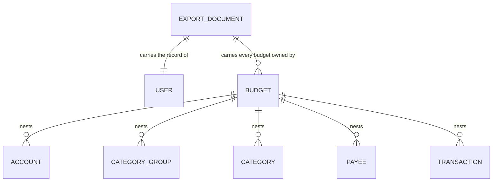
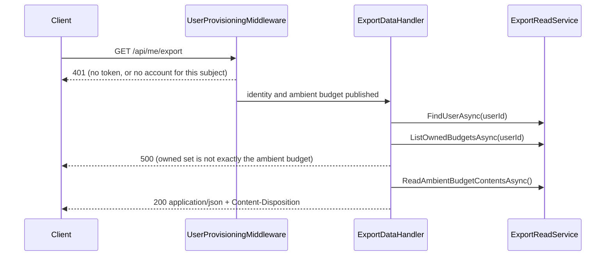

# Export

## Table of Contents

- [Purpose](#purpose)
- [Key Entities](#key-entities)
- [Constraints](#constraints)
- [Business Rules & Invariants](#business-rules--invariants)
- [Workflows & State Transitions](#workflows--state-transitions)
- [Integration Points](#integration-points)
- [Edge Cases & Known Gotchas](#edge-cases--known-gotchas)

## Purpose

Export is the action that hands a person a complete copy of what the server holds about them: one
authenticated request, one JSON document, no queue, no emailed link and no waiting period. It is the
counterweight to [erasure](erasure.md) — the two together are what make "the data is yours" a
capability rather than a claim, and neither is reachable behind a support request.

It cuts across every domain area — the `users` row from
[users-and-ownership.md](users-and-ownership.md), the budget from [budgets.md](budgets.md), and every
budget-owned table — so the completeness rule lives here rather than being split across the files
whose rows it reads.

The thing worth understanding before changing anything here is what the export **cannot** do: both
isolation layers beneath it are scoped to the *ambient* budget and neither takes an argument, so the
export can read the contents of one budget per request. That is not a limitation it works around. It
is the reason for the central rule below — when the owned set is not exactly that budget, the export
**refuses** rather than returning the part it can reach.

## Key Entities

Export owns no entity and writes no row. It reads the account graph that already exists, and nests it:

The document carries a schema version, the user record, and an array of budgets each holding its five
collections as nested arrays. Property names are camelCase, consistent with the rest of the API.
Every persisted column of every row it names ships, **including the parent ids the nesting already
implies** — `budgets.userId` and each row's `budgetId`.

`credentials`, `sessions`, `passkey_public_keys`, `passkey_signature_counters`,
`webauthn_challenges` and `currencies` are **not** in the document. The first five are identity
material rather than the person's own records; `currencies` is global reference data belonging to no
tenant.

## Constraints

### MUST

- The document **MUST** carry every persisted column of every row it names. A row present with a
  null name, a zeroed balance or a dropped parent id satisfies a set comparison exactly, and a person
  restoring from that file would find the rows there and the data gone.
- The document **MUST** carry a schema version identifier. A saved file outlives the deployment that
  wrote it, and the version is the only thing telling a reader which shape they are holding.
- Every array **MUST** be ordered by `(CreatedAtUtc, Id)` ascending. Without an `ORDER BY`,
  PostgreSQL row order is unspecified and shifts on any update, vacuum or plan change.
- The export **MUST** be delivered in the same request-response exchange, with no queue, no
  notification and no waiting period.
- The export **MUST** refuse, rather than answer partially, when it cannot reach everything the
  requesting user owns.
- The response **MUST** carry `application/json` and a filename-bearing content disposition, and the
  filename **MUST** be rendered in the Gregorian calendar whatever culture the serving thread holds.

### MUST NOT

- The export **MUST NOT** summarize, sample, aggregate, paginate or truncate. Every one of those is a
  design that looks correct at small volumes and silently loses data at large ones.
- The export **MUST NOT** write a row, a column or a log line. There is no job record, no
  `exported_at`, no audit trail — a row recording that an export happened is a remnant an
  [erasure](erasure.md) would have to destroy, and a log line naming the exporting user is the same
  remnant kept where no erasure gate can reach it.
- The export **MUST NOT** take the account's identity from the request — not from the route, not from
  a query string. It reads `IUserContext` and nothing else.
- The export route **MUST NOT** carry `ProvisionsUser` metadata. An export is a read; a route that
  minted an account in order to answer one would let a provider token outliving an erasure bring the
  account back as an empty shell.
- The refusal message **MUST NOT** name a budget id. In Development `GlobalExceptionHandler` echoes
  the exception's message *and* its full stack trace into the response body, so an id in the message
  leaks twice.

## Business Rules & Invariants

---

- **Rule**: The export refuses when the set of budgets the user owns is not **exactly** the ambient
  budget. Set equality, in both directions — not "more than one".
- **Why**: the five collection reads are scoped by the `BudgetIsolation` query filter and the
  `budget_isolation` policy, neither of which takes an argument and neither of which can be
  re-pointed part-way through a request. So a user owning two budgets would receive one budget's
  contents under a document claiming to hold everything — which is precisely the truncation the
  constraint above forbids, shipped as a green feature. Refusing is the honest answer, and it becomes
  the tripwire on the day a second budget becomes creatable.
- **Both directions, because they fail differently.** Owning a budget the request is not inside means
  rows are missing. The request being inside a budget the user does not own means one budget's rows
  would be filed under another's id — a count-only guard passes that case cleanly.
- **The refusal is a `500`, and deliberately has no `IExceptionHandler` of its own.** `404` would say
  the export does not exist; it does, and the server cannot assemble it. `400` would blame a request
  with no field to correct. `409` implies a resolution the client can perform, and the client cannot
  create, delete or select budgets because no endpoint does. A *named* 5xx mapping is the thing a
  later reader could soften into "return the ambient budget and a warning" — leaving it on the
  catch-all means the only way to change the answer is to change the throw.
- **Enforced in**: `ExportDataHandler.HandleAsync` throws `ExportCompletenessException` before the
  contents are read. `ExportDataHandlerTests.HandleAsync_WhenTheUserOwnsABudgetOtherThanTheAmbientOne_`
  `RefusesRatherThanTruncating` and `…HandleAsync_WhenTheAmbientBudgetIsNotOneTheUserOwns_Refuses`
  hold the two directions — the second is red against a `Count > 1` guard that passes the first.
  `…HandleAsync_ForAnOwnerOfOnlyTheAmbientBudget_ReturnsThatBudget` is the control without which a
  handler throwing on every request would satisfy both. Over HTTP,
  `DataExportRefusalTests.Export_ForAnOwnerOfASecondBudget_IsRefusedWithoutABody`, whose control
  `…Export_ForAnOwnerOfTheProvisionedBudgetAlone_IsAnswered` proves the seeding path can produce a
  success.
- **Counterexample**: a user owning a second budget receives a document listing both budgets with one
  budget's accounts and transactions repeated under each. Nothing in the file says which rows are
  real, the totals are wrong, and a person restoring from it would create duplicate money movement.
- **Source**: `[SOURCE: user-story]`

---

- **Rule**: The export document has **its own records**. It does not reuse the DTOs the list
  endpoints return.
- **Why**: those DTOs are shaped for display and are lossy for an archive.
  `Application/Transactions/TransactionDto.cs` coerces a null `Description` to `string.Empty`, turning
  "the person wrote no description" into "the person wrote an empty string". `PayeeDto` is
  `(Id, Name)` and carries neither `CreatedAtUtc` nor `BudgetId`. `AccountDto` denormalizes currency
  name and symbol, adding fields no column holds. The read services behind them also order for
  display — `PayeeReadService` orders by name, which is the one order an export must not use, because
  a rename would reshuffle the whole file and make two exports of unchanged data diff.
- **This will read as duplication to someone tidying up.** It is not: the display shapes are free to
  change with the screens that consume them, and an export bound to them would follow.
- **Enforced in**: `Application/Users/ExportData/ExportDocument.cs` and `ExportReadService`.
  `DataExportCompletenessTests.Export_PreservesTheNullsAPersistedRowCarries` is the test that goes red
  the moment the document is rebuilt on `TransactionDto`, and it asserts present-and-null rather than
  reading the value, because a `JsonNode` indexer answers `null` identically for an absent property
  and a JSON null.
- **Source**: `[SOURCE: user-story]`

---

- **Rule**: Every array is ordered by `(CreatedAtUtc, Id)` ascending, and that ordering is part of the
  read port's contract rather than an implementation detail.
- **Why**: creation order is the meaningful order for an archive and it survives a rename, so two
  exports a week apart diff only where the data changed. `CreatedAtUtc` alone is not a total order —
  provisioning writes the user and the budget from one `TimeProvider` read — so a tiebreaker is
  needed. It is **not** `Id` alone: `IBudgetRepository.FindFirstForUserAsync` already states as
  contract that UUID v7 sorts by creation time under PostgreSQL's `uuid` byte order but **not** under
  .NET's `Guid.CompareTo`, so ordering by id would put a database-backed implementation and an
  in-memory one into silent disagreement.
- **Enforced in**: `ExportReadService`, with the contract stated on `IExportReadService`.
  `DataExportCompletenessTests.Export_OrdersEachCollectionByCreationRatherThanByInsertionOrder` seeds
  out of band with `created_at_utc` **inverted** against insertion order — without that inversion the
  test is a decoration, because rows written over HTTP get monotonic timestamps and monotonic v7 ids
  at once, so insertion, id and creation order all coincide and nothing can be distinguished.
- **Source**: `[SOURCE: user-story]`

---

- **Rule**: The export persists nothing and logs no identifier. `ExportDataHandler` takes no `ILogger`
  and no `ILoggerFactory`.
- **Why**: the value this handler holds in memory is every transaction a person has recorded plus the
  address they signed up with. One `LogDebug` of the document, or of the id it was assembled for,
  copies the lot into a sink with a different retention policy and a different audience from the
  database it came from — and no gate anywhere reads a log line from this path, so there is nothing to
  trade against. A stored row is worse still: a job record, an `exported_at` column or an audit table
  is a remnant an [erasure](erasure.md) would have to destroy, and a table carrying neither
  `budget_id` nor `user_id` fails `RlsCoverageTests` and the deploy-time verifier at once.
- **Enforced in**: `ExportDataHandlerTests.TheHandlerThatAssemblesAnExport_TakesNoLoggerDependency`,
  reflection over the constructors with a non-vacuity guard on the parameter count — a query that came
  back empty would satisfy "no logger" perfectly while measuring nothing. It covers **one type**: not
  `DataExportEndpoints`, which lives in `Api` and which `UnitTests.csproj` deliberately does not
  reference, and not the framework, which logs on its own.
- **Source**: `[SOURCE: user-story]`

---

- **Rule**: The schema version is the integer `1`.
- **Why**: a monotonic counter compares as a number and raises no question about whether `1.10`
  outranks `1.9`.
- **Enforced in**: `ExportDocument.CurrentSchemaVersion`, pinned by
  `DataExportEndpointTests.Export_CarriesSchemaVersionOne` — which asserts the **literal**, never the
  constant. A test reading the constant agrees with whatever the code says and stays green through the
  one change it exists to notice.
- **Source**: `[SOURCE: user-story]`

---

- **Rule**: The response carries `Content-Disposition: attachment; filename="budgetoid-export-{yyyyMMdd}T{HHmmss}Z.json"`,
  formatted from the request instant in UTC under `CultureInfo.InvariantCulture`.
- **Why**: `attachment` is what makes a browser save the file instead of rendering it in a tab, and a
  timestamped name stops a second export overwriting the first. The invariant culture is
  load-bearing, not decoration: the same format string under a non-Gregorian culture renders the
  Buddhist year and produces a filename 543 years wrong, and a server whose culture comes from its
  host image is not an exotic deployment.
- **Enforced in**: `DataExportEndpoints.DispositionFor`, pinned **exactly** — not by a `Contains` — by
  `DataExportEndpointTests.Export_NamesTheFileWithTheRequestInstantInUtc`, because the two halves that
  break silently are the `attachment` token and the quoting. Its control,
  `…Export_UnderANonGregorianCultureIsStillNamedInTheGregorianCalendar`, runs the pipeline under
  `th-TH` and needs `factory.Server.PreserveExecutionContext = true` set **before** the client is
  built: `CultureInfo.CurrentCulture` is an `AsyncLocal` and `TestServer` suppresses execution-context
  flow, so without that line the control sets a culture the endpoint never sees and passes however the
  filename is formatted.
- **Source**: `[SOURCE: user-story]`

---

- **Rule**: The response body is assembled with `TypedResults.Ok`, never a file result and never
  hand-serialized JSON.
- **Why**: both of those write through whatever `JsonSerializerOptions` the call site passes,
  bypassing `ConfigureHttpJsonOptions` — so camelCase and the string-enum converter would come from
  somewhere other than the rest of the API, and the exported document would name its columns
  differently from every response the same client already parses. `Ok<T>` resolves the options from
  DI at execute time.
- **Enforced in**: `DataExportEndpoints`; the wire shape is pinned by `DataExportCompletenessTests`,
  which reads every response as `JsonNode` rather than deserializing into `ExportDocument` — checking
  the document against the declarations that produced it would pass over a property renamed on both
  sides at once.
- **Source**: `[SOURCE: user-story]`

## Workflows & State Transitions

There is no state to transition through. An export is a read: nothing is marked, scheduled or
flagged, and the account is in the same state after one as before.

The gate sits **before** the contents are read, so a document that will not be assembled costs nobody
a round trip over their own transactions.

## Integration Points

- **The grant matrix** — nothing was added. The role already holds `SELECT` on `users`, `budgets` and
  the five budget-owned tables, so `AppRoleGrantMatrixTests` staying green **untouched** is the proof
  this feature needed no privilege. A `42501` from this path is a bug in the query, never a missing
  grant.
- **Row-level security** — `user_isolation` scopes the `users` and `budgets` reads;
  `budget_isolation` scopes the five collection reads. See
  [data isolation](../engineering/data-isolation.md).
- **`IBudgetContext` and the query filters** — the five reads carry no `where budget_id = …` at all;
  tenancy comes from the filter and the policy beneath it. `ReadAmbientBudgetContentsAsync`
  deliberately takes no budget id, following `ITransactionRepository.DeleteAllForAmbientBudgetAsync`:
  an id parameter would be a tenancy argument with no ownership check to pair with it.
- **[Erasure](erasure.md)** — `ErasureIrreversibilityTests` pins the `/api/me/erasure` **resource**
  rather than the `/api/me` namespace, and names an export of one's own data as exactly what that
  narrowing was written to leave room for. The route-table scan still applies: no reversal word may
  appear in this route's pattern, display name or endpoint name.
- **[Users & ownership](users-and-ownership.md)** — the route deliberately withholds `ProvisionsUser`,
  so an authenticated subject with no account is refused rather than minted.

## Edge Cases & Known Gotchas

- **`currencyCode` is a dangling reference, on purpose.** `currencies` is global reference data owned
  by no tenant, so it is not in the document, and `accounts.currencyCode` therefore points at
  something the file does not contain. A completeness check measured against a full column inventory
  must not read this as a hole.
- **The document is fully materialized, not streamed, and nothing bounds its size.** It is built as
  in-memory lists and then serialized, so peak memory is roughly twice the document. One person's
  budget is small enough for that today and the feature carries no latency target; the ceiling is
  stated here because nothing in the code states it.
- **The five reads are not one snapshot.** They run at PostgreSQL's default READ COMMITTED across
  five round trips, so a write landing mid-export can produce a document whose parts reflect different
  states — a transaction naming a payee that the payee array does not carry. This is a known gap, not
  a promise; nothing in the product writes concurrently with an export today because there is one
  session per person.
- **`Content-Disposition` is unreadable to browser JavaScript.** `Api/Program.cs` sets no
  `Access-Control-Expose-Headers`, so a cross-origin `fetch` sees the body and not the filename. A
  client that wants to name the saved file will meet this and it will look like a bug in the endpoint.
- **Two 401s reach this route and they are not the same refusal.** No token at all is answered by the
  fallback policy through `UseStatusCodePages`, titled `"Unauthorized"` from the status map alone. A
  valid token naming no account is answered by `UserProvisioningMiddleware` with its own
  `NoAccountTitle`. A test asserting only the status cannot tell a route that lost its authorization
  from one that lost the middleware.
- **A refusal in Development carries the stack trace.** `GlobalExceptionHandler` writes `detail`,
  `exceptionType` and the full `stackTrace` outside Production, and the stack trace contains the
  message. Anything put in `ExportCompletenessException`'s message is therefore in the response body
  twice — which is why it names counts and never ids.
