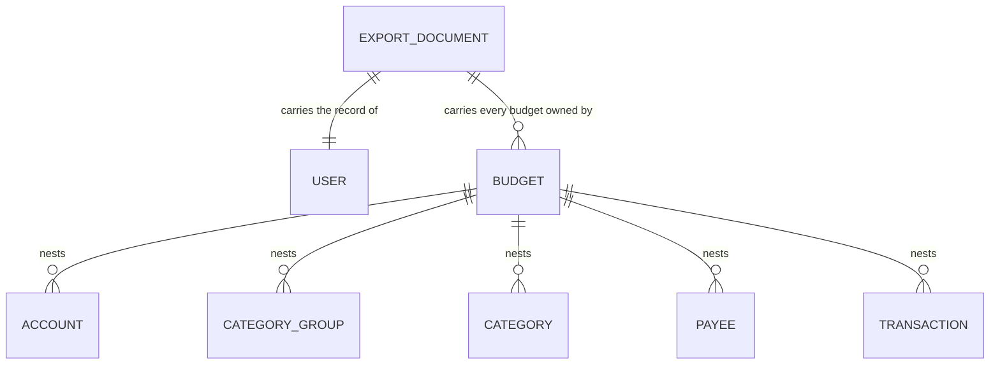
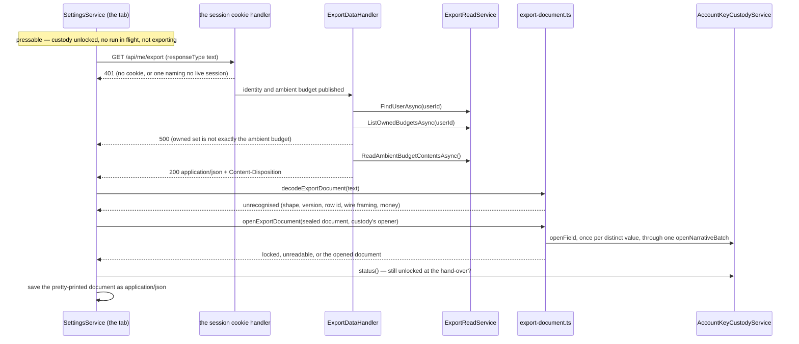

# Export

## Table of Contents

- [Purpose](#purpose)
- [Key Entities](#key-entities)
- [Constraints](#constraints)
- [Business Rules & Invariants](#business-rules--invariants)
- [Workflows & State Transitions](#workflows--state-transitions)
- [Decision Trees](#decision-trees)
- [Integration Points](#integration-points)
- [Edge Cases & Known Gotchas](#edge-cases--known-gotchas)

## Purpose

Export hands a person a complete copy of what the server holds about them: one authenticated
request, one JSON document, no queue, no emailed link, no waiting period. It is the counterweight to
[erasure](erasure.md), and neither is reachable behind a support request. It cuts across every
domain area — the `users` row, the budget, every budget-owned table — so the completeness rule lives
here rather than split across the files whose rows it reads.

What it **cannot** do decides that rule: both isolation layers beneath it are scoped to the
*ambient* budget and neither takes an argument, so one request reads one budget. When the owned set
is not exactly that budget, the export refuses rather than returning the part it can reach.

**The export has two halves, and they hold different things.** The server answers with every name
and note sealed, because it holds no key. The web client reads that answer, opens every name and
note in the tab with the account's keys, and saves the opened document — the file a person keeps
is readable, and the server never sees it. The completeness rule runs through both: the server
refuses rather than truncate, and the client saves the whole file or none of it.

## Key Entities

Export owns no entity and writes no row. It reads the account graph that already exists, and nests
it:



The document carries a schema version, the user record, and an array of budgets each holding its
five collections as nested arrays. Property names are camelCase. Every persisted column of every row
it names ships, **including the parent ids the nesting already implies** — `budgets.userId` and each
row's `budgetId` — with **four named exceptions, all blind indexes**: `accounts.name_key`,
`payees.name_key`, `category_groups.name_key` and `categories.name_key` are deliberately absent,
argued under [Business Rules](#business-rules--invariants). **That list is now closed rather than
growing**: four columns in the schema carry a blind index and all four are omitted. None of the
three description columns adds a fifth, because a description carries no index at all — which is a
rule about the field class and not an accident of which tables have been sealed so far.

Out of the document, and the reasons are three rather than one. `credentials`, `sessions`,
`session_tokens`, `passkey_public_keys`, `passkey_signature_counters`, `webauthn_challenges` and
`recovery_code_hashes` are identity material rather than the person's own records — the last has a
rule of its own below. `wrapped_account_keys`, `key_rotations` and `factor_manifests` are **key
custody and account control**: the envelopes open only under a factor the person holds and are
served to a browser that presents one, and the manifest is the account's list of which factors
exist — a map of the front door, in an artifact that outlives every session that could have vouched
for whoever is holding it. `currencies` is global reference data belonging to no tenant. Every
column of all eleven is classified *excluded* in `DataInventory`, one written argument each, which
is where a table joining this list has to earn its place.

## Constraints

### MUST

- **Carry every persisted column of every row it names**, less the four blind indexes named
  below — a row present with a null name, a zeroed balance or a dropped parent id satisfies a set
  comparison exactly, and a person restoring from that file would find the rows there and the data
  gone.
  `ExportDocument`, pinned by `DataExportCompletenessTests`. The sealed columns satisfy this by
  shipping the **envelope**: the column's bytes, unaltered, which is the whole of what this side
  holds — and that is now true of every narrative column in the schema, names and descriptions
  alike.
- **Carry a schema version identifier** — a saved file outlives the deployment that wrote it, and
  the version is the only thing telling a reader which shape they hold.
- **Order every array by `CreatedAtUtc`** — without an `ORDER BY`, PostgreSQL row order is
  unspecified and shifts on any update, vacuum or plan change. → the ordering rule below.
- **Answer in the same request-response exchange** — an export behind a queue or an emailed link is
  an export behind an operator, and the point of the feature is that a copy of one's own data is
  not. `DataExportEndpoints` answers directly; no job table, queue or notification path exists here.
- **Refuse rather than answer partially** when it cannot reach everything the user owns. → the
  central rule below.
- **Carry `application/json` and a filename-bearing content disposition, rendered in the Gregorian
  calendar whatever culture the serving thread holds.** → the disposition rule below.

### MUST NOT

- **Summarize, sample, aggregate, paginate or truncate** — every one of those looks correct at small
  volumes and silently loses data at large ones. No pagination parameter exists on the route.
- **Write a row, a column or a log line** — a row recording that an export happened is a remnant an
  [erasure](erasure.md) would have to destroy, and a log line naming the exporting user is the same
  remnant kept where no erasure gate can reach it. → the persists-nothing rule below.
- **Take the account's identity from the request** — not from the route, not from a query string. An
  identity a caller supplies is an identity a caller chooses. The route pattern carries no parameter
  and `ExportDataHandler` reads `IUserContext` and nothing else.
- **Bring an account into existence** — a route that minted an account in order to answer a read
  would let a provider token outliving an erasure bring the account back as an empty shell. Nothing
  on this route does, and that is the point: `RegisterAccountHandler` is the only code that creates
  an account, reachable only from `/api/registration`, and the fallback policy this route inherits
  names the session cookie scheme, so a provider bearer here authenticates nothing.
- **Name a budget id in the refusal message** — in Development `GlobalExceptionHandler` echoes the
  message *and* the full stack trace into the response body, so an id there leaks twice.
  `ExportCompletenessException` names counts.
- **Carry recovery-code material of any kind** — no verifier hash, no remaining count, no issued
  instant, no row for the set's credential. → the rule below.

### The web client MUST

- **Save the whole opened document or nothing** — a file with one name missing looks complete in a
  downloads folder years later. → the whole-file rule below.
- **Refuse any document shape it does not declare, member for member** — a column the server starts
  shipping is a column nobody has decided whether to open. → the decoder rule below.
- **Offer Export only while this tab can open what the file is written from.** → the pressable rule
  below.

### The web client MUST NOT

- **Parse the body anywhere but the decoder** — a second parse is a parse with no shape check,
  handing the decoder an object it can no longer refuse.
- **Keep the opened document past the one export that opened it** — no signal, no field, no module
  binding. Held by review and by no test.

## Business Rules & Invariants

- **Rule**: The export refuses when the set of budgets the user owns is not **exactly** the ambient
  budget. Set equality, in both directions — not "more than one".
- **Why**: the five collection reads are scoped by the `BudgetIsolation` filter and the
  `budget_isolation` policy, neither of which takes an argument or can be re-pointed mid-request. A
  user owning two budgets would get one budget's contents under a document claiming to hold
  everything — the truncation the constraint forbids, shipped green. Refusing is the honest answer,
  and the tripwire on the day a second budget becomes creatable.
  - **Both directions, because they fail differently.** Owning a budget the request is not inside
    means rows are missing; being inside a budget the user does not own means one budget's rows
    filed under another's id. A count-only guard passes the second cleanly.
  - **`500`, deliberately with no `IExceptionHandler` of its own.** `404` would say the export does
    not exist; `400` would blame a request with no field to correct; `409` implies a resolution the
    client cannot perform, since no endpoint creates, deletes or selects budgets. A *named* 5xx
    mapping is what a later reader could soften into "return the ambient budget and a warning";
    leaving it on the catch-all means the only way to change the answer is to change the throw.
- **Enforced in**: `ExportDataHandler.HandleAsync` throws `ExportCompletenessException` before the
  contents are read.
  `ExportDataHandlerTests.HandleAsync_WhenTheUserOwnsABudgetOtherThanTheAmbientOne_`
  `RefusesRatherThanTruncating` and `…HandleAsync_WhenTheAmbientBudgetIsNotOneTheUserOwns_Refuses`
  hold the two directions — the second is red against a `Count > 1` guard that passes the first —
  and `…ForAnOwnerOfOnlyTheAmbientBudget_ReturnsThatBudget` is the control without which a handler
  throwing on every request would satisfy both. Over HTTP,
  `DataExportRefusalTests.Export_ForAnOwnerOfASecondBudget_IsRefusedWithoutABody` and its answered
  control.
- **Example**: an owner of only the budget registration created gets the complete document and a
  `200`. Handed a second budget out of band, the same person gets a bodyless `500` on every export
  until it can read both.
- **Counterexample**: a document listing both budgets with one budget's accounts and transactions
  repeated under each. Nothing says which rows are real, the totals are wrong, and a person
  restoring from it would create duplicate money movement.
- **Source**: `[SOURCE: user-story]`

---

- **Rule**: The export document has **its own records**. It does not reuse the DTOs the list
  endpoints return.
- **Why**: those DTOs are shaped for display and lossy for an archive. `PayeeDto` is `(Id, Name)`
  and carries neither `CreatedAtUtc` nor `BudgetId`; `AccountDto`
  denormalizes currency name and symbol, adding fields no column holds; `TransactionDto` carries
  four names joined from four other tables, which are context for a screen rather than columns of the
  row. The read services behind
  them order for display, and **that two of them currently order the way the export contract also
  demands is a coincidence, not a reason to fold them together**: `PayeeReadService` sorts on
  `CreatedAtUtc` then `Id` because a sealed name has no order worth sorting on — the first differing
  byte after the version is the nonce — and it is free to change the day a client asks for something
  else, where the export's ordering is a contract.
  - **The example this argument used to lead with has been fixed at the source, and the rule
    outlived it.** `TransactionDto` coerced a null `Description` to `string.Empty`, turning "wrote no
    memo" into "wrote an empty memo"; sealing that column deleted the coercion, because `""` is not a
    legal envelope. So the DTO no longer demonstrates the loss — and the document still must not be
    rebuilt on it, for the three reasons above. A worked example disappearing is not the rule
    weakening; it is the rule having been applied one layer down.
- **Enforced in**: `Application/Users/ExportData/ExportDocument.cs` and `ExportReadService`.
  `DataExportCompletenessTests.Export_PreservesTheNullsAPersistedRowCarries` asserts present-and-null
  rather than reading the
  value, because a `JsonNode` indexer answers `null` identically for an absent property and a JSON
  null. **What that case now guards is the document's own shape and no longer a difference against
  `TransactionDto`**, so a reader must not treat it as the pin holding this rule: what holds it is
  that the record declares the row's columns and the DTO declares a screen's needs, and no test
  compares the two.
- **Counterexample**: folding the document back onto the display DTOs to remove "duplication". Those
  shapes are free to change with the screens that consume them, and an export bound to them would
  follow.
- **Source**: `[SOURCE: user-story]`

---

- **Rule**: **Every narrative column in the schema is exported as an envelope, and no blind index
  ships.** Five names — `budgets.name`, `accounts.name`, `payees.name`, `category_groups.name` and
  `categories.name` — and three descriptions — `category_groups.description`,
  `categories.description` and `transactions.description` — cross as the column's AEAD envelope in
  unpadded base64url, under the member names they always had; `accounts.name_key`, `payees.name_key`,
  `category_groups.name_key` and `categories.name_key` are the only persisted columns the document
  leaves out. **The server's response is entirely unreadable to the operator who assembled it**,
  save for amounts, dates and identifiers — which is the property this whole design was for,
  arriving as a fact about the export route rather than as an aspiration in a requirement. **The
  file a person saves is not the response**: the web client opens every one of the eight in the
  tab and writes plaintext, so the delivered file reads in full — and it is assembled where the
  keys are, which is the only place it could be.
- **Why**: the server holds no key, so an envelope is the whole of what it can hand back — and the
  member keeps its name because the completeness check maps a table's columns onto a record's
  members, and renaming it would say the export had stopped carrying the column rather than that the
  column had changed shape. The four index columns are excluded on the opposite argument: a blind
  index is **derivable from the name** by anybody holding the account's index key, which is exactly
  who can read the file, and meaningless to anybody who is not. Shipping one would put a
  deterministic per-budget fingerprint of every name into an artifact that lands in a downloads
  folder, a backup and a cloud sync — and on `payees` that fingerprint is the most telling of the
  four, because a payee list is the set of counterparties one person deals with. The document is a
  copy of what a person owns, not of what the server needs to police it.
  - **A null description is carried rather than coerced, on all three of the columns that have
    one.** `null` is a note nobody wrote and a 29-byte envelope is a note
    somebody wrote and then emptied; a copy of a person's data has to keep the two apart, and a
    `?? string.Empty` on the way out would fold them and hand a reader a value that is not a legal
    envelope. `category_groups.description` was the first sealed column here that could legitimately
    be absent; `categories.description` and `transactions.description` joined it, and the last of the
    three is where the coercion actually **shipped** — on `TransactionDto`, one layer over, where
    sealing the column is what deleted it.
  - **There is no `description_key` to omit on any of the three**, and the absence is a decision
    rather than a gap in this list: a description is never looked up, so it carries no index
    anywhere, ever.
- **Enforced in**: `ExportedBudget.Name`, `ExportedAccount.Name`, `ExportedPayee.Name`,
  `ExportedCategoryGroup.Name`, `ExportedCategoryGroup.Description`, `ExportedCategory.Name`,
  `ExportedCategory.Description` and `ExportedTransaction.Description` are
  `string`s carrying `PasskeyEncoding`-encoded bytes — never `System.Text.Json`'s own `byte[]`
  handling, which emits padded standard base64 the client's strict decoder refuses — and none of
  `ExportedAccount`, `ExportedPayee`, `ExportedCategoryGroup` and `ExportedCategory` declares a
  `NameKey` member.
  `DataExportCompletenessTests`
  asserts the exact encoded string rather than a substring or an equivalence, which is what makes it
  able to see the wrong alphabet, and counts each row's properties, which is what makes it redden if
  an index member is ever added. On the client, the decoder refuses a `nameKey` on each of the four
  rows as an undeclared member — `export-document.spec.ts`, "refuses an undeclared member" — so an
  index that reached the response would stop the export rather than land in the file.
  - **`categories` and `transactions` moved from an in-query projection to anonymous-row-then-shape
    with this slice**, the treatment the other three collections already had, because a value
    converter is not something the provider can translate a `Select` over. **No collection is
    projected in-query any more**, so the split this file used to describe between the two treatments
    is gone rather than narrowed — a reader looking for the tables that still project in-query will
    not find one.
- **Counterexample**: decoding the names into text on the way out so the file reads nicely. There is
  nothing on this side to decode with, so the only implementable version of that idea is the one
  where the server holds a key — the design the product exists to avoid. The file does read nicely,
  and the opening is the client's: the side holding the keys does it, after the server has
  answered.
- **Source**: `[SOURCE: user-story]`

---

- **Rule**: Every array ascends by `CreatedAtUtc`, and that ascent is the read port's contract
  rather than an implementation detail. `Id` breaks ties deterministically but is **not** part of
  the contract.
- **Why**: creation order is the meaningful order for an archive and survives a rename, so two
  exports a week apart diff only where the data changed. `CreatedAtUtc` alone is not a total order —
  registration writes the user and the budget from one `TimeProvider` read — so a tiebreaker is
  needed, and it stays outside the contract because it cannot be inside one: `uuid` collation is
  provider-defined, PostgreSQL comparing sixteen bytes big-endian and `Guid.CompareTo` comparing
  fields. Two rows sharing an instant may order one way through the read service and another through
  an in-memory one, with neither wrong, so promising `(CreatedAtUtc, Id)` would promise an agreement
  no code here delivers.
- **Enforced in**: `ExportReadService`, with the contract on `IExportReadService`.
  `DataExportCompletenessTests.Export_OrdersEachCollectionByCreationRatherThanByInsertionOrder`
  seeds out of band with `created_at_utc` **inverted** against insertion order. Without that
  inversion the test is a decoration: rows written over HTTP get monotonic timestamps and monotonic
  v7 ids at once, so insertion, id and creation order coincide and nothing can be distinguished.
- **Example**: a payee renamed between two exports keeps its position; only its name line diffs.
  Ordering that array by the name itself would be worse than unstable now that the column is sealed:
  every save draws a fresh nonce, so the whole array would reshuffle when an *unrelated* payee was
  renamed, and no order a person recognises would ever come back.
- **Source**: `[SOURCE: user-story]`

---

- **Rule**: The export persists nothing and logs no identifier. `ExportDataHandler` takes no
  `ILogger` and no `ILoggerFactory`.
- **Why**: this handler holds every transaction a person has recorded plus the address they signed
  up with. One `LogDebug` of the document, or of the id it was assembled for, copies the lot into a
  sink with a different retention policy and audience from the database it came from — and no gate
  anywhere reads a log line from this path, so there is nothing to trade against. A stored row is
  worse: a job record, an `exported_at` column or an audit table is a remnant an
  [erasure](erasure.md) would have to destroy, and a table carrying neither `budget_id` nor
  `user_id` fails `RlsCoverageTests` and the deploy-time verifier at once.
- **Enforced in**: `ExportDataHandlerTests.TheHandlerThatAssemblesAnExport_TakesNoLoggerDependency`,
  reflection over the constructors with a non-vacuity guard on the parameter count — a query coming
  back empty would satisfy "no logger" while measuring nothing. It covers **one type**: not
  `DataExportEndpoints`, which lives in `Api` and which `UnitTests.csproj` deliberately does not
  reference, and not the framework, which logs on its own.
- **Source**: `[SOURCE: user-story]`

---

- **Rule**: The export carries **no recovery-code material**. Not the verifier hashes, not the count
  of codes remaining, not the set's `credentials` row, not the day it was issued.
- **Why**: the completeness rule is about the person's **own records** — the money picture they
  created — and identity material has always sat outside it. Recovery codes are worth restating
  rather than inheriting, because they are the first excluded rows a reader can argue are "about the
  person" in a way a signature counter is not.
  - **A hash gives the person nothing.** No preimage to redeem with, no way to regenerate a code
    from it. The one thing they might want — *"do I still have codes?"* — is a live question
    `GET /api/me/recovery-codes` answers; a saved file answers it as of the day it was written.
  - **The count is excluded for a smaller reason that is still a reason.** *"This account has two
    recovery codes left"* is worth harvesting on its own: an account down to its last code is an
    account worth attacking now. Same argument `CountRecoveryCodesHandler` makes for taking no
    logger.
- **Enforced in**: `ExportDocument` and `ExportReadService` name the `users` row, `budgets` and the
  five budget-owned collections and nothing else, so exclusion is structural rather than a filter
  somebody has to remember — which is why no test guards it directly.
- **Counterexample** — a hash in the file: a value in a downloaded artifact that something can be
  run against offline. An export lands in a downloads folder, a backup, a cloud sync and an email
  attachment, and lives there for years with none of the database's protections around it. Putting
  the digest a redemption is matched against into that artifact turns "somebody read your export"
  into "somebody can grind for your recovery codes at their leisure, and succeed silently if the
  client that minted them was ever weak" — precisely the attack the entropy rule the server **cannot
  enforce** is the only defence against. See [recovery-codes.md](recovery-codes.md).
- **Source**: `[SOURCE: user-story]`

---

- **Rule**: The schema version is the integer `1`, and it **names the delivered file** — the opened
  document a person keeps. The server's response carries the same number, and the client's decoder
  accepts that number and no other.
- **Why**: a monotonic counter compares as a number and raises no question about whether `1.10`
  outranks `1.9`. It names the file because the file is what outlives the deployment that wrote it;
  the response is an internal hop between the server and the tab, and nobody is handed it as a file.
  - **Opening the names in the tab did not bump it.** The delivered file's shape is the response's
    shape with eight members holding text where they held envelopes — same members, same order,
    same types. The one reader a bump would have warned is somebody holding a sealed file, and no
    sealed export has been handed to anybody as a file: a browser navigating to the route gets the
    first-party control's `403`, and the web client's own save is now the opened one.
  - **The day the file's shape changes, the number moves and the decoder moves with it.** A
    decoder still pinned to `1` refuses a `2` as `unrecognised`, which is the loud direction.
- **Enforced in**: `ExportDocument.CurrentSchemaVersion`, pinned by
  `DataExportEndpointTests.Export_CarriesSchemaVersionOne` — which asserts the **literal**, never
  the constant. A test reading the constant agrees with whatever the code says and stays green
  through the one change it exists to notice. On the client, `decodeExportDocument` refuses any
  `schemaVersion` but the number `1` — `export-document.spec.ts`, "refuses schemaVersion" over `2`,
  the string `"1"` and an absent member.
- **Source**: `[SOURCE: user-story]`

---

- **Rule**: The response carries
  `Content-Disposition: attachment; filename="budgetoid-export-{yyyyMMdd}T{HHmmss}Z.json"`,
  formatted from the request instant in UTC under `CultureInfo.InvariantCulture`.
- **Why**: `attachment` is what makes a browser save the file instead of rendering it in a tab, and
  a timestamped name stops a second export overwriting the first. The invariant culture is
  load-bearing: the same format string under a non-Gregorian culture renders the Buddhist year and
  produces a filename 543 years wrong, and a server whose culture comes from its host image is not
  exotic.
  - **The web client no longer uses it, and it stays.** The client reads the body as text through
    `HttpClient`, where `attachment` does nothing, and names the file it writes itself (edge case
    below). The header is kept on IFR-002's account, for a caller that is not this browser client,
    and for that caller the response is still a file.
  - **What such a caller saves is the sealed document**, under a name that looks like a finished
    export. That is the cost of keeping the header, and it is bounded: a browser cannot reach it by
    navigating, because a top-level navigation carries no `X-Budgetoid-Client` and gets the
    first-party `403`; a caller that can send the header and the session cookie is holding the
    account already, and gets exactly what the server holds.
- **Enforced in**: `DataExportEndpoints.DispositionFor`, pinned **exactly** — not by a `Contains` —
  by `DataExportEndpointTests.Export_NamesTheFileWithTheRequestInstantInUtc`: the two halves that
  break silently are the `attachment` token and the quoting. Its `th-TH` control needs
  `factory.Server.PreserveExecutionContext = true` set **before** the client is built
  (`CurrentCulture` is an `AsyncLocal` and `TestServer` suppresses context flow) and a fake clock
  whose local zone is not UTC. Without either, it measures nothing and passes however the filename
  is formatted.
- **Source**: `[SOURCE: user-story]`

---

- **Rule**: The response body is assembled with `TypedResults.Ok`, never a file result and never
  hand-serialized JSON.
- **Why**: both of those write through whatever `JsonSerializerOptions` the call site passes,
  bypassing `ConfigureHttpJsonOptions` — so camelCase and the string-enum converter would come from
  somewhere other than the rest of the API, and the exported document would name its columns
  differently from every response the same client already parses. `Ok<T>` resolves the options from
  DI at execute time.
- **Enforced in**: `DataExportEndpoints`; the wire shape is pinned by `DataExportCompletenessTests`,
  which reads every response as `JsonNode` rather than deserializing into `ExportDocument` —
  checking the document against the declarations that produced it would pass over a property renamed
  on both sides at once.
- **Source**: `[SOURCE: user-story]`

---

- **Rule**: **The web client saves the whole opened document or nothing.** One export ends in one of
  five words: `exported`, or one of four failures, each of which means nothing was saved —
  `failed` (the request failed, or anything threw after it), `unrecognised` (the decoder refused the
  body), `locked` (a field answered locked, or custody was not `unlocked` at the hand-over) and
  `unreadable` (a field failed from the envelope's version byte and tag onward). **`locked` wins over
  `unreadable`**, whichever field was asked first.
- **Why**: a file with one name missing — or carrying a dash, or the envelope left where the name
  failed — looks complete in a downloads folder years later. That is the truncation the server's
  completeness rule refuses, carried into the tab, and it gets the same answer.
  - **Four failure words, because they are four next steps.** `failed` says try again later.
    `unrecognised` is a body this bundle could not read, and a reload is the one act that can change
    it. `locked` says present a factor and export again. `unreadable` is a value that did not open under
    keys this tab *did* hold, which nothing on the screen changes — every factor encapsulates the same
    two keys, and a retry opens the same bytes.
  - **`locked` wins because it has a way forward.** Unlock and every field comes back, so it is the
    word worth showing while it is true. A field that failed while the keys were leaving is only
    worth reporting as `unreadable` once they are back and it still does not open.
  - **The hand-over check closes the last gap.** Each open already answers `locked` for a lock that
    lands while its cipher runs. `SettingsService` checks custody again in the same synchronous block
    as the save, which catches a lock landing after the last open and before the file leaves.
  - **The cost is accepted, and it is a person who cannot export at all.** One value that no longer
    authenticates blocks the whole file, and `unreadable` offers nothing to do. Saving the rest was
    refused for the reason above: a partial file that says nothing about its gap is worse than no
    file and a sentence saying why.
- **Enforced in**: `openExportDocument` answers `opened` only when every narrative member came back
  as text, and `SettingsService.write` saves only on `opened` and a custody still `unlocked`.
  `export-document.spec.ts` — "delivers nothing when … alone is unreadable" and "answers locked when
  … alone is locked", each over all eight fields, and "answers locked over unreadable" in both
  orders; `settings.service.spec.ts` for the words the screen publishes.
- **Example**: every field opens — the document is pretty-printed, saved as `application/json` under
  the client's filename, and the screen says **Exported.**
- **Counterexample**: one payee name fails, and the file is saved with `—` in its place. Nothing in
  the file says the dash is a failure rather than a name, and nobody reading it later can tell.
- **Source**: `[SOURCE: user-story]`

---

- **Rule**: **The client's decoder accepts exactly the document `ExportDocument.cs` declares, and
  answers `unrecognised` for anything else, before any cipher runs.** Every object carries exactly
  its declared members — none missing, none extra — each with the JSON type it serializes as, `null`
  only where the record declares a nullable member, `schemaVersion` the number `1`, every narrative
  row id in its canonical spelling, every narrative wire string accepted by the strict base64url
  decoder and at least the envelope's 29-byte floor, and money below 1e10 at no more than four
  decimals.
- **Why**: **the extra-member refusal is the FR-015 guard.** A column the server starts shipping is,
  until somebody looks at it, a column nobody decided whether to open. Passed through, a new sealed
  column lands on disk as ciphertext in a file that claims to be readable, and a new blind index
  lands as the per-account fingerprint the rule above argues out of the document.
  - **The coupling is the point, and it is loud on purpose.** Any column added to the export —
    and any member renamed or removed — must land in the client decoder **in the same commit**, or
    every export fails `unrecognised` from the first deploy that carries it. That is the direction
    chosen: an export that stops working and says so, rather than one that goes on working and
    ships something nobody decided about. `export-document.spec.ts` builds its fixture by hand in
    the shape `ExportDocument.cs` writes, so a server-only change leaves the client suite green, and
    the first sign of it is every export answering `unrecognised`. [Guessing] No test reads both
    sides of this contract; the
    decoder's tables are tied to the TypeScript interfaces by `satisfies`, and nothing ties those
    interfaces to the C# records but this rule.
  - **A row id and a wire string are judged here rather than at the opener**, because both refusals
    precede the cipher and observe no key material. At the opener, a bad row id would be a
    `NarrativeFieldMisuseError` — a defect in this client — and a bad wire string would come back
    `unreadable`, the word for keys that were here and bytes that were not theirs. Both are a body
    this client could not read, which is `unrecognised`. The line is the one
    [account-keys.md](account-keys.md) draws for a manifest.
  - **The one parse belongs to the decoder.** `MeApiService.getExport` asks for
    `responseType: 'text'`, through `BaseApiService.getText`, which also sends no `Content-Type` a
    bodyless GET has nothing to describe. `get<ExportDocument>()` would parse with no shape check
    and hand the decoder an object it could no longer refuse — do not "simplify" the call back to it.
- **Enforced in**: `decodeExportDocument`, with `isObjectOf` counting own members, so a `__proto__`
  member is counted and refused like any other stranger. `export-document.spec.ts` — "refuses an
  undeclared member" (including `nameKey` on all four indexed rows), "refuses a declared member
  that is …" (missing, wrong type, null where not nullable), "refuses schemaVersion", the
  non-canonical id rows, the wire-string rows over every narrative member, and the money rows, each
  beside a control that decodes. `me-api.service.spec.ts` — "requests the export as text rather
  than parsed JSON", with "requests the account record as parsed JSON" beside it proving the
  response type is per call, and "sends no Content-Type on the export request".
- **Example**: a server that starts writing `nameKey` on accounts again. Every export answers
  `unrecognised`, nothing is saved, and the screen tells the person to reload — which changes the
  answer once the client that knows the member is deployed.
- **Counterexample**: a decoder that ignores members it does not know. It keeps exporting after
  that change, and the file carries each account's blind index beside its opened name.
- **Source**: `[SOURCE: user-story]`

---

- **Rule**: **Export is pressable only while the tab can open what the file is written from**:
  custody says `unlocked`, no key rotation is in flight — a run this tab is walking or one staged on
  file — and no export is already running. One signal, `SettingsService.pressable`, is read by the
  control's `disabled` and by `export()`'s guard.
- **Why**: the file is written with the opened names, so a tab holding no keys can only end
  `locked`, and a request made for that answer costs the server a whole-document build for nothing.
  The run term is not caution: a staged run has re-sealed part of the account under keys custody does
  not hold, so an export over it would end `unreadable` — the word that offers nothing to do — for a
  reason that has a remedy, which is waiting for the run.
  - **Written positively**, so `locked`, `unlocking` and any word custody grows later arrive not
    ready. Written `!== 'locked'`, the control goes live mid-ceremony and opens nothing.
  - **The guard is in the handler as well as the attribute**, because the control is
    `disabledInteractive` and Material halts the click on anchors only: on a `<button>` the press
    arrives whatever the attribute says. One predicate for both keeps them the same width. Its busy
    half is what stops a double press costing the server two builds.
- **Enforced in**: `SettingsService.pressable` and `export()`'s first line; `settings.service.spec.ts`
  and `settings.component.spec.ts`. The screen's sentences for the two blocked states are specified
  in the [Export section](../design/components.md#export-section) of the design book.
- **Example**: a reloaded tab. Custody is `locked`, the control is drawn off, and the sentence above
  it names Unlock.
- **Counterexample**: a gate on `exporting` alone. A locked tab presses Export, the server builds the
  whole document, and the tab answers `locked` having saved nothing.
- **Source**: `[SOURCE: user-story]`

## Workflows & State Transitions

There is no state to transition through. An export is a read: nothing is marked, scheduled or
flagged, and the account is in the same state after one as before.



The gate sits **before** the contents are read, so a document that will not be assembled costs
nobody a round trip over their own transactions. On the client the order is the same idea turned
round: the decoder runs **before** any cipher, so a body this bundle cannot read costs no key
material, and the custody check runs **after** the last open and in the same synchronous block as
the save, so nothing leaves the tab after the keys have.

## Decision Trees

How a request to `GET /api/me/export` is answered:

```
IF the request presents no cookie naming a live session     ← arms are mutually exclusive
  THEN 401 from the fallback policy (title "Unauthorized")     — and a provider bearer counts as
                                                                 presenting nothing, because the
                                                                 policy names the cookie scheme
ELSE IF the caller's session reads no budget content        ← a federated sign-in. This route is
  THEN 403 from the fallback policy's FullSessionRequirement   the reason the rule cannot be keyed
                                                               on the ambient budget: it reads
                                                               budgets by user_id
ELSE IF the set of budgets the user owns ≠ { the ambient budget }   — either direction
  THEN 500: ExportCompletenessException, before any contents are read
ELSE
  THEN 200 with the complete document and the Content-Disposition header
```

How the web client turns a press into a file — every arm but the last saves nothing:

```
IF Export is not pressable                                  ← custody not unlocked, a run in
  THEN no request is made                                      flight, or an export already running
ELSE IF the request fails, or anything throws after it      ← a 401 is sessionExpiryInterceptor's,
  THEN failed                                                  which has already left the screen
ELSE IF the text does not decode                            ← before any cipher runs
    — not JSON, a member missing or extra, a wrong JSON type, a null where none is declared,
      schemaVersion ≠ 1, a non-canonical row id, a wire string the strict decoder refuses or
      shorter than 29 bytes, money at or past 1e10 or finer than four decimals
  THEN unrecognised
ELSE IF any field answers locked, or custody is not unlocked at the hand-over
  THEN locked                                               ← wins over unreadable
ELSE IF any field fails from the version byte and the tag onward
  THEN unreadable
ELSE
  THEN exported — the opened document, pretty-printed, saved as application/json
```

## Integration Points

- **The grant matrix** — nothing was added. The role already holds `SELECT` on `users`, `budgets`
  and the five budget-owned tables, so `AppRoleGrantMatrixTests` staying green **untouched** is the
  proof this feature needed no privilege. A `42501` from this path is a bug in the query, never a
  missing grant.
- **Row-level security** — `user_isolation` scopes the `users` and `budgets` reads;
  `budget_isolation` scopes the five collection reads. See
  [data isolation](../engineering/data-isolation.md).
- **`IBudgetContext` and the query filters** — the five reads carry no `where budget_id = …` at all;
  tenancy comes from the filter and the policy beneath it. `ReadAmbientBudgetContentsAsync`
  deliberately takes no budget id, following
  `ITransactionRepository.DeleteAllForAmbientBudgetAsync`: an id parameter would be a tenancy
  argument with no ownership check to pair with it.
- **[Erasure](erasure.md)** — `ErasureIrreversibilityTests` pins the `/api/me/erasure` **resource**
  rather than the `/api/me` namespace, and names an export of one's own data as exactly what that
  narrowing was written to leave room for. The route-table scan still applies: no reversal word may
  appear in this route's pattern, display name or endpoint name.
- **[Users & ownership](users-and-ownership.md)** — this route creates no account, and cannot: one
  handler creates them, reachable from one group whose policy names the provider's scheme, and this
  route inherits a fallback policy naming the cookie's.
- **[Account keys](account-keys.md)** — the client opens the document through
  `AccountKeyCustodyService.openField`, the opener every narrative screen uses, and reads custody's
  status for both the pressable gate and the hand-over check. The export never holds a key of its
  own and never reads one out of custody.
- **[The ciphertext envelope](ciphertext-envelope.md)** — every narrative member is opened under the
  binding of the row it sits on (`budgets.name` under the budget's id), so a value moved to another
  row, column or table comes back `unreadable` rather than as somebody else's text. The decoder
  applies the envelope's 29-byte floor and the strict base64url decoder before the opener sees a
  value.
- **[Key rotation](key-rotation.md)** — a run in flight holds Export off, for the reason the content
  screens take their lists away.
- **[Frontend performance](../engineering/frontend-performance.md)** — the whole document is opened
  through one `openNarrativeBatch`, which de-duplicates and hands the frame back between chunks.
- **The design book** — the screen, its sentences and its outcome copy are the
  [Export section](../design/components.md#export-section).

## Edge Cases & Known Gotchas

- **`currencyCode` is a dangling reference, on purpose.** `currencies` is global reference data
  owned by no tenant, so `accounts.currencyCode` points at something the file does not contain. A
  completeness check against a full column inventory must not read this as a hole.
- **The document is fully materialized, and nothing bounds its size.** `TypedResults.Ok` serializes
  through a `PipeWriter` in buffers rather than into one string, so the peak is nearer one copy than
  two — but one copy is still unbounded. Small enough for one person's budget today; the ceiling is
  stated here because nothing in the code states it.
  - **The tab holds more than the server does.** The response text, the decoded tree, the opened
    tree and the serialized file are live together at the save, so the peak in the browser is about
    four copies of the document plus the `Blob` handed to the download. Also unbounded, and also stated here
    because nothing in the code states it.
- **The complete-or-nothing guarantee ends when the response starts — on the server.** The status
  and the `Content-Disposition` go out before the body is serialized, so a serialization failure
  mid-write leaves a truncated document under a valid export filename with a `200` already sent,
  and `GlobalExceptionHandler` cannot take it back. Buffering to close that would double the memory
  on a path that already materializes everything. **The web client no longer saves such a body**: a
  document that stops part-way is not JSON, the decoder answers `unrecognised`, and nothing is
  written. A caller reading the response as a file still gets the truncated one.
- **The seven reads are not one snapshot.** Each runs at READ COMMITTED, so a write landing
  mid-export can produce a document whose parts reflect different states — a transaction naming a
  payee the payee array does not carry. The `budgets` read is one of the seven, so even the refusal
  can decide on a set that has since changed. Two things not to assume: **one session per person
  does not mean one request at a time** — one cookie authorizes as many concurrent calls as a client
  makes, so this is reachable today, not only after multi-budget ships; and
  **`ITransactionalExecutor` would not close it**, because that opens at READ COMMITTED and
  PostgreSQL takes a fresh snapshot per statement. Closing it needs `REPEATABLE READ` around all
  seven.
- **`Content-Disposition` is unreadable to browser JavaScript.** `Api/Program.cs` sets no
  `Access-Control-Expose-Headers`, so a cross-origin `fetch` sees the body and not the filename. The
  web client names the file itself — it writes the file too — from the **browser's** clock, in the
  same `budgetoid-export-{yyyyMMdd}T{HHmmss}Z.json` shape (`settings/export-filename.ts`) — two clocks,
  differing by seconds, and **neither authoritative**.
- **Exactly one 401 reaches this route.** No cookie, a cookie naming nothing, a dead session, or a
  provider bearer this route's policy does not read are all answered by the fallback policy through
  `UseStatusCodePages`, titled `"Unauthorized"` from the status map alone. There is no second,
  titled refusal for a caller naming no account, because an authenticated request here cannot name
  an account that does not exist: the cookie is only ever issued over a session row written beside
  one.
  - **And a 403 beside it, from the same policy.** A session that reads no budget content is refused
    here, and its body carries *no* title at all — which is what tells it from the first-party
    control's 403 on this same route. Three refusals across two statuses, only one silent.
- **A refusal in Development carries the stack trace.** `GlobalExceptionHandler` writes `detail`,
  `exceptionType` and the full `stackTrace` in Development — Staging gets neither — and the stack
  trace contains the message. Anything in `ExportCompletenessException`'s message is in the body
  twice, which is why it names counts and never ids.
- **Two 500s reach this route and, unlike the 401s, they are indistinguishable.** The refusal has no
  exception handler of its own, so it carries the catch-all's `"An unexpected error occurred."` —
  the title a `NullReferenceException` or an Npgsql timeout would carry. An integration test can
  assert *a* 500, never *this* 500; the type is pinned only by `ExportDataHandlerTests`. The
  accepted price of leaving it on the catch-all.
- **Every refusal is logged at `LogError` with a stack trace**, by the catch-all handler. "Logs no
  identifier" survives that only because the message names counts — held by the wording, not by a
  mechanism. On the day a second budget becomes creatable, every export turns into an ERROR-level
  alert: that is the signal the refusal exists to raise, not noise to silence.
- **Money ships as JSON numbers, and the web client's plain `JSON.parse` is exact for them.**
  `amount` and `openingBalance` are unquoted, and .NET writes the decimal's scale (`12.5000`). A
  `numeric(14,4)` value has at most fourteen significant digits and a double round-trips fifteen,
  so parsing one and serializing it again gives back the same decimal. Measured over 3.24M values
  — random across ±9999999999.9999, every 1e-4 step in [-2, 2], ±50k steps around ±1e9, the top
  100k below either edge, and every power of ten — parsed, re-serialized and compared as scaled
  integers: **0 mismatches**. The control past the range shows the comparison can fail:
  9007199254740993 comes back as …992.
  - **The cost is trailing zeros, and no value.** `12.5000` is written `12.5`. The number is the
    same number; the file does not carry the column's scale. Accepted.
  - **The argument holds only while the column is fourteen digits wide, so the decoder is a
    tripwire on both of its dimensions.** A magnitude at or past 1e10 is refused, and so is a value
    finer than four decimals, tested as `Math.round(x·1e4)/1e4 === x`. Over the same 3.24M values it
    refused none; it catches every five-decimal value tested. A column widened either way would
    otherwise start losing digits silently, in a file whose whole purpose is to be a faithful copy.
  - **The tripwire has a measured hole, and no check on a parsed number can close it.** From six
    decimals up, near the top of the range, some values parse to the exact double of a four-decimal
    neighbour — 9060010800.764401 is one — and are indistinguishable from it once parsed: 9,094 of
    2.144M five-to-eight-decimal values were accepted, every one of them that case. So a widened
    scale is caught loudly for most values and read silently as the neighbour for some.
  - **Only reading the raw lexeme closes it** — `JSON.rawJSON`, or the reviver's source text. Both
    sit above the browser floor this client builds for: Angular 21 targets Baseline Widely
    available (Chrome and Edge 111, Firefox 112, Safari 16.4), and MDN lists the feature as Baseline
    2025. `export-document.spec.ts` uses the reviver's source text to check its own output, which
    runs on Node and says nothing about a browser.
  - **Widening either money column must revisit this edge case in the same commit.** The exactness
    argument, the tripwire's two constants and its measured hole are all facts about fourteen digits
    at four decimals, and none of them survives a change to either number.
  - **Enforced in**: `export-document.spec.ts` — "keeps every amount value exact through decode, open
    and serialize", which compares the written lexemes as scaled integers at both edges of the range;
    the "refuses …" money rows past the ceiling and past the scale; and "decodes … as an amount and
    as an opening balance" over values a naive `Number.isInteger(x·1e4)` would refuse. The 3.24M
    sweep and the 2.144M hole count are one-off measurements, not tests.
- **A locked session never reaches the Export control, so the client carries no word for one.**
  No path creates a locked session today. If one existed, its cold-load probe would be refused with
  the same `403` this route gives it, the session would read `anonymous`, and the guard would turn it
  away from `/app/settings` before the screen rendered.
  `LockedSessionTests.ALockedSession_IsRefusedTheExport` holds the server half; `session.service.spec.ts`, `auth.guard.spec.ts` and `app.routes.spec.ts`
  hold the client half. Every *locked* in this chapter's client rules is a locked **account** — a tab
  holding no key — never a session.
