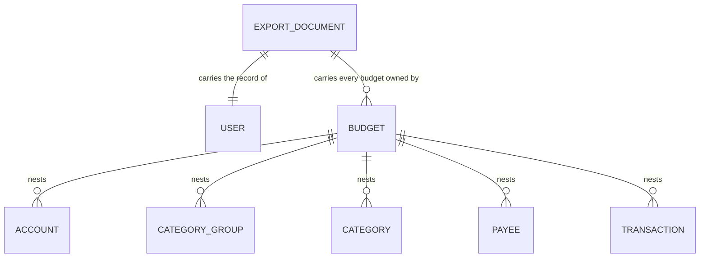
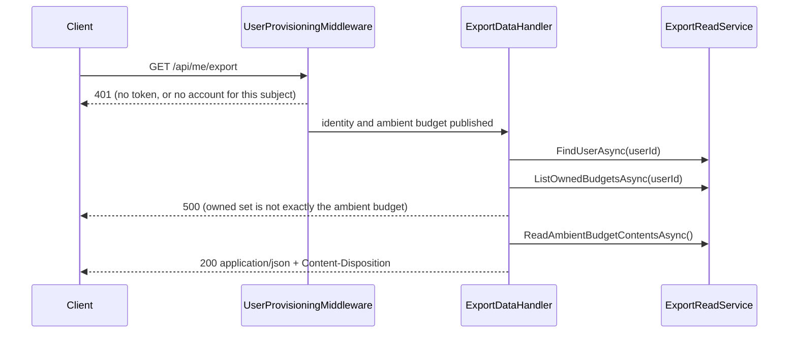

# Export

## Table of Contents

- [Purpose](#purpose)
- [Key Entities](#key-entities)
- [Constraints](#constraints)
- [Business Rules & Invariants](#business-rules--invariants)
- [Workflows & State Transitions](#workflows--state-transitions)
- [Decision Trees](#decision-trees)
- [Integration Points](#integration-points)
- [Edge Cases & Known Gotchas](#edge-cases--known-gotchas)

## Purpose

Export is the action that hands a person a complete copy of what the server holds about them: one
authenticated request, one JSON document, no queue, no emailed link and no waiting period. It is the
counterweight to [erasure](erasure.md) — the two together are what make "the data is yours" a
capability rather than a claim, and neither is reachable behind a support request. It cuts across
every domain area — the `users` row from [users-and-ownership.md](users-and-ownership.md), the budget
from [budgets.md](budgets.md), and every budget-owned table — so the completeness rule lives here
rather than being split across the files whose rows it reads. The thing worth understanding before
changing anything here is what the export **cannot** do: both isolation layers beneath it are scoped
to the *ambient* budget and neither takes an argument, so the export can read the contents of one
budget per request. That is not a limitation it works around; it is the reason for the central rule
below — when the owned set is not exactly that budget, the export **refuses** rather than returning
the part it can reach.

## Key Entities

Export owns no entity and writes no row. It reads the account graph that already exists, and nests it:



The document carries a schema version, the user record, and an array of budgets each holding its five
collections as nested arrays. Property names are camelCase, consistent with the rest of the API.
Every persisted column of every row it names ships, **including the parent ids the nesting already
implies** — `budgets.userId` and each row's `budgetId`.

`credentials`, `sessions`, `passkey_public_keys`, `passkey_signature_counters`,
`webauthn_challenges`, `recovery_code_hashes` and `currencies` are **not** in the document. The first
six are identity material rather than the person's own records; `currencies` is global reference data
belonging to no tenant. The sixth carries an argument of its own — see the rule below.

## Constraints

### MUST

- **The document MUST carry every persisted column of every row it names.**
  - **Why**: a row present with a null name, a zeroed balance or a dropped parent id satisfies a set
    comparison exactly, and a person restoring from that file would find the rows there and the data
    gone.
  - **Enforced in**: the export's own records in `ExportDocument`, pinned by
    `DataExportCompletenessTests` — see the own-records rule below.
- **The document MUST carry a schema version identifier.**
  - **Why**: a saved file outlives the deployment that wrote it, and the version is the only thing
    telling a reader which shape they are holding.
  - **Enforced in**: `ExportDocument.CurrentSchemaVersion`, pinned by
    `DataExportEndpointTests.Export_CarriesSchemaVersionOne`.
- **Every array MUST ascend by `CreatedAtUtc`, with `Id` as a tiebreaker.**
  - **Why**: without an `ORDER BY`, PostgreSQL row order is unspecified and shifts on any update,
    vacuum or plan change.
  - **Enforced in**: `ExportReadService`, with the contract on `IExportReadService` — see the
    ordering rule below.
- **The export MUST be delivered in the same request-response exchange, with no queue, no
  notification and no waiting period.**
  - **Why**: an export behind a queue or an emailed link is an export behind an operator, and the
    point of the feature is that a copy of one's own data is not.
  - **Enforced in**: `DataExportEndpoints` answers the request directly; no job table, queue or
    notification path exists on this route.
- **The export MUST refuse, rather than answer partially, when it cannot reach everything the
  requesting user owns.**
  - **Why**: a partial answer under a document claiming completeness is silent truncation — see the
    central rule below.
  - **Enforced in**: `ExportDataHandler.HandleAsync` throwing `ExportCompletenessException` before
    the contents are read.
- **The response MUST carry `application/json` and a filename-bearing content disposition, and the
  filename MUST be rendered in the Gregorian calendar whatever culture the serving thread holds.**
  - **Why**: `attachment` is what makes a browser save the file; a non-Gregorian culture renders a
    filename centuries wrong — see the disposition rule below.
  - **Enforced in**: `DataExportEndpoints.DispositionFor`, pinned by
    `DataExportEndpointTests.Export_NamesTheFileWithTheRequestInstantInUtc` and its culture control.

### MUST NOT

- **The export MUST NOT summarize, sample, aggregate, paginate or truncate.**
  - **Why**: every one of those is a design that looks correct at small volumes and silently loses
    data at large ones.
  - **Enforced in**: the handler assembles complete lists — no pagination parameter exists on the
    route — and `DataExportCompletenessTests` pins the full shape.
- **The export MUST NOT write a row, a column or a log line.**
  - **Why**: there is no job record, no `exported_at`, no audit trail — a row recording that an
    export happened is a remnant an [erasure](erasure.md) would have to destroy, and a log line
    naming the exporting user is the same remnant kept where no erasure gate can reach it.
  - **Enforced in**: the no-logger reflection test and the schema gates — see the persists-nothing
    rule below.
- **The export MUST NOT take the account's identity from the request — not from the route, not from
  a query string.**
  - **Why**: an identity a caller supplies is an identity a caller chooses; the ambient identity is
    resolved server-side or not at all.
  - **Enforced in**: the route pattern carries no parameter and `ExportDataHandler` reads
    `IUserContext` and nothing else.
- **The export route MUST NOT carry `ProvisionsUser` metadata.**
  - **Why**: an export is a read; a route that minted an account in order to answer one would let a
    provider token outliving an erasure bring the account back as an empty shell.
  - **Enforced in**: the route registration in `DataExportEndpoints` withholds the marker — see
    [users-and-ownership.md](users-and-ownership.md) for the marker's own rules.
- **The refusal message MUST NOT name a budget id.**
  - **Why**: in Development `GlobalExceptionHandler` echoes the exception's message *and* its full
    stack trace into the response body, so an id in the message leaks twice.
  - **Enforced in**: the wording of `ExportCompletenessException`'s message, which names counts and
    never ids.
- **The document MUST NOT carry recovery-code material of any kind — no verifier hash, no remaining
  count, no issued instant, and no row for the set's credential.**
  - **Why**: a hash in a downloaded file is an offline grinding target — see the rule below.
  - **Enforced in**: `ExportDocument` and `ExportReadService` have no member for any of it.

## Business Rules & Invariants

- **Rule**: The export refuses when the set of budgets the user owns is not **exactly** the ambient
  budget. Set equality, in both directions — not "more than one".
- **Why**: the five collection reads are scoped by the `BudgetIsolation` query filter and the
  `budget_isolation` policy, neither of which takes an argument and neither of which can be
  re-pointed part-way through a request. So a user owning two budgets would receive one budget's
  contents under a document claiming to hold everything — which is precisely the truncation the
  constraint above forbids, shipped as a green feature. Refusing is the honest answer, and it becomes
  the tripwire on the day a second budget becomes creatable.
  - **Both directions, because they fail differently.** Owning a budget the request is not inside
    means rows are missing. The request being inside a budget the user does not own means one
    budget's rows would be filed under another's id — a count-only guard passes that case cleanly.
  - **The refusal is a `500`, and deliberately has no `IExceptionHandler` of its own.** `404` would
    say the export does not exist; it does, and the server cannot assemble it. `400` would blame a
    request with no field to correct. `409` implies a resolution the client can perform, and the
    client cannot create, delete or select budgets because no endpoint does. A *named* 5xx mapping
    is the thing a later reader could soften into "return the ambient budget and a warning" —
    leaving it on the catch-all means the only way to change the answer is to change the throw.
- **Enforced in**: `ExportDataHandler.HandleAsync` throws `ExportCompletenessException` before the
  contents are read. `ExportDataHandlerTests.HandleAsync_WhenTheUserOwnsABudgetOtherThanTheAmbientOne_`
  `RefusesRatherThanTruncating` and `…HandleAsync_WhenTheAmbientBudgetIsNotOneTheUserOwns_Refuses`
  hold the two directions — the second is red against a `Count > 1` guard that passes the first.
  `…HandleAsync_ForAnOwnerOfOnlyTheAmbientBudget_ReturnsThatBudget` is the control without which a
  handler throwing on every request would satisfy both. Over HTTP,
  `DataExportRefusalTests.Export_ForAnOwnerOfASecondBudget_IsRefusedWithoutABody`, whose control
  `…Export_ForAnOwnerOfTheProvisionedBudgetAlone_IsAnswered` proves the seeding path can produce a
  success.
- **Example**: an owner of only the provisioned budget receives the complete document with a `200`.
  The same person handed a second budget out of band gets a bodyless `500` on the next export — and
  keeps getting it until the export can read both.
- **Counterexample**: a user owning a second budget receives a document listing both budgets with one
  budget's accounts and transactions repeated under each. Nothing in the file says which rows are
  real, the totals are wrong, and a person restoring from it would create duplicate money movement.
- **Source**: `[SOURCE: user-story]`

---

- **Rule**: The export document has **its own records**. It does not reuse the DTOs the list
  endpoints return.
- **Why**: those DTOs are shaped for display and are lossy for an archive.
  `Application/Transactions/TransactionDto.cs` coerces a null `Description` to `string.Empty`, turning
  "the person wrote no description" into "the person wrote an empty string". `PayeeDto` is
  `(Id, Name)` and carries neither `CreatedAtUtc` nor `BudgetId`. `AccountDto` denormalizes currency
  name and symbol, adding fields no column holds. The read services behind them also order for
  display — `PayeeReadService` orders by name, which is the one order an export must not use, because
  a rename would reshuffle the whole file and make two exports of unchanged data diff.
- **Enforced in**: `Application/Users/ExportData/ExportDocument.cs` and `ExportReadService`.
  `DataExportCompletenessTests.Export_PreservesTheNullsAPersistedRowCarries` is the test that goes red
  the moment the document is rebuilt on `TransactionDto`, and it asserts present-and-null rather than
  reading the value, because a `JsonNode` indexer answers `null` identically for an absent property
  and a JSON null.
- **Counterexample**: folding the document back onto the display DTOs to remove "duplication". It is
  not duplication: the display shapes are free to change with the screens that consume them, and an
  export bound to them would follow.
- **Source**: `[SOURCE: user-story]`

---

- **Rule**: Every array ascends by `CreatedAtUtc`, and that ascent is the read port's contract rather
  than an implementation detail. `Id` breaks ties deterministically but is **not** part of the
  contract.
- **Why**: creation order is the meaningful order for an archive and it survives a rename, so two
  exports a week apart diff only where the data changed. `CreatedAtUtc` alone is not a total order —
  provisioning writes the user and the budget from one `TimeProvider` read — so a tiebreaker is
  needed, and it is **not** `Id` alone: `IBudgetRepository.FindFirstForUserAsync` already states as
  contract that UUID v7 sorts by creation time under PostgreSQL's `uuid` byte order but **not** under
  .NET's `Guid.CompareTo`.
  - **The tiebreaker is deliberately outside the contract**, because it cannot be inside one. `uuid`
    collation is provider-defined: PostgreSQL compares the sixteen bytes big-endian, `Guid.CompareTo`
    compares fields. Two rows sharing an instant may therefore order one way through the read service
    and another through an in-memory implementation, with neither being wrong. Promising
    `(CreatedAtUtc, Id)` as a whole would be promising an agreement across implementations that no
    code here delivers.
- **Enforced in**: `ExportReadService`, with the contract stated on `IExportReadService`.
  `DataExportCompletenessTests.Export_OrdersEachCollectionByCreationRatherThanByInsertionOrder` seeds
  out of band with `created_at_utc` **inverted** against insertion order — without that inversion the
  test is a decoration, because rows written over HTTP get monotonic timestamps and monotonic v7 ids
  at once, so insertion, id and creation order all coincide and nothing can be distinguished.
- **Example**: a payee renamed between two exports keeps its position in the file; only its name
  line diffs. Under the display services' name ordering, the same rename would reshuffle the whole
  array.
- **Source**: `[SOURCE: user-story]`

---

- **Rule**: The export persists nothing and logs no identifier. `ExportDataHandler` takes no `ILogger`
  and no `ILoggerFactory`.
- **Why**: the value this handler holds in memory is every transaction a person has recorded plus the
  address they signed up with. One `LogDebug` of the document, or of the id it was assembled for,
  copies the lot into a sink with a different retention policy and a different audience from the
  database it came from — and no gate anywhere reads a log line from this path, so there is nothing to
  trade against. A stored row is worse still: a job record, an `exported_at` column or an audit table
  is a remnant an [erasure](erasure.md) would have to destroy, and a table carrying neither
  `budget_id` nor `user_id` fails `RlsCoverageTests` and the deploy-time verifier at once.
- **Enforced in**: `ExportDataHandlerTests.TheHandlerThatAssemblesAnExport_TakesNoLoggerDependency`,
  reflection over the constructors with a non-vacuity guard on the parameter count — a query that came
  back empty would satisfy "no logger" perfectly while measuring nothing. It covers **one type**: not
  `DataExportEndpoints`, which lives in `Api` and which `UnitTests.csproj` deliberately does not
  reference, and not the framework, which logs on its own.
- **Source**: `[SOURCE: user-story]`

---

- **Rule**: The export carries **no recovery-code material**. Not the verifier hashes, not the count
  of codes remaining, not the set's `credentials` row, not the day it was issued.
- **Why**: the completeness rule this file opens with is about the person's **own records** — the
  money picture they created — and identity material has always sat outside it. Recovery codes make
  that boundary worth restating rather than inheriting, because they are the first excluded rows a
  reader can argue are "about the person" in a way a signature counter is not.
  - **What a hash would give the person: nothing.** They cannot redeem with it — there is no
    preimage — and they cannot regenerate a code from it. The one thing they might want, *"do I
    still have codes?"*, is a live question about an account that may change tomorrow, and
    `GET /api/me/recovery-codes` answers it exactly. A saved file answering it answers it as of the
    day it was written.
  - **The count is excluded for a smaller reason and it is still a reason.** *"This account has two
    recovery codes left"* is a fact worth harvesting on its own: an account down to its last code is
    an account worth attacking now. It is the same argument `CountRecoveryCodesHandler` makes for
    taking no logger.
- **Enforced in**: `ExportDocument` and `ExportReadService`, which name the `users` row, `budgets` and
  the five budget-owned collections and nothing else. There is no member for any of it, so exclusion is
  structural rather than a filter somebody has to remember — which is also why no test guards it
  directly: the shape of the document is pinned by `DataExportCompletenessTests`, and a member added
  here would have to be added deliberately.
- **Counterexample** — what a hash in the file would cost: a value in a downloaded artifact that
  something can be run against offline. An export lands in a downloads folder, a backup, a cloud
  sync and an email attachment, and it lives there for years with none of the database's protections
  around it. Putting the digest a redemption is matched against into that artifact turns "somebody
  read your export" into "somebody can grind for your recovery codes at their leisure, and succeed
  silently if the client that minted them was ever weak". That is precisely the attack the entropy
  rule the server **cannot enforce** is the only defence against — see
  [recovery-codes.md](recovery-codes.md).
- **Source**: `[SOURCE: user-story]`

---

- **Rule**: The schema version is the integer `1`.
- **Why**: a monotonic counter compares as a number and raises no question about whether `1.10`
  outranks `1.9`.
- **Enforced in**: `ExportDocument.CurrentSchemaVersion`, pinned by
  `DataExportEndpointTests.Export_CarriesSchemaVersionOne` — which asserts the **literal**, never the
  constant. A test reading the constant agrees with whatever the code says and stays green through the
  one change it exists to notice.
- **Source**: `[SOURCE: user-story]`

---

- **Rule**: The response carries `Content-Disposition: attachment; filename="budgetoid-export-{yyyyMMdd}T{HHmmss}Z.json"`,
  formatted from the request instant in UTC under `CultureInfo.InvariantCulture`.
- **Why**: `attachment` is what makes a browser save the file instead of rendering it in a tab, and a
  timestamped name stops a second export overwriting the first. The invariant culture is
  load-bearing, not decoration: the same format string under a non-Gregorian culture renders the
  Buddhist year and produces a filename 543 years wrong, and a server whose culture comes from its
  host image is not an exotic deployment.
  - **This is a transport decision with a known expiry, and the rule says so rather than letting a
    future reader discover it.** It is correct while the server assembles the file a person keeps.
    The day the client decrypts the document before it reaches the user, the saved artifact is
    created by the browser and a server-sent `attachment` is at best dead weight — at worst it means
    navigating to the URL saves ciphertext under a name that looks like a finished export. The
    gotcha below about `Access-Control-Expose-Headers` is the same boundary seen from the other
    side.
- **Enforced in**: `DataExportEndpoints.DispositionFor`, pinned **exactly** — not by a `Contains` — by
  `DataExportEndpointTests.Export_NamesTheFileWithTheRequestInstantInUtc`, because the two halves that
  break silently are the `attachment` token and the quoting. Its control,
  `…Export_UnderANonGregorianCultureIsStillNamedInTheGregorianCalendar`, runs the pipeline under
  `th-TH` and needs `factory.Server.PreserveExecutionContext = true` set **before** the client is
  built: `CultureInfo.CurrentCulture` is an `AsyncLocal` and `TestServer` suppresses execution-context
  flow, so without that line the control sets a culture the endpoint never sees and passes however the
  filename is formatted. The same control also fixes the fake clock's local zone away from UTC —
  without that, `GetUtcNow()` and `GetLocalNow()` name the same moment and the UTC half of the claim
  has no mechanism behind it.
- **Source**: `[SOURCE: user-story]`

---

- **Rule**: The response body is assembled with `TypedResults.Ok`, never a file result and never
  hand-serialized JSON.
- **Why**: both of those write through whatever `JsonSerializerOptions` the call site passes,
  bypassing `ConfigureHttpJsonOptions` — so camelCase and the string-enum converter would come from
  somewhere other than the rest of the API, and the exported document would name its columns
  differently from every response the same client already parses. `Ok<T>` resolves the options from
  DI at execute time.
- **Enforced in**: `DataExportEndpoints`; the wire shape is pinned by `DataExportCompletenessTests`,
  which reads every response as `JsonNode` rather than deserializing into `ExportDocument` — checking
  the document against the declarations that produced it would pass over a property renamed on both
  sides at once.
- **Source**: `[SOURCE: user-story]`

## Workflows & State Transitions

There is no state to transition through. An export is a read: nothing is marked, scheduled or
flagged, and the account is in the same state after one as before.



The gate sits **before** the contents are read, so a document that will not be assembled costs nobody
a round trip over their own transactions.

## Decision Trees

How a request to `GET /api/me/export` is answered:

```
IF the request carries no valid token                       ← arms are mutually exclusive
  THEN 401 from the fallback policy (title "Unauthorized")
ELSE IF the caller's session reads no budget content        ← a federated sign-in. This route is
  THEN 403 from the fallback policy's FullSessionRequirement   the reason the rule cannot be keyed
                                                               on the ambient budget: it reads
                                                               budgets by user_id
ELSE IF the token's subject resolves to no account
  THEN 401 from UserProvisioningMiddleware (its own NoAccountTitle)
ELSE IF the set of budgets the user owns ≠ { the ambient budget }   — either direction
  THEN 500: ExportCompletenessException, before any contents are read
ELSE
  THEN 200 with the complete document and the Content-Disposition header
```

The two 401 arms are distinct refusals from different components — see the gotcha below; the 500 arm
is the completeness rule above.

## Integration Points

- **The grant matrix** — nothing was added. The role already holds `SELECT` on `users`, `budgets` and
  the five budget-owned tables, so `AppRoleGrantMatrixTests` staying green **untouched** is the proof
  this feature needed no privilege. A `42501` from this path is a bug in the query, never a missing
  grant.
- **Row-level security** — `user_isolation` scopes the `users` and `budgets` reads;
  `budget_isolation` scopes the five collection reads. See
  [data isolation](../engineering/data-isolation.md).
- **`IBudgetContext` and the query filters** — the five reads carry no `where budget_id = …` at all;
  tenancy comes from the filter and the policy beneath it. `ReadAmbientBudgetContentsAsync`
  deliberately takes no budget id, following `ITransactionRepository.DeleteAllForAmbientBudgetAsync`:
  an id parameter would be a tenancy argument with no ownership check to pair with it.
- **[Erasure](erasure.md)** — `ErasureIrreversibilityTests` pins the `/api/me/erasure` **resource**
  rather than the `/api/me` namespace, and names an export of one's own data as exactly what that
  narrowing was written to leave room for. The route-table scan still applies: no reversal word may
  appear in this route's pattern, display name or endpoint name.
- **[Users & ownership](users-and-ownership.md)** — the route deliberately withholds `ProvisionsUser`,
  so an authenticated subject with no account is refused rather than minted.

## Edge Cases & Known Gotchas

- **`currencyCode` is a dangling reference, on purpose.** `currencies` is global reference data owned
  by no tenant, so it is not in the document, and `accounts.currencyCode` therefore points at
  something the file does not contain. A completeness check measured against a full column inventory
  must not read this as a hole.
- **The document is fully materialized, not streamed, and nothing bounds its size.** It is built as
  in-memory lists and then serialized. `TypedResults.Ok` serializes through a `PipeWriter` in buffers
  rather than into one string, so the peak is closer to one copy of the document than two — but one
  copy is still unbounded. One person's budget is small enough for that today and the feature carries
  no latency target; the ceiling is stated here because nothing in the code states it.
- **The complete-or-nothing guarantee ends when the response starts.** The status and the
  `Content-Disposition` are written before the body is serialized, so a serialization failure
  mid-write leaves a truncated JSON document under a valid export filename with a `200` already sent,
  and `GlobalExceptionHandler` cannot take it back. "Refuses rather than truncates" holds up to the
  first byte and no further. Stated as a boundary rather than a defect: buffering the document to
  close it would double the memory on a path that already materializes everything.
- **The seven reads are not one snapshot.** `FindUserAsync`, `ListOwnedBudgetsAsync` and the five
  collection reads each run at PostgreSQL's default READ COMMITTED, so a write landing mid-export can
  produce a document whose parts reflect different states — a transaction naming a payee the payee
  array does not carry. The `budgets` read is one of the seven, so even the refusal can decide on a
  set that has changed by the time the contents are read. Two things a reader should not assume:
  **one session per person does not mean one request at a time** — a bearer token authorizes as many
  concurrent calls as a client cares to make, so this is reachable today, not only after multi-budget
  ships; and **wrapping the reads in `ITransactionalExecutor` would not close it**, because that
  opens at READ COMMITTED and PostgreSQL takes a fresh snapshot per statement. Closing it needs
  `REPEATABLE READ` around all seven. A known gap, not a promise.
- **`Content-Disposition` is unreadable to browser JavaScript.** `Api/Program.cs` sets no
  `Access-Control-Expose-Headers`, so a cross-origin `fetch` sees the body and not the filename. A
  client that wants to name the saved file will meet this and it will look like a bug in the endpoint.
  The web client therefore names the file itself, from the **browser's** clock, in the same
  `budgetoid-export-{yyyyMMdd}T{HHmmss}Z.json` shape (`settings/export-filename.ts`) — so the saved
  name and the disposition are minted by two clocks and can differ by seconds, and **neither is
  authoritative**.
- **Two 401s reach this route and they are not the same refusal.** No token at all is answered by the
  fallback policy through `UseStatusCodePages`, titled `"Unauthorized"` from the status map alone. A
  valid token naming no account is answered by `UserProvisioningMiddleware` with its own
  `NoAccountTitle`. A test asserting only the status cannot tell a route that lost its authorization
  from one that lost the middleware.
  - **And a 403 beside them, from the same policy as the first 401.** A session that reads no budget
    content is refused here — that arm is in the tree above — and its body carries *no* title at all,
    which is what tells it from the first-party control's 403 on this same route. So the family this
    route can answer is four refusals across two statuses, and only one of the four is silent. Read
    the count in bold above as "the two 401s", never as a census of what this route refuses.
- **A refusal in Development carries the stack trace.** `GlobalExceptionHandler` writes `detail`,
  `exceptionType` and the full `stackTrace` when the environment is Development — Staging gets
  neither — and the stack trace contains the message. Anything put in
  `ExportCompletenessException`'s message is therefore in the response body twice, which is why it
  names counts and never ids.
- **Two 500s reach this route and, unlike the two 401s, they are indistinguishable.** The refusal has
  no exception handler of its own, so it carries the catch-all's `"An unexpected error occurred."` —
  the same title a `NullReferenceException` or an Npgsql timeout would carry. An integration test can
  therefore assert *a* 500, never *this* 500; the refusal's type is pinned only by the unit tests in
  `ExportDataHandlerTests`. That is the accepted price of leaving it on the catch-all, not an
  oversight.
- **Every refusal is logged at `LogError` with a stack trace**, by the catch-all handler. The
  "logs no identifier" rule survives that only because the message names counts — it is held by the
  wording, not by a mechanism. Read the consequence as the tripwire it is: on the day a second budget
  becomes creatable, every export turns into an ERROR-level alert. That is the signal the refusal
  exists to raise, not noise to silence.
- **Money ships as JSON numbers.** `amount` and `openingBalance` are rendered unquoted at
  `numeric(14,4)` scale, which is exact for a .NET reader. Any JavaScript reader parses them into an
  IEEE-754 double, whose significand does not cover that column's full range. For a document that
  refused `?? string.Empty` to avoid losing a null, this is the same class of loss at the other end
  of the wire, and a reader of a saved file should know it. **The web client is a pipe and never
  parses the document** — `MeApiService.getExport` requests `responseType: 'blob'` and the bytes go
  to disk unread — precisely so a `JSON.parse` → `JSON.stringify` round-trip on the way to the file
  cannot replace exact amounts with doubles. `me-api.service.spec.ts` pins the response type, with
  the `GET /api/me` call beside it resolving as `json` so the pair proves it is a per-call decision;
  do not "simplify" the export call into `get<ExportDocument>()`.
