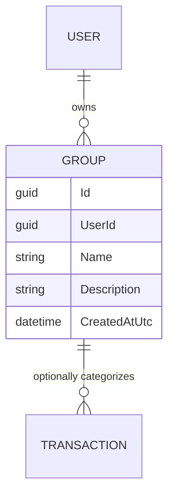

# Groups

## Table of Contents

- [Purpose](#purpose)
- [Key Entities](#key-entities)
- [Constraints](#constraints)
- [Business Rules & Invariants](#business-rules--invariants)
- [Integration Points](#integration-points)
- [Edge Cases & Known Gotchas](#edge-cases--known-gotchas)

## Purpose

A **Group** is a user-defined **category** that a transaction can be filed under — "Groceries",
"Rent", "Travel", and so on. "Group" and "category" are the same thing; the UI and code call it a
group. Grouping is optional on a transaction. Each group is owned by one user (see
[users-and-ownership.md](users-and-ownership.md)).

## Key Entities

- **Group** — `Id`, `UserId` (owner), `Name`, optional `Description`, `CreatedAtUtc`.

## Constraints

### MUST NOT

- **A group MUST NOT be deleted while it still has transactions.**
  - **Why**: Deleting it would strip the category off historical transactions (or orphan the
    reference), losing information the user recorded on purpose. They must recategorize first — a
    deliberate integrity guard, not a silent cascade.
  - **Enforced in**: `DeleteGroupHandler` calls `IGroupRepository.HasTransactionsAsync` and throws
    "Group cannot be deleted because it has transactions." if any exist.

## Business Rules & Invariants

- **Rule**: A group requires a non-blank `Name` of at most 200 characters (trimmed).
- **Why**: The name is the category label shown in every dropdown and list; blank or runaway names
  make categorization useless.
- **Enforced in**: `Group.Create` / `Group.Update` → `ValidateOrThrow` in `Domain/Groups/Group.cs`.
- **Example**: `"  Groceries "` is stored trimmed as `"Groceries"`.
- **Source**: `[SOURCE: code-audit]`

---

- **Rule**: `Description` is optional; a blank value is stored as null; if present it must be ≤ 500
  characters.
- **Why**: A description is an optional note about what the category covers; unbounded text would be
  a storage/UI hazard.
- **Enforced in**: `Group.Create` / `Group.Update` (`NormalizeDescription` + length check).
- **Source**: `[SOURCE: code-audit]`

## Integration Points

- **[Transactions](transactions.md)**: a group is an optional category on a transaction, referenced
  by id at transaction-create time and validated to exist. The delete guard above depends on the
  transaction data.
- **[Users & Ownership](users-and-ownership.md)**: every group is stamped with and filtered by its
  owner's `UserId`.

## Edge Cases & Known Gotchas

- **Groups are the only user-managed category concept**: there is no hierarchy, no color, no
  budget-per-category. A group is just a name + optional description. Any of those would be new
  domain concepts.
- **Delete guard mirrors accounts**: the "can't delete while it has transactions" rule is identical
  in spirit to the account delete guard — both favor preserving history over convenience. See
  [accounts.md](accounts.md).
