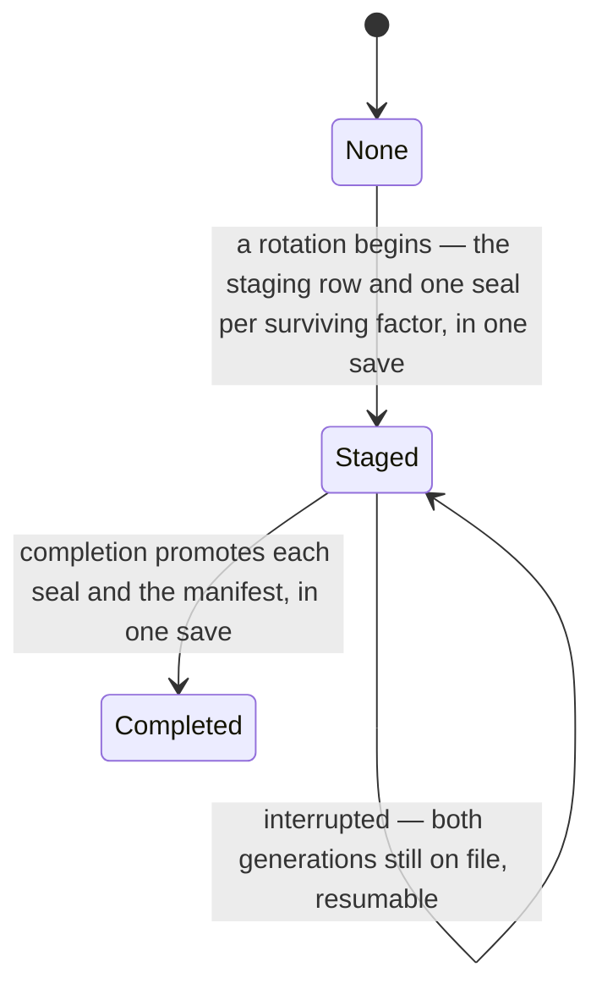

# Key Rotation

## Table of Contents

- [Purpose](#purpose)
- [What is built today](#what-is-built-today)
- [Key Entities](#key-entities)
- [Constraints](#constraints)
  - [MUST](#must)
  - [MUST NOT](#must-not)
- [Business Rules & Invariants](#business-rules--invariants)
- [Workflows & State Transitions](#workflows--state-transitions)
- [Edge Cases & Known Gotchas](#edge-cases--known-gotchas)

## Purpose

An account owns one content key and one index key, and every recovery factor holds an **ECDH P-256
key pair**: its private key *wrapped under* the key-encryption key that factor derives, and the
account's two keys *encapsulated to* its public key — [account-keys.md](account-keys.md) holds that
shape. **Rotation is the remedy for a suspected compromise of those keys themselves**: draw a new
pair, re-encrypt every narrative field under the new content key, recompute every blind index under
the new index key, and encapsulate the new pair to the public key of every factor that survives.

**That last clause is why the key pair exists at all, and a reader meets it better here than
reconstructs it later.** Under the arrangement this replaced, a factor held the account's two keys
wrapped directly under its own key-encryption key — and for a passkey that key is a WebAuthn PRF
output, which exists only while somebody is touching the authenticator. Re-wrapping therefore needed
**every** registered device present at once, and an account with a hardware key in a drawer could not
rotate at all. Encapsulating to a public half needs no secret from the factor, so a run needs the old
content key and a set of public keys, and no authenticator but the one already in the person's hand.
[ADR 0025](../decisions/0025-give-every-recovery-factor-an-ecdh-key-pair.md) records that decision
and the alternatives it refused.

**NFR-027 is that clause as a requirement — a rotation shall require the exercise of at most one
authenticator, whatever the number of registered recovery factors — and it is demonstrated rather
than argued.** One case in `BeginKeyRotationHandlerTests` —
`HandleAsync_WithElevenFactors_StagesThemAllOnOneReauthentication` — begins a run on an account
holding one passkey and the ten factors of a recovery-code card, and eleven seals are staged while
exactly one challenge is consumed. The seal count is asserted beside
the consume count on purpose: one consume alone is true of a handler that refused everything, or of
one that sealed the passkey and left the card behind.

It is deliberately **not** what the industry usually means by "key rotation". A cloud key service
rotates by minting new key material and keeping every earlier version forever, so that nothing has to
be rewritten; that defends against key material ageing, not against a key that leaked. Here the whole
point is that the previous content key stops opening anything, which is only true if every row is
rewritten.

**Rotation is not factor management, and the two must not be conflated.** Registering or revoking an
authenticator writes or removes that one factor's row — cheap, touching no budget row, and leaving
every other factor's key pair byte-for-byte where it was. Rotating the keys themselves rewrites the
account. Conflating them would make registering a second passkey as expensive as re-encrypting
everything.

## What is built today

**The schema, the domain behaviour, the completeness gate, the handlers a run needs, the three routes
that walk one, the read that resumes an interrupted one, a typed client for all four, the material a
run carries, and the driver that spends it — now from either end. A browser can begin a rotation and
walk it to its 204, and a browser that lost one to a reload can pick it up and finish it. What is
still missing is the screen that presses either button.** `POST /api/me/key-rotation` stages a run,
`POST /api/me/key-rotation/chunks` re-seals a batch of rows,
`POST /api/me/key-rotation/completion` promotes the staged generation, and
`GET /api/me/key-rotation` hands a staged run back to a client that lost it — so `key_rotations`,
`key_rotation_seals`, the six `rotation_id` stamp columns, `wrapped_account_keys` and
`factor_manifests` can all now hold values a browser caused to be written, and none of that work is
lost to a reload. `key-rotation-api.service.ts` names the
four routes and mirrors every request and response record member for member; it is a transport, so
it holds no key, runs no cipher, makes no refusal of its own and reads no conflict.
`key-rotation-material.ts` takes a key-encryption key and the two reads and answers with both
generations of the account's keys, the factor set its own manifest declares, the epoch the next
manifest is filed at, that manifest, and one seal per factor — drawing the next generation when the
resume read says nothing is staged, and otherwise recovering the staged one: restated byte for byte
for a resume, re-staged to the live factor set for a begin. It is framework-free:
no injectable, no signal, no HTTP. `me-api.service.ts`
argues, over the sibling route that replaces a card of codes, why the account's own keys are not
something custody can be asked for today.
**`factor_manifests` was never empty**: registration files a row for every account it creates, at
epoch 1, and three paths promoted one before this; the completion is the fourth.

Built: the `key_rotations` staging table and its `KeyRotation` entity, now carrying a staged
**manifest** and a staged **epoch** rather than a factor and two envelopes; the `key_rotation_seals`
table and its `KeyRotationSeal` entity, one row per surviving factor per run; the six `rotation_id`
stamp columns; the presence rule; the six reseal members and the clearing rule beside them; the
completeness gate — `Application.KeyRotations.IRotationCompletenessReadService` and its one
implementation — which is registered and which nothing calls; and the begin —
`BeginKeyRotationHandler` over `Domain.Users.IKeyRotationRepository` and
`Application.KeyRotations.IRotationInventoryReadService` — which writes **the staging row and one
seal per factor in one save** and which holds the factor-set gate over those seals; and the begin's
route, `POST /api/me/key-rotation` in `Api.Endpoints.KeyRotationEndpoints`, which answers **200**
with the inventory and the chunk budget, decodes the staged manifest before the command is built —
the one manifest-carrying route where the decode is the endpoint's, because
`BeginKeyRotationCommand.StagedManifest` is bytes where its three siblings carry text — and declares
no authorization metadata of its own, so the fallback policy covers it and a locked session is
refused; and the chunk that re-seals rows — `ResealRowsHandler` over
`Domain.Security.INarrativeResealRepository` — which checks the chunk against the rotation the
account actually has staged, **resolves every row across all five arms before it mutates one**,
**drives each arm from the command and never from what the port answered**, and writes all five arms
in **one save inside one unit of work**. It has **five arms and no budget arm**, for the reason the
`rotation_id` grant bullet below gives; and the chunk's route, `POST /api/me/key-rotation/chunks` in
the same class as the begin, which answers **204** with an empty body, **decodes every sealed member
before the command is built** — the same asymmetry the begin has, for the same reason, since
`ResealRowsCommand` carries decoded `IndexedName` and `NarrativeField` values rather than text — and
declares **no authorization metadata and no re-authentication gate**, so the fallback policy covers
it and a locked session is refused; and the completion — `CompleteKeyRotationHandler` over the same
repository and the completeness gate — which promotes the manifest and copies every staged seal into
its own factor's `wrapped_account_keys.encapsulated_account_keys` in **one save inside one unit of
work**, behind [six ordered refusals](#completing-a-run-the-order-is-the-property).
`Domain.Users.WrappedAccountKeys.Promote` is the member that overwrites a live factor, and
`IKeyRotationRepository.PromoteAsync` is the only place in the product that says those rows and that
manifest move together; and the completion's route,
`POST /api/me/key-rotation/completion` in the same class as the other two, which answers **204**
carrying nothing, **binds one member — `rotationId` — and judges none of it**, and declares **no
authorization metadata and no re-authentication gate**, so the fallback policy covers it and a locked
session is refused; and the resume read — `GetKeyRotationStateHandler` over the same repository and
the same inventory read service as the begin — and its route, `GET /api/me/key-rotation` in the
same class as the three posts, which answers **200 always** carrying `rotation: null` when nothing
is staged, drives its `seals` off `key_rotation_seals` rather than off the account's live factors,
tells a finished run from a live one by **the epoch** rather than by the staging row's existence,
and writes `Cache-Control: no-store` on both answers. It declares the same three absences as the
routes beside it; and the client's transport for all four — `KeyRotationApiService`, four members
over `BaseApiService`, carrying `EXPECTS_UNAUTHENTICATED` on none of them because a 401 on any of
these is a session that ended — beside
[`vectors/key-rotation-wire-v1.json`](vectors/key-rotation-wire-v1.json), which freezes the whole
member set of each of the fourteen messages those four routes carry. That file has two readers and
the second one is the point: `key-rotation-api.service.spec.ts` compares the browser's own types
against those lists, and `KeyRotationWireContractTests` reflects over the server's own records,
camel-cases their property names through the serializer the API ships, and compares them against the
same lists as **sets in both directions**. Neither may be deleted on the grounds that the other
covers the contract, because a list one side alone reads pins one side alone; and the driver that
walks a run — `KeyRotationService`, root-provided, whose entry point `begin()` assembles the
material from one passkey assertion, posts the begin, reads the published inventory, collects every
narrative row across the five arms, re-seals each under the next content key and recomputes each
blind index under the next index key, posts them in chunks sized by the published budget, and posts
the completion. It **stops at the 204**: taking custody of the promoted generation is not its act,
so a rotation leaves the tab exactly as locked or unlocked as it found it. It holds both generations
in ECMAScript `#` fields with no accessor, publishes a phase, a numerator over a denominator and one
refusal word as signals, and keeps **no per-row progress record anywhere** — the chunk route answers
no count and the resume read carries none, and a client-side one would be a second numerator able to
disagree with the server's completeness gate. Its numerator counts **rows carried by a chunk the
server answered 204**, never rows collected, sealed or queued. Two refusals are its own on either
press and both abort before a chunk is posted: an inventory naming a budget row, which no chunk arm
can stamp and which no account in this product can produce, and an arm whose collected rows are
**fewer** than the count the inventory published, which is a client that cannot see rows the gate will
count. Collecting **more** than was published is legal and raises the denominator — rows created
between the begin and the collection are sealed under the generation being replaced, so a chunk has to
visit them. Rows created after a collection make the completion answer `rotation_incomplete`, and the
remedy is bounded: **three collect-and-send passes, then a named failure**, never a loop.

**A run is picked up from the other end by the same driver, and the leg that does it posts no begin.**
`KeyRotationService.resume()` reads `GET /api/me/key-rotation` first — an account with nothing staged
has no key material worth reading — and answers `rotation: null` by going back to rest with no word at
all, because each of the six says what became of a *run* and none of them is true of one that is not
there. Where there is a run it reads the account keys, hands both answers to
`key-rotation-material.ts`, which recovers the staged generation rather than minting one, and then
drives the identical collection, chunking and completion a begin drives — **quoting the `rotationId`
the server handed back**, minting no epoch and drawing no identifier, because the rows the interrupted
run stamped are rows this run really has done and the completeness gate counts a row only under the
run that stamped it. Both generations are live for the length of it, which is what the staging tables
are for: a resumed collection meets an account that is part one generation and part the other. The bar
starts again at zero and the whole account is carried again — the server publishes no per-row progress,
the resume read carries none, and a client-side one is refused.

**One refusal is the resume's own, it is made before the first list read, and both directions are the
rule.** A staged seal naming a factor the account no longer holds, and a live factor the staged run
sealed nothing for, are both `factors-moved`. The completion would refuse such a run anyway — the gate
above compares the staged seal set against the live factors in both directions and answers
`factor_set_moved` — but by then a whole account has been collected, re-sealed and sent under a
generation the promotion will not accept. The comparison costs one pass over two short lists off the
two reads the resume has already made. It is **not** the comparison `key-rotation-material.ts` makes:
that one judges the staged seals against the **staged** manifest, which on a resume is the set as it
stood when the run began, so the two agree perfectly while neither of them is the set the account holds
now.

**Which control a section draws is a read of its own.** `KeyRotationService.readStagedRotation()`
publishes the staged run's `startedAtUtc` and nothing else of it, on a `staged` signal — the record
beside that date carries one copy of the next generation's account keys per factor, which is not a
thing a screen binds. A read that did not happen publishes "nothing to finish" rather than a word, for
the same reason the null answer gets none, and it costs little: a begin made over a run that is really
there picks that run up. A run that reached its 204 clears the signal, and so does a `factors-moved` —
that word's copy tells somebody to start again rather than to finish, and a control labelled **Finish
rotating** underneath it would be a screen disagreeing with itself.

**The completion route hands back nothing, and that is the one decision the route makes.** Not a body
member, not an `ETag`, not a `Location`, not a header of its own: a client's rotation-epoch record may
rise only after the four-refusal gate over `GET /api/me/account-keys` has passed — see
[account-keys.md](account-keys.md) — and the promoted generation returned from here would be a number
a client could advance its record from having judged nothing, an oracle rather than an observation.
A header carries it as surely as a body does, `W/"2"` as surely as `2`. The client re-reads the
account keys and advances there.

**There is no re-authentication on the completion, and the absence is argued rather than inherited.**
The destructive act and the authorizing act are two legs of one operation and the authorization was
created at the begin. A caller holding a session and no authenticator reaches exactly two outcomes:
completing a run before the client meant to, which the completeness gate refuses, or completing a
finished run, which is what the legitimate client was about to do. Neither is a capability the begin's
gate did not already grant, and a prompt here would fall at the one moment a person has the most to
lose by abandoning the request.

**The repair a `factors-moved` points at is a begin and not a third press, and it carries the
interrupted run's generation to the set the account holds now.** `begin()` over a run that is still
staged recovers that run's generation out of a surviving factor's staged seal — which is what keeps
every row an earlier chunk already re-sealed readable — then encapsulates *that* generation to every
live factor and seals a manifest over the live set, at the epoch a begin files at, under the
`rotationId` already on file. Restating the staged pair there would post a seal set naming the
factors that were enrolled when the run began, which is the refusal the person pressed the control to
get out of. **The shape that holds it is one entry point per press**, in
`key-rotation-material.ts`: `assembleKeyRotationBegin` takes the resume read itself and decides on
`rotation === null`, so a generation is drawn in exactly the one case that permits it, and
`assembleKeyRotationResume` takes the staged run rather than the read, so it has no such case and no
draw anywhere on its path. A flag over one function was the other shape and is weaker — a caller
holding a staged run can pass the wrong value.

**Recovering needs a factor in *both* the staged seal set and the live set, and when there is none
the client says `inconsistent`.** If every factor that run staged a seal for is gone, nothing
anywhere holds that generation and every row an earlier chunk re-sealed under it was stranded when
the last of them went; no press undoes that. `unopened` would mean *another factor may well work* and
would send somebody through a whole recovery card over a state no card touches, so the word is the
one that says out loud that nothing they hold changes the answer.

Not built: the screen — no key-rotation section renders on `/app/settings`, no control exists, and
nothing runs the passkey ceremony either press is authorized by. Do not state it in the present tense
until it ships.

**The begin can write its row, and `key_rotations` still holds no `DELETE` of any shape.**
`app-role-grants.sql` grants `SELECT`, `INSERT` and a column-listed `UPDATE` over `rotation_id`,
`staged_manifest`, `staged_rotation_epoch` and `started_at_utc`. The insert and the update
arrive together because staging is an upsert rather than an append: `user_id` is the whole of the
primary key, so an account holds at most one rotation in flight, and a second begin — the repair path
when completion refuses — has to rewrite the row already there. `user_id` is never in a `SET` list and
so stays out of that column list; an omission from a column list is how this schema makes a column
immutable, never a `REVOKE` and never a table-wide grant. The absent `DELETE` is what stops a
half-written promotion path clearing the staging before it has promoted anything, which is the one
destruction here with no repair: until the live rows are overwritten, the staged seals are the only
copies of the new generation.

**`key_rotation_seals` holds `SELECT`, `INSERT` and `UPDATE (encapsulated_account_keys)`, and still
no `DELETE`.** The asymmetry between a read and a write is what decided the order they were granted
in: an ungranted **read** fails quiet — measured on `key_rotations`, the plaintext scan behind
`NarrativeSecrecyTests` meets `42501`, reports the table unscannable, and two secrecy gates then pass
while covering one table fewer than the schema holds — while an ungranted **write** fails loud, with
`42501` on the statement that wanted it, in the test exercising the path. So the read was granted
while the table was still empty, and the two writes arrived with the begin, which is the leg that
stages the seals: `INSERT` for a factor the previous run did not seal, `UPDATE` for one it did.
`user_id` and `factor_id` are off that column list, because one statement could otherwise re-file an
account's staged generation against another account's factor — and an omission from a column list is
how this schema makes a column immutable, never a `REVOKE` and never a table-wide grant.

**The `DELETE` stays absent, and the cascade it used to be credited to is not the one doing the
work.** Two cascading foreign keys reach this table and they must not be collapsed into one.
`FK_key_rotation_seals_key_rotations` (`user_id`) fires when the **parent row is deleted**, and a
second begin *updates* that row in place — `key_rotations` is keyed on `user_id` and is granted no
`DELETE` of any shape — so it never runs on the replacement path at all, which is precisely why the
`INSERT` and the `UPDATE` above are both needed: nothing clears the previous run's seals, so a begin
rewrites them one by one. What does clear a superseded seal is
`FK_key_rotation_seals_wrapped_account_keys`, the composite `(factor_id, user_id)` edge: a factor can
only leave the set a begin submits by its own `wrapped_account_keys` row being deleted — revocation
cascades `credentials` → `wrapped_account_keys` → the seal — and that deletion takes the seal with
it, with the referencing table owner's privileges rather than this role's. So a `DELETE` here would
be a privilege on a table holding key material, granted for a statement nothing can issue. **What
would change that**: a begin allowed to stage a *subset* of the account's factors, or a path that
removed a factor without deleting its `wrapped_account_keys` row.

**`key_rotations` hangs off `users` directly now, and that edge is the erasure chain rather than
bookkeeping.** Its only foreign key used to be the composite one to `wrapped_account_keys`, and that
left with `factor_id`. A table on no edge at all is a table the cascade from `users` never reaches, so
an erased account would have left a staging row behind carrying its own user id — which
[erasure.md](erasure.md) forbids outright, and which nothing in the application could have cleaned up
either, because this role holds no `DELETE` here. `FK_key_rotations_users` is the same claim restated
where the row's own column already points. `key_rotation_seals` carries **two** cascading keys —
`user_id → key_rotations` and `(factor_id, user_id) → wrapped_account_keys` — so an erasure reaches it
twice; PostgreSQL permits the two cascading paths that creates, the multiple-cascade-path restriction
being SQL Server's rather than this server's.

## Key Entities

- **Staged rotation** — one row of `key_rotations`, holding the **next** generation's manifest of
  factor public keys and the epoch it will be filed at, beside the generation still in force.
  `user_id` is the **primary key**, so "at most one rotation in flight per account" is a primary key
  rather than a rule somebody enforces. **It names no factor**, and that absence is the shape of the
  table rather than a column somebody forgot — see
  [the staged row names no factor](#the-staged-row-names-no-factor).
- **Staged manifest** — the `bytea` on that row carrying the next generation's list of every
  surviving factor's **public** key, authenticated as a **set** by a key this server does not hold.
  Nothing on this side reads into it: presence and a 4096-byte cap are the whole of what is checked,
  because any structural reading would be a second, unverifiable grammar sitting where a client's is
  authoritative. Its bounds are `FactorManifest`'s, read off that type rather than restated, because
  this is the value a promotion writes into that row.
- **Staged rotation epoch** — the generation the staged manifest will be filed at. At least `1`,
  because **epoch 0 is the absence of a manifest row** — a state no account this product can create
  reaches, since registration files a manifest in the same save as the account, and not an error
  either — so a stored row claiming 0 would assert its own absence. What still answers 0 is a row a
  test seeded by hand, which is why the floor is written rather than assumed.
- **Rotation seal** — one row of `key_rotation_seals`, keyed `(user_id, factor_id)`, holding the next
  generation's content key and index key as one 64-byte plaintext **encapsulated to** that factor's
  public key. One per surviving factor per run: a rotation draws the new pair once and encapsulates it
  to every surviving factor's public key. Which factors those are is judged at the begin, against the
  account's live `wrapped_account_keys` rows and never against the staged manifest, which nothing on
  this side reads into. Its one payload column is the value a promotion
  copies into `wrapped_account_keys.encapsulated_account_keys`, so it carries that column's width and
  version rather than a second copy of either. It records no instant — a seal lives entirely inside
  one run, and the run carries `started_at_utc`.
- **Rotation identifier** — a `uuid` minted when a rotation begins, carried on the staging row and
  stamped onto every row a chunk rewrites. It is how a completion tells a finished rewrite from an
  unfinished one, and it is **not** a key, a secret, or anything derived from one.
- **Rotation stamp** — the nullable `rotation_id` column on each of the six narrative-bearing tables:
  `budgets`, `accounts`, `payees`, `category_groups`, `categories`, `transactions`.
- **Reseal member** — the one member on each of those six entities that replaces narrative values
  with ones sealed under the new keys and stamps the row. `Budget.ResealName` is **`internal`**; the
  other five are public.

## Constraints

### MUST

- **Both generations of the account's keys must be readable for as long as a rotation is in flight.**
  That is what the staging tables are for, and it is a correctness requirement rather than a
  convenience — see the two orderings under [Why staging](#why-staging-rather-than-one-generation).
- **A run must produce one seal per factor the account holds, and the begin refuses a set that is
  not exactly that** — set equality in both directions, never *"the factor named is one of them"*.
  What it is compared against is `IKeyRotationRepository.ListFactorsAsync`, which answers **every**
  factor rather than the passkeys alone, so the ten factors of a recovery-code card are inside the
  set. The set named *inside* the staged manifest is a different set and is judged by nothing: it is
  authenticated as a blob by a key the client holds, so nothing on this side can count it, compare
  it or repair it. See
  [what the begin checks](#what-the-begin-checks-and-the-half-of-fr-123-nothing-here-holds).
- **A reseal must move narrative columns and nothing else.** A reseal built by reusing an entity's
  ordinary `Update` would echo back `type`, `opening_balance`, `position` or `category_group_id`, and
  one wrong echo silently edits data the server cannot check.
- **A name and its blind index move together.** The four indexed name columns take an `IndexedName`,
  never a bare envelope. Rotation recomputes both because the index key rotates too.
- **A reseal must stamp the row in the same transaction as the ciphertext.** The guarantee is
  transactional, not statement-level: if EF split the assignment into two statements they would still
  commit or roll back together.
- **Every ordinary narrative write must clear the stamp.** `Account.Update`, `Payee.Rename`,
  `CategoryGroup.Update`, `Category.Update` and `Transaction.Update` set `rotation_id` back to `NULL`.

### MUST NOT

- **A reseal must not create a narrative value where the column held none, nor clear one where it
  held a value.** `NarrativeReseal.Resealed` owns that rule and every nullable reseal parameter routes
  through it. See [The presence rule](#the-presence-rule-and-what-it-is-worth).
- **A reseal must not validate length.** Caps have three owners already; a fourth could only agree
  redundantly or disagree silently, and the disagreeing version still stores, still reads back and
  still opens.
- **A write that touches no narrative column must not clear the stamp.** `Category.Place`,
  `CategoryGroup.SetPosition`, `Transaction.AssignPayee`, `ClearPayee`, `AssignCategory` and
  `ClearCategory` leave it standing. See
  [Clearing too much](#clearing-too-much-is-a-rotation-that-cannot-finish).
- **A reseal must not refuse a rotation identifier it has already been given.** A chunk re-sent after
  a network timeout carries the same identifier, and refusing it would break retries on exactly the
  long rotations that need chunking.
- **`Budget.ResealName` must not be made public, and `Domain.csproj`'s `InternalsVisibleTo` must not
  be widened to reach it.** ASM-004 says no command may change a budget's name; the access level is
  what makes that a compile error rather than a review note.
- **The chunk route must not re-enforce `MaxChunkBytes`, must not gate on a fresh assertion, and must
  not answer with a count.** All three are argued in
  [Carrying a chunk](#carrying-a-chunk-what-the-route-owes-and-the-three-things-it-must-not-add).
  `MaxChunkBytes` is published by the begin and enforced by nobody but the host's body cap.

## Business Rules & Invariants

### Why staging rather than one generation

A rotation rewrites more than fits in one request — the API caps a body at 64 KB — so it is chunked
and can be interrupted part-way. With a single generation of the account's keys on file there are two
possible orderings and **both lose the account**:

- **Promote the new keys first.** Every row not yet rewritten is sealed under a key no surviving
  factor can reach any more. Unrecoverable.
- **Promote them last.** Every row already rewritten is sealed under a key that exists only in the
  tab doing the work. Close the tab and it is gone.

Staging removes the choice: both generations are on file until one step promotes, so an interruption
is always recoverable. **This buys recoverability, not atomicity** — chunks still commit
independently and an observer mid-rotation sees an account under two keys. Atomicity is separate
work and is not claimed here.

**"Recoverable" is a promise a route keeps, and the route is `GET /api/me/key-rotation`** — see
[resuming an interrupted run](#resuming-an-interrupted-run). Both generations being on file is
necessary and is not sufficient: the new one is on file *only* as the staged seals, each encapsulated
to a factor's public key, and the client that drew it holds it nowhere across a reload. Without a read
that hands those seals back, an interrupted run would be exactly the second bullet above — every row
already rewritten sealed under a key that existed only in the tab doing the work.

**A promotion is one column per surviving factor plus one row for the account, and reading it as
three columns per factor is the mistake this reshape removed.** Under the arrangement this replaced
a run rewrote both of a factor's wrapped keys and named the factor it was performed under; now
`wrapped_account_keys.wrapped_private_key` is not touched at all — the factor's key-encryption key
does not change when the account's keys do, so the value is byte-for-byte what it was — and what
moves is `encapsulated_account_keys`, copied in from that factor's staged seal. Beside it the
account's `factor_manifests` row takes the staged manifest and the staged epoch. That is why the
role's `GRANT UPDATE` on `wrapped_account_keys` names **one** column: `wrapped_private_key` is
immutable by omission, and the omission is doing real work, because it is the column whose loss would
leave a factor able to prove itself and unable to open anything.

### The staged row names no factor

Under a key-encryption key there was exactly **one** factor a run could have been begun under, because
re-wrapping the account's keys needed the secret that factor derives. Under ECDH there is no such
thing: encapsulating the next generation takes public halves only, so a run produces one value per
surviving factor — those are the `key_rotation_seals` rows — and *"the factor this rotation was
performed under"* has stopped being a question with an answer.

**It did not become plural either.** A list of factor ids on the staging row would be the seals' own
key set restated on the parent, which is the copy that drifts — and it would be a second, unsigned
claim about a set the manifest already carries with an authentication tag over it.

**What the vanished column was doing for security is held, and was always really held, one layer
up.** *Only somebody holding a passkey may begin a run* is the re-authentication gate on the route,
which runs a server-verified assertion to completion before anything below it is read. The
`CredentialType.Passkey` refusal inside `KeyRotation.Begin` survives and the factory still takes the
loaded `Credential`, but read it for what it now is: **a restatement**. No staged value is bound to
that credential, so what the refusal still buys is that a caller assembling the type out of a
recovery-code or federated credential is refused at the object rather than at the route it forgot to
gate.

**The credential comes back from the gate rather than being looked up.** It is the credential whose
signature was just verified against a key found under `IUserContext.UserId`, so it is by construction
a passkey registered to this account. Picking one out of the account's passkey factors instead would
be arbitrary the day an account holds two, and the arbitrariness is invisible: the wrong one is a
perfectly good passkey of the right account, so the row stages, the run completes, and nothing
anywhere reports that the choice was made by iteration order.

### The presence rule, and what it is worth

The server can read no narrative value, so it cannot check that a rotation re-sealed the *same text*.
A client could send anything. **Presence is the one property it can check**: a column that held a
value must still hold one, a column that held `NULL` must still hold `NULL`.

To a party that can decrypt nothing, that is the entire difference between "the same text under a new
key" and "different text". It is a weak rule and it is the strongest one available. Read it for more
than that and you are building on sand: a reseal handed somebody else's ciphertext, or a blind index
derived from different text than the envelope beside it, satisfies the rule completely.

One owner, `Domain/Security/NarrativeReseal.cs`, because a rule restated in six entities is a rule
that drifts five ways — and the copy that drops an arm differs from the others only in what it lets a
rotation do to a column nobody exercised that day. `NarrativeResealSurfaceTests` reads the compiled
body of each reseal member and counts calls to it, so an inline copy reddens **before** the copies
diverge rather than after. That census sees the call and not its arguments; its own remarks list what
it misses.

### The stamp, and why the server needs one

The server cannot tell rotated ciphertext from un-rotated by looking. Every seal draws a fresh nonce,
so the bytes differ either way, and the associated data that binds a ciphertext to its row is
rebuilt from context rather than carried inside the envelope. So a chunk **tells** it, by stamping the
in-flight rotation's identifier onto each row it rewrites.

What a completion concludes from a full set of stamps is narrow and worth stating before anybody
relies on it: **every narrative-bearing row was written by a statement this rotation issued.** Not
that the bytes are correct — that needs the key, so it is the browser's to prove. What it buys is the
one property that matters: the destructive promotion cannot run while a row is unwritten.

### The completeness gate is presence-aware

The gate asks the six stamped tables one question: does this account hold a row that **carries a
narrative value** and is **not** stamped with the rotation in flight? If one does, it refuses.

**A row carrying no narrative value at all is not counted, and that is the design rather than a
shortcut.** A transaction with no note has nothing to re-seal, so a chunk never visits it and a finished
rotation leaves it unstamped. Counting it would make an account of ten thousand mostly note-less
transactions owe ten thousand writes whose only effect is to satisfy this read — and it would refuse a
rotation that genuinely finished, which is the failure
[Clearing too much](#clearing-too-much-is-a-rotation-that-cannot-finish) describes. Only two of the four
nullable narrative columns are the **whole** of their row's narrative: `budgets.name` and
`transactions.description`. On `category_groups` and `categories` a nullable description sits beside a
required name, and `accounts` and `payees` carry a required name and nothing else, so rows in those four
tables always bear a narrative value and always owe a stamp.

**It is not leniency.** A note *added* mid-rotation by a second tab arrives as narrative-with-no-stamp,
which is outstanding under this rule, so the gate refuses — which is exactly what should happen.

**One consequence to carry forward: the stamp `Budget.ResealName` writes onto a nameless budget is
uniformity rather than necessity.** That row carries no narrative, so the gate is satisfied with or
without it; the reason to keep stamping is that the client then drives all six tables through one shape.
Were the gate ever to stop being presence-aware, that stamp would become load-bearing on nearly every
account in the product — and every note-less transaction would owe a write it has nothing to perform.

**The predicate must reach PostgreSQL as `IS DISTINCT FROM`**, for the reason the first gotcha below
argues. Written as EF LINQ, `row.RotationId != rotationId` is exactly that: the emitted SQL reads
`rotation_id <> @rotation OR rotation_id IS NULL`, so an unstamped row and a stale-stamped row both
count as outstanding.

**`budgets` is scoped by hand and the other five are not.** Five of the six sets carry the
`BudgetIsolation` query filter and are scoped to the ambient budget whether or not the read asks;
`budgets` carries none, so the owner predicate on that one set is written or it is not there at all.
`ExportReadService` makes and documents the same split.

### The gate refuses rather than rotating half an account

**The gate's question is about an account; five of its six reads can only see one budget.** The
`budgets` arm is scoped by owner and sees every budget the account holds. The other five ride the
`BudgetIsolation` query filter, which scopes to the **ambient** budget, takes no argument and cannot be
re-pointed part-way through a request. On an account owning two budgets that asymmetry lets the gate
compare both budgets' name stamps against one budget's contents and answer *complete* with an entire
second budget unrotated — after which the promotion overwrites every factor's encapsulated copy of the
key that budget is sealed under, leaving nothing that can reach it.

**So it refuses, under the export's rule and in the export's spelling.** Unless the set of budgets the
account owns is **exactly** the ambient budget, it throws `RotationScopeException`: set equality, **in
both directions**, deliberately not `Count > 1`. [export.md](export.md) is the authority and argues the
rule in full; the directions fail differently here for the same reasons it gives — owning a budget the
request is not inside means rows are invisible to the gate, and being inside a budget the account does
not own means another budget's rows are reported as this account's progress. A count refuses only the
first.

**Answering `false` was the other option and it is wrong.** It is indistinguishable from "rows still to
do", so the client would re-seal everything it can see and the gate would go on refusing — the
non-converging rotation [Clearing too much](#clearing-too-much-is-a-rotation-that-cannot-finish)
describes. A throw says the server cannot answer, which is what is true.

**The refusal lives in the read rather than in a handler, and that is the one place it departs from the
export.** `ExportDataHandler` throws because it exists and is the export's only caller. The gate was
written before its caller was, so a guard placed in a handler that did not exist yet would have guarded
nothing and the first handler written would have had to remember it — for a mistake with no repair
path. That handler now exists and **deliberately does not catch it**: `RotationScopeException` derives
from `InvalidOperationException`, so a broad catch in `CompleteKeyRotationHandler` would take it by
accident and promote over rows the read never saw.
`HandleAsync_WhenTheGateRefusesForScope_LetsTheRefusalEscapeAndPromotesNothing` is what holds that, and
it asserts the refusal *escapes* rather than becoming a conflict. It surfaces as
a bodyless `500` on the catch-all handler, with **no `IExceptionHandler` of its own**, for every reason
`ExportCompletenessException` gives; the message names counts and never budget identifiers, because the
Development branch of `GlobalExceptionHandler` echoes it into the response body.

**No account in the product can reach this today** — no code path creates a second budget — which is
exactly why it is written now: the schema has been multi-budget-ready since day one, and this is the
tripwire for the day a second budget becomes creatable.

### Beginning a run: what it holds, and none of it visible in the result

**The re-authentication gate runs first and runs to completion, before the owned budget set is read,
before the staged material is judged and before anything is counted.** Every refusal below it is a real
sentence or a named exception, and each would tell an unproven caller something about the account: that
it owns more than one budget, that the manifest it staged was judged at all.
`RotationScopeException` is the concrete one, because the Development branch of
`GlobalExceptionHandler` echoes the message into the response body. Past the gate the same sentences
cost nothing — the caller has proved possession of an authenticator registered to this account, and
there is nobody left to enumerate about. It is
[sessions.md](sessions.md)'s ordering applied to a third route, and
[recovery-codes.md](recovery-codes.md) argues it where it is decided.

**The gate also runs outside the transactional delegate**, for the two reasons the erasure and
recovery-code paths write out in full: the consume commits on a save of its own, so a rolled-back
attempt would restore the spent nonce and make the assertion replayable; and the delegate is replayed
under a retrying execution strategy, so a gate inside it would consume twice and refuse a **valid**
begin with the same 401 an attacker gets.

**A second begin replaces the first and is not a conflict.** When a completion refuses because the live
factor set moved — a passkey registered or revoked while a run was in flight — the only way forward is
a begin carrying the corrected set. Answer that with a `409` and the client is left holding a staged
row it cannot replace and a rotation it cannot finish, with no route that removes either. So
`IKeyRotationRepository.StageAsync` promises replacement of **the staging row and its seals**, and
the adapter honours it by converging both in one save. The parent is found and updated, or inserted
when there is none; each submitted seal is matched against the seals the account already holds, so
that **per key exactly one statement is issued** — an `UPDATE` where a seal stood, an `INSERT` where
none did, and never a delete followed by an insert of the same key, since EF orders that pair no
particular way and neither table is granted a `DELETE` besides. The two go in one save because a row
committed without its seals, or seals committed without their row, is a staged generation that
cannot be completed.

**That upsert has a window, and the adapter closes it by converging rather than refusing.**
Find-then-add is two statements, so two begins racing from different requests both find no staged row,
both add, and the loser takes `23505` — measured against the test container at READ COMMITTED, which is
what `DbContextTransactionalExecutor` opens since it names no isolation level. The retrying execution
strategy does not cover it: that is two requests, not two attempts of one. `user_id` being the primary
key holds the *rule* — an account cannot store two rotations — and `KeyRotationRepository.StageAsync`
is what turns the violation into the answer the sequential case gives: detach what the rolled-back
attempt queued, re-read, copy the values over, save once more. **One bounded retry, never a loop**: the
only state the re-read can find that the first attempt did not is a row a competing request committed,
and no path holds a `DELETE` that could take it away again.

**Both primary keys are named in that filter, and a narrowing written against one of them translates
half these races.** The staging row and its seals go in **one** batch, so whether the violation reports
`PK_key_rotations` or `PK_key_rotation_seals` depends on statement order inside that batch — both were
observed, by forcing each arm in turn. A `409` would break this section's own promise at the one moment
it is under load, and last-begin-wins is already the rule, so the concurrent case answers exactly like
the sequential one: **the surviving generation is one run's whole, never a blend of two.** That is what
makes the retry re-run the whole converge rather than only the statements its own attempt had not
reached.

**The begin makes the completeness gate's scope refusal early.** The same set equality over owned
budgets, in the same spelling, thrown as the same `RotationScopeException` — a rotation that cannot
finish is better not begun, and at begin the client has re-encrypted nothing. What it answers with
otherwise is a count per narrative-bearing table, drawn from the same presence-aware population the
gate asks about, and a chunk byte budget. A denominator measured over a wider population than the gate
checks is a progress bar that never reaches the end.

**Four refusals cost the database nothing, and stating it as more than four would be the overclaim
here.** The scope refusal and the three the factor-set gate makes — the section below — are decided
from what the request says about a set, and all four run before `CountNarrativeRowsAsync`. Everything below that line has
already paid for all six counts: the seals are built afterwards, because `KeyRotationSeal.For` takes
the loaded `KeyRotation` and that needs the clock — so a begin refused for a seal of the wrong width
or framing version, and every refusal `KeyRotation.Begin` can raise, happens after the counts have
been taken and thrown away. That is measured rather than reasoned:
`HandleAsync_WithAMalformedSeal_RefusesBeforeAnythingIsStaged` asserts the counting read ran exactly
once on a request that is refused. Reordering to close it would mean moving the clock and the rows
below the counts, to buy one saved read on a malformed request.

### What the begin checks, and the half of FR-123 nothing here holds

**The factor-set gate is back, over the seals, and this section is a warning rather than a
completion notice: a partial restoration must not be read as a closed requirement.** FR-123 asks that
a rotation naming a set of recovery factors other than the set the server holds be refused. A run
stages one value per surviving factor — those are the seals the command carries — and the begin
compares **that** set against the account's live factors, in both directions. The set named *inside*
the staged manifest is judged by nothing.

**Three refusals, in this order, each a `400` keyed on the command's seal member.**

- **No seals at all.** This one does not depend on the comparison below being right, which is its
  whole point: set equality between two empty sets passes vacuously, so a listing that lost its owner
  predicate — which under `user_isolation` answers *empty* rather than *wrong* — would agree with a
  client that submitted nothing, and the run would stage a generation no factor can open. Neither
  side of that agreement is a legitimate state: registration files eleven factors in one save, and
  every path that moves a factor set replaces rather than empties it.
- **A repeated factor id.** A `HashSet` absorbs a duplicate silently, so twelve seals naming eleven
  factors satisfy set equality against eleven factors, and the account ends one seal short of what
  the client believed it sent with nothing saying which factor was repeated. The distinct count is
  therefore checked **before** the comparison, and the two sentences are not interchangeable: the
  distinct one names how many seals were presented against how many factors they name, which is the
  fact that tells a client its own randomness repeated itself.
- **Set equality, in both directions.** A set missing a factor is the orphaning this whole story
  exists to prevent — the promotion rewrites the factors that were sealed, and the one that was not
  is left holding a copy of a content key that opens nothing, an authenticator still enrolled that
  can no longer unlock the account. A set naming a factor the account does not hold is a value staged
  against a row the promotion will not find; left to the database that is `23503` mid-save, a `500`
  for a request that was merely wrong. `KeyRotationSeal.For` makes that second refusal one ring
  further in, and this is the ring that can say which **set** was wrong rather than which row.

All three name **counts and never identifiers**, and the rule binds harder here than on the scope
refusal beside them. `RotationScopeException` reaches a caller as a `500` whose message only the
Development branch of `GlobalExceptionHandler` echoes into the body; these three are a
`ValidationException`, which `ValidationExceptionHandler` writes out as `ValidationProblemDetails`
field errors in **every** environment. So a factor identifier spelled into one of these sentences is
a factor identifier handed to the caller of a request that was refused precisely so that nothing
would be.

**Where the check was expected to return, and where it actually did.** While the gap stood, the plan
written here was that it would return with whatever came to read the manifest — comparing the factor
ids the staged manifest names against the listing's keys. It returned earlier and over a different
set, and the difference is worth keeping rather than tidying away, because it is what makes the
requirement checkable at all: the seals are where the set a run commits to is stated in the clear,
and a manifest is bytes this server cannot parse. The listing widened with it. It used to answer
passkey factors joined out of `credentials`; `ListFactorsAsync` answers **every** factor the account
holds, which is what brings the ten factors of a recovery-code card inside the set. A begin that
sealed the passkey and skipped the card would have passed the narrower listing and orphaned ten
factors.

**What is still not held, and it is the sentence not to lose.** The gate holds that a run stages a
value for exactly the account's live factor set. It holds nothing about the set named inside the
staged manifest: those bytes are authenticated by a key this server does not hold, so a client may
stage a manifest naming a different set than its seals and nothing on this side refuses it. **FR-123
is held over the seals and not over the manifest.**

**One half of the residual now has a client-side holder, and it is not the half a rotation needs.**
`AccountKeyCustodyService` opens the manifest `GET /api/me/account-keys` hands back and compares the
set it names against the factor rows served beside it, set equality in both directions, refusing a
response carrying no manifest at all — so *the set the server serves is the set the account's own
manifest declares* is checked by the one party holding the content key, on every sign-in and every
unlock. That is the **reading** half, and it is the residual of the read rather than of a run.
**The staging half has no holder on this side and never can have one.** Nothing the server sees
compares a staged manifest's named set against the seals submitted with it: those bytes are
authenticated by a key it does not hold, so a run that stages a manifest naming one set and seals
covering another is refused by nothing here. A sentence reading as though FR-123 were now closed on
*this* side loses exactly the half that nothing here holds.

**What changed is that the client owes that comparison and now makes it.**
`key-rotation-material.ts` assembles a run's material and opens the manifest that run is filed under
— under the very generation its seals carry, at the very epoch it is filed at — and compares the set
it names against the seal set, in both directions. On a resume that judges what a previous begin
really posted; on a begin it is a self-check over what is about to be posted, which is why the
manifest is opened again rather than compared against the list it was built from. `KeyRotationService`
is what posts the result, and it posts nothing this comparison has not passed: the material is
assembled before a request body exists, which is the point — a client that compared afterwards would
be reading an echo.

### Carrying a chunk: what the route owes, and the three things it must not add

`POST /api/me/key-rotation/chunks` takes the run's identifier and five arrays — accounts, payees,
category groups, categories, transactions — each entry naming a row by `id` and carrying that row's
new `name`, `nameKey` and `description` as its table allows. It answers **204 with an empty body**.

**The decode is the route's, and the `Try` shape is what separates a `400` from a `500`.**
`ResealRowsCommand` carries decoded `IndexedName` and `NarrativeField` values where the five sibling
*create* commands carry the wire's strings, so by the time the command exists the text is gone and
the decode has nowhere further in to live. That matters beyond tidiness: `NarrativeField.Sealed`
refuses a malformed envelope with `ArgumentException` and `IndexedName.Of` refuses a wrong-width
blind index with the same type, and **nothing in `Api` maps `ArgumentException`** — it reaches
`GlobalExceptionHandler` as an unexpected error and answers `500`. So the route runs
`CiphertextEnvelopeText.TryDecode` and `BlindIndexText.TryDecode` first, which cover alphabet,
ceiling, floor and version between them, and hands those factories only values they have already been
proved to accept. Three implementations are told apart by one request: strict behind the `Try`
answers `400`, a lenient decoder accepts a padded standard-base64 index and answers `204`, and a
strict decoder with no `Try` in front of it faults with `500`.

**`id` is a uuid and not base64url text, which is the one place a chunk parts company with the create
bodies it otherwise resembles.** A create carries the row identifier as text because the client minted
it and it is the associated data the envelope beside it was sealed against. A chunk names a row that
already exists and whose identifier this server rendered, so it follows the *update* paths: the
identifier selects a row, and nothing is sealed against what the body says about it.

**Three things the route must not grow.**

- **A second `MaxChunkBytes` ceiling.** That number is a budget the begin *publishes* so a client can
  size its batches under the 64 KB request-body cap; enforcing it again here would refuse bodies that
  are legal under that cap and split one condition across a `400` from the delegate and a `413` from
  the server. **Enforcement is the host's, and the published number stays advice.**
- **A re-authentication gate.** A full session already writes these very columns through the ordinary
  create and update routes; what a chunk adds is the stamp, which is read only by a completion, and a
  completion cannot promote anything a gated begin did not stage. A prompt per chunk would also break
  the feature outright — a rotation of a real account is dozens of requests, so it would be dozens of
  authenticator taps.
- **A count in the response.** A chunk is all-or-nothing in one save, so there is no partial-accept
  number to report, and a "rows remaining" member would be a second denominator able to disagree with
  the inventory the begin already published.

**Every entry of every arm is forwarded, in the caller's order, and nothing is de-duplicated.** A
`FirstOrDefault()` or a `Take(1)` in the mapping answers `204` to a chunk of two hundred rows having
re-sealed one, after which the client counts all two hundred as done and the completeness gate refuses
a run nobody can finish. A `DistinctBy` on the row identifier reads like housekeeping and turns a
chunk naming one row twice under two different envelopes into a chunk naming it once, with nothing
saying which entry was dropped — the argument the begin's seal array makes, on a different identifier.

**A row of another budget is `404` and no arm of the caller's own is rewritten.** The five entities
carry the `BudgetIsolation` query filter, so a foreign row is *invisible* rather than forbidden;
answering `403` would confirm to a caller reaching into another budget that the identifier it guessed
names a real row. The handler resolves every arm before it mutates one, so a chunk naming a stranger's
row last still leaves the caller's own rows unstamped.

### Completing a run: the order is the property

`CompleteKeyRotationHandler` is the one step of a rotation that destroys something. Every other step
is recoverable — a begin that goes wrong is replaced by another begin, a chunk that goes wrong is
re-sent — while this one overwrites `encapsulated_account_keys` for every factor the account holds,
which are the only copies of the generation still in force. Run while a single narrative row is still
sealed under the old content key, that row is unreadable **forever**: nothing is thrown, no SQLSTATE
is raised, nothing is logged, and there is no repair path.

Six refusals stand in front of it, **in this order**, all inside one transactional delegate that opens
with `IPersistenceState.DiscardTrackedEntities()`:

1. **Is a rotation staged at all, and is it the one quoted?** One refusal rather than two, the chunk's
   reason: splitting them would put "this account has no rotation in flight" into the body of a
   request that was already wrong, and the client's next act is the same either way. A `400` keyed on
   `RotationId`.
2. **Everything downstream uses the *staged* identifier and never the caller's.** They are equal on
   that line, and reaching for the caller's below is still the defect: the completeness gate takes a
   rotation identifier and has no idea which run an account has staged, so a handler that passed the
   caller's through can be handed an **abandoned** run whose stamps happen to be a full house, be told
   *complete*, and destroy the live keys on another run's evidence. Measured: the substitution alone
   reddens nothing — it only bites once the guard above is weakened, which is exactly why the guard is
   worth keeping honest.
3. **The staged generation must be *above* the one the manifest holds.** A completion deletes nothing,
   so "staged" no longer means "in flight": the finished run's row is still there carrying the
   identifier the client is quoting. The epoch gap is what tells the two apart, and a re-sent request
   is answered `409 rotation_already_completed`. Without it the request would fall through to
   `FactorManifest.Promote` and be refused as a `400` about the caller's arithmetic — which tells a
   client whose first request succeeded and whose response was lost that its number is wrong.
4. **The completeness gate, asked with the staged identifier.** A `false` is
   `409 rotation_incomplete`, whose remedy is an act on a different resource: send the outstanding
   chunks. A `RotationScopeException` is **not** caught — see
   [the gate refuses rather than rotating half an account](#the-gate-refuses-rather-than-rotating-half-an-account).
5. **The account's live factors are exactly the set the run staged a seal for, in both directions.**
   A factor with no seal is the orphaning the whole slice exists to prevent, arriving at the moment it
   becomes irreversible; a seal naming a factor the account no longer holds reaches for a row that is
   not there. Answered `409 factor_set_moved`, because the remedy is the one that member already
   names — begin the rotation again carrying the corrected set.
6. **A missing `factor_manifests` row is a `500` on purpose**, the refusal revocation makes in the same
   words. Registration has written one for every account since the table existed, so there is no
   account this can legitimately find nothing for; filing a first one here would let a completion
   establish the account's factor set under bytes and an epoch nothing upstream agreed to.

Then the manifest is promoted **before** the factors, so a `Promote` refusal over an epoch that is
above the stored generation without being exactly one above it leaves no rewritten row behind it. Each
factor then adopts **its own** seal, **by key and never positionally**: neither read carries an
`ORDER BY`, and a zip gives every row a well-formed 158-byte value of the right version that only some
*other* factor's private key can open — twelve good rows, no exception, no SQLSTATE, and an account
that opens with none of them. `WrappedAccountKeys.Promote` refuses a seal whose owner or factor
disagrees with the row's, which is the second line rather than the first.

**The discard at the top of the delegate is not optional.** The unit of work is replayed under a
retrying execution strategy against a change tracker the rollback did not empty, so a completion that
did not discard meets its own promoted manifest on the second attempt — already at `N + 1` — and
`FactorManifest.Promote` refuses it. A **valid** completion would be answered with a `400` about the
caller's arithmetic because the database blinked.

**The staging row and its seals are left standing, and that is the grant rather than a preference.**
The role holds no `DELETE` on either rotation table, so a tidy-up would answer `42501`; and it would
be wrong even if granted, because until this save commits the staged seals are the only copies of the
new generation.

**The promotion needs no new grant.** `wrapped_account_keys` has held
`UPDATE (encapsulated_account_keys)` since it was created and `factor_manifests` has held
`UPDATE (manifest, rotation_epoch)` since registration first promoted one, so a `42501` on this path
would mean the promotion reached for a column outside those lists rather than a privilege nobody
granted yet.

**One race remains and it is translated, not hidden.** A passkey registered or a card issued between
this request's read of the manifest and its write moves the generation, so the promotion's
`WHERE rotation_epoch = N` matches nothing and EF raises. `KeyRotationRepository.PromoteAsync` answers
that with `409 factor_set_moved` — the same member the two paths that *move* a factor set already
raise, because the caller's next act is identical — narrowed by the conflicting entries, so a conflict
over some other entity riding along on the same `SaveChanges` propagates as the `500` it is. It is
deliberately not the `400` `FactorManifest.Promote` raises over the same rule: that caller's epoch was
never one greater than the stored generation, and this caller's was, at the moment it was read.

### Resuming an interrupted run

`GET /api/me/key-rotation` answers **200 always** carrying a `rotation` member: the staged run, or
`null` when the account has none. It is the read that makes the recoverability promised
[above](#why-staging-rather-than-one-generation) true, and it hands back four things a resuming
client cannot get anywhere else — `rotationId`, `stagedManifest` and `stagedRotationEpoch`, and one
`seals` entry per factor the run sealed for, each carrying that factor's `encapsulatedAccountKeys`.
Beside them it republishes `inventory` and `maxChunkBytes`, because a client resuming a run needs the
denominator and the chunk budget exactly as the client that began it did.

**Never 404, and that is the decision the route makes.** Every client in this product reads a failed
read as *try again in a minute*, which for an account that has simply never begun a rotation never
succeeds. "Nothing staged" is `rotation: null` inside a 200 — **null rather than an empty object**,
because an object carrying an empty seal array is a staged run naming no factor, a state no path
produces and one a client would act on by re-encapsulating the account's keys to nobody.

**A row is not a run, and the epoch is what tells them apart** — the same comparison the completion
makes. A completion deletes nothing, so a finished run leaves its staging row standing carrying the
identifier the client is still quoting; a read keyed on the row's existence alone would tell somebody
who has just finished a rotation that they have one to resume, sending them back through a whole
re-encryption under a content key they no longer hold. A live run's staged epoch is above the
generation the manifest holds and a completed one's is equal to it.

**The seals are driven off `key_rotation_seals` and never off the account's live factors joined to
them.** The two sets are equal on the day a run begins and part company the moment a factor is
enrolled or revoked while it is in flight, and a factor with no staged seal is **left out**. Neither
way of papering over the gap is available:

- **Filling it from that factor's live `encapsulated_account_keys`** yields a well-formed 158-byte
  value of the right version carrying the generation the run is *replacing*, and a resuming client
  that adopted it would believe the factor already holds the new keys.
- **Naming the factor with a null value** is a seal a client cannot use and will skip, which is the
  orphaning the seal set exists to prevent, arriving as a gap nobody reports.

Such a run cannot be completed — the completion refuses it as `factor_set_moved` and the remedy is a
fresh begin carrying the corrected set — and hiding that is not this read's job. What it owes is an
honest account of *what was staged*.

**`Cache-Control: no-store` on both answers, the populated one and the null one.** Cacheability
belongs to the route rather than to what the route happened to find: a header written only when there
was something to describe would serve a cacheable 200 to every account with nothing staged, and a null
body carrying no key material today is one member away from the day it does. This is the **second**
route in the product that returns key material — `GET /api/me/account-keys` is the first — so the
value has one owner, `Api.Infrastructure.ResponseCaching`, while the decision stays on each route.

**The inventory is recomputed rather than remembered, which is why this read owes the scope refusal
too.** Nothing stores the counts a begin published, and storing them would be worse than not: a row
created since the begin is sealed under the generation the run is replacing, so a chunk has to visit
it and the completeness gate counts it. Recomputing means five of the six sets are read through the
`BudgetIsolation` filter and scoped to the *ambient* budget, so the same refusal
[the gate makes](#the-gate-refuses-rather-than-rotating-half-an-account) applies here — set equality
in both directions, never `Count > 1`. It is made **after** the two cheap answers rather than before
them, unlike the begin's: an account with nothing staged has no denominator to be wrong about, so
asking earlier would buy a 500 for a read whose honest answer is "nothing in flight".

**No re-authentication and no locked-session opt-out.** The answer is ciphertext under factor public
keys and a manifest sealed under the account's content key, so a caller holding a session and no
authenticator learns here what `GET /api/me/account-keys` already tells it under the same fallback
policy: how many factors the account holds. A session opened by the federated credential derives no
key-encryption key at all and is refused, like every route that declares no
`AllowsLockedSessionAttribute`.

### Clearing too little is silent data loss

A second browser tab holding the **old** content key can rename a payee this rotation already
stamped. It writes old-key ciphertext and does not touch the stamp, so the row carries old-key
ciphertext under a current stamp. A completion step sees a full house, promotes, destroys the old
keys — and that name is gone, with nothing thrown and nothing logged.

Clearing the stamp on every ordinary narrative write is what makes completion refuse instead.

### Clearing too much is a rotation that cannot finish

The inverse is equally silent and is the easier mistake to make, because it looks thorough. A
position change or a category assignment touches no narrative column: the row's ciphertext is still
current and its stamp is still honest. Clearing there makes completion refuse a rotation that
genuinely finished. The client re-seals the row, the next drag un-stamps it, and on an account where
somebody is reordering categories or categorising transactions while a rotation runs, **the rotation
may never converge.**

Not data loss — a feature that silently cannot finish, which on a large account is harder to diagnose
than a crash.

## Workflows & State Transitions

`None` and `Staged` both exist in the product today — `POST /api/me/key-rotation` is the one edge that
moves an account between them, and a second begin is the self-loop on `Staged`. The chunk self-loop is
walkable now: `POST /api/me/key-rotation/chunks` reaches `ResealRowsHandler`, so a browser can stamp
rows. **`Completed` is not a row state and there is no edge back to `None`**: a completion deletes
nothing, so the staging row survives its own run and what distinguishes the two states is the epoch —
`Staged` is a staged generation above the manifest's, `Completed` is one equal to it, and a re-sent
completion is refused on exactly that comparison. **`POST /api/me/key-rotation/completion` walks that
edge**, so every edge in the diagram is now reachable from a browser; an account reaches `Completed`
by that route and leaves it only by beginning another run.

**The interrupted self-loop is the one edge no request walks, and `GET /api/me/key-rotation` is what
makes it survivable.** An interruption moves nothing in the database — that is the whole of what the
self-loop says — so what has to be recovered is the client's side of it, and the read is where the
staged manifest, the epoch and one seal per sealed factor come back. It answers `rotation: null` on
`None` and on `Completed` alike, which is the same epoch comparison the completion makes and not a
statement about whether a row is there.

## Edge Cases & Known Gotchas

- **A completeness predicate that treats `NULL` as "not a mismatch" is catastrophic, and the exact
  spelling that does so is narrower than it first looks.** `NULL <> anything` is `NULL`, never true,
  so every row no rotation has touched drops out of "rows still to do". On an account rotating for
  the **first time** that is every row: the check answers "complete" immediately, the destructive
  promotion runs, and the whole budget ends up sealed under a key nobody holds.

  **Measured, rather than assumed:** written as EF LINQ, `row.RotationId != rotationId` is **safe** —
  EF Core's null compensation rewrites it to SQL carrying `IS DISTINCT FROM` semantics. Reproducing
  the failure took `RotationId.HasValue && RotationId.Value != rotationId`, which reads as a careful
  null guard and is the dangerous spelling. Raw SQL would be the other way in, and is largely closed
  off already: `FromSql*` is a banned symbol, so it cannot be written in the application at all —
  though the provisioning script and the deploy-time verifier are not bound by that.

  So the rule is **not** "never write `!=`". It is: the answer must be `IS DISTINCT FROM` in the SQL
  that reaches PostgreSQL, whatever produced it, and a hand-written `HasValue` guard is the way that
  stops being true. `Completeness_ForAnAccountThatHasNeverBeenRotated_IsFalse` is the one test that
  catches that spelling.
- **A `NOT NULL` default was rejected, and it would have made the predicate above correct.** It was
  still wrong: a generated identifier per row names a rotation that never happened, and a fixed
  sentinel makes "never rotated" a value the application agrees to read a certain way, one layer
  above the column that should be saying it.
- **`budgets.name` is `NULL` on every row today**, because registration writes the nameless budget
  and naming is unbuilt. So `Budget.ResealName` is exercised only by tests that seed a named budget,
  and the presence rule refuses an envelope for it on every production row.
- **`Budget` has no ordinary mutator at all**, so the clearing rule has no Budget case and the
  stale-tab hazard genuinely does not exist there. It arrives the day a "name your budget" screen
  ships, and there is no failing test waiting for it — the clearing case goes in that commit.
- **A rotation cannot be begun by somebody holding only recovery codes.** A begin is gated on a
  server-verified passkey assertion, and a set of codes produces no assertion to verify; the
  `CredentialType.Passkey` refusal in `KeyRotation.Begin` says the same thing one ring up. It follows
  from the other end too — a set of codes is ten factors under one credential, so a begin made under
  it names a credential and not a factor. Somebody who has lost their authenticator and signed in with
  a code must register a new passkey first. That is a position, not an oversight, and a reader will
  file it as a bug.
- **The step from one epoch to the next is held by no declarative layer, and a reader must not take
  the floor for the whole rule.** `CK_key_rotations_staged_rotation_epoch` and its twin on
  `factor_manifests` each refuse anything below `1`; neither can say a promotion writes an epoch
  *exactly one greater* than the one it read, because a `CHECK` sees the values of one row and never
  the step between two, and a trigger is the procedural logic
  [ADR 0002](../decisions/0002-enforce-rules-at-the-lowest-capable-layer.md) forbids pushing down to
  buy the phrase *the database enforces it*. So the arithmetic lives in application code —
  `FactorManifest.Promote`, an instance method on a loaded row, refusing anything that is not the
  stored value plus one — with nothing beneath it that will notice the day it goes. The **atomicity**
  half, that nobody moved the epoch between the read and the write, is held and is only that half:
  EF optimistic concurrency on `factor_manifests.rotation_epoch` emits
  `WHERE rotation_epoch = @expected` and refuses a statement matching nothing, while `N + 17`
  satisfies that predicate exactly as `N + 1` does. **`key_rotations.staged_rotation_epoch` carries
  neither** — the floor above and nothing else, because a begin writes it whole rather than stepping
  it from a stored value. [account-keys.md](account-keys.md#the-manifest-of-factor-public-keys)
  carries it in full.
- **The epoch is bound in the manifest and nowhere else** — not in any encapsulated value's KDF
  `info`, and not in any associated data. Binding it into a value would make every encapsulation of a
  generation unopenable the moment the epoch it was produced under stopped being current, which turns
  a resumable run into a disposable one.
- **`key_rotations` got its write grants the commit its first writer landed, and not before.**
  Withholding a privilege until something uses it costs nothing, which is why the table held `SELECT`
  alone until `BeginKeyRotationHandler` arrived. `SELECT` is the one absence that would have hidden
  something and so never waited: without it the plaintext scan behind `NarrativeSecrecyTests` meets
  `42501`, reports the table unscannable, and two secrecy gates pass while covering one table fewer
  than the schema holds. An ungranted write, by contrast, hides nothing — it fails loudly on first
  reach.

  **The rule has now held twice.** `key_rotation_seals` held `SELECT` alone until a begin needed to
  write a seal, and took `INSERT` and `UPDATE (encapsulated_account_keys)` in the commit that gave it
  one. What that table's grant block guessed wrong was the **caller** and not the discipline: it said
  the `INSERT` would arrive with a continue leg, and it arrived with the begin, because the begin is
  where the set of factors a run stages a value for is judged against the account's live factors. The
  block keeps its own record of having missed rather than being quietly overwritten, which is the
  same reason this bullet exists.
- **`rotation_id` is on five of the six `GRANT UPDATE` column lists, and the sixth is refused rather
  than forgotten.** The five arrived with the chunk that writes them, after the fail-closed direction
  had been observed rather than predicted: the same `UPDATE` with `rotation_id` dropped from the `SET`
  list succeeded on the same connection, which is what made the refusal a fact about the column
  instead of about the table — `42501` names only the table, never the column that was missing.
  `budgets` is the sixth and stays at `UPDATE (name)`, because FR-099 requires the application role to
  hold `UPDATE` on `budgets.name` and on no other column. A budget arm would satisfy a chunk and break
  that requirement, so the chunk has five arms; `Budget.ResealName` being `internal` and visible only
  to Infrastructure turns the refusal into a compile error rather than a runtime `42501`. Nothing is
  lost while every `budgets.name` is `NULL` and the gate is presence-aware, so no budget row is ever
  outstanding.
