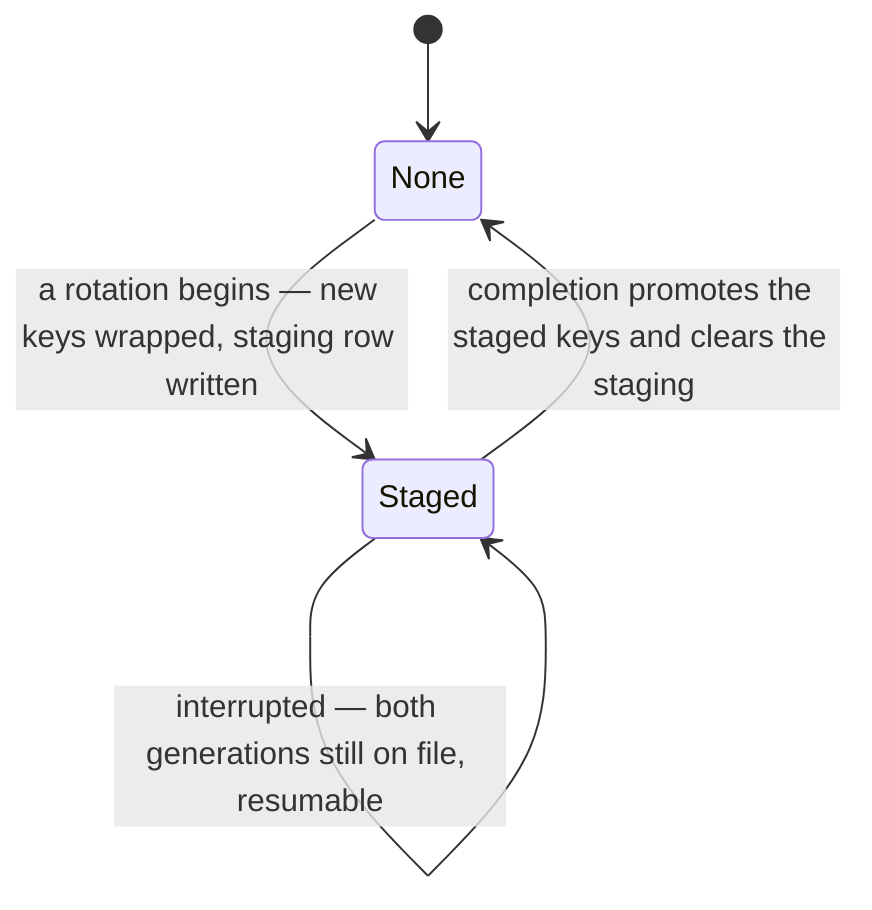

# Key Rotation

## Table of Contents

- [Purpose](#purpose)
- [What is built today](#what-is-built-today)
- [Key Entities](#key-entities)
- [Constraints](#constraints)
  - [MUST](#must)
  - [MUST NOT](#must-not)
- [Business Rules & Invariants](#business-rules--invariants)
- [Workflows & State Transitions](#workflows--state-transitions)
- [Edge Cases & Known Gotchas](#edge-cases--known-gotchas)

## Purpose

An account owns one content key and one index key, and every recovery factor stores its own wrapped
copy of both — [account-keys.md](account-keys.md) holds that shape. **Rotation is the remedy for a
suspected compromise of those keys themselves**: draw a new pair, re-encrypt every narrative field
under the new content key, recompute every blind index under the new index key, and wrap the new pair
under the factors that survive.

It is deliberately **not** what the industry usually means by "key rotation". A cloud key service
rotates by minting new key material and keeping every earlier version forever, so that nothing has to
be rewritten; that defends against key material ageing, not against a key that leaked. Here the whole
point is that the previous content key stops opening anything, which is only true if every row is
rewritten.

**Rotation is not factor management, and the two must not be conflated.** Adding or revoking an
authenticator rewrites wrapped keys only — cheap, touching no budget row. Rotating the keys
themselves rewrites the account. Conflating them would make registering a second passkey as expensive
as re-encrypting everything.

## What is built today

**The schema and the domain behaviour. No route, no handler, no client.** Nothing in the application
calls a reseal member yet, so no rotation can be started, and every `rotation_id` column in every
database is `NULL`.

Built: the `key_rotations` staging table and its `KeyRotation` entity; the six `rotation_id` stamp
columns; the presence rule; the six reseal members and the clearing rule beside them.

Not built: the routes that begin, continue and complete a rotation; the completeness gate that
consumes the stamps; the ceremony that gates a begin; the client that does the actual encryption.
Do not state any of those in the present tense until they ship.

## Key Entities

- **Staged rotation** — one row of `key_rotations`, holding the **next** generation of an account's
  two wrapped keys beside the generation still in force. `user_id` is the **primary key**, so "at
  most one rotation in flight per account" is a primary key rather than a rule somebody enforces.
- **Rotation identifier** — a `uuid` minted when a rotation begins, carried on the staging row and
  stamped onto every row a chunk rewrites. It is how a completion step tells a finished rewrite from
  an unfinished one, and it is **not** a key, a secret, or anything derived from one.
- **Rotation stamp** — the nullable `rotation_id` column on each of the six narrative-bearing tables:
  `budgets`, `accounts`, `payees`, `category_groups`, `categories`, `transactions`.
- **Reseal member** — the one member on each of those six entities that replaces narrative values
  with ones sealed under the new keys and stamps the row. `Budget.ResealName` is **`internal`**; the
  other five are public.

## Constraints

### MUST

- **Both generations of wrapped keys must be readable for as long as a rotation is in flight.** That
  is what the staging table is for, and it is a correctness requirement rather than a convenience —
  see the two orderings under [Why staging](#why-staging-rather-than-one-generation).
- **A reseal must move narrative columns and nothing else.** A reseal built by reusing an entity's
  ordinary `Update` would echo back `type`, `opening_balance`, `position` or `category_group_id`, and
  one wrong echo silently edits data the server cannot check.
- **A name and its blind index move together.** The four indexed name columns take an `IndexedName`,
  never a bare envelope. Rotation recomputes both because the index key rotates too.
- **A reseal must stamp the row in the same transaction as the ciphertext.** The guarantee is
  transactional, not statement-level: if EF split the assignment into two statements they would still
  commit or roll back together.
- **Every ordinary narrative write must clear the stamp.** `Account.Update`, `Payee.Rename`,
  `CategoryGroup.Update`, `Category.Update` and `Transaction.Update` set `rotation_id` back to `NULL`.

### MUST NOT

- **A reseal must not create a narrative value where the column held none, nor clear one where it
  held a value.** `NarrativeReseal.Resealed` owns that rule and every nullable reseal parameter routes
  through it. See [The presence rule](#the-presence-rule-and-what-it-is-worth).
- **A reseal must not validate length.** Caps have three owners already; a fourth could only agree
  redundantly or disagree silently, and the disagreeing version still stores, still reads back and
  still opens.
- **A write that touches no narrative column must not clear the stamp.** `Category.Place`,
  `CategoryGroup.SetPosition`, `Transaction.AssignPayee`, `ClearPayee`, `AssignCategory` and
  `ClearCategory` leave it standing. See
  [Clearing too much](#clearing-too-much-is-a-rotation-that-cannot-finish).
- **A reseal must not refuse a rotation identifier it has already been given.** A chunk re-sent after
  a network timeout carries the same identifier, and refusing it would break retries on exactly the
  long rotations that need chunking.
- **`Budget.ResealName` must not be made public, and `Domain.csproj`'s `InternalsVisibleTo` must not
  be widened to reach it.** ASM-004 says no command may change a budget's name; the access level is
  what makes that a compile error rather than a review note.

## Business Rules & Invariants

### Why staging rather than one generation

A rotation rewrites more than fits in one request — the API caps a body at 64 KB — so it is chunked
and can be interrupted part-way. With a single generation of wrapped keys there are two possible
orderings and **both lose the account**:

- **Promote the new keys first.** Every row not yet rewritten is sealed under a key that no longer has
  a wrapped copy anywhere. Unrecoverable.
- **Promote them last.** Every row already rewritten is sealed under a key that exists only in the
  tab doing the work. Close the tab and it is gone.

Staging removes the choice: both generations are on file until one step promotes, so an interruption
is always recoverable. **This buys recoverability, not atomicity** — chunks still commit
independently and an observer mid-rotation sees an account under two keys. Atomicity is separate
work and is not claimed here.

### The presence rule, and what it is worth

The server can read no narrative value, so it cannot check that a rotation re-sealed the *same text*.
A client could send anything. **Presence is the one property it can check**: a column that held a
value must still hold one, a column that held `NULL` must still hold `NULL`.

To a party that can decrypt nothing, that is the entire difference between "the same text under a new
key" and "different text". It is a weak rule and it is the strongest one available. Read it for more
than that and you are building on sand: a reseal handed somebody else's ciphertext, or a blind index
derived from different text than the envelope beside it, satisfies the rule completely.

One owner, `Domain/Security/NarrativeReseal.cs`, because a rule restated in six entities is a rule
that drifts five ways — and the copy that drops an arm differs from the others only in what it lets a
rotation do to a column nobody exercised that day. `NarrativeResealSurfaceTests` reads the compiled
body of each reseal member and counts calls to it, so an inline copy reddens **before** the copies
diverge rather than after. That census sees the call and not its arguments; its own remarks list what
it misses.

### The stamp, and why the server needs one

The server cannot tell rotated ciphertext from un-rotated by looking. Every seal draws a fresh nonce,
so the bytes differ either way, and the associated data that binds a ciphertext to its row is
rebuilt from context rather than carried inside the envelope. So a chunk **tells** it, by stamping the
in-flight rotation's identifier onto each row it rewrites.

What a completion step will be able to conclude from a full set of stamps is narrow and worth stating
before anybody relies on it: **every narrative-bearing row was written by a statement this rotation
issued.** Not that the bytes are correct — that needs the key, so it is the browser's to prove. What
it buys is the one property that matters: the destructive promotion cannot run while a row is
unwritten.

### Clearing too little is silent data loss

A second browser tab holding the **old** content key can rename a payee this rotation already
stamped. It writes old-key ciphertext and does not touch the stamp, so the row carries old-key
ciphertext under a current stamp. A completion step sees a full house, promotes, destroys the old
keys — and that name is gone, with nothing thrown and nothing logged.

Clearing the stamp on every ordinary narrative write is what makes completion refuse instead.

### Clearing too much is a rotation that cannot finish

The inverse is equally silent and is the easier mistake to make, because it looks thorough. A
position change or a category assignment touches no narrative column: the row's ciphertext is still
current and its stamp is still honest. Clearing there makes completion refuse a rotation that
genuinely finished. The client re-seals the row, the next drag un-stamps it, and on an account where
somebody is reordering categories or categorising transactions while a rotation runs, **the rotation
may never converge.**

Not data loss — a feature that silently cannot finish, which on a large account is harder to diagnose
than a crash.

## Workflows & State Transitions

Only the `None` state exists in the product today; nothing can reach `Staged`, because no route
writes a staging row.

## Edge Cases & Known Gotchas

- **`rotation_id <> @current` is silently wrong, and it is the predicate everybody writes first.**
  `NULL <> anything` is `NULL`, never true, so every row no rotation has touched drops out of "rows
  still to do". On an account rotating for the **first time** that is every row: a completeness check
  written that way passes immediately, the destructive promotion runs, and the whole budget ends up
  sealed under a key nobody holds. The predicate is **`IS DISTINCT FROM`**.
- **A `NOT NULL` default was rejected, and it would have made the predicate above correct.** It was
  still wrong: a generated identifier per row names a rotation that never happened, and a fixed
  sentinel makes "never rotated" a value the application agrees to read a certain way, one layer
  above the column that should be saying it.
- **`budgets.name` is `NULL` on every row today**, because registration writes the nameless budget
  and naming is unbuilt. So `Budget.ResealName` is exercised only by tests that seed a named budget,
  and the presence rule refuses an envelope for it on every production row.
- **`Budget` has no ordinary mutator at all**, so the clearing rule has no Budget case and the
  stale-tab hazard genuinely does not exist there. It arrives the day a "name your budget" screen
  ships, and there is no failing test waiting for it — the clearing case goes in that commit.
- **A rotation cannot be begun by somebody holding only recovery codes.** A set of codes is ten
  factors under one credential, so "the factor this rotation began under" would have ten answers, and
  a begin is gated on a passkey assertion a set of codes cannot produce. Somebody who has lost their
  authenticator and signed in with a code must register a new passkey first. That is a position, not
  an oversight.
- **`key_rotations` holds `SELECT` and no write grant today.** Withholding a privilege until
  something uses it costs nothing, but an ungranted `SELECT` is the one absence that hides something:
  the plaintext scan behind `NarrativeSecrecyTests` meets `42501` and reports the table unscannable,
  so two secrecy gates would pass while covering one table fewer than the schema holds.
- **The six `rotation_id` columns have no `GRANT UPDATE` yet either**, and that is deliberate for the
  same reason. The first handler to reseal a row will fail loudly with `42501` until the six column
  lists are widened, which is the fail-closed direction.
