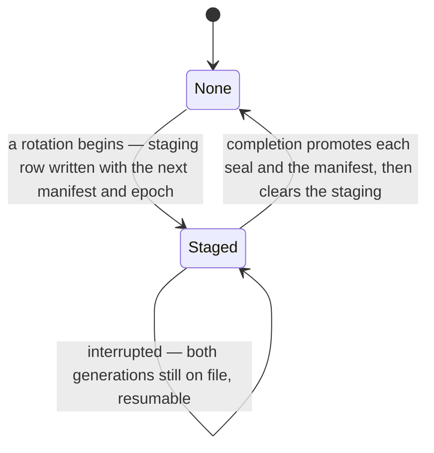

# Key Rotation

## Table of Contents

- [Purpose](#purpose)
- [What is built today](#what-is-built-today)
- [Key Entities](#key-entities)
- [Constraints](#constraints)
  - [MUST](#must)
  - [MUST NOT](#must-not)
- [Business Rules & Invariants](#business-rules--invariants)
- [Workflows & State Transitions](#workflows--state-transitions)
- [Edge Cases & Known Gotchas](#edge-cases--known-gotchas)

## Purpose

An account owns one content key and one index key, and every recovery factor holds an **ECDH P-256
key pair**: its private key *wrapped under* the key-encryption key that factor derives, and the
account's two keys *encapsulated to* its public key — [account-keys.md](account-keys.md) holds that
shape. **Rotation is the remedy for a suspected compromise of those keys themselves**: draw a new
pair, re-encrypt every narrative field under the new content key, recompute every blind index under
the new index key, and encapsulate the new pair to the public key of every factor that survives.

**That last clause is why the key pair exists at all, and a reader meets it better here than
reconstructs it later.** Under the arrangement this replaced, a factor held the account's two keys
wrapped directly under its own key-encryption key — and for a passkey that key is a WebAuthn PRF
output, which exists only while somebody is touching the authenticator. Re-wrapping therefore needed
**every** registered device present at once, and an account with a hardware key in a drawer could not
rotate at all. Encapsulating to a public half needs no secret from the factor, so a run needs the old
content key and a set of public keys, and no authenticator but the one already in the person's hand.
[ADR 0025](../decisions/0025-give-every-recovery-factor-an-ecdh-key-pair.md) records that decision
and the alternatives it refused.

It is deliberately **not** what the industry usually means by "key rotation". A cloud key service
rotates by minting new key material and keeping every earlier version forever, so that nothing has to
be rewritten; that defends against key material ageing, not against a key that leaked. Here the whole
point is that the previous content key stops opening anything, which is only true if every row is
rewritten.

**Rotation is not factor management, and the two must not be conflated.** Registering or revoking an
authenticator writes or removes that one factor's row — cheap, touching no budget row, and leaving
every other factor's key pair byte-for-byte where it was. Rotating the keys themselves rewrites the
account. Conflating them would make registering a second passkey as expensive as re-encrypting
everything.

## What is built today

**The schema, the domain behaviour, the read a completion step will consult, and the handler that
begins a run. No route, no client.** Nothing reaches `BeginKeyRotationHandler` over HTTP, so no
rotation can be started, every `rotation_id` column in every database is `NULL`, and `key_rotations`,
`key_rotation_seals` and `factor_manifests` are empty in all of them.

Built: the `key_rotations` staging table and its `KeyRotation` entity, now carrying a staged
**manifest** and a staged **epoch** rather than a factor and two envelopes; the `key_rotation_seals`
table and its `KeyRotationSeal` entity, one row per surviving factor per run; the six `rotation_id`
stamp columns; the presence rule; the six reseal members and the clearing rule beside them; the
completeness gate — `Application.KeyRotations.IRotationCompletenessReadService` and its one
implementation — which is registered and which nothing calls; and the begin —
`BeginKeyRotationHandler` over `Domain.Users.IKeyRotationRepository` and
`Application.KeyRotations.IRotationInventoryReadService`, all three registered and none of them
called.

Not built: the routes that begin, continue and complete a rotation; the chunk that reseals rows; the
leg that writes a seal; the promotion that files a manifest; the client that does the actual
encryption. Do not state any of those in the present tense until they ship.

**The begin can write its row, and `key_rotations` still holds no `DELETE` of any shape.**
`app-role-grants.sql` grants `SELECT`, `INSERT` and a column-listed `UPDATE` over `rotation_id`,
`staged_manifest`, `staged_rotation_epoch` and `started_at_utc`. The insert and the update
arrive together because staging is an upsert rather than an append: `user_id` is the whole of the
primary key, so an account holds at most one rotation in flight, and a second begin — the repair path
when completion refuses — has to rewrite the row already there. `user_id` is never in a `SET` list and
so stays out of that column list; an omission from a column list is how this schema makes a column
immutable, never a `REVOKE` and never a table-wide grant. The absent `DELETE` is what stops a
half-written promotion path clearing the staging before it has promoted anything, which is the one
destruction here with no repair: until the live rows are overwritten, the staged seals are the only
copies of the new generation.

**`key_rotation_seals` holds `SELECT` and nothing else, and the asymmetry with the table above is the
argument rather than an oversight.** An ungranted **read** fails quiet: measured on `key_rotations`,
the plaintext scan behind `NarrativeSecrecyTests` meets `42501`, reports the table unscannable, and
two secrecy gates then pass while covering one table fewer than the schema holds. An ungranted
**write** fails loud, with `42501` on the statement that wanted it, in the test exercising the path.
So the read was granted while the table was still empty, and the `INSERT` arrives with the continue
leg that writes a seal, carrying the sentence that names the operation. A `DELETE` is not obviously
owed at all: a superseded run's seals leave by the `ON DELETE CASCADE` from `key_rotations` when a
second begin replaces the staging row, which runs with the referencing table owner's privileges rather
than this role's.

**`key_rotations` hangs off `users` directly now, and that edge is the erasure chain rather than
bookkeeping.** Its only foreign key used to be the composite one to `wrapped_account_keys`, and that
left with `factor_id`. A table on no edge at all is a table the cascade from `users` never reaches, so
an erased account would have left a staging row behind carrying its own user id — which
[erasure.md](erasure.md) forbids outright, and which nothing in the application could have cleaned up
either, because this role holds no `DELETE` here. `FK_key_rotations_users` is the same claim restated
where the row's own column already points. `key_rotation_seals` carries **two** cascading keys —
`user_id → key_rotations` and `(factor_id, user_id) → wrapped_account_keys` — so an erasure reaches it
twice; PostgreSQL permits the two cascading paths that creates, the multiple-cascade-path restriction
being SQL Server's rather than this server's.

## Key Entities

- **Staged rotation** — one row of `key_rotations`, holding the **next** generation's manifest of
  factor public keys and the epoch it will be filed at, beside the generation still in force.
  `user_id` is the **primary key**, so "at most one rotation in flight per account" is a primary key
  rather than a rule somebody enforces. **It names no factor**, and that absence is the shape of the
  table rather than a column somebody forgot — see
  [the staged row names no factor](#the-staged-row-names-no-factor).
- **Staged manifest** — the `bytea` on that row carrying the next generation's list of every
  surviving factor's **public** key, authenticated as a **set** by a key this server does not hold.
  Nothing on this side reads into it: presence and a 4096-byte cap are the whole of what is checked,
  because any structural reading would be a second, unverifiable grammar sitting where a client's is
  authoritative. Its bounds are `FactorManifest`'s, read off that type rather than restated, because
  this is the value a promotion writes into that row.
- **Staged rotation epoch** — the generation the staged manifest will be filed at. At least `1`,
  because **epoch 0 is the absence of a manifest row** — the state of every account in the product
  today, and not an error — so a stored row claiming 0 would assert its own absence.
- **Rotation seal** — one row of `key_rotation_seals`, keyed `(user_id, factor_id)`, holding the next
  generation's content key and index key as one 64-byte plaintext **encapsulated to** that factor's
  public key. One per surviving factor per run: a rotation draws the new pair once and encapsulates it
  to every public key the staged manifest names. Its one payload column is the value a promotion
  copies into `wrapped_account_keys.encapsulated_account_keys`, so it carries that column's width and
  version rather than a second copy of either. It records no instant — a seal lives entirely inside
  one run, and the run carries `started_at_utc`.
- **Rotation identifier** — a `uuid` minted when a rotation begins, carried on the staging row and
  stamped onto every row a chunk rewrites. It is how a completion step tells a finished rewrite from
  an unfinished one, and it is **not** a key, a secret, or anything derived from one.
- **Rotation stamp** — the nullable `rotation_id` column on each of the six narrative-bearing tables:
  `budgets`, `accounts`, `payees`, `category_groups`, `categories`, `transactions`.
- **Reseal member** — the one member on each of those six entities that replaces narrative values
  with ones sealed under the new keys and stamps the row. `Budget.ResealName` is **`internal`**; the
  other five are public.

## Constraints

### MUST

- **Both generations of the account's keys must be readable for as long as a rotation is in flight.**
  That is what the staging tables are for, and it is a correctness requirement rather than a
  convenience — see the two orderings under [Why staging](#why-staging-rather-than-one-generation).
- **A run must produce one seal per surviving factor, and the manifest is what says which those
  are.** The set is authenticated as a blob by a key the client holds, so nothing on this side can
  count it, compare it or repair it — which is the whole of why the check that used to compare a
  staged factor set against the account's live passkeys is gone for now. See
  [what the begin no longer checks](#what-the-begin-no-longer-checks-and-where-the-rule-went).
- **A reseal must move narrative columns and nothing else.** A reseal built by reusing an entity's
  ordinary `Update` would echo back `type`, `opening_balance`, `position` or `category_group_id`, and
  one wrong echo silently edits data the server cannot check.
- **A name and its blind index move together.** The four indexed name columns take an `IndexedName`,
  never a bare envelope. Rotation recomputes both because the index key rotates too.
- **A reseal must stamp the row in the same transaction as the ciphertext.** The guarantee is
  transactional, not statement-level: if EF split the assignment into two statements they would still
  commit or roll back together.
- **Every ordinary narrative write must clear the stamp.** `Account.Update`, `Payee.Rename`,
  `CategoryGroup.Update`, `Category.Update` and `Transaction.Update` set `rotation_id` back to `NULL`.

### MUST NOT

- **A reseal must not create a narrative value where the column held none, nor clear one where it
  held a value.** `NarrativeReseal.Resealed` owns that rule and every nullable reseal parameter routes
  through it. See [The presence rule](#the-presence-rule-and-what-it-is-worth).
- **A reseal must not validate length.** Caps have three owners already; a fourth could only agree
  redundantly or disagree silently, and the disagreeing version still stores, still reads back and
  still opens.
- **A write that touches no narrative column must not clear the stamp.** `Category.Place`,
  `CategoryGroup.SetPosition`, `Transaction.AssignPayee`, `ClearPayee`, `AssignCategory` and
  `ClearCategory` leave it standing. See
  [Clearing too much](#clearing-too-much-is-a-rotation-that-cannot-finish).
- **A reseal must not refuse a rotation identifier it has already been given.** A chunk re-sent after
  a network timeout carries the same identifier, and refusing it would break retries on exactly the
  long rotations that need chunking.
- **`Budget.ResealName` must not be made public, and `Domain.csproj`'s `InternalsVisibleTo` must not
  be widened to reach it.** ASM-004 says no command may change a budget's name; the access level is
  what makes that a compile error rather than a review note.

## Business Rules & Invariants

### Why staging rather than one generation

A rotation rewrites more than fits in one request — the API caps a body at 64 KB — so it is chunked
and can be interrupted part-way. With a single generation of the account's keys on file there are two
possible orderings and **both lose the account**:

- **Promote the new keys first.** Every row not yet rewritten is sealed under a key no surviving
  factor can reach any more. Unrecoverable.
- **Promote them last.** Every row already rewritten is sealed under a key that exists only in the
  tab doing the work. Close the tab and it is gone.

Staging removes the choice: both generations are on file until one step promotes, so an interruption
is always recoverable. **This buys recoverability, not atomicity** — chunks still commit
independently and an observer mid-rotation sees an account under two keys. Atomicity is separate
work and is not claimed here.

**A promotion is one column per surviving factor plus one row for the account, and reading it as
three columns per factor is the mistake this reshape removed.** Under the arrangement this replaced
a run rewrote both of a factor's wrapped keys and named the factor it was performed under; now
`wrapped_account_keys.wrapped_private_key` is not touched at all — the factor's key-encryption key
does not change when the account's keys do, so the value is byte-for-byte what it was — and what
moves is `encapsulated_account_keys`, copied in from that factor's staged seal. Beside it the
account's `factor_manifests` row takes the staged manifest and the staged epoch. That is why the
role's `GRANT UPDATE` on `wrapped_account_keys` names **one** column: `wrapped_private_key` is
immutable by omission, and the omission is doing real work, because it is the column whose loss would
leave a factor able to prove itself and unable to open anything.

### The staged row names no factor

Under a key-encryption key there was exactly **one** factor a run could have been begun under, because
re-wrapping the account's keys needed the secret that factor derives. Under ECDH there is no such
thing: encapsulating the next generation takes public halves only, so a run produces one value per
surviving factor — those are the `key_rotation_seals` rows — and *"the factor this rotation was
performed under"* has stopped being a question with an answer.

**It did not become plural either.** A list of factor ids on the staging row would be the seals' own
key set restated on the parent, which is the copy that drifts — and it would be a second, unsigned
claim about a set the manifest already carries with an authentication tag over it.

**What the vanished column was doing for security is held, and was always really held, one layer
up.** *Only somebody holding a passkey may begin a run* is the re-authentication gate on the route,
which runs a server-verified assertion to completion before anything below it is read. The
`CredentialType.Passkey` refusal inside `KeyRotation.Begin` survives and the factory still takes the
loaded `Credential`, but read it for what it now is: **a restatement**. No staged value is bound to
that credential, so what the refusal still buys is that a caller assembling the type out of a
recovery-code or federated credential is refused at the object rather than at the route it forgot to
gate.

**The credential comes back from the gate rather than being looked up.** It is the credential whose
signature was just verified against a key found under `IUserContext.UserId`, so it is by construction
a passkey registered to this account. Picking one out of the account's passkey factors instead would
be arbitrary the day an account holds two, and the arbitrariness is invisible: the wrong one is a
perfectly good passkey of the right account, so the row stages, the run completes, and nothing
anywhere reports that the choice was made by iteration order.

### The presence rule, and what it is worth

The server can read no narrative value, so it cannot check that a rotation re-sealed the *same text*.
A client could send anything. **Presence is the one property it can check**: a column that held a
value must still hold one, a column that held `NULL` must still hold `NULL`.

To a party that can decrypt nothing, that is the entire difference between "the same text under a new
key" and "different text". It is a weak rule and it is the strongest one available. Read it for more
than that and you are building on sand: a reseal handed somebody else's ciphertext, or a blind index
derived from different text than the envelope beside it, satisfies the rule completely.

One owner, `Domain/Security/NarrativeReseal.cs`, because a rule restated in six entities is a rule
that drifts five ways — and the copy that drops an arm differs from the others only in what it lets a
rotation do to a column nobody exercised that day. `NarrativeResealSurfaceTests` reads the compiled
body of each reseal member and counts calls to it, so an inline copy reddens **before** the copies
diverge rather than after. That census sees the call and not its arguments; its own remarks list what
it misses.

### The stamp, and why the server needs one

The server cannot tell rotated ciphertext from un-rotated by looking. Every seal draws a fresh nonce,
so the bytes differ either way, and the associated data that binds a ciphertext to its row is
rebuilt from context rather than carried inside the envelope. So a chunk **tells** it, by stamping the
in-flight rotation's identifier onto each row it rewrites.

What a completion step will be able to conclude from a full set of stamps is narrow and worth stating
before anybody relies on it: **every narrative-bearing row was written by a statement this rotation
issued.** Not that the bytes are correct — that needs the key, so it is the browser's to prove. What
it buys is the one property that matters: the destructive promotion cannot run while a row is
unwritten.

### The completeness gate is presence-aware

The gate asks the six stamped tables one question: does this account hold a row that **carries a
narrative value** and is **not** stamped with the rotation in flight? If one does, it refuses.

**A row carrying no narrative value at all is not counted, and that is the design rather than a
shortcut.** A transaction with no note has nothing to re-seal, so a chunk never visits it and a finished
rotation leaves it unstamped. Counting it would make an account of ten thousand mostly note-less
transactions owe ten thousand writes whose only effect is to satisfy this read — and it would refuse a
rotation that genuinely finished, which is the failure
[Clearing too much](#clearing-too-much-is-a-rotation-that-cannot-finish) describes. Only two of the four
nullable narrative columns are the **whole** of their row's narrative: `budgets.name` and
`transactions.description`. On `category_groups` and `categories` a nullable description sits beside a
required name, and `accounts` and `payees` carry a required name and nothing else, so rows in those four
tables always bear a narrative value and always owe a stamp.

**It is not leniency.** A note *added* mid-rotation by a second tab arrives as narrative-with-no-stamp,
which is outstanding under this rule, so the gate refuses — which is exactly what should happen.

**One consequence to carry forward: the stamp `Budget.ResealName` writes onto a nameless budget is
uniformity rather than necessity.** That row carries no narrative, so the gate is satisfied with or
without it; the reason to keep stamping is that the client then drives all six tables through one shape.
Were the gate ever to stop being presence-aware, that stamp would become load-bearing on nearly every
account in the product — and every note-less transaction would owe a write it has nothing to perform.

**The predicate must reach PostgreSQL as `IS DISTINCT FROM`**, for the reason the first gotcha below
argues. Written as EF LINQ, `row.RotationId != rotationId` is exactly that: the emitted SQL reads
`rotation_id <> @rotation OR rotation_id IS NULL`, so an unstamped row and a stale-stamped row both
count as outstanding.

**`budgets` is scoped by hand and the other five are not.** Five of the six sets carry the
`BudgetIsolation` query filter and are scoped to the ambient budget whether or not the read asks;
`budgets` carries none, so the owner predicate on that one set is written or it is not there at all.
`ExportReadService` makes and documents the same split.

### The gate refuses rather than rotating half an account

**The gate's question is about an account; five of its six reads can only see one budget.** The
`budgets` arm is scoped by owner and sees every budget the account holds. The other five ride the
`BudgetIsolation` query filter, which scopes to the **ambient** budget, takes no argument and cannot be
re-pointed part-way through a request. On an account owning two budgets that asymmetry lets the gate
compare both budgets' name stamps against one budget's contents and answer *complete* with an entire
second budget unrotated — after which the promotion overwrites every factor's encapsulated copy of the
key that budget is sealed under, leaving nothing that can reach it.

**So it refuses, under the export's rule and in the export's spelling.** Unless the set of budgets the
account owns is **exactly** the ambient budget, it throws `RotationScopeException`: set equality, **in
both directions**, deliberately not `Count > 1`. [export.md](export.md) is the authority and argues the
rule in full; the directions fail differently here for the same reasons it gives — owning a budget the
request is not inside means rows are invisible to the gate, and being inside a budget the account does
not own means another budget's rows are reported as this account's progress. A count refuses only the
first.

**Answering `false` was the other option and it is wrong.** It is indistinguishable from "rows still to
do", so the client would re-seal everything it can see and the gate would go on refusing — the
non-converging rotation [Clearing too much](#clearing-too-much-is-a-rotation-that-cannot-finish)
describes. A throw says the server cannot answer, which is what is true.

**The refusal lives in the read rather than in a handler, and that is the one place it departs from the
export.** `ExportDataHandler` throws because it exists and is the export's only caller. Rotation's
completion route is unbuilt, so a guard placed in a handler that does not exist yet guards nothing and
the first handler written would have to remember it — for a mistake with no repair path. It surfaces as
a bodyless `500` on the catch-all handler, with **no `IExceptionHandler` of its own**, for every reason
`ExportCompletenessException` gives; the message names counts and never budget identifiers, because the
Development branch of `GlobalExceptionHandler` echoes it into the response body.

**No account in the product can reach this today** — no code path creates a second budget — which is
exactly why it is written now: the schema has been multi-budget-ready since day one, and this is the
tripwire for the day a second budget becomes creatable.

### Beginning a run: three rules, and none of them is visible in the result

**The re-authentication gate runs first and runs to completion, before the owned budget set is read,
before the staged material is judged and before anything is counted.** Every refusal below it is a real
sentence or a named exception, and each would tell an unproven caller something about the account: that
it owns more than one budget, that the manifest it staged was judged at all.
`RotationScopeException` is the concrete one, because the Development branch of
`GlobalExceptionHandler` echoes the message into the response body. Past the gate the same sentences
cost nothing — the caller has proved possession of an authenticator registered to this account, and
there is nobody left to enumerate about. It is
[sessions.md](sessions.md)'s ordering applied to a third route, and
[recovery-codes.md](recovery-codes.md) argues it where it is decided.

**The gate also runs outside the transactional delegate**, for the two reasons the erasure and
recovery-code paths write out in full: the consume commits on a save of its own, so a rolled-back
attempt would restore the spent nonce and make the assertion replayable; and the delegate is replayed
under a retrying execution strategy, so a gate inside it would consume twice and refuse a **valid**
begin with the same 401 an attacker gets.

**A second begin replaces the first and is not a conflict.** When a completion refuses because the live
factor set moved — a passkey registered or revoked while a run was in flight — the only way forward is
a begin carrying the corrected set. Answer that with a `409` and the client is left holding a staged
row it cannot replace and a rotation it cannot finish, with no route that removes either. So
`IKeyRotationRepository.StageAsync` promises replacement, and the adapter honours it as an upsert —
find and update, never a blind insert, and never a delete followed by an insert of the same key, since
EF orders that pair no particular way and `key_rotations` is granted no `DELETE` besides.

**That upsert has a window, and saying otherwise would be the overclaim to avoid here.** Find-then-add
is two statements, so two begins racing from different requests both find no staged row, both add, and
the loser takes `23505` on `PK_key_rotations` — measured against the test container at READ COMMITTED,
which is what `DbContextTransactionalExecutor` opens since it names no isolation level. The retrying
execution strategy does not cover it: that is two requests, not two attempts of one. `user_id` being the
primary key holds the *rule* — an account cannot store two rotations — but a key raising a violation and
an application translating it are different claims, and nothing translates this one today.

Nothing raises it today either, because no route reaches the handler. When one lands, the answer is to
**converge rather than refuse**: catch the violation, re-read, copy the values over and save once more.
A `409` would break this section's own promise at the one moment it is under load, and last-begin-wins
is already the rule — the concurrent case should simply answer like the sequential one. The commit that
makes a begin route reachable owes that, and `RepositoryAttributionCensusTests` is where it is recorded
so the next person to touch the route reads it in a census rather than in a backlog.

**The begin makes the completeness gate's scope refusal early.** The same set equality over owned
budgets, in the same spelling, thrown as the same `RotationScopeException` — a rotation that cannot
finish is better not begun, and at begin the client has re-encrypted nothing. What it answers with
otherwise is a count per narrative-bearing table, drawn from the same presence-aware population the
gate asks about, and a chunk byte budget. A denominator measured over a wider population than the gate
checks is a progress bar that never reaches the end.

### What the begin no longer checks, and where the rule went

**One guarantee is deliberately surrendered for a few slices, and it is recorded here rather than
lost.** The begin used to assert that the staged factor set was **exactly** the account's live passkey
factors — set equality in both directions, never *"the factor named is one of them"* — and three unit
cases held it. Both the check and the cases are gone.

**What it held, and why the weaker reading is the dangerous one.** Today an account holds one passkey,
so the two readings are indistinguishable and every fixture passes either way. They come apart the day
a second passkey becomes registrable, and they come apart silently: under *"is one of"*, a begin
naming one factor out of two succeeds, the run completes, the promotion overwrites
`wrapped_account_keys`, and the second passkey is left holding a copy of a content key that no longer
opens anything — an authenticator the person still has, still enrolled, that can no longer unlock the
account, with no repair that does not go through a recovery code. Under set equality the same begin is
refused at the start of the run, while the client can still re-post a corrected one.

**Why it cannot hold now.** It compared a `factorId` on the command against
`IKeyRotationRepository.ListPasskeyFactorsAsync`'s keys, and there is no longer a factor on the
command to compare — the set a run stages is the set named **inside the staged manifest**, whose bytes
are authenticated as a set by a key this server does not hold. Judging it means parsing a client's
grammar, which this slice does not do and which `KeyRotation` deliberately does not do either. So the
staged manifest is accepted unexamined, and a client that staged a generation omitting one of its own
passkeys is refused by nothing.

**Nothing is exposed meanwhile, and that is what makes the gap affordable.** No route reaches
`BeginKeyRotationHandler`, so no request can begin a run at all. It is also what will make it easy to
forget: the day a route is added, this section is the thing that has to be answered first.

**Where it returns.** The check belongs with whatever comes to read the manifest: it compares the
factor ids the staged manifest names against `ListPasskeyFactorsAsync`'s keys, in both directions, and
refuses as a `400` keyed on the manifest member. That listing is still registered and still answers
passkey factors only; nothing in the handler calls it any more. The comment block standing where the
guard used to be carries the same sentence — deleting it and calling the slice finished is the failure
mode, because a guard removed with no trace is how a temporary gap becomes permanent.

### Clearing too little is silent data loss

A second browser tab holding the **old** content key can rename a payee this rotation already
stamped. It writes old-key ciphertext and does not touch the stamp, so the row carries old-key
ciphertext under a current stamp. A completion step sees a full house, promotes, destroys the old
keys — and that name is gone, with nothing thrown and nothing logged.

Clearing the stamp on every ordinary narrative write is what makes completion refuse instead.

### Clearing too much is a rotation that cannot finish

The inverse is equally silent and is the easier mistake to make, because it looks thorough. A
position change or a category assignment touches no narrative column: the row's ciphertext is still
current and its stamp is still honest. Clearing there makes completion refuse a rotation that
genuinely finished. The client re-seals the row, the next drag un-stamps it, and on an account where
somebody is reordering categories or categorising transactions while a rotation runs, **the rotation
may never converge.**

Not data loss — a feature that silently cannot finish, which on a large account is harder to diagnose
than a crash.

## Workflows & State Transitions

Only the `None` state exists in the product today; nothing can reach `Staged`, because no route reaches
the handler that writes a staging row.

## Edge Cases & Known Gotchas

- **A completeness predicate that treats `NULL` as "not a mismatch" is catastrophic, and the exact
  spelling that does so is narrower than it first looks.** `NULL <> anything` is `NULL`, never true,
  so every row no rotation has touched drops out of "rows still to do". On an account rotating for
  the **first time** that is every row: the check answers "complete" immediately, the destructive
  promotion runs, and the whole budget ends up sealed under a key nobody holds.

  **Measured, rather than assumed:** written as EF LINQ, `row.RotationId != rotationId` is **safe** —
  EF Core's null compensation rewrites it to SQL carrying `IS DISTINCT FROM` semantics. Reproducing
  the failure took `RotationId.HasValue && RotationId.Value != rotationId`, which reads as a careful
  null guard and is the dangerous spelling. Raw SQL would be the other way in, and is largely closed
  off already: `FromSql*` is a banned symbol, so it cannot be written in the application at all —
  though the provisioning script and the deploy-time verifier are not bound by that.

  So the rule is **not** "never write `!=`". It is: the answer must be `IS DISTINCT FROM` in the SQL
  that reaches PostgreSQL, whatever produced it, and a hand-written `HasValue` guard is the way that
  stops being true. `Completeness_ForAnAccountThatHasNeverBeenRotated_IsFalse` is the one test that
  catches that spelling.
- **A `NOT NULL` default was rejected, and it would have made the predicate above correct.** It was
  still wrong: a generated identifier per row names a rotation that never happened, and a fixed
  sentinel makes "never rotated" a value the application agrees to read a certain way, one layer
  above the column that should be saying it.
- **`budgets.name` is `NULL` on every row today**, because registration writes the nameless budget
  and naming is unbuilt. So `Budget.ResealName` is exercised only by tests that seed a named budget,
  and the presence rule refuses an envelope for it on every production row.
- **`Budget` has no ordinary mutator at all**, so the clearing rule has no Budget case and the
  stale-tab hazard genuinely does not exist there. It arrives the day a "name your budget" screen
  ships, and there is no failing test waiting for it — the clearing case goes in that commit.
- **A rotation cannot be begun by somebody holding only recovery codes.** A begin is gated on a
  server-verified passkey assertion, and a set of codes produces no assertion to verify; the
  `CredentialType.Passkey` refusal in `KeyRotation.Begin` says the same thing one ring up. It follows
  from the other end too — a set of codes is ten factors under one credential, so a begin made under
  it names a credential and not a factor. Somebody who has lost their authenticator and signed in with
  a code must register a new passkey first. That is a position, not an oversight, and a reader will
  file it as a bug.
- **The step from one epoch to the next is held by no declarative layer, and a reader must not take
  the floor for the whole rule.** `CK_key_rotations_staged_rotation_epoch` and its twin on
  `factor_manifests` each refuse anything below `1`; neither can say a promotion writes an epoch
  *exactly one greater* than the one it read, because a `CHECK` sees the values of one row and never
  the step between two, and a trigger is the procedural logic
  [ADR 0002](../decisions/0002-enforce-rules-at-the-lowest-capable-layer.md) forbids pushing down to
  buy the phrase *the database enforces it*. The **atomicity** half — that nobody moved the epoch
  between the read and the write — is unheld too: EF optimistic concurrency on `rotation_epoch` is
  what will hold it, and it is unconfigured because no statement exists for it to guard. Whoever
  writes the arithmetic writes it in application code with nothing beneath it that will notice if it
  goes wrong. [account-keys.md](account-keys.md#the-manifest-of-factor-public-keys) carries it in
  full.
- **The epoch is bound in the manifest and nowhere else** — not in any encapsulated value's KDF
  `info`, and not in any associated data. Binding it into a value would make every encapsulation of a
  generation unopenable the moment the epoch it was produced under stopped being current, which turns
  a resumable run into a disposable one.
- **`key_rotations` got its write grants the commit its first writer landed, and not before.**
  Withholding a privilege until something uses it costs nothing, which is why the table held `SELECT`
  alone until `BeginKeyRotationHandler` arrived. `SELECT` is the one absence that would have hidden
  something and so never waited: without it the plaintext scan behind `NarrativeSecrecyTests` meets
  `42501`, reports the table unscannable, and two secrecy gates pass while covering one table fewer
  than the schema holds. An ungranted write, by contrast, hides nothing — it fails loudly on first
  reach.
- **The six `rotation_id` columns have no `GRANT UPDATE` yet either**, and that is deliberate for the
  same reason. The first handler to reseal a row will fail loudly with `42501` until the six column
  lists are widened, which is the fail-closed direction.
