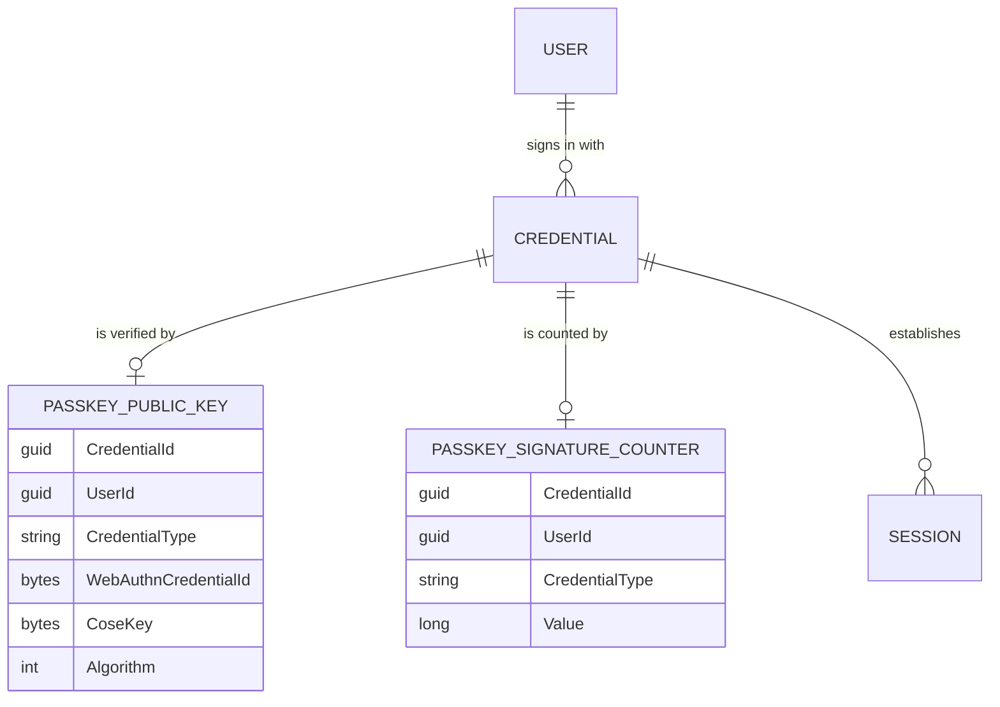
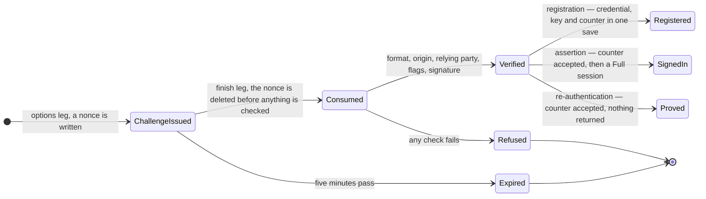

# Passkeys

## Table of Contents

- [Purpose](#purpose)
- [Key Entities](#key-entities)
- [Constraints](#constraints)
- [Business Rules & Invariants](#business-rules--invariants)
- [Workflows & State Transitions](#workflows--state-transitions)
- [Integration Points](#integration-points)
- [Edge Cases & Known Gotchas](#edge-cases--known-gotchas)

## Purpose

This area covers **the three WebAuthn ceremonies**: registering a passkey to an account, signing in
with one, and re-proving possession of one before an action too destructive to take on a bearer token
alone. It is one of the two paths that open a session — the other is redeeming a recovery code — and a
passkey is one of the two credential types whose session reaches budget content, the other being the
set of codes, a secret the holder possesses for the same reason. `federated` is the only type that can
never reach budget content, because an authorization exchange returns claims rather than a secret a
client can turn into a key. See [recovery-codes.md](recovery-codes.md) and
[sessions.md](sessions.md).

Identity — who a person is, and which credentials prove it — lives in
[users-and-ownership.md](users-and-ownership.md). What happens after a credential has answered that
question lives in [sessions.md](sessions.md). This file covers the answering itself.

**What is built today and what is not.** Both ceremonies exist as endpoints, a verified assertion
establishes a `Full` session, and all of it is tested. What does **not** exist: the API still
authenticates every other request from the Google ID token it is handed. **No session token is issued
and none is presented** — the assertion response deliberately carries no handle to the session it
created. Registration is also not yet gated: an account exists before any passkey does, so a passkey
is something an already-signed-in person adds rather than something registration requires.

A signed-in person can now **list** every credential the account holds and **revoke** a passkey, the
revocation gated by a fresh re-authentication exactly as erasure is. Nothing **replaces** a passkey,
and nothing removes or replaces the **federated** credential — that is the email change, and it is
not built. Read the revocation against [sessions.md](sessions.md) before deciding what it is worth:
it ends the passkey's sessions, but no session authenticates a request today, so what revocation
actually takes away is the ability to sign in again with that authenticator.

## Key Entities

- **Passkey `Credential`** — a `Credential` of type `Passkey`, minted by `Credential.CreatePasskey`.
  It carries no `Provider` and no `Subject`: a passkey is held by the authenticator and granted by
  nobody. Its row lives in `credentials` beside the federated one, and an account may hold both.
- **`PasskeyPublicKey`** — the material an assertion is checked against: the authenticator's
  credential id, the COSE key exactly as the authenticator returned it, and the COSE algorithm. Keyed
  one-to-one on the credential, with no navigation properties, the shape `Session` already
  establishes.
- **`PasskeySignatureCounter`** — the `signCount` last accepted from this authenticator. Its own row,
  on its own table, for the reason the whole design turns on: it is compared *after* the signature
  verifies, so unlike the public key it is reached with a trusted identity on the connection.
- **`CoseAlgorithm`** — `Es256 = -7` or `Rs256 = -257`, persisted as its **numeric** value, unlike
  every other enum here. These are IANA-assigned wire values that appear as numbers in the ceremony
  options and inside the COSE key itself; a second textual spelling would be one more thing to keep
  in step with the protocol.
- **`WebAuthnChallengeRow`** — a 32-byte nonce, the ceremony it was issued for, and its lifetime. A
  persistence-layer type rather than a domain entity: a protocol nonce is not a domain concept, it is
  a row the infrastructure keeps so a stateless protocol can be resumed. Its `ceremony` vocabulary is
  `registration`, `authentication`, `reauthentication`, bounded by
  `CK_webauthn_challenges_ceremony`. The row carries **no owner column** and must not gain one — see
  the pinned column set below.

Deliberately **absent**: AAGUID, transports, a last-used instant, backup-eligibility flags, and the
attestation statement. Nothing in this design reads any of them — no `allowCredentials` is ever sent,
so transports are unused, and under `attestation: "none"` the AAGUID arrives zeroed anyway. An
authenticator model identifier is a device fingerprint by another name. Each arrives with the feature
that reads it, argued by that change.

## Constraints

### MUST

- **A passkey's material is split by whether it is read before or after the ceremony has produced a
  trusted identity.** `passkey_public_keys` is exempt from row-level security;
  `passkey_signature_counters` carries `user_id` and is policed by `user_isolation`.
  - **Why**: an assertion arrives with a credential id and a signature and nothing else, so the
    server must find a key and check a signature *before* it knows whose account this is. Every
    statement until then runs with `app.current_user_id` empty, and a policed table would fail with
    `22P02` — the exemption is not removable. Everything after that answer has a real tenant.
  - **Enforced in**: the two `Exemptions` entries and the `user_isolation` policy in
    `app-role-grants.sql`; `RowLevelSecurityCoverage` reaches the counter's verdict from its own
    columns with no rule added. `RlsIsolationTests` proves both directions, including the positive
    control — `Database_ReadsAPasskeyPublicKeyWithNoUserOnTheSession` — without which a policy
    accidentally added to the exempt table would surface only as a mysterious 401.
    See [ADR 0012](../decisions/0012-split-a-passkeys-material-by-whether-it-is-read-before-identity.md).

- **The pinned column set is what holds the exemption to its reason — not the absent `UPDATE`
  grant.** The role holds no `UPDATE` of any shape and no `DELETE` on `passkey_public_keys`, and that
  is a genuine narrowing, but it is not the one that matters. The hazard is that the exemption is
  granted to a *query* and applied to a whole *table*, so every column is readable by every session
  whoever it names. **A wrapped key or a recovery-code hash is written once and never updated** — it
  satisfies any append-only rule perfectly while being exactly what must not land here. A red on the
  pin means **move the column** to a table carrying `user_id`, never widen the pin.
  - **The recovery-code hash has stopped being hypothetical, and it landed somewhere else** — on
    `recovery_code_hashes`, with its own exemption and its own pin
    ([ADR 0016](../decisions/0016-give-recovery-code-hashes-their-own-exempt-table.md)). Keep the
    example where it is. The hypothetical is what made this decision visible *before* there was
    anything to decide about, so it is the evidence the mechanism worked rather than a line to retire
    now that it has been used once, and the wrapped key beside it is still ahead of us.

- **A passkey's key and counter belong to the same person as the credential, and to a credential of
  type `passkey`.**
  - **Enforced in**: a composite foreign key on each,
    `(credential_id, user_id, credential_type) → credentials (id, user_id, type)` against
    `AK_credentials_id_user_id_type`, plus a check pinning `credential_type = 'passkey'`. The same
    idiom `sessions` uses. It makes one person's key attached to another person's credential, and a
    key attached to a federated credential, both *unstorable* rather than merely unlikely.

- **One authenticator credential resolves to at most one account.**
  - **Enforced in**: the unique index `IX_passkey_public_keys_webauthn_credential_id`, which is also
    the discovery lookup's index, and `PasskeyRepository.TryAddAsync`, which turns its `23505` into a
    409 by filtering on the **constraint name** rather than the SQLSTATE alone.

- **A registration MUST NOT complete unless the client reports a `prf` extension result of true.**
  - **Why**: an authenticator that cannot derive a PRF secret cannot hold the account's keys. This is
    a product gate on a claim the server cannot verify, not a security control — see the rule below
    for what it does and does not establish.
  - **Enforced in**: `CompleteRegistrationHandler`, and nowhere lower — not because the rule sits
    above its lowest capable layer, but because **no layer is capable of it**. Storing the flag
    would let the database enforce "this column says true"; it would not let anything enforce
    *the authenticator can derive a PRF secret*, which is the actual rule. That fact is not
    observable to the database, the application, or the client — only asserted. ADR 0002 asks why a
    rule sits where it does; here the answer is that there is nothing to push down, so no
    constraint, grant or policy carries any part of it.

- **A challenge is single-use, and consuming one is deleting it.** `webauthn_challenges` is one of
  the four identity tables holding `DELETE` — most of the budget-owned tables hold it too, for the
  ordinary reason that people delete their own records, though `payees` deliberately does not. The
  paragraph beside the grant says why this one does: these rows are nonces, and a row nobody can
  delete is a row swept by a path that does not exist. Contrast `sessions`, where revocation writes
  a column precisely so the row stays accountable. The other three are `users`, for a reason that
  has nothing to do with nonces — it is the root every owned row cascades from — `credentials`,
  which holds it for **revocation** rather than for erasure
  ([ADR 0014](../decisions/0014-scope-the-credential-delete-in-the-application.md)), and
  `recovery_code_hashes`, whose grant rests on **this** table's sentence word for word: those rows are
  single-use secrets too, so consuming one *is* deleting it
  ([ADR 0017](../decisions/0017-consume-a-recovery-code-by-deleting-its-row.md)). Two of the four —
  `credentials` and `recovery_code_hashes` — have their delete scoped by the application alone,
  because both tables are exempt from row-level security. `passkey_public_keys` and
  `passkey_signature_counters` are emptied by the cascade and hold no `DELETE` of their own — see
  [users-and-ownership.md](users-and-ownership.md) for why granting them one would cost something.

### MUST NOT

- **MUST NOT send `allowCredentials`.** It requires the client to name an account before
  authenticating, which turns the sign-in endpoint into an account-enumeration oracle. This is also
  why only discoverable credentials are accepted, and why `transports` is not stored.
  - **The enumeration argument is about content, and there is a residual timing channel it does not
    cover.** On every ceremony a credential id that resolves goes on to a full ECDSA or RSA
    verification and a counter read; one that resolves to nothing returns as soon as the lookup
    misses. The responses are byte-identical — that is what the two "every reachable refusal" tests
    pin — but they do not take the same time. The gap is accepted rather than closed: a credential id
    is 32 random bytes, so it cannot be walked towards a real one, and every probe costs an options
    call and burns a nonce. Closing it would mean verifying against a decoy key, which spends real
    cryptography on every miss and gives an attacker a way to make the server do it. **Do not reorder
    a ceremony's ladder to flatten this** — the owner-scoped lookup has to precede the user-handle
    check, or the legal absent-handle case loses its account binding entirely.

- **MUST NOT accept an attestation format other than `none`.** Verifying `packed` or `tpm` means
  X.509 chain building against a metadata service and a trust policy — and attestation answers *which
  model of authenticator is this*, a question this product has no use for. Refusing is one branch and
  is stricter than ignoring the field: an unverified attestation statement that is stored or trusted
  is worse than no attestation at all.

- **MUST NOT publish the identity before the signature verifies**, and **MUST NOT open the
  transaction before the identity is published**. See the rule below; this is the highest-value trap
  in the area.

- **MUST NOT let an assertion failure be distinguishable.** Every one — unknown credential, bad
  signature, wrong origin, consumed or expired challenge, counter regression, user-handle mismatch —
  produces a byte-identical 401. A distinguishing message is a credential-enumeration oracle.

## Business Rules & Invariants

- **Rule**: The account is published to the request **only after** the signature verifies, and the
  transaction opens **only after** that publication.
- **Why**: publishing earlier would mean trusting a credential id an unauthenticated caller supplied.
  Opening the transaction earlier is subtler and worse: the connection is opened — and
  `SessionContextInterceptor`'s `set_config` run — while `app.current_user_id` is still empty, so
  every policed statement inside it fails with `22P02`.
  [ADR 0011](../decisions/0011-police-the-user-owned-tables.md) states that precondition in the
  abstract; the assertion path and the recovery-code redemption are the two code paths that can
  violate it, and each carries the ordering with a comment at every step.
- **Enforced in**: the ordering in `CompleteAssertionHandler`, with a comment at each step, and by
  `PasskeyCeremonyTests.Registration_ThenAssertion_EstablishesOneFullSessionForThatAccount`, which
  runs the whole ceremony over the real least-privilege connection.
- **Counterexample**: wrapping the handler in `ITransactionalExecutor` for tidiness. Every policed
  read inside it then fails, loudly but for a reason nobody would guess from the symptom.
- **Source**: `[SOURCE: discussion — 2026-08-05]`

---

- **Rule**: The challenge is consumed **before** verification, so a failed attempt burns it.
- **Why**: otherwise one issued nonce is an unlimited grinding target — a caller could try signatures
  against it until one worked.
- **Enforced in**: the consume step preceding the discovery read in `CompleteAssertionHandler`;
  `PasskeyCeremonyTests.Assertion_WhenVerificationFails_StillConsumesTheChallenge` drives a failing
  attempt and then a *valid* one reusing the same challenge, and asserts the second is refused too.
- **Note what the comparison is not**: the verifier's fixed-time challenge equality is tautological
  on this path, because the challenge is looked up **by** the bytes decoded from `clientDataJSON`. It
  is `ConsumeAsync` that makes the nonce mean anything — that the row existed proves the server
  issued it and that it was still live, and deleting it proves nobody else may use it.
- **Source**: `[SOURCE: discussion — 2026-08-05]`

---

- **Rule**: The signature is verified with the **stored** COSE key and the **stored** algorithm,
  never one read out of the request.
- **Why**: an algorithm supplied by the caller is an algorithm the caller chooses, which is the
  classic confusion attack.
- **Enforced in**: `PasskeySignatureVerifier` refusing when the stored column and the algorithm
  inside the stored key disagree, pinned by
  `Assertion_WhenTheStoredAlgorithmDisagreesWithTheStoredKey_IsRefused` — a test whose absence let
  that check be deleted with the whole suite green.
- **Source**: `[SOURCE: discussion — 2026-08-05]`

---

- **Rule**: Only ES256 (-7) and RS256 (-257) are accepted, and an RS256 key must have an exponent of
  exactly 65537 and an **effective** modulus length of 2048–4096 bits.
- **Why**: ES256 is what every platform authenticator produces and RS256 what older TPM-backed
  credentials produce; Ed25519 is excluded because .NET ships no in-box verifier and supporting it
  would need the dependency this area avoids. The RSA floor exists because
  `RSA.Create(RSAParameters)` has no validation contract of its own — acceptance is whatever the
  platform decides, and macOS and the production container decide differently about degenerate
  exponents and short moduli.
- **Effective length, not array length, and this is the load-bearing part.** COSE omits leading zero
  octets but a DER-copying encoder emits one, so a byte-length rule must accept 257 bytes — and then
  a 512-bit modulus left-padded with 224 zero bytes passes it. `Registration_WhenTheRs256ModulusIs`
  `ZeroPaddedToReachTheFloor_IsRefused` is the only test separating the correct rule from that one.
- **Above its lowest capable layer, and why.** The algorithm allow-list *is* a database rule —
  `cose_algorithm` is a column, so `CK_passkey_public_keys_cose_algorithm` bounds it. The key-strength
  rule cannot be: the modulus and exponent live inside the CBOR blob, PostgreSQL cannot read CBOR,
  and [ADR 0002](../decisions/0002-enforce-rules-at-the-lowest-capable-layer.md) forbids pushing
  procedural logic down to satisfy "lowest layer". Decomposing the key into columns would add data
  nothing reads and a second representation free to disagree. No blob-length bound helps either — an
  ES256 key is about 77 bytes and a 512-bit RS256 key about 90.
- **Source**: `[SOURCE: discussion — 2026-08-05]`

---

- **Rule**: A counter of `0` reported against a stored `0` is **accepted**.
- **Why**: this is the first thing a reader will take for a bug. Authenticators backing synced
  passkeys — which is most of them — always report `0`, and refusing that would refuse the majority
  of real passkeys. A counter that did not advance when at least one side is non-zero is the
  signature of a cloned authenticator, and that is refused.
- **Enforced in**: `PasskeySignatureCounter.Accept`, which returns whether the stored value changed
  so the caller writes only when something did — keeping the single-column `UPDATE` grant exercised
  for a reason rather than on every sign-in.
- **Also above its lowest layer**: monotonicity is a comparison between the old and new values of a
  row, which PostgreSQL can express only as a trigger, and ADR 0002 rules that out.
- **Source**: `[SOURCE: discussion — 2026-08-05]`

---

- **Rule**: The `prf` extension is requested on registration, and registration **completes only when
  the client reports a `prf` result that is present and true**. The reported value is **stored
  nowhere**. Reporting nothing and reporting `enabled: false` are both refused, with one sentence
  that names the authenticator as the reason and says what to use instead.
- **Why**: an authenticator that cannot derive a PRF secret cannot hold the account's keys, and a
  person who learns that months later learns it by losing their records — a loss no operator can
  reverse, because there is no escrow and no administrative override. Telling them at the one moment
  they can still choose a different device is the whole value of the rule.
- **What this refusal is not**: `prf.enabled` is asserted by the *client*, is covered by no
  signature, and the server can neither verify it nor ever see the PRF output, which never leaves the
  authenticator. So this is a **product gate, not a security control** — an upper layer restating a
  rule for error quality, never for enforcement. There is no adversary for it: the claim is the
  account holder's own browser describing the account holder's own authenticator, and whoever forges
  it registers a passkey whose keys they will not be able to derive, harming nobody else. Anything
  that later needs to *rely* on PRF must key on a value derived through PRF that the server can
  check — never on this flag, and never on the fact that this endpoint refuses without it.
- **Enforced in**: `CompleteRegistrationHandler`, deliberately as the **last** check on the response,
  after `PasskeyRegistrationVerifier.Verify`. Checked earlier, a malformed, replayed or wrong-origin
  response would be told its authenticator cannot hold the keys, which is a lie about the device.
  `Registration_WhoseOriginIsWrongAndReportsNoPrfResult_IsRefusedForTheOriginRatherThanTheAuthenticator`
  owns that ordering, so it is held by a named test rather than incidentally by the payload shape
  other tests happen to send.
- **Also**: the refusal spends the challenge, like every refusal that gets past the decode — the
  ceiling and parse refusals above `ConsumeAsync` do not. So a client that hits this one must return
  to the options leg for a fresh nonce rather than retrying the same response against the old one.
  `Registration_RefusedForItsAuthenticator_ThenRetriedOnTheSameChallenge_FindsItSpent` holds it.
- **Every shape of silence refuses, and each is pinned.** A client can say nothing in four distinct
  ways, and none of them may pass: `clientExtensionResults` as JSON null and `prf.enabled: false`
  (`Registration_WhoseAuthenticatorReportsNoPrfResult_Returns400NamingTheAuthenticator`, two cases
  because a predicate written against either half alone passes the other), the `prf` object present
  and empty (`Registration_WhosePrfResultCarriesNoEnabledMember_…`), `prf.enabled` explicitly null
  (`Registration_WhosePrfResultReportsANullEnabledMember_…`), and the object present with no `prf`
  member at all (`Registration_WhoseClientExtensionResultsCarryNoPrfMember_…`) — which is the shape a
  real browser sends, because `getClientExtensionResults()` always returns an object. `Enabled` is
  `bool?` precisely so all four reach this refusal's sentence instead of the framework's generic
  400. `Registration_WhoseAuthenticatorReportsAPrfResult_FilesTheCredentialAndItsKeyAndCounter` is
  the control on the other side, which a handler refusing *everything* would fail.
- **Source**: `[SOURCE: user-story]`

---

- **Rule**: A nonce issued for one ceremony is **never** spendable in another, and the three pools are
  kept apart by the `ceremony` value the finish leg is required to see — not merely by the nonce being
  live.
- **Why**: the pools are minted under different conditions, so accepting the wrong one hands an
  adversary a ceremony they could obtain cheaply in place of one they could not. An `authentication`
  nonce is minted from the **anonymous** options leg, so anything that can walk a person through a
  WebAuthn prompt for this relying party can obtain a signed one — which must not authorize erasing an
  account. A `registration` nonce is minted for an already-signed-in person, which is exactly the
  stolen-session adversary re-authentication exists to stop.
- **The ceremony is never a request member.** Each options leg hard-codes its own value, and no
  command carries one. A `ceremony` parameter on the anonymous assertion leg would let anybody mint a
  re-authentication nonce and would dissolve the separation in a single field.
- **Enforced in**: `WebAuthnCeremony`, the `ConsumeAsync` check in each finish leg written as
  `is not <the expected member>` rather than as a null check, and `CK_webauthn_challenges_ceremony`
  bounding the vocabulary. The nine-cell matrix is pinned by
  `PasskeyCeremonyTests.Assertion_BuiltOnARegistrationChallenge_…`,
  `…Assertion_BuiltOnAReauthenticationChallenge_…`,
  `…Registration_BuiltOnAnAssertionChallenge_…`, `…Registration_BuiltOnAReauthenticationChallenge_…`,
  and `ErasureReauthenticationTests.Erasure_OnAnAssertionChallenge_…` /
  `…Erasure_OnARegistrationChallenge_…`.
- **Counterexample**: testing `ConsumeAsync` for non-null. Every happy path passes, every ordinary
  refusal passes, and the one thing that breaks is the separation the pools exist for.
- **Source**: `[SOURCE: user-story]`

---

- **Rule**: On the **re-authentication** ceremony the account comes from the **request**; on sign-in it
  comes from the **credential**. The gate never publishes an identity.
- **Why**: sign-in has no identity yet — the presented handle is the only thing naming an account, so
  the verified credential is what establishes who is asking. Re-authentication already has one, and
  publishing the credential's account over it would be actively destructive rather than merely
  redundant: `SessionContextInterceptor` writes `app.current_user_id` and `app.current_budget_id`
  together at connection open, so a user id re-published mid-request does **not** move the budget.
  Alice's bearer token with Bob's passkey would empty **Alice's** budget while deleting **Bob's** user
  row — two accounts destroyed, neither as asked.
- **This is the single thing a future reader is most likely to get backwards**, because the sign-in
  handler's rule is the more memorable one and it is written two paragraphs above.
- **Enforced in**: `PasskeyReauthentication`, which takes `IUserContext` and never
  `IUserContextWriter`, and looks the key up through the **owner-scoped**
  `FindByWebAuthnCredentialIdForUserAsync` rather than the discovery lookup — so another account's
  handle answers nothing, refused by construction instead of by a comparison a refactor can delete.
  `ErasureReauthenticationTests.Erasure_WithAnotherAccountsPasskey_IsRefusedAndErasesNeitherAccount`
  asserts **both** accounts survive; the "Neither" is the point, because the wrong design damages one
  of each.
- **Source**: `[SOURCE: user-story]`

---

- **Rule**: The assertion response carries the session's **kind and expiry, and no identifier**.
- **Why**: the body has to say something the behaviour can be observed through, and the kind is
  exactly the fact that matters. Returning the row's id would hand the client a stable handle to a
  session, and the most likely way this design gets broken later is somebody deciding that handle is
  close enough to a token to start accepting it.
- **Source**: `[SOURCE: discussion — 2026-08-05]`

## Workflows & State Transitions

| Transition | Triggered by | Validations |
|---|---|---|
| → ChallengeIssued | `POST /api/passkeys/{registration,assertion,reauthentication}/options` | registration and re-authentication require a bearer token; assertion is anonymous |
| ChallengeIssued → Consumed | any finish leg | the nonce must exist, be unexpired, and name the right ceremony |
| Consumed → Verified | the verifier | client-data type; origin by **equality**; not cross-origin; `SHA-256(rpId)`; user present **and** verified; the signature |
| Verified → Registered | `TryAddAsync` | attestation `none`; algorithm offered and supported; key strength; credential id 16–1023 bytes; the authenticator credential not already registered |
| Verified → SignedIn | `Session.Establish` | the counter must advance, or both sides be zero |
| Verified → Proved | `PasskeyReauthentication.VerifyAsync` returning | the key must be registered to the account the **request** is authenticated as; the counter must advance, or both sides be zero |

A proved re-authentication is **not a state anything stores**. The gate returns, its caller acts, and
the only durable trace is the deleted nonce. That is deliberate — see the rule in
[erasure.md](erasure.md) on why the freshness window is the challenge's own lifetime rather than a
recorded instant.

The session's lifetime is **14 days**, read from `SessionPolicy.Lifetime` in Application. It lives
there rather than in Domain because `Session.Establish` deliberately takes an expiry and how long a
session lasts is product policy, which ADR 0002 keeps above the invariants. It is deliberately not on
`IPasskeyCeremonyPolicy` either: the relying-party id and the origin allow-list *must* vary per
environment, and a session lifetime that varies per environment is a difference nobody meant. The two
recovery-code paths read the same value, and the three agreeing is a rule rather than a coincidence —
see [sessions.md](sessions.md), which owns it. What they share is the interval alone: where this
handler establishes its session, after the signature verifies and after the identity is published, is
this file's own rule above.

## Integration Points

- **[Sessions](sessions.md)** — a verified assertion establishes one and the two recovery-code paths
  establish the other two; all three are `Full` and all three last 14 days. The ordering rule above —
  identity published only after the proof, the transaction opened only after that — is held by two
  handlers rather than one: this file's assertion path and the redemption. A regeneration needs no
  such rule, its identity having been published by provisioning long before its handler runs.
- **[Recovery Codes](recovery-codes.md)** — the third spender of the `reauthentication` pool, and the
  second full-session credential type. A passkey is what a person proves possession of in order to be
  issued a set, which is why the last-passkey floor cannot be lifted by holding one.
- **[Users & Ownership](users-and-ownership.md)** — the credential row and the account it belongs to.
- **[Data isolation](../engineering/data-isolation.md)** — this area's two exempt tables and its
  policed one.
- **`UserProvisioningMiddleware`** — it reads the route's own `IAllowAnonymous` metadata **first**,
  before its claim gate and before resolving anything, and returns. So the two anonymous legs run with
  no identity whatever token accompanies them, which is exactly the state the discovery read needs.
  The marker is read off the route rather than matched by path, so no exclusion list exists — one
  would be a second place the anonymous surface is defined.
  - **The authenticated passkey routes — both registration legs and the re-authentication options
    leg — carry no `ProvisionsUser` marker**, so a caller whose account does not exist is refused
    there before the ceremony is entered. A brand-new identity must therefore reach one of the six
    data route groups before it can register a passkey; see
    [users-and-ownership.md](users-and-ownership.md).

## Edge Cases & Known Gotchas

- **The exempt table scopes nothing, so the application is the only thing scoping access to it.** The
  discovery lookup is the one query allowed to read `passkey_public_keys` without naming an owner.
  Every other read must carry its own `where user_id = …`, exactly as `FindFirstForUserAsync` does on
  `budgets`. Two call sites carry that filter on `passkey_public_keys`: the `excludeCredentials`
  read, watched by `RegistrationOptions_ForOneAccount_ExcludeNoOtherAccountsCredential`, and
  `FindByWebAuthnCredentialIdForUserAsync` on the re-authentication gate, watched by
  `ErasureReauthenticationTests.Erasure_WithAnotherAccountsPasskey_IsRefusedAndErasesNeitherAccount`.
  Those tests are the only thing that would notice either losing its filter — no layer below the
  application can.
  - **`credentials` is now the sharper case, because one of its accesses is a `DELETE`.** Revocation
    loads the target through `FindPasskeyCredentialAsync(credentialId, userId)` — id, owner and type
    in one predicate — and hands the **loaded entity** to the delete, never an id. That signature is
    the defence, but read its strength precisely: `Credential.CreateFederated` and
    `Credential.CreatePasskey` are both public, so the lookup is not the only source of an instance.
    What holds is that both factories mint their own id, so a fabricated `Credential` cannot name an
    existing row — and that adding a source which *can* means adding a query to `PasskeyRepository`.
    The full inventory of accesses is in [data isolation](../engineering/data-isolation.md).
- **The re-authentication pool is one ceremony, not one per sensitive action.** Three things spend it:
  erasure, passkey revocation, and generating a set of recovery codes. None can tell which one a
  given nonce was requested for, and that is the design rather than a gap — all three are
  destructive, all three are reachable only by the account holder, and a proof of presence is a
  proof of presence. If two sensitive actions ever need telling apart, the split is a new
  **ceremony value** — never a column on `webauthn_challenges`, which the pinned column set forbids.
  The third spender is the one with most riding on the gate: a set of recovery codes is a full-session
  credential, and issuing *replaces*, so an ungated generation would both mint a way in and destroy the
  real set in one request.
- **The assertion options leg is the first unauthenticated write path in the system.** Anyone can
  make the role insert a challenge row. Growth is bounded by a five-minute lifetime and an
  opportunistic capped sweep on each options call, **not** by rate limiting, which does not exist
  here. That is an accepted gap rather than a solved problem.
- **`ConsumeAsync` deletes a matching row before its pool is checked, so every finish leg burns a
  nonce from any of the three.** A `reauthentication` nonce presented to the sign-in leg is spent and
  then refused. This is not reachable without already holding the 32 bytes, and the alternative is
  worse: checking the pool first would turn a wrong-pool attempt into a *free retry* on a nonce that
  survived, which is the grinding target consuming-before-verifying exists to remove.
- **What an anonymous caller can make the server *spend* is bounded, and deliberately so.** Every
  caller-supplied member of a ceremony request carries a length ceiling checked **before** it is
  base64url-validated or decoded, so a request cannot make the server allocate megabytes ahead of the
  lookup that would have refused it in microseconds; a global `MaxRequestBodySize` sits above that,
  because a per-endpoint filter runs after model binding and by then the body has already been read.
  On the assertion leg an oversized member produces the same indistinguishable 401 as everything
  else. The ceilings are set from what the protocol and this product's own algorithms actually
  produce, and each is pinned from **both** directions — one payload over it and one at it — because a
  ceiling set too low would refuse real authenticators, and a "too big" test alone passes just as well
  against a limit of zero. Two of the six carry no headroom to reclaim and say so where they are
  declared: the signature bound is exactly the largest RSA modulus this product accepts, and the
  credential id is the protocol's own cap.
  **An at-ceiling test must not size its payload from the constant it is testing** — it would shrink
  with the limit and could never fail. The two that cannot be anchored to a domain maximum are
  anchored to the protocol's own cap instead.
- **The sign-in unit of work must stay idempotent under retry.** `ITransactionalExecutor` runs its
  delegate under a retrying execution strategy, and a transient failure rolls back the transaction
  but **not** the change tracker. Without discarding tracked entities at the top of the delegate, a
  retry replays an already-advanced counter — so a person with a valid passkey gets a 401 because the
  database blinked — and re-inserts a `Session` left in `Added` state, writing two rows for one
  sign-in. The discard must be **inside** the delegate; hoisted above the executor it would not
  survive the rollback, and a unit test pins the placement rather than only the call.
- **A valid Google token may accompany an anonymous assertion, and provisioning now ignores it.** The
  middleware returns on the route's `IAllowAnonymous` marker before it resolves anything, so nothing
  is published and the handler's own publication is the only one. The rule the handler enforces is
  unchanged — **the account comes from the verified passkey, never from the request** — but it now
  outlives its original reason: it was written because provisioning had already put a *different*
  account on the request, and today it would hold even if that could never happen. Keep it. A token
  holder signing into their own account with somebody else's passkey is the failure, and the handler
  is the layer that refuses it whatever the middleware does.
  `Assertion_PresentedWithAnotherUsersBearerToken_EstablishesTheSessionForThePasskeysOwner` pins the
  rule with both accounts seeded directly, so the middleware is not in its picture at all;
  `UserProvisioningTests.AssertionLegs_CarryingAnotherLiveAccountsToken_SignInAsThePasskeysOwner`
  drives the same pair through the real endpoints, so the middleware ordering *is* in its picture —
  it is what fails if the anonymous arm is ever moved back below resolution.
- **A ceremony prompt can outlive its nonce.** The timeout sent to the client is
  `min(configured, challenge remaining)`, so the configured value can shorten the prompt and never
  extend the window. Two independent numbers would produce a ceremony a person completes and the
  server then refuses.
- **An expired challenge is not deleted on consumption.** `ConsumeAsync` leaves it for the sweep
  rather than doing work on behalf of a caller presenting bytes that are already worthless; the
  answer is identical either way.
- **Revoking a passkey removes its row; nothing marks it revoked.** The role now holds `DELETE` on
  `credentials`, and the database's own cascade — running as the table owner, not as this role —
  takes the public key, the signature counter and the sessions with it. There is deliberately no
  `revoked_at_utc` on `credentials` and there must not be one: the table's pinned exemption column
  set refuses a new column, and a revoked-but-present credential is a row a bug can bring back.
  **The statement is scoped by the application alone**, because `credentials` keeps its
  row-level-security exemption — see
  [ADR 0014](../decisions/0014-scope-the-credential-delete-in-the-application.md).

- **An account's last passkey cannot be revoked, and that rule cannot live in the database.** It is a
  cross-row claim — "this account keeps at least one passkey" — and no `CHECK` sees another row and
  no unique index expresses "at least one". The two mechanisms that could are a trigger, which
  [ADR 0002](../decisions/0002-enforce-rules-at-the-lowest-capable-layer.md) refuses as procedural
  logic pushed down purely to satisfy "lowest layer", and a materialized counter column on `users`,
  which is a new column that has to be kept in step with the table it counts. So the rule sits in the
  application deliberately, and this paragraph is the justification ADR 0002 requires whenever a rule
  sits above its lowest capable layer. The **federated** credential does not count toward it: it
  opens no session that reads budget content, so an account left holding only that one has no way
  back to its own money.
  - **A set of recovery codes does not count toward it either, and that is not the obvious answer.**
    A recovery-codes credential *does* derive a full session, so it looks like exactly the thing that
    should let the floor drop to zero passkeys. It cannot, and the reason is circular by construction:
    **generating a set requires a fresh passkey assertion**, so an account holding codes and no passkey
    can never regenerate them, and once those codes are spent or lost there is nothing left to
    re-authenticate with. Lifting the floor would trade a state a person can recover from for one
    nobody can. The floor stays "the last passkey" until some path can issue a recovery factor without
    already holding one. See [recovery-codes.md](recovery-codes.md).

- **The last-passkey refusal has a concurrency window, and it is open.** Under `READ COMMITTED`, two
  revocations of an account's last two passkeys running at once can each read a count of two and each
  delete, leaving zero — an account that can never re-authenticate and therefore can never even erase
  itself. Closing it needs a row lock held on `users` across the count and the delete, for which EF
  Core offers no first-class API and whose raw-SQL spelling is a compile error under
  `BannedSymbols.txt`. Reaching it takes two concurrent, separately-proven re-authentications holding
  two distinct fresh nonces. Accepted and recorded, not solved.
- **Two revocations racing on the same passkey: the loser answers 404, not 500.** Both requests
  resolve the credential, both clear the floor, and both reach the delete; the second `SaveChanges`
  matches zero rows and EF Core raises `DbUpdateConcurrencyException`. A person double-tapping the
  button on a slow connection is enough. `PasskeyRepository.DeletePasskeyAsync` catches it and throws
  the *same* `NotFoundException`, with the *same* message, that the lookup's own miss produces — so
  the two orderings of one pair of requests are indistinguishable to the caller, which is what makes
  a client's retry safe. Deliberately not a 409, which invites a retry at work already done, and not
  an internal retry, which would re-run the lookup and reach this same 404 a round trip later. Not a
  200 either: the response carries `sessionsEnded`, and this request's sweep matched rows the winner
  had already stamped. Translated in Infrastructure and not in the handler, like the same catch in
  `UserRepository.DeleteAsync` and `TransactionRepository.DeleteAllForAmbientBudgetAsync`: naming EF's
  exception in `RevokePasskeyHandler` would put the EF assembly on `Application.csproj`, against a
  dependency direction that runs Infrastructure → Application. `IPasskeyRepository` promises the
  `NotFoundException` and nothing about what produced it. Driven from `PasskeyRepositoryTests`, which
  deletes the row out of band on a second connection rather than interleaving two transactions at a
  chosen statement — a timing-dependent test for a branch whose entire input is that state is worse
  than none.
- **The captured assertion in the golden vectors has user verification clear**, so it is checked
  against the parsing and signature layers rather than the full ladder, with a companion test
  asserting the ladder refuses it for exactly that. A reader finding a golden vector deliberately not
  run end to end should read that as the carve-out it is, not as an oversight. See
  [ADR 0013](../decisions/0013-verify-webauthn-ceremonies-without-a-fido-library.md).
