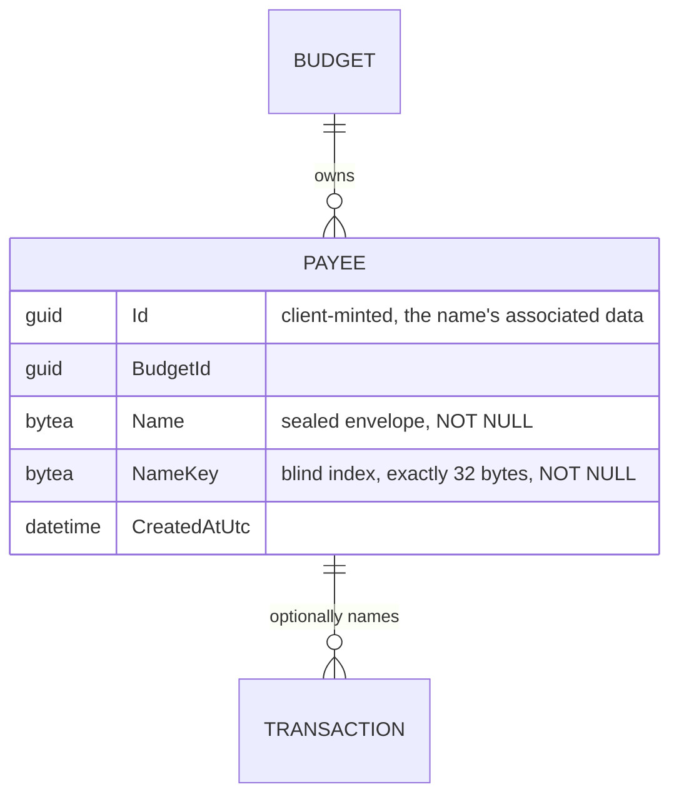
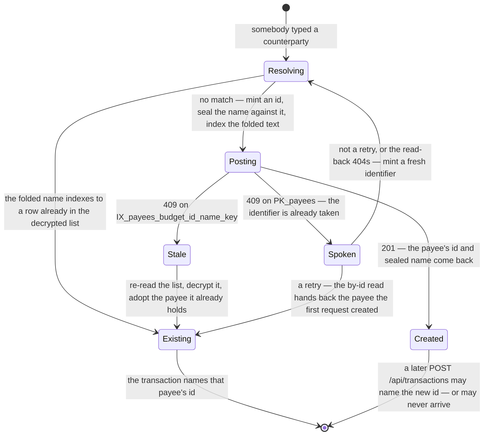

# Payees

## Table of Contents

- [Purpose](#purpose)
- [Key Entities](#key-entities)
- [Constraints](#constraints)
- [Business Rules & Invariants](#business-rules--invariants)
- [Workflows & State Transitions](#workflows--state-transitions)
- [Decision Trees](#decision-trees)
- [Integration Points](#integration-points)
- [Edge Cases & Known Gotchas](#edge-cases--known-gotchas)

## Purpose

A **Payee** is the counterparty on a transaction — the shop, employer or person the money went to
or came from. It exists so that the same counterparty named on twenty transactions is one thing
rather than twenty strings, which is what makes autocomplete work and what stops "Tesco" and
"tesco" becoming two counterparties.

**A payee is created deliberately, through a route of its own, and that reverses the rule this file
used to argue.** A payee used to come into existence only as a side effect of somebody typing a
name into the payee field, found-or-created by name on the server. **The reversal is not a change
of taste: the server can no longer look a payee up by name.** `payees.name` holds an AEAD envelope
drawn under a fresh nonce, so two seals of one name are different bytes and an equality comparison
over the column finds nothing; the digest that *is* stable is taken under the account's index key,
which lives in a browser this server never sees; and the case folding the old lookup leant on left
with the column's `case_insensitive` collation, because `bytea` is not a collatable type.
Find-or-create became **unimplementable**, not unfashionable.

**What survives is the property find-or-create existed for.** The client holds the payee list, can
decrypt it, and resolves the typed counterparty against it before it posts anything — so one
counterparty is still one row, now refused by `IX_payees_budget_id_name_key` rather than by a
re-read on this side.

**What is lost has to be said out loud, because nothing in the schema records it: a payee row no
longer implies a transaction.** A `POST /api/payees` that succeeds is a payee, whether or not the
transaction the person was in the middle of ever lands. The orphan that follows is accepted and
argued under [Edge Cases](#edge-cases--known-gotchas).

Once a payee exists, its name can be corrected in place — the single write a payee accepts in its
own right — and everything else about it is fixed. Every payee belongs to exactly one budget (see
[budgets.md](budgets.md)) and is never shared with another.

This file is canonical for payee rules. [transactions.md](transactions.md) covers only the
transaction side of the interaction — that the payee input is an **id**, and that a transaction may
name none.

## Key Entities

- **Payee** — `Id`, `BudgetId`, `Name`, `NameKey`, `CreatedAtUtc`.
  - **`Name` is a sealed narrative envelope and not text.** The property is typed `NarrativeField`
    and the column is `bytea NOT NULL`. That type has no constructor, factory or conversion taking a
    `string`, so writing plaintext into this column does not compile. See
    [ciphertext-envelope.md](ciphertext-envelope.md). What the type forecloses on *this* table is a
    particular disclosure: a payee list is the set of counterparties one person deals with — a
    landlord, a pharmacy, a clinic, an employer — and it is legible with no amount beside it.
  - **`NameKey` is the blind index over the same name** — `ReadOnlyMemory<byte>`, exactly 32 bytes
    (`HMAC-SHA-256` under the account's index key, computed in the browser), on its own
    `bytea NOT NULL` column. It is what the uniqueness rule is enforced over, and on this table that
    uniqueness is the whole of counterparty deduplication rather than a convenience.
  - **Both are written from one `IndexedName` parameter and never separately.** `Payee.Create` and
    `Payee.Rename` each take one, and neither offers a spelling for half a name — the remarks on
    `Payee.Rename` spell out what a member taking a bare `NarrativeField` would cost here, which is
    more than the same mistake costs anywhere else in the product.
  - **`Id` is supplied to the factory, never minted inside it.** `Guid.CreateVersion7` has left
    `Payee.cs` entirely; the identifier is the associated data the client sealed `Name` against.
  - **`Name` and `NameKey` together are the only mutable state.** `Payee` exposes no other factory
    and no other mutator, so a payee that exists cannot be moved to another budget by any code path
    in the domain.



## Constraints

### MUST

- **A payee's name reaches this server sealed, with its blind index beside it, and nothing on this
  side can read, measure, fold or compare it.** `payees.name` is the third column in the product to
  hold ciphertext and the **second** to carry a blind index.
  - **Why**: a payee name is narrative text, which is the one thing the product is built not to be
    able to read — and it is the narrative column with the fewest distinct values per budget, so a
    plaintext one would be the easiest of the eight to read at a glance. Uniqueness had to survive
    the change rather than be surrendered, because on this table it is not a nicety: one index value
    per budget is what makes the payee list a list of counterparties rather than a list of the times
    somebody typed one.
  - **Enforced in**: `Payee.Name` is typed `NarrativeField` and `Payee.NameKey` is a
    `ReadOnlyMemory<byte>`; both are assigned from one `IndexedName`, which refuses either half on
    its own. `PayeeConfiguration` maps them to two `bytea` columns, each `IsRequired`, through value
    converters with **content** comparers over the bytes (without one EF compares a class by
    reference and a struct by pointer, so a value rebuilt from identical bytes reads as an edit and
    one rewritten in place inside the same buffer does not — on `name_key` the second is the one
    that bites, because an index the tracker misses is a row whose uniqueness value stops describing
    its own name). **Nothing in the suite holds any arm of either comparer here.** The product's
    three change-tracking classes are scoped to `category_groups`, `categories` and `transactions`;
    this table has no equivalent, and a broken
    arm is **quiet** rather than loud: EF restates a column with the bytes the row already holds, and
    `name` and `name_key` are the whole of this table's `UPDATE` grant, so nothing answers `42501`
    and the spurious statement commits exactly like a rename would. What those classes do and do not
    reach is in [categories.md](categories.md#edge-cases--known-gotchas). The table carries **three**
    `CHECK` constraints, each rendered from the constant
    that owns its number rather than from a literal: `CK_payees_name_length` bounds the envelope
    between `CiphertextEnvelope.MinimumLength` and `NarrativeFieldLimits.NameBytes`,
    `CK_payees_name_version` requires the leading version byte through `substring`, and
    `CK_payees_name_key_length` is an **equality** on 32 bytes rather than a band, because
    `HMAC-SHA-256` has one output width and a ceiling would admit a short digest silently. The two
    `NOT NULL` columns say a **row** cannot be half a name; `IndexedName.Of` says a **call** cannot
    be. Neither restates the other for error quality — one refuses a statement reaching the
    database, the other refuses a caller who meant to write both and wrote one. Each `CHECK` is
    **fired** rather than merely rendered, by raw SQL because the Application ring refuses the same
    values first: `PayeeIntegrationTests.Database_RefusesANameTheEnvelopeRulesForbid` sends an
    under-floor, an over-cap and a wrong-version envelope, and
    `…Database_RefusesABlindIndexThatIsNotExactlyThirtyTwoBytes` sends **31 and 33** — 33 alone would
    pass against a `<= 32` ceiling, so only the short one tells a width from a bound.

- **One name per budget, enforced over the index.** `IX_payees_budget_id_name_key` is unique over
  `(budget_id, name_key)`.
  - **Why**: one counterparty is one row, or the autocomplete list stops being a list of the people
    the budget deals with. The scope is the budget because a counterparty paid out of one pool of
    money is that pool's counterparty; the scope and the mechanism are stated once, in
    [budgets.md](budgets.md#constraints). What changed is the **column**. Uniqueness over `name`
    would now enforce nothing at all: every seal draws a fresh nonce, so two rows holding one name
    hold different bytes. The blind index is what survives that, being deterministic under the
    account's index key, so equality of names comes back as equality of digests.
  - **Enforced in**: the unique index declared in `PayeeConfiguration` and pinned there as
    `NameIndexName`, which `PayeeRepository` matches `PostgresException.ConstraintName` against on
    both `AddAsync` and `UpdateAsync`. The C# constant is still called `NameIndexName` while its
    **value** ends in `_name_key`: the index is for finding the row a name is already taken by, and
    the schema follows EF's own convention rather than carrying a hand-pinned exception to it. What
    the two matches produce differs by route and is a decision — 409 on a create, 400 on a rename —
    argued under [Business Rules](#business-rules--invariants).
    `PayeeIntegrationTests.PayeesTable_HasNoCollationAndAUniqueIndexOverTheBlindIndex` pins the shape
    against a real PostgreSQL: `name` is `bytea`, its `collation_name` is **null**, and the index is
    over `name_key`. It also asserts `IX_payees_budget_id_name` is **absent**, without which a
    migration that added the new index and left the old one standing would satisfy every other line
    while keeping a unique constraint over ciphertext that refuses nothing and that nobody would ever
    see fire.

- **A payee belongs to exactly one budget, and never moves.**
  - **Why**: the tenancy rule, not tidiness: a payee that changed `budget_id` would carry the
    transactions naming it into another pool's picture.
  - **Enforced in**: **database-owned**; the cross-entity rule is in
    [budgets.md](budgets.md#constraints) — a required `budget_id`, the `BudgetIsolation` filter, and
    the composite `(payee_id, budget_id)` reference from `transactions`. What is payee-specific is
    *which* bottom-layer mechanism answers, and it depends on whether the payee is referenced → the
    grant-list gotcha below.

### MUST NOT

- **A payee that any transaction references MUST NOT be deleted.**
  - **Why**: refusing forces an explicit decision about the historical rows instead of silently
    erasing the counterparty from transactions that already happened — the same protection
    [Accounts](accounts.md) and [Categories](categories.md) have.
  - **Enforced in**: **database-owned, and only there.** The composite `transactions → payees`
    foreign key is `Restrict`. It cannot be `ON DELETE SET NULL`, because the pair includes the
    `NOT NULL` `budget_id` column. No application code path deletes a payee at all —
    `IPayeeRepository` exposes `AddAsync`, `GetByIdAsync` and `UpdateAsync`, and none of the four
    routes `PayeeEndpoints` maps is a `DELETE` — so unlike accounts and categories there is no
    handler to precheck and no message to write. The absence goes one layer lower: the role holds no
    `DELETE` privilege on `payees` at all, so even a raw statement fails with `42501` without
    reaching the foreign key. A delete feature would need a grant added to `app-role-grants.sql`
    first, which is the fail-closed behaviour
    [ADR 0004](../decisions/0004-connect-as-a-least-privilege-role.md) intends.
    `PayeeIntegrationTests.DeletingAReferencedPayee_IsRefusedByTheDatabase` sends the delete as raw
    SQL, because raw SQL is the only way to attempt it. **The withheld grant is now also what makes
    an orphaned payee permanent** — see [Edge Cases](#edge-cases--known-gotchas), which argues why
    that is accepted rather than answered with a compensating delete.

- **A payee MUST NOT be shared across budgets.**
  - **Why**: stated once, in [budgets.md](budgets.md#must-not).
  - **Enforced in**: the tenancy machinery that file owns;
    `PayeeIntegrationTests.Payees_AreIsolatedPerUser` pins it end to end.

- **The server MUST NOT be given a rule about a payee name's text** — not a minimum length, not a
  blankness check, not a trim, not a character cap, and not a case-folding rule.
  - **Why**: every one of them is a question about plaintext this deployment has never seen. A
    reader who finds the gap in `ValidateOrThrow` and restores a check can only restore it against
    the envelope, which measures the wrong thing; a reader who notices the collation is gone and
    reaches for a folding rule has nothing to fold. Both are argued in full under
    [Business Rules](#business-rules--invariants), because they are capabilities that **moved**
    rather than rules that were dropped, and that is what the next reader has to be told.
  - **Enforced in**: the absence of any name rule in `Payee.ValidateOrThrow`, which now judges the
    identifier and the tenancy and nothing else, and the byte bounds under MUST above — the only
    lengths anything on this side can measure.

## Business Rules & Invariants

- **Rule**: A payee is created by a request of its own, `POST /api/payees`, and that is the only
  path. Writing a transaction creates nothing.
- **Why**: **the server cannot resolve a name to a row.** Find-or-create needed three things this
  side no longer has — a comparable stored value, a fold that makes two spellings one name, and an
  index that answers the comparison — and all three left with the plaintext. So the act has to be
  asked for, and the only party that can decide whether it is needed is the client, which holds the
  decrypted list and the index key. That relocation keeps the guarantee the old shape was built
  around: the client folds and indexes the typed name, compares it against the list it already has,
  and posts only on a miss, so one counterparty is still one row.
- **Enforced in**: **application-owned for the shape, database-owned for the guarantee.**
  `PayeeRepository.AddAsync` is the only method that inserts, and `CreatePayeeHandler` its only
  caller; `IPayeeRepository` carries no member taking a name, and its remarks say why one cannot be
  written. `IX_payees_budget_id_name_key` is what makes "one row per counterparty" true regardless
  of what any client believes, and the 409 it produces is how a client is told its list was stale.
  Neither transaction handler touches `payees` at all now: each resolves a supplied `payeeId`
  through the budget-filtered repository and reads.
- **Example**: a budget that has recorded no transactions can still hold payees, and a budget with
  transactions can hold a payee none of them names. Neither is a defect; both were impossible
  before.
- **Counterexample**: accepting a whole payee inline on the transaction body, so the counterparty
  can still be set up mid-entry in one request. It would give payees **two** creating paths, which
  is exactly the property this shape buys — one route, one handler, one insert, one place where a
  client-minted identifier and a sealed name are judged. The second path would also be the one
  nobody reviews: it would look like a field of a transaction rather than a creation, and the day it
  drifted from the route's checks a payee would be born with an id spelling this API cannot
  reproduce, holding a name nothing will ever open.
- **Source**: `[SOURCE: discussion]`

---

- **Rule**: **The client resolves the counterparty; the server matches nothing.** Typing
  `trader joe's` where `Trader Joe's` already exists still ends on the existing payee — the browser
  folds and indexes the text and finds the row in the list it holds.
- **Why**: matching is what the sealing took away from this side and gave to the only party with the
  key. The behaviour a person experiences is unchanged and its enforcer is not: what used to be a
  `case_insensitive` collation on a column is now the normalization
  [account-keys.md](account-keys.md#the-normalization-a-name-is-indexed-through) defines — trim,
  NFKC, **full** case fold, UTF-8 — applied before the `HMAC`. The database still guarantees two
  identical index values cannot coexist; it no longer guarantees two spellings of one name produce
  identical index values, and that half is now the client's to get right.
- **Enforced in**: the client, and by nothing beneath it. **Two integration cases went with the
  mechanism, and only one of them has a replacement** — the distinction is worth keeping, because a
  reader who finds either gone will otherwise look for the same hole twice.
  `PostTransaction_WithExistingPayeeDifferentCase_ReusesPayee` asserted that the server folded case,
  and it is gone **with no replacement and no possible one**: there is nothing below the browser that
  could take its place, because the server sees a MAC and never a name. The race case beside it —
  concurrent writes for one counterparty leaving exactly one row — asserted a property that still
  holds, so it was *re-pointed* rather than deleted:
  `PayeeIntegrationTests.PostPayee_RacedForOneBlindIndex_AnswersOneCreatedAndConflictsForTheRest`
  sends five creates for one blind index and asserts one 201 and four 409s. What changed is the
  mechanism it watches — a unique index refusing, instead of a re-read swallowing — which is the only
  half of the old guarantee this side still owns.
- **Counterexample**: a client that folds with the host's `toLowerCase` instead of the shipped fold
  table. It agrees with a correct client on almost every name a person types, disagrees on the
  handful where the difference decides a match, and the symptom is a duplicate counterparty that
  never merges on the one column whose entire purpose is that equal names collide. A blind index
  **cannot be recomputed** after the fact — the plaintext behind it is encrypted — so there is no
  repair that does not run through the account's own recovery factors.
- **Source**: `[SOURCE: discussion]`

---

- **Rule**: **The server can no longer refuse a blank or a runaway payee name.** "A name is not just
  spaces" and the 200-character ceiling are now the client's, applied before it seals.
- **Why**: this is a **capability that moved**, not a rule that was quietly dropped, and the
  distinction is why it is written down rather than left as a gap in a validator. The value arriving
  is an AEAD envelope over text this server has never seen and holds no key for; "is this nothing
  but spaces?" and "is it longer than a label?" are questions about plaintext. A reader who finds
  the absence and restores a check can only restore it against the **envelope** — measuring bytes
  and calling them characters, or refusing a 29-byte envelope that is the correct sealing of an
  empty string. Both are wrong answers wearing the shape of the right one.
- **Enforced in**: what replaced each half is a byte rule and nothing more. The trim and the
  blankness check are replaced by **nothing on this side**; `Payee.ValidateOrThrow` judges the
  identifier and the budget and no name rule at all. The 200-character ceiling is replaced by
  `NarrativeFieldLimits.NameBytes` — a cap on **stored envelope bytes**, applied by `IndexedName.Of`
  and restated as the upper bound of `CK_payees_name_length`. `CiphertextEnvelope.MinimumLength` is
  the floor of that same check, and it is **not** the blank-name rule restored: an envelope over an
  empty string satisfies it exactly.
- **Example**: a client that seals `"   "` gets a `201`. The row is well-formed, the constraints are
  satisfied, and nothing in this deployment can tell that value from `"Corner Shop"`.
- **Counterexample**: adding a floor above the format's own to approximate "not blank". It refuses
  short real names, admits long blank ones, and is a rule about ciphertext claiming to be a rule
  about text.
- **Source**: `[SOURCE: discussion]`

---

- **Rule**: **A name and its blind index move together or not at all**, and on this table half a
  name costs more than it costs anywhere else in the product.
- **Why**: such a column is a pair — the ciphertext nobody here can read, and the keyed digest that
  is the only way a row holding a given name can be found or refused as a duplicate. A row carrying
  new ciphertext under the previous name's index is bad and silent everywhere; here it produces two
  further failures, because the payee list **is** the deduplication mechanism of the domain.
  Creating the **new** name afterwards is accepted, since its index is still free — so the budget
  gains a second payee for one counterparty, which is precisely the duplication find-or-create
  existed to prevent, arriving by the path meant to fix a typo. Creating the **old** name is refused
  with a 409 pointing at a payee that no longer holds it: the client re-reads, decrypts every name,
  finds no match, and has nowhere to go — a name the person can neither create nor find. Nothing on
  this side can notice either, because recomputing a digest needs the budget's index key, which
  lives in a browser.
- **Enforced in**: three places, holding three different moments. `Payee.Create` and `Payee.Rename`
  take an `IndexedName` and offer no spelling for half a name, so a **call** cannot be half; the two
  `NOT NULL` columns mean a **row** cannot be; and the role's `UPDATE` grant on `payees` names
  `name, name_key` together, so the **statement** is permitted whole. The general rule and the live
  defect it was first found by are argued at the `accounts` block of
  `app-role-grants.sql` and in the [decision log](_decision-log.md); this table wanted the pair in
  exactly that live form, and a `(name)`-only list would refuse every rename with `42501`.
- **Counterexample**: a later `Rename(NarrativeField name)` overload added for a screen that "only
  changes the name". It compiles, it stores, it reads back, no constraint fires, and both failures
  above follow silently.
- **Source**: `[SOURCE: discussion]`

---

- **Rule**: A payee's identifier is **supplied by the client and crosses as text**, in the
  lower-case 36-character hyphenated spelling and nothing else.
- **Why**: the identifier is the associated data the name was sealed against, and associated data is
  rebuilt from where a ciphertext was found rather than carried inside it — so this API has to hand
  back the same spelling it was sent, and therefore has to refuse the spellings it cannot reproduce.
  Bound as a `Guid`, `System.Text.Json` folds the braced, upper-case and canonical forms to one
  value before any handler sees text, and the refusal becomes **unwritable**: it compiles, every
  test that sends a canonical id passes, and it fails in a browser months later. **On this table the
  failure is worse than a bad row.** A payee whose name cannot be opened is a name the client cannot
  match, so it mints a second payee for the same counterparty the next time somebody names it — and
  the duplication `IX_payees_budget_id_name_key` exists to refuse arrives anyway, under a different
  index, with nothing on this side able to tell that it should have fired.
- **Enforced in**: `CreatePayeeCommand.Id` is a `string`, judged by `CanonicalIdentifier.TryParse`
  in `CreatePayeeHandler` — first of the three opaque members, because a spelling this API cannot
  reproduce makes the envelope beside it irrelevant whatever that envelope looks like. All three are
  attempted and every failure is reported, since one piece of client code produces all three.
  `Payee.Create` takes the id as a parameter and refuses `Guid.Empty` — reachable for the first time
  now that the value arrives from outside, and refused here rather than left to the primary key,
  which accepts all-zero as a legal uuid and would answer the *second* such row with the identifier
  conflict below: a sentence true of the row and wrong about the caller, telling somebody who chose
  no id at all to mint a fresh one.
- **Counterexample**: `RenamePayeeCommand.Id` is a `Guid` and the route parameter stays `{id:guid}`,
  and that asymmetry is deliberate rather than an oversight. On a rename the client re-seals against
  the row's **existing** id, which it read back from this API in the one form a `Guid` renders; the
  text in the URL is never the text anything was sealed under, so there is no spelling to preserve.
  The rule lives where an identifier is *chosen*.
- **Source**: `[SOURCE: discussion]`

---

- **Rule**: A duplicate blind index answers **409 on a create** and **400 on a rename**. One
  constraint, one table, two statuses.
- **Why**: **what differs is the remedy, not the constraint.** A create that collides means a payee
  already carries this name in this budget and the client's list was stale; the resolution is to
  adopt the row that already exists, which is not something a person corrects by editing a field, so
  there is no member for a validation problem document to be keyed on. A rename that collides means
  a person chose a name another row holds, and the resolution is to choose a different one — a
  statement about `Name` in the request, which is exactly what a 400 carries and a bare conflict
  status has nowhere to put. The create's reading is the one the old find-or-create made silently:
  *reporting a race somebody had no part in, over a payee that now exists and is the one they
  meant*. What changed is **who** re-reads — this side cannot, so the 409 is what asks the client
  to.
- **Enforced in**: **database-owned for the refusal, application-owned for the sentence.**
  `PayeeRepository.AddAsync` catches the `23505` **matched by constraint name**, detaches the
  rejected entity so its failed state cannot leak into a later save, and raises
  `Domain.Common.ConflictException`, which `ConflictExceptionHandler` renders as a 409.
  `PayeeRepository.UpdateAsync` catches the same violation on the same index and raises
  `Domain.Common.ValidationException` naming `Name` ("Payee name must be unique."), which
  `ValidationExceptionHandler` renders as a 400. The conflict handler is shared by every conflict in
  the product and adds no extension member, so its `Detail` sentence is the whole of what
  distinguishes this 409 and has to say what the caller does next by itself — it names no payee id,
  no SQLSTATE and no constraint.
  `PayeeIntegrationTests.PostPayee_WithABlindIndexAnotherPayeeHolds_AnswersConflict` asserts that
  sentence **in full** and asserts the problem document carries **no** `errors` member, which is what
  keeps the two answers from being quietly harmonised;
  `…PatchPayee_WithANameHeldByAnotherPayeeInTheSameBudget_ReturnsBadRequest` is its opposite number
  and additionally asserts both rows survive, because a handler that wrote the row and only then
  reported the collision would satisfy the status alone.
  - **Neither status can drift into the other by accident, and that is measured rather than
    assumed.** Making the rename arm unreachable — retargeting its `when` clause at a constraint the
    statement can never raise — does not produce the create's 409. Nothing in the handler chain maps
    `DbUpdateException`, so `GlobalExceptionHandler` writes a **500**, and the endpoint case above
    reddens with `InternalServerError` against its expected `BadRequest`. So "consistency" between
    the two answers can only ever arrive as a deliberate edit somebody has to write and defend, which
    is what this rule's argument is for. The same mutation also reddened
    `UpdatePayee_RenamedOntoATakenName_TranslatesItsOwnUniqueIndex`, which is new: the wire status was
    already pinned here and the **attribution** — the exception type and the `Name` key, i.e. which
    rule the caller broke — was not.
- **Example**: two tabs each deciding a counterparty is new and posting the same index. One gets a
  201; the other gets a 409 telling it to re-read the list and use the payee already there. A person
  renaming "Costco" onto a name "Starbucks" already holds gets a 400 with the error on `Name`, and
  both rows survive unchanged.
- **Where the account create differs, and why it is not this rule with a table's name changed.**
  `POST /api/accounts` answers a duplicate with a **400** keyed on `Name`, over the same shape of
  unique index and the same `23505`. The difference is not the entity: an account's name is typed
  into a form by a person, so a collision is a field they can correct, while a payee's name was
  resolved by the client against a list it decrypted and posted only on a miss, so a collision says
  that list was stale rather than that anybody chose badly. The full argument, and what it means for
  the next named entity, is in the [decision log](_decision-log.md). Do not align the two.
- **Counterexample**: harmonising the two onto 409. The rename would lose the field-keyed 400 — the
  status would say two things disagree but not **which field**, so a caller would handle two
  statuses for one kind of mistake depending on which entity they were editing, and a form would
  have nothing to attach the message to. That argument is the rename's and it stands; the create is
  a different act with a different remedy, not a contradiction of it. **Both readings are wrong in
  the corner cases** — a rename can lose a race between two tabs, a create can be a person
  deliberately making a second payee — and each status follows its dominant case. If this is ever
  overruled, the fallback that keeps one status is 409 on both, and the cost is named above.
- **Source**: `[SOURCE: discussion]`

---

- **Rule**: A create carrying an identifier the table already holds answers **409 with its own
  sentence**, and never the duplicate-name one: `A payee already exists with this identifier. If
  this request is a retry, read that payee back by its identifier instead of posting it again;
  otherwise mint a fresh identifier and post again.`
- **Why**: the identifier is the client's, so **a retry after a network timeout is a byte-identical
  body** — the ordinary behaviour of an HTTP client, on a route that fires from an autocomplete —
  and the one answer that tells such a client what to do is the one it did not get while this
  collision was left to propagate. There is no member for a validation problem document to be keyed
  on either: the id, the envelope and the index are all exactly what the caller meant, and the
  remedy is to read the row back or to choose a different identifier, neither of which is an edit to
  a field.
  - **The two conflicts must not share a sentence.** A duplicate name says somebody already holds
    this name and the remedy is to adopt the row that already exists. A duplicate identifier says
    nothing about names at all — the row wearing that id may hold a different one, or a name in a
    budget the caller cannot read — so sending that caller off to re-read its payee list would send
    it looking for a name that is not on it. The shared conflict handler writes one title for every
    409 in the product and adds no extension member, so the sentence is the only place the
    difference can live.
  - **"Read it back" is an instruction and not a promise, and the second clause is why.** The
    primary key spans the whole table while `GET /api/payees/{id}` is scoped to the ambient budget,
    so an identifier held by *another* budget answers 409 here and 404 on the read-back — at which
    point the sentence's other reading, mint a fresh identifier, is the honest one. **The narrow
    disclosure that follows is accepted rather than unnoticed**: the 409 tells a caller that some
    budget in this deployment holds the identifier it proposed, which is one bit about a tenant it
    cannot otherwise see. Identifiers are client-minted 128-bit values, so provoking that bit
    deliberately means guessing a uuid, and no content crosses with it. Closing it means widening
    the key to `(budget_id, id)`, which is a schema change and a decision to be made again rather
    than a defect to be patched.
- **Enforced in**: **database-owned for the refusal, application-owned for the sentence**, exactly
  as its neighbour. `PayeeRepository.AddAsync` carries two `catch` arms over the **same** SQLSTATE,
  each matched by constraint name — `PayeeConfiguration.PrimaryKeyName` and the name index — so
  SQLSTATE alone cannot tell the two apart and whichever sentence was written first would be given
  to both. Which constraint a row breaking both rules is reported under is decided by **OID**, and
  the measurement is in
  [ciphertext-envelope.md](ciphertext-envelope.md#which-constraint-a-row-is-reported-under-is-decided-by-oid).
  `PayeeIntegrationTests.PostPayee_RetriedByteForByte_AnswersConflictNamingTheIdentifier` sends one
  body twice and asserts the sentence in full, because the status alone is satisfied by an
  implementation that reached for the neighbouring conflict;
  `…PostPayee_ReusingAnIdentifierUnderAnotherName_AnswersConflictNamingTheIdentifier` breaks the key
  **alone**, which is the shape that used to answer 500; and
  `…PostPayee_CollidingOnTheIdentifierOrOnTheName_AnswersTwoDifferentSentences` asserts the two are
  **not equal**, which is the property no case asserting one sentence in isolation can hold — three
  such cases stay green if the arms are collapsed into one that always throws whichever conflict
  each of them happened to expect.
- **Example**: a browser posts a payee, the response is lost, and it sends the same body again. It
  gets a 409 naming the identifier, follows the instruction, and `GET /api/payees/{id}` hands back
  the payee its first request created — one row, and the transaction it was in the middle of can
  name it. `…PostPayee_WithAnIdentifierAnotherBudgetHolds_AnswersConflictThatCannotBeReadBack` is
  the other end of the same instruction: the same 409, a 404 on the read-back, and an empty list.
- **Counterexample**: answering **200 with the row that already exists**, which is the tidy-looking
  idempotent create. It means reading the row back and deciding whether it is the same payee — a
  comparison over envelopes this server cannot open, so it could only compare a blind index, and it
  would still have to choose an answer for the case where the id matches and the index does not.
  That is a decision with its own failure modes and it is not this one; a 409 that says what
  happened costs the client one `GET /api/payees/{id}`.
- **Source**: `[SOURCE: discussion]`

---

- **Rule**: A payee is renamed **in place** through `PATCH /api/payees/{id:guid}` with a
  **required** `name` and a **required** `nameKey`, keeping its `Id`, and the rename **rewrites
  history**: every transaction that already named that payee ships the new envelope. Success is 204
  No Content. `BudgetId` is not accepted and does not change.
- **Why**: the name is the entirety of a payee, so it is the only thing about one a person can be
  wrong about. Retroactivity is the point of the operation rather than a side effect of how a
  transaction is read: the row stands for one real-world party, so correcting its spelling corrects
  every transaction that ever dealt with it, and a rename that applied only to future entries would
  leave the ledger showing two counterparties where there is one. That is the **opposite** stance
  from the one taken on deletion, and the two reconcile on one distinction: **a name is a mutable
  label on a stable identity, while a transaction is the record of an event.** Relabelling the party
  does not alter what happened; removing the party from a movement that happened does. Both members
  are required rather than optional, and there are two of them for one field: a payee has exactly
  one mutable thing about it, so a body omitting either half is malformed rather than a no-op the
  caller could have meant — and a body carrying only `name` is worse than malformed, since it is the
  half-rename `IndexedName` exists to make unspellable, arriving as a shape the binder would have
  accepted.
- **Enforced in**: **application-owned for the operation, and the retroactivity is a property of the
  read model that costs no code at all.** `PayeeEndpoints` maps `PATCH /api/payees/{id:guid}` over a
  `RenamePayeeRequest` of two required strings and returns `TypedResults.NoContent()`.
  `RenamePayeeHandler` resolves the id through `GetByIdAsync`, decodes both opaque members —
  attempting each and reporting every failure — builds one `IndexedName`, calls `Payee.Rename` and
  saves through `UpdateAsync`. Nothing propagates the new name anywhere, because nothing holds a
  copy of it: `TransactionReadService` joins `payees` and carries `payee.Name` on every read, which
  `PayeeIntegrationTests.PatchPayee_RenamesThePayeeOnEveryTransactionThatAlreadyNamedIt` pins over
  two past transactions. Both members being required is
  `…PatchPayee_WithEitherHalfOfTheNameMissing_ReturnsBadRequest`, which sends four bodies — name
  only, index only, empty, and both explicitly null — and whose **absent** cases are the point: the
  blank-name and 201-character arguments it used to carry are gone with the rules they measured.
  **There is no shared validator behind the two write paths any more, and that is deliberate**:
  `Payee.Rename` does not call `ValidateOrThrow`, because once every name rule moved to the client
  the only rules left are the identifier and the budget — both already on the entity, both written
  once, and neither reachable as empty on a row that materialised out of the database. A call there
  would re-examine two values the member cannot change and could not have been handed: a no-op that
  reads as protection. A body omitting `name` or sending it as null is refused by body binding or by
  the decode, never by a name rule, because there is no name rule left to fail.
- **Example**: a payee whose name was mistyped is renamed by sending a freshly sealed envelope and
  the index over the corrected text; the budget still holds one payee row with the same `id`, and
  every transaction that already named it ships the new envelope on the next read.
- **Counterexample**: snapshotting the payee's name onto each transaction when it is recorded. The
  rename then has to fan out a write across every transaction that ever named the payee, or it is
  merely cosmetic — and on sealed columns it is worse than cosmetic, because each copy would be an
  envelope bound to the **transaction's** row id, so nothing could ever compare two of them or tell
  that one had gone stale.
- **Source**: `[SOURCE: discussion]`

---

- **Rule**: A rename that changes only the **case** of the payee's own name is a 204, and the unique
  index is never even troubled by it.
- **Why**: capitalising a counterparty properly is the ordinary correction, not an edge case. It was
  legitimate before because a row cannot collide with itself — the update replaced that row's own
  index entry in the same statement — and it is legitimate now for a stronger reason: the client
  folds case before it computes the index, so `"starbucks"` and `"Starbucks"` produce the **same**
  `name_key`. The statement rewrites `name` with a fresh envelope and writes `name_key` back
  identical to what it already held, and there is nothing for a uniqueness constraint to object to.
- **Enforced in**: **the client's normalization, and the index's indifference to it.** Nothing on
  this side folds anything, and nothing on this side needs to: the rename writes whatever pair it
  was handed, and only a *different* index value can collide. `PayeeConfiguration` declares no
  collation on `name` and says why in place — `case_insensitive` is a text collation and `bytea` is
  not a collatable type, so its departure was forced rather than chosen.
  `PayeeIntegrationTests.PatchPayee_WithANewEnvelopeUnderTheBlindIndexItAlreadyHolds_ReturnsNoContent`
  is the case, and **its seed is the whole of it**: the two halves are paired by hand, a *new*
  envelope under the *existing* index, because sending one label through both fixtures re-sends the
  row's current envelope as well and cannot tell "a row does not collide with itself" from "the
  `UPDATE` wrote nothing at all" — a handler that discarded the body and answered 204 passes that
  weaker shape. `SealedNarrative.Indexed` offers no two-label overload on purpose, so the pairing is
  built in the open where a reviewer reads it.
- **Counterexample**: prechecking with "does a payee with this name already exist?" and refusing
  when one is found. It cannot be written at all now — there is no name to look up — and the shape
  it would take instead, a precheck on the index, answers yes for the row being renamed, so every
  case-only correction is rejected as a duplicate of itself. The precheck is check-then-act besides,
  so the index still has to catch the loser of a race.
- **Source**: `[SOURCE: discussion]`

---

- **Rule**: Renaming or reading a payee that belongs to another budget answers **404**, byte for
  byte the answer an id matching no row anywhere gets. There is no 403.
- **Why**: this is the standing tenancy rule rather than a rule about renaming — a row outside the
  ambient budget is invisible rather than forbidden, and the reasoning is stated once, in
  [budgets.md](budgets.md#must-not).
- **Enforced in**: **application-owned, through the same mechanism as every other by-id access in
  this API.** `Payee` is one of the `BudgetIsolation`-filtered entities, and both
  `PayeeRepository.GetByIdAsync` and `PayeeReadService.GetByIdAsync` query that filtered `DbSet`
  rather than `Find`, because `Find` can answer from the change tracker without ever reaching the
  filter. A stranger's payee therefore reads as null: `RenamePayeeHandler` throws `NotFoundException`
  and `GET /api/payees/{id:guid}` returns `TypedResults.NotFound()` — there is no tenancy branch
  anywhere for a refactor to drop. Beneath both sits the `budget_isolation` policy, which holds under
  raw SQL as well.
- **Example**: one budget's payee patched by another budget's owner answers 404 and the row keeps
  its name, while the owner's identical request on the very same id answers 204. An id belonging to
  no budget at all answers the same 404, and so does a `GET` on either.
- **Source**: `[SOURCE: discussion]`

## Workflows & State Transitions

A Payee has no lifecycle states: it is created, read, and renamed. There is no merge, no archive and
no delete. A rename is not a transition either — it changes what the row says, not what state it is
in, and no rule anywhere reads the previous name. A transaction edited to name a different
counterparty does not touch either payee row — it repoints its own `PayeeId`.

Bringing a payee into existence, from the browser that decides one is needed to the row:



| Transition | Triggered by | Validations |
|---|---|---|
| Resolving → Existing | The client's own list already holds that blind index | None on this side — the server is not asked |
| Resolving → Posting | The client's list holds no such index | `CreatePayeeHandler` judges the id's spelling, the envelope's framing and cap, and the index's width, reporting every failure |
| Posting → Created | The insert was accepted | `Payee.Create` refuses an empty id and an empty budget id; `IndexedName.Of` refuses half a name |
| Posting → Stale | `IX_payees_budget_id_name_key` refused it | The `23505` is matched **by constraint name**, never on SQLSTATE alone, because the identifier arm raises the identical one |
| Posting → Spoken | `PK_payees` refused it | The same `23505` under the other name. A row breaking both is reported under the **key**, so this arm wins a byte-for-byte retry |
| Created → `[*]` | Nothing, necessarily | **The transaction is a separate request and may never be sent.** The payee stands either way |

The rename (`RenamePayeeHandler`) is the whole of the payee's own write surface, and it has three
outcomes:

| Outcome | Triggered by | Validations |
|---|---|---|
| Renamed (204) | The id resolved through the filtered set, both members decoded, and the unique index accepted the new pair | Framing, cap and index width; nothing about the text |
| Unchanged (400) | Either member failed to decode, or the unique index refused the pair | A `23505` naming `IX_payees_budget_id_name_key` becomes "Payee name must be unique."; a case-only correction of the row's **own** name writes the index back unchanged and cannot collide |
| Unchanged (404) | The id resolved to nothing in the ambient budget | None run — whether the id belongs to another budget or to no row at all |

## Decision Trees

Creating a payee (`CreatePayeeHandler`, `POST /api/payees`):

```
judge all three opaque members and collect every failure ← one piece of client code produced all
  IF Id is not the lower-case 36-character hyphenated     three, so a caller that got two wrong
     uuid, or is the all-zero one                         must not learn about the second only
    THEN an error keyed on Id                             after fixing the first
  IF Name is not base64url decoding to a v1 envelope
     within NarrativeFieldLimits.NameBytes
    THEN an error keyed on Name
  IF NameKey is not base64url decoding to exactly
     IndexedName.BlindIndexLength bytes
    THEN an error keyed on NameKey
IF any error was collected
  THEN 400 naming every member that failed
ELSE
  Payee.Create(id, ambient budget, IndexedName.Of(envelope, index), now)
  try to insert
  IF PK_payees refused it                                ← checked first because it is the one
    THEN 409 "A payee already exists with this             PostgreSQL reports when a row breaks
              identifier. If this request is a retry,      both; the two catches are mutually
              read that payee back by its identifier       exclusive either way
              instead of posting it again; otherwise
              mint a fresh identifier and post again."
  ELSE IF IX_payees_budget_id_name_key refused it        ← the client's list was stale; the same
    THEN 409 "A payee with this name already exists        23505 under the other name, which is
              in this budget. Re-read the payee list        why neither arm may match on SQLSTATE
              and use the payee it already holds."          alone
  ELSE
    THEN 201 with the payee, and a Location naming GET /api/payees/{id}
```

Naming a payee while creating or editing a transaction:

```
IF no payeeId was supplied on a create,
   or the member is absent on an edit
  THEN leave the transaction with no payee, or with the one it already had
ELSE IF the member is present and null                   ← an edit only; there is no blank id, so
  THEN clear the payee                                     the clear is spelled by the null alone
ELSE
  read the payee through the BudgetIsolation-filtered repository
  IF it does not resolve in the ambient budget
    THEN validation error "Payee was not found."         ← also the cross-budget answer; without
  ELSE                                                     this read the id reaches the composite
    THEN assign it                                         foreign key and a 23503 becomes a 500
```

Renaming a payee (`RenamePayeeHandler`):

```
IF the payee id does not resolve in the ambient budget
  THEN 404 "Payee was not found."                        ← also the cross-budget answer
ELSE
  judge both opaque members and collect every failure
  IF either failed
    THEN 400 naming each                                 ← no name rule can fail here; there is
                                                           none left on this side
  write name and name_key in one statement
  IF another payee in the budget holds that index
    THEN 400 "Payee name must be unique."                ← the row's own index is not a collision,
                                                           and a case-only correction writes it
                                                           back unchanged
  ELSE
    THEN 204 No Content                                  ← every transaction naming this payee
                                                           ships the new envelope on the next read
```

No lookup precedes the write: the collision is discovered by `IX_payees_budget_id_name_key`
refusing the update, which is the only reading of "already held" that a case-only correction of a
row's own name does not trip over — and the only one available, since nothing here can look a name
up.

## Integration Points

- **[Transactions](transactions.md)**: the payee is **referenced** by a transaction and no longer
  created by one. Both handlers resolve a supplied `payeeId` through the budget-filtered repository
  and call `Transaction.AssignPayee`; the edit path additionally reaches `Transaction.ClearPayee`
  when the member is present and null. Neither handler writes to `payees`, and neither opens a
  database transaction any more — there is one write left in each. `TransactionDto` carries
  `payeeId` and `payeeName` so a transaction list renders the counterparty without a second request,
  and the name is **the payee's own envelope**, joined at read time rather than snapshotted — which
  is what makes a rename reach every transaction that named the payee without a single transaction
  row being written. Opening it needs the binding for `payees.name` under the **payee's** row id,
  which the client rebuilds from `payeeId`.
- **[Budgets](budgets.md)**: every payee is stamped with and filtered by `BudgetId`, its name is
  unique within that budget — now over the blind index rather than over a case-insensitive
  collation, with the folding done in the browser — and its reference from a transaction is a
  composite `(payee_id, budget_id)` foreign key. The same payee name in two budgets is still two
  unrelated payees, and the two rows hold **identical** `name_key` bytes: the index message carries
  the grammar's version, the table and the column, and **no budget**, while the key is one per
  account. What keeps them apart is `budget_id` being the leading column of
  `IX_payees_budget_id_name_key`, not anything about the digest — which is why that index must never
  be narrowed to `name_key` alone. A payee is also one of the four owned tables that cascade when a
  budget with no transactions is deleted.
- **[Ciphertext Envelope](ciphertext-envelope.md)**: `payees.name` is the third column to store an
  envelope and `payees.name_key` the second blind index. The framing, the byte caps, the value type
  the column accepts, the wire step for the index and the narrative grammar a name is bound to all
  live there. This file owns what a payee name *means* and what the schema no longer refuses about
  it.
- **[Account Keys](account-keys.md)**: the index key the blind index is computed under, and the
  normalization it is taken over. One index key per **account** — two would produce two index values
  for one name, and the deduplication this table rests on would stop colliding while appearing to
  work.
- **Angular client**: `/app/transactions` shows the payee field as a free-text input with a Material
  autocomplete over `GET /api/payees`, and it is **on the sealed contract**. The browser opens each
  payee name, recomputes its blind index — no read returns one, which is precisely why that
  recomputation exists — and matches the typed name **against the index and never against the
  decrypted text**, so the local match and the server's unique index are decided by the same bytes.
  No match mints a row id, seals the name and calls `POST /api/payees` before the transaction is
  posted.

  Three rules there, each silent when broken. A **409 re-reads the list once and then abandons**,
  never loops: a payee whose own name did not open carries a null index, can never match, and would
  retry forever. The transaction's note is **sealed before the payee is created**, because the
  reverse order strands an orphan payee — on a table with **no `DELETE` grant** — the moment a seal
  refuses. And a 409 is **never read as success**, which would attach the entry to a payee this
  client never confirmed.

  **`GET /api/payees/{id}` and the `PATCH` still have no caller**, and that is deliberate rather than
  pending: there is no payee screen, and an API method nobody calls is the same hazard as a mapper
  nobody calls, one layer down. They are exercised from the test suite alone.

## Edge Cases & Known Gotchas

- **The Angular transaction form sent `payeeName` until it was wired, and every write it made
  answered 400 — the refusal is what made the gap audible instead of silent, and the argument stands
  now that the caller is fixed.** `CreateTransactionCommand` carries `PayeeId`, and both transaction
  wire shapes — that
  record and the `UpdateTransactionRequest` the `PATCH` binds — carry
  `[JsonUnmappedMemberHandling(JsonUnmappedMemberHandling.Disallow)]`, so `System.Text.Json`
  refuses a body naming a member it cannot map instead of dropping it. **The attribute is
  per-type**: its blast radius is the shape it sits on and no other, which is why it reaches
  exactly the two shapes that carried the retired member and why no `UnmappedMemberHandling`
  belongs on the API's shared options, whose every route would inherit it.
  - **It is deliberately absent from `CreatePayeeCommand` and `RenamePayeeRequest`**, so a stray
    member on `POST /api/payees` or on the payee `PATCH` is still ignored in silence. That
    asymmetry is the point rather than an omission: whether a shape refuses what it was not asked
    for is a contract decision that shape makes for itself, and no type here carries the attribute
    for company.
  - **What it costs is the whole screen, and that is the trade.** `/app/transactions` cannot
    record or edit anything until the client is wired to `POST /api/payees` and to send `payeeId`
    — the same state `/app/accounts` is in for the same reason. The alternative keeps the form
    working and loses the counterparty on every entry it records, which is the polarity this
    repository takes everywhere else: **the mistake that is audible beats the one that is not.**
  - **What the caller sees is a bare 400**, dressed as `application/problem+json` by the pipeline
    that dresses every bare status. It names no field: the member the binder could not map is in
    the `JsonException` and reaches the **server log**, not the response — the right way round,
    since the audience for this refusal is whoever wires the client rather than whoever is typing
    an entry.

- **A payee can outlive every transaction that named it, permanently — and there are now three
  routes to it, one of which is new.** Two are changes on the transaction side: removing the only
  transaction that named a payee strands it, and so does editing that transaction to name a
  different counterparty or none. **The third is the split of one act into two requests.** A
  successful `POST /api/payees` followed by a failing `POST /api/transactions` leaves a payee row no
  transaction names, and the table has no `DELETE` grant, so nothing in the application can remove
  it. That sentence is the reversal of what this file used to say — both handlers used to write the
  payee and the transaction inside a single database transaction, so a request failing between the
  two committed neither, and **neither handler opens a transaction now**, because each performs
  exactly one `SaveChanges`.
  - **It is accepted, because every alternative is worse.** Keeping both writes in one server
    transaction needs the server to create the payee, which needs it to look a name up, which it
    cannot do. Sending the whole payee inline on the transaction body gives payees a second creating
    path and destroys the one property the change bought. A compensating delete needs
    `GRANT DELETE ON payees`, which `app-role-grants.sql` withholds and which the MUST NOT above
    argues against at length — and it would be a delete issued on the strength of a failure the
    server may not have observed.
  - **The blast radius is one extra row in an autocomplete list** — the same harm the two older
    orphan paths already produce. What it means for a reader is unchanged and now easier to reach:
    **the existence of a payee is not evidence that any transaction ever named it**, and any future
    count, report or merge has to allow for orphans.

- **The payee list only ever grows, and a rename fixes a misspelling rather than a duplicate.**
  Nothing removes a payee, so every row that has ever existed is still in the list, and "Tesco Metro"
  and "Tesco Express" stay two counterparties forever. A typo is not permanent — that is what
  `PATCH /api/payees/{id:guid}` is for — but fixing it by typing the correct spelling on the
  **transaction** still grows the list rather than shrinking it, because the client will resolve the
  corrected text against its list, find nothing, and create a second payee. Renaming the misspelt row
  is the fix that works, and only while the correct spelling is free: renaming onto a name another
  row holds is refused as a 400. The operation that would actually shorten the list is a **merge**,
  and there is none. That the list only grows is the shape of the domain rather than a deliberate
  rule: do not cite it as a guarantee, and do not build behaviour that depends on a payee never
  disappearing.

- **`GET /api/payees` orders by creation instant then id, and ordering by name is not available to
  it at all.** `PayeeReadService.GetAllAsync` sorts on `CreatedAtUtc` then `Id` — the shape
  `AccountReadService` and `ExportReadService` already use. The old name ordering is not merely a
  different preference: over a `bytea` column the sort key after the version byte is the **nonce**,
  freshly drawn on every seal, so the list would be stable within one read and reshuffled by every
  save, and no order a person recognises would ever come back. A name order can be restored only by
  the client, which is the only side holding the text.
  `PayeeIntegrationTests.GetPayees_OrdersByTheCreationInstantAndNotByInsertionOrder` is the case, and
  **its seed is the whole test**: a row written over HTTP takes its instant from the handler's clock
  and its **id from the request body**, so an ordinary seed leaves insertion order, id order and
  creation order all pointing one way and `ORDER BY id` and `ORDER BY created_at_utc, id` emit
  byte-identical arrays — an assertion over that certifies nothing, and is satisfied by an
  implementation carrying no `OrderBy` at all, because PostgreSQL hands a freshly filled heap back in
  insertion order. So the ids stay ascending and the instants are inverted afterwards, over the
  **elevated** connection — `created_at_utc` is off the payee `UPDATE` grant, so the app role would
  answer `42501`, a different failure wearing the same red. **The case then asserts its own premise
  rather than resting on who minted the ids**: it reads the three rows back ordered by `id` and
  checks they come out in the order they were written, so a change in how a client mints identifiers
  reddens that line instead of quietly making the case vacuous. Minting v4 ids to force the
  disagreement would catch the wrong implementation for the wrong reason and stop catching it the day
  somebody "corrected" them back. The `Id` tiebreak is what makes the order total, and **nothing
  catches its removal**: it needs two payees sharing a microsecond, which no route can produce. Held
  by review.

- **`PayeeDto` carries no `nameKey`, and that absence is a decision.** A client recomputes the index
  from the name it just decrypted, under a key only it holds, and needs it solely to write. A member
  nobody reads would hand every caller a deterministic per-budget fingerprint of every counterparty
  name — the one property of the pair that survives having no key — and on this table that is the
  worst of the eight columns to offer, because a payee list is the set of people one person deals
  with. Anything that sorts, searches or groups `name` client-side is sorting ciphertext.

- **Two different code paths encode the same envelope, and only one case compares them.** The 201
  body comes from `PayeeDto.FromPayee` over the entity the handler just wrote; every other payee read
  comes from `PayeeReadService` over a row it read back. Both must emit unpadded base64url, and
  nothing about the types says so — one could emit padded standard base64 with every other case in
  the suite green, and the client's strict decoder would refuse whichever half it met second.
  `PayeeIntegrationTests.GetPayee_FollowedFromTheCreatedLocation_CarriesTheSameEnvelopeAsThe201`
  follows the `Location` header the create answered with and asserts the two `name` strings are
  **equal to each other**, not each to a fixture — the fixture is a third encoder and this file's own,
  so two responses agreeing with each other is the stronger claim. That is also the only thing
  exercising `GET /api/payees/{id}`, which exists solely so the `Location` names an address that
  resolves.

- **A duplicate-name refusal is unreadable by anybody holding the database.** The `23505` still
  arrives and still becomes a sentence, but *which* two payees collided is a question only a browser
  holding the account's index key can answer. The same is true of support: there is no query anyone
  can run to find "the payee called Tesco".

- **A blind index of the right width and the wrong value is accepted, and it is worse here than
  elsewhere.** This side holds no index key, so it can never say a value is the index *of* the name
  beside it. A correct-width value computed over the wrong text, under the wrong key, or straight out
  of a random number generator is stable, never collides, keys perfectly, and matches nothing for the
  life of the account — which on this table means a payee the client can never find while the name it
  should have indexed stays creatable. The width is the whole of the defence, refused in two places
  for two arrivals: `IndexedName.Of` refuses a **call**, `CK_payees_name_key_length` refuses a
  **row** reaching the database by any other path.

- **Which of the three `CHECK` constraints reports a violation is decided by the constraint *name*,
  alphabetically** — not by declaration order and not left to right inside an `AND`.
  `CK_payees_name_key_length` sorts first, then `CK_payees_name_length`, then
  `CK_payees_name_version`, so a zero-length name happens to answer `23514` from a length check.
  That accident is inherited rather than chosen, and it is defused rather than relied on: the version
  check is written with `substring` and never with `get_byte`, because the latter *raises* on a
  zero-length `bytea` instead of answering false, and `2202E` is not a constraint violation at all —
  no constraint name, no failing row, and nothing a handler filtering on `23514` will ever see.
  `PayeeIntegrationTests.Database_RefusesAZeroLengthPayeeName_WithACheckViolationRatherThanAFatal`
  asserts the **SQLSTATE**, on an `INSERT` and again on an `UPDATE`, and deliberately does **not**
  pin which constraint answers: it asserts membership in the pair the alphabet may choose between,
  because pinning one would turn a rename into a failure. What `substring` buys is exactly that no
  predicate here can raise, so the answer is `23514` under every ordering. A schema snapshot cannot
  carry this claim — it compares rendered text, so swapping the predicate moves a literal, and a
  literal moving is a paste unless somebody reads why. The whole argument is in
  [ciphertext-envelope.md](ciphertext-envelope.md#two-checks-on-one-column-and-which-one-bites).

- **What refuses a payee's move between budgets depends on whether a transaction names it, and for
  most of a payee's life it is not the foreign key.** The composite `(payee_id, budget_id)` reference
  objects only while a child row exists, and a payee no transaction names has none — no longer an
  exotic state at all, since a payee is now created before any transaction references it and may
  never be referenced. For that window the refusal comes from the role's grants: `UPDATE` on `payees`
  is granted for `name` and `name_key` alone, so a statement writing `budget_id` fails with `42501`
  before the row is touched. The enforcement is the column's **omission from the grant's list**, not a
  `REVOKE` — PostgreSQL column privileges are additive, so revoking a column out of a table-wide grant
  subtracts nothing ([ADR 0004](../decisions/0004-connect-as-a-least-privilege-role.md)).
  `TenancySchemaTests.Database_RefusesToMoveAnUnreferencedPayeeToAnotherBudget` sends the statement as
  raw SQL on the role's own connection, pairing the refusal with a rename that must succeed — and
  **that success half has to write both columns in one statement**, the way `Payee.Rename` does. A
  one-column `UPDATE` there exercises a *column privilege* and reports it as an *operation*: it is
  green under a `(name)`-only grant that makes renaming impossible for the role, which is the exact
  defect that shipped on `accounts`. The connection is the other part to remember: PostgreSQL skips
  every privilege check for a superuser, so the same test on an admin connection would pass with no
  grants in place at all.

- **Two names differing only by an accent are still two payees, and the owner of that fact moved.**
  It used to follow from the `case_insensitive` collation being ICU `und-u-ks-level2`, which folds
  case and not accents. It now follows from the client's normalization, whose steps are trim, NFKC,
  full case fold and UTF-8 — none of which strips a diacritic. `Café` and `Cafe` therefore key to two
  different values and both can exist in one budget. A reasonable answer, and not what
  "case-insensitive" implies to everyone; the transform and its frozen answers are in
  [account-keys.md](account-keys.md#the-normalization-a-name-is-indexed-through).

- **A null payee on a transaction skips the foreign-key check entirely.** `transactions.payee_id` is
  nullable, and a multi-column foreign key is not checked at all when any of its columns is NULL
  (`MATCH SIMPLE`, PostgreSQL's default and what `TransactionConfiguration` relies on). So "no payee"
  is not validated against the budget — there is nothing to validate — rather than being checked and
  passing.
