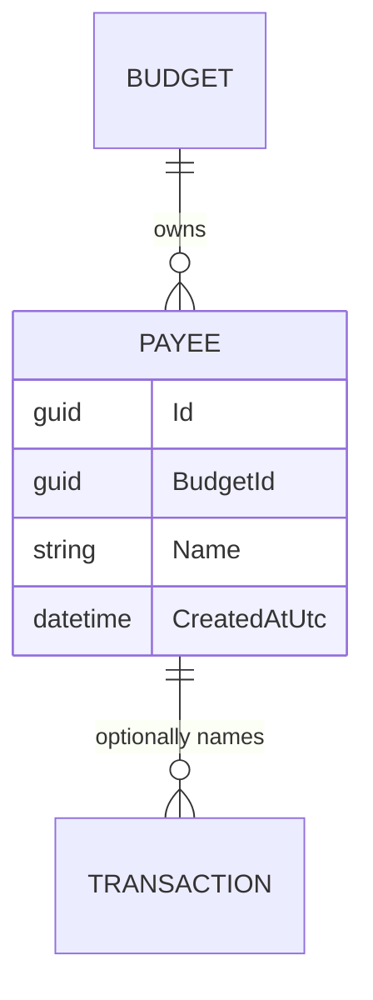
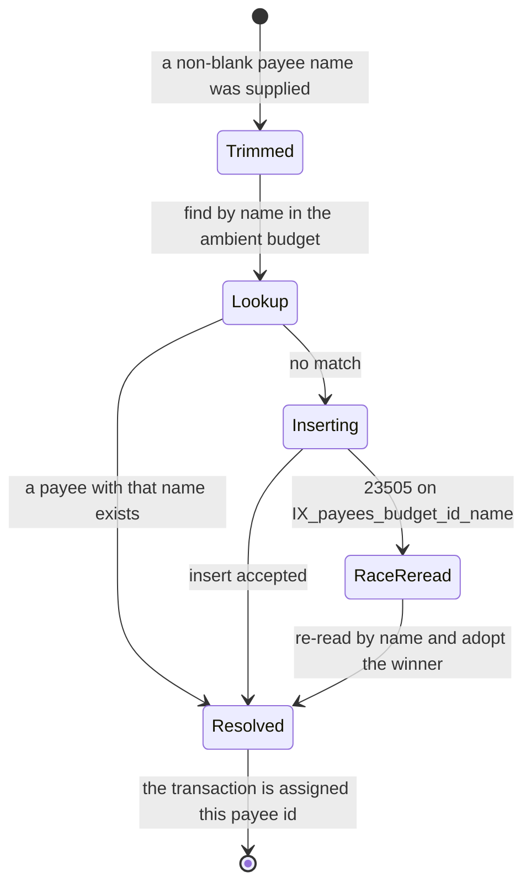

# Payees

## Table of Contents

- [Purpose](#purpose)
- [Key Entities](#key-entities)
- [Constraints](#constraints)
- [Business Rules & Invariants](#business-rules--invariants)
- [Workflows & State Transitions](#workflows--state-transitions)
- [Decision Trees](#decision-trees)
- [Integration Points](#integration-points)
- [Edge Cases & Known Gotchas](#edge-cases--known-gotchas)

## Purpose

A **Payee** is the counterparty on a transaction — the shop, employer or person the money went to or
came from. It exists so that the same counterparty named on twenty transactions is one thing rather
than twenty strings, which is what makes autocomplete work and what stops "Tesco" and "tesco"
becoming two counterparties.

A payee is never created deliberately. It comes into existence as a side effect of someone typing a
name into the payee field while recording or correcting a transaction, and that is the only way one
is ever created. Once it exists, its name can be corrected in place — the single write a payee
accepts in its own right — and everything else about it is fixed. Every payee belongs to exactly one
budget (see [budgets.md](budgets.md)) and is never shared with another.

This file is canonical for payee rules. [transactions.md](transactions.md) covers only the
transaction side of the interaction — that the payee input is a name rather than an id, and that a
transaction may name none — and cross-references here for everything else.

## Key Entities

- **Payee** — `Id`, `BudgetId` (the owning budget), `Name`, `CreatedAtUtc`. Created through
  `Payee.Create(budgetId, name, createdAtUtc)` and corrected through `Payee.Rename(name)`, which
  share one `ValidateOrThrow` so an entry and a correction are held to identical name rules:
  `Guid.Empty` is rejected for the budget, the name is trimmed, and a blank one or one over 200
  characters is rejected. `Name` is the only mutable property. `Payee` exposes no other factory and
  no other mutator: every property has a private setter and `Rename` is the only method that reaches
  one, so a payee that exists cannot be moved to another budget by any code path in the domain.



## Constraints

### MUST

- **A payee's name must be present, trimmed, and at most 200 characters.**
  - **Why**: The name is the entirety of a payee — there is no other field a person could tell two
    apart by — so a blank one identifies nothing and would sit in the autocomplete list as an empty
    row nobody can choose deliberately. Trimming is what makes `"Tesco"` and `"Tesco "` the same
    counterparty rather than two.
  - **Enforced in**: **split, and both halves are needed.** `PayeeConfiguration` maps `name` to a
    required `varchar(200)`, and `varchar(n)` *rejects* an over-long value with SQLSTATE `22001`
    rather than truncating it, so the bound holds for any write path — which is what makes it
    enforcement in the sense
    [ADR 0002](../decisions/0002-enforce-rules-at-the-lowest-capable-layer.md) means. Trimming and
    the blank check are the domain's, in the single `ValidateOrThrow` that `Payee.Create` and
    `Payee.Rename` both run: normalizing a value is not something a column can do without changing
    the caller's data, and `NOT NULL` does not reject `"   "`. Sharing one validator is what keeps
    the two write paths from drifting, so a correction cannot store a name an entry would have been
    refused. `PayeeRepository.GetOrCreateAsync` trims before it looks the name up, so the value it
    searches for and the value it would insert are the same string.

- **A payee's name is unique within its budget, compared case-insensitively.**
  - **Why**: One counterparty is one row, or the autocomplete list stops being a list of the people
    the budget deals with. The scope is the budget because a counterparty paid out of one pool of
    money is that pool's counterparty — the same name in another budget is an unrelated party, and
    scoping uniqueness wider would let one budget's history constrain another's naming.
  - **Enforced in**: **database-owned.** The unique index `IX_payees_budget_id_name` over
    `(budget_id, name)`, with `name` on the `case_insensitive` collation, is what makes the rule
    true; the scope and the mechanism are stated once, in [budgets.md](budgets.md#constraints). What
    is specific here is the *treatment*, and it differs by write path: for a find-or-create payee a
    name collision is the hit rather than a mistake, so `PayeeRepository.GetOrCreateAsync` re-reads
    instead of reporting an error, while on a rename the same collision is a mistake and
    `PayeeRepository.UpdateAsync` reports it (see Business Rules & Invariants below).
    `PayeeIntegrationTests.PayeesTable_HasTimestampWithTimeZoneAndCaseInsensitiveUniqueIndex` pins
    the collation and the unique index against a real PostgreSQL, and
    `PostTransaction_WithExistingPayeeDifferentCase_ReusesPayee` pins the behaviour.

- **A payee belongs to exactly one budget, and never moves.**
  - **Why**: This is the tenancy rule, not tidiness: a payee that changed `budget_id` would carry the
    transactions naming it into another pool's picture.
  - **Enforced in**: **database-owned**, and the cross-entity rule and its reasoning are in
    [budgets.md](budgets.md#constraints) — a required `budget_id`, the `BudgetIsolation` query
    filter, and the composite `(payee_id, budget_id)` reference from `transactions`. What is
    payee-specific is *which* bottom-layer mechanism answers, and it depends on whether the payee is
    referenced: the composite foreign key objects only while a transaction names it, and for an
    unreferenced payee the refusal comes from the application role's `UPDATE` grant on `payees`,
    which lists `name` and nothing else. That seam is described under
    [Edge Cases](#edge-cases--known-gotchas) below.

### MUST NOT

- **A payee that any transaction references MUST NOT be deleted.**
  - **Why**: Refusing forces an explicit decision about the historical rows instead of silently
    erasing the counterparty from transactions that already happened — the same protection
    [Accounts](accounts.md) and [Categories](categories.md) have.
  - **Enforced in**: **database-owned, and only there.** The composite `transactions → payees`
    foreign key is `Restrict`. It cannot be `ON DELETE SET NULL`, because the pair includes the
    `NOT NULL` `budget_id` column. No application code path deletes a payee at all —
    `IPayeeRepository` exposes `GetOrCreateAsync`, `GetByIdAsync` and `UpdateAsync`, none of which
    removes a row, and neither route `PayeeEndpoints` maps is a `DELETE` — so unlike accounts and
    categories there is no handler to precheck and no message to write. The absence goes one layer
    lower than the API: the application role holds no `DELETE` privilege on `payees` at all, so even
    a raw statement sent on the connection the application serves requests with fails with `42501`
    without reaching the foreign key. A delete feature would therefore need a grant added to
    `app-role-grants.sql` before it could work, which is the fail-closed behaviour
    [ADR 0004](../decisions/0004-connect-as-a-least-privilege-role.md) intends.
    `PayeeIntegrationTests.DeletingAReferencedPayee_IsRefusedByTheDatabase` sends the delete as raw
    SQL, because raw SQL is the only way to attempt it.

- **A payee MUST NOT be shared across budgets.**
  - **Why and Enforced in**: stated once, in [budgets.md](budgets.md#must-not).
    `PayeeIntegrationTests.Payees_AreIsolatedPerUser` pins it end to end: a payee created in one
    budget is absent from another budget's `GET /api/payees`.

## Business Rules & Invariants

- **Rule**: A payee is created only as a side effect of naming one when creating or editing a
  transaction. There is no create operation.
- **Why**: The payee field is filled in mid-entry, at the moment recording the movement has to stay
  fast enough to do at the till. Making the user create the counterparty first would put a second
  task in front of the one they came to do, and a counterparty nobody has transacted with is not a
  fact about the budget worth storing. Correcting a mistyped counterparty is the same act on the same
  field, so an edit reaches the same find-or-create rather than a managed list the user would have to
  visit first.
- **Enforced in**: **application-owned**, and it is a shape rather than a check — there is nothing
  for a lower layer to reject. `GetOrCreateAsync(name)` is the only method on `IPayeeRepository` that
  inserts, and `PayeeRepository` calls `Payee.Create` in exactly that one place: `GetByIdAsync`
  reads, and `UpdateAsync` saves a row that already exists. Neither route `PayeeEndpoints` maps
  creates anything — `GET /api/payees` serves the autocomplete list, and
  `PATCH /api/payees/{id:guid}` resolves an existing payee by id and can only rename it, so a
  counterparty nobody has transacted with cannot be brought into existence through either.
  `CreateTransactionHandler` and `UpdateTransactionHandler` are the only callers of
  `GetOrCreateAsync`, and each calls it only when the command carried a payee name.
- **Example**: a budget that has recorded no transactions returns an empty `items` array from
  `GET /api/payees`, and there is no request a client can send that would change that
  (`PayeeIntegrationTests.GetPayees_WhenEmpty_ReturnsEmptyItemsArray`). The `PATCH` route cannot
  mint the first row either: it needs an id that already resolves in the budget, and an unknown one
  answers 404 without writing anything.
- **Counterexample**: adding a `POST /api/payees` so the counterparty can be set up before it is
  used. It reads as a convenience and breaks the one guarantee the shape provides — that a payee row
  means someone actually transacted with that party. Since nothing deletes a payee, every
  speculatively created row is permanent: the autocomplete list fills with counterparties the budget
  has never dealt with, and the list is already known to only grow (see
  [Edge Cases](#edge-cases--known-gotchas) below). It also splits one field into two ways of
  answering it — typed free text on the transaction form, picked from a managed list elsewhere — so
  the same counterparty can be brought into existence twice with different spellings, which is the
  duplication find-or-create exists to prevent.
- **Source**: `[SOURCE: discussion — 2026-07-29]`

---

- **Rule**: The payee is matched find-or-create on the **trimmed name**, compared
  **case-insensitively**, within the **ambient budget**. A match is reused; only a miss inserts.
- **Why**: A shared payee row is what powers autocomplete and consistent naming across transactions,
  and case is not part of who the counterparty is — someone who types "tesco" today and "Tesco"
  tomorrow dealt with one shop both times.
- **Enforced in**: **application-owned for the matching, database-owned for the rule it must not
  contradict.** `PayeeRepository.GetOrCreateAsync` trims, looks the name up through the
  `BudgetIsolation`-filtered `Payees` set, and inserts with `IBudgetContext.BudgetId` only when there
  is no match. The lookup uses plain `==` **on purpose**: the `name` column's `case_insensitive`
  collation makes PostgreSQL fold case for the comparison and for `IX_payees_budget_id_name` alike,
  so the lookup and the constraint cannot disagree about what counts as the same name, and the
  comparison stays a plain equality the index can answer. This is a bottom-layer rule *simplifying*
  the layer above rather than only guarding it: the schema does not merely refuse a bad row here, it
  removes the need for the application to define "the same name" at all.
- **Example**: `"  Starbucks  "` typed on the first transaction stores `Starbucks`; `"starbucks"` on
  the next transaction reuses that same row and the response echoes `Starbucks`, not what was typed
  (`PayeeIntegrationTests.PostTransaction_WithNewPayee_CreatesPayeeAndReturnsPayeeFields` and
  `PostTransaction_WithExistingPayeeDifferentCase_ReusesPayee`).
- **Counterexample**: matching with `payee.Name.ToLower() == name.ToLower()`. It looks more explicit
  and is strictly worse on both counts. It translates to `lower(name) = lower(@p)`, which the plain
  index over `(budget_id, name)` cannot answer, so the lookup falls back to a scan. And simple case
  mapping is a *second* definition of sameness sitting next to the collation's: wherever the two
  disagree the lookup misses a row the index then refuses to duplicate, so `GetOrCreateAsync` catches
  the `23505`, re-reads with the same mismatched predicate, finds nothing again, and throws — every
  transaction naming that payee fails, on a row the code cannot see.
- **Source**: `[SOURCE: discussion — 2026-07-29]`

---

- **Rule**: A blank or whitespace-only payee name on a transaction means **no payee**, not a
  validation error.
- **Why**: The payee field is optional, and an empty one is how a person says the counterparty does
  not matter or is not known — a cash withdrawal, a bank adjustment, a transaction typed in a hurry.
  Treating that as an error would block recording the movement over a field that was never required,
  and treating it as a payee named `""` would put an unchoosable row in the autocomplete list.
- **Enforced in**: **application-owned**, in `CreateTransactionHandler` and
  `UpdateTransactionHandler` alike, which call `IPayeeRepository.GetOrCreateAsync` only when the
  supplied name is neither null nor whitespace. Creation otherwise leaves `Transaction.PayeeId`
  null; an edit that mentions the field otherwise calls `Transaction.ClearPayee`, and one that does
  not mention it leaves the existing payee attached. Nothing lower can hold this: the two outcomes —
  no payee, and a rejected blank name — are indistinguishable to a column, and `Payee.Create`, which
  is the layer that *does* reject a blank name, is never reached.
- **Example**: a transaction submitted with `payeeName` of `"   "` is created with a null `payeeId`
  and returns `payeeName: null`; no `payees` row is written. The same `"   "` sent as an edit detaches
  whatever payee the transaction named, and writes no `payees` row either.
- **Counterexample**: passing the blank string through to `GetOrCreateAsync`. `Payee.Create` throws a
  `ValidationException` on the empty name, so the transaction comes back a 400 naming a field the
  person deliberately left empty.
- **Source**: `[SOURCE: discussion — 2026-07-29]`

---

- **Rule**: Two concurrent transactions naming the same new payee produce exactly **one** payee row,
  and both transactions reference it. No error reaches either caller.
- **Why**: Find-or-create is check-then-act, so two requests can both miss the lookup and both try to
  insert. Reporting that to a person would be reporting a race they had no part in, over a payee that
  now exists and is the one they meant.
- **Enforced in**: **database-owned for the guarantee, application-owned for the recovery.** The
  unique index refuses the second insert with `23505`, which is the only thing that makes "exactly
  one" true regardless of timing. `PayeeRepository.GetOrCreateAsync` then catches that violation
  **matched by constraint name** — `PayeeConfiguration.NameIndexName`, pinned as a constant to the
  name EF's convention already produces — detaches the rejected entity and re-reads, adopting the
  winner's row. The name match is load-bearing: `SaveChangesAsync` flushes every tracked row, so a
  `23505` raised by a different rule would otherwise take this recovery path, and the re-read would
  find nothing and throw `InvalidOperationException` with the real constraint already discarded.
  A violation of any other rule propagates instead. This is
  [ADR 0002](../decisions/0002-enforce-rules-at-the-lowest-capable-layer.md)'s "a violation report
  names one rule, not every rule that was violated" applied to the one place payees can lose a race.
- **Example**: six transactions posted at once, all naming "Starbucks" for the first time, return the
  same `payeeId` and leave one row in `payees`
  (`PayeeIntegrationTests.ConcurrentTransactions_WithSameNewPayeeName_CreateOnePayee`).
- **Counterexample**: catching `23505` on the SQLSTATE alone. A unique violation from another table
  in the same save would be reported as a payee collision, the re-read would find no matching payee,
  and the caller would get a 500 blaming payees for a rule that has nothing to do with them.
- **Source**: `[SOURCE: discussion — 2026-07-29]`

---

- **Rule**: A payee is renamed **in place** through `PATCH /api/payees/{id:guid}` with a **required**
  `name`, keeping its `Id`, and the rename **rewrites history**: every transaction that already named
  that payee shows the new spelling. Success is 204 No Content. `BudgetId` is not accepted and does
  not change.
- **Why**: The name is the entirety of a payee, so it is the only thing about one a person can be
  wrong about — and it is typed mid-entry, in the field the whole find-or-create design exists to
  keep fast, which is exactly where a misspelling comes from. Retroactivity is the point of the
  operation rather than a side effect of how a transaction is read: the row stands for one
  real-world party, so correcting its spelling corrects every transaction that ever dealt with it,
  and a rename that applied only to future entries would leave the ledger showing two counterparties
  where there is one. That is the **opposite** stance from the one taken on deletion, where the
  schema refuses to let history change at all, and the two reconcile on one distinction: **a name is
  a mutable label on a stable identity, while a transaction is the record of an event.** Relabelling
  the party does not alter what happened; removing the party from a movement that happened does. The
  name is **required** rather than one of the three-state optional fields of the transaction edit
  (see [transactions.md](transactions.md#business-rules--invariants)), because a payee has exactly
  one mutable field: a body that omits it is asking for nothing, which is a malformed request rather
  than a no-op the caller could have meant, and there is no second field whose silence would need a
  meaning.
- **Enforced in**: **application-owned for the operation, and the retroactivity is a property of the
  read model that costs no code at all.** `PayeeEndpoints` maps `PATCH /api/payees/{id:guid}` over a
  `RenamePayeeRequest` whose `Name` is a plain `string`, and returns `TypedResults.NoContent()`.
  `RenamePayeeHandler` resolves the id through `IPayeeRepository.GetByIdAsync`, calls `Payee.Rename`
  — which runs the same `ValidateOrThrow` as `Payee.Create` — and saves through
  `IPayeeRepository.UpdateAsync`. Nothing propagates the new name anywhere, because nothing holds a
  copy of it: `TransactionReadService` joins `payees` and projects `payee.Name` on every read, so the
  next read of a transaction is already correct. A body that omits `name`, or sends it as null, is a
  400 through the very rule that rejects `"   "` — `ValidateOrThrow` takes a `string?` and folds null
  into blank — so there is no separate branch for the case, and `ValidationExceptionHandler` renders
  it. Nothing lower can own any of this: a column cannot express that it *may* be rewritten.
- **Example**: a payee minted as "Starbux" by a transaction typed in a hurry is renamed with
  `{"name": "Starbucks"}`; the budget still holds one payee row with the same `id`, and both
  transactions that already named it read `payeeName: "Starbucks"`
  (`PayeeIntegrationTests.PatchPayee_WithANewName_ReturnsNoContentAndRenamesTheRowInPlace` and
  `PatchPayee_RenamesThePayeeOnEveryTransactionThatAlreadyNamedIt`). A blank, over-long, absent or
  null name is a 400 and the stored name survives
  (`PatchPayee_WithBlankOverlongOrMissingName_ReturnsBadRequest`).
- **Counterexample**: snapshotting the payee's name onto each transaction when it is recorded. The
  rename then has to fan out a write across every transaction that ever named the payee, or it is
  merely cosmetic — the autocomplete list shows the corrected spelling while the ledger keeps the
  typo, and the same counterparty reads two ways depending on which screen is open.
- **Source**: `[SOURCE: discussion — 2026-07-29]`

---

- **Rule**: A rename that changes only the **case of a payee's own name** succeeds. `"starbucks"` →
  `"Starbucks"` is a 204, even though the unique index treats those two strings as the same name.
- **Why**: This is the most common real use of the feature, not an edge case. A payee is minted with
  whatever casing was typed into the payee field mid-entry, and a hurried entry is where lower-case
  spellings come from — so "capitalize the counterparty properly" is the ordinary correction. It is
  legitimate because a row cannot collide with itself: the update replaces that row's own index
  entry in the same statement, so the row is never compared against its former self.
- **Enforced in**: **database-owned, and deliberately with no application-level duplicate check at
  all.** `IX_payees_budget_id_name` over `(budget_id, name)`, on the `case_insensitive` collation, is
  what *rejects* a genuine duplicate, which is what makes it enforcement under
  [ADR 0002](../decisions/0002-enforce-rules-at-the-lowest-capable-layer.md);
  `PayeeRepository.UpdateAsync` catches that `23505` **matched by constraint name**
  (`PayeeConfiguration.NameIndexName`), detaches the rejected entity so its failed state cannot leak
  into a later save, and raises the validation error the 400 is rendered from. Leaving the constraint
  to answer is not only the lowest layer here, it is the only one that gets the case-only rename
  right for free. `Payee.Rename` carries the reasoning as a comment beside the method for the same
  reason.
- **Example**: a payee created as "starbucks" by the transaction that first named it is renamed to
  "Starbucks"; the budget still has exactly one payee row
  (`PayeeIntegrationTests.PatchPayee_WithACaseOnlyChangeOfItsOwnName_ReturnsNoContent`).
- **Counterexample**: prechecking with "does a payee with this name already exist?" and refusing when
  one is found. The answer is yes for the row being renamed, so every case-only correction is
  rejected as a duplicate of itself — the feature breaks on precisely its commonest use. The precheck
  is check-then-act besides, so the index still has to catch the loser of a race and the catch it was
  written to replace cannot be removed.
- **Source**: `[SOURCE: discussion — 2026-07-29]`

---

- **Rule**: Renaming a payee onto a name **another** payee in the same budget already holds is
  refused with **400**, not 409, and both rows survive unchanged. Case does not separate them:
  "Starbucks" and "STARBUCKS" are one collision.
- **Why**: A taken name is a statement about a field of the request — which field, and what is wrong
  with it — and that is exactly what a validation problem document carries and what a bare conflict
  status has nowhere to put. It is also how the same class of mistake is already answered elsewhere
  in this system: `AccountRepository` translates the identical unique violation into the identical
  shape of validation error for a duplicate account name, and a client should not have to learn a
  second status code for the same kind of refusal.
- **Enforced in**: **database-owned, application-translated for the sentence.** The unique index
  refuses the update; `PayeeRepository.UpdateAsync` turns that `23505` into a
  `Domain.Common.ValidationException` naming `Name` ("Payee name must be unique."), which
  `ValidationExceptionHandler` renders as a 400 `ValidationProblemDetails`. That is deliberately the
  **opposite** recovery from `GetOrCreateAsync`'s on the very same index: a find-or-create only
  wanted *a* payee by that name, so the winner of the race is an acceptable answer and gets re-read,
  while a rename asked for one specific name and has nothing to fall back to. Both catches match on
  the constraint name, so a `23505` raised by any other rule in the same save propagates instead of
  being reported as a payee collision.
- **Example**: a budget holding "Starbucks" and "Costco" — renaming "Costco" to either "Starbucks" or
  "STARBUCKS" answers 400 and leaves both rows exactly as they were
  (`PayeeIntegrationTests.PatchPayee_WithANameHeldByAnotherPayeeInTheSameBudget_ReturnsBadRequest`).
  Another budget's "Starbucks" is not a collision at all, because uniqueness is scoped to the budget:
  the rename succeeds and both budgets end up with a payee of that name, two distinct rows
  (`PatchPayee_WithANameAnotherBudgetUses_ReturnsNoContentAndLeavesThatBudgetAlone`).
- **Counterexample**: reporting the duplicate as a 409. The status says two things disagree but not
  which field, so the client either parses the message text or highlights nothing, and a caller ends
  up handling two statuses for one kind of mistake depending on which entity they were editing.
- **Source**: `[SOURCE: discussion — 2026-07-29]`

---

- **Rule**: Renaming a payee that belongs to another budget answers **404**, byte for byte the answer
  an id matching no row anywhere gets. There is no 403.
- **Why**: This is the standing tenancy rule rather than a rule about renaming — a row outside the
  ambient budget is invisible rather than forbidden, and the reasoning for answering 404 instead of
  403 is stated once, in [budgets.md](budgets.md#must-not).
- **Enforced in**: **application-owned, through the same mechanism as every other by-id write in this
  API.** `Payee` is one of the `BudgetIsolation`-filtered entities, and
  `PayeeRepository.GetByIdAsync` queries that filtered `DbSet` rather than `Find`, because `Find` can
  answer from the change tracker without ever reaching the filter. A stranger's payee therefore reads
  as null and `RenamePayeeHandler` throws `NotFoundException`, which `NotFoundExceptionHandler`
  renders as a 404 `ProblemDetails` — there is no tenancy branch anywhere for a refactor to drop. The
  composite `(payee_id, budget_id)` reference from `transactions` is untouched by a rename, since
  `BudgetId` never changes.
- **Example**: one budget's payee patched by another budget's owner answers 404 and the row keeps its
  name, while the owner's identical request on the very same id answers 204
  (`PayeeIntegrationTests.PatchPayee_FromAnotherBudget_ReturnsNotFoundButSucceedsForItsOwner`). An id
  belonging to no budget at all answers the same 404
  (`PatchPayee_WithAnUnknownId_ReturnsNotFoundButSucceedsForARealPayee`).
- **Source**: `[SOURCE: discussion — 2026-07-29]`

## Workflows & State Transitions

A Payee has no lifecycle states: it is created, read, and renamed. There is no merge, no archive and
no delete, so there is nothing to transition between. A rename is not a transition either — it changes
what the row says, not what state it is in, and no rule anywhere reads the previous name or restricts
which name may follow it. A transaction that is edited to name a different counterparty does not touch
either payee row — it repoints its own `PayeeId`, which is a change to the transaction and not to the
payee. Two paths branch: find-or-create, which runs inside transaction creation and transaction
editing alike (`PayeeRepository.GetOrCreateAsync`), and the rename (`RenamePayeeHandler`).

Resolving a payee while a transaction is written (`PayeeRepository.GetOrCreateAsync`):



| Transition | Triggered by | Validations |
|---|---|---|
| — → Trimmed | `CreateTransactionHandler` or `UpdateTransactionHandler` saw a payee name that is not null or whitespace | A blank name skips this workflow entirely: creation leaves the transaction with no payee, and an edit that mentioned the field clears the one it had |
| Trimmed → Lookup | Always | Plain `==` against the `case_insensitive` column, scoped by the `BudgetIsolation` filter |
| Lookup → Resolved | A payee with that name already exists in the budget | — |
| Lookup → Inserting | No payee with that name in the budget | `Payee.Create` validates the budget id, the trimmed name's presence and its 200-character bound |
| Inserting → Resolved | The unique index accepted the row | — |
| Inserting → RaceReread → Resolved | A concurrent request inserted the same name first | Only a `23505` naming `IX_payees_budget_id_name` takes this path; the re-read throws if the row is still absent |

The rename (`RenamePayeeHandler`) is the whole of the payee's own write surface, and it has three
outcomes:

| Outcome | Triggered by | Validations |
|---|---|---|
| Renamed (204) | `PATCH /api/payees/{id:guid}` resolved the id through the `BudgetIsolation`-filtered set, and the unique index accepted the new name | `Payee.Rename` runs the same `ValidateOrThrow` as creation: the trimmed name's presence and its 200-character bound |
| Unchanged (400) | The name failed validation, or the unique index refused it | A `23505` naming `IX_payees_budget_id_name` becomes "Payee name must be unique." and the row keeps the name it had; a case-only change of the row's **own** name is not a collision and lands on the row above |
| Unchanged (404) | The id resolved to nothing in the ambient budget | None run — the payee is never loaded, and nothing is written, whether the id belongs to another budget or to no row at all |

## Decision Trees

Resolving the payee while creating or editing a transaction (`CreateTransactionHandler` or
`UpdateTransactionHandler` → `PayeeRepository.GetOrCreateAsync`):

```
IF no payeeName was supplied, or it is blank or whitespace-only
  THEN leave the transaction with no payee               ← not an error; the field is optional
                                                           an edit that mentioned it blank clears
                                                           the payee the transaction had
ELSE
  trim the name
  IF a payee with that name exists in the ambient budget ← case-insensitive, by the column's collation
    THEN reuse it
  ELSE
    build Payee.Create(ambient budget, trimmed name) and try to insert it
    IF the insert succeeded
      THEN use the new payee
    ELSE IF it lost to IX_payees_budget_id_name          ← a concurrent request inserted this name
      re-read by name and adopt the winner
      IF it is still absent
        THEN InvalidOperationException                   ← a unique violation with nothing behind it
    ELSE                                                 ← a rule this path does not model
      THEN let the 23505 propagate unhandled
  THEN assign the payee id to the transaction
```

The payee step is independent of the category step; see
[transactions.md](transactions.md#decision-trees) for the whole creation and edit paths.

Renaming a payee (`RenamePayeeHandler`):

```
IF the payee id does not resolve in the ambient budget
  THEN 404 "Payee was not found."                        ← also the cross-budget answer
ELSE
  Payee.Rename trims and validates the name's presence   ← an absent or null name arrives as blank
    and its 200-character bound                            and is refused by that same rule
  try to write the new name
  IF another payee in the budget already holds it        ← case-insensitively, by the index;
    THEN 400 "Payee name must be unique."                  the row's own name is not a collision,
                                                           so a case-only change succeeds here
  ELSE
    THEN 204 No Content                                  ← every transaction naming this payee
                                                           reads the new spelling on the next read
```

No lookup precedes the write: the collision is discovered by `IX_payees_budget_id_name` refusing the
update, which is the only reading of "already held" that a case-only rename of a row's own name does
not trip over.

## Integration Points

- **[Transactions](transactions.md)**: the only writer that brings a payee into existence, through
  two handlers. `CreateTransactionHandler` and `UpdateTransactionHandler` both resolve the payee through
  `GetOrCreateAsync` and call `Transaction.AssignPayee`, and the edit path additionally reaches
  `Transaction.ClearPayee` when the field is mentioned blank. `TransactionDto` carries `payeeId` and
  `payeeName` so a transaction list renders the counterparty without a second request, and the name
  is joined at read time (`TransactionReadService`) rather than snapshotted — which is what makes a
  rename reach every transaction that named the payee without a single transaction row being written.
- **[Budgets](budgets.md)**: every payee is stamped with and filtered by `BudgetId`, its name is
  unique within that budget, and its reference from a transaction is a composite `(payee_id,
  budget_id)` foreign key so PostgreSQL — not only the query filter — refuses a cross-budget
  reference. A payee is also one of the four owned tables that cascade when a budget with no
  transactions is deleted.
- **Angular client**: the payee field on the transaction form is a free-text input with a Material
  autocomplete over `GET /api/payees`, filtered in the browser
  (`TransactionsComponent.filteredPayees`). The client sends `payeeName` only when the trimmed input
  is non-empty, which matches — but does not enforce — the blank-means-no-payee rule above.

## Edge Cases & Known Gotchas

- **The payee list only ever grows: a rename fixes a misspelling, it does not fix a duplicate.**
  Nothing removes a payee, so every row that has ever existed is still in the autocomplete list, and
  "Tesco Metro" and "Tesco Express" stay two counterparties forever. A typo is not permanent — that
  is what `PATCH /api/payees/{id:guid}` is for — but fixing it on the **transaction** still grows the
  list rather than shrinking it: an edit that replaces "Tescoo" with "Tesco" in the payee field runs
  the same find-or-create, so it mints the correct payee and leaves the misspelt one exactly where it
  was, gaining a row from the mistake and a row from the fix. Renaming the misspelt row is the fix
  that works, and only while the correct spelling is free: renaming "Tescoo" onto an existing "Tesco"
  is refused by `IX_payees_budget_id_name` as a 400, so both rows remain and the list is no shorter.
  The operation that would actually shorten it is a **merge** — repointing every transaction from one
  payee to another and removing the emptied row — and there is none. The list therefore grows faster
  than the number of counterparties a person has ever dealt with. That it only grows is the
  shape of the domain rather than a deliberate rule: do not cite it as a guarantee, and do not build
  behaviour that depends on a payee never disappearing.

- **A payee can outlive every transaction that named it, permanently.** Two paths lead there, and
  both are changes to the transaction side: removing the only transaction that named a payee strands
  it, and so does editing that transaction to name a different counterparty or none. The payee row
  stays exactly where it was either way (see
  [transactions.md](transactions.md#edge-cases--known-gotchas)). Writing a payee is not a third path
  — `CreateTransactionHandler` and `UpdateTransactionHandler` each write the payee and the
  transaction that needed it inside a single database transaction, so a request that fails between
  the two writes commits neither. Because no code path deletes a payee, a stranded row cannot be
  cleaned up through the application. It is harmless — an extra autocomplete entry — but it means
  **the existence of a payee is not evidence that any transaction ever named it**, and any future
  count, report or merge over payees has to allow for orphans.

- **`GET /api/payees` orders by name with no tiebreak, and that is deterministic *because* of the
  unique index.** `PayeeReadService.GetAllAsync` sorts on `Name` alone. That is stable only because
  `IX_payees_budget_id_name` guarantees no two payees in a budget share a name — the ordering
  borrows its determinism from the constraint. Weakening or scoping that index differently would
  silently make list order arbitrary between equal names.

- **A null payee on a transaction skips the foreign-key check entirely.** `transactions.payee_id` is
  nullable, and a multi-column foreign key is not checked at all when any of its columns is NULL
  (`MATCH SIMPLE`, which is PostgreSQL's default and what `TransactionConfiguration` relies on). So
  "no payee" is not validated against the budget — there is nothing to validate — rather than being
  checked and passing. The composite key protects transactions that *name* a payee; it says nothing
  about the ones that do not.

- **What refuses a payee's move between budgets depends on whether a transaction names it, and for
  most of a payee's life it is not the foreign key.** The composite `(payee_id, budget_id)` reference
  objects only while a child row exists, and a payee no transaction names has none — which is not an
  exotic state, since every payee is unreferenced between being created and being used. For that
  window the refusal comes from the application role's grants: `UPDATE` on `payees` is granted for
  `name` alone, so a statement writing `budget_id` fails with `42501` before the row is touched. The
  enforcement is the column's **omission from the grant's list**, not a `REVOKE` — PostgreSQL column
  privileges are additive, so revoking a column out of a table-wide `UPDATE` grant subtracts nothing
  and the rule has to be written as a list that never mentions the column
  ([ADR 0004](../decisions/0004-connect-as-a-least-privilege-role.md)). The domain cannot produce the
  `UPDATE` either — `Payee` has no way to reach `BudgetId` — so all three layers hold, and
  `TenancySchemaTests.Database_RefusesToMoveAnUnreferencedPayeeToAnotherBudget` sends the statement
  as raw SQL on the role's own connection, pairing the refusal with a rename that must succeed. The
  connection is the part to remember: PostgreSQL skips every privilege check for a superuser, so the
  same test on an admin connection would pass with no grants in place at all. The empty-account and
  empty-category-group cases in the same class rest on exactly the same mechanism.

- **The `case_insensitive` collation folds case but not accents.** It is ICU `und-u-ks-level2`, so
  `Café` and `Cafe` are two distinct payees and both can exist in one budget. That is a
  reasonable answer — they are different strings a person typed differently — but it is not what
  "case-insensitive" implies to everyone, and it is the same collation and the same behaviour
  described for `users.email` in
  [users-and-ownership.md](users-and-ownership.md#edge-cases--known-gotchas).

- **The collation is nondeterministic, so `LIKE` does not work against `payees.name`.** A pattern
  match on the column fails at runtime with SQLSTATE `0A000`. Nothing queries it that way today —
  `GET /api/payees` returns the whole list and the client filters in memory — but the first
  server-side payee search or prefix autocomplete needs an explicit `COLLATE` on the expression, and
  the failure will arrive at runtime rather than at compile time.
