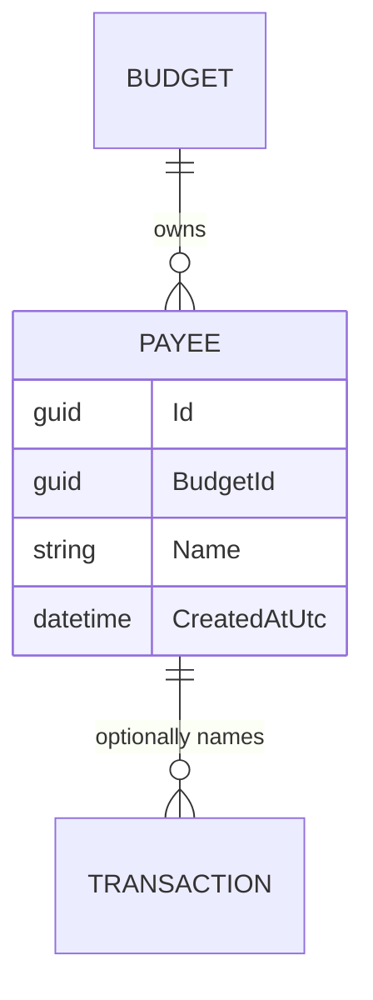
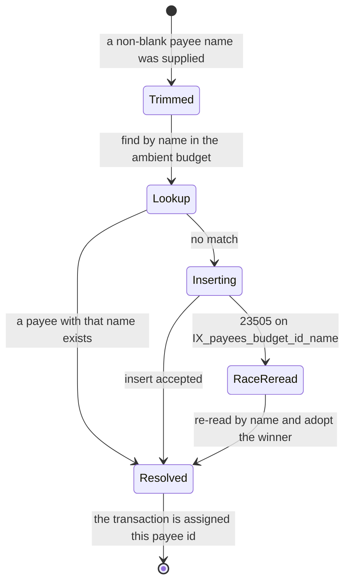

# Payees

## Table of Contents

- [Purpose](#purpose)
- [Key Entities](#key-entities)
- [Constraints](#constraints)
- [Business Rules & Invariants](#business-rules--invariants)
- [Workflows & State Transitions](#workflows--state-transitions)
- [Decision Trees](#decision-trees)
- [Integration Points](#integration-points)
- [Edge Cases & Known Gotchas](#edge-cases--known-gotchas)

## Purpose

A **Payee** is the counterparty on a transaction — the shop, employer or person the money went to or
came from. It exists so that the same counterparty named on twenty transactions is one thing rather
than twenty strings, which is what makes autocomplete work and what stops "Tesco" and "tesco"
becoming two counterparties.

A payee is never created deliberately. It comes into existence as a side effect of someone typing a
name into the payee field while recording a transaction, and that is the only way one is ever
written. Every payee belongs to exactly one budget (see [budgets.md](budgets.md)) and is never shared
with another.

This file is canonical for payee rules. [transactions.md](transactions.md) covers only the
transaction side of the interaction — that the payee input is a name rather than an id, and that a
transaction may name none — and cross-references here for everything else.

## Key Entities

- **Payee** — `Id`, `BudgetId` (the owning budget), `Name`, `CreatedAtUtc`. Created through
  `Payee.Create(budgetId, name, createdAtUtc)`, which rejects `Guid.Empty` for the budget, trims the
  name, and rejects a blank one or one over 200 characters. `Payee` exposes no other factory and no
  mutator: every property has a private setter and no method reaches one, so a payee that exists can
  neither be renamed nor moved to another budget by any code path in the domain.



## Constraints

### MUST

- **A payee's name must be present, trimmed, and at most 200 characters.**
  - **Why**: The name is the entirety of a payee — there is no other field a person could tell two
    apart by — so a blank one identifies nothing and would sit in the autocomplete list as an empty
    row nobody can choose deliberately. Trimming is what makes `"Tesco"` and `"Tesco "` the same
    counterparty rather than two.
  - **Enforced in**: **split, and both halves are needed.** `PayeeConfiguration` maps `name` to a
    required `varchar(200)`, and `varchar(n)` *rejects* an over-long value with SQLSTATE `22001`
    rather than truncating it, so the bound holds for any write path — which is what makes it
    enforcement in the sense
    [ADR 0002](../decisions/0002-enforce-rules-at-the-lowest-capable-layer.md) means. Trimming and
    the blank check are `Payee.Create`'s: normalizing a value is not something a column can do
    without changing the caller's data, and `NOT NULL` does not reject `"   "`.
    `PayeeRepository.GetOrCreateAsync` trims before it looks the name up, so the value it searches
    for and the value it would insert are the same string.

- **A payee's name is unique within its budget, compared case-insensitively.**
  - **Why**: One counterparty is one row, or the autocomplete list stops being a list of the people
    the budget deals with. The scope is the budget because a counterparty paid out of one pool of
    money is that pool's counterparty — the same name in another budget is an unrelated party, and
    scoping uniqueness wider would let one budget's history constrain another's naming.
  - **Enforced in**: **database-owned.** The unique index `IX_payees_budget_id_name` over
    `(budget_id, name)`, with `name` on the `case_insensitive` collation, is what makes the rule
    true; the scope and the mechanism are stated once, in [budgets.md](budgets.md#constraints). What
    is specific here is the *treatment*: for a find-or-create payee a name collision is the hit
    rather than a mistake, so `PayeeRepository.GetOrCreateAsync` re-reads instead of reporting an
    error (see Business Rules & Invariants below).
    `PayeeIntegrationTests.PayeesTable_HasTimestampWithTimeZoneAndCaseInsensitiveUniqueIndex` pins
    the collation and the unique index against a real PostgreSQL, and
    `PostTransaction_WithExistingPayeeDifferentCase_ReusesPayee` pins the behaviour.

- **A payee belongs to exactly one budget, and never moves.**
  - **Why**: This is the tenancy rule, not tidiness: a payee that changed `budget_id` would carry the
    transactions naming it into another pool's picture.
  - **Enforced in**: the cross-entity rule and its reasoning are in
    [budgets.md](budgets.md#constraints) — a required `budget_id`, the `BudgetIsolation` query
    filter, and the composite `(payee_id, budget_id)` reference from `transactions`. The honest
    limit of the bottom layer is payee-specific and recorded under
    [Edge Cases](#edge-cases--known-gotchas) below: the composite foreign key only objects while a
    transaction references the payee.

### MUST NOT

- **A payee that any transaction references MUST NOT be deleted.**
  - **Why**: Refusing forces an explicit decision about the historical rows instead of silently
    erasing the counterparty from transactions that already happened — the same protection
    [Accounts](accounts.md) and [Categories](categories.md) have.
  - **Enforced in**: **database-owned, and only there.** The composite `transactions → payees`
    foreign key is `Restrict`. It cannot be `ON DELETE SET NULL`, because the pair includes the
    `NOT NULL` `budget_id` column. No application code path deletes a payee at all —
    `IPayeeRepository` exposes only `GetOrCreateAsync` and `PayeeEndpoints` maps only a `GET` — so
    unlike accounts and categories there is no handler to precheck and no message to write.
    `PayeeIntegrationTests.DeletingAReferencedPayee_IsRefusedByTheDatabase` sends the delete as raw
    SQL, because raw SQL is the only way to attempt it.

- **A payee MUST NOT be shared across budgets.**
  - **Why and Enforced in**: stated once, in [budgets.md](budgets.md#must-not).
    `PayeeIntegrationTests.Payees_AreIsolatedPerUser` pins it end to end: a payee created in one
    budget is absent from another budget's `GET /api/payees`.

## Business Rules & Invariants

- **Rule**: A payee is created only as a side effect of naming one on a transaction. There is no
  create operation.
- **Why**: The payee field is filled in mid-entry, at the moment recording the movement has to stay
  fast enough to do at the till. Making the user create the counterparty first would put a second
  task in front of the one they came to do, and a counterparty nobody has transacted with is not a
  fact about the budget worth storing.
- **Enforced in**: **application-owned**, and it is a shape rather than a check — there is nothing
  for a lower layer to reject. `IPayeeRepository` exposes exactly one method,
  `GetOrCreateAsync(name)`; `PayeeEndpoints` maps exactly one route, `GET /api/payees`, for the
  autocomplete list; and `CreateTransactionHandler` calls the repository only when the command
  carried a payee name.
- **Example**: a budget that has recorded no transactions returns an empty `items` array from
  `GET /api/payees`, and there is no request a client can send that would change that
  (`PayeeIntegrationTests.GetPayees_WhenEmpty_ReturnsEmptyItemsArray`).
- **Source**: `[SOURCE: discussion — 2026-07-29]`

---

- **Rule**: The payee is matched find-or-create on the **trimmed name**, compared
  **case-insensitively**, within the **ambient budget**. A match is reused; only a miss inserts.
- **Why**: A shared payee row is what powers autocomplete and consistent naming across transactions,
  and case is not part of who the counterparty is — someone who types "tesco" today and "Tesco"
  tomorrow dealt with one shop both times.
- **Enforced in**: **application-owned for the matching, database-owned for the rule it must not
  contradict.** `PayeeRepository.GetOrCreateAsync` trims, looks the name up through the
  `BudgetIsolation`-filtered `Payees` set, and inserts with `IBudgetContext.BudgetId` only when there
  is no match. The lookup uses plain `==` **on purpose**: the `name` column's `case_insensitive`
  collation makes PostgreSQL fold case for the comparison and for `IX_payees_budget_id_name` alike,
  so the lookup and the constraint cannot disagree about what counts as the same name, and the
  comparison stays a plain equality the index can answer. This is a bottom-layer rule *simplifying*
  the layer above rather than only guarding it: the schema does not merely refuse a bad row here, it
  removes the need for the application to define "the same name" at all.
- **Example**: `"  Starbucks  "` typed on the first transaction stores `Starbucks`; `"starbucks"` on
  the next transaction reuses that same row and the response echoes `Starbucks`, not what was typed
  (`PayeeIntegrationTests.PostTransaction_WithNewPayee_CreatesPayeeAndReturnsPayeeFields` and
  `PostTransaction_WithExistingPayeeDifferentCase_ReusesPayee`).
- **Counterexample**: matching with `payee.Name.ToLower() == name.ToLower()`. It looks more explicit
  and is strictly worse on both counts. It translates to `lower(name) = lower(@p)`, which the plain
  index over `(budget_id, name)` cannot answer, so the lookup falls back to a scan. And simple case
  mapping is a *second* definition of sameness sitting next to the collation's: wherever the two
  disagree the lookup misses a row the index then refuses to duplicate, so `GetOrCreateAsync` catches
  the `23505`, re-reads with the same mismatched predicate, finds nothing again, and throws — every
  transaction naming that payee fails, on a row the code cannot see.
- **Source**: `[SOURCE: discussion — 2026-07-29]`

---

- **Rule**: A blank or whitespace-only payee name on a transaction means **no payee**, not a
  validation error.
- **Why**: The payee field is optional, and an empty one is how a person says the counterparty does
  not matter or is not known — a cash withdrawal, a bank adjustment, a transaction typed in a hurry.
  Treating that as an error would block recording the movement over a field that was never required,
  and treating it as a payee named `""` would put an unchoosable row in the autocomplete list.
- **Enforced in**: **application-owned**, in `CreateTransactionHandler`, which calls
  `IPayeeRepository.GetOrCreateAsync` only when `command.PayeeName` is neither null nor whitespace,
  and otherwise leaves `Transaction.PayeeId` null. Nothing lower can hold this: the two outcomes —
  no payee, and a rejected blank name — are indistinguishable to a column, and `Payee.Create`, which
  is the layer that *does* reject a blank name, is never reached.
- **Example**: a transaction submitted with `payeeName` of `"   "` is created with a null `payeeId`
  and returns `payeeName: null`; no `payees` row is written.
- **Counterexample**: passing the blank string through to `GetOrCreateAsync`. `Payee.Create` throws a
  `ValidationException` on the empty name, so the transaction comes back a 400 naming a field the
  person deliberately left empty.
- **Source**: `[SOURCE: discussion — 2026-07-29]`

---

- **Rule**: Two concurrent transactions naming the same new payee produce exactly **one** payee row,
  and both transactions reference it. No error reaches either caller.
- **Why**: Find-or-create is check-then-act, so two requests can both miss the lookup and both try to
  insert. Reporting that to a person would be reporting a race they had no part in, over a payee that
  now exists and is the one they meant.
- **Enforced in**: **database-owned for the guarantee, application-owned for the recovery.** The
  unique index refuses the second insert with `23505`, which is the only thing that makes "exactly
  one" true regardless of timing. `PayeeRepository.GetOrCreateAsync` then catches that violation
  **matched by constraint name** — `PayeeConfiguration.NameIndexName`, pinned as a constant to the
  name EF's convention already produces — detaches the rejected entity and re-reads, adopting the
  winner's row. The name match is load-bearing: `SaveChangesAsync` flushes every tracked row, so a
  `23505` raised by a different rule would otherwise take this recovery path, and the re-read would
  find nothing and throw `InvalidOperationException` with the real constraint already discarded.
  A violation of any other rule propagates instead. This is
  [ADR 0002](../decisions/0002-enforce-rules-at-the-lowest-capable-layer.md)'s "a violation report
  names one rule, not every rule that was violated" applied to the one place payees can lose a race.
- **Example**: six transactions posted at once, all naming "Starbucks" for the first time, return the
  same `payeeId` and leave one row in `payees`
  (`PayeeIntegrationTests.ConcurrentTransactions_WithSameNewPayeeName_CreateOnePayee`).
- **Counterexample**: catching `23505` on the SQLSTATE alone. A unique violation from another table
  in the same save would be reported as a payee collision, the re-read would find no matching payee,
  and the caller would get a 500 blaming payees for a rule that has nothing to do with them.
- **Source**: `[SOURCE: discussion — 2026-07-29]`

## Workflows & State Transitions

A Payee has no lifecycle states: it is created, read, and never changed. There is no rename, no
merge, no archive and no delete, so there is nothing to transition between. The only branching is in
find-or-create, which runs inside transaction creation
(`PayeeRepository.GetOrCreateAsync`):



| Transition | Triggered by | Validations |
|---|---|---|
| — → Trimmed | `CreateTransactionHandler` saw a payee name that is not null or whitespace | A blank name skips this workflow entirely and leaves the transaction with no payee |
| Trimmed → Lookup | Always | Plain `==` against the `case_insensitive` column, scoped by the `BudgetIsolation` filter |
| Lookup → Resolved | A payee with that name already exists in the budget | — |
| Lookup → Inserting | No payee with that name in the budget | `Payee.Create` validates the budget id, the trimmed name's presence and its 200-character bound |
| Inserting → Resolved | The unique index accepted the row | — |
| Inserting → RaceReread → Resolved | A concurrent request inserted the same name first | Only a `23505` naming `IX_payees_budget_id_name` takes this path; the re-read throws if the row is still absent |

## Decision Trees

Resolving the payee while creating a transaction (`CreateTransactionHandler` →
`PayeeRepository.GetOrCreateAsync`):

```
IF no payeeName was supplied, or it is blank or whitespace-only
  THEN leave the transaction with no payee               ← not an error; the field is optional
ELSE
  trim the name
  IF a payee with that name exists in the ambient budget ← case-insensitive, by the column's collation
    THEN reuse it
  ELSE
    build Payee.Create(ambient budget, trimmed name) and try to insert it
    IF the insert succeeded
      THEN use the new payee
    ELSE IF it lost to IX_payees_budget_id_name          ← a concurrent request inserted this name
      re-read by name and adopt the winner
      IF it is still absent
        THEN InvalidOperationException                   ← a unique violation with nothing behind it
    ELSE                                                 ← a rule this path does not model
      THEN let the 23505 propagate unhandled
  THEN assign the payee id to the transaction
```

The payee step is independent of the category step; see
[transactions.md](transactions.md#decision-trees) for the whole creation path.

## Integration Points

- **[Transactions](transactions.md)**: the only writer. `CreateTransactionHandler` resolves the payee
  and calls `Transaction.AssignPayee`; `TransactionDto` carries `payeeId` and `payeeName` so a
  transaction list renders the counterparty without a second request, and the name is joined at read
  time (`TransactionReadService`) rather than snapshotted.
- **[Budgets](budgets.md)**: every payee is stamped with and filtered by `BudgetId`, its name is
  unique within that budget, and its reference from a transaction is a composite `(payee_id,
  budget_id)` foreign key so PostgreSQL — not only the query filter — refuses a cross-budget
  reference. A payee is also one of the four owned tables that cascade when a budget with no
  transactions is deleted.
- **Angular client**: the payee field on the transaction form is a free-text input with a Material
  autocomplete over `GET /api/payees`, filtered in the browser
  (`TransactionsComponent.filteredPayees`). The client sends `payeeName` only when the trimmed input
  is non-empty, which matches — but does not enforce — the blank-means-no-payee rule above.

## Edge Cases & Known Gotchas

- **The payee list only ever grows.** There is no rename, no merge and no delete, so a typo typed
  once is a permanent row in the autocomplete list, and "Tesco Metro" and "Tesco Express" stay two
  counterparties forever. This is the current shape of the domain, not a deliberate immutability
  rule: do not cite it as a guarantee, and do not build behaviour that depends on a payee never
  disappearing.

- **A failed transaction can leave a payee behind, permanently.** `CreateTransactionHandler` writes
  the two rows in two separate database transactions — `GetOrCreateAsync` commits its own
  `SaveChangesAsync`, then `TransactionRepository.AddAsync` commits another — so anything that stops
  the request between them leaves a payee no transaction references. A client disconnect is enough:
  the endpoint's `CancellationToken` is the request's `RequestAborted`, and it is passed to both
  saves. Because no code path deletes a payee, that row cannot be cleaned up through the application.
  It is harmless — an extra autocomplete entry — but it means **the existence of a payee is not
  evidence that any transaction ever named it**, and any future count, report or merge over payees
  has to allow for orphans.

- **`GET /api/payees` orders by name with no tiebreak, and that is deterministic *because* of the
  unique index.** `PayeeReadService.GetAllAsync` sorts on `Name` alone. That is stable only because
  `IX_payees_budget_id_name` guarantees no two payees in a budget share a name — the ordering
  borrows its determinism from the constraint. Weakening or scoping that index differently would
  silently make list order arbitrary between equal names.

- **A null payee on a transaction skips the foreign-key check entirely.** `transactions.payee_id` is
  nullable, and a multi-column foreign key is not checked at all when any of its columns is NULL
  (`MATCH SIMPLE`, which is PostgreSQL's default and what `TransactionConfiguration` relies on). So
  "no payee" is not validated against the budget — there is nothing to validate — rather than being
  checked and passing. The composite key protects transactions that *name* a payee; it says nothing
  about the ones that do not.

- **An unreferenced payee can still be moved between budgets by a raw `UPDATE`.** The composite
  `(payee_id, budget_id)` reference is what refuses the move, and a payee no transaction names has no
  child row to raise it — which is not an exotic state, since every payee is unreferenced between
  being created and being used. The domain cannot produce that `UPDATE` (`Payee` has no way to reach
  `BudgetId`), so this is a gap in the bottom layer rather than a live defect, and
  `TenancySchemaTests.Database_CurrentlyAllowsMovingAnUnreferencedPayeeToAnotherBudget` pins it as a
  characterization test that says so at its assertion. The rule's lowest capable layer is
  `REVOKE UPDATE (budget_id) ON payees` from a least-privilege application role; that role does not
  exist yet, the app connects as admin, and roles and grants belong in provisioning rather than in
  the regenerated baseline migration — see
  [ADR 0002](../decisions/0002-enforce-rules-at-the-lowest-capable-layer.md). The empty-account and
  empty-category-group cases in the same test class close on exactly the same change.

- **The `case_insensitive` collation folds case but not accents.** It is ICU `und-u-ks-level2`, so
  `Café` and `Cafe` are two distinct payees and both can exist in one budget. That is a
  reasonable answer — they are different strings a person typed differently — but it is not what
  "case-insensitive" implies to everyone, and it is the same collation and the same behaviour
  described for `users.email` in
  [users-and-ownership.md](users-and-ownership.md#edge-cases--known-gotchas).

- **The collation is nondeterministic, so `LIKE` does not work against `payees.name`.** A pattern
  match on the column fails at runtime with SQLSTATE `0A000`. Nothing queries it that way today —
  `GET /api/payees` returns the whole list and the client filters in memory — but the first
  server-side payee search or prefix autocomplete needs an explicit `COLLATE` on the expression, and
  the failure will arrive at runtime rather than at compile time.
