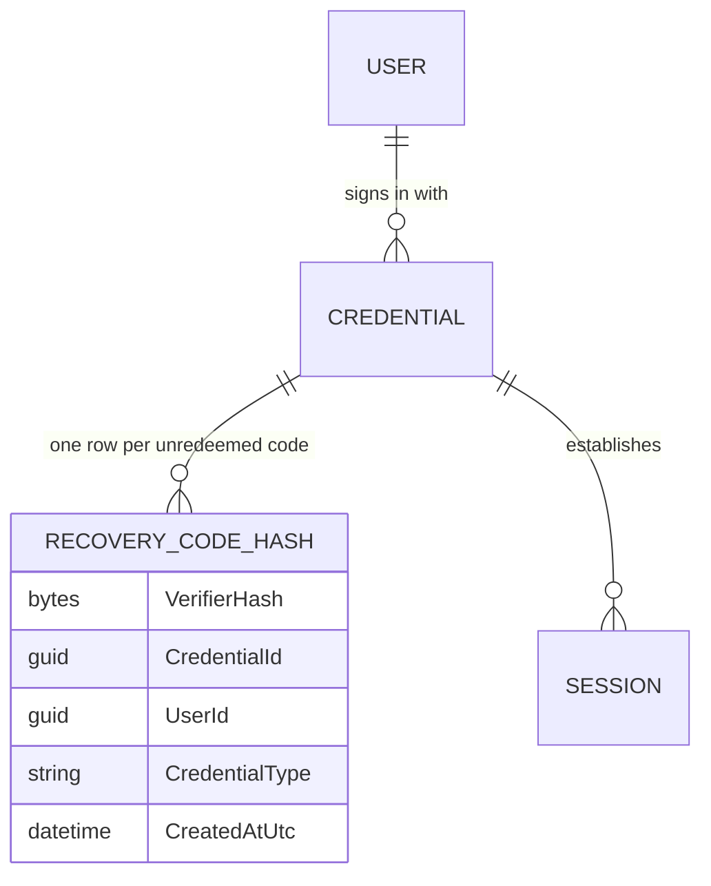
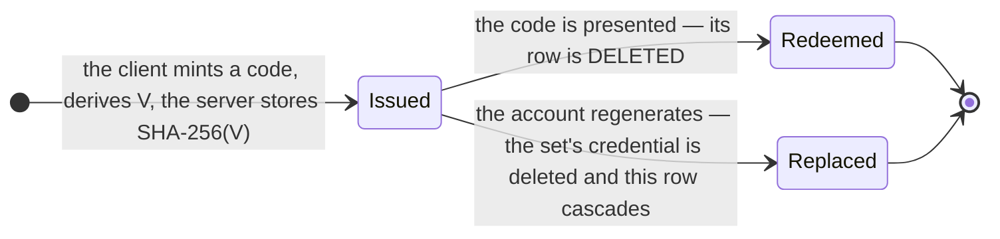
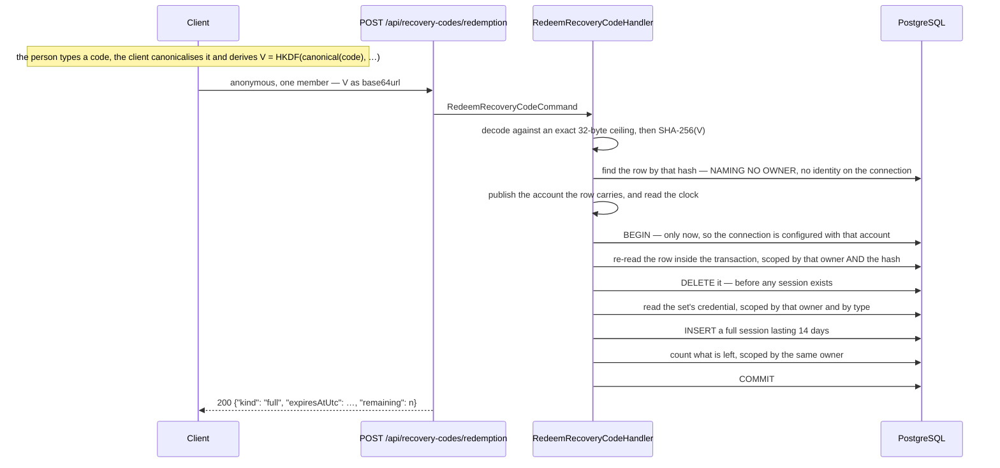

# Recovery Codes

## Table of Contents

- [Purpose](#purpose)
- [Key Entities](#key-entities)
- [Constraints](#constraints)
- [Business Rules & Invariants](#business-rules--invariants)
- [Workflows & State Transitions](#workflows--state-transitions)
- [Decision Trees](#decision-trees)
- [Integration Points](#integration-points)
- [Edge Cases & Known Gotchas](#edge-cases--known-gotchas)

## Purpose

A recovery code is the account's **second** way back in. Until this area existed, exactly one thing
could open a session reaching budget content — a passkey — so an account whose authenticator was
lost, wiped or destroyed was an account nobody could reach again, including the person who owned it;
there is no operator override and no escrow, so the only remedy that can exist is a second secret the
account holder already holds. The shape of that secret is the whole of this area: **the client mints
each code and the server never sees one.** The browser generates a code, derives a verifier
`V = HKDF(canonical(code), …)` from it, and sends only `V`; the server stores `SHA-256(V)`.
Identity — who a person is, and which credentials prove it — lives in
[users-and-ownership.md](users-and-ownership.md); what a credential opens once it has answered that
lives in [sessions.md](sessions.md); this file covers the codes themselves. What of it is built
today and what is not is the first gotcha below — read every rule here against it.

**A set is now issued on two paths, and only one of them is in this file's name.**
`POST /api/registration` mints the account's **first** set in the same act that creates the account,
because an account whose only factor is one passkey is an account whose keys leave with that device —
see [registration.md](registration.md). `POST /api/me/recovery-codes` is the other, and it is the one
every rule below about **replacing**, about the re-authentication gate and about `sessionsEnded`
belongs to. What the two share is the wire contract and the validation: the same member spelled
`codes`, the same `RecoveryCodeSubmission`, the same `RecoveryCodeSetValidation`.

## Key Entities

- **Recovery-code set** — a `Credential` of type `RecoveryCodes`, minted by
  `Credential.CreateRecoveryCodes`. **One credential row per set, never one per code.** It carries no
  `Provider` and no `Subject`, for the reason a passkey carries neither: nobody issued it. An account
  holds at most one, enforced by the partial unique index `IX_credentials_user_id_recovery_codes`.
- **`RecoveryCodeHash`** — one code that has not been redeemed. Its columns are `verifier_hash`
  (`bytea`, the primary key, exactly 32 bytes), `credential_id`, `user_id`, `credential_type` and
  `created_at_utc`. The hash **is** the identity of the row, because a redemption arrives carrying a
  code and nothing else, so the hash is the only handle it has.
- **Code** — the string a person writes down. It is minted in the browser, never transmitted, and
  appears in no column, no log and no response body. **No backend type names it** — that is
  [ADR 0015](../decisions/0015-mint-recovery-codes-on-the-client-and-store-only-a-hash-of-a-verifier.md)'s
  claim, and it is the whole of what the server side can say. The client does name it: `RecoveryCode`
  in `+core/security/recovery-codes.ts` is a branded string, declared distinct from
  `RecoveryCodeVerifier`, so a request body typed as verifiers refuses the array of codes at compile
  time. That is the last **free** place to catch *"sent the codes"*: below it there is nothing but a
  runtime refusal on a value the server can judge by its width and by nothing else.
- **Verifier** — `V = HKDF(canonical(code), …)`, exactly 32 bytes, derived on the client and sent as
  base64url text. It is what the server receives and the only thing it can judge. `canonical` is the
  canonicalisation rule below — the code upper-cased, its whitespace and hyphens stripped, and the
  letters the alphabet excluded folded onto the digits they are read as — and it is part of the
  definition rather than a step in front of it: the derivation is not specified until it says what
  text goes in.
- **`RecoveryCodesGeneration`** — what a completed issue answers with:
  `{"sessionsEnded": n, "session": {"kind": "full", "expiresAtUtc": …} | null}`, and nothing else. No
  code, no verifier, no stored hash, no credential id and no account id. `session` is the sign-in a
  replacement opened over the **new** set, and it is JSON `null` on an issue that opened none —
  **present and null rather than omitted**, because a member that appears only sometimes makes *"the
  server did not tell me"* and *"the server told me no"* the same observation for a client. Nothing
  configures `DefaultIgnoreCondition`, which is what keeps it on the wire. Its two facts are nested
  rather than laid beside the count so that *"kind present, expiry absent"* is unrepresentable.
  `sessionsEnded` is load-bearing twice — see the two regeneration rules below.
- **`RecoveryCodeCount`** — `{"remaining": n}`. One member: no id, no issued instant, no total, and
  above all no hash.
- **`RedeemedRecoveryCode`** — what a spent code bought: the session's kind, its expiry, and how many
  codes the card has left. **No session id**, for the reason the assertion response gives — returning
  the row's id would hand the client a stable handle to a session, and the likeliest way this design
  is broken later is somebody deciding that handle is close enough to a token to start accepting it.
  The kind crosses the wire as the column spells it, converted at the endpoint, because
  `JsonStringEnumConverter` is registered with no naming policy and would otherwise write `Full` where
  every other spelling in this product reads `full`.

Deliberately **absent** from `recovery_code_hashes`: a `redeemed_at_utc`, a `used` flag, an attempt
counter, a label, a wrapped key, and any per-row salt. Each is argued where it would have landed —
the first two by [ADR 0017](../decisions/0017-consume-a-recovery-code-by-deleting-its-row.md), the
rest by the pinned column set in
[ADR 0016](../decisions/0016-give-recovery-code-hashes-their-own-exempt-table.md).



## Constraints

### MUST

- **A code MUST be minted by the client, and the server MUST never receive one.** What crosses the
  wire is a verifier derived from the code by HKDF; what is stored is `SHA-256` of that verifier.
  - **Why**: the account's key-encryption key is derived from the same code on an **independent**
    HKDF branch. A code arriving here would therefore hand the operator that key, and the product's
    central promise — that no party but a holder of one of the account's own recovery factors obtains
    the keys — would be false for every account that ever generated a set. A database reader holding
    `SHA-256(V)` can do neither thing: there is no preimage to redeem with, and the hash is on the
    wrong branch to derive a key from.
  - **Enforced in**: the type system, not a check. `GenerateRecoveryCodesCommand` and
    `RegisterAccountCommand` each declare
    `IReadOnlyList<RecoveryCodeSubmission> Codes` — the **same** record, reused rather than copied,
    each submission a `Verifier`, a `FactorId` and
    two wrapped-key envelopes, and no member a code could travel in; `RecoveryCodeHash.From` takes
    a verifier and hashes it **internally**, so no shape of that call stores an unhashed value and
    no call site is a place to get it wrong once. A copy of that record on the second write path
    would be four declarations able to disagree with the first about which spellings a caller may
    send, on the one member whose shape is a cryptographic binding rather than a convenience. See
    [ADR 0015](../decisions/0015-mint-recovery-codes-on-the-client-and-store-only-a-hash-of-a-verifier.md).

- **A code MUST carry at least 128 bits of entropy, and no layer of this system enforces it.** This is
  the one rule in the area whose enforcement is missing on purpose, so it is stated with its reason
  rather than left to be discovered.
  - **Why**:
    - **Why nothing below the client can hold it**: the server receives fixed-length opaque bytes. A
      set of ten identical zero-filled verifiers is byte-indistinguishable here from a set a good
      generator produced, and a hash of a weak code is a perfectly well-formed 32-byte row. There is
      no measurement to make.
      [ADR 0002](../decisions/0002-enforce-rules-at-the-lowest-capable-layer.md) requires the owning
      doc to say why a rule sits above its lowest capable layer; here the answer is stronger — **no
      layer at or below the API is capable of it at all**, in the same sense the `prf` extension
      result is a claim the server cannot verify (see [passkeys.md](passkeys.md)).
    - **What the server pins instead, and it is the whole list**: the verifier's exact decoded width
      (32 bytes), the set size (10), and that the ten are distinct from each other. Nothing else.
  - **Enforced in**: the browser's generator and its spec, and nowhere else in this repository — a
    26-character code drawn uniformly from a 32-symbol alphabet is 130 bits, and the spec recomputes
    that arithmetic rather than restating the number. The assertions are about the alphabet and the
    draw rather than about a string's length, because a code of the right length drawn from
    `Math.random` or through a modulo-biased mapping passes every length check there is. Nothing
    below the client can restate it, so deleting that spec removes the requirement's only enforcer.

- **A code MUST be canonicalised before a verifier is derived from it**, by the one function every
  path shares.
  - **Why**: the rule is client-owned for the same reason the entropy rule is — the server sees the
    derived bytes and has no text to normalise. A redemption that skips it derives a well-formed
    verifier matching no row, and the person holding a valid card is refused with the `401` every
    other refusal answers.
  - **Enforced in**: `canonicalRecoveryCode` in the client — the fold, its bounds and where it lives
    are the canonicalisation rule below.

- **A verifier MUST decode to exactly 32 bytes, and both directions of that bound are refused.**
  - **Why**: short is a shorter secret than the design claims, and it would hash to a well-formed
    32-byte row nothing downstream could tell from a real one —
    `CK_recovery_code_hashes_verifier_hash_length` watches the *hash*, which is 32 bytes whatever went
    into it, so the database cannot catch a short verifier. Long means the client and the server
    disagree about what a verifier is, and since the same code also derives the key-encryption key, a
    width quietly accepted here surfaces much later as a key that will not unwrap.
    - **Refused, never truncated.** Truncating would store the hash of a prefix, and no code would
      ever redeem.
  - **Enforced in**: `RecoveryCodeHash.VerifierLength` and the equality test in `RecoveryCodeHash.From`,
    restated on the decode in `RecoveryCodeSetValidation.DecodeAndValidate` so a malformed set is a
    400 with a sentence rather than a domain throw. `CK_recovery_code_hashes_verifier_hash_length`
    holds the *hash* width, which is a different claim about a different value and is not a second
    spelling of this one.

- **An issued set MUST hold exactly ten submissions, every verifier distinct and every factor
  identifier distinct.** A submission is one code's verifier, that code's own client-minted factor
  identifier, and the account's two keys wrapped under a key-encryption key derived from that code —
  because each of the ten is a secret of its own and a person redeems whichever one they still have.
  The factor-identifier rule is enforced in the application rather than left to
  `PK_wrapped_account_keys`, which would refuse *after* the previous set had already been deleted
  inside the same transaction. See [account-keys.md](account-keys.md).
  - **Why**: too few leaves a person with fewer ways back than the screen told them they had; too many
    is a client the server no longer agrees with about what a set is; zero is the argument a handler is
    most likely to read as "nothing to do" and answer `200` to, having just replaced a live set with
    nothing. Distinctness is the rule the count cannot express — ten members that are nine codes deep —
    and left to the database it becomes a primary-key collision on `verifier_hash`, which is a `500`
    for a caller whose request was merely wrong, arriving *after* the previous set has already been
    deleted inside the same transaction.
  - **Enforced in**: `RecoveryCodeSetValidation.RequiredCodeCount` and that type's
    `DecodeAndValidate`, each refusal carrying a sentence of its own. Ten is **product policy** and
    lives in Application for the reason `SessionPolicy.Lifetime` does: a set of nine is not a
    malformed set, it is a smaller quantity of a thing somebody chose, and a `CHECK` counting sibling
    rows cannot be written without a trigger, which ADR 0002 refuses. It sits beside the rule that
    applies it rather than on the handler that calls it, and that placement is the same argument
    rather than a second one: what a presented set has to be is not one route's decision, because
    any write path accepting a set writes the same rows and the same key-custody columns, so a
    count owned by one of them is a count another copies — and a copy is what drifts. That is the
    shape `CanonicalFactorId` already holds for the factor identifier's spelling.

- **An account MUST hold at most one set.**
  - **Why**: two sets are two remaining-counts with nothing saying which one binds. "You have three
    codes left" stops being answerable, "revoke the set" stops naming anything, and reissuing can only
    *replace* while there is one thing to replace.
  - **Enforced in**: the partial unique index `IX_credentials_user_id_recovery_codes` on `(user_id)
    WHERE type = 'recovery_codes'`, pinned as
    `CredentialConfiguration.RecoveryCodesPerUserIndexName`. The filter is load-bearing rather than
    tidy: an unfiltered unique index over `user_id` enforces this rule just as well and *also* refuses
    an account a second passkey, which is expressly allowed.

- **A code MUST belong to the same person as its set, and to a credential of type `recovery_codes`.**
  - **Why**: a redemption arrives **anonymous** and adopts the `user_id` it finds on the row, and
    this table is exempt from row-level security — so a row whose owner disagreed with its
    credential's would hand a redeemer somebody else's account with nothing beneath the application
    watching. The idiom matters more here than on `sessions` or `passkey_public_keys` for exactly
    that reason.
  - **Enforced in**: the composite foreign key
    `(credential_id, user_id, credential_type) → credentials (id, user_id, type)` against
    `AK_credentials_id_user_id_type`, `ON DELETE CASCADE`, plus
    `CK_recovery_code_hashes_credential_type` pinning the column's own vocabulary.

- **Generating a set on `POST /api/me/recovery-codes` MUST be authorized by a fresh WebAuthn
  assertion**, exactly as erasure and passkey revocation are, and the gate MUST run before the
  presented set is validated. **Registration is not an exception to this rule; it is outside it** —
  that request carries a completed WebAuthn *registration* ceremony, verified before any of its
  payload is judged, and the set it issues replaces nothing because the account does not exist yet.
  There is no account to enumerate about and no live set to destroy, which are the two things this
  gate protects.
  - **Why**:
    - **Why the gate**: a set of recovery codes is a **full-session** credential, so minting one on
      an unproven request hands the account to whoever holds a stolen bearer token — and, because
      issuing *replaces*, destroys the real set in the same breath. More rides on this gate than on
      any other re-authenticated route.
    - **Why the ordering**: validating first would answer an unproven caller with the required set
      size and the required verifier width, which are the two facts a client needs to present a set
      at all. Past the gate those sentences cost nothing, because the caller has proved possession
      of an authenticator registered to this account and there is nobody left to enumerate about.
  - **Enforced in**: `GenerateRecoveryCodesHandler`, which calls
    `PasskeyReauthentication.VerifyAsync` as its first statement and
    `RecoveryCodeSetValidation.DecodeAndValidate` as its second.
    The assertion is a **member of the command** rather than a separate call the endpoint makes, so
    issuing without proof is unreachable rather than merely uncustomary.

- **A redemption MUST be anonymous, and the account it lands on MUST come from the matched row.**
  - **Why**: somebody redeeming a code has lost the authenticator that would have proved who they
    are, so the request names nobody and can name nobody — an account id, an email or a credential id
    in the body would each be a value the server would have to ignore or trust, and trusting one would
    let an anonymous caller choose whose code is matched. What establishes the identity is the row the
    presented verifier hashes to.
    - **Consequence a reader will trip on**: the client's interceptor attaches the session cookie to
      every request it makes to this API, including this one. A handler reading `IUserContext` for
      the account would find nothing on a genuine recovery sign-in — the person has no session,
      which is why they are here — and *something* on a request made from a browser that still holds
      one, and the something is the wrong account.
  - **Enforced in**: `RedeemRecoveryCodeCommand` carries the verifier and nothing else;
    `RedeemRecoveryCodeHandler` takes `IUserContextWriter` and never reads `IUserContext` for the
    account, publishing the id it found on the row. The permission itself is reviewable as a set
    rather than as a line: `AnonymousSurfaceTests` reads every `AllowAnonymous` route off the route
    table and compares it whole against a written-out list, so this route's paragraph of argument is
    what a reviewer answers rather than a `.AllowAnonymous()` call somebody has to notice.
    `RecoveryCodeRedemptionTests.Redemption_TakesTheAccountFromTheCode_NotFromTheBearerToken` seeds
    two accounts each holding a set — with one set in the table, "the code's owner" and "the only
    owner there is" are the same account, and the claim would not be measurable at all.

- **The identity MUST be published before the transaction opens, and the transaction MUST NOT open
  before it.**
  - **Why**: the same ordering `CompleteAssertionHandler` carries, for the same reason: a
    transaction opens a connection, and opening a connection is when `SessionContextInterceptor` runs
    its `set_config`. Opened first, `app.current_user_id` reaches the database as `''` and every
    policed statement inside fails with `22P02` — and `sessions` is policed by `user_isolation`, so
    the session insert is exactly such a statement.
  - **Enforced in**: the step order in `RedeemRecoveryCodeHandler`, with a comment at each step. No
    test names the ordering directly;
    `Redemption_WithAValidCode_OpensAFullSessionAndReportsWhatIsLeft` is what fails, with a `500`,
    and it is load-bearing for that reason as much as for the happy path.

### MUST NOT

- **The set MUST NOT be requested without a proof, and no account may be named.**
  - **Why**: issuing *replaces*, so a chooseable account here would be a way to destroy a stranger's
    recovery codes.
  - **Enforced in**: `GenerateRecoveryCodesCommand` carries the ten submissions and the assertion and
    **no field naming an account** — the identity comes from `IUserContext` and nowhere else. The
    second half holds on the registration path too, by a different mechanism and for a different
    reason: `RegisterAccountCommand` names no account either, but there the identity comes from a
    value **derived** from the ceremony's own challenge rather than from an ambient one, because there
    is no account yet to be ambient. See [registration.md](registration.md).
- **No route in this area may bring an account into existence, and none may ever gain the ability.**
  - **Why**: a provider id token stays valid for up to an hour after the account it names is erased,
    so a route that minted an account in order to answer a generation would let that stale token
    bring the account back **as a shell holding recovery codes** — strictly worse than the empty
    shell the erasure and export groups argue about, because a set of codes is a full-session
    credential, and because the resurrected account holds no passkey and can therefore never clear
    the re-authentication gate in front of erasure again. Two of the three routes are the ones a
    reader would wire it into for opposite reasons: the `GET` because a read looks harmless, and the
    **redemption** because it is the route people reach for when they cannot get in, which reads a
    great deal like a route that should be able to create something.
  - **Enforced in**: nothing on these routes, and the ban survives while what enforces it changed.
    It used to be the absence of a `ProvisionsUser` marker on each of them, held by a route-table
    test. It is now that `RegisterAccountHandler` is the only code that creates an account and
    `/api/registration` the only group that reaches it; the two authenticated routes here inherit a
    fallback policy naming the session cookie scheme, so a provider bearer authenticates nothing on
    them, and the redemption is anonymous.
    `Redemption_ForASubjectWithNoAccount_CreatesNothing` still counts `users`, `credentials`,
    `budgets` and `sessions` unscoped afterwards, and is now a pin on that structural claim rather
    than on a marker's absence.
- **A refusal on the redemption route MUST NOT carry anything that varies by cause.**
  - **Why**: absent member, not base64url, wrong width, past the ceiling, no such code, already
    spent, and a concurrent redemption of the same verifier all leave as one `401`, with one title
    and one body. The word to avoid here is *byte-identical*: the response carries a per-request
    `traceId`, so two refusals do differ — in a value that varies with the request and never with
    what was wrong. State the rule at its real strength, because a claim wider than its gates is one
    a reader checks once and then stops believing. Telling "no such code" from "that code was
    already used" says a value the caller presented was once real, which is exactly what somebody
    working through a partially-observed card wants to know; told apart from "that was not
    base64url" it says the same about the encoding, and told apart from "too long" it hands out the
    width of a verifier for free.
    - **What is not held constant is the work a refusal does.** A malformed verifier touches the
      database zero times, an unknown one once, and a lost race several. The response says the same
      thing either way; how long it takes to say it does not, and no test holds that constant. The
      difference is bounded rather than closed: the split at the decode is one the caller already
      knows, because they built the value they presented, and every path beyond the discovery read
      requires a verifier naming a **real** row — the digest of a 256-bit secret presented whole.
  - **Enforced in**: `RecoveryCodeRedemptionException`, the only exception the handler raises for a
    rejected code — deliberately **not** the passkey one, because "The passkey could not be verified."
    on this route is a *wrong* sentence that tells the person holding a card that the thing they do
    not have is the thing that failed. `RecoveryCodeRepository.ConsumeAsync` translates the
    concurrent loser's `DbUpdateConcurrencyException` into the same refusal rather than letting it
    surface as a `500` that is also a second answer.
    `EveryReachableRedemptionRefusal_ProducesTheIdenticalResponse` drives all of them and asserts
    they collapse to one status and one body, `traceId` aside.
- **The application role MUST NOT hold `UPDATE` of any shape on `recovery_code_hashes`.**
  - **Why**: with no `UPDATE`, the delete is the only way a row can stop counting, so "a redeemed
    code is invalidated" cannot be quietly reversed into a stamp. See
    [ADR 0017](../decisions/0017-consume-a-recovery-code-by-deleting-its-row.md).
  - **Enforced in**: the grant matrix in `app-role-grants.sql`, pinned by
    `Database_RefusesEveryUpdateOnARecoveryCodeHash_…`.
- **The generation path MUST NOT materialise the previous set's `recovery_code_hashes` rows.**
  - **Why**: this is the highest-value trap in the area and nothing beneath the application would
    notice it — see the first gotcha below.
  - **Enforced in**: a comment on `IRecoveryCodeRepository.DeleteSetAsync` and its call site, and
    nothing else — the gotcha says why no test can hold it.
- **`GET /api/me/recovery-codes` MUST NOT answer `404`.**
  - **Why**: an account with no set has zero codes left, which is an answer — see the rule below.
  - **Enforced in**: `CountRecoveryCodesHandler`, which counts rows and never looks for the set.
- **No response, log line or trace MUST carry a verifier, a hash, or the set's credential id.**
  - **Why**: a stored hash is the value a redemption is matched against, so publishing one would turn
    the read every settings screen makes into the whole secret; an id in a response body is an id in
    a client log.
  - **Enforced in**: the three response records — `RecoveryCodesGeneration`, `RecoveryCodeCount` and
    `RedeemedRecoveryCode` — have no member any of it could travel in, and the handlers take no
    logger.

## Business Rules & Invariants

- **Rule**: A code is consumed by **deleting its row**. Nothing stamps it used, and no column records
  that it ever existed.
- **Why**: "redeeming a code invalidates that code" is then literally true rather than a property some
  filter has to keep remembering. It is why there is no `UPDATE` grant of any shape, it keeps a
  behavioural timestamp off a schema whose data-minimization rule refuses one, and it makes the
  remaining count a plain `count(*)` over the table rather than a count of rows a predicate calls live.
  It also leaves nothing for the erasure remnant vocabulary to find.
  - **The accepted cost, stated rather than hidden**: a redeemed code leaves no trace, so *"was this
    code used, or was it never issued?"* is unanswerable — by support, by the account holder, and by
    the product. That is the same trade the product makes everywhere else: it keeps no behavioural
    log by design, and [erasure.md](erasure.md) refuses a deletion record for the identical reason.
- **Enforced in**: the grant matrix in `app-role-grants.sql` — `SELECT, INSERT, DELETE` and no
  `UPDATE` — with `Database_RefusesEveryUpdateOnARecoveryCodeHash_…` pinning the absence.
  `RecoveryCodeHash` exposes no mutator, and `ErasureRemnantVocabulary` would refuse a `redeemed_at`
  column by name if one were ever added. See
  [ADR 0017](../decisions/0017-consume-a-recovery-code-by-deleting-its-row.md).
- **Counterexample** — and it is the design a future reader will propose: a `redeemed_at_utc` stamped
  instead of a delete. Three things break at once. The role needs `UPDATE` on the table, which is the
  one privilege that could rewrite a secret in place. Every read of the set has to carry
  `where redeemed_at_utc is null`, and the first one that forgets it counts spent codes as live and
  offers a person ten ways back in when they have two — or, worse, matches a spent hash on redemption
  and lets one code work twice. And the stamp is a behavioural record: the row now says *when this
  person used a recovery code*, which is a fact about a person kept in a schema that keeps none.
- **Source**: `[SOURCE: user-story]`

---

- **Rule**: The server stores `SHA-256(V)` where `V` is a verifier the client derived from the code.
  It never holds the code, and it never holds `V` beyond the request that presented it.
- **Why**: the code is the input to two independent HKDF branches — one produces the verifier this
  table is keyed on, the other produces the account's key-encryption key. Keeping them independent is
  what lets the server check a redemption without ever being able to unwrap anything.
- **Enforced in**: `RecoveryCodeHash.HashOf`, which `From` calls rather than repeating the digest — the
  two spellings must agree or **no recovery code in the system ever redeems**, and the symptom is
  silent. Nothing on the path from `RecoveryCodeEndpoints` to the row takes a parameter a code could be
  passed as.
- **Counterexample** — and it is the reason the wording in this file is pedantic: a client that sent
  the **code** and a server that stored `SHA-256(code)`. Every test in the suite still passes — the
  widths match, the redemption still works, the column still holds a digest nobody can reverse. What
  changes is that for the duration of one request the operator holds the input to the key-encryption
  key's own derivation, for an account whose keys they are otherwise structurally unable to read. One
  request log, one crash dump, one debugging breakpoint, and the product's central claim is false for
  that account.
- **Source**: `[SOURCE: user-story]`

---

- **Rule**: The code is **canonicalised before anything is derived from it**, on every path and by one
  function: upper-cased, stripped of whitespace and hyphens, with `I` and `L` folded to `1` and `O` to
  `0`. That is the `canonical` in `V = HKDF(canonical(code), …)`, and the minting path and a redemption
  screen apply the same one.
- **Why**: this is the half of the alphabet's decision that a person can actually feel. The draw
  excludes `I`, `L` and `O` because a reader resolves them as `1`, `1` and `0` — but excluding a glyph
  from the *draw* protects nobody on its own: it means no code contains it, not that nobody types it.
  Without the fold the exclusion buys nothing on the only path that matters, and the same physical code
  typed in lowercase on a phone, or with the grouping it was printed in left in, derives a different
  verifier and matches no row. With it, one card is one secret however it is transcribed.
  - **Why it is client-owned, exactly as the entropy rule is**: the server receives derived bytes, so
    there is no text here for it to normalise and no layer at or below the API can hold this rule
    either. A redemption screen that skipped canonicalisation would produce a perfectly well-formed
    verifier that simply matches nothing, refused with the `401` that is deliberately
    indistinguishable from every other refusal — the only way back into the account, looking broken
    and saying nothing about why. That symptom is the reason the rule is written down here rather
    than left for a redemption screen to rediscover.
  - **No rule may fold two codes together, and that is what bounds the list.** Each fold is the
    inverse of an exclusion the alphabet already made, so the function is the identity on everything
    the generator produces: no verifier already derived can move, and no two codes the generator can
    mint can be folded onto one another. `U` is excluded from the draw and deliberately **not**
    folded — it is excluded so that a draw cannot spell an obscenity, not because it is read back as
    something else — and a rule generous enough to rescue every typo would quietly shrink the code's
    130 bits.
- **Enforced in**: `canonicalRecoveryCode` in the client's `recovery-code-canonical.ts` — its own
  module since the account-key derivation began sharing it — applied by `recoveryCodeVerifier` before
  any derivation and covered by that module's spec. The rule itself is **normative in**
  [account-keys.md](account-keys.md), character by character including the exact set of whitespace it
  strips, because a second client cannot read this one's source and "whitespace" is a different set in
  every regular-expression dialect. It uses
  `toUpperCase` and never `toLocaleUpperCase`, which maps `i` to `İ` under a Turkish locale and would
  make one typed code derive different verifiers on two phones. The refusal to derive from nothing runs
  *after* canonicalisation, so a field holding only the grouping the person was shown is the same
  programming error as an empty one rather than a well-formed verifier for the empty string.
- **Example**: a card printed `A2B3-C4D5-…` typed as `a2b3 c4d5 …` on a phone derives the same
  verifier as the printed form; a person reading `0` off the card and typing `O` is folded back to
  the digit. Typing `V` where the card shows `U` is **not** rescued — `U` never appears in a code,
  and no fold exists for it.
- **Source**: `[SOURCE: user-story]`

---

- **Rule**: The hash is **unsalted `SHA-256` from the BCL**. No package, no per-row salt, no slow key
  derivation function.
- **Why**:
  - **Why no salt**: a redemption arrives carrying a verifier and no identity at all — no credential,
    no account — so the row has to be findable by its hash alone. A per-row salt is a value the
    lookup cannot know before it has found the row it needs the salt to find, and anything else
    per-call — a nonce, a keyed MAC over a deployment secret — turns the single lookup into a query
    with no argument to give it.
  - **Why no slow KDF**: Argon2 and PBKDF2 exist to make a **guessable** input expensive to
    enumerate. The input here is a uniform 256-bit value the client derived, so there is no
    dictionary to slow down and a work factor buys nothing but latency on a request that already
    holds the account. This is the hardening a future reader will reach for first, which is why the
    argument is written down before they arrive.
  - **Why no package**: `SHA256.HashData` is in the BCL. Adding a hashing library would move a pinned
    row in `ProjectReferenceGraphTests` and put a third-party dependency on `Domain`, which declares
    none — see [dependency direction](../engineering/dependency-direction.md).
- **Enforced in**: `RecoveryCodeHash.HashOf`, with the argument on the member itself.
- **Source**: `[SOURCE: user-story]`

---

- **Rule**: Issuing **replaces**; it never adds. `POST /api/me/recovery-codes` answers `200 OK` on a
  first issue and on a regeneration alike, with the same body. `POST /api/registration` answers `201`,
  and that is not an inconsistency: the resource it created is the **account**, not the set.
- **Why**:
  - **Why replace rather than add**: a handler that only inserted would leave the codes on a card the
    person has already thrown away still working, which is the one outcome regeneration exists to
    prevent.
  - **Why the same status**: the resource is *the account's recovery-code set*, singular — the
    partial unique index is what makes it singular — and a `POST` replaces it. A `201` on the first
    and a `200` on the second would make a client branch on which of two states its own account was
    in before it asked, which is a fact it has no way to know and no use for. A `409` on the second
    would refuse the request a person makes precisely when they need it most: the card is lost, and
    the codes printed on it must stop working.
- **Enforced in**: `GenerateRecoveryCodesHandler` deletes the previous set's credential before adding
  the new one, inside one `ITransactionalExecutor` delegate;
  `IX_credentials_user_id_recovery_codes` is what makes a second set unstorable if it ever tried.
- **Example**: a person loses the card and generates again. The response is the same `200` their
  first issue answered, and every code on the lost card now matches no row.
- **Source**: `[SOURCE: user-story]`

---

- **Rule**: A regeneration **revokes the replaced set's sessions explicitly**, before deleting its
  credential — and the returned `sessionsEnded` is the only place that fact can be observed.
- **Why**: `recovery_code_hashes` and `sessions` both cascade from `credentials`, so deleting the
  credential ends those sessions **by accident and invisibly**. The schema after the request is
  byte-identical whether the revocation ran or not, which means the obvious test — *"no session of the
  replaced set survives"* — is green with the explicit revocation deleted and therefore proves nothing.
  The count is the only place the evidence can live.
  - **`sessionsEnded` is therefore a published response contract**, not an internal return value.
    Widening the response later is additive; narrowing it — or dropping this member because "the
    cascade handles it" — is breaking, and it removes the only observation of the rule.
  - **It is also the condition the replacement's own session is written on**, so the number is
    load-bearing twice over: as the evidence that the sweep ran, and as the decision the rule below
    is keyed on. Changing what it counts is therefore never a local edit — see that rule, and
    [sessions.md](sessions.md), which owns the sweep.
- **Enforced in**: `GenerateRecoveryCodesHandler` calls `RevokeSessionsForCredentialHandler` and then
  `IRecoveryCodeRepository.DeleteSetAsync`, in that order, through the command handler rather than
  straight to `ISessionRepository` — the handler is where the clock is read, so one decision to end
  access is stamped as one instant. The same mechanism is documented for passkey revocation in
  [sessions.md](sessions.md), which owns the general form of this trap.
  - **Two mutations produce the same wrong number**, which is what makes the assertion sharp:
    deleting the revocation call reports `0`, and swapping it with the delete reports `0` as well,
    because the cascade has already taken the session rows and the sweep matches nothing.
  - **Between the two calls the tracked sessions are discarded**, and that is a second reason rather
    than the first restated: the sweep loads every unrevoked `Session` into the change tracker, and
    removing the `Credential` with those dependents still tracked makes EF emit its own
    `DELETE FROM sessions` on a table granted no `DELETE` at all — so the request dies with `42501`
    having removed nothing. **The SQLSTATE names a privilege and the cause is the change tracker; do
    not answer it with a grant on `sessions`.**
- **Source**: `[SOURCE: user-story]`

---

- **Rule**: Replacing a set that was carrying live sessions **opens one session over the new set**;
  replacing a set that was carrying none opens nothing. The condition is `sessionsEnded > 0`.
- **Why**: the person this route is for very often lost their authenticator, redeemed a code,
  registered a replacement passkey, and is regenerating the card **while signed in on the session that
  redemption opened** — so the sweep above takes their own session. Without this rule they are handed
  ten fresh codes and thrown out of the flow in the same response, at the worst possible moment.
  - **What that costs is the flow, not the account — the word to avoid here is *locked out*.** The
    caller has just proved possession of a passkey to pass the gate in front of this route, so a new
    session is always one assertion away. Being ejected from an account-recovery flow at its last
    step is the whole of the harm and it is enough; the stronger word would not survive a reader
    checking the code, and a rule defended by an overstatement is one they stop believing.
  - **Why it is stated about the *set* rather than about the caller**: nothing on this request
    presents a session — the proof is a WebAuthn assertion — so the server cannot know whose session
    it swept. It asks instead whether the set it replaced was carrying any at all. A rule with no
    referent would be worse than a slightly generous one.
  - **The reading is generous in exactly one direction, and that is the deliberate part.** **No
    false negatives**: a live session over the replaced set is always swept, so anybody signed out
    here is signed back in. **Two false positives**: a live session on another device, and a session
    unrevoked but past its expiry — the sweep narrows on `revoked_at_utc is null` and says nothing
    about expiry. Each costs one inert row that hands nothing to anybody, which is the cheap side of
    the trade.
  - **The session is `Full` and lasts 14 days**, derived by `Session.Establish` from the new set's
    own `Credential` rather than named by this handler — the rule a redemption follows, for the
    reason [sessions.md](sessions.md) gives. The interval matching the other two establishing paths
    is the rule rather than a coincidence: the caller cleared a passkey gate to get here, which is
    stronger than whatever opened the session the sweep took, so a shorter lifetime would say the way
    back in they were left with is worth less than the one they were signed in on.
- **Enforced in**: `GenerateRecoveryCodesHandler`, which writes the session through
  `ISessionRepository` — never through `IRecoveryCodeRepository`, which has no right to write
  `sessions` — **after** `AddSetAsync` and inside the same transactional delegate, stamped from the
  same instant as the sweep, the new credential and the ten hash rows. Every other placement fails
  concretely: before the insert the row names a credential that does not exist yet (`23503` on every
  request); beside the revocation the second discard drops the queued row, so the response describes a
  session nobody wrote, with no SQLSTATE to say so; inside the replacement branch before
  `DeleteSetAsync` it lands over the **old** credential and leaves with its cascade; outside the
  delegate it is not atomic with the set at all.
  `HandleAsync_WhenTheReplacedSetHadALiveSession_LeavesTheAccountOneLiveSession` states it over the
  account's live sessions rather than over the sweep's count, so no rearrangement of the sweep can
  satisfy it, and three negatives pin the condition — no previous set, a previous set that had opened
  no session, and a previous set whose sessions were already revoked.
- **Example** — under a replayed unit of work the rule converges rather than accumulating: a second
  attempt sees its own committed set as the previous one, sweeps the session it opened itself,
  deletes, re-inserts and opens another — one set and one live session. *"Never establish on a
  retry"* would leave the person with nothing.
- **Counterexample**:
  - **Not "always establish"**, which is the simplification a reader reaches for first. A first
    issue is the most frequent call to this route, and a phantom session there is a sign-in somebody
    never made, at onboarding, indistinguishable from a compromise — and revoking it does not undo
    having been told about it.
  - **Do not tighten the condition to "live at the handler's instant".** The number belongs to
    `RevokeSessionsForCredentialHandler`, and `RevokePasskeyHandler` reports the same number through
    the same sweep while meaning only *evidence* by it. Narrowing it here is a change to what the
    sweep counts, on both paths, dressed up as a change to this rule.
- **Source**: `[SOURCE: user-story]`

---

- **Rule**: Two concurrent generations for one account: the loser answers **`409`**, and **both halves
  of the race answer it with the same sentence**.
- **Why**:
  - **Why there are two halves**: the loser fails in one of two places depending on whether the
    account already held a set. If it did, both requests load the same credential and both reach the
    delete — the second matches zero rows and EF raises `DbUpdateConcurrencyException`. If it did
    not, neither request reaches a delete at all: both insert, and the loser collides on
    `IX_credentials_user_id_recovery_codes` with a `23505`. The second is the likelier half — it is
    the double-clicked button on a fresh account.
  - **Why the sentence is shared, and this is the deliberate part**: the caller's situation is
    identical either way — this attempt wrote nothing, somebody else's set is the account's, and the
    ten codes this client has already shown a person will never redeem. Two different messages would
    let the loser tell *"you already had a set"* from *"you did not"*, which is a fact about the
    account's previous state that a losing request has no business learning and no use for.
  - **The sentence says what to do next**, because a `409` with no detail tells a client nothing
    about whether to retry — and the "present a fresh re-authentication" half is not a formality:
    this attempt's nonce was consumed by the gate *before* the transaction opened, so a retry
    replaying it is refused with the gate's own `401`.
- **Enforced in**: `RecoveryCodeRepository.LostTheRaceMessage`, thrown from both catches.
  `AddSetAsync` filters on the **constraint name** and never on the SQLSTATE alone — one save flushes
  the credential and ten hash rows, each carrying unique rules of its own, so a bare
  `catch (PostgresException)` would report two codes hashing alike as a lost race: a confident,
  specific, false `409`. `DeleteSetAsync` narrows by the **entries** instead, because a concurrency
  conflict carries no SQLSTATE and no constraint name, and requires every conflicting entry to be a
  `Credential` this call itself marked `Deleted`.
- **Counterexample** — the four answers a reader will reach for instead. Not `200`: this request
  wrote no set, and a success is the one outcome that leaves somebody holding a printed card that
  unlocks nothing with no way to find out. Not `404` — which is what the sibling revocation path
  answers to the *identical* EF exception, and rightly, because a revocation names a credential in
  its route so "that row is gone" is an answer about the thing asked for; a generation **names
  nothing**, and the resource it addresses exists, so a `404` would be a false statement about the
  caller's own account. Not the gate's `401`: the caller proved possession of an authenticator
  registered to this account, and reporting a lost race as a failed proof sends a person to debug an
  authenticator that is working perfectly. Not swallowed-and-continued in the shape
  `UserRepository.DeleteAsync` uses: the row is already gone, so carrying on means inserting this
  request's set beside the winner's, and the same conflict arrives one statement later and harder to
  read.
- **Source**: `[SOURCE: user-story]`

---

- **Rule**: `GET /api/me/recovery-codes` is **not** gated by re-authentication, and an account with no
  set answers `{"remaining": 0}` rather than `404`.
- **Why**:
  - **Why not gated**: a count is not destructive — it names no code and unlocks nothing — and the
    settings screen has to read it before it can render at all. Gating it would mint a
    re-authentication nonce on **every page view**: a live nonce for a ceremony nobody intends to
    complete, behind a WebAuthn prompt the person did not ask for.
  - **Why zero and not `404`**: there really is no `credentials` row to read, so a handler written as
    "find the set, then count its codes" reaches for a `404` naturally — which is exactly why the
    read counts rows and never looks for the set. The client has no use for the distinction: *"you
    have no codes"* and *"you have zero left"* are the same actionable fact — generate a set — the
    control that offers it is the same control, and a `404` would force a settings screen whose
    whole job is to say what to do next to carry a branch whose two arms render the same thing.
- **Enforced in**: `CountRecoveryCodesHandler`, which reads `IUserContext.UserId` and calls
  `CountRemainingForUserAsync`; `CountRecoveryCodesQuery` carries no member and may not gain one. The
  handler takes no `ILogger` and must never take one — what it holds is a user id and a count of an
  account's remaining ways back in, and an account down to its last code is an account worth attacking
  now.
- **Source**: `[SOURCE: user-story]`

---

- **Rule**: A set of recovery codes derives a **Full** session, the same kind a passkey opens.
- **Why**: `federated` is now the only credential type that cannot open a session reaching budget
  content, and the reason is unchanged — an authorization exchange with an identity provider returns
  claims, not a secret a client can turn into a key. A passkey and a recovery code both are: the
  authenticator holds one and the person wrote the other down, so each is a secret in the holder's
  own possession that a client can derive from. That is the whole of the reason today, and it is
  already enough. The key custody those two secrets are meant to carry — an authenticator holding
  the account's keys, a code the keys are wrapped under — now has its cryptography built, the write
  paths that store the result, **and one browser flow that produces it**: `/register` derives a
  key-encryption key from each of the ten codes it mints and files eleven wrapped pairs in the same
  save as the account, so **every** account really does have its keys wrapped under both kinds of
  secret — registration being the only way an account comes to exist. What is still missing is the
  rest of the browser surface: nothing redeems a code and nothing issues a replacement set, and
  nothing unwraps anything, because no route hands `wrapped_account_keys` back. So custody is what
  makes the rule durable rather than what makes it true today; possession is still the whole of the
  reason it holds.
  - **It lasts 14 days, the same interval a passkey sign-in gets, and the equality is the rule
    rather than a coincidence.** A set of codes is a secret its holder possesses exactly as an
    authenticator is, and reaches exactly as far, so a session that expired sooner here would
    quietly tell somebody who has just lost their device that the way back in they were issued is
    worth less than the one they lost. The number is `SessionPolicy.Lifetime`, which this path and
    the other two establishing paths all read: the three differing is a defect rather than a
    decision, and one value is what stops a fourth path bringing a fourth number. What that sharing
    does **not** cover is where in the handler the session is established — here, only after the
    code is spent, which is this file's own rule below. See [sessions.md](sessions.md), which owns
    the lifetime.
- **Enforced in**: `Session.KindFor`, with every arm written out and a throwing discard arm, and
  `CK_sessions_kind_matches_credential` restating it in the layer that rejects. The spelling of that
  constraint is itself a decision — see [sessions.md](sessions.md).
  `Redemption_WithAValidCode_OpensAFullSessionAndReportsWhatIsLeft` reads the row back on the
  superuser connection and asserts its kind, its owner and the credential it hangs off.
  - **A redemption is what establishes one.** `RedeemRecoveryCodeHandler` reads the set's own
    `Credential` and hands *that* to `Session.Establish`, so the kind is derived from a real row
    rather than named by the caller — a factory taking a `SessionKind` would let this route ask for
    one and dissolve the rule. The credential is read rather than reconstructed for the same reason,
    and the read carries owner **and** type: `credentials` is exempt from row-level security, so
    that predicate is the only thing narrowing it, and the owner it names is the one the matched
    code established.
- **Source**: `[SOURCE: user-story]`

---

- **Rule**: The code is **consumed before** the session is established, and the two statements are two
  saves inside one transaction rather than one flush.
- **Why**: the asymmetry is the reason. A consumed code with no session is a retryable inconvenience —
  the person uses the next code on the card. A session opened over a code that was not consumed is a
  **replay window**, because the same value opens a second one, and a recovery code is a full-session
  credential: that is an unbounded number of sign-ins from one intercepted verifier.
- **Enforced in**: the statement order in `RedeemRecoveryCodeHandler`, with
  `RecoveryCodeRepository.ConsumeAsync` saving on its own so the ordering is one of **statements** and
  not merely of C# lines — no reordering of a shared flush can put the session in front of the
  consume. Both saves live inside the handler's one transaction, so a failure afterwards still takes
  the delete back.
  - **What holds the ordering is the one arrangement where the consume can fail with the session
    write already behind it** — `RedeemRecoveryCodeHandlerTests`'
    `HandleAsync_WhenTheCodeIsSpentByAConcurrentRedemption_RefusesAndOpensNoSession`,
    where a concurrent redemption takes the row between the discovery read and the re-read.
    Establish first and that request answers its `401` having opened a session over a code somebody
    else spent. The asymmetry is why the rule needs a *failing* consume to be observable at all — a
    consume that always succeeds says nothing about what precedes it.
  - **The row spent inside the transaction is read again inside it**, after the tracked entities are
    discarded, because the entity being removed has to be one this unit of work is tracking — ADR
    0014's third leg, which asks that the read producing an entity and the write removing it share
    one transaction. That second read is also where a code redeemed between the discovery lookup and
    the transaction is noticed, and it is noticed as the same refusal as every other.
  - **It is a different member of the port from the discovery lookup, and the owner predicate is the
    difference.** `FindOwnedByVerifierHashAsync` matches on the account **and** the hash;
    `FindByVerifierHashAsync` matches on the hash alone, and may, because it is the statement that
    establishes the account — there is nothing to scope by until it has answered. So the discovery
    lookup decides *whose account this is* and the re-read decides *which row disappears*, and
    naming the owner is what makes the second an answer to the first by construction. The hash alone
    selects the same row — `verifier_hash` is the primary key and `credentials.user_id` is
    immutable, so one digest names one row of one account — but that is an argument living outside
    the handler, and the failure if it ever stopped holding is a session established for one account
    over a code deleted from another: precisely the unpoliced `DELETE` ADR 0014's three legs exist
    to bound. Finding nothing has two causes — the code was spent between the two reads, or it is
    not this account's — and one answer, because *"that code is real, but not yours"* is a fact
    about what is stored and about somebody else's account at once.
- **Counterexample**: establishing the session first because "they commit together anyway". Swapping
  the two is invisible to every assertion that drives this route end to end — both writes share one
  transaction, so whichever order they run in, the committed state is identical: the code is gone and
  the session is there. A second request therefore dies at the discovery read either way, which means
  `Redemption_WithTheSameCodeTwice_IsRefusedTheSecondTime` stays green with the order reversed — it
  holds one-redemption-per-code, not the ordering. Only the concurrent-consume test above separates
  the two shapes.
- **Source**: `[SOURCE: user-story]`

---

- **Rule**: Redeeming the **last** code leaves the set's `credentials` row standing with nothing left
  in it. The set is not deleted, and an empty set is the correct end state.
- **Why**: that row is what the session the redemption just opened hangs off — `sessions` references
  `credentials (id, user_id, type)` `ON DELETE CASCADE` — so deleting it would cascade the session
  away in the same request and sign the person straight back out. It would also be an **anonymous**
  request removing a `credentials` row, on a table nothing beneath the application polices.
- **Enforced in**: nothing below the application — by what `RedeemRecoveryCodeHandler` does not call,
  and by `Redemption_OfTheLastCode_LeavesTheSetStandingWithNothingLeft`, which spends all ten through
  the real route and then asserts the same credential id is still there with ten sessions hanging off
  it.
- **Counterexample** — somebody will try to clean this up, because a set with no codes looks like a
  row with no purpose. `IRecoveryCodeRepository` offers `DeleteSetAsync` and the redemption handler
  holds the port that exposes it; the call it must never make is right there.
- **Source**: `[SOURCE: user-story]`

## Workflows & State Transitions

The life of **one code**, from the moment its verifier is filed:



**Both exits are the row ceasing to exist, and there is no third state.** No `Used`, no `Expired`, no
`Revoked` — the absence is the whole of the rule above, so a state added here is a column added to the
table. A code has no lifetime of its own either: it is live until it is spent or replaced, and nothing
sweeps it.

**Both exits are reachable from a route, and what removes the row is what tells them apart.** A
redemption takes one row through `Redeemed` with the application's own `DELETE` on this table; a
regeneration takes every row of the set through `Replaced` by the database's cascade from
`credentials`, which runs with the referencing table owner's privileges rather than this role's. That
distinction is the whole of the grant matrix's argument and of the change-tracker gotcha below.

| Transition | Triggered by | Validations |
|---|---|---|
| → Issued | `POST /api/me/recovery-codes` | a fresh `reauthentication` assertion for a passkey registered to **this** account; then exactly ten submissions — each a verifier decoding to exactly 32 bytes, that code's own factor identifier, and its own pair of wrapped account keys — with every verifier distinct and every factor identifier distinct |
| → Issued | `POST /api/registration` | the account's **first** set, in the same save as the account. A verified `account_registration` ceremony stands in for the gate; then the same ten submissions judged by the same `RecoveryCodeSetValidation`, plus one rule this path alone has — the passkey's own factor identifier must differ from all ten. See [registration.md](registration.md) |
| Issued → Replaced | `POST /api/me/recovery-codes` on an account that already holds a set | the same gate and the same validation; the previous set's sessions are revoked, then its credential is deleted and these rows cascade away |
| Issued → Redeemed | `POST /api/recovery-codes/redemption` | the presented verifier is base64url text decoding to exactly 32 bytes, and `SHA-256` of it names a row that is still there — and still that account's — when the transaction re-reads it. Nothing else is validated, because nothing else was presented |

The request that issues a set:

```mermaid
sequenceDiagram
    participant C as Client
    participant O as POST /api/passkeys/reauthentication/options
    participant A as POST /api/me/recovery-codes
    participant H as GenerateRecoveryCodesHandler
    participant G as PasskeyReauthentication
    participant D as PostgreSQL

    Note over C: ten codes minted; for each, V = HKDF(canonical(code), …) and a key-encryption key on the other branch
    Note over C: the account keys wrapped ten times over, once under each code, each bound to its own factor id
    C->>O: authenticated
    O->>D: issue a reauthentication challenge (lives 5 minutes)
    O-->>C: challenge
    Note over C: the authenticator signs it
    C->>A: ten submissions + the assertion
    A->>H: GenerateRecoveryCodesCommand
    H->>G: VerifyAsync — OUTSIDE the transaction
    G->>D: consume the nonce, find the key by handle AND owner, verify, accept the counter
    H->>H: decode and validate all ten submissions
    H->>D: BEGIN
    H->>D: revoke the previous set's sessions (explicitly) — n of them
    H->>D: delete the previous set's credential — hashes and wrapped keys cascade away
    H->>D: insert the new credential, its ten hashes and its ten wrapped-key rows in ONE save
    H->>D: insert a full session over the NEW set — only when n > 0
    H->>D: COMMIT
    A-->>C: 200 {"sessionsEnded": n, "session": … or null}
```

The gate runs to completion **outside** the transactional delegate, for the two reasons
[erasure.md](erasure.md) states for its own: the nonce has to stay spent through a rollback, and the
delegate is replayed under a retrying execution strategy, so a gate inside it would consume a second
time and refuse a **valid** request with the same `401` an attacker gets because the database blinked.
The `22P02` ordering that governs the sign-in path is **not** what is going on here — this request
presents a session, so its identity was published while it authenticated, long before the handler
runs.

The request that spends one code, where that ordering **is** what is going on:



Every step before the `BEGIN` is bounded by what an anonymous caller can make the server spend: the
ceiling is refused before the text is validated or decoded, and it is **exact** rather than padded,
because a verifier is a fixed width and there is no conforming client whose value is larger. The
length is checked again after the decode, and the second check is not the first restated — the ceiling
bounds the *encoded* text, which four characters per three bytes admits a value of 30, 31 or 32 bytes,
and a short verifier is a shorter secret than the design claims.

## Decision Trees

How a redemption request is answered — every refusing arm leaves as the same `401`:

```
IF the verifier member is absent, not base64url, over the exact
   encoded ceiling, or decodes to anything but 32 bytes            ← no database touched
  THEN 401
ELSE IF SHA-256(V) names no row                                    ← unknown, spent, or replaced
  THEN 401
ELSE IF the in-transaction re-read finds no row                    ← spent concurrently,
  THEN 401, and no session is opened                                 or not that account's
ELSE
  THEN delete the row, establish the Full session — 200 with kind, expiry and remaining
```

On the generation route, the one branch a client observes is the session member:

```
IF the replaced set was carrying at least one unrevoked session    ← sessionsEnded > 0
  THEN the response's session member carries the new sign-in
ELSE                                                               ← first issue, or an idle set
  THEN the session member is JSON null — present, never absent
```

## Integration Points

- **[Passkeys](passkeys.md)** — the `reauthentication` ceremony is what authorizes a generation. This
  is the **third** spender of that nonce pool, beside erasure and passkey revocation, and it needs no
  new ceremony value: all three are destructive acts reachable only by the account holder, and a proof
  of presence is a proof of presence.
- **[Registration](registration.md)** — the **other** write path that accepts a set, and the one that
  issues an account's first. It replaces nothing, sweeps nothing and reports no `sessionsEnded`,
  because there is nothing of the account's yet to end. What it adds beyond this file's validation is
  a rule of its own: the passkey's factor identifier must differ from all ten codes'.
- **[Sessions](sessions.md)** — this area holds **two** of the four paths that establish a session: a
  redemption, and a regeneration that swept any. Each opens a `Full` session lasting the same 14 days,
  and a redemption is the only establishing path in the product that runs no WebAuthn ceremony at all —
  `CompleteAssertionHandler` completes one, and a regeneration consumes a re-authentication somebody
  else minted. Replacing a set also revokes the sessions the replaced one opened, which is why
  `GenerateRecoveryCodesHandler` calls `RevokeSessionsForCredentialHandler` as `RevokePasskeyHandler`
  does; the redemption is not among that handler's callers and must not become one, because spending
  one code says nothing about the sessions the others opened.
- **[Users & ownership](users-and-ownership.md)** — the set is a `credentials` row, so it inherits that
  table's exemption, its immutability, and the `DELETE` that revocation introduced.
- **[Data isolation](../engineering/data-isolation.md)** — `recovery_code_hashes` is exempt from
  row-level security, on the *"this is read before the request has an identity"* argument
  `credentials` and `passkey_public_keys` already carry.
- **[Erasure](erasure.md)** — a set and its codes cascade from `credentials`, which cascades from
  `users`, so erasure needed no new statement and no new grant. Structural coverage, not enumerated.
- **[Export](export.md)** — the export carries **no** recovery-code material of any kind, and that is
  argued there rather than here.
- **The grant matrix** — `GRANT SELECT, INSERT, DELETE ON recovery_code_hashes`, and no `UPDATE` of any
  shape. An identity table holds `DELETE` only where removing the row *is* the operation, and the
  `GRANT` lines in `app-role-grants.sql` are the list of which ones do. The sentence that earns it here
  is the `webauthn_challenges` sentence word for word: these rows are single-use secrets, so consuming
  one *is* deleting it.

## Edge Cases & Known Gotchas

- **The most dangerous line in this area is one nobody would notice: the generation path must never
  materialise the old set's `recovery_code_hashes` rows.** If they were tracked, removing the
  `Credential` would make EF cascade into the copies it can see and emit its own
  `DELETE FROM recovery_code_hashes`. Unlike `sessions` — where the identical mistake dies loudly with
  `42501`, because the role holds no `DELETE` there — the role **is** granted `DELETE` on this table,
  so the statement would **silently succeed**. The rows would leave by the application instead of by
  the database's cascade, the request would answer `200`, and **no SQLSTATE would say so**. What holds
  it today is a comment on `IRecoveryCodeRepository.DeleteSetAsync` and its call site, and nothing
  else: no test can distinguish the two paths, because the table is empty afterwards either way. The
  way this breaks is a future reader adding a *"load the codes so we can count them"* read to the
  handler.
  - **The redemption path tracks a `RecoveryCodeHash` on purpose, and that is not the same mistake.**
    It removes one row it read itself, and a `recovery_code_hashes` row is a leaf — nothing in the
    schema references one — so there is no cascade for EF to imitate. It therefore needs only the one
    replay discard at the top of its transaction, and the *second* discard
    `GenerateRecoveryCodesHandler` needs is deliberately absent rather than forgotten.
- **The largest limitation in the feature is a sequencing one, and it is not a defect of the gate.**
  Generating a set needs a fresh passkey assertion, so somebody who has **already** lost their
  authenticator can never generate one. Recovery codes protect only people who generated a set
  *beforehand*. The gate is nevertheless right: with a stolen bearer token, an ungated regeneration
  would mint a **persistent** factor that survives token rotation and password-style remediation
  entirely, which is a worse position than the one the codes were meant to improve. The consequence is
  a requirement on the client — it must push generation at or near passkey registration, when the
  person still has the authenticator in their hand — and **the server now meets it for every account
  there is**: `POST /api/registration` refuses without ten submissions and is the only path that
  creates an account, so no account has ever existed without a card. What survives is narrower: an
  account whose ten codes are all spent, or whose card is lost, needs a passkey assertion to be issued
  another. The settings screen states the count, so somebody who goes looking is told, and nobody who
  does not is ever prompted.
- **`CK_credentials_type_shape`'s `recovery_codes` arm is byte-identical to its `passkey` arm**, so
  that constraint **no longer discriminates between those two types**. That is deliberate: both are
  self-contained credentials with no issuer and no provider subject, so from that constraint's point of
  view they are the same shape. What tells them apart is carried where it can be: `CK_credentials_type`
  bounds the vocabulary, and the child tables' composite foreign keys each compare their own
  `credential_type` copy against `credentials.type`, so a recovery-code row cannot hang off a passkey
  credential and a public key cannot hang off a set. Collapsing the two arms into one would say the
  same thing in less space and lose the record of which types the schema has considered.
- **The role's `DELETE` on `recovery_code_hashes` has exactly one caller.**
  `RecoveryCodeRepository.ConsumeAsync` spends the redeemed row, and nothing else in the application
  removes one: regeneration deletes the *set's* `credentials` row and the hashes leave by the
  database's own cascade, which runs with the referencing table owner's privileges rather than this
  role's. A reader looking for a second caller will not find one and must not add one — the next
  plausible candidate is a cleanup of an emptied set, which is the delete the rule above refuses.
- **The exempt table scopes nothing, so the application is the only thing scoping access to it.** The
  discovery lookup — `FindByVerifierHashAsync`, matching a row by the `SHA-256` of a verifier the
  caller presented in full — is the one query allowed to read `recovery_code_hashes` without naming an
  owner, and that is the exemption doing the job it was written for rather than a gap in it. **Every
  other member of the port that reads this table names an owner** — a rule checkable by reading the
  port, and a second member omitting one turns *the discovery lookup* from a description of one
  statement into a hole. What makes that one sound rather than merely unscoped is that the caller's own
  input names the row: it is found by the digest of a 256-bit secret they must present whole, so
  selecting a row you cannot name is guessing it. See
  [data isolation](../engineering/data-isolation.md) for the full inventory.
  - **It is a rule about the port's shape, not a predicate on every statement, and the deletes are
    where the difference shows.** `ConsumeAsync` removes a tracked `RecoveryCodeHash`, so what EF emits
    is `delete from recovery_code_hashes where verifier_hash = …` — the primary key, and nothing about
    whose row it is; `DeleteSetAsync` removes the set's `credentials` row by its id the same way.
    Neither carries an owner predicate, and neither is missing one: the scope arrived with the
    argument.
  - **What actually holds those deletes** is [ADR 0014](../decisions/0014-scope-the-credential-delete-in-the-application.md)'s
    three legs — the delete takes a **loaded entity** rather than an id, `credentials.user_id` is
    immutable so a row's owner cannot move between the read that scoped it and the write that used it,
    and the read and the write share one transaction — plus, on this table, the fact that the caller
    had to present the **preimage of a 256-bit secret** to name the row at all. On the set's credential
    the equivalent of that last leg is that every factory mints a fresh `Guid.CreateVersion7()`, so a
    fabricated instance names no existing row and a detached delete raises instead of removing a
    stranger's set.
  - **The owner predicate on the in-transaction re-read discriminates nothing today**, and knowing that
    is what stops it being defended for the wrong reason. The `userId` it carries is read off the row
    the discovery lookup just returned, so the two agree by construction, and the hash alone selects
    the same row. It is a constraint on the shape of the port — the entity reaching a `DELETE` comes
    from a read that named an account — and a guard against a future caller that resolves the owner
    some other way. The day one exists, that predicate is the difference between a refusal and a
    session established for one account over a code deleted from another.
- **Two codes hashing alike are unstorable rather than a duplicate nobody notices**, because
  `verifier_hash` is the primary key. That is a `23505` the repository deliberately does **not**
  translate into the lost-race `409`: it is a different broken rule with a different answer, which is
  why the catch filters on the constraint name.
- **A verifier repeated across two different sets is invisible here, by design.** Distinctness is
  checked within the presented set only, because the previous set's rows are never loaded — see the
  gotcha above. A client that reused a code from a set it just replaced would produce a row the
  database accepts, and nothing would say so.
- **A failed generation still spends the assertion.** The gate commits its writes — the deleted nonce
  and the advanced signature counter — before the transaction opens, and neither returns with a
  rollback. So a caller who loses the race, or presents a malformed set, has to run the ceremony again.
  That is correct rather than a defect, and it must **not** be answered by moving the gate inside the
  transaction; [erasure.md](erasure.md) owns the argument.
- **A browser mints codes on exactly one path, and neither of this file's own two write routes is
  it.** The schema exists: a third `CredentialType`, one `credentials` row per issued **set**, and a
  `recovery_code_hashes` table holding one row per unredeemed code. Three routes exist —
  `POST /api/me/recovery-codes` issues or replaces the account's set behind a fresh WebAuthn
  assertion, `GET /api/me/recovery-codes` answers how many are left, and the **anonymous**
  `POST /api/recovery-codes/redemption` spends one code and signs its holder in. All of it is tested.
  - **What has a caller.** `mintRecoveryCodeSet` and `keyEncryptionKeyFromRecoveryCode` are both
    called by the registration flow, which is the client's **first-issue** path: ten codes are minted
    in the browser, ten verifiers are derived from them, ten key-encryption keys are derived on the
    independent branch over the same canonical form, and the account's two keys are wrapped under
    each. So a person's browser really does mint codes this server never sees, and the show-once
    screen really does show them. See [registration.md](registration.md) and
    [account-keys.md](account-keys.md).
  - **What has none, and the reason has moved.** `POST /api/me/recovery-codes` is still uncalled, but
    no longer because of the assertion: this client runs one on `/welcome`, so the five assertion
    members are within reach. What blocks it is the sixth member — ten whole submissions, each
    carrying its own wrapped copy of the account's content key and index key. Wrapping them needs
    them unwrapped, and no route hands `wrapped_account_keys` back, so there is nothing on the device
    to wrap with. **That is a different block from the erasure control's**, and the settings screen
    now says so in different words: erasing waits on a confirmation flow this screen has not been
    given, generating waits on the keys. Also uncalled is
    `POST /api/recovery-codes/redemption`, which has no client route to be reached from at all:
    nothing anywhere canonicalises a typed code or presents a verifier.
    The count is the one thing the settings screen reads, on every visit.
  - **The show-once screen has a flow now, and it still mints nothing.**
    `register/steps/codes-step.component` takes its ten codes through a required input and raises one
    output; the flow above it owns the mint. Do not "finish" it by minting inside it — a set minted by
    the screen that displays it is re-minted by every re-render of the step, and the codes a person
    wrote down stop being the codes the account was created with. That rule is now kept by the flow
    owning the mint rather than by there being no flow at all, which makes it easier to break rather
    than harder. Two more it holds that the flow must not undo: what it saves and copies is the codes
    and nothing else — not the printed position beside them, and no header naming the product inside
    a file of secrets — and the codes never enter a live region. See the recovery-code hand-off
    chapter in [components.md](../design/components.md).
- **Both sessions this area opens are now real, and both hand back a cookie.** A redemption sets one
  for the code's owner; a regeneration sets one over the new set **only when its sweep ended a live
  session**, and a first issue *on this route* sets none — that condition is the rule rather than a
  detail, and a handler minting unconditionally would pass every other test on this path. So the
  re-establishment rule has stopped being anticipatory: a regeneration really does sign the person
  back in rather than out.
  - **A set issued by registration always comes with a session, and that is not a counterexample.**
    That request establishes one unconditionally, over the **passkey** it created and never over the
    recovery-codes credential — so there is no sweep, no condition, and nothing for this rule to be
    keyed on. See [registration.md](registration.md).
  - Neither response body carries the handle or a session id. The cookie is `HttpOnly` precisely so
    that nothing else is a handle; each response still says only what its session *is*, its kind and
    its expiry.
  - **`session_tokens` is the third table this handler's never-materialise rule binds**, after
    `recovery_code_hashes` and `wrapped_account_keys`, and it is the one that fails **loudly** — the
    role holds no `DELETE` there, so a change-tracker cascade into rows it happens to be holding dies
    with `42501` instead of succeeding. Do not answer that with a grant. Note also what the trap
    needs: a read that *projects* materialises no entity and triggers nothing, so somebody turning a
    read into a projection will find the rule stops biting and conclude it no longer applies.
  - What is still missing is the **screen**, not the mechanism: nothing in the browser presents a
    verifier or runs the assertion a generation is gated on, so these routes are reached today only
    by the suite.
