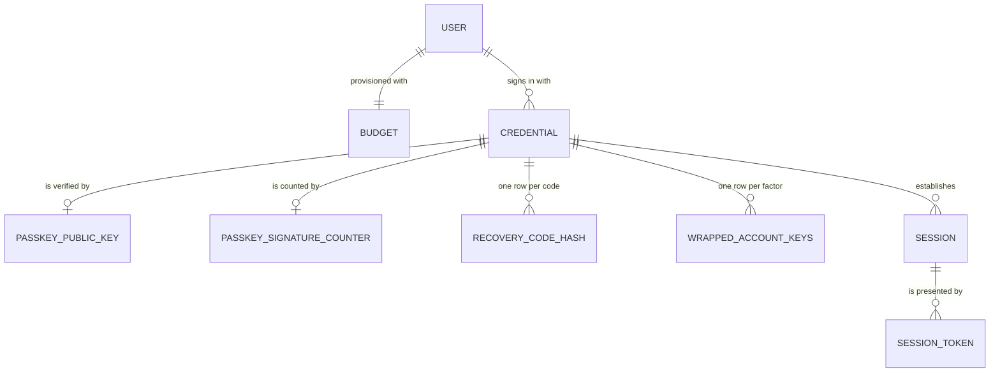
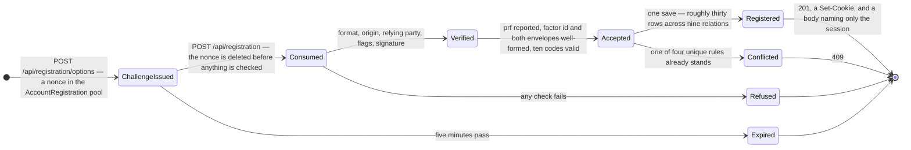
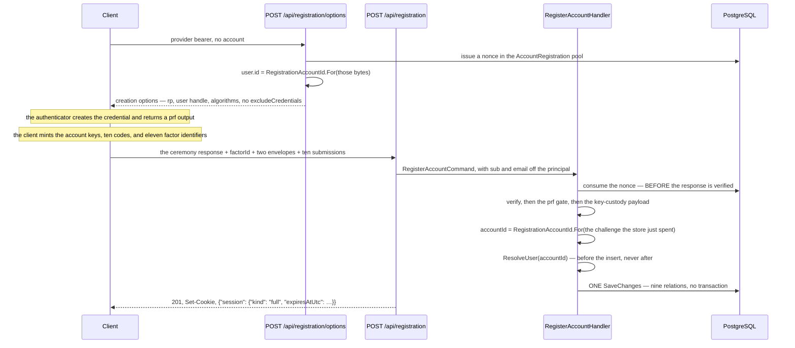

# Registration

## Table of Contents

- [Purpose](#purpose)
- [Key Entities](#key-entities)
- [Constraints](#constraints)
  - [MUST](#must)
  - [MUST NOT](#must-not)
- [Business Rules & Invariants](#business-rules--invariants)
- [Workflows & State Transitions](#workflows--state-transitions)
- [Decision Trees](#decision-trees)
- [Integration Points](#integration-points)
- [Edge Cases & Known Gotchas](#edge-cases--known-gotchas)

## Purpose

This area covers **the one request that brings an account into existence on purpose**. A caller the
identity provider has vouched for runs a WebAuthn registration ceremony, and the request that finishes
it writes the account, its budget, its three credentials, the passkey's key material, ten
recovery-code hashes, every factor's share of the account keys and the session it signs the person in
on — **in one save, or not at all**. Nothing here is a step somebody can stop halfway through and be
left with an account they cannot reach.

Identity itself — who a person is, and which credentials prove it — lives in
[users-and-ownership.md](users-and-ownership.md); the ceremony's cryptography is in
[passkeys.md](passkeys.md); the set is in [recovery-codes.md](recovery-codes.md); what a credential
opens once it has answered lives in [sessions.md](sessions.md). This file covers **the act**: its two
routes, the order its checks run in, and the one value it derives rather than chooses.

**This is the only way an account comes to exist**, and the path is whole on both sides: the
`/register` screen runs the ceremony, draws the account's keys, mints the set, wraps both keys under
all eleven factors and posts the account, and a person who completes it is signed in on the session
that request opened. Nothing else writes a `users` row, so every invariant below, stated as what
**this path** establishes, is also a claim about every account in the schema. See the first gotcha.

The client's half of this act — the order it does things in, what it does with each answer, and the
one refusal it cannot tell apart — is the run of rules at the end of *Business Rules & Invariants*.
What the screen looks like is the **Registration** chapter of
[components.md](../design/components.md).

## Key Entities

- **`RegisterAccountCommand`** — everything one consented registration presents. Two members are read
  off the request's own authenticated principal by the endpoint — the provider `sub` and the `email` —
  and **never bound from the body**. The rest are the wire: `clientDataJson`, `attestationObject`,
  `clientExtensionResults`, `factorId`, `wrappedContentKey`, `wrappedIndexKey`, and `codes`.
- **`RegistrationAccountId`** — the pure function both legs of the ceremony call.
  `SHA-256(domain-separation prefix ‖ challenge)`, first 16 bytes, RFC 9562 version 8 stamped on the
  big-endian layout. It throws rather than padding or truncating a challenge of the wrong width: a
  quietly reshaped challenge derives a perfectly well-formed identifier nothing downstream can tell
  from a real one.
- **`Domain.Users.Registration`** — everything one ceremony brings into existence, **already built and
  already consistent**, so the repository adds and saves and decides nothing. Every member is an
  entity rather than the raw material it was built from, because each domain factory reads its owner,
  its credential and its type off the object beside it.
- **`RegistrationOutcome`** — `SubjectTaken`, `Registered`, `EmailTaken`, `AuthenticatorTaken`,
  `FactorTaken`. `SubjectTaken` is `0` so that `default` is a **refusal**, the fail-closed direction
  `CredentialType` and `SessionKind` already take.
- **`RegistrationClaimGate`** — the `IEndpointFilter` on the group that judges `sub`, `email` and
  `email_verified`, with a distinct title for each of its two refusals. It carries no value out: the
  route delegate reads the two claim members off the principal itself, so nothing plumbed through the
  filter can disagree with what the handler is given.
- **`RegistrationResponse`** — one member, and it describes the sign-in: `{"session": {"kind": "full",
  "expiresAtUtc": …}}`. Nested rather than flattened, so that widening it later cannot produce "kind
  present, expiry absent".

Deliberately **absent** from the request: any member naming an account, a subject or an address.
Deliberately **absent** from the response: the account id, the credential ids, the session id, the
factor ids and any echo of the address. Each identifier this request brings into existence is either
the associated data an envelope was sealed with or a stable handle to something, and a value in a
response body is a value in a client log, a proxy cache and a browser's network panel.



One ceremony writes **nine relations** and roughly thirty rows: 1 user, 1 default budget, 3
credentials, 1 passkey public key, 1 signature counter, 10 recovery-code hashes, 11 wrapped-key rows,
1 session and 1 session token.

## Constraints

### MUST

- **Both routes MUST authenticate on the identity provider's scheme, named by the group's own
  policy.**
  - **Why**: an account cannot exist without a completed provider exchange, and the scheme is what
    enforces that. Naming it is also what makes `AuthorizationMiddleware` re-authenticate against the
    provider's handler rather than against the default, which is the session cookie's — so without the
    name a browser already holding a session could create an account nobody's provider vouched for,
    and no bearer would be read at all. Declaring a policy at all
    takes both routes out of the **fallback** policy and therefore out of `FullSessionRequirement`,
    which is correct rather than worked around: this caller holds no session, so a rule about what
    kind of session may read budget content has nothing to judge.
    - **This policy is the only reason `JwtBearer` is still registered.** Nothing defaults to it, and
      no other route names it, so a provider bearer presented anywhere else authenticates nothing:
      the cookie handler answers `NoResult` and the request gets the same `401` an anonymous one
      gets. That is what makes "an authenticated caller with no account" unreachable everywhere else
      — structurally, rather than by a check some route could forget.
  - **Enforced in**: `RegistrationEndpoints`, one `RequireAuthorization` call on the group, over
    `ProviderAuthentication.SchemeName` — a name rather than the `JwtBearer` literal, because "did the
    provider vouch for this caller?" and "which handler validates the bearer" are the same value only
    until sign-in leaves the identity provider. `RegistrationRouteTests` reads the group's scheme off
    the route table, so it cannot be widened quietly.

- **Both routes MUST carry `RegistrationClaimGate`, declared on the group.**
  - **Why**: the policy says which scheme may speak for this caller; the gate says what that scheme
    has to have said. An account may not exist without a completed provider exchange, and it may not
    exist under an address that exchange declines to vouch for. It runs on **both** legs because the
    options leg is the one that mints the challenge the account identifier is derived from.
  - **Enforced in**: `.AddEndpointFilter<RegistrationClaimGate>()` beside the group's
    `RequireAuthorization`, read off the route table rather than opted into with a marker — a marker
    would rebuild the deleted provisioning middleware under another name, with the same silence when a
    group forgets it. The two refusal titles must stay distinct from each other;
    `RegistrationClaimGateTests` is what holds that.

- **The account identifier MUST be derived from the ceremony's own challenge, and MUST be derived only
  after the challenge store has answered.**
  - **Why**: `user.id` in the creation options is the WebAuthn **user handle**, and the assertion path
    compares a presented handle byte-for-byte against the account id — so a `users.id` that differs
    from the handle answers no assertion that device will ever produce, silently and permanently. On
    the finish leg the only source of the challenge is the client's own `clientDataJSON`, so deriving
    before `ConsumeAsync` has confirmed the bytes were issued and spent for the `AccountRegistration`
    pool is deriving from a value the caller chose.
  - **Enforced in**: `RegistrationAccountId.For`, called from `BeginAccountRegistrationHandler` on the
    bytes the store just issued and from `RegisterAccountHandler` at rung 12 — **after** the consume at
    rung 4. `User.CreateWithId` is the only factory `User` offers and it takes the identifier from
    its caller, so "which path may name an account" is a fact about the call site — one a reviewer
    reads, not one the compiler holds.

- **The identity MUST be published before the insert, and no transaction may wrap the write.**
  - **Why**: an identity published after the insert is one that statement ran without, so every
    policed row in the save meets `''::uuid` and the request dies with `22P02` — the mechanism is the
    rule below, which owns it. It is published *only* then, and not off the provider token at the
    top, because naming an account before the signature verified would be trusting a value the caller
    sent.
  - **Enforced in**: rung 13 of `RegisterAccountHandler`, and by there being **no**
    `ITransactionalExecutor` on this path — see the rule below, which owns the argument.

- **Every row MUST land in one `SaveChanges`.**
  - **Why**: half an account is unreachable and unrepairable in every direction. A user with no
    credential holds the unique email forever; a passkey with no wrapped keys is a factor that opens
    nothing; a set of codes with no hashes can never be redeemed; and a session with no handle is a
    person told they are signed in whose next request is a `401`.
  - **Enforced in**: `RegistrationRepository.RegisterAsync`, which adds every entity and calls
    `SaveChangesAsync` once. EF orders the statements from the foreign keys between the entity types,
    so `users` precedes `credentials` and `sessions` precedes its token whatever order they were added
    in; what the single save buys is the other direction, that there is no window in which some are
    committed and the rest are not.

- **The request MUST carry a set of exactly ten submissions, and the passkey's factor identifier MUST
  differ from all ten.**
  - **Why**: an account whose only factor is one passkey is an account whose keys leave with that
    device, so the set is minted in the same consented act. The eleventh-against-the-ten check is not
    the set's own distinctness rule: left to `PK_wrapped_account_keys` it arrives mid-save as a
    conflict whose sentence tells the caller an identifier is **already registered** — naming a factor
    nobody registered, on a request that was merely wrong, and sending them looking for a request they
    never made.
  - **Enforced in**: `RecoveryCodeSetValidation.DecodeAndValidate` for the set — the one definition
    every write path that accepts a set shares — and rung 11 of `RegisterAccountHandler` for the
    eleventh factor.

### MUST NOT

- **The request body MUST NOT carry a `sub` or an `email`, and neither may ever be added.**
  - **Why**: both arrive on the request's own authentication. A subject a caller could type is an
    account filed under somebody else's provider identity; an address a caller could type makes the
    `email_verified` gate worthless.
  - **Enforced in**: the endpoint reads both off the `ClaimsPrincipal` and passes them on the command,
    which is also what keeps `System.Security.Claims` out of the Application ring — the split
    `SessionEndpoints` already makes for its session id.

- **The options leg MUST refuse a subject that already holds an account, before it issues a nonce.**
  - **Why**: the ceremony runs in the browser, and the authenticator stores the credential the instant
    it agrees. A refusal that waits for the finish leg therefore costs a **passkey** — one saved on
    somebody's device, under a fresh user handle, for an account that was never created — and WebAuthn
    gives a relying party no way to delete it. Only the person can, in their password manager. The
    refusal must also sit **above** `IssueAsync`, or the same request still spends a nonce it was
    always going to be told no about.
  - **Why it is legal to read here**: the lookup is `credentials` by `(provider, subject)` — the
    discovery shape, with no join on `users` — and `credentials` is exempt from row-level security, so
    it answers on a connection naming nobody, which is exactly what the exemption is for. It is not an
    enumeration oracle either: the caller holds a provider-verified token for that exact subject, so
    they can only ever probe themselves.
  - **What does NOT move, and it is a limit rather than an oversight**: the **email** conflict stays on
    the finish leg. Answering it needs a read of `users.email`, `users` is policed by `user_isolation`,
    and this leg publishes no identity — so that read would return nothing or die with `22P02`.
    Somebody whose address another account holds therefore still mints a passkey before being refused.
    The same is true of a race between the two legs, of an abandoned flow, and of `AuthenticatorTaken`
    and `FactorTaken`. This closes the common case, not the class.
  - **The finish leg keeps its own check.** Two requests, so an account can be created between them —
    which is the only way the finish leg's subject conflict is now reachable at all, and the tests that
    reach it say so.
  - **Enforced in**: `BeginAccountRegistrationHandler`, above `IssueAsync`, answering the same sentence
    the finish leg does through the shared `RegistrationConflicts`.

- **The options leg MUST NOT emit an `excludeCredentials` list.**
  - **Why**: three reasons, no one of which settles it alone. There is nothing to exclude, because the
    account does not exist. The read that would produce a list has no acceptable shape — scoped to the
    derived id it is always empty, and unscoped it is an enumeration of every handle in the table,
    which is precisely what the `passkey_public_keys` row-level-security exemption was argued as
    **not** permitting. And a non-empty list would refuse a legitimate act: a WebAuthn credential is
    keyed on (rpId, user handle) and every registration mints a fresh handle, so somebody opening a
    second account from the same laptop would be turned away at the authenticator, by an error the
    server never sees and cannot explain.
  - **Enforced in**: `BeginAccountRegistrationHandler`, which sets `ExcludeCredentials = []` with the
    argument written beside it.

- **The session MUST NOT be opened over the recovery-codes credential.**
  - **Why**: both open a `Full` session, so the mistake satisfies every check constraint, every
    foreign key and every test that reads the response. What it changes is which credential a later
    revocation sweeps — revoking the passkey would leave the session standing, and replacing the set
    would sign the person out of a session their passkey opened.
  - **Enforced in**: `Session.Establish(passkey, …)` in `RegisterAccountHandler`, built from the
    `Credential` and never from a kind named here.

- **The response MUST NOT carry a `Location` header or any identifier.**
  - **Why**: the resource created is the account and this API exposes no address for it, so a
    `Location` naming one would publish the account identifier in a **header** — the one value every
    envelope on this request was sealed against, and the one a body census walks straight past.
  - **Enforced in**: `TypedResults.Created((string?)null, …)` and the shape of `RegistrationResponse`,
    which has members for the session's kind and expiry and none for anything else.

- **The cookie MUST NOT be written before the handler returns.**
  - **Why**: every refusal on this route leaves by exception — a spent challenge, a signature that did
    not verify, a device that cannot hold the keys, a set one code short — so a cookie written
    earlier is a cookie a refusal leaves behind, naming a session that was never written, on the
    client of whoever was guessing.
  - **Enforced in**: the endpoint issues the cookie from the returned handoff, after the `await`.

## Business Rules & Invariants

- **Rule**: The validation ladder is **thirteen rungs and its order is the security property**, not
  an implementation detail.
- **Why**: three rungs carry the whole of it, and each is the one a reader will move.
  - **The nonce is consumed at rung 4, before the response is verified at rung 5.** Consuming
    afterwards leaves every refusal below replayable, so a caller could grind responses against one
    issued challenge — and on this path the challenge is *also* what the account identifier is derived
    from, so a replayable nonce is a replayable account id.
  - **The `prf` gate is rung 6, after verification.** Everything above judges signed material; this
    judges a sentence the client wrote about its own device, so it is weighed only once the response is
    genuine in every verifiable respect — when the device is the only thing left it can be about.
  - **The key-custody payload is rungs 7 to 11, after the `prf` gate.** A client that cannot do PRF
    cannot have produced a wrapped key either, so those members are very often absent on exactly the
    requests that gate is for. Judged first, such a request would be told its **payload** was
    malformed, sending somebody holding a genuinely incapable device off to debug their client.
- **Enforced in**: `RegisterAccountHandler`, with the reason written at each rung.
  `CompleteRegistrationHandler` is the ladder this one mirrors, and where a rung's argument is already
  written out there this one points at it rather than re-deriving it — two copies of an argument are
  two things to keep in step.
- **Counterexample**: hoisting the payload checks to the top "so the cheap validation runs first". Every
  happy path passes, every ordinary refusal passes, and what changes is the sentence somebody with an
  old authenticator is told about why they cannot create an account.
- **Source**: `[SOURCE: discussion]`

---

- **Rule**: **Three rungs of the ladder are not in the handler, and they are the first three.** That
  the request carries a live provider token is judged by the group's own **policy**; that the
  principal has a `sub` and an `email`, and that the provider asserts the address as verified, are
  judged by `RegistrationClaimGate`, an **endpoint filter on the same group**. Both sit above the
  handler and neither is in the Application ring.
- **Why**: that is why the two claim members arrive **on the command** rather than being re-read in the
  handler. The empty-string fallback the endpoint uses when reading them is not a second gate: it
  exists so the expression has a total answer rather than a null-forgiving operator asserting a rule
  enforced one filter away, and an empty address reaches `Email.Create` and is refused there.
  - **They cannot come down into the Application ring, which is where a reader will try to put
    them.** Judging `email_verified` there needs one of two things and may have neither. A
    `ClaimsPrincipal` inside `Application` is against the rule that keeps `System.Security.Claims`
    out of that project altogether — the reason the endpoint reads the two claim members off the
    principal at the call site. And a member on `RegisterAccountCommand` for the answer to land in is
    argued against by name in [users-and-ownership.md](users-and-ownership.md): the verified-email
    claim is read and never stored, and the command carries only the subject and the address
    precisely so there is nowhere for it to go. What is left is the boundary that already holds the
    principal.
  - **Three earlier positions were each refused, and the reasons are not interchangeable.** A
    `RequireAssertion` on the policy and a custom `IAuthorizationRequirement` both answer **403 with
    no title**, collapsing two refusals a caller acts on differently — *your token is unusable* and
    *your provider does not vouch for this address* — into one untitled status.
    `JwtBearerEvents.OnTokenValidated` runs earliest and *can* answer 401, but a titled
    `ProblemDetails` from there needs `OnChallenge` written too, and the gate then becomes a property
    of the **scheme** rather than of the route, invisible to anybody reading the route table. And a
    new middleware reading a new marker is the deleted one under another name.
  - **One accepted behaviour change, recorded because nothing measures it.** A filter runs after model
    binding, so a caller sending an unverified address **and** a malformed body is now answered `400`
    by the framework where the middleware answered `401`. It was put to the repository owner and
    accepted. The cost is worth saying plainly: such a caller learns their body is wrong before they
    learn their address was never going to be accepted, which is a worse order to debug in. It is
    **not** a disclosure — a deserialization failure is a fact about the caller's own request and says
    nothing about what this server stores or about whose address is registered.
- **Enforced in**: `RegistrationEndpoints`, on the group — one `RequireAuthorization` naming the
  provider scheme and one `AddEndpointFilter<RegistrationClaimGate>()`.
  `RegistrationClaimGateTests` is now the only thing holding the two claim rules; it stayed green
  through the middleware's deletion, which is what proved the filter was carrying them rather than
  duplicating them.
- **Source**: `[SOURCE: discussion]`

---

- **Rule**: **No transaction wraps the write, and that is a correctness ruling rather than a cost
  one.**
- **Why**: an `ITransactionalExecutor` opens its transaction through `CreateExecutionStrategy()`, and
  `BeginTransactionAsync` is what opens the connection — which is when `SessionContextInterceptor`
  writes `app.current_user_id`. A wrap whose delegate contains the identity publication therefore
  configures the connection while the setting is still empty, and the `users` INSERT meets `''::uuid`
  in its `WITH CHECK`: a `22P02`. Publishing outside the wrap fixes it at the price of an ordering rule
  nobody may re-break and a retry that must not re-publish; one save carries no such rule.
- **Enforced in**: `RegisterAccountHandler` taking no executor, and by `IRegistrationRepository`
  carrying the argument on the port itself, where the reader who wants to "fix" this back into two
  calls has to go first. **This is the single most likely thing a later reader improves.**
- **Source**: `[SOURCE: discussion]`

---

- **Rule**: The registration repository writes `sessions` and `session_tokens` **itself**, and that is
  a deliberate departure from the boundary `GenerateRecoveryCodesHandler` keeps by hand.
- **Why**: that handler refuses to let `IRecoveryCodeRepository` open a session, because a repository
  named for recovery codes that also opens sessions puts a route's session rule where nobody reading
  the route would look — and it can afford the second call, because both its saves run inside one
  transaction. There is no transaction here, for the reason above, so two calls would be two
  transactions and the atomicity requirement would be lost **silently**: a committed account with no
  session answers `201` and signs nobody in. This repository is named for the act that opens the
  session, which is what makes the fold legible rather than surprising.
- **Enforced in**: `RegistrationRepository`, which adds the session and its token to the same save.
  `ISessionRepository.AddAsync`'s own invariant survives untouched: `Registration` carries the session
  **and** its token, so there is still no shape of any call in this system that writes one without the
  other, and `ISessionTokenRepository` stays read-only. See [sessions.md](sessions.md).
- **Counterexample**: "tidying" this back into `registrationRepository.RegisterAsync` followed by
  `sessionRepository.AddAsync`. Nothing goes red — the tests that read the response still see a
  session, because on the happy path both saves commit.
- **Source**: `[SOURCE: discussion]`

---

- **Rule**: Four collisions answer `409`, each narrowed on a **pinned constraint name**, and
  `EmailTaken` is **ambiguous by construction**.
- **Why**: this save writes rows carrying a dozen unique rules between them, so a `23505` says only
  that some rule broke; naming the index is what makes each catch mean the one thing a caller can act
  on. A losing insert can breach the credential's `(provider, subject)` **and** the email at once, and
  PostgreSQL names only one, picked by the order the rows are written. EF writes `users` before
  `credentials`, so the credential index being named means the email did **not** collide and is
  unambiguous; the email index being named says nothing about the subject. Only the handler can settle
  it, by re-reading the federated credential — and that re-read is sound because a reported unique
  violation means the conflicting transaction committed, so a winning credential on this subject is
  visible by now. Finding none proves the email alone collided.
  - **The race winner is never adopted**, which is where this path diverges from the way the deleted
    provisioning path handled the same race. Adopting would sign the caller into an account **their
    brand-new passkey cannot open** — the winning account holds the winner's factors, not theirs.
  - **The re-read runs on `credentials`**, which is exempt from row-level security, so it is unaffected
    by the identity published at rung 13 naming a row that was never written.
- **Enforced in**: `RegistrationRepository` filters four catches on
  `IX_credentials_provider_subject`, `IX_users_email`,
  `IX_passkey_public_keys_webauthn_credential_id` and `PK_wrapped_account_keys`, detaching every
  queued entity on each so the rejected rows cannot ride along on a later save;
  `RegisterAccountHandler.RefusalFor` chooses the sentence, with `RegistrationOutcome.Registered` and a
  discard arm written out so that adding a member is a decision made there. Any other unique violation
  **propagates on purpose** — a 500 naming the constraint is more useful than a confident, specific,
  false answer.
  - **Three indexes are deliberately not among them, and each is unreachable here besides.**
    `IX_budgets_user_id_name`, `IX_credentials_user_id_federated` and
    `IX_credentials_user_id_recovery_codes` are all keyed on `user_id`, and the `user_id` every row in
    this call carries is derived for **this** registration from a challenge this server minted and has
    just spent — so no other row can share it. `PK_users` is not narrowed either: at 122 bits off a
    single-use nonce, two registrations reaching one account identifier is not chance, and reporting it
    as any of the four would be a sentence about the wrong thing.
  - **Two of the four catches have lost their mis-attribution control, and it has not been replaced.**
    The repository-attribution census cited by name a test that staged an **unrelated** unique
    violation into `IUserRepository.TryAddAsync`'s two-index catch filter, proving the filter did not
    claim violations it should let escape. That method is deleted and the test with it. These four
    catches include the same two index names and there is **no equivalent control at any layer** —
    nothing stages a violation of a third rule into them and asserts it escapes. The census entry for
    this repository argued the missing control was cheap because three of its four indexes are keyed on
    a `user_id` derived for this one registration and therefore uncontendable. That argument is sound
    and it **does not cover these two**: `IX_users_email` and `IX_credentials_provider_subject` are
    keyed on values a stranger holds, which is the entire point of both rules. A control closed a gap;
    a deletion partly reopened it.
- **Source**: `[SOURCE: discussion]`

---

- **Rule**: **Eleven `wrapped_account_keys` rows, never two**, and the set's rows are projected from
  the one validated list rather than zipped from three.
- **Why**: a factor is not a credential. Each code derives its own key-encryption key and a person
  redeems whichever one they still hold, so a single pair for the whole set would seal the account
  under one code and leave the other nine unlocking nothing — with a session handed over either way and
  nothing red until a browser months later. The projection matters for the same reason at one step
  down: pairing one code's verifier with another's envelopes satisfies every constraint the database
  holds and is discovered by somebody who redeemed a code, was handed a session, and found the account
  still locked.
- **Enforced in**: `RegisterAccountHandler`, which builds the passkey's pair against the `passkey`
  credential and the set's ten against the `recoveryCodes` credential — never both against whichever
  credential is nearest to hand, since the two factors derive different key-encryption keys and a
  misfiled row satisfies every check constraint and every foreign key here. See
  [account-keys.md](account-keys.md).
- **Source**: `[SOURCE: user-story]`

---

- **Rule**: The set arrives on a member spelled **`codes`**, matching the generation route rather than
  a more descriptive spelling of its own, and it is `RecoveryCodeSubmission` rather than a wire record
  of this route's own.
- **Why**: `POST /api/me/recovery-codes` is the other write path that accepts a set, so one name across
  both is **one wire contract** — `codes` — for the two write paths a client has, and one shared
  validation. A copy of the submission record would be four declarations able to disagree with that one
  about which spellings a caller may send, on the one member whose shape is a cryptographic binding
  rather than a convenience. Renaming it to `RecoveryCodes` would also camel-case to `recoveryCodes` on
  the wire, which the request-surface census refuses: it admits the token `recovery_code` only directly
  in front of `hash`, so that a member able to hold key material has to be looked at — and answering
  that with a `JsonPropertyName` on a differently-named property is the evasion the census exists to
  catch.
- **Enforced in**: `RegisterAccountCommand.Codes` and the endpoint's own `RegistrationRequest.Codes`,
  both typed `IReadOnlyList<RecoveryCodeSubmission>`.
- **Source**: `[SOURCE: discussion]`

---

- **Rule**: No member of the request is `required`.
- **Why**: an absent member binds to `null` despite the declaration and reaches the handler's own
  refusal — a sentence worded for the person holding the device, raised past the `prf` gate — instead
  of a framework `400` telling somebody whose authenticator genuinely cannot do PRF that their
  *payload* was malformed. It bites hardest on `codes`, where an absent set is refused as a set of the
  wrong size, which is what it is. `factorId` is a `string` for one more reason: the framework parses
  more spellings of a uuid than this contract accepts, so a `Guid` member would silently widen the wire
  format past what `CanonicalFactorId` allows — and that value is the associated data both envelopes
  were sealed with.
- **Enforced in**: the declarations on `RegistrationRequest` and `RegisterAccountCommand`. That
  envelope covers what binds, not what fails to: no body at all, a literal `null`, or a member of the
  wrong JSON type is a framework `400` raised before the handler is entered, and the gap is accepted
  for the reason [erasure.md](erasure.md) states — a deserialization failure is a fact about the
  caller's own request and says nothing about what is stored.
- **Source**: `[SOURCE: discussion]`

---

- **Rule**: **The device agrees before anything secret is minted.** On the client the order is: ask
  for the creation options, run the WebAuthn ceremony, and only then draw the account keys, mint the
  ten codes and wrap eleven times.
- **Why**: this departs from the obvious order — mint the set first, then run the ceremony — and the
  departure is the point. **Cancelling the system passkey sheet is the most common thing that happens
  on that screen.** Minting first leaves that browser holding ten live recovery codes for a flow that
  ended: secrets created for an account that does not exist, on a page whose whole premise is that
  the ten values on it are the account's. It costs nothing to reorder, because the challenge is
  already spent either way — the options leg ran before the sheet opened, and no refusal below it
  gives the nonce back.
  - **The one thing that happens even earlier**: whether the browser can run a ceremony at all is
    asked **before** the options call, which is the only position that costs nothing. A browser that
    was never going to finish would otherwise spend a challenge on its way to being told so — and on
    this route the challenge is also what the account identifier is derived from.
  - **That question is now asked in two places, because the options call moved.** `RegisterService.begin`
    reads it before *its* request for the same reason, and what it does with a `false` is not what the
    passkey step does: it advances the step with no options in hand and no word published, leaving the
    `unsupported` sentence to the screen that has one. Refusing on the introduction instead would be a
    third sentence for a state already spoken for, and would still have to be repeated below, because
    a restart re-enters through the passkey step.
- **Enforced in**: the statement order in `RegisterService.mintUnder`, argued at each line, and by
  `register.service.spec.ts` driving a refusing authenticator and asserting that nothing was
  published, no request was made and no code exists.
- **Source**: `[SOURCE: discussion]`

---

- **Rule**: **There is no retry of the POST — only a restart of the whole ceremony.** A refused
  registration offers *Start again*, never *Try again*, and the assembled body is discarded on every
  outcome.
- **Why**: the challenge is consumed at rung 4, before anything is verified, so a second POST of the
  same body meets the undifferentiated challenge refusal with certainty. A retry control would look
  like a way out and be a way to be told no twice — and it would re-send a whole set's key custody
  to do it. A restart re-draws **everything**: a new challenge, a new passkey, new account keys, ten
  new codes and eleven new factor identifiers. Nothing from the abandoned attempt is reused, and
  nothing could be — the nonce is spent and the account keys were wiped.
- **Enforced in**: `RegisterService.create` clearing the pending body on the `201` and on every
  failure alike, `RegisterService.restart` re-entering at the passkey step, and the screen offering
  no control that re-posts. `refuses to post the same registration twice` and `starts over with a
  different set of codes` hold both halves.
- **Source**: `[SOURCE: discussion]`

---

- **Rule**: **A refusal and a lost answer are separate readings, and they may never be collapsed.**
  A `400`, a `401`, a `403` and a `409` mean *certainly not created*; a network failure, a timeout
  and every `5xx` mean *cannot be told*. **This is about the POST leg**, and the two legs read a
  `401` differently on purpose: here it is one of four refusals meaning the codes on screen are dead,
  while on the options leg it is `provider-token-refused` and nothing has been minted to be dead. One
  status, two facts, because the question each leg was asked is different.
- **Why**: every `400` leaves the handler by exception before the save is reached, a `401` and a
  `403` are refused before the handler is entered at all, and a `409` refuses this request against an
  account that already stands — so on all four the ten codes on screen open nothing, and saying so is
  a kindness. A request that got **no answer** is not evidence: it may have arrived, committed all
  thirty rows and had its `201` lost on the way back. Telling that person their codes are worthless
  tells them to discard the only key to an account they cannot make more codes for, because
  `POST /api/me/recovery-codes` has no caller in this client. It is
  [sessions.md](sessions.md)'s four-valued reading of a probe, on the one screen where collapsing it
  costs an account nobody can ever open again.
- **Enforced in**: `RegisterService.failureOf`, a `switch` on the status with the two groups written
  out and a `default` arm that reads status `0`, every `5xx` and anything a proxy invents as *cannot
  be told*; the screen renders a different heading, a different sentence and a different control for
  each. Four tests drive `400`, `409`, status `0` and `500`, and the component spec pins the two
  sentences whole and asserts they are not the same string.
- **Counterexample**: `error.status >= 400 ? 'refused' : 'unknown'`, which is the shape a reader
  reaches for and which files every `5xx` and every dropped connection under *your account was not
  created*.
- **Source**: `[SOURCE: discussion]`

---

- **Rule**: **The server's four distinct `409` sentences are not reachable from the client, and the
  two states it does render are told apart by what the previous POST ended as — never by anything the
  person pressed.** The first half is a gap with a named cause; the second is a rule.
- **Why**: `ConflictExceptionHandler` writes an identical `Title` for every conflict in the product
  and puts the distinguishing sentence in `Detail` as free text. There is no machine-readable
  discriminant — no code member, no problem `type` per cause — so the only way for a client to tell
  *the subject is taken* from *this authenticator is already registered* is to match on `Detail`,
  which is a second copy of the server's copy held across the wire with nothing to redden when the
  two drift. One wrong sentence is worse than a general one: it would send somebody to sign in with a
  passkey the account does not hold. Closing that gap means giving the server a discriminant, not
  teaching the client to read prose.
  - **What the client *can* know is how its own earlier request ended, and that is the fork that
    matters.** A lost answer is the only ending that leaves the question open, so a `409` after one
    is very likely that browser's own committed registration answering, while a `409` with no such
    ending is a stranger at the front door. Both readings get a sentence of their own; neither is
    chosen from the server's text.
  - **Forking on *Start again* instead was a defect, and the shape is worth keeping.** That control
    is offered from two states, so `400` → restart → `409` rendered *"Your first attempt did create
    your account"* — false in every clause, because every `400`, `401` and `403` leaves the handler
    before a row is written and the passkey the device made was never seen by this server. That
    person was then sent to sign in with it, and met the byte-identical `401` the assertion route
    answers everything with. **A press is not a fact about the server.**
  - **The reading is set only from a lost answer, and nothing later clears it.** It runs one way
    because the three words are not symmetric: a `400` and a `409` are judgements, so neither ever
    opens the question, while a request that may have committed thirty rows stays one whatever the
    next attempt answers — the account it may have created does not stop existing because a later
    request was refused.
  - **Both readings carry the same one control**, a *Go to sign in* that routes to the one screen in
    this application running a passkey assertion. *Start again* is deliberately absent from both: it
    spends another challenge and another passkey to meet the same `409`.
- **Enforced in**: `RegisterService.failureOf` mapping `409` to a single word;
  `RegisterService.mayHaveCreatedAccount`, published from the answer inside the error branch and only
  for the *cannot be told* word; and the shell rendering two states for one word, with the control
  outside the fork.
- **Source**: `[SOURCE: discussion]`

---

- **Rule**: **The `duplicate` ceremony refusal is unreachable from this route today, and the client
  handles it anyway.**
- **Why**: that refusal is the authenticator declining a credential named in `excludeCredentials`,
  and this leg sends an **empty** list by design — there is nothing to exclude, because the account
  does not exist. So the arm cannot fire from `/register` as the flow stands. It is handled because
  the ceremony's failure union is closed and mapped exhaustively: a swallowed arm is a screen showing
  a spinner or an empty region with no sentence on it, and the day a second ceremony reaches this
  service the compiler is what carries the decision rather than a reviewer.
- **Enforced in**: `BeginAccountRegistrationHandler` setting `ExcludeCredentials = []`;
  `RegisterService.ceremonyFailureOf`, a `switch` over the closed union so a sixth word fails to
  compile; and the passkey step's own map from every one of the flow's words to a sentence.
- **Source**: `[SOURCE: discussion]`

---

- **Rule**: **The identity provider's redirect lands on `/register`, and the matching entry in the
  Google Cloud console's authorized redirect URIs is part of that change.**
- **Why**: the registration screen is the only surface that can do anything with a fresh provider
  token — it reads the asserted address off the id token **while that token is still valid**, and
  both legs of this act authenticate as the provider scheme and nothing else. The validity clause is
  load-bearing rather than pedantic: `AuthService.providerEmail` answers `null` for a token whose
  hour has run out, which is what puts the screen back on its **Continue with Google** arm instead of
  showing an address under a promise the next press cannot keep. The site root is the wrong target
  for the same reason it is the obvious one: the app reads that address as *somebody arriving with a
  session*, which a person consenting in order to **create** an account does not have.
  - **No test in this repository can see the other half.** A mismatch is refused by Google with
    `redirect_uri_mismatch` before a single line of this application runs: the browser never comes
    back, so nothing here is reached to fail. Changing the value without changing the console entry
    takes provider sign-in down for everybody, and the only thing that goes red is a person's
    browser.
- **Enforced in**: `auth.google.redirectUri` in the shipped `app-config.json`, pinned by
  `src/registration-redirect-uri.spec.ts`, which reads the **emitted build** rather than the source
  file and also fails when the key is renamed or dropped. The console entry is enforced by nothing
  and is named here so it is read as part of the change rather than as a follow-up.
- **Source**: `[SOURCE: discussion]`

## Workflows & State Transitions



| Transition | Triggered by | Validations |
|---|---|---|
| → ChallengeIssued | `POST /api/registration/options` | a live provider token on the named scheme; `sub`, `email` and `email_verified` from `RegistrationClaimGate` on the same group; **and the subject must hold no account** — judged before the nonce is issued, so a caller who already registered is refused without a passkey being minted. `POST` rather than `GET` because it persists a nonce, so it is neither safe nor idempotent and a `GET` would be cacheable and prefetchable |
| ChallengeIssued → Consumed | `POST /api/registration` | the nonce must exist, be unexpired, and name the **`AccountRegistration`** pool — one undifferentiated refusal covering never issued, already spent, expired, and any of the other three pools |
| Consumed → Verified | `PasskeyRegistrationVerifier.Verify` | client-data type; origin by equality; not cross-origin; `SHA-256(rpId)`; user present **and** verified; attestation `none`; algorithm offered and supported; key strength; the signature |
| Verified → Accepted | rungs 6 to 11 | `prf` reported present and true; `factorId` in the one canonical spelling; both envelopes exactly 61 bytes at version 1; ten submissions, every verifier and every factor identifier distinct; the passkey's identifier differing from all ten |
| Accepted → Registered | `IRegistrationRepository.RegisterAsync` | one `SaveChanges`; the identity is published first, and no transaction wraps it |
| Accepted → Conflicted | the same save | the provider subject, the email, the authenticator's handle, or one of the eleven factor identifiers is already stored |

The session's lifetime is **14 days**, read from `SessionPolicy.Lifetime` — the same value the three
other establishing paths read, which is a rule rather than a coincidence; see
[sessions.md](sessions.md), which owns it.



## Decision Trees

How the finish leg treats a presented registration:

```
IF clientDataJSON or attestationObject is past its ceiling or not base64url   ← nothing is spent
  THEN 400 keyed under Response
ELSE IF clientDataJSON is not the JSON object a ceremony produces             ← nothing is spent
  THEN 400 keyed under Response
ELSE consume the nonce — from here every outcome has burnt it
  IF the row is absent, expired, or names any other pool
    THEN 400 keyed under Response, one undifferentiated sentence
  ELSE IF the registration response does not verify
    THEN 400 keyed under Response
  ELSE IF the client reported no enabled prf result
    THEN 400 naming the authenticator, never the payload
  ELSE IF factorId, either envelope, or the set is malformed
    THEN 400 keyed under the member the caller can correct
  ELSE IF the passkey's factor identifier repeats one of the ten
    THEN 400 keyed under FactorId
  ELSE derive the account id, publish it, and save once
    IF the save lost to the credential's (provider, subject)
      THEN 409 "already registered — sign in with the passkey it holds, or redeem a recovery code"
    ELSE IF it lost to the email index
      re-read the federated credential                       ← the name alone cannot separate the two
      IF one holds this subject now
        THEN 409, the same sentence as above
      ELSE
        THEN 409 "this email address is already linked to a different Google account"
    ELSE IF it lost to the authenticator's handle
      THEN 409 "this authenticator is already registered"
    ELSE IF it lost to a factor identifier
      THEN 409 "mint a fresh one, wrap the account keys under it, and run the ceremony again"
    ELSE
      THEN 201, a Set-Cookie, and a body naming only the session
```

## Integration Points

- **[Passkeys](passkeys.md)** — the ceremony itself, the `AccountRegistration` pool, and why this leg
  sends no `allowCredentials` and no `excludeCredentials`. The `prf` gate and its argument are that
  file's; this route runs the same one at the same position in its own ladder.
- **[Recovery Codes](recovery-codes.md)** — the set. This is the **first issue** for an account and
  the second write path that accepts a set; it sweeps nothing, replaces nothing, and reports no
  `sessionsEnded`, because there is nothing yet to end.
- **[Account Keys](account-keys.md)** — the eleven envelopes and the one spelling of a factor
  identifier. This is the **third** path that writes `wrapped_account_keys`.
- **[Sessions](sessions.md)** — the **fourth** thing that establishes a session, and like the other
  three it mints a handle and sets the cookie.
- **[Users & Ownership](users-and-ownership.md)** — the account, its credentials, and the invariant
  this path establishes, which is now the invariant of every account there is.
- **[Budgets](budgets.md)** — the nameless default budget, created in the same save.
- **`RegistrationClaimGate`** — the two claim rules, why they sit at this boundary rather than in the
  Application ring, and the `400`-before-`401` ordering that placement accepts.
- **`FirstPartyRequestMiddleware`** — both routes require a non-empty `X-Budgetoid-Client` header like
  every route but `GET /health`. That control covers this surface for the reason it covers the
  anonymous one: these are routes that **set a cookie**.
- **The `/register` screen** — the caller for all of it. Its anatomy, its passkey refusal sentences
  and its four post-request states are the **Registration** chapter of
  [components.md](../design/components.md); why it is a linear sequence of full screens rather than a
  checklist is in [patterns.md](../design/patterns.md). Both of its requests carry the
  `EXPECTS_UNAUTHENTICATED` context token, so a `401` from either is read as this request's verdict
  rather than as a session ending — see [sessions.md](sessions.md). **What the options leg then does
  with that verdict is its own word.** A `401` there means the provider token this browser attached
  was rejected, which is almost always an hour having passed, so the client publishes
  `provider-token-refused` and both steps that can receive it offer **Continue with Google** — the
  one act that changes the answer. It is deliberately not `start-failed`: that sentence says the
  server could not be reached, and this server answered. A `403` on the same route **is**
  `start-failed`, because that is the `X-Budgetoid-Client` refusal, a client defect no provider
  exchange repairs.

## Edge Cases & Known Gotchas

- **What is built and what is not.** Both routes exist, the whole write is tested, and a person can
  reach them: `/register` runs the ceremony and posts the account, and the response really does sign
  them in. A returning person signs in with that passkey from `/welcome`, and the provider is not
  contacted on that path at all. **There is no second way in any more** — the provisioning middleware
  is deleted, so every invariant in this file is a claim about every account in the schema. What is
  **not** built beside it is the rest of the client's passkey
  surface: nothing registers a second passkey, and nothing runs the fresh assertion the erasure,
  revocation and recovery-code-generation gates need.
- **Somebody who already has an account is refused at the options leg, and the passkey sheet never
  opens.** The welcome screen offers two ways in and **Create account** is the Primary of the two, so
  an existing account holder reaching for it rather than for **Sign in with a passkey** lands on
  `/register` — and the first request that screen makes now comes back `409`. No system sheet, no
  card of ten codes, and no credential left on the authenticator. **That request is made by the
  introduction's own `Continue`**, so the refusal replaces the promise that named the address rather
  than arriving a screen after it: `begin` asks, and the step moves only on an answer that allows it.
  - **This is not the enumeration oracle a dedicated route would be.** There is still **no route that
    answers "does this subject have an account?"**, and there must not be. What the options leg
    answers is narrower: it refuses *this caller's own* registration, to a caller who arrived holding
    a provider-verified token for that exact subject. They can only ever ask about themselves, and
    they already knew the answer.
  - **What it does not cover is written down beside it**, because the shape is easy to mistake for a
    guarantee: a passkey is still minted before the refusal when the *address* collides rather than
    the subject (that read is impossible here — see the rule above), when the account is created
    between the two legs, and whenever somebody simply abandons the flow after agreeing on the
    device. A relying party cannot delete a credential from an authenticator; only the person can, in
    their password manager.
- **After a lost answer and a restart, the live codes are the *first* attempt's.** The *cannot be
  told* state offers *Start again* precisely because a second attempt settles the question: if the
  first request did commit, the second meets the `409` and says so plainly. But the account it names
  is the one the first attempt created, locked under the first attempt's keys — so somebody who
  discarded that first card and kept the second holds a passkey and no codes and no way to make more,
  since `POST /api/me/recovery-codes` has no caller in this client. The screen's sentence therefore
  says **keep** the codes you saved, and the `409` that follows says the same thing from the other
  end: it names the first attempt as the one that worked and the codes on screen as the dead ones.
- **A `409` is rendered on all three steps, and no two of the sentences are copies.** The options
  leg's lands on the **introduction**, which is where `RegisterService.begin` asks and where the
  answer ordinarily arrives — nothing minted, no challenge issued, no sheet opened. It still lands on
  the **passkey** step for the refetch a restart or a failed ceremony makes, which another tab or
  another device can have raced in between. The finish leg's lands in place of the codes step. The
  sentences differ in the one clause a person acts on: the shell's two both say the ten codes just
  shown open nothing, which is false on the earlier leg; and the passkey step's ends "no passkey was
  made", which is worth saying where a system sheet was on the screen a moment ago and says nothing
  at all on the introduction, where no passkey was ever going to be made. So each step carries its
  own, and its own *Go to sign in* beside it. Those are three controls rather than one shared one
  **on purpose**: each renders on a different step and none can hand its markup to another, so what a
  shared owner would save is the address and nothing else, while an output left unbound compiles,
  lints, passes the step's own spec and ships a dead button — the exact defect this control exists to
  remove. All three copies are pinned by specs that press the control and read where the router was
  asked to go.
  - **On the codes step the one control serves both readings of the `409`, and is rendered outside
    the fork** — a control written twice is one somebody forgets. It is a **button** rather than a
    link: `/register` carries no navigation of its own, so this is an exit from a flow that has
    ended, and opening it in a new tab would leave the dead end standing in the old one with ten
    worthless codes on it.
- **Moving the derivation up is the one edit that turns a function into a vulnerability.** Rung 12 sits
  after rung 4 and nothing about the code's shape says so — `clientData.Challenge` is in scope from
  rung 3, so hoisting the derivation beside the parse compiles, reads tidier, and passes every test in
  the suite. What it changes is that the identifier is then derived from a value the caller supplied.
  `RegistrationAccountId` carries the argument; the call site carries the pointer.
- **A short challenge derives a perfectly good-looking identifier.** `RegistrationAccountId.For` throws
  on any width but 32 rather than padding or truncating, because the dangerous direction is the quiet
  one: fewer bytes than the design claims, in a value nothing downstream can distinguish from a real
  one. The constant is restated in the Application ring rather than shared with the challenge store,
  which sits in Infrastructure — the refusal is what keeps the two honest.
- **The account identifier is not time-ordered, and every other identifier in this schema is.** A
  version 7 uuid appends at the right-hand edge of an index; a hash-derived one scatters `users`
  primary-key inserts. `users` is low-volume and one row per account is the rarest insert in the
  product, so the trade is right — but it is a real cost, recorded in
  [ADR 0021](../decisions/0021-make-registration-one-consented-act-and-derive-the-account-id-from-its-own-challenge.md)
  rather than glossed.
- **A `409` here is not an enumeration oracle, and the reason is the provider.** The email conflict is
  answered to a caller who has **just proved control of that address** through the identity provider,
  so it discloses nothing they could not learn by signing in. The other two facts are about their own
  device and about a value their own client chose. Do not "harden" these into one undifferentiated
  refusal: the sentences are what tell somebody holding a completed ceremony and a card of codes their
  client has very likely already shown them that none of it is needed.
- **The refusals past the decode all spend the challenge.** The two ceiling refusals and the parse
  refusal sit above `ConsumeAsync` and spend nothing; everything from rung 4 down burns the nonce. So a
  client refused for its authenticator, its payload or a lost race must return to the options leg for a
  fresh nonce — and a fresh nonce means a **different account identifier**, which is why the factor
  conflict's sentence says to mint a fresh identifier and wrap the keys again rather than to retry.
- **The `null` arm on the cookie write is unreachable and is written as a pattern anyway.** A
  registration that returns has established a session. The alternative is a null-forgiving operator
  asserting a rule that lives in another project, and the shape matches the three other establishing
  legs.
- **A caller whose token is fine and whose body is not now learns about the body first.** The claim
  gate is an endpoint filter, and a filter runs after model binding, so an unverified address plus a
  malformed payload answers `400` where it used to answer `401`. Accepted, unmeasured, and recorded
  under the ladder rule above so nobody reads it as a regression somebody missed.
