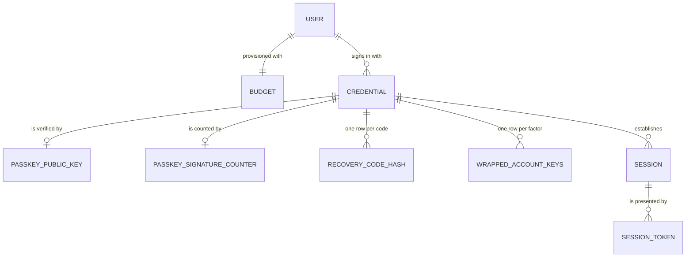
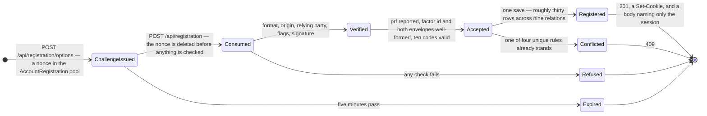
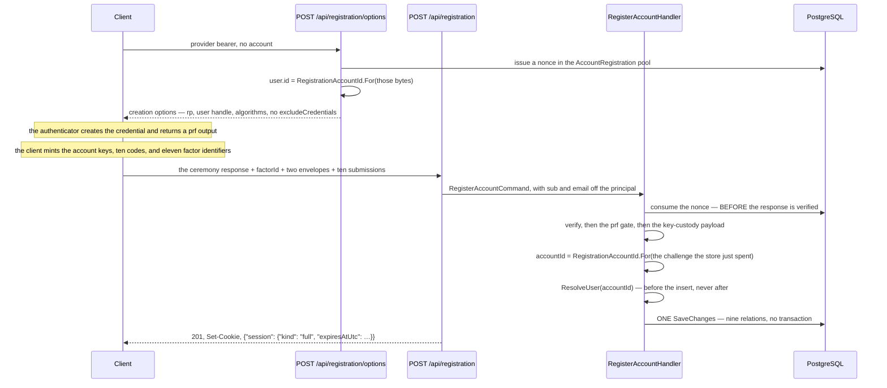

# Registration

## Table of Contents

- [Purpose](#purpose)
- [Key Entities](#key-entities)
- [Constraints](#constraints)
  - [MUST](#must)
  - [MUST NOT](#must-not)
- [Business Rules & Invariants](#business-rules--invariants)
- [Workflows & State Transitions](#workflows--state-transitions)
- [Decision Trees](#decision-trees)
- [Integration Points](#integration-points)
- [Edge Cases & Known Gotchas](#edge-cases--known-gotchas)

## Purpose

This area covers **the one request that brings an account into existence on purpose**. A caller the
identity provider has vouched for runs a WebAuthn registration ceremony, and the request that finishes
it writes the account, its budget, its three credentials, the passkey's key material, ten
recovery-code hashes, every factor's share of the account keys and the session it signs the person in
on — **in one save, or not at all**. Nothing here is a step somebody can stop halfway through and be
left with an account they cannot reach.

Identity itself — who a person is, and which credentials prove it — lives in
[users-and-ownership.md](users-and-ownership.md); the ceremony's cryptography is in
[passkeys.md](passkeys.md); the card is in [recovery-codes.md](recovery-codes.md); what a credential
opens once it has answered lives in [sessions.md](sessions.md). This file covers **the act**: its two
routes, the order its checks run in, and the one value it derives rather than chooses.

**Two things are true today that a reader must hold together.** The path is whole on the server and is
reached by nothing but the integration suite — **no browser screen runs this ceremony**. And the older
way in is still live: `UserProvisioningMiddleware` still mints an account from any authenticated
request reaching one of six marked route groups, and an account minted that way holds one federated
credential and no way to read itself. Every invariant below is stated as what **this path**
establishes. See the first gotcha.

## Key Entities

- **`RegisterAccountCommand`** — everything one consented registration presents. Two members are read
  off the request's own authenticated principal by the endpoint — the provider `sub` and the `email` —
  and **never bound from the body**. The rest are the wire: `clientDataJson`, `attestationObject`,
  `clientExtensionResults`, `factorId`, `wrappedContentKey`, `wrappedIndexKey`, and `codes`.
- **`RegistrationAccountId`** — the pure function both legs of the ceremony call.
  `SHA-256(domain-separation prefix ‖ challenge)`, first 16 bytes, RFC 9562 version 8 stamped on the
  big-endian layout. It throws rather than padding or truncating a challenge of the wrong width: a
  quietly reshaped challenge derives a perfectly well-formed identifier nothing downstream can tell
  from a real one.
- **`Domain.Users.Registration`** — everything one ceremony brings into existence, **already built and
  already consistent**, so the repository adds and saves and decides nothing. Every member is an
  entity rather than the raw material it was built from, because each domain factory reads its owner,
  its credential and its type off the object beside it.
- **`RegistrationOutcome`** — `SubjectTaken`, `Registered`, `EmailTaken`, `AuthenticatorTaken`,
  `FactorTaken`. `SubjectTaken` is `0` so that `default` is a **refusal**, the fail-closed direction
  `CredentialType` and `SessionKind` already take.
- **`RegistersAccountAttribute`** — endpoint metadata declaring that a request here legitimately
  resolves to nobody. **It publishes no identity, and that absence is the marker.**
- **`RegistrationResponse`** — one member, and it describes the sign-in: `{"session": {"kind": "full",
  "expiresAtUtc": …}}`. Nested rather than flattened, so that widening it later cannot produce "kind
  present, expiry absent".

Deliberately **absent** from the request: any member naming an account, a subject or an address.
Deliberately **absent** from the response: the account id, the credential ids, the session id, the
factor ids and any echo of the address. Each identifier this request brings into existence is either
the associated data an envelope was sealed with or a stable handle to something, and a value in a
response body is a value in a client log, a proxy cache and a browser's network panel.



One ceremony writes **nine relations** and roughly thirty rows: 1 user, 1 default budget, 3
credentials, 1 passkey public key, 1 signature counter, 10 recovery-code hashes, 11 wrapped-key rows,
1 session and 1 session token.

## Constraints

### MUST

- **Both routes MUST authenticate on the identity provider's scheme, named by the group's own
  policy.**
  - **Why**: an account cannot exist without a completed provider exchange, and the scheme is what
    enforces that. Naming it is also what makes `AuthorizationMiddleware` re-authenticate against the
    provider's handler rather than against whatever the default resolves to — today a policy scheme
    forwarding a cookie-bearing request to the session handler, so without the name a browser already
    holding a session could create an account nobody's provider vouched for. Declaring a policy at all
    takes both routes out of the **fallback** policy and therefore out of `FullSessionRequirement`,
    which is correct rather than worked around: this caller holds no session, so a rule about what
    kind of session may read budget content has nothing to judge.
  - **Enforced in**: `RegistrationEndpoints`, one `RequireAuthorization` call on the group, over
    `ProviderAuthentication.SchemeName` — a name rather than the `JwtBearer` literal, because "did the
    provider vouch for this caller?" and "which handler validates the bearer" are the same value only
    until sign-in leaves the identity provider.

- **The route group MUST carry `RegistersAccount`, and MUST NOT carry `ProvisionsUser`.**
  - **Why**: `UserProvisioningMiddleware` runs before the endpoint's own policy, so without the marker
    a provider principal with no account is refused `NoAccountTitle` before the handler is entered.
    The two markers on one route is a contradiction the middleware cannot honour — it reads this one
    first and returns, so the find-or-create arm is never reached, and the route would create nothing
    while declaring that it may.
  - **Enforced in**: `.WithMetadata(new RegistersAccountAttribute())` on the group, and the arm in
    `UserProvisioningMiddleware` that returns on it. Its position is load-bearing in both directions:
    **below** the `sub`/`email` and `email_verified` claim gates, so a registration route is still
    subject to them; **above** the resolve, because a caller about to register has by definition no
    account to resolve.

- **The account identifier MUST be derived from the ceremony's own challenge, and MUST be derived only
  after the challenge store has answered.**
  - **Why**: `user.id` in the creation options is the WebAuthn **user handle**, and the assertion path
    compares a presented handle byte-for-byte against the account id — so a `users.id` that differs
    from the handle answers no assertion that device will ever produce, silently and permanently. On
    the finish leg the only source of the challenge is the client's own `clientDataJSON`, so deriving
    before `ConsumeAsync` has confirmed the bytes were issued and spent for the `AccountRegistration`
    pool is deriving from a value the caller chose.
  - **Enforced in**: `RegistrationAccountId.For`, called from `BeginAccountRegistrationHandler` on the
    bytes the store just issued and from `RegisterAccountHandler` at rung 12 — **after** the consume at
    rung 4. `User.CreateWithId` is a second factory rather than an optional parameter on `User.Create`,
    so "which path may name an account" is a fact about the call site.

- **The identity MUST be published before the insert, and no transaction may wrap the write.**
  - **Why**: `app.current_user_id` reaches the database on the next connection open, and the `users`
    INSERT is checked against it, so an identity published afterwards is one that statement ran
    without — every policed row in the save meets `''::uuid` and the request dies with `22P02`. It is
    published *only* then, and not off the provider token at the top, because naming an account before
    the signature verified would be trusting a value the caller sent.
  - **Enforced in**: rung 13 of `RegisterAccountHandler`, and by there being **no**
    `ITransactionalExecutor` on this path — see the rule below, which owns the argument.

- **Every row MUST land in one `SaveChanges`.**
  - **Why**: half an account is unreachable and unrepairable in every direction. A user with no
    credential holds the unique email forever; a passkey with no wrapped keys is a factor that opens
    nothing; a set of codes with no hashes can never be redeemed; and a session with no handle is a
    person told they are signed in whose next request is a `401`.
  - **Enforced in**: `RegistrationRepository.RegisterAsync`, which adds every entity and calls
    `SaveChangesAsync` once. EF orders the statements from the foreign keys between the entity types,
    so `users` precedes `credentials` and `sessions` precedes its token whatever order they were added
    in; what the single save buys is the other direction, that there is no window in which some are
    committed and the rest are not.

- **The request MUST carry a card of exactly ten submissions, and the passkey's factor identifier MUST
  differ from all ten.**
  - **Why**: an account whose only factor is one passkey is an account whose keys leave with that
    device, so the card is minted in the same consented act. The eleventh-against-the-ten check is not
    the set's own distinctness rule: left to `PK_wrapped_account_keys` it arrives mid-save as a
    conflict whose sentence tells the caller an identifier is **already registered** — naming a factor
    nobody registered, on a request that was merely wrong, and sending them looking for a request they
    never made.
  - **Enforced in**: `RecoveryCodeSetValidation.DecodeAndValidate` for the set — the one definition
    every write path that accepts a set shares — and rung 11 of `RegisterAccountHandler` for the
    eleventh factor.

### MUST NOT

- **The request body MUST NOT carry a `sub` or an `email`, and neither may ever be added.**
  - **Why**: both arrive on the request's own authentication. A subject a caller could type is an
    account filed under somebody else's provider identity; an address a caller could type makes the
    `email_verified` gate worthless.
  - **Enforced in**: the endpoint reads both off the `ClaimsPrincipal` and passes them on the command,
    which is also what keeps `System.Security.Claims` out of the Application ring — the split
    `SessionEndpoints` already makes for its session id.

- **The options leg MUST NOT emit an `excludeCredentials` list.**
  - **Why**: three reasons, no one of which settles it alone. There is nothing to exclude, because the
    account does not exist. The read that would produce a list has no acceptable shape — scoped to the
    derived id it is always empty, and unscoped it is an enumeration of every handle in the table,
    which is precisely what the `passkey_public_keys` row-level-security exemption was argued as
    **not** permitting. And a non-empty list would refuse a legitimate act: a WebAuthn credential is
    keyed on (rpId, user handle) and every registration mints a fresh handle, so somebody opening a
    second account from the same laptop would be turned away at the authenticator, by an error the
    server never sees and cannot explain.
  - **Enforced in**: `BeginAccountRegistrationHandler`, which sets `ExcludeCredentials = []` with the
    argument written beside it.

- **The session MUST NOT be opened over the recovery-codes credential.**
  - **Why**: both open a `Full` session, so the mistake satisfies every check constraint, every
    foreign key and every test that reads the response. What it changes is which credential a later
    revocation sweeps — revoking the passkey would leave the session standing, and replacing the card
    would sign the person out of a session their passkey opened.
  - **Enforced in**: `Session.Establish(passkey, …)` in `RegisterAccountHandler`, built from the
    `Credential` and never from a kind named here.

- **The response MUST NOT carry a `Location` header or any identifier.**
  - **Why**: the resource created is the account and this API exposes no address for it, so a
    `Location` naming one would publish the account identifier in a **header** — the one value every
    envelope on this request was sealed against, and the one a body census walks straight past.
  - **Enforced in**: `TypedResults.Created((string?)null, …)` and the shape of `RegistrationResponse`,
    which has members for the session's kind and expiry and none for anything else.

- **The cookie MUST NOT be written before the handler returns.**
  - **Why**: every refusal on this route leaves by exception — a spent challenge, a signature that did
    not verify, a device that cannot hold the keys, a card one code short — so a cookie written
    earlier is a cookie a refusal leaves behind, naming a session that was never written, on the
    client of whoever was guessing.
  - **Enforced in**: the endpoint issues the cookie from the returned handoff, after the `await`.

## Business Rules & Invariants

- **Rule**: The validation ladder is **fourteen rungs and its order is the security property**, not an
  implementation detail.
- **Why**: three rungs carry the whole of it, and each is the one a reader will move.
  - **The nonce is consumed at rung 4, before the response is verified at rung 5.** Consuming
    afterwards leaves every refusal below replayable, so a caller could grind responses against one
    issued challenge — and on this path the challenge is *also* what the account identifier is derived
    from, so a replayable nonce is a replayable account id.
  - **The `prf` gate is rung 6, after verification.** Everything above judges signed material; this
    judges a sentence the client wrote about its own device, so it is weighed only once the response is
    genuine in every verifiable respect — when the device is the only thing left it can be about.
  - **The key-custody payload is rungs 7 to 11, after the `prf` gate.** A client that cannot do PRF
    cannot have produced a wrapped key either, so those members are very often absent on exactly the
    requests that gate is for. Judged first, such a request would be told its **payload** was
    malformed, sending somebody holding a genuinely incapable device off to debug their client.
- **Enforced in**: `RegisterAccountHandler`, with the reason written at each rung.
  `CompleteRegistrationHandler` is the ladder this one mirrors, and where a rung's argument is already
  written out there this one points at it rather than re-deriving it — two copies of an argument are
  two things to keep in step.
- **Counterexample**: hoisting the payload checks to the top "so the cheap validation runs first". Every
  happy path passes, every ordinary refusal passes, and what changes is the sentence somebody with an
  old authenticator is told about why they cannot create an account.
- **Source**: `[SOURCE: discussion]`

---

- **Rule**: **Three rungs of the ladder are not here, and they are the first three.** That the request
  carries a live provider token, that the principal has a `sub` and an `email`, and that the provider
  asserts the address as verified are all judged by `UserProvisioningMiddleware`, above this handler
  and above the route's own policy.
- **Why**: that is why the two claim members arrive **on the command** rather than being re-read in the
  handler. The empty-string fallback the endpoint uses when reading them is not a second gate: it
  exists so the expression has a total answer rather than a null-forgiving operator asserting a rule
  enforced two middlewares away, and an empty address reaches `Email.Create` and is refused there.
- **Enforced in**: the claim gates in `UserProvisioningMiddleware`, which sit **above** the
  `RegistersAccount` arm. The three come down into the Application ring in the commit that deletes the
  middleware, and they land at the top of this ladder.
- **Source**: `[SOURCE: discussion]`

---

- **Rule**: **No transaction wraps the write, and that is a correctness ruling rather than a cost
  one.**
- **Why**: an `ITransactionalExecutor` opens its transaction through `CreateExecutionStrategy()`, and
  `BeginTransactionAsync` is what opens the connection — which is when `SessionContextInterceptor`
  writes `app.current_user_id`. A wrap whose delegate contains the identity publication therefore
  configures the connection while the setting is still empty, and the `users` INSERT meets `''::uuid`
  in its `WITH CHECK`: a `22P02`. Publishing outside the wrap fixes it at the price of an ordering rule
  nobody may re-break and a retry that must not re-publish; one save carries no such rule.
- **Enforced in**: `RegisterAccountHandler` taking no executor, and by `IRegistrationRepository`
  carrying the argument on the port itself, where the reader who wants to "fix" this back into two
  calls has to go first. **This is the single most likely thing a later reader improves.**
- **Source**: `[SOURCE: discussion]`

---

- **Rule**: The registration repository writes `sessions` and `session_tokens` **itself**, and that is
  a deliberate departure from the boundary `GenerateRecoveryCodesHandler` keeps by hand.
- **Why**: that handler refuses to let `IRecoveryCodeRepository` open a session, because a repository
  named for recovery codes that also opens sessions puts a route's session rule where nobody reading
  the route would look — and it can afford the second call, because both its saves run inside one
  transaction. There is no transaction here, for the reason above, so two calls would be two
  transactions and the atomicity requirement would be lost **silently**: a committed account with no
  session answers `201` and signs nobody in. This repository is named for the act that opens the
  session, which is what makes the fold legible rather than surprising.
- **Enforced in**: `RegistrationRepository`, which adds the session and its token to the same save.
  `ISessionRepository.AddAsync`'s own invariant survives untouched: `Registration` carries the session
  **and** its token, so there is still no shape of any call in this system that writes one without the
  other, and `ISessionTokenRepository` stays read-only. See [sessions.md](sessions.md).
- **Counterexample**: "tidying" this back into `registrationRepository.RegisterAsync` followed by
  `sessionRepository.AddAsync`. Nothing goes red — the tests that read the response still see a
  session, because on the happy path both saves commit.
- **Source**: `[SOURCE: discussion]`

---

- **Rule**: Four collisions answer `409`, each narrowed on a **pinned constraint name**, and
  `EmailTaken` is **ambiguous by construction**.
- **Why**: this save writes rows carrying a dozen unique rules between them, so a `23505` says only
  that some rule broke; naming the index is what makes each catch mean the one thing a caller can act
  on. A losing insert can breach the credential's `(provider, subject)` **and** the email at once, and
  PostgreSQL names only one, picked by the order the rows are written. EF writes `users` before
  `credentials`, so the credential index being named means the email did **not** collide and is
  unambiguous; the email index being named says nothing about the subject. Only the handler can settle
  it, by re-reading the federated credential — and that re-read is sound because a reported unique
  violation means the conflicting transaction committed, so a winning credential on this subject is
  visible by now. Finding none proves the email alone collided.
  - **The race winner is never adopted**, which is where this path diverges from provisioning's own
    race. Adopting would sign the caller into an account **their brand-new passkey cannot open** — the
    winning account holds the winner's factors, not theirs.
  - **The re-read runs on `credentials`**, which is exempt from row-level security, so it is unaffected
    by the identity published at rung 13 naming a row that was never written.
- **Enforced in**: `RegistrationRepository` filters four catches on
  `IX_credentials_provider_subject`, `IX_users_email`,
  `IX_passkey_public_keys_webauthn_credential_id` and `PK_wrapped_account_keys`, detaching every
  queued entity on each so the rejected rows cannot ride along on a later save;
  `RegisterAccountHandler.RefusalFor` chooses the sentence, with `RegistrationOutcome.Registered` and a
  discard arm written out so that adding a member is a decision made there. Any other unique violation
  **propagates on purpose** — a 500 naming the constraint is more useful than a confident, specific,
  false answer.
  - **Three indexes are deliberately not among them, and each is unreachable here besides.**
    `IX_budgets_user_id_name`, `IX_credentials_user_id_federated` and
    `IX_credentials_user_id_recovery_codes` are all keyed on `user_id`, and the `user_id` every row in
    this call carries is derived for **this** registration from a challenge this server minted and has
    just spent — so no other row can share it. `PK_users` is not narrowed either: at 122 bits off a
    single-use nonce, two registrations reaching one account identifier is not chance, and reporting it
    as any of the four would be a sentence about the wrong thing.
- **Source**: `[SOURCE: discussion]`

---

- **Rule**: **Eleven `wrapped_account_keys` rows, never two**, and the card's rows are projected from
  the one validated list rather than zipped from three.
- **Why**: a factor is not a credential. Each code derives its own key-encryption key and a person
  redeems whichever one they still hold, so a single pair for the whole card would seal the account
  under one code and leave the other nine unlocking nothing — with a session handed over either way and
  nothing red until a browser months later. The projection matters for the same reason at one step
  down: pairing one code's verifier with another's envelopes satisfies every constraint the database
  holds and is discovered by somebody who redeemed a code, was handed a session, and found the account
  still locked.
- **Enforced in**: `RegisterAccountHandler`, which builds the passkey's pair against the `passkey`
  credential and the card's ten against the `recoveryCodes` credential — never both against whichever
  credential is nearest to hand, since the two factors derive different key-encryption keys and a
  misfiled row satisfies every check constraint and every foreign key here. See
  [account-keys.md](account-keys.md).
- **Source**: `[SOURCE: user-story]`

---

- **Rule**: The set arrives on a member spelled **`codes`**, matching the generation route rather than
  a more descriptive spelling of its own, and it is `RecoveryCodeSubmission` rather than a wire record
  of this route's own.
- **Why**: `POST /api/me/recovery-codes` is the other write path that accepts a set, so one name across
  both is **one wire contract** — `codes` — for the two write paths a client has, and one shared
  validation. A copy of the submission record would be four declarations able to disagree with that one
  about which spellings a caller may send, on the one member whose shape is a cryptographic binding
  rather than a convenience. Renaming it to `RecoveryCodes` would also camel-case to `recoveryCodes` on
  the wire, which the request-surface census refuses: it admits the token `recovery_code` only directly
  in front of `hash`, so that a member able to hold key material has to be looked at — and answering
  that with a `JsonPropertyName` on a differently-named property is the evasion the census exists to
  catch.
- **Enforced in**: `RegisterAccountCommand.Codes` and the endpoint's own `RegistrationRequest.Codes`,
  both typed `IReadOnlyList<RecoveryCodeSubmission>`.
- **Source**: `[SOURCE: discussion]`

---

- **Rule**: No member of the request is `required`.
- **Why**: an absent member binds to `null` despite the declaration and reaches the handler's own
  refusal — a sentence worded for the person holding the device, raised past the `prf` gate — instead
  of a framework `400` telling somebody whose authenticator genuinely cannot do PRF that their
  *payload* was malformed. It bites hardest on `codes`, where an absent set is refused as a set of the
  wrong size, which is what it is. `factorId` is a `string` for one more reason: the framework parses
  more spellings of a uuid than this contract accepts, so a `Guid` member would silently widen the wire
  format past what `CanonicalFactorId` allows — and that value is the associated data both envelopes
  were sealed with.
- **Enforced in**: the declarations on `RegistrationRequest` and `RegisterAccountCommand`. That
  envelope covers what binds, not what fails to: no body at all, a literal `null`, or a member of the
  wrong JSON type is a framework `400` raised before the handler is entered, and the gap is accepted
  for the reason [erasure.md](erasure.md) states — a deserialization failure is a fact about the
  caller's own request and says nothing about what is stored.
- **Source**: `[SOURCE: discussion]`

## Workflows & State Transitions



| Transition | Triggered by | Validations |
|---|---|---|
| → ChallengeIssued | `POST /api/registration/options` | a live provider token on the named scheme; `sub`, `email` and `email_verified` from the middleware. `POST` rather than `GET` because it persists a nonce, so it is neither safe nor idempotent and a `GET` would be cacheable and prefetchable |
| ChallengeIssued → Consumed | `POST /api/registration` | the nonce must exist, be unexpired, and name the **`AccountRegistration`** pool — one undifferentiated refusal covering never issued, already spent, expired, and any of the other three pools |
| Consumed → Verified | `PasskeyRegistrationVerifier.Verify` | client-data type; origin by equality; not cross-origin; `SHA-256(rpId)`; user present **and** verified; attestation `none`; algorithm offered and supported; key strength; the signature |
| Verified → Accepted | rungs 6 to 11 | `prf` reported present and true; `factorId` in the one canonical spelling; both envelopes exactly 61 bytes at version 1; ten submissions, every verifier and every factor identifier distinct; the passkey's identifier differing from all ten |
| Accepted → Registered | `IRegistrationRepository.RegisterAsync` | one `SaveChanges`; the identity is published first, and no transaction wraps it |
| Accepted → Conflicted | the same save | the provider subject, the email, the authenticator's handle, or one of the eleven factor identifiers is already stored |

The session's lifetime is **14 days**, read from `SessionPolicy.Lifetime` — the same value the three
other establishing paths read, which is a rule rather than a coincidence; see
[sessions.md](sessions.md), which owns it.



## Decision Trees

How the finish leg treats a presented registration:

```
IF clientDataJSON or attestationObject is past its ceiling or not base64url   ← nothing is spent
  THEN 400 keyed under Response
ELSE IF clientDataJSON is not the JSON object a ceremony produces             ← nothing is spent
  THEN 400 keyed under Response
ELSE consume the nonce — from here every outcome has burnt it
  IF the row is absent, expired, or names any other pool
    THEN 400 keyed under Response, one undifferentiated sentence
  ELSE IF the registration response does not verify
    THEN 400 keyed under Response
  ELSE IF the client reported no enabled prf result
    THEN 400 naming the authenticator, never the payload
  ELSE IF factorId, either envelope, or the card is malformed
    THEN 400 keyed under the member the caller can correct
  ELSE IF the passkey's factor identifier repeats one of the ten
    THEN 400 keyed under FactorId
  ELSE derive the account id, publish it, and save once
    IF the save lost to the credential's (provider, subject)
      THEN 409 "already registered — sign in with the passkey it holds, or redeem a recovery code"
    ELSE IF it lost to the email index
      re-read the federated credential                       ← the name alone cannot separate the two
      IF one holds this subject now
        THEN 409, the same sentence as above
      ELSE
        THEN 409 "this email address is already linked to a different Google account"
    ELSE IF it lost to the authenticator's handle
      THEN 409 "this authenticator is already registered"
    ELSE IF it lost to a factor identifier
      THEN 409 "mint a fresh one, wrap the account keys under it, and run the ceremony again"
    ELSE
      THEN 201, a Set-Cookie, and a body naming only the session
```

## Integration Points

- **[Passkeys](passkeys.md)** — the ceremony itself, the `AccountRegistration` pool, and why this leg
  sends no `allowCredentials` and no `excludeCredentials`. The `prf` gate and its argument are that
  file's; this route runs the same one at the same position in its own ladder.
- **[Recovery Codes](recovery-codes.md)** — the card. This is the **first issue** for an account and
  the second write path that accepts a set; it sweeps nothing, replaces nothing, and reports no
  `sessionsEnded`, because there is nothing yet to end.
- **[Account Keys](account-keys.md)** — the eleven envelopes and the one spelling of a factor
  identifier. This is the **third** path that writes `wrapped_account_keys`.
- **[Sessions](sessions.md)** — the **fourth** thing that establishes a session, and like the other
  three it mints a handle and sets the cookie.
- **[Users & Ownership](users-and-ownership.md)** — the account, its credentials, and the invariant
  this path establishes that the older provisioning path does not.
- **[Budgets](budgets.md)** — the nameless default budget, created in the same save.
- **`UserProvisioningMiddleware`** — the marker arm, its position, and the fact that the middleware is
  still live and still mints on six other route groups.
- **`FirstPartyRequestMiddleware`** — both routes require a non-empty `X-Budgetoid-Client` header like
  every route but `GET /health`. That control covers this surface for the reason it covers the
  anonymous one: these are routes that **set a cookie**.

## Edge Cases & Known Gotchas

- **What is built and what is not.** Both routes exist, the whole write is tested, and the response
  really does sign a person in. **No browser screen runs this ceremony**, so the routes are reached
  today only by the integration suite, and the app still authenticates every request it makes from the
  provider's ID token. And the older way in is **still live**: `UserProvisioningMiddleware` still mints
  an account from any authenticated request to one of six marked route groups, and such an account
  holds one federated credential, no passkey and no codes. Read every invariant in this file as what
  *this path* establishes, never as a claim about every account in the schema.
- **Moving the derivation up is the one edit that turns a function into a vulnerability.** Rung 12 sits
  after rung 4 and nothing about the code's shape says so — `clientData.Challenge` is in scope from
  rung 3, so hoisting the derivation beside the parse compiles, reads tidier, and passes every test in
  the suite. What it changes is that the identifier is then derived from a value the caller supplied.
  `RegistrationAccountId` carries the argument; the call site carries the pointer.
- **A short challenge derives a perfectly good-looking identifier.** `RegistrationAccountId.For` throws
  on any width but 32 rather than padding or truncating, because the dangerous direction is the quiet
  one: fewer bytes than the design claims, in a value nothing downstream can distinguish from a real
  one. The constant is restated in the Application ring rather than shared with the challenge store,
  which sits in Infrastructure — the refusal is what keeps the two honest.
- **The account identifier is not time-ordered, and every other identifier in this schema is.** A
  version 7 uuid appends at the right-hand edge of an index; a hash-derived one scatters `users`
  primary-key inserts. `users` is low-volume and one row per account is the rarest insert in the
  product, so the trade is right — but it is a real cost, recorded in
  [ADR 0021](../decisions/0021-make-registration-one-consented-act-and-derive-the-account-id-from-its-own-challenge.md)
  rather than glossed.
- **A `409` here is not an enumeration oracle, and the reason is the provider.** The email conflict is
  answered to a caller who has **just proved control of that address** through the identity provider,
  so it discloses nothing they could not learn by signing in. The other two facts are about their own
  device and about a value their own client chose. Do not "harden" these into one undifferentiated
  refusal: the sentences are what tell somebody holding a completed ceremony and a card of codes their
  client has very likely already shown them that none of it is needed.
- **The refusals past the decode all spend the challenge.** The two ceiling refusals and the parse
  refusal sit above `ConsumeAsync` and spend nothing; everything from rung 4 down burns the nonce. So a
  client refused for its authenticator, its payload or a lost race must return to the options leg for a
  fresh nonce — and a fresh nonce means a **different account identifier**, which is why the factor
  conflict's sentence says to mint a fresh identifier and wrap the keys again rather than to retry.
- **`RegistersAccount` and `ProvisionsUser` on one route is silent in the direction that matters.** The
  markers answer questions that read as compatible — "this route serves callers who have no account"
  and "this route may bring one into existence" — and the middleware reads this one first and returns.
  The route would then create nothing while declaring that it may, and the failure is invisible to
  everyone who already has an account.
- **The `null` arm on the cookie write is unreachable and is written as a pattern anyway.** A
  registration that returns has established a session. The alternative is a null-forgiving operator
  asserting a rule that lives in another project, and the shape matches the three other establishing
  legs.
- **`RegistersAccountAttribute` is deleted in the commit that deletes the middleware** — the same
  commit that collapses the six provisioning markers, since registration having become a consented act
  is what makes the rest of them unnecessary.
