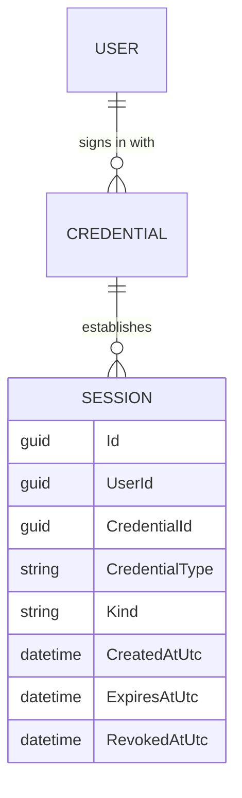
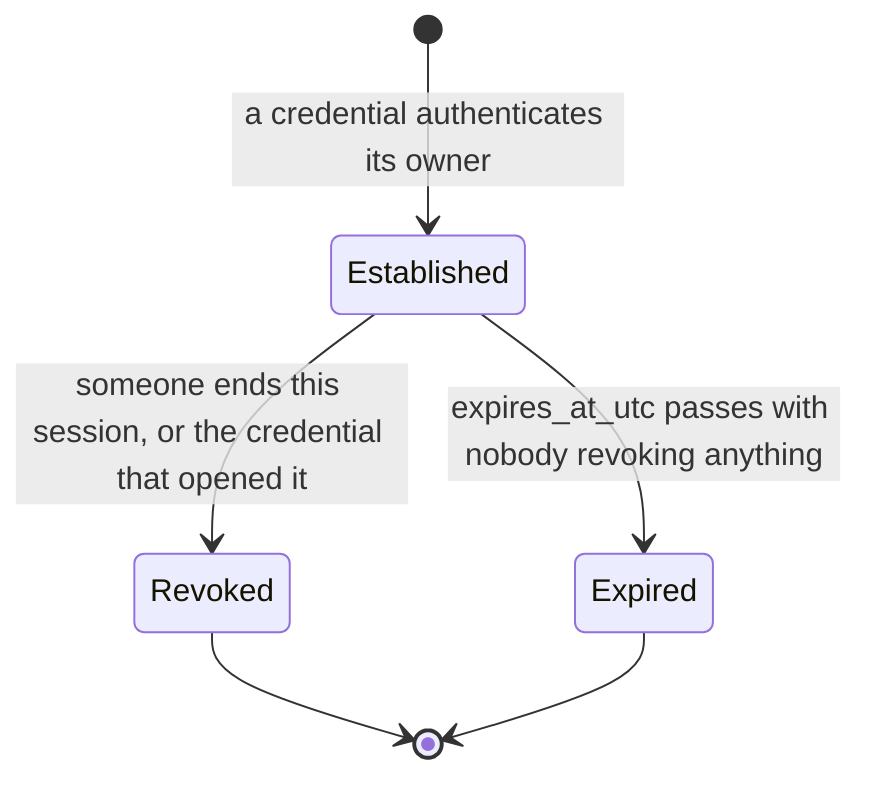

# Sessions

## Table of Contents

- [Purpose](#purpose)
- [Key Entities](#key-entities)
- [Constraints](#constraints)
- [Business Rules & Invariants](#business-rules--invariants)
- [Workflows & State Transitions](#workflows--state-transitions)
- [Integration Points](#integration-points)
- [Edge Cases & Known Gotchas](#edge-cases--known-gotchas)

## Purpose

This area covers **an established sign-in the product owns**: a row it wrote, can read, and can end
without asking anyone. Identity — who a person is, and which credentials prove it — lives in
[users-and-ownership.md](users-and-ownership.md); this file covers what happens *after* a credential
has answered that question.

The distinction is the whole point. A token issued by an identity provider cannot be taken back by
this product: revoking access would mean asking the provider to revoke it. A session row can be
ended here, in one write, by the same role that serves every request.

**What is built today and what is not.** The `sessions` table, its entity, its isolation policy, its
grant matrix entry, and the two operations — establish one, revoke every session a credential
established — exist and are tested. **Three things establish a session and there is no fourth**: a
verified passkey assertion (see [passkeys.md](passkeys.md)), a redeemed recovery code, and a
**regeneration of a recovery-code set that was carrying live sessions**, which opens one session over
the new set in place of the ones its own sweep ended (both in
[recovery-codes.md](recovery-codes.md)). All three open a `Full` session lasting 14 days.

What still does not exist is anything that *presents* one. No session token is issued — **not one** of
the three establishing responses carries a handle to the row it created, and all three withhold it for
the same reason — and the API still authenticates every other request from the Google ID token it is
handed, exactly as [users-and-ownership.md](users-and-ownership.md) describes. So a recovery sign-in
today opens a session that authenticates nothing; what each response tells its caller is what that
session *is*, not something the caller can spend.

**`RevokeSessionsForCredentialHandler` has two callers.** Revoking a passkey ends that passkey's
sessions before deleting the credential row (see [passkeys.md](passkeys.md)), and regenerating an
account's recovery codes ends the replaced set's sessions before deleting *its* credential row (see
[recovery-codes.md](recovery-codes.md)). Both are the same shape and both are load-bearing for the
same reason — the cascade would take those rows anyway, so the explicit revocation is the only thing
that makes *when* access ended observable. On the regeneration path the number that sweep returns
does a second job: it is the condition the replacement's own session is written on, so that path
both ends sessions and establishes one, in one request. Read all of it against the paragraph above
before deciding what it is worth: because no session token is issued, a session is not what any
request is authenticated by today, so ending one signs nobody out and opening one signs nobody in.
The operations are correct and they are **anticipatory** — they make the rules true of the rows now,
so that the day a session token does authenticate a request, revocation is already the thing that
ends access and a regeneration is already signing the person back in rather than out, rather than
either being a thing somebody has to remember to add. Saying otherwise — that revoking a passkey
signs that device out — would be describing the session token as if it shipped.

## Key Entities

- **Session** — one established sign-in. It carries a `Guid Id` of its own, the `UserId` whose
  account it reaches, the `CredentialId` of the credential that established it, that credential's
  `CredentialType`, a `SessionKind`, the instant it began, the instant it expires, and a nullable
  instant at which it was revoked. It holds no navigation properties: it names its user and its
  credential by id, exactly as **Credential** names its user by id.
- **SessionKind** — `Locked` or `Full`, and it is **derived from the establishing credential's
  type**, never supplied. A `Passkey` credential and a `RecoveryCodes` credential each open a `Full`
  session; a `Federated` one opens a `Locked` session, and it is the **only** type that does.
  `Session.ReadsBudgetContent` is the computed reading of that, and it is true only for `Full`.
  `Locked` is declared first so that `default(SessionKind)` is the value reaching nothing — the order
  is the fail-closed direction, not alphabetical accident.
- **`Session.CredentialType`** — a copy of the establishing credential's type, carried on the row so
  the database can check the derivation. A `CHECK` sees only the row in front of it, so the fact
  `kind` is derived from has to be on that row for the derivation to be checkable at all.

A session record deliberately carries **no** token, token hash, last-used instant, device name, IP
address, or user agent. Each would be a column nothing reads today, and a column nothing reads is
data held for no one — the same rule the minimal account row is built on.

## Constraints

### MUST

- **A session is isolated by user, like `users` and `budgets`.** `sessions` carries `user_id` and no
  `budget_id`, so it is user-owned by the same rule and owes the same policy. A session belongs to a
  person; the budgets that person owns are reached through their own policies, one layer down.
  - **Enforced in**: the `user_isolation` policy on `sessions` in
    `BudgetoidApp/Infrastructure/Persistence/Provisioning/app-role-grants.sql`, comparing `user_id`
    against `app.current_user_id` in both `USING` and `WITH CHECK`;
    `SessionContextInterceptor` puts that setting on every connection the context opens.
    `RowLevelSecurityCoverage` reaches the verdict from the table's own columns rather than from a
    list, so `RlsCoverageTests` and the deploy-time verifier both required this policy the moment
    the table existed. `RlsIsolationTests` proves the three halves — another person's rows are
    invisible, an insert naming another person is refused, and a connection naming nobody fails with
    `22P02` rather than reading anything. See
    [ADR 0011](../decisions/0011-police-the-user-owned-tables.md).
  - `user_id` is `NOT NULL`, and that is load-bearing rather than tidy: a `NULL` owner fails
    *closed*, because `NULL = anything` is `NULL` and never true, so the row would be invisible to
    every session including the one that wrote it — a write that succeeds and a read that cannot be
    explained.

- **A session's identity columns — `user_id`, `credential_id`, `credential_type`, `kind`,
  `created_at_utc`, `expires_at_utc` — are immutable. `revoked_at_utc` is the only column an edit
  may reach.**
  - **Why**: changing `credential_id` would relabel which key opened the door, and which key opened
    it is the fact revocation is decided by. Changing `kind` would hand budget content to a session a
    federated credential opened, which is the one thing the kind exists to refuse.
  - **Enforced in**: the grant matrix. `GRANT SELECT, INSERT ON sessions` plus
    `GRANT UPDATE (revoked_at_utc) ON sessions` — the other six are immutable by **omission from
    the column list**, never by a `REVOKE`, which additive column privileges could not express. A
    one-column list is still a list and must not be collapsed into a table-wide grant. Above it,
    `Session` exposes no public setter. `AppRoleGrantsTests` pins a `42501` for each of them in
    the same test as a permitted `revoked_at_utc` update that reports one affected row — the
    affected-row count is what stops the pair passing when row-level security matched nothing. See
    [ADR 0004](../decisions/0004-connect-as-a-least-privilege-role.md).

- **A session's expiry must be after its creation.**
  - **Enforced in**: `CK_sessions_lifetime` (`expires_at_utc > created_at_utc`), restated in
    `Session.Establish` so a bad call fails with a named field rather than a raw `23514`. No request
    can reach it: each of the three establishing paths computes the expiry by adding its own constant
    to the instant it just read, so the pair is well-formed by construction and nothing renders the
    field error into a response. The restatement is a guard against a future caller that computes an
    expiry from something a request supplied, not a validation a client can trip today.

### MUST NOT

- **The application role MUST NOT hold `DELETE` on `sessions`.** Revocation writes `revoked_at_utc`;
  it does not remove the row. The absent grant is what keeps the role from removing a session while
  the account it belongs to still exists, and `Database_RefusesToDeleteASession` pins it. Session
  rows do leave — the cascade from `credentials`, and through it from `users`, takes every one of
  them when the account is erased — but that reaches them by descending from a row rather than by a
  privilege over this table, so it cannot single one out. No retention sweep exists; when one is
  built it needs this grant, and the paragraph in `app-role-grants.sql` is what has to be re-argued
  rather than quietly deleted.

- **No policy on `sessions` may read `kind`.** Whether a session reaches budget content is answered
  by `budget_isolation` on the budget-owned tables, which a locked session never satisfies because it
  resolves no ambient budget. A predicate here consulting `kind` would invent a third isolation axis
  beside the two the schema already carries, and which rows a person could see would then depend on
  which of the three fired last.

## Business Rules & Invariants

- **Rule**: A session's kind is **derived** from the establishing credential's type. There is no way
  to ask for one.
- **Why**: an authorization exchange with an identity provider returns claims, not a secret the
  client can turn into a key. So any account reachable by a provider sign-in would be an account the
  provider's holder could read — which is why a federated credential opens a session that reaches no
  budget content at all, and **`federated` is the only credential type that cannot**. The rule runs
  that way round rather than the other: a passkey's authenticator holds the account's keys, and a set
  of recovery codes is the secret those keys are wrapped under, so both are secrets in the holder's
  own possession and both open a `Full` session. Redeeming a code establishes exactly that session,
  from the set's own credential — see [recovery-codes.md](recovery-codes.md).
- **Enforced in**: `CK_sessions_kind_matches_credential`,
  `(kind = 'full') = (credential_type in ('passkey', 'recovery_codes'))`, which is the lowest layer
  that can state the rule declaratively. Without it the rule lived only in the factory while
  `GRANT SELECT, INSERT ON sessions` stayed table-wide on `INSERT` —
  `(credential_id = <a federated credential>, kind = 'full')` was a fully storable row.
  `CK_sessions_kind` bounds only the vocabulary and the composite foreign key proves only whose the
  two rows are; neither refuses that pair. Above it, `Session.Establish` takes the `Credential` and
  no kind, and derives it through a switch with every arm written out and a throwing discard arm.
- **The full side stays enumerated, and the spelling is a decision rather than a style.** The mirror
  form — `(kind = 'locked') = (credential_type = 'federated')` — says the same thing about every row
  this schema can hold today, reads better, and is what a later reader will propose. It fails **open**:
  a fourth credential type added to the vocabulary is not `federated`, so it satisfies the right-hand
  side and is granted a full session by default, with nobody having decided that. The shipped form
  fails closed — an unenumerated type gets no full session until somebody adds it here, which is the
  same decision `Session.KindFor` forces by writing out every arm. **No test in the suite can tell
  the two spellings apart until that fourth type exists**, so no assertion can separate "the rule
  changed meaning" from "the wording changed", and this paragraph and the comment beside the
  constraint are the only things carrying the difference. That is also why adding `recovery_codes`
  to the `in` list was the correct edit rather than the occasion to simplify: the list growing by
  one member is exactly what the form is for.
  `SessionTests.Session_ExposesNoWayToChooseItsKind` reflects over the public surface and fails on
  any parameter or settable property of type `SessionKind`. That is what makes the rule
  **unrepresentable** rather than merely untested: without it, the obvious accommodation for a caller
  wanting a different kind is an overload taking one, and the rule dissolves with no test going red.
- **Note on the copy**: `credential_type` duplicates `credentials.type` and cannot drift from it —
  `credentials` holds no `UPDATE` grant of any shape, and the composite foreign key below ties the
  two columns together on every insert.
- **Counterexample**: a `bool canReadBudgetContent` argument on the factory. It reads as a permission
  the caller sets, and the first caller that sets it wrongly is the whole rule gone.
- **Source**: `[SOURCE: discussion — 2026-08-05]`

---

- **Rule**: Revocation is an **`UPDATE` of `revoked_at_utc`**, never a `DELETE`, and it is
  **idempotent** — an already-revoked session keeps the instant access actually ended.
- **Why**: the row is what says access ended and when. Deleting it needs a `DELETE` grant, which is
  the single privilege that can erase every session on the system, and it cannot tell "already
  revoked" from "never existed" — a distinction anything reporting a revocation needs. The usual
  argument for `DELETE`, that updated rows accumulate, does not separate the two options: an
  unrevoked but expired row accumulates identically, so retention is a problem either mechanism has
  and neither solves.
- **Enforced in**: `Session.Revoke` returns without writing when `RevokedAtUtc` is already set;
  `SessionRepository.RevokeForCredentialAsync` loads the credential's unrevoked sessions and calls
  it per row. `ExecuteUpdateAsync` is a compile error under `BudgetoidApp/BannedSymbols.txt`, and the
  ban buys correctness here rather than uniformity: a set-based `UPDATE` would rewrite every matched
  row's instant on every call and would report a retry as if it had ended access a second time.
- **Concurrently, too**: `Session.Revoke`'s idempotence is a property of one object in memory, so on
  its own it does not survive two sweeps running at once — both would read the rows as unrevoked and
  the later commit would overwrite the first revocation instant. `revoked_at_utc` is therefore a
  **concurrency token**: the `UPDATE` carries `and revoked_at_utc is null`, the losing sweep matches
  zero rows and raises `DbUpdateConcurrencyException`, and `RevokeForCredentialAsync` answers it by
  re-reading and retrying. A token in the `WHERE` clause needs only `SELECT`, so the
  `GRANT UPDATE (revoked_at_utc)` column list is unaffected.
- **What the returned count means**: the number of sessions **this call** ended, excluding any a
  concurrent sweep ended first. Two simultaneous revocations of one credential therefore report a
  total of the sessions ended, not that number twice. It counts the **unrevoked**, not the live: the
  filter is `revoked_at_utc is null` and says nothing about expiry, so a session that expired with
  nobody revoking it is in the number.
- **The count reaches the wire on both paths**, as `sessionsEnded` on the passkey-revocation and
  recovery-code-generation responses, which makes it a published contract rather than an internal
  return value; narrowing it later is breaking. On the generation path it is more than a report — it
  is the condition that path's re-established session is written on — so **what this number counts
  cannot be changed on one caller alone**. In particular, tightening it to "live at the caller's
  instant" would look like a fix to the recovery-code rule and would silently change what a passkey
  revocation reports. See [recovery-codes.md](recovery-codes.md).
- **Note what this is not**: a tombstone. A session row exists only while its account does — the
  cascade below takes every one of them — so a revoked session leaves nothing behind an erasure.
- **Source**: `[SOURCE: discussion — 2026-08-05]`

---

- **Rule**: Revoking a credential ends **only** the sessions that credential established. Every other
  credential on the same account stays signed in.
- **Why**: revoking one device is the reason the operation exists. An account holding a passkey on a
  phone and another on a laptop, told that losing the phone signs the laptop out too, has been given
  a blunter instrument than it asked for.
- **Enforced in**: `SessionRepository.RevokeForCredentialAsync` filters on `CredentialId` and never
  on `UserId`, and `RevokeSessionsForCredentialHandler` names a credential in its command.
- **Counterexample, and the one to watch**: a predicate keyed on `UserId`. Every session in a
  single-credential account has the same owner, so every test in the suite passes under it except
  the two written for exactly this —
  `RevokeSessionsForCredentialHandlerTests.HandleAsync_LeavesAnotherCredentialsSessionsActive` and
  `SessionRepositoryTests.RevokeForCredentialAsync_RevokesOnlyThatCredentialsSessions`.
- **Source**: `[SOURCE: discussion — 2026-08-05]`

---

- **Rule**: A session and the credential that established it belong to the **same person**, and the
  database refuses a row where they do not.
- **Why**: `user_isolation` reads `user_id` and never looks at the credential, so a session naming
  someone else's credential is a row the policy would happily show to the wrong person.
- **Enforced in**: one composite foreign key, `sessions (credential_id, user_id, credential_type) →
  credentials (id, user_id, type)`, against the `AK_credentials_id_user_id_type` alternate key. This
  is the same idiom the budget-owned tables use one level down, where every cross-row reference
  carries `budget_id`. `credential_type` rides along so a session cannot disagree with its credential
  about what opened it, which is what makes `CK_sessions_kind_matches_credential` a claim about the
  real credential rather than about a value the row asserted for itself.
  `SessionSchemaTests.Database_RefusesASessionWhoseCredentialBelongsToAnotherUser` pins the `23503`.
- **Consequence**: `credentials` gained an alternate key and **no new column**, which matters — the
  exemption in `RowLevelSecurityCoverage.Exemptions` pins that table's exact column set, and a new
  column there would correctly go red.
- **Source**: `[SOURCE: discussion — 2026-08-05]`

---

- **Rule**: Deleting a credential deletes its sessions (`ON DELETE CASCADE`). There is deliberately
  **no** second foreign key from `sessions` to `users`.
- **Why**: `Restrict` would let a session hold up the deletion of a credential, and through it an
  account erasure — a row of access bookkeeping outranking a person's request to be forgotten, which
  is what the `credentials → users` foreign key already refuses. The credential's own cascade to
  `users` reaches sessions transitively, so a direct one would add nothing but another constraint
  name for the pinned snapshots to carry.
- **Enforced in**: `SessionConfiguration`;
  `SessionSchemaTests.Database_RemovesASessionWithTheCredentialThatEstablishedIt` and
  `Database_RemovesASessionWithTheUserThatOwnsIt` pin both hops.
- **Source**: `[SOURCE: discussion — 2026-08-05]`

## Workflows & State Transitions

| Transition | Triggered by | Validations |
|---|---|---|
| → Established | `Session.Establish(credential, createdAtUtc, expiresAtUtc)`, reached from `CompleteAssertionHandler` once a passkey assertion verifies, from `RedeemRecoveryCodeHandler` once a presented verifier matches a stored hash, and from `GenerateRecoveryCodesHandler` when replacing a set ended at least one of that set's sessions | the credential is required; the expiry must be after the creation instant; the kind is derived from the credential's type and cannot be supplied |
| Established → Revoked | `Session.Revoke(revokedAtUtc)`, reached through `RevokeSessionsForCredentialHandler`, which `RevokePasskeyHandler` and `GenerateRecoveryCodesHandler` each call before deleting a credential | none. Already revoked is a no-op keeping the first instant, which is what makes a retry honest about having ended nothing new |
| Established → Expired | the clock | none. `IsActiveAt` reads the expiry as well as the revocation, with an exclusive boundary: a session is live up to its expiry and not at it |

There is no transition back. Nothing un-revokes a session and nothing extends one.

## Integration Points

- **[Users & Ownership](users-and-ownership.md)** — the credential that establishes a session, and
  the account it belongs to. A session adds nothing to identity; it records what a credential already
  proved.
- **[Recovery Codes](recovery-codes.md)** — a set of codes opens a `Full` session, exactly as a passkey
  does, and `RedeemRecoveryCodeHandler` establishes one the way `CompleteAssertionHandler` establishes a
  passkey's. `GenerateRecoveryCodesHandler` calls the revocation sweep, as `RevokePasskeyHandler` does.
  The two routes divide differently than the names suggest: a **redemption** opens a session and revokes
  nothing, while a **regeneration** revokes the replaced set's sessions and — when it ended any — opens
  one over the new set in their place, so it is the one path that does both. The condition is the
  sweep's own count, which is why that file argues the `sessionsEnded` contract from the other side.
- **`user_isolation`** — the same policy `users`, `budgets` and `passkey_signature_counters` carry,
  keyed on the same session setting. `sessions` is policed on the person rather than on a budget,
  like each of them.
- **`SessionContextInterceptor`** — **not** about a session in this file's sense. It writes
  `app.current_user_id` and `app.current_budget_id` onto each PostgreSQL connection the context
  opens; the PostgreSQL backend session and a `Domain.Sessions.Session` share a word and nothing
  else. The isolation policy above is the one place the two meet, and only because the policy reads
  the setting the interceptor writes.

## Edge Cases & Known Gotchas

- **The cascade can satisfy "revoking a credential ends its sessions" by accident.** Because deleting
  a credential row deletes its sessions, a path that removes a credential without revoking first
  passes a test asserting the sessions are gone — while leaving nothing to say when access ended. Any
  credential-removal path must revoke explicitly **and then** delete, or the fact is unobservable.
  - **How the two paths that exist resolve it.** `RevokePasskeyHandler` and
    `GenerateRecoveryCodesHandler` each revoke and then delete — and because the delete removes the
    very rows the revocation just stamped, the schema afterwards is identical either way. So the
    evidence leaves in the response instead: each answers with the count `RevokeForCredentialAsync`
    returned, as `sessionsEnded`. That is what the returned count was for; see the revocation
    rule above.
  - **The test nobody should write** is "after revocation the credential has no active session". It
    is green with the revocation call deleted, and therefore proves nothing.
  - **On the recovery-code path a second mutation produces the same wrong number**: swapping the
    revocation with the delete also reports `0`, because the cascade has already taken the session
    rows and the sweep matches nothing. So the count discriminates ordering as well as presence.

- **Between the revocation and the delete, the tracked sessions have to be discarded.** Revoking
  loads every unrevoked `Session` into the change tracker. Remove the credential with those
  dependents still tracked and EF cascades into the copies it can see and emits its own
  `DELETE FROM sessions` — on a table granted `SELECT, INSERT, UPDATE (revoked_at_utc)` and
  deliberately no `DELETE`, so the request dies with `42501`. **The failure names a permission and
  the cause is the change tracker; do not answer it with a grant on `sessions`.** This is the same
  mechanism `EraseAccountHandler` documents for `budgets` and `GenerateRecoveryCodesHandler`
  documents for the set it replaces, on the same stack.
  - **The absent `DELETE` is what makes this loud, and one table beside it does not have that
    protection.** `recovery_code_hashes` **is** granted `DELETE`, so the same change-tracker mistake
    there succeeds silently instead of raising `42501` — see
    [recovery-codes.md](recovery-codes.md). Read the two together: the `42501` on this table is a
    diagnostic the grant matrix buys, not an inconvenience it imposes.
- **Revoked and expired rows accumulate.** Nothing sweeps them, and the application role holds no
  `DELETE` grant to do it with. Not a defect at today's size; it becomes one before the product has
  many users, and the grant that a sweep needs is the one this file argues against adding.
- **`RevokeSessionsForCredentialHandler` has two callers**, `RevokePasskeyHandler` and
  `GenerateRecoveryCodesHandler`, and the `int` it returns is the only observable evidence the
  explicit revocation ran — see the cascade gotcha above. Revoking the **federated** credential
  still has no caller and is not expected to gain one: that credential is replaced rather than
  removed.
  - **The two callers do not mean the same thing by the number**, and that is the trap on this page
    for whoever edits the sweep. To `RevokePasskeyHandler` it is evidence and nothing more; to
    `GenerateRecoveryCodesHandler` it is also the condition a re-established session is written on. So
    a change to what `RevokeForCredentialAsync` counts — the obvious candidate being to narrow
    `revoked_at_utc is null` to a live-at-now reading — changes behaviour on one path while looking
    like a reporting fix on both.
  - **Both callers reach it through the command handler rather than straight to `ISessionRepository`**,
    and that is deliberate: the handler is where the clock is read, so one decision to end access is
    stamped as one instant however many rows it touches.
- **The expiry is decided by the caller, and there are three callers holding the same number.**
  `Session.Establish` validates only that the expiry is after the creation instant; the number itself
  — **14 days** — is a constant on `CompleteAssertionHandler`, on `RedeemRecoveryCodeHandler` and on
  `GenerateRecoveryCodesHandler`. It lives in Application rather than Domain because how long a session
  lasts is product policy, which
  [ADR 0002](../decisions/0002-enforce-rules-at-the-lowest-capable-layer.md) keeps above the
  invariants, and it is not on `IPasskeyCeremonyPolicy` because a session lifetime that varies per
  environment is a difference nobody meant.
  - **The equality is the rule and the restatement is deliberate.** Both credentials open a `Full`
    session — a set of recovery codes is the secret the account's keys are wrapped under, so it
    reaches as much as an authenticator does — and a recovery sign-in that expired sooner would tell
    somebody who has just lost their device that the way back in they were issued is worth less than
    the one they lost. The regeneration path is held to the same number by an argument of its own: its
    caller cleared a passkey gate, which is stronger than whatever opened the session that path's
    sweep took, so the session it hands back must not be worth less than the one it ended. Each
    handler owns the policy for the sign-in it performs, so the constant is restated rather than
    shared; **any two of them differing is a defect rather than a decision**, and a fourth
    establishing path must not quietly bring a fourth number.
