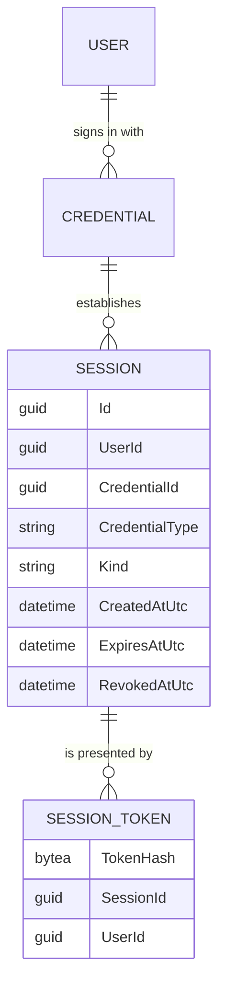
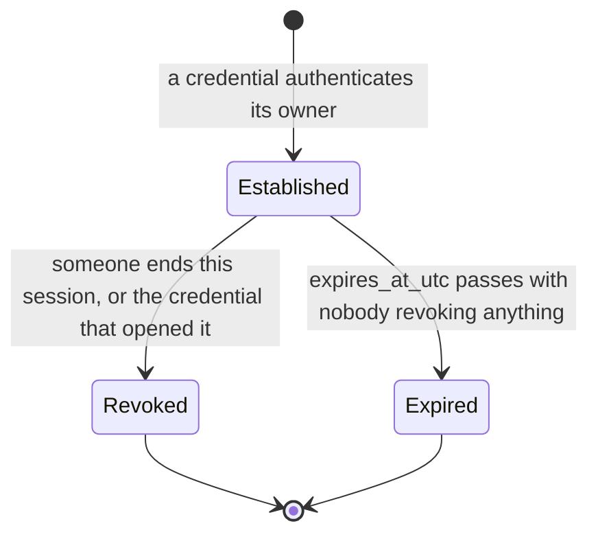
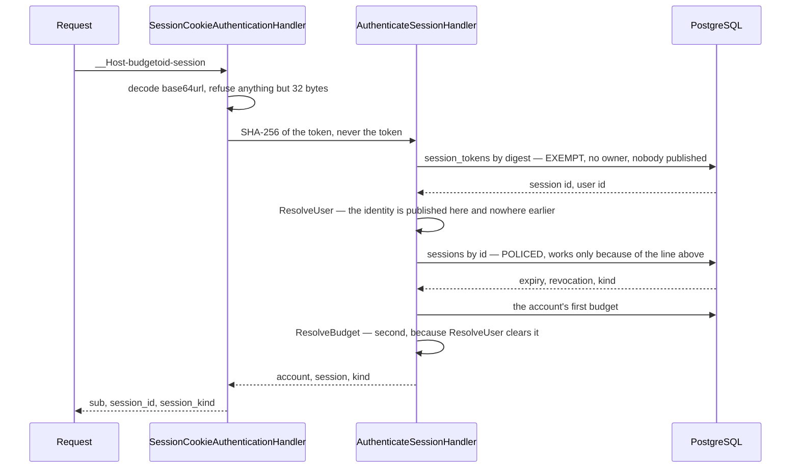

# Sessions

## Table of Contents

- [Purpose](#purpose)
- [Key Entities](#key-entities)
- [Constraints](#constraints)
- [Business Rules & Invariants](#business-rules--invariants)
- [Workflows & State Transitions](#workflows--state-transitions)
- [Decision Trees](#decision-trees)
- [Integration Points](#integration-points)
- [Edge Cases & Known Gotchas](#edge-cases--known-gotchas)

## Purpose

This area covers **an established sign-in the product owns**: a row it wrote, can read, and can end
without asking anyone. Identity — who a person is, and which credentials prove it — lives in
[users-and-ownership.md](users-and-ownership.md); this file covers what happens *after* a credential
has answered that question. The distinction is the whole point: a token issued by an identity
provider cannot be taken back by this product — revoking access would mean asking the provider to
revoke it — while a session row can be ended here, in one write, by the same role that serves every
request. **Four things establish a session and there is no fifth**, and all four open a `Full`
session lasting 14 days. The fourth is the newest and the earliest in a person's life with the
product: **completing `POST /api/registration`**, which signs somebody in on the passkey the same
request created — see [registration.md](registration.md).

**A session is now issued, presented and ended, and this file describes a working thing.** All four
establishing paths mint a handle and set the cookie; a request presenting it is authenticated from
it, publishing the account and the ambient budget; and `POST /api/me/session/revocation` ends it. The
loop is closed on the server.

**Two of the four paths have a screen; two do not.** `/register` runs its creation ceremony from a
page and `/welcome` runs the assertion, so a person really does complete either, receive the cookie
and go on to be authenticated from it. The other two are reached today only by the integration
suite — nothing in the browser redeems a code or regenerates a set. **Every request this app makes is
now authenticated from the cookie**: the identity provider is contacted once, on the registration
screen, a bearer presented to any other route authenticates nothing at all, and the client sends one
to no other route. The first gotcha below
carries what that means for reading the rest of this file.

## Key Entities

- **Session** — one established sign-in. It carries a `Guid Id` of its own, the `UserId` whose
  account it reaches, the `CredentialId` of the credential that established it, that credential's
  `CredentialType`, a `SessionKind`, the instant it began, the instant it expires, and a nullable
  instant at which it was revoked. It holds no navigation properties: it names its user and its
  credential by id, exactly as **Credential** names its user by id.
- **SessionKind** — `Locked` or `Full`, and it is **derived from the establishing credential's
  type**, never supplied. A `Passkey` credential and a `RecoveryCodes` credential each open a `Full`
  session; a `Federated` one opens a `Locked` session, and it is the **only** type that does.
  `Session.ReadsBudgetContent` is the computed reading of that, and it is true only for `Full`.
  `Locked` is declared first so that `default(SessionKind)` is the value reaching nothing — the order
  is the fail-closed direction, not alphabetical accident.
- **`Session.CredentialType`** — a copy of the establishing credential's type, carried on the row so
  the database can check the derivation. A `CHECK` sees only the row in front of it, so the fact
  `kind` is derived from has to be on that row for the derivation to be checkable at all.
- **SessionToken** — the handle one session will be presented by, stored as `SHA-256(token)` and
  never as anything the token can be recovered from. It carries the digest, the `SessionId` it opens
  and the `UserId` that owns it, and **nothing else** — no timestamps, because the session row already
  carries when it began, when it expires and whether it was revoked, and a second copy is a second set
  of the same facts to keep in step.

  **Why it is a table of its own, which is the whole of the decision.** A presented token has to be
  looked up *before* the request has an identity, and `sessions` is policed by `user_isolation` keyed
  on `app.current_user_id` — which is exactly the value the lookup exists to produce. A hash column on
  `sessions` would therefore be read by a statement the policy refuses, and refuse it loudly: an unset
  setting reaches the policy as `''::uuid` and raises `22P02`, on every request rather than on some
  edge. So the discovery key goes on its own **exempt** table and everything read *after* the answer —
  the expiry and the revocation instant above all — stays on the policed one. That is the split
  [ADR 0012](../decisions/0012-split-a-passkeys-material-by-whether-it-is-read-before-identity.md)
  already argues for a passkey's material, and
  [ADR 0019](../decisions/0019-authenticate-a-request-from-a-first-party-session-cookie.md) applies
  it here.

  **What the hash buys is not what a recovery code's hash buys.** A recovery code never reaches this
  server at all; a session token does — this server mints it and reads it on every request presenting
  it — so the digest is not a claim that the value is unknown here. It is a claim about what a *copy*
  of the table is worth: a backup, a replica or one unbounded read yields digests, and a digest of a
  256-bit uniform value cannot be turned back into the token a request would have to present.

A session record deliberately carries **no** last-used instant, device name, IP address, or user
agent. Each would be a column nothing reads today, and a column nothing reads is data held for no one
— the same rule the minimal account row is built on.

It carries no token and no token hash either, and that absence is a different decision from the four
above rather than another instance of them: the hash exists, on `session_tokens`, and it is on its
own table **because** it cannot be on this one. Read the entity below for why, and do not "tidy" the
two back together.



**`SESSION_TOKEN` is drawn one-to-many because that is what the schema holds**, and the gap between
that and what the design intends is worth stating rather than drawing over. The primary key is the
digest, so nothing stops a session from having several token rows, and nothing stops it from having
none. One-to-one would need either a unique constraint on `session_id` — which would be a real rule
and is simply not there — or a trigger for the "at least one" half, which
[ADR 0002](../decisions/0002-enforce-rules-at-the-lowest-capable-layer.md) forbids pushing down.

**What holds one-to-one is the port's shape, and it is stronger than it had to be.**
`ISessionRepository.AddAsync` takes the session **and** its token, and there is no overload taking a
session alone — so a session cannot be written without its handle by construction rather than by
every caller remembering. `ISessionTokenRepository` stays read-only for the same reason, stated from
the other side: a second way to write a token is a way to produce one naming a session that was never
committed.

**A second port now writes both rows, and the invariant is untouched because the pairing is what was
pinned rather than the port.** `IRegistrationRepository.RegisterAsync` writes `sessions` and
`session_tokens` itself, which is a deliberate departure argued on that port and in
[registration.md](registration.md): there is no transaction on that path, so a second call to
`ISessionRepository.AddAsync` — which saves on its own — would be a second transaction and the whole
account would stop being atomic, silently. What keeps the rule literally true is that
`Domain.Users.Registration` carries the session **and** its token as required members, so there is
still no shape of any call in this system that writes one without the other. Read that as the reason
a third writer is a decision rather than a refactor.

The schema still permits what the application refuses — several tokens for one session, or none — and
that gap is deliberate rather than an oversight. Closing it would need a unique constraint on
`session_id` for one half and a trigger for the other, and
[ADR 0002](../decisions/0002-enforce-rules-at-the-lowest-capable-layer.md) forbids pushing procedural
logic down to satisfy "lowest layer". So the diagram is drawn one-to-many because that is what the
database holds, and the sentence above is what makes it one-to-one in fact.

## Constraints

### MUST

- **A session is isolated by user, like `users` and `budgets`.** `sessions` carries `user_id` and no
  `budget_id`, so it is user-owned by the same rule and owes the same policy.
  - **Why**: a session belongs to a person; the budgets that person owns are reached through their
    own policies, one layer down.
  - **Enforced in**: the `user_isolation` policy on `sessions` in
    `BudgetoidApp/Infrastructure/Persistence/Provisioning/app-role-grants.sql`, comparing `user_id`
    against `app.current_user_id` in both `USING` and `WITH CHECK`;
    `SessionContextInterceptor` puts that setting on every connection the context opens.
    `RowLevelSecurityCoverage` reaches the verdict from the table's own columns rather than from a
    list, so `RlsCoverageTests` and the deploy-time verifier both required this policy the moment
    the table existed. `RlsIsolationTests` proves the three halves — another person's rows are
    invisible, an insert naming another person is refused, and a connection naming nobody fails with
    `22P02` rather than reading anything. See
    [ADR 0011](../decisions/0011-police-the-user-owned-tables.md).
    - **`user_id` is `NOT NULL`, and that is load-bearing rather than tidy**: a `NULL` owner fails
      *closed*, because `NULL = anything` is `NULL` and never true, so the row would be invisible to
      every session including the one that wrote it — a write that succeeds and a read that cannot
      be explained.

- **A session's identity columns — `user_id`, `credential_id`, `credential_type`, `kind`,
  `created_at_utc`, `expires_at_utc` — are immutable. `revoked_at_utc` is the only column an edit
  may reach.**
  - **Why**: changing `credential_id` would relabel which key opened the door, and which key opened
    it is the fact revocation is decided by. Changing `kind` would hand budget content to a session a
    federated credential opened, which is the one thing the kind exists to refuse.
  - **Enforced in**: the grant matrix. `GRANT SELECT, INSERT ON sessions` plus
    `GRANT UPDATE (revoked_at_utc) ON sessions` — the other six are immutable by **omission from
    the column list**, never by a `REVOKE`, which additive column privileges could not express. A
    one-column list is still a list and must not be collapsed into a table-wide grant. Above it,
    `Session` exposes no public setter. `AppRoleGrantsTests` pins a `42501` for each of them in
    the same test as a permitted `revoked_at_utc` update that reports one affected row — the
    affected-row count is what stops the pair passing when row-level security matched nothing. See
    [ADR 0004](../decisions/0004-connect-as-a-least-privilege-role.md).

- **A session's expiry MUST be after its creation.**
  - **Why**: a session whose expiry is at or before its creation was never live, and a row that was
    never live can only mislead whatever reads it.
  - **Enforced in**: `CK_sessions_lifetime` (`expires_at_utc > created_at_utc`), restated in
    `Session.Establish` so a bad call fails with a named field rather than a raw `23514`. No request
    can reach it: each of the four establishing paths computes the expiry by adding the shared
    lifetime to the instant it just read, so the pair is well-formed by construction and nothing
    renders the field error into a response. The restatement is a guard against a future caller
    that computes an expiry from something a request supplied, not a validation a client can trip
    today.

### MUST NOT

- **The application role MUST NOT hold `DELETE` on `sessions`.**
  - **Why**: revocation writes `revoked_at_utc`; it does not remove the row. The absent grant is
    what keeps the role from removing a session while the account it belongs to still exists.
    Session rows do leave — the cascade from `credentials`, and through it from `users`, takes every
    one of them when the account is erased — but that reaches them by descending from a row rather
    than by a privilege over this table, so it cannot single one out. No retention sweep exists;
    when one is built it needs this grant, and the paragraph in `app-role-grants.sql` is what has
    to be re-argued rather than quietly deleted.
  - **Enforced in**: the grant matrix in `app-role-grants.sql` — no `DELETE` appears for
    `sessions` — pinned by `Database_RefusesToDeleteASession`.

- **No policy on `sessions` may read `kind`.**
  - **Why**: the two policies the schema carries answer *whose* a row is. The kind answers something
    else — how far into their own account a person's own credential reaches — and a predicate here
    consulting it would invent a third isolation axis beside those two, so which rows somebody could
    see would depend on which of the three fired last. It is also the wrong table: the rule has to
    refuse reads of `accounts`, `transactions` and the rest, and a policy on `sessions` governs
    `sessions`.
    - **A correction worth reading, because the obvious repair rests on it.** This entry once
      argued that a locked session satisfies `budget_isolation` nowhere *because it resolves no
      ambient budget*. That was never true. `AuthenticateSessionHandler` publishes the tenant for
      every **live** session whatever its kind — only an *ended* one is left with no budget — so a
      locked session reaching a budget-scoped route was reaching it with its own budget resolved and
      being answered normally. The database was never refusing this; nothing was, until the
      requirement below.
  - **Enforced in**: the `user_isolation` policy on `sessions` in `app-role-grants.sql` compares
    `user_id` alone, and no other policy exists on the table. What the kind *is* enforced by is the
    application's fallback authorization policy — see the rule below, which carries the
    [ADR 0002](../decisions/0002-enforce-rules-at-the-lowest-capable-layer.md) statement for why it
    sits there.

## Business Rules & Invariants

- **Rule**: A session's kind is **derived** from the establishing credential's type. There is no way
  to ask for one.
- **Why**: an authorization exchange with an identity provider returns claims, not a secret the
  client can turn into a key. So any account reachable by a provider sign-in would be an account the
  provider's holder could read — which is why a federated credential opens a session that reaches no
  budget content at all, and **`federated` is the only credential type that cannot**. The rule runs
  that way round rather than the other: a passkey and a set of recovery codes are each a secret in
  the holder's own possession — one held by an authenticator, one written down — so both open a
  `Full` session. The key custody those secrets are meant to carry is designed and **not built**, so
  it is not what the rule rests on today. Redeeming a code establishes exactly that session, from the
  set's own credential — see [recovery-codes.md](recovery-codes.md).
- **Enforced in**: `CK_sessions_kind_matches_credential`,
  `(kind = 'full') = (credential_type in ('passkey', 'recovery_codes'))`, which is the lowest layer
  that can state the rule declaratively. Without it the rule lived only in the factory while
  `GRANT SELECT, INSERT ON sessions` stayed table-wide on `INSERT` —
  `(credential_id = <a federated credential>, kind = 'full')` was a fully storable row.
  `CK_sessions_kind` bounds only the vocabulary and the composite foreign key proves only whose the
  two rows are; neither refuses that pair. Above it, `Session.Establish` takes the `Credential` and
  no kind, and derives it through a switch with every arm written out and a throwing discard arm.
  - **The full side stays enumerated, and the spelling is a decision rather than a style.** The
    mirror form — `(kind = 'locked') = (credential_type = 'federated')` — says the same thing about
    every row this schema can hold today, reads better, and is what a later reader will propose. It
    fails **open**: a fourth credential type added to the vocabulary is not `federated`, so it
    satisfies the right-hand side and is granted a full session by default, with nobody having
    decided that. The shipped form fails closed — an unenumerated type gets no full session until
    somebody adds it here, which is the same decision `Session.KindFor` forces by writing out every
    arm. **No test in the suite can tell the two spellings apart until that fourth type exists**, so
    no assertion can separate "the rule changed meaning" from "the wording changed", and this
    paragraph and the comment beside the constraint are the only things carrying the difference.
    That is also why adding `recovery_codes` to the `in` list was the correct edit rather than the
    occasion to simplify: the list growing by one member is exactly what the form is for.
  - **The rule is unrepresentable, not merely untested.**
    `SessionTests.Session_ExposesNoWayToChooseItsKind` reflects over the public surface and fails on
    any parameter or settable property of type `SessionKind`. Without it, the obvious accommodation
    for a caller wanting a different kind is an overload taking one, and the rule dissolves with no
    test going red.
  - **Note on the copy**: `credential_type` duplicates `credentials.type` and cannot drift from it —
    `credentials` holds no `UPDATE` grant of any shape, and the composite foreign key below ties the
    two columns together on every insert.
- **Example**: a `RecoveryCodes` credential handed to `Session.Establish` yields a `Full` session; a
  `Federated` one yields `Locked`; no argument exists to override either, and a fourth credential
  type yields a throw rather than a default.
- **Counterexample**: a `bool canReadBudgetContent` argument on the factory. It reads as a permission
  the caller sets, and the first caller that sets it wrongly is the whole rule gone.
- **Source**: `[SOURCE: discussion]`

---

- **Rule**: Revocation is an **`UPDATE` of `revoked_at_utc`**, never a `DELETE`, and it is
  **idempotent** — an already-revoked session keeps the instant access actually ended.
- **Why**: the row is what says access ended and when. Deleting it needs a `DELETE` grant, which is
  the single privilege that can erase every session on the system, and it cannot tell "already
  revoked" from "never existed" — a distinction anything reporting a revocation needs. The usual
  argument for `DELETE`, that updated rows accumulate, does not separate the two options: an
  unrevoked but expired row accumulates identically, so retention is a problem either mechanism has
  and neither solves.
  - **Note what this is not**: a tombstone. A session row exists only while its account does — the
    cascade rule below takes every one of them — so a revoked session leaves nothing behind an
    erasure.
- **Enforced in**: `Session.Revoke` returns without writing when `RevokedAtUtc` is already set;
  `SessionRepository.RevokeForCredentialAsync` loads the credential's unrevoked sessions and calls
  it per row. `ExecuteUpdateAsync` is a compile error under `BudgetoidApp/BannedSymbols.txt`, and the
  ban buys correctness here rather than uniformity: a set-based `UPDATE` would rewrite every matched
  row's instant on every call and would report a retry as if it had ended access a second time.
  - **Concurrently, too**: `Session.Revoke`'s idempotence is a property of one object in memory, so
    on its own it does not survive two sweeps running at once — both would read the rows as
    unrevoked and the later commit would overwrite the first revocation instant. `revoked_at_utc` is
    therefore a **concurrency token**: the `UPDATE` carries `and revoked_at_utc is null`, the losing
    sweep matches zero rows and raises `DbUpdateConcurrencyException`, and `RevokeForCredentialAsync`
    answers it by re-reading and retrying. A token in the `WHERE` clause needs only `SELECT`, so the
    `GRANT UPDATE (revoked_at_utc)` column list is unaffected.
- **Example**:
  - **What the returned count means**: the number of sessions **this call** ended, excluding any a
    concurrent sweep ended first. Two simultaneous revocations of one credential therefore report a
    total of the sessions ended, not that number twice. It counts the **unrevoked**, not the live:
    the filter is `revoked_at_utc is null` and says nothing about expiry, so a session that expired
    with nobody revoking it is in the number.
  - **The count reaches the wire on both paths**, as `sessionsEnded` on the passkey-revocation and
    recovery-code-generation responses, which makes it a published contract rather than an internal
    return value; narrowing it later is breaking. On the generation path it is more than a report —
    it is the condition that path's re-established session is written on — so **what this number
    counts cannot be changed on one caller alone**. See [recovery-codes.md](recovery-codes.md).
- **Counterexample**: tightening the filter to "live at the caller's instant". It would look like a
  fix to the recovery-code rule and would silently change what a passkey revocation reports —
  see [recovery-codes.md](recovery-codes.md).
- **Source**: `[SOURCE: discussion]`

---

- **Rule**: Revoking a credential ends **only** the sessions that credential established. Every other
  credential on the same account stays signed in.
- **Why**: revoking one device is the reason the operation exists.
- **Enforced in**: `SessionRepository.RevokeForCredentialAsync` filters on `CredentialId` and never
  on `UserId`, and `RevokeSessionsForCredentialHandler` names a credential in its command.
- **Example**: an account holding a passkey on a phone and another on a laptop. Losing the phone
  revokes the phone passkey's sessions; the laptop stays signed in. Ending both would hand the
  person a blunter instrument than they asked for.
- **Counterexample** — and the one to watch: a predicate keyed on `UserId`. Every session in a
  single-credential account has the same owner, so every test in the suite passes under it except
  the two written for exactly this —
  `RevokeSessionsForCredentialHandlerTests.HandleAsync_LeavesAnotherCredentialsSessionsActive` and
  `SessionRepositoryTests.RevokeForCredentialAsync_RevokesOnlyThatCredentialsSessions`.
- **Source**: `[SOURCE: discussion]`

---

- **Rule**: A session and the credential that established it belong to the **same person**, and the
  database refuses a row where they do not.
- **Why**: `user_isolation` reads `user_id` and never looks at the credential, so a session naming
  someone else's credential is a row the policy would happily show to the wrong person.
- **Enforced in**: one composite foreign key, `sessions (credential_id, user_id, credential_type) →
  credentials (id, user_id, type)`, against the `AK_credentials_id_user_id_type` alternate key. This
  is the same idiom the budget-owned tables use one level down, where every cross-row reference
  carries `budget_id`. `credential_type` rides along so a session cannot disagree with its credential
  about what opened it, which is what makes `CK_sessions_kind_matches_credential` a claim about the
  real credential rather than about a value the row asserted for itself.
  `SessionSchemaTests.Database_RefusesASessionWhoseCredentialBelongsToAnotherUser` pins the `23503`.
  - **Consequence**: `credentials` gained an alternate key and **no new column**, which matters —
    the exemption in `RowLevelSecurityCoverage.Exemptions` pins that table's exact column set, and a
    new column there would correctly go red.
- **Source**: `[SOURCE: discussion]`

---

- **Rule**: Deleting a credential deletes its sessions (`ON DELETE CASCADE`). There is deliberately
  **no** second foreign key from `sessions` to `users`.
- **Why**: `Restrict` would let a session hold up the deletion of a credential, and through it an
  account erasure — a row of access bookkeeping outranking a person's request to be forgotten, which
  is what the `credentials → users` foreign key already refuses. The credential's own cascade to
  `users` reaches sessions transitively, so a direct one would add nothing but another constraint
  name for the pinned snapshots to carry.
- **Enforced in**: `SessionConfiguration`;
  `SessionSchemaTests.Database_RemovesASessionWithTheCredentialThatEstablishedIt` and
  `Database_RemovesASessionWithTheUserThatOwnsIt` pin both hops.
- **Source**: `[SOURCE: discussion]`

---

- **Rule**: A request authenticates from an opaque token in a first-party cookie, and the two reads
  that turn it into an identity happen in **one order that cannot be rearranged**: the exempt
  `session_tokens` lookup first, the identity published second, the policed `sessions` row third.
- **Why**: this is the circularity [ADR 0019](../decisions/0019-authenticate-a-request-from-a-first-party-session-cookie.md)
  exists for. `sessions` is policed by `user_isolation` keyed on `app.current_user_id`, which is
  exactly the value the lookup exists to produce, so a session read issued before the publication
  meets `''::uuid` and raises `22P02` — on **every** authenticated request, not on an edge. The
  digest is what makes publishing on the strength of the lookup alone defensible: it is SHA-256 of a
  256-bit value this server minted, so a caller presenting one it was never given is guessing it.
- **Enforced in**: `AuthenticateSessionHandler`, in Application, where the order is the security
  property; `SessionCookieAuthenticationHandler` in the API decodes the cookie and decides, and looks
  nothing up — `CompositionBoundaryTests` holds the API to composing Infrastructure rather than
  consuming it, and this is the path where that shortcut would cost the most.
  `AuthenticateSessionHandlerTests` pins the order in both directions, over
  `RecordingUserContextWriter`; `SessionCookieAuthenticationTests` drives the whole path over the
  real least-privilege connection, which is the test that dies with `22P02` if anyone ever wraps it.
  - **No transaction anywhere on this path**, which is the same trap from the other side: one opened
    before the publication configures its connection while the setting is still empty, and every
    policed statement inside it fails. `RegisterAccountHandler`, `CompleteAssertionHandler` and
    `RedeemRecoveryCodeHandler` each carry the same warning. Nothing here writes, so an atomic unit
    would be protecting nothing.
  - **Two round trips per authenticated request**, stated as the cost rather than hidden. Folding
    them into one is what the "denormalise the expiry onto the exempt table" alternative in ADR 0019
    proposes, and that decision refuses it.
- **Example**: a well-formed 32-byte token whose digest matches a row publishes that row's account,
  then reads the session it names, then publishes the account's first budget as the ambient tenant.
- **Counterexample**: reading `sessions` first and publishing afterwards, which reads as the same
  three steps in a tidier order and refuses every request in the product.
- **Source**: `[SOURCE: discussion]`

---

- **Rule**: The handle travels in `__Host-budgetoid-session` — `HttpOnly`, `Secure`,
  `SameSite=Lax`, `Path=/`, no `Domain` — and its expiry is **absolute, never sliding**.
- **Why**: the `__Host-` prefix is a rule a browser enforces rather than a naming style: it refuses
  the cookie unless it is `Secure`, `Path=/` and carries no `Domain`, which is what stops a
  neighbouring host from setting one. `HttpOnly` is why no response body ever carries a session
  identifier — the cookie is the handle precisely so that script is not. `Lax` suffices because the
  frontend and the API share one registrable domain; a cross-site topology would have forced `None`,
  which is the deployment argument [ADR 0010](../decisions/0010-serve-the-app-from-a-custom-domain.md)
  and `DEPLOYMENT.md` Step 6 carry. A **sliding** expiry would need `GRANT UPDATE (expires_at_utc)`
  on `sessions` — the column list this file argues is immutable by omission — and would write a row
  on every request to buy it.
- **Enforced in**: `SessionCookie`, which owns the name and builds the attributes once so the issue
  and the clear cannot drift. `SessionCookieTests` pins each attribute.
  - **The clear must match the issue attribute for attribute**, and this is the pin most worth
    having: a browser silently keeps a cookie whose clear does not match, and the symptom is a
    sign-out that appears to work and a session that comes back.
- **Source**: `[SOURCE: discussion]`

---

- **Rule**: Every request must name itself as first-party with a non-empty `X-Budgetoid-Client`
  header. `GET /health` is the only exemption. A request without it is refused **403**, before
  authentication.
- **Why**: this is the CSRF control, and a cookie is what makes one necessary — a browser attaches a
  `SameSite=Lax` cookie to a top-level cross-site navigation, and the header is the thing no
  cross-site form can add and no cross-origin `fetch` can send without surviving a preflight. Two
  halves a reader will want to weaken: the **value is deliberately unchecked**, because an attacker
  who could set the header could set any value in it and a checked value would be a shared secret
  shipped to every client; and the control **covers the anonymous routes**, because those are the
  ones that *set* a cookie and login-CSRF is signing somebody into an account they do not own so that
  what they record next is filed under it.
- **Enforced in**: `FirstPartyRequestMiddleware`, registered **after** `UseCors` — so a preflight is
  answered by the CORS middleware and never meets a check no `OPTIONS` request can satisfy — and
  **before** `UseAuthentication`. `/health` is named from `ServiceDefaults.Extensions.HealthPath`
  rather than typed again. `FirstPartyRequestTests` sweeps the route table and pins the exempt set
  in both directions.
  - **The suite cannot see this control**, because `ApiFactory` gives every client it hands out the
    header — it stands in for the first-party web client. `FirstPartyRequestTests` therefore removes
    the header again on its own clients, and the two are a pair: delete the factory's line and the
    whole suite answers 403; delete the removal and the three tests that exist to withhold the header
    start sending it and stay green while proving the opposite of what they claim.
- **Source**: `[SOURCE: discussion]`

---

- **Rule**: The web client decides **once** whether a request is going to this product's API, and
  that one answer carries **three** effects: `withCredentials: true` and the `X-Budgetoid-Client`
  header on every such request, and the `Authorization: Bearer` header on **two routes only** —
  `POST /api/registration/options` and `POST /api/registration`. The decision compares **origins**,
  never a string prefix, and the origin is settled **before** the route is looked at.
- **Why**: the three effects share a predicate because two predicates drift, and the drift is
  silent in both directions. Drop the cookie and every request arrives unauthenticated; drop the
  header and every request answers 403; widen the predicate and the browser hands this app's
  credentials to somebody else's host. That last one is not hypothetical:
  `url.startsWith(apiBaseUrl)` — the shape the bearer-only interceptor shipped with — admits
  `https://api.budgetoid.app.attacker.example`, a name anybody can register. The cookie itself is
  safe there, because a browser scopes `__Host-` cookies to the registrable domain that set them;
  the **bearer** is not, and it is a token this app volunteers. Two further halves a reader will
  fold together: the bearer is conditional on holding an id token and the other two are **not**,
  because the browser that has a session cookie and no id token is every browser after the provider
  drops out of sign-in; and an empty `apiBaseUrl` — which is what the config holds until it
  loads — classifies **nothing** as this API, because `''` is a prefix of every string on earth and
  failing open there hands credentials to every request the app makes.
  - **The bearer did not leave with sign-in; it narrowed, and it is not going to leave.** The
    sentence this rule used to carry — *until sign-in leaves the identity provider* — was written
    before registration became provider-authenticated. Sign-in has left, and those two routes
    authenticate on the provider's scheme and nothing else **permanently**, because an account may
    not exist without a completed provider exchange and there is no first-party credential to
    present on the one call that creates the first-party account.
  - **Narrowing was worth doing even though no other route reads the token.** `RegisterService`
    discards it at the `201`, but a browser that abandoned registration keeps it for the hour it
    lives, and what that person usually does next is a passkey sign-in — so both anonymous assertion
    legs were being handed a provider credential they could not act on. Every hop a credential makes
    is another log, proxy and error report it can be recorded in, and another handler that could
    start reading it without anybody deciding to.
  - **The order of the two questions is the security property.** Which origin the request is going
    to is settled first; only then which route it is asking for. Reversed — or folded into one path
    test — `https://api.budgetoid.app.attacker.example/api/registration` is a registration request,
    and a host anybody can register is handed the token. The path predicate therefore takes a
    **pathname** rather than a URL, so a caller has to have settled the origin in order to have an
    argument for it at all.
- **Enforced in**: `apiCredentialsInterceptor` in `+core/interceptors/`. The predicate is
  **exported from there and imported** by `sessionExpiryInterceptor`, which needs the same answer
  on the way back; it is one definition with two callers rather than one interceptor, and that is
  what keeps "one predicate" literally true. The two registration paths are declared there too and
  imported by `RegistrationApiService`, which builds the requests — that direction and not the other,
  because the service imports `EXPECTS_UNAUTHENTICATED` from the expiry interceptor, which imports
  the origin predicate from this one, so the opposite edge would close a cycle. Two modules have to
  agree about those two strings and a second spelling of either fails silently in both directions: a
  path corrected only in the service loses the bearer and meets a `401` on the flow's first call,
  while a path corrected only in the interceptor hands the provider's token to a route that has
  moved. The interceptor's spec calls the function directly and
  therefore cannot see whether anybody registered it, so `app.config.spec.ts` stands up the real
  provider list with only the HTTP backend swapped and goes red on an emptied
  `withInterceptors([…])`. Without that second spec the registration can be deleted with the whole
  suite green and the product answering 403 to everything.
  - **Three of that spec's assertions separate mistakes nothing else would catch**: that the two
    assertion legs and `GET /api/me` carry no bearer; that the narrowing touched the bearer alone,
    since an implementation that narrowed the whole interceptor to the registration routes would
    cost every other request its cookie and its header — a 403 on every route, from a change that
    reads as a tightening; and that a registration **path** on another origin is sent nothing at
    all, which is the one assertion a path-first implementation fails.
- **Source**: `[SOURCE: discussion]`

---

- **Rule**: On a cold load the client asks the server who the visitor is, **once**, before the
  first route activates. The answer has **four** values: `authenticated`, `anonymous`,
  `unreachable`, and `unknown` before the question has been answered. **Only `anonymous` may
  bounce anybody** — both guards admit `unreachable` and `unknown`.
- **Why**: the cookie is `HttpOnly`, so there is no local evidence to read and asking is the only
  way to know. The four values exist because **an answer that never arrived is not evidence about
  the visitor**. Collapsed into `anonymous`, one blinked request during the cold load signs a
  person holding a perfectly good session out of their own account and drops them on a page served
  by the same server they could not reach, where nothing they do fixes it. It is the same defect as
  collapsing `null` into `0` on the recovery-code count, one screen over: a claim about the account
  manufactured out of a failure to ask. `403` joins `401` as `anonymous` — neither describes an
  authenticated visitor and the next step is the same — while a 500, a timeout and a status-`0`
  network failure all read `unreachable`. `unknown` is the same argument before the first ask
  rather than after a failed one; it should be unobservable, and admitting it means a deleted
  initializer costs a redundant state rather than every visitor bounced on every cold load.
- **Enforced in**: `SessionService` in `+core/session/`, probed from the `APP_INITIALIZER` in
  `core.providers.ts` **after** `config.load()` and **awaited**. The ordering is not stylistic:
  the config holds `''` until `load()` resolves, so a probe made before it addresses
  `GET /api/me` to this app's own origin. **What that origin answers is the part worth writing
  down**, because it is quieter than anyone predicted and it is why this survived a release: not a
  404, but **200 with `index.html`** — the dev server's SPA fallback and, in production, Azure's
  `navigationFallback` behave alike. Under `responseType: 'json'` that body fails to parse, which
  is not a 401, so the reading is `unreachable`, which both guards admit; the visitor reaches
  `/app`, the screen paints, its own requests are refused, and `sessionExpiryInterceptor` bounces
  them. A flash of somebody else's screen on every cold load, from a probe that never reached the
  API. `BaseApiService` resolves the base **per request** for exactly this reason — it used to copy
  it at construction, and `SessionService` being in the initializer's `deps` meant that copy was
  taken before the factory body ran. The **await** is what
  keeps every guard synchronous — bootstrapping cannot finish while the answer is outstanding — and
  `core.providers.spec.ts` pins both halves separately, because a `void probe()` satisfies one and
  fails the other. `probe()` resolves however the read ends and **never rejects**; a rejection is
  not a failed probe but an application that never finishes starting.
  - **The reading also moves twice mid-visit, and both moves are a *set* rather than a re-probe.**
    `ended()` is called by `sessionExpiryInterceptor` on a `401`; `established()` is called by the
    registration flow on the `201`. Each time the server has just said what it thinks, in the same
    breath as the cookie it set or the refusal it answered, so asking again would replace an answer
    with a guess over a network that may itself be the problem. On the establishing side there is a
    second reason: a re-probe costs a round trip at the happiest moment of the flow and can come back
    `unreachable`, which is a **third** reading of a fact already stated — and `unreachable` is
    admitted by both guards, so it would not even refuse anybody, only make the app unable to say
    what it already knows.
  - **The order at the end of registration is the requirement, not the tidiness.** The session is
    published **before** the navigation to `/app`; published after, the guard judges that address
    against a stale `anonymous` and bounces the person straight out of the account they have just
    created — a defect that reproduces every time and reads as a routing problem.
    `register.component.spec.ts` records the reading at the instant the navigation is asked for,
    which is the only way to see the ordering at all.
- **Source**: `[SOURCE: discussion]`

---

- **Rule**: A `401` answered to a request this app made to its own API ends the session client-side
  and sends the browser to `/welcome`. A `403`, another origin's `401`, and any request carrying the
  `EXPECTS_UNAUTHENTICATED` context token are all left alone. The error is **always re-thrown**.
- **Why**: a session ending is an application-wide fact — every screen's reads start failing at
  once — so it is noticed in one place rather than in each caller. That single ownership is why the
  Settings export no longer carries a word of its own for a lapsed session; the sentence it used to
  render described a screen the visitor is no longer on. Three exclusions, each silent when wrong.
  **`403`** is the first-party refusal and the locked-session refusal, both answered to a browser
  whose session is intact, so acting on one ends a live session over a bug in the request builder.
  **Another origin's `401`** is a statement about a token this product does not issue — the app
  reaches the identity provider through the same `HttpClient`, so a sign-out would be caused by a
  third party. And the **anonymous ceremony routes answer `401` as their own verdict**: a passkey
  that did not verify, a recovery code that matched nothing. None of those is a session ending,
  because there is no session yet. The **re-throw** is what keeps this an observer rather than a
  handler; swallowed, the error reaches no caller's `catchError` and the screen that made the
  request sits on its loading line forever, under a navigation a guard may itself cancel.
- **Enforced in**: `sessionExpiryInterceptor`, registered after `apiCredentialsInterceptor` so the
  unwinding puts it nearest the backend. The exclusion is carried on the **request**, as an
  `HttpContextToken`, and deliberately **not** as a list of anonymous URLs held in the client: a
  list is a second definition of the anonymous surface, and the first route to move leaves it
  ending the session of somebody who mistyped a recovery code.
  `app.config.spec.ts` carries a registration pin for this interceptor too, independent of the
  credentials one.
  - **The token has its first two callers, and they are both legs of registration.**
    `RegistrationApiService` sets it on the options call and on the request that creates the account,
    each on a **fresh** `HttpContext` because that object is mutable and a shared one would be read
    and written by every registration request in the visit. Both are made by a browser holding no
    session of this product's, so a `401` from either is the server's verdict on *that request* — a
    provider token that has expired, a challenge that was never issued — and not a session ending.
    What the token buys is concrete rather than tidy: without it, a `401` on the second leg navigates
    the person to `/welcome` mid-flow, away from a screen showing ten recovery codes they may already
    have written down, with no way back to them. It is reachable rather than theoretical, because a
    provider id token lives an hour and somebody can sit on the codes step for longer than that.
- **Source**: `[SOURCE: discussion]`

---

- **Rule**: `POST /api/me/session/revocation` ends **only the caller's own session**, clears the
  cookie, answers `204`, and answers `204` again on a second call.
- **Why**: leaving people with no way out once sessions are real is worse than the route costs. The
  caller names no session — the id comes from the claim its own authentication produced — so there is
  no session id on the wire for anyone to substitute. Idempotence is what stops a dead cookie living
  on the client forever: a `401` on the second call would leave the browser holding a handle nothing
  will ever clear.
- **Enforced in**: `SessionEndpoints` and `RevokeSessionHandler`, over
  `ISessionRepository.RevokeAsync`, whose idempotence is `Session.Revoke`'s and is not restated.
  `SignOutTests.SigningOut_LeavesAnotherDeviceSignedIn` is the negative control — without it, a
  sign-out that revoked every session on the account passes every other test in the file.
- **Source**: `[SOURCE: discussion]`

---

- **Rule**: An **ended** session — revoked or expired — authenticates on exactly one route, the one
  that ends sessions, and reaches **no ambient budget** even there.
- **Why**: the idempotence above needs it. Signing out twice presents the same dead cookie twice, so
  the second call has to authenticate far enough to answer `204`. What makes this narrow rather than
  a hole is what it does *not* relax: the token still has to match, so it is a verdict about liveness
  and never about the handle. And the tenant is published only on the live path, so a marked route is
  structurally unable to reach budget-owned rows — a budget-scoped statement under an ended session
  meets an unresolved budget and throws rather than being scoped to a stranger and matching nothing.
- **Enforced in**: `AcceptsEndedSessionAttribute`, an **opt-in marker on the route**, read by
  `SessionCookieAuthenticationHandler`. A marker rather than an authorization requirement because
  `AuthorizationMiddleware` answers `403` where this needs `401`, and rather than `AllowAnonymous`
  because that would widen the anonymous surface `AnonymousSurfaceTests` holds.
  `AcceptsEndedSessionTests` pins the marked set at exactly one route, the way `AnonymousSurfaceTests`
  pins the anonymous one, so a second marker goes red until somebody argues for it.
- **Counterexample**: relaxing the *lookup* instead — admitting a request whose token matched nothing
  so that sign-out "always works". That is an unauthenticated route with extra steps.
- **Source**: `[SOURCE: discussion]`

---

- **Rule**: A session whose kind reads no budget content reaches **one** route — the one that ends
  sessions. Every other route answers `403`, and every one of those refusals is the same answer.
- **Why**: this is FR-109 made to happen rather than merely derived. The kind has been on the row
  since sessions existed and on the request's claims since a cookie authenticated one, and until now
  **nothing read either**: a locked session was answered normally by every route in the product,
  ambient budget and all. What the rule protects is the thing a federated credential cannot do — an
  authorization exchange returns claims, not a secret the account's keys can be wrapped under — so a
  provider sign-in reaching budget content would be the provider's holder reading rows they hold no
  key for.
  - **Why the application and not the database**, which
    [ADR 0002](../decisions/0002-enforce-rules-at-the-lowest-capable-layer.md) requires stating.
    `budget_isolation` cannot express it: the ambient budget is resolved from the *user*, and a live
    locked session resolves one like any other. A policy on `sessions` cannot express it either — see
    the MUST NOT above. And `GET /api/me/export` reads user-owned `budgets`, so even a budget-keyed
    rule would let the largest single disclosure in the product through. No declarative database rule
    reaches it, which makes the application the lowest capable layer; within the application, an
    authorization policy is the declarative mechanism the framework provides and the only one a
    route-table test can read whole.
  - **Opt-out, and the polarity is the argument.** `AcceptsEndedSession` — now the only opt-**in**
    marker in the product, since `ProvisionsUser` left with the middleware that read it — is opt-in
    because a forgotten marker there refuses something: loud, and filed within a day. Here
    both directions are loud, but only one is loud in the *right* direction: a forgotten opt-out is a
    `403` on a route that should have worked, while an opt-**in** gate whose marker was forgotten
    hands budget content to a locked session with nothing going red. So the gate covers everything by
    default and a route argues its way out. **The derivation is what matters, not the tally**: which
    polarity a marker takes follows from which of its two failures is audible, and a marker added later
    is decided by asking that question rather than by counting how many of each exist.
- **Enforced in**: `FullSessionRequirement` and its handler, carried on the fallback authorization
  policy in `Program.cs` beside `RequireAuthenticatedUser` and beside the **session cookie scheme,
  named explicitly** — so it reaches every route declaring no
  policy of its own, which is everything outside the anonymous surface and the **registration** group.
  That group declares a policy naming the identity provider's scheme, which takes it out of the
  fallback; the outcome is right rather than worked around, because a caller with no session at all
  gives a requirement about session kinds nothing to judge. Naming the scheme on the fallback restates
  the default and is worth the line twice over: it makes the fallback readable off the route table the
  way `RegistrationRouteTests` already reads the registration group's, and it means a later change of
  default cannot silently move every route that declares nothing onto some other handler. Routes opt
  out with
  `AllowsLockedSessionAttribute`; the opted-out set is exactly `POST /api/me/session/revocation`,
  read whole off the route table by `LockedSessionTests`, the way `AnonymousSurfaceTests` reads the
  anonymous one. The kind claim is judged by a **round trip** — parse, then compare the presented
  text ordinally against what the parsed member renders as — because `Enum.TryParse` admits `"full"`
  under its case-insensitive overload and `"1"` under *every* overload, and the claim is written by
  `SessionKind.ToString()`, which produces exactly one spelling. `SessionKindReach.ReadsBudgetContent`
  is the single definition of the rule; `Session.ReadsBudgetContent` calls it rather than restating
  the comparison, so a kind added later cannot be admitted by one caller and refused by the other.
  - **The gate is unreachable from any live route today**, which is exactly how one ships broken and
    green: nothing establishes a locked session, because the only credential type that opens one is
    `Federated` and the federated path mints no cookie. Every test seeds the session and its handle
    directly through the database, and each refusal is paired with a `Full` session on the same
    account against the same route — without that arm, a policy refusing everybody passes.
  - **The temporary hole this rule used to carry is closed.** A principal that authenticated on any
    scheme but the cookie's used to satisfy the requirement outright, claim or no claim, because the
    default scheme was a bridge forwarding a bearer-bearing request to `JwtBearer` — such a principal
    carried no session and therefore no kind, and a requirement refusing what it did not find would
    have refused the whole product. The bridge is deleted and the fallback names the cookie scheme, so
    `AuthorizationMiddleware` re-authenticates against that handler alone. **A principal arriving here
    with no kind claim is therefore a cookie principal that does not have one — a session this product
    did not write — and it is refused.** The one policy that still names the provider's scheme is the
    registration group's, which declares itself and so never reaches this requirement at all.
- **Example**: `POST /api/me/session/revocation` answers `204` to a locked session; `GET
  /api/accounts`, `GET /api/me`, `GET /api/me/export`, `GET /api/me/credentials` and `POST
  /api/me/erasure` each answer `403` with a body identical to the others and naming no session,
  credential or kind. Two 403s live on this path and they must stay distinguishable to a reader:
  the first-party control's carries its own title, this one carries none.
- **Counterexample**: refusing a locked session by publishing no ambient budget for it. It looks
  equivalent and is not — the export reads `budgets` by `user_id`, so it would sail through, and
  every other route would fail with a raw exception rather than a refusal.
- **Note**: `SessionKind.Locked` is *meant* to reach one more thing — requesting the account's
  erasure, the release valve for somebody holding nothing but a provider sign-in. That is later work,
  and the enum's own doc says so; today the erasure route is refused like everything else.
- **Source**: `[SOURCE: discussion]`

## Workflows & State Transitions



| Transition | Triggered by | Validations |
|---|---|---|
| → Established | `Session.Establish(credential, createdAtUtc, expiresAtUtc)`, reached from `RegisterAccountHandler` once a registration ceremony verifies — over the **passkey** credential it just created, never the recovery-codes one — from `CompleteAssertionHandler` once a passkey assertion verifies, from `RedeemRecoveryCodeHandler` once a presented verifier matches a stored hash, and from `GenerateRecoveryCodesHandler` when replacing a set ended at least one of that set's sessions | the credential is required; the expiry must be after the creation instant; the kind is derived from the credential's type and cannot be supplied |
| Established → Revoked | `Session.Revoke(revokedAtUtc)`, reached two ways: through `RevokeSessionsForCredentialHandler`, which `RevokePasskeyHandler` and `GenerateRecoveryCodesHandler` each call before deleting a credential, and through `RevokeSessionHandler`, which `POST /api/me/session/revocation` calls to end the caller's own | none. Already revoked is a no-op keeping the first instant, which is what makes a retry honest about having ended nothing new |
| Established → Expired | the clock | none. `IsActiveAt` reads the expiry as well as the revocation, with an exclusive boundary: a session is live up to its expiry and not at it |

There is no transition back. Nothing un-revokes a session and nothing extends one.

**A session is not a state machine a request advances**; presenting one changes no column. What a
request does with a handle is read three rows in one order, and the order is the rule:



The hash is computed at the boundary that decoded the cookie, so the live token stops in that method
body: no command, no port and no log statement below it has a member the token could travel through.
`SessionToken.For` takes a `ReadOnlySpan<byte>` for the same reason, and there the compiler enforces
it rather than a reviewer.

## Decision Trees

The one multi-branch decision in this area is the kind derivation, written out in `Session.KindFor`
with a throwing discard arm and restated declaratively by `CK_sessions_kind_matches_credential`:

```
IF the establishing credential's type is `passkey`      ← arms are mutually exclusive
  THEN the session's kind is `Full`
ELSE IF it is `recovery_codes`
  THEN the session's kind is `Full`
ELSE IF it is `federated`
  THEN the session's kind is `Locked`
ELSE                                                    ← an unenumerated future type
  THEN `Session.KindFor` throws; the constraint refuses the row at the database either way
```

The default arm throwing rather than picking a kind is the fail-closed choice the constraint's
enumerated spelling makes at the database — see the first rule above.

## Integration Points

- **[Users & Ownership](users-and-ownership.md)** — the credential that establishes a session, and
  the account it belongs to. A session adds nothing to identity; it records what a credential already
  proved.
- **[Registration](registration.md)** — the **fourth** establishing path, and the only one that writes
  `sessions` and `session_tokens` through a port other than `ISessionRepository`. It has no
  transaction, so the session row and its handle ride on the same save as the account; the session is
  opened over the **passkey** credential and never over the recovery-codes one, a mistake that
  satisfies every constraint in the schema and changes only which credential a later revocation
  sweeps.
- **[Recovery Codes](recovery-codes.md)** — a set of codes opens a `Full` session, exactly as a passkey
  does, and `RedeemRecoveryCodeHandler` establishes one the way `CompleteAssertionHandler` establishes a
  passkey's. `GenerateRecoveryCodesHandler` calls the revocation sweep, as `RevokePasskeyHandler` does.
  The two routes divide differently than the names suggest: a **redemption** opens a session and revokes
  nothing, while a **regeneration** revokes the replaced set's sessions and — when it ended any — opens
  one over the new set in their place, so it is the one path that does both. The condition is the
  sweep's own count, which is why that file argues the `sessionsEnded` contract from the other side.
- **`user_isolation`** — the same policy `users`, `budgets` and `passkey_signature_counters` carry,
  keyed on the same session setting. `sessions` is policed on the person rather than on a budget,
  like each of them.
- **CORS** — the default policy gains `AllowCredentials()`, because a browser drops a cross-origin
  response carrying a cookie unless the header says so, and drops it **silently**: the request
  succeeded, the server wrote the `Set-Cookie`, and the jar is simply empty afterwards. The
  configured allow-list is unchanged and stays the control. `AllowAnyOrigin` must never appear beside
  it — the CORS middleware rejects the pair at runtime, and the reason it refuses them is the reason
  not to want them: an origin wildcard plus credentials is every site on the internet reading this
  API as the signed-in person.
- **[Users & Ownership](users-and-ownership.md), on the pipeline order** — `FirstPartyRequestMiddleware`
  runs after CORS and before authentication, and **nothing runs between authentication and
  authorization** any more. The middleware that used to turn a provider token into an account is
  deleted, along with the markers it read; the cookie handler is the default scheme and the identity
  is published while authenticating, so the request that reaches a route delegate already names an
  account that certainly exists.
- **`SessionContextInterceptor`** — **not** about a session in this file's sense. It writes
  `app.current_user_id` and `app.current_budget_id` onto each PostgreSQL connection the context
  opens; the PostgreSQL backend session and a `Domain.Sessions.Session` share a word and nothing
  else. The isolation policy above is the one place the two meet, and only because the policy reads
  the setting the interceptor writes.

## Edge Cases & Known Gotchas

- **The loop is closed on the server, and on the client it is closed for two paths.** All four
  establishing paths mint a handle and set the cookie, a request presenting it is authenticated from
  it, and sign-out ends it. Every operation in this file is live rather than anticipatory: revoking a
  passkey really does end that device's access, and a regeneration that swept a live session really
  does sign the person back in over the new set. **Registration and sign-in both reach a person**:
  `/register` runs the creation ceremony from a page and `/welcome` runs the assertion, each response
  sets the cookie, the client publishes the session itself rather than asking again, and every later
  request that browser makes to this API is authenticated from the cookie. The two paths differ in
  one way worth stating: sign-in touches the identity provider not at all. The other two establishing
  routes still have no screen — nothing presents a recovery code or regenerates a set — so they are
  reached only by the integration suite. **There is no longer any path on which a request is
  authenticated by anything but the cookie**, the two registration routes aside — and the client no
  longer sends a bearer anywhere else either, so the set of requests that carry one and the set of
  routes that read one are now the same two. See
  [users-and-ownership.md](users-and-ownership.md).
  - **The handle never appears in a response body.** The cookie is `HttpOnly` precisely so that
    nothing else is a handle; no response record carries a token or a session id, and
    `SessionTokenSecrecyTests` is a census over every type a route serialises so a record added later
    is covered without anybody remembering. A caller learns *that* a session exists and when it
    expires, and cannot spend that knowledge.
  - **The cookie is written by the endpoint, on the handler's success, and never before it.** An
    endpoint that wrote one unconditionally would leave a cookie behind on a refused ceremony. Note
    what does *not* hold that rule: on these routes a refusal leaves as an exception and
    `UseExceptionHandler` clears the response, so the framework would wipe such a cookie anyway. The
    ordering is held by the positive tests, not by the refusal ones.
  - **A first issue of recovery codes sets no cookie.** Only the branch that swept a live session
    re-establishes one, and that condition is the rule rather than a detail — a handler minting
    unconditionally passes every other test on that path. Registration is not an exception to it:
    that route always sets a cookie, because it always establishes a session, and there is nothing
    of the account's for it to have swept.
  - **The token is drawn outside the transactional delegate**, on the three paths that have one.
    Both positions are correct and no test distinguishes them, which is exactly why the choice is
    written down: outside means one secret per request rather than one per retry attempt, and it
    means correctness does not rest on the subtle property that the value a retried delegate returns
    belongs to the attempt that survived. **Registration has no delegate at all** — no transaction
    wraps its write, for the `22P02` reason [registration.md](registration.md) states — so there the
    question does not arise.
  - **The session cookie is the API's default authentication scheme, and the temporary bridge that
    stood in front of it is gone.** `Budgetoid.Bridge` was a policy scheme forwarding to the cookie
    handler when the cookie was present and to `JwtBearer` otherwise, and it existed so the whole
    existing surface kept working while this area landed one commit at a time. `JwtBearer` stays
    registered and is reached by exactly **one** policy — the registration group's — so a bearer
    presented anywhere else authenticates nothing and the request is answered the same `401` an
    anonymous one gets.

- **`sub` means one thing now: this installation's own account id.** It meant two while a bearer could
  authenticate an ordinary route — an account id on the cookie path, a provider subject on the bearer
  path — and nothing brought the two together. The bearer path is gone from every route but the two
  under `/api/registration`, and those publish no identity at all: the handler derives the account id
  from the ceremony's own challenge and publishes it after the signature verifies. So there is no
  longer a request on which the two spellings could meet.

- **A refused request can leave an identity published behind it.** When a token's digest matches but
  the session is dead, `app.current_user_id` names the account whose handle really did match, on a
  request that then goes on to be refused. It reaches no budget — the tenant is published only on the
  live path — and every route that runs without authenticating publishes its own identity after its
  own proof, so today this residue changes no answer. It is written down because **the next anonymous
  route added is where it would start to**, and because the only way to remove it is a "clear" member
  on `IUserContextWriter`, which is a decision about that port rather than about this path.

- **The cascade can satisfy "revoking a credential ends its sessions" by accident.** Because deleting
  a credential row deletes its sessions, a path that removes a credential without revoking first
  passes a test asserting the sessions are gone — while leaving nothing to say when access ended. Any
  credential-removal path must revoke explicitly **and then** delete, or the fact is unobservable.
  - **How the two paths that exist resolve it.** `RevokePasskeyHandler` and
    `GenerateRecoveryCodesHandler` each revoke and then delete — and because the delete removes the
    very rows the revocation just stamped, the schema afterwards is identical either way. So the
    evidence leaves in the response instead: each answers with the count `RevokeForCredentialAsync`
    returned, as `sessionsEnded`. That is what the returned count was for; see the revocation
    rule above.
  - **The test nobody should write** is "after revocation the credential has no active session". It
    is green with the revocation call deleted, and therefore proves nothing.
  - **On the recovery-code path a second mutation produces the same wrong number**: swapping the
    revocation with the delete also reports `0`, because the cascade has already taken the session
    rows and the sweep matches nothing. So the count discriminates ordering as well as presence.

- **Between the revocation and the delete, the tracked sessions have to be discarded.** Revoking
  loads every unrevoked `Session` into the change tracker. Remove the credential with those
  dependents still tracked and EF cascades into the copies it can see and emits its own
  `DELETE FROM sessions` — on a table granted `SELECT, INSERT, UPDATE (revoked_at_utc)` and
  deliberately no `DELETE`, so the request dies with `42501`. **The failure names a permission and
  the cause is the change tracker; do not answer it with a grant on `sessions`.** This is the same
  mechanism `EraseAccountHandler` documents for `budgets` and `GenerateRecoveryCodesHandler`
  documents for the set it replaces, on the same stack.
  - **The absent `DELETE` is what makes this loud, and one table beside it does not have that
    protection.** `recovery_code_hashes` **is** granted `DELETE`, so the same change-tracker mistake
    there succeeds silently instead of raising `42501` — see
    [recovery-codes.md](recovery-codes.md). Read the two together: the `42501` on this table is a
    diagnostic the grant matrix buys, not an inconvenience it imposes.
  - **`session_tokens` is the third table this binds, and it is the loudest.** A session now carries a
    handle, so the cascade a tracked `Session` drags behind it reaches one more relation — and the
    role holds no `DELETE` there either, so the same mistake dies with `42501` rather than removing a
    row. `GenerateRecoveryCodesHandler` is where it bites, because that path revokes and then deletes
    a credential; its never-materialise rule now names three tables.
    - **The trap needs *both* links in the tracker, which is what makes it easy to lose.** A read
      that projects — `Select(session => session.Id)` — materialises no entity, so EF has no cascade
      to walk and nothing fails. Somebody "optimising" a read into a projection will therefore find
      the rule stops biting, and will conclude it no longer applies. It does; the read simply stopped
      being the shape that triggers it.
- **Revoked and expired rows accumulate.** Nothing sweeps them, and the application role holds no
  `DELETE` grant to do it with. Not a defect at today's size; it becomes one before the product has
  many users, and the grant that a sweep needs is the one this file argues against adding.
- **`RevokeSessionsForCredentialHandler` has two callers**, `RevokePasskeyHandler` and
  `GenerateRecoveryCodesHandler`, and the `int` it returns is the only observable evidence the
  explicit revocation ran — see the cascade gotcha above. Revoking the **federated** credential
  still has no caller and is not expected to gain one: that credential is replaced rather than
  removed.
  - **The two callers do not mean the same thing by the number**, and that is the trap on this page
    for whoever edits the sweep. To `RevokePasskeyHandler` it is evidence and nothing more; to
    `GenerateRecoveryCodesHandler` it is also the condition a re-established session is written on. So
    a change to what `RevokeForCredentialAsync` counts — the obvious candidate being to narrow
    `revoked_at_utc is null` to a live-at-now reading — changes behaviour on one path while looking
    like a reporting fix on both.
  - **Both callers reach it through the command handler rather than straight to `ISessionRepository`**,
    and that is deliberate: the handler is where the clock is read, so one decision to end access is
    stamped as one instant however many rows it touches.
- **The expiry is decided by the caller, and the four callers read one value.**
  `Session.Establish` validates only that the expiry is after the creation instant; the number itself
  — **14 days** — is `SessionPolicy.Lifetime` in `Application/Sessions`, which
  `RegisterAccountHandler`, `CompleteAssertionHandler`, `RedeemRecoveryCodeHandler` and
  `GenerateRecoveryCodesHandler` each add to the instant they read. It lives in Application rather than Domain because how long a session
  lasts is product policy, which
  [ADR 0002](../decisions/0002-enforce-rules-at-the-lowest-capable-layer.md) keeps above the
  invariants, and it is not on `IPasskeyCeremonyPolicy` because a session lifetime that varies per
  environment is a difference nobody meant.
  - **The equality is the rule, and one value is what makes it one.** Both credentials open a `Full`
    session — a set of recovery codes is a secret its holder possesses as an authenticator is, and
    reaches as far — and a recovery sign-in that expired sooner would tell
    somebody who has just lost their device that the way back in they were issued is worth less than
    the one they lost. The regeneration path is held to the same number by an argument of its own: its
    caller cleared a passkey gate, which is stronger than whatever opened the session that path's
    sweep took, so the session it hands back must not be worth less than the one it ended. **Any two
    of them differing is a defect rather than a decision**, and sharing the value is the only shape in
    which a single edit cannot separate them — which is exactly what happened when the fourth path
    arrived: `RegisterAccountHandler` inherited the interval by construction rather than by anybody
    remembering the rule.
  - **What is shared is the interval and nothing else.** *When* each handler establishes its session —
    after the signature verifies, after the code is spent, after the replacement set is saved, or
    inside the one save that creates the whole account — is a security property that path owns, argued
    at its own call site and stated as its own rule in [passkeys.md](passkeys.md),
    [recovery-codes.md](recovery-codes.md) and [registration.md](registration.md). One lifetime is not
    licence to lift those sequences into anything shared; they agree about a number and about nothing
    else.
