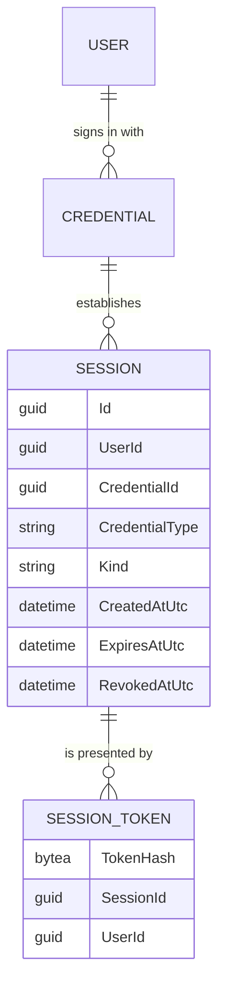
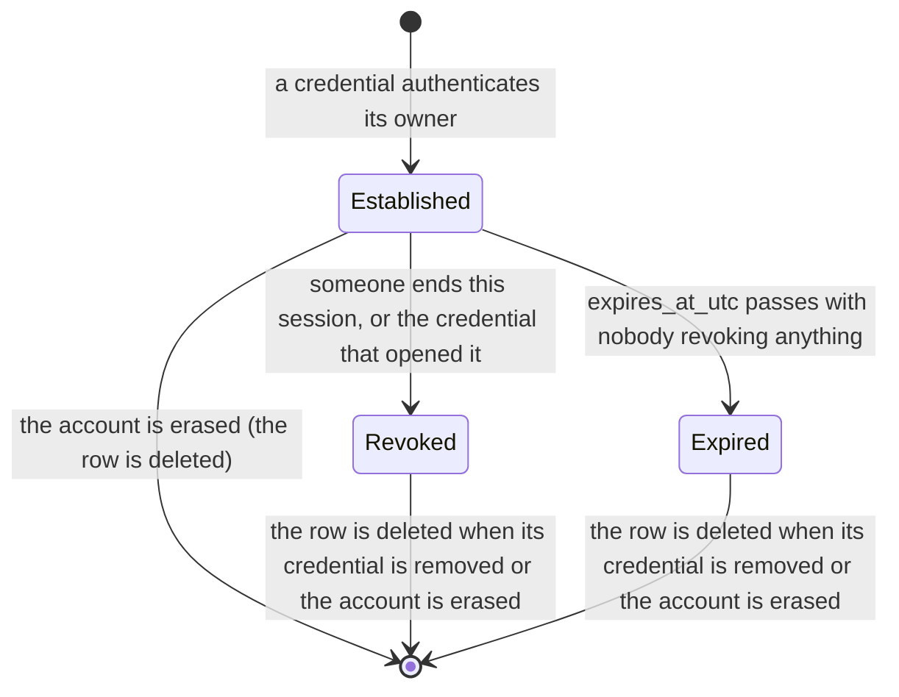
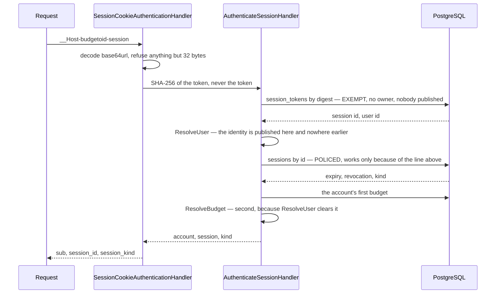

# Sessions

## Table of Contents

- [Purpose](#purpose)
- [Key Entities](#key-entities)
- [Constraints](#constraints)
- [Business Rules & Invariants](#business-rules--invariants)
- [Workflows & State Transitions](#workflows--state-transitions)
- [Decision Trees](#decision-trees)
- [Integration Points](#integration-points)
- [Edge Cases & Known Gotchas](#edge-cases--known-gotchas)

## Purpose

This area covers **an established sign-in the product owns**: a row it wrote, can read, and can end
without asking anyone. Identity lives in [users-and-ownership.md](users-and-ownership.md); this file
covers what happens *after* a credential has answered who is asking. The distinction is the whole
point: a token issued by an identity provider cannot be taken back by this product, while a session
row can be ended here, in one write, by the same role that serves every request.

**Five things establish a session and there is no sixth.** Four open a `Full` session and one
opens a `Locked` session, and all five last 14 days. The fourth is the earliest in a person's life
with the product: **completing `POST /api/registration`**, which signs somebody in on the passkey
the same request created — see [registration.md](registration.md). The fifth is the **locked
sign-in**, `POST /api/locked-session`: a Google ID token and nothing else, turned into a `Locked`
session over the account's federated credential — see the rule on it below.

**The loop is closed on the server.** All five paths mint a handle and set the cookie; a request
presenting it is authenticated from it, publishing the account and the ambient budget; and
`POST /api/me/session/revocation` ends it. **Two of the five have a screen**: `/register` runs its
creation ceremony and `/welcome` runs the assertion. The other three are reached today only by the
integration suite — nothing in the browser redeems a code, regenerates a set or runs the locked
sign-in. Every request this app makes is authenticated from the cookie. The browser contacts the identity provider from two
screens: `/register`, to create an account, and `/app/settings`, to change its address — and the
email change's request carries a provider token **beside** the cookie, never in its place; see
[email-change.md](email-change.md).

## Key Entities

- **Session** — one established sign-in. It carries a `Guid Id` of its own, the `UserId` whose
  account it reaches, the `CredentialId` of the credential that established it, that credential's
  `CredentialType`, a `SessionKind`, the instant it began, the instant it expires, and a nullable
  instant at which it was revoked. It holds no navigation properties: it names its user and its
  credential by id, exactly as **Credential** names its user by id.
- **SessionKind** — `Locked` or `Full`, **derived from the establishing credential's type**, never
  supplied. A `Passkey` and a `RecoveryCodes` credential each open a `Full` session; a `Federated`
  one opens a `Locked` session and is the **only** type that does. `Session.ReadsBudgetContent` is
  the computed reading of that, true only for `Full`. `Locked` is declared first so that
  `default(SessionKind)` is the value reaching nothing — the fail-closed direction, not alphabetical
  accident.
- **`Session.CredentialType`** — a copy of the establishing credential's type, carried on the row so
  the database can check the derivation. A `CHECK` sees only the row in front of it, so the fact
  `kind` is derived from has to be on that row for the derivation to be checkable at all.
- **SessionToken** — the handle one session will be presented by, stored as `SHA-256(token)`. It
  carries the digest, the `SessionId` it opens and the `UserId` that owns it, and **nothing else** —
  no timestamps, because the session row already carries when it began, when it expires and whether
  it was revoked, and a second copy is a second set of the same facts to keep in step.

  **Why it is a table of its own.** A presented token has to be looked up *before* the request has
  an identity, and `sessions` is policed by `user_isolation` keyed on `app.current_user_id` —
  exactly the value the lookup exists to produce. So the discovery key goes on its own **exempt**
  table and everything read *after* the answer stays on the policed one. That is the split
  [ADR 0012](../decisions/0012-split-a-passkeys-material-by-whether-it-is-read-before-identity.md)
  argues for a passkey's material, applied here by
  [ADR 0019](../decisions/0019-authenticate-a-request-from-a-first-party-session-cookie.md). The
  ordering rule below states what breaks if the two are folded back together.

  **What the hash buys is not what a recovery code's hash buys.** A recovery code never reaches this
  server; a session token does — this server mints it and reads it on every request — so the digest
  is not a claim that the value is unknown here. It is a claim about what a *copy* of the table is
  worth: a backup, a replica or one unbounded read yields digests, and a digest of a 256-bit uniform
  value cannot be turned back into the token a request would have to present.

A session record deliberately carries **no** last-used instant, device name, IP address or user
agent. Each would be a column nothing reads, and a column nothing reads is data held for no one.


```mermaid
erDiagram
    USER ||--o{ CREDENTIAL : "signs in with"
    CREDENTIAL ||--o{ SESSION : establishes
    SESSION ||--o{ SESSION_TOKEN : "is presented by"
    SESSION {
        guid Id
        guid UserId
        guid CredentialId
        string CredentialType
        string Kind
        datetime CreatedAtUtc
        datetime ExpiresAtUtc
        datetime RevokedAtUtc
    }
    SESSION_TOKEN {
        bytea TokenHash
        guid SessionId
        guid UserId
    }
```

**`SESSION_TOKEN` is drawn one-to-many because that is what the schema holds.** The primary key is
the digest, so nothing stops a session from having several token rows or none. One-to-one would need
a unique constraint on `session_id` for one half and a trigger for the other, and
[ADR 0002](../decisions/0002-enforce-rules-at-the-lowest-capable-layer.md) forbids pushing
procedural logic down to satisfy "lowest layer".

**The port's shape holds it instead.** `ISessionRepository.AddAsync` takes the session **and** its
token with no overload taking a session alone, so a session cannot be written without its handle by
construction; `ISessionTokenRepository` stays read-only from the other side, since a second way to
write a token is a way to produce one naming a session that was never committed.
`IRegistrationRepository.RegisterAsync` is a **second writer** and the invariant survives, because
the pairing was what was pinned rather than the port: that path has no transaction, so a second
`AddAsync` — which saves on its own — would be a second transaction and the account would stop being
atomic, silently, while `Domain.Users.Registration` carries the session **and** its token as
required members. A third writer is a decision rather than a refactor.

## Constraints

### MUST

- **A session is isolated by user, like `users` and `budgets`.** `sessions` carries `user_id` and no
  `budget_id`.
  - **Why**: a session belongs to a person; the budgets that person owns are reached through their
    own policies, one layer down.
  - **Enforced in**: the `user_isolation` policy on `sessions` in `app-role-grants.sql`, comparing
    `user_id` against `app.current_user_id` in both `USING` and `WITH CHECK`;
    `SessionContextInterceptor` puts that setting on every connection the context opens.
    `RowLevelSecurityCoverage` reaches the verdict from the table's own columns rather than from a
    list, so `RlsCoverageTests` and the deploy-time verifier both required this policy the moment
    the table existed. `RlsIsolationTests` proves the three halves — another person's rows are
    invisible, an insert naming another person is refused, and a connection naming nobody fails with
    `22P02`. See [ADR 0011](../decisions/0011-police-the-user-owned-tables.md).
    - **`user_id` is `NOT NULL`, and that is load-bearing**: a `NULL` owner fails *closed*, because
      `NULL = anything` is `NULL` and never true, so the row would be invisible to every session
      including the one that wrote it — a write that succeeds and a read that cannot be explained.

- **A session's identity columns — `user_id`, `credential_id`, `credential_type`, `kind`,
  `created_at_utc`, `expires_at_utc` — are immutable. `revoked_at_utc` is the only column an edit
  may reach.**
  - **Why**: changing `credential_id` would relabel which key opened the door, and which key opened
    it is the fact revocation is decided by. Changing `kind` would hand budget content to a session
    a federated credential opened, the one thing the kind exists to refuse.
  - **Enforced in**: the grant matrix. `GRANT SELECT, INSERT ON sessions` plus
    `GRANT UPDATE (revoked_at_utc) ON sessions` — the other six are immutable by **omission from the
    column list**, never by a `REVOKE`, which additive column privileges could not express. A
    one-column list is still a list and must not be collapsed into a table-wide grant. Above it,
    `Session` exposes no public setter. `AppRoleGrantsTests` pins a `42501` for each of them in the
    same test as a permitted `revoked_at_utc` update reporting one affected row — the affected-row
    count is what stops the pair passing when row-level security matched nothing. See
    [ADR 0004](../decisions/0004-connect-as-a-least-privilege-role.md).

- **A session's expiry MUST be after its creation.**
  - **Why**: a session whose expiry is at or before its creation was never live, and a row that was
    never live can only mislead whatever reads it.
  - **Enforced in**: `CK_sessions_lifetime` (`expires_at_utc > created_at_utc`), restated in
    `Session.Establish` so a bad call fails with a named field rather than a raw `23514`. No request
    can reach it: each of the five establishing paths computes the expiry by adding the shared
    lifetime to the instant it just read. The restatement guards against a future caller that
    computes an expiry from something a request supplied.

### MUST NOT

- **The application role MUST NOT hold `DELETE` on `sessions`.**
  - **Why**: revocation writes `revoked_at_utc`; it does not remove the row. Session rows do leave —
    the cascade from `credentials`, and through it from `users` — but that reaches them by
    descending from a row rather than by a privilege over this table, so it cannot single one out.
    **The result is that ended rows accumulate**: a revoked or expired session stays until its
    credential or the account goes, so an account's `sessions` rows are a timestamped record of its
    sign-ins for the life of the credential that opened them — which the behavioural-record rule in
    [users-and-ownership.md](users-and-ownership.md#must) weighs. Nothing sweeps them. A sweep would
    need this grant, and whoever changes that has to re-argue the paragraph in
    `app-role-grants.sql` rather than quietly delete it.
  - **Enforced in**: no `DELETE` appears for `sessions` in the grant matrix, pinned by
    `Database_RefusesToDeleteASession`.

- **No policy on `sessions` may read `kind`.**
  - **Why**: the two policies the schema carries answer *whose* a row is. The kind answers something
    else — how far into their own account a person's own credential reaches — and a predicate
    consulting it would invent a third isolation axis beside those two. It is also the wrong table:
    the rule has to refuse reads of `accounts`, `transactions` and the rest, and a policy on
    `sessions` governs `sessions`.
    - **A correction worth reading, because the obvious repair rests on it.** This entry once argued
      that a locked session satisfies `budget_isolation` nowhere *because it resolves no ambient
      budget*. That was never true. `AuthenticateSessionHandler` publishes the tenant for every
      **live** session whatever its kind — only an *ended* one is left with no budget — so a locked
      session reaching a budget-scoped route was reaching it with its own budget resolved and being
      answered normally. Nothing was refusing this until the requirement below.
  - **Enforced in**: the `user_isolation` policy compares `user_id` alone, and no other policy
    exists on the table. What the kind *is* enforced by is the application's fallback authorization
    policy — see the rule below, which carries the ADR 0002 statement for why it sits there.

- **The API MUST NOT set any cookie but `__Host-budgetoid-session`.**
  - **Why**: the session handle is the one thing a cookie is needed for, and it serves the request.
    Any other cookie would be set for some other purpose — a preference, tracking, analytics, load
    balancer affinity — which is data the product does not keep, and it would be the first thing to
    need a consent surface. The product presents none because it has nothing to ask consent for. No
    framework default writes one today: no cookie authentication scheme, antiforgery, session or
    TempData middleware, or OpenID Connect handler is registered — only the session scheme and
    `JwtBearer`, which is stateless.
  - **Enforced in**: `CookieCensusTests.Traffic_SetsNoCookieButTheSession`. It drives the log
    census's traffic, so every declared route answers a 2xx at least once — the same floor
    `LogRedactionTests` asserts — then requires the session cookie to have been seen and no other
    cookie name on any response, matched or not, at any status. `RouteTally` captures the names from
    `Response.OnStarting`, registered first so it runs last, and
    `Census_ReportsACookieAddedOutsideAnEndpoint` is the control: a cookie appended outside any
    endpoint, after the pipeline has returned, is still seen.
    - **What it does not reach**: a branch the traffic never takes; the provider-token path on the
      real bearer handler; a cookie appended from an `OnStarting` callback registered before the
      tally's; a host outside Development, since the census host runs in Development and a cookie
      set only on another environment's branch is not seen; a cookie written outside ASP.NET Core's
      response headers, which nothing in this API can do; cookies set outside the API — the web
      client's scripts and the static host; and the session cookie's own attributes, which the
      cookie rule below pins.

## Business Rules & Invariants

- **Rule**: A session's kind is **derived** from the establishing credential's type. There is no way
  to ask for one.
- **Why**: an authorization exchange with an identity provider returns claims, not a secret the
  client can turn into a key. So any account reachable by a provider sign-in would be an account the
  provider's holder could read — which is why a federated credential opens a session reaching no
  budget content, and **`federated` is the only credential type that cannot**. The rule runs that
  way round: a passkey and a set of recovery codes are each a secret in the holder's own possession,
  so both open a `Full` session. **The key custody those secrets carry is exercised on one of the
  two**: a passkey sign-in derives a key-encryption key from the assertion's PRF branch, reads the
  account's wrapped rows, opens the one pair that key was sealed against and holds the account's two
  keys for the visit — so a federated credential's inability to do any of that is a difference the
  client can now demonstrate rather than only argue. Nothing redeems a code in a browser yet, so the recovery-code half of the
  same claim is still carried by possession alone. See [recovery-codes.md](recovery-codes.md) and
  [account-keys.md](account-keys.md).
- **Enforced in**: `CK_sessions_kind_matches_credential`,
  `(kind = 'full') = (credential_type in ('passkey', 'recovery_codes'))`, the lowest layer that can
  state the rule declaratively. Without it the rule lived only in the factory while
  `GRANT SELECT, INSERT ON sessions` stayed table-wide on `INSERT` —
  `(credential_id = <a federated credential>, kind = 'full')` was a fully storable row.
  `CK_sessions_kind` bounds only the vocabulary and the composite foreign key proves only whose the
  two rows are; neither refuses that pair. Above it, `Session.Establish` takes the `Credential` and
  no kind, deriving it through a switch with every arm written out and a throwing discard arm.
  - **The full side stays enumerated, and the spelling is a decision rather than a style.** The
    mirror form — `(kind = 'locked') = (credential_type = 'federated')` — says the same thing about
    every row this schema can hold today, reads better, and is what a later reader will propose. It
    fails **open**: a fourth credential type is not `federated`, so it satisfies the right-hand side
    and is granted a full session by default, with nobody having decided that. The shipped form
    fails closed. **No test in the suite can tell the two spellings apart until that fourth type
    exists**, so this paragraph and the comment beside the constraint are the only things carrying
    the difference. It is also why adding `recovery_codes` to the `in` list was the correct edit
    rather than the occasion to simplify.
  - **The rule is unrepresentable, not merely untested.**
    `SessionTests.Session_ExposesNoWayToChooseItsKind` reflects over the public surface and fails on
    any parameter or settable property of type `SessionKind`. Without it, the obvious accommodation
    for a caller wanting a different kind is an overload taking one, and the rule dissolves with no
    test going red.
  - **The copy cannot drift**: `credential_type` duplicates `credentials.type`, `credentials` holds
    no `UPDATE` grant of any shape, and the composite foreign key below ties the two columns
    together on every insert.
- **Example**: a `RecoveryCodes` credential handed to `Session.Establish` yields a `Full` session; a
  `Federated` one yields `Locked`; a fourth credential type yields a throw rather than a default.
- **Counterexample**: a `bool canReadBudgetContent` argument on the factory. It reads as a
  permission the caller sets, and the first caller that sets it wrongly is the whole rule gone.
- **Source**: `[SOURCE: discussion]`

---

- **Rule**: Revocation is an **`UPDATE` of `revoked_at_utc`**, never a `DELETE`, and it is
  **idempotent** — an already-revoked session keeps the instant access actually ended.
- **Why**: the row is what says access ended and when. Deleting it needs a `DELETE` grant, the
  single privilege that can erase every session on the system, and it cannot tell "already revoked"
  from "never existed" — a distinction anything reporting a revocation needs. The usual argument for
  `DELETE`, that updated rows accumulate, does not separate the two options: an unrevoked but
  expired row accumulates identically. What accumulates is a sign-in record — see the MUST NOT on
  `DELETE` above. **Note what this is not**: a tombstone. A session row exists
  only while its account does, so a revoked session leaves nothing behind an erasure.
- **Enforced in**: `Session.Revoke` returns without writing when `RevokedAtUtc` is already set;
  `SessionRepository.RevokeForCredentialAsync` loads the credential's unrevoked sessions and calls
  it per row. `ExecuteUpdateAsync` is a compile error under `BannedSymbols.txt`, and the ban buys
  correctness here rather than uniformity: a set-based `UPDATE` would rewrite every matched row's
  instant on every call and report a retry as if it had ended access a second time.
  - **Concurrently, too**: `Session.Revoke`'s idempotence is a property of one object in memory, so
    on its own it does not survive two sweeps running at once — both would read the rows as
    unrevoked and the later commit would overwrite the first instant. `revoked_at_utc` is therefore
    a **concurrency token**: the `UPDATE` carries `and revoked_at_utc is null`, the losing sweep
    matches zero rows and raises `DbUpdateConcurrencyException`, and `RevokeForCredentialAsync`
    answers it by re-reading and retrying. A token in the `WHERE` clause needs only `SELECT`, so the
    `GRANT UPDATE (revoked_at_utc)` column list is unaffected.
- **Example** — **what the returned count means**: the number of sessions **this call** ended,
  excluding any a concurrent sweep ended first. It counts the **unrevoked**, not the live: the
  filter is `revoked_at_utc is null` and says nothing about expiry, so a session that expired with
  nobody revoking it is in the number. It reaches the wire on both paths as `sessionsEnded`, which
  makes it a published contract; on the generation path it is also the condition that path's
  re-established session is written on, so **what this number counts cannot be changed on one caller
  alone**. See [recovery-codes.md](recovery-codes.md).
- **Counterexample**: tightening the filter to "live at the caller's instant". It would look like a
  fix to the recovery-code rule and would silently change what a passkey revocation reports.
- **Source**: `[SOURCE: discussion]`

---

- **Rule**: Revoking a credential ends **only** the sessions that credential established. Every
  other credential on the same account stays signed in.
- **Why**: revoking one device is the reason the operation exists.
- **Enforced in**: `SessionRepository.RevokeForCredentialAsync` filters on `CredentialId` and never
  on `UserId`, and `RevokeSessionsForCredentialHandler` names a credential in its command.
- **Example**: an account holding a passkey on a phone and another on a laptop. Losing the phone
  revokes the phone passkey's sessions; the laptop stays signed in.
- **Counterexample** — the one to watch: a predicate keyed on `UserId`. Every session in a
  single-credential account has the same owner, so every test in the suite passes under it except
  the two written for exactly this —
  `RevokeSessionsForCredentialHandlerTests.HandleAsync_LeavesAnotherCredentialsSessionsActive` and
  `SessionRepositoryTests.RevokeForCredentialAsync_RevokesOnlyThatCredentialsSessions`.
- **Source**: `[SOURCE: discussion]`

---

- **Rule**: A session and the credential that established it belong to the **same person**, and the
  database refuses a row where they do not.
- **Why**: `user_isolation` reads `user_id` and never looks at the credential, so a session naming
  someone else's credential is a row the policy would happily show to the wrong person.
- **Enforced in**: one composite foreign key,
  `sessions (credential_id, user_id, credential_type) → credentials (id, user_id, type)`, against
  the `AK_credentials_id_user_id_type` alternate key — the same idiom the budget-owned tables use
  one level down. `credential_type` rides along so a session cannot disagree with its credential
  about what opened it, which is what makes `CK_sessions_kind_matches_credential` a claim about the
  real credential rather than about a value the row asserted for itself.
  `SessionSchemaTests.Database_RefusesASessionWhoseCredentialBelongsToAnotherUser` pins the `23503`.
  - **Consequence**: `credentials` gained an alternate key and **no new column**, which matters —
    the exemption in `RowLevelSecurityCoverage.Exemptions` pins that table's exact column set.
- **Source**: `[SOURCE: discussion]`

---

- **Rule**: Deleting a credential deletes its sessions (`ON DELETE CASCADE`). There is deliberately
  **no** second foreign key from `sessions` to `users`.
- **Why**: `Restrict` would let a session hold up the deletion of a credential, and through it an
  account erasure — a row of access bookkeeping outranking a person's request to be forgotten. The
  credential's own cascade to `users` reaches sessions transitively, so a direct one would add
  nothing but another constraint name for the pinned snapshots to carry.
- **Enforced in**: `SessionConfiguration`;
  `SessionSchemaTests.Database_RemovesASessionWithTheCredentialThatEstablishedIt` and
  `Database_RemovesASessionWithTheUserThatOwnsIt` pin both hops.
- **Source**: `[SOURCE: discussion]`

---

- **Rule**: A request authenticates from an opaque token in a first-party cookie, and the two reads
  that turn it into an identity happen in **one order that cannot be rearranged**: the exempt
  `session_tokens` lookup first, the identity published second, the policed `sessions` row third.
- **Why**: this is the circularity
  [ADR 0019](../decisions/0019-authenticate-a-request-from-a-first-party-session-cookie.md) exists
  for. `sessions` is policed by `user_isolation` keyed on `app.current_user_id`, exactly the value
  the lookup exists to produce, so a session read issued before the publication meets `''::uuid` and
  raises `22P02` — on **every** authenticated request, not on an edge. The digest is what makes
  publishing on the strength of the lookup alone defensible: it is SHA-256 of a 256-bit value this
  server minted, so a caller presenting one it was never given is guessing it.
- **Enforced in**: `AuthenticateSessionHandler`, in Application, where the order is the security
  property; `SessionCookieAuthenticationHandler` in the API decodes the cookie and decides, and
  looks nothing up — `CompositionBoundaryTests` holds the API to composing Infrastructure rather
  than consuming it, and this is the path where that shortcut would cost most.
  `AuthenticateSessionHandlerTests` pins the order in both directions over
  `RecordingUserContextWriter`; `SessionCookieAuthenticationTests` drives the whole path over the
  real least-privilege connection, which is the test that dies with `22P02` if anyone ever wraps it.
  - **No transaction anywhere on this path**, the same trap from the other side: one opened before
    the publication configures its connection while the setting is still empty, and every policed
    statement inside it fails. `RegisterAccountHandler`, `CompleteAssertionHandler`,
    `RedeemRecoveryCodeHandler` and `EstablishLockedSessionHandler` each carry the same warning. Nothing here writes, so an atomic unit
    would be protecting nothing.
  - **Two round trips per authenticated request**, stated as the cost rather than hidden. Folding
    them into one is the "denormalise the expiry onto the exempt table" alternative ADR 0019
    refuses.
- **Counterexample**: reading `sessions` first and publishing afterwards, which reads as the same
  three steps in a tidier order and refuses every request in the product.
- **Source**: `[SOURCE: discussion]`

---

- **Rule**: The handle travels in `__Host-budgetoid-session` — `HttpOnly`, `Secure`, `SameSite=Lax`,
  `Path=/`, no `Domain` — and its expiry is **absolute, never sliding**.
- **Why**: the `__Host-` prefix is a rule a browser enforces rather than a naming style: it refuses
  the cookie unless it is `Secure`, `Path=/` and carries no `Domain`, which stops a neighbouring
  host from setting one. `HttpOnly` is why no response body ever carries a session identifier — the
  cookie is the handle precisely so that script is not. `Lax` suffices because the frontend and the
  API share one registrable domain; a cross-site topology would have forced `None`, the deployment
  argument [ADR 0010](../decisions/0010-serve-the-app-from-a-custom-domain.md) carries. A
  **sliding** expiry would need `GRANT UPDATE (expires_at_utc)` — the column list this file argues
  is immutable by omission — and would write a row on every request to buy it.
- **Enforced in**: `SessionCookie`, which owns the name and builds the attributes once so the issue
  and the clear cannot drift. `SessionCookieTests` pins each attribute. It is also the only cookie
  the API sets — see the MUST NOT above.
  - **The clear must match the issue attribute for attribute**, and this is the pin most worth
    having: a browser silently keeps a cookie whose clear does not match, and the symptom is a
    sign-out that appears to work and a session that comes back.
- **Source**: `[SOURCE: discussion]`

---

- **Rule**: Every request must name itself as first-party with a non-empty `X-Budgetoid-Client`
  header. `GET /health` is the only exemption. A request without it is refused **403**, before
  authentication.
- **Why**: this is the CSRF control, and a cookie is what makes one necessary — a browser attaches a
  `SameSite=Lax` cookie to a top-level cross-site navigation, and the header is the thing no
  cross-site form can add and no cross-origin `fetch` can send without surviving a preflight. Two
  halves a reader will want to weaken: the **value is deliberately unchecked**, because an attacker
  who could set the header could set any value in it and a checked value would be a shared secret
  shipped to every client; and the control **covers the anonymous routes**, because those are the
  ones that *set* a cookie, and login-CSRF is signing somebody into an account they do not own so
  that what they record next is filed under it.
- **Enforced in**: `FirstPartyRequestMiddleware`, registered **after** `UseCors` — so a preflight is
  answered by the CORS middleware and never meets a check no `OPTIONS` request can satisfy — and
  **before** `UseAuthentication`. `/health` is named from `ServiceDefaults.Extensions.HealthPath`
  rather than typed again. `FirstPartyRequestTests` sweeps the route table and pins the exempt set
  in both directions.
  - **The suite cannot see this control**, because `ApiFactory` gives every client it hands out the
    header. `FirstPartyRequestTests` therefore removes it again on its own clients, and the two are
    a pair: delete the factory's line and the whole suite answers 403; delete the removal and the
    three tests that exist to withhold the header start sending it and stay green while proving the
    opposite.
- **Source**: `[SOURCE: discussion]`

---

- **Rule**: The web client decides **once** whether a request is going to this product's API, and
  that one answer carries **three** effects: `withCredentials: true` and the `X-Budgetoid-Client`
  header on every such request, and the `Authorization: Bearer` header on **three routes and no
  others**, from two sources: `POST /api/registration/options` and `POST /api/registration` take the
  id token the library stored, and `POST /api/me/email-change` takes only the token its own request
  carries on the `PROVIDER_CREDENTIAL` context token. The decision compares **origins**, never a
  string prefix, and the origin is settled **before** the route is looked at.
- **Why**: the three effects share a predicate because two predicates drift, and the drift is silent
  in both directions. Drop the cookie and every request arrives unauthenticated; drop the header and
  every request answers 403; widen the predicate and the browser hands this app's credentials to
  somebody else's host. That last is not hypothetical: `url.startsWith(apiBaseUrl)` — the shape the
  bearer-only interceptor shipped with — admits `https://api.budgetoid.app.attacker.example`, a name
  anybody can register. The cookie itself is safe there, because a browser scopes `__Host-` cookies
  to the registrable domain that set them; the **bearer** is not, and it is a token this app
  volunteers. Two halves a reader will fold together: the bearer is conditional on holding an id
  token and the other two are **not**, because a browser with a session cookie and no id token is
  every browser after registration; and an empty `apiBaseUrl` classifies **nothing** as this API,
  because `''` is a prefix of every string on earth and failing open there hands credentials to
  every request the app makes.
  - **The bearer is permanent on the two registration routes.** They authenticate on the provider's
    scheme and nothing else, because an account may not exist without a completed provider exchange
    and there is no first-party credential to present on the one call that creates the first-party
    account.
  - **On the email change the bearer comes from the request, never from storage.** The library's
    storage is either empty — the provider-token rule below cleared it when the session began — or
    holds a token an abandoned registration left before that clear ran. It never holds the token
    this change was handed, which the return took into memory and discarded from storage. So a
    stored token is at best somebody's old answer to another question, sent on a request that was
    handed none. `MeApiService.changeEmail` puts the token the email
    change's return handed over on the context and writes no header itself; the interceptor reads
    that context on the exact path `EMAIL_CHANGE_PATH` and ignores it on every other route. An empty
    string is no credential. See [email-change.md](email-change.md).
  - **Narrowing was worth doing, and no route the client calls reads a provider token anywhere else.**
    `SessionService` discards the stored token once the tab holds a session, but a browser that
    abandoned registration still holds it when that person does what they usually do next, a
    passkey sign-in, and the discard comes only after that sign-in answers. So both anonymous
    assertion legs were being handed a provider credential they could not act on. Every hop a
    credential makes is another log, proxy and error report it can be recorded in.
  - **The order of the two questions is the security property.** Origin first, route second.
    Reversed — or folded into one path test —
    `https://api.budgetoid.app.attacker.example/api/registration` is a registration request. The
    path predicate therefore takes a **pathname** rather than a URL, so a caller has to have settled
    the origin in order to have an argument for it at all.
- **Enforced in**: `apiCredentialsInterceptor` in `+core/interceptors/`. The predicate is **exported
  from there and imported** by `sessionExpiryInterceptor`, which needs the same answer on the way
  back: one definition with two callers. The two registration paths are declared there too and
  imported by `RegistrationApiService`, which builds the requests — that direction and not the
  other, because the service already imports two paths from here, so the opposite edge would close a
  cycle directly. A second spelling of either path fails silently in both directions: corrected only
  in the service, the bearer is lost and the flow's first call meets a `401`; corrected only in the
  interceptor, the provider's token goes to a route that has moved. `EMAIL_CHANGE_PATH` is declared
  there and imported by `MeApiService` for the same reason, and `PROVIDER_CREDENTIAL` lives in a
  module of its own, `provider-credential.token.ts`, for `EXPECTS_UNAUTHENTICATED`'s reason below.
  `api-credentials.interceptor.spec.ts` holds the email change's half in a block of its own: the
  context's token as the bearer, no stored token when the request carries none, a carried token
  ignored on every other route, nothing to the path on another origin, exact-path matching, and no
  bearer for an empty string.
  - **`EXPECTS_UNAUTHENTICATED` is the same rule reached from the other side and answered
    differently**: it lives in `expects-unauthenticated.token.ts`, a module holding the token and
    nothing else, rather than in the interceptor that reads it. Three unrelated services set it and
    one interceptor reads it, and that interceptor depends on `SessionService`, which depends on
    `MeApiService` — so declaring the token inside the reader drags the reader's whole import graph
    into every writer and closes a three-module cycle the moment one writer is on that graph, which
    is exactly what happened when the session probe became a writer. The origin predicate can stay
    where it is because both ends of its edge are interceptors.
  - The interceptor's spec calls the function directly and therefore cannot see whether anybody
    registered it, so `app.config.spec.ts` stands up the real provider list with only the HTTP
    backend swapped and goes red on an emptied `withInterceptors([…])`. Without it the registration
    can be deleted with the whole suite green and the product answering 403 to everything. **Three
    of that spec's assertions separate mistakes nothing else would catch**: that the two assertion
    legs and `GET /api/me` carry no bearer; that the narrowing touched the bearer alone, since
    narrowing the whole interceptor to the registration routes would cost every other request its
    cookie and its header — a 403 on every route, from a change that reads as a tightening; and that
    a registration **path** on another origin is sent nothing at all, the one assertion a path-first
    implementation fails.
- **Source**: `[SOURCE: discussion]`

---

- **Rule**: On a cold load the client asks the server who the visitor is, **once**, before the first
  route activates. The answer has **four** values: `authenticated`, `anonymous`, `unreachable`, and
  `unknown` before the question has been answered. **Only `anonymous` may bounce anybody** — both
  guards admit `unreachable` and `unknown`.
- **Why**: the cookie is `HttpOnly`, so there is no local evidence to read and asking is the only
  way to know. The four values exist because **an answer that never arrived is not evidence about
  the visitor**. Collapsed into `anonymous`, one blinked request during the cold load signs a person
  holding a perfectly good session out of their own account and drops them on a page served by the
  same server they could not reach, where nothing they do fixes it — the same defect as collapsing
  `null` into `0` on the recovery-code count. `403` joins `401` as `anonymous`, while a 500, a
  timeout and a status-`0` network failure all read `unreachable`. `unknown` is the same argument
  before the first ask rather than after a failed one; admitting it means a deleted initializer
  costs a redundant state rather than every visitor bounced on every cold load.
- **Enforced in**: `SessionService` in `+core/session/`, probed from the `APP_INITIALIZER` in
  `core.providers.ts` **after** `config.load()` and **awaited**. Two rules ride on that one call and
  each is silent when broken.
  - **The ordering.** The config holds `''` until `load()` resolves, so a probe made before it
    addresses `GET /api/me` to this app's own origin — which answers neither 404 nor 401 but **200
    with `index.html`**, the SPA fallback of the dev server and of Azure's `navigationFallback`
    alike. That body fails to parse under `responseType: 'json'`, which reads as `unreachable`, and
    both guards admit it — so the visitor reaches `/app`, the screen paints, and its own requests
    are refused: a flash of somebody else's screen on every cold load. `BaseApiService` resolves the
    base **per request** so no service can hold a stale copy, which rests the ordering on when the
    request is made rather than on when a class is built.
  - **The probe goes through `MeApiService.getSessionOwner()`, which carries
    `EXPECTS_UNAUTHENTICATED`, and never through `getMe()`.** One route, two questions: the probe
    asks whether there is a session and a `401` is its answer, while the Settings screen reads the
    same route signed in and a `401` there is a session that ended. Unmarked, the probe navigates
    **every anonymous cold load** to `/welcome` from inside the initializer, before any route
    activates — so `/register`, the address the identity provider redirects back to, is unreachable
    by URL.
    - **A second caller asks the same question and needs the same suppression for a different
      reason.** An unlock reads `GET /api/me` beside the account's keys, to learn the budget its
      rotation-epoch record is filed under, and it reaches it through this member. It is **not** a
      browser holding no session — it is signed in, demonstrably — so the sentence above does not
      cover it and must not be stretched to. What covers it is `AccountKeyCustodyService`'s own rule:
      a key that will not open is not a session that ended, and neither is an identity read that was
      refused mid-unlock. Both of the unlock's reads therefore carry the token, and custody publishes
      one word about the pair rather than letting the interceptor navigate. See
      [account-keys.md](account-keys.md).

  The **await** is what keeps every guard synchronous — bootstrapping cannot finish while the answer
  is outstanding — and `core.providers.spec.ts` pins both halves separately, because a
  `void probe()` satisfies one and fails the other. `probe()` resolves however the read ends and
  **never rejects**; a rejection is not a failed probe but an application that never finishes
  starting.
  - **One read rides *after* the probe and is conditional on its answer.**
    `KeyRotationService.readStagedRotation()` runs in the same initializer, so that "a key rotation
    is in flight" survives a reload — see [key-rotation.md](key-rotation.md) for what the three
    content screens do with it. It is sequential and **not** parallel, and it is made only when the
    probe answered `authenticated`: that route is authenticated, an anonymous visitor asking it is
    answered `401`, and `sessionExpiryInterceptor` is the single owner of "the session ended" and
    acts on `401` alone — so an unconditional read announces a session ending to somebody who never
    had one, on every anonymous cold load. Nothing in it is awaited for the guards' sake; what the
    await buys is a screen that does not draw a list the answer would have replaced.
  - **The reading also moves twice mid-visit, and both moves are a *set* rather than a re-probe.**
    `ended()` is called by `sessionExpiryInterceptor` on a `401`, by the Settings screen's sign out,
    and by `ErasureFlowService` on the erasing request's `204`. The last two call it **before** they
    navigate to `/welcome`, because `guestGuard` reads the status the moment the router asks, and a
    navigation made first is judged against a stale `authenticated` and sent back into the app.
    `established()` is called by the registration flow on the `201` and by the sign-in flow on the
    assertion's answer. Each time the server has just said what it thinks, in the same breath as
    the cookie it set or the refusal it answered, so asking again would replace an answer with a
    guess over a network that may itself be the problem. On the establishing side a re-probe also
    costs a round trip at the happiest moment of the flow and can come back `unreachable` — a
    **third** reading of a fact already stated.
  - **`ended()` is the single owner of "the account's keys go too", and `established()` owns no key
    material.** What `established()` does own is discarding the provider's tokens, which is a
    different fact and has its own rule below. A session ending is where `AccountKeyCustodyService.lock()` is called, in that
    one method rather than at each of its callers: a path added later by somebody thinking about
    something other than key material clears the keys for free — the erasure's `204` is one that
    arrived that way, and it has no line of its own for the keys — where copies at the call sites
    would leave such a path holding an ended session whose content key is still readable from the
    root injector for the life of the tab, with nothing red either way. It is **not** an
    `effect()` over `status`: that fires on construction, so whether it wipes a set already adopted
    would be decided by injection order, and the only honest predicate available to it is "lock on
    `anonymous`" — locking on `unreachable` would destroy both keys over one blinked request and
    demand a full WebAuthn ceremony to get them back, which is the failure the fourth state exists
    to prevent, reappearing one layer down. The mirror is that a session *beginning* says nothing
    about which factor opened it, so `established()` unlocks nothing and the two establishing flows
    that do know hand the keys over themselves. **Those two are no longer the only handers**, which
    is the sharper reason `established()` cannot own this: the settings screen's Unlock hands custody
    a key on a session that opened hours ago, so unlocking and establishing are not even the same
    kind of event — one of them is invisible to every rule in this file. See
    [account-keys.md](account-keys.md).
  - **The order at the end of an establishing flow is the requirement, not the tidiness.** The
    session is published **before** the navigation to `/app`; published after, the guard judges that
    address against a stale `anonymous` and bounces the person straight out of the account they have
    just opened — a defect that reproduces every time and reads as a routing problem.
    `register.component.spec.ts` records the reading at the instant the navigation is asked for, the
    only way to see the ordering at all. **Both flows that end this way keep the same three
    statements in the same order**: publish the session, hand the account's keys to custody,
    navigate. The custody call sits between them rather than after the navigation because
    `/welcome` and `/register` are discarded by that navigation, and it is **not awaited** — `unlock`
    returns `void` precisely so a round trip cannot land between a verified assertion and the app.
- **Source**: `[SOURCE: discussion]`

---

- **Rule**: A session beginning is the single owner of discarding the identity provider's tokens.
  `SessionService` calls `AuthService.forgetProviderToken()` on **both** arms that publish
  `authenticated` — `established()`, and a start-up probe the server answers with a session — and
  **never** on `anonymous` or `unreachable`.
- **Why**: the library keeps the provider's tokens in `sessionStorage`: the access token, the id
  token, the decoded claims with the email among them, and the nonce. That storage is per tab and
  survives a reload, so without a discard a registration that was refused or abandoned leaves them
  sitting in the tab when the same person signs in there a minute later, and a signed-in visit
  carries a provider credential and an email address it has no use for. Nothing reads the stored
  tokens once the session cookie has taken over: they are read on `/register` and nowhere after.
  The email change reads a token on a signed-in tab, and it never reads one out of this storage —
  see the bullet on its return below.
  - **The probe arm is not a duplicate of `established()`.** A cold load that finds a session runs
    no establishing flow and skips `auth.initialize()`, so `established()` never runs there. That
    is the tab that reloaded after a registration whose `201` was lost on the way back, or after the
    person signed in from another tab — it holds a session and the tokens both, and only the probe
    sees it.
  - **Never on `anonymous` or `unreachable`**, and the reason is order. The provider-return leg —
    the page load Google redirects back to `/register` — runs the probe **before**
    `auth.initialize()` reads the answer off the URL. A discard there takes the library's nonce with
    the tokens, the answer no longer validates, and registration becomes impossible with nothing on
    the screen saying why. `unreachable` is refused for the same reason: a blinked probe on that leg
    would cost the same.
  - **The same discard ends the exchange marker.** `forgetProviderToken()` also removes
    `budgetoid-provider-exchange`, the key a press on **Continue with Google** or **Change email
    address** leaves so the return leg knows this tab started that trip. A tab that pressed,
    abandoned at the provider and then signed in by passkey — or came back on a probe that found a
    session, which skips
    `auth.initialize()` — would otherwise keep it, and an answer-shaped address opened there later
    would contact the provider. It rides the same two arms for the same ordering reason: removed on
    `anonymous` or `unreachable`, it would be gone before the return leg read it.
  - **One place, not one per flow**, for the reason `ended()` owns `custody.lock()`: the next
    establishing path will be written by somebody thinking about sign-in rather than about an id
    token in `sessionStorage`, and here it discards for free.
  - **Housekeeping never outranks the session.** A discard that throws — storage refused in a
    locked-down browser, a quota error — is logged through `logFailure` and changes nothing
    published. On the probe the call sits outside the `try`, because inside it a throw would reach
    the `catch` and rewrite a session the server just confirmed as `unreachable`.
  - **The edge runs one way**: `SessionService` injects `AuthService`, and `AuthService` must never
    inject `SessionService`. Both are asked from the `APP_INITIALIZER`, and an edge back would be an
    import cycle between two things bootstrap awaits.
  - **A signed-in flow that uses the provider reads its answer before the probe, and the discard
    then finds nothing.** The email change comes back to a tab holding a session, so the probe
    answers `authenticated` and its discard would take the nonce the answer is checked against. So
    the `APP_INITIALIZER` reads an email-change return **before** the probe:
    `AuthService.initialize()` validates the answer, keeps the token and the address in memory, runs
    `logOut(true)` itself and removes the marker. By the time the authenticated arm runs, the
    library's storage is already empty, and the discard leaves the in-memory hand-off alone. This
    rule therefore still owns "a session beginning discards the provider's tokens" without
    exception; what the email change adds is an ordering in front of it, held by
    `core.providers.spec.ts` (`is read before the server is asked who the visitor is`) and by
    `core.providers.cold-boot.spec.ts` (`hands a signed-in email change the id token the provider
    sent back`). The next signed-in flow that needs the provider has to take the same position or
    re-argue this rule. See [email-change.md](email-change.md).
  - The rule sits in the client because the client is the only layer that holds the tokens; the
    server cannot clear a browser's storage.
- **Enforced in**: `session.service.spec.ts` — the discard happens on `established()` and on an
  authenticated probe; it does not happen on a `401` or `403` probe, nor on a network failure, a 500
  or a timeout; the provider service is asked for nothing but the discard; and a discard that throws
  does not unpublish the session. `auth-service.spec.ts` holds the discard itself: a local
  `logOut(true)` that removes the library's keys and no others and makes no request.
  `register.component.spec.ts` holds that one registration discards exactly once.
  `auth-service.spec.ts` holds that the discard leaves an email-change hand-off in place
  (`forgetProviderToken leaves a captured email-change answer in place`).
- **Example**: somebody opens `/register`, comes back from Google, and is told an account already
  exists for that address. They go to `/welcome` and sign in with their passkey in the same tab;
  `established()` publishes the session and drops the tokens before the navigation to `/app`.
- **Counterexample**: a discard call in each establishing flow — registration, sign-in, and the
  probe as a third. It reads as explicit and it is correct on the day it is written; the next flow
  forgets it and nothing goes red. The other is an `effect()` over `status`, rejected for the reasons
  the `ended()` bullet above gives: it fires on construction and then when Angular schedules it
  rather than at the transition, so its order against bootstrap and the navigation is decided by
  injection and scheduling order, which nothing here controls.
- **Source**: `[SOURCE: discussion]`

---

- **Rule**: A `401` answered to a request this app made to its own API ends the session client-side
  and sends the browser to `/welcome`. A `403`, another origin's `401`, and any request carrying the
  `EXPECTS_UNAUTHENTICATED` context token are all left alone. The error is **always re-thrown**.
- **Why**: a session ending is an application-wide fact — every screen's reads start failing at once
  — so it is noticed in one place rather than in each caller, which is why no screen carries a
  lapsed-session sentence of its own. Three exclusions, each silent when wrong. **`403`** is the
  first-party refusal and the locked-session refusal, both answered to a browser whose session is
  intact, so acting on one ends a live session over a bug in the request builder. **Another origin's
  `401`** is a statement about a token this product does not issue — the app reaches the identity
  provider through the same `HttpClient`, so a sign-out would be caused by a third party. And a
  **request whose `401` is its own answer** carries the token: the anonymous ceremony routes, the
  session probe, and **both reads an unlock makes** — `GET /api/me/account-keys` and the
  `GET /api/me` beside it. For the first two there is no session yet, so
  there is none to end. **The unlock's pair is what does not fit that sentence**, and both carry the
  token anyway: `AccountKeyCustodyService` is the caller and never calls anything on
  `SessionService`, because a key that will not open is not a session that ended — unmarked, the
  request made that call through this interceptor instead, over an edge no import graph shows, and
  raced a just-signed-in person off `/app` and onto a `/welcome` that had nothing to say. If the
  session genuinely has ended, the next unmarked read says so from a screen that can render it. See
  [account-keys.md](account-keys.md). The erasing request is signed in as well and carries the
  token on the rule itself — its `401` is usually its gate's verdict, and the flow asks an unmarked
  probe whether it was — as the census below sets out. The **re-throw** keeps this an observer rather than a handler; swallowed, the error reaches no
  caller's `catchError` and the screen that made the request sits on its loading line forever.
- **Enforced in**: `sessionExpiryInterceptor`, registered after `apiCredentialsInterceptor` so the
  unwinding puts it nearest the backend. The exclusion is carried on the **request**, as an
  `HttpContextToken`, and deliberately **not** as a list of anonymous URLs held in the client: a
  list is a second definition of the anonymous surface, and the first route to move leaves it ending
  the session of somebody who mistyped a recovery code. `app.config.spec.ts` carries a registration
  pin for this interceptor too, independent of the credentials one.
  - **Which members set it is a rule and deliberately not a tally.** A number written in prose is a
    second copy of the list standing beside it, kept in step by nobody and reddening nothing when
    the two disagree — and it is the number that rots, because a member added to a service is added
    without the sentence two files away being opened. So the rule carries it: a member sets the
    token when the `401` it may collect is **that route's verdict on that request** rather than a
    session ending. `RegistrationApiService` sets it on both legs, `SignInApiService` on both
    assertion legs, and `MeApiService` on `getSessionOwner()`, `getAccountKeys()`, `eraseAccount()`
    and `changeEmail()` — the last on `eraseAccount()`'s terms, resolved the same way, by one
    unmarked `GET /api/me` the email-change flow makes before it names a refusal. `getMe()` is the
    counterexample — the same route as `getSessionOwner()`, asked as somebody already signed in —
    and carries none; nor does `endSession()`, whose `401`
    means the session it presented had already ended. **The rule is about the member and not about
    who calls it**, which is what keeps it true now that `getSessionOwner()` has a second caller.
    Most of the members are the plain case: the browser holds no session to lose. The members a
    signed-in browser makes are not that case, and each carries its own reason.
    `getAccountKeys()` carries the token on custody's own argument: a key that will not open is not
    a session that ended, so a refusal mid-unlock is custody's to publish and not the interceptor's
    to navigate on, and the `GET /api/me` the same unlock makes rides the same reasoning through
    `getSessionOwner()`. `eraseAccount()` carries it on the rule's own terms: a `401` there is
    usually the gate declining the assertion — that route's verdict on that request — and otherwise
    a session that had already ended before the gate ran, and either way the request erased
    nothing. Unmarked, the interceptor would take the tab to `/welcome` over a sentence the dialog
    never got to show. **A session that really had ended is not lost by the mark**, because
    `ErasureFlowService` resolves every `401` there with one **unmarked** `GET /api/me` —
    `getMe()`, the counterexample above, used for exactly the reason it is one. A `401` on that
    probe is the interceptor's to act on, and it ends the session and leaves for `/welcome` while
    the dialog says nothing; a `200`, or a probe that cannot answer, lets the dialog say `refused`.
    The re-authentication challenge before the erasing request, from `ReauthenticationApiService`,
    is unmarked as well — so the mark is per request rather than per act, and the legs of one
    erasure answer the question opposite ways. See [erasure.md](erasure.md).
    - **The rotation begin is the difference worth reading beside it.**
      `KeyRotationApiService.beginRotation` also carries a re-authentication assertion to a gate
      that answers `401` when it declines, and it is unmarked, like the other three members of that
      service. So a `401` from the rotation gate reaches the interceptor and ends the session, where
      the same verdict from the erasure gate stays with the dialog. That service's header argues its
      absence on the reading that a `401` from any of its routes is a session that ended.

    `RegistrationApiService` builds a **fresh** `HttpContext` per call, because that object is
    mutable and a shared one would be read and written by every registration request in the visit. What the token buys there is concrete: without it, a `401` on the second leg
    navigates the person to `/welcome` mid-flow, away from a screen showing ten recovery codes they
    may already have written down — reachable rather than theoretical, because a provider id token
    lives an hour and somebody can sit on the codes step for longer.
- **Source**: `[SOURCE: discussion]`

---

- **Rule**: `POST /api/me/session/revocation` ends **only the caller's own session**, clears the
  cookie, answers `204`, and answers `204` again on a second call.
- **Why**: leaving people with no way out once sessions are real is worse than the route costs. The
  caller names no session — the id comes from the claim its own authentication produced — so there
  is no session id on the wire for anyone to substitute. Idempotence stops a dead cookie living on
  the client for the rest of its lifetime: a `401` on the second call would leave the browser
  holding a handle nothing clears before its `Expires`. An erased account is the one end where that
  does happen, on purpose — the rule below says why it is harmless there.
- **Enforced in**: `SessionEndpoints` and `RevokeSessionHandler`, over
  `ISessionRepository.RevokeAsync`, whose idempotence is `Session.Revoke`'s.
  `SignOutTests.SigningOut_LeavesAnotherDeviceSignedIn` is the negative control — without it, a
  sign-out that revoked every session on the account passes every other test in the file.
- **Source**: `[SOURCE: discussion]`

---

- **Rule**: An **ended** session — revoked or expired — authenticates on exactly one route, the one
  that ends sessions, and reaches **no ambient budget** even there.
- **Why**: the idempotence above needs it. Signing out twice presents the same dead cookie twice, so
  the second call has to authenticate far enough to answer `204`. What makes this narrow rather than
  a hole is what it does *not* relax: the token still has to match, so it is a verdict about
  liveness and never about the handle. And the tenant is published only on the live path, so a
  marked route is structurally unable to reach budget-owned rows.
- **Enforced in**: `AcceptsEndedSessionAttribute`, an **opt-in marker on the route**, read by
  `SessionCookieAuthenticationHandler`. A marker rather than an authorization requirement because
  `AuthorizationMiddleware` answers `403` where this needs `401`, and rather than `AllowAnonymous`
  because that would widen the anonymous surface `AnonymousSurfaceTests` holds.
  `AcceptsEndedSessionTests` pins the marked set at exactly one route, so a second marker goes red
  until somebody argues for it.
- **Counterexample**: relaxing the *lookup* instead — admitting a request whose token matched
  nothing so that sign-out "always works". That is an unauthenticated route with extra steps.
- **Note** — **an erased account is the one end where this route answers `401`**, and the cookie
  stays on the client until its own `Expires`, which is the deleted session row's expiry. An erasure
  leaves no *ended* session behind, only an absent one: the cascade takes the `session_tokens` row,
  so `AuthenticateSessionHandler` finds no token and returns nothing, and
  `SessionCookieAuthenticationHandler` answers `NoResult` before it ever reads
  `AcceptsEndedSessionAttribute`. That is the dead cookie the sign-out rule above exists to avoid,
  and here it is harmless: the handle names no row, so it opens nothing and every route answers it
  `401`. **Do not "fix" it by relaxing the lookup** — that is this rule's own counterexample. See
  [erasure.md](erasure.md).
- **Source**: `[SOURCE: discussion]`

---

- **Rule**: `POST /api/locked-session` turns a Google ID token, and nothing else, into a `Locked`
  session over the account's **federated** credential — or into a `404` that writes nothing. It
  takes no body and creates no account.
- **Why**: somebody whose passkeys and recovery codes are all gone still holds their Google sign-in.
  A locked session is what lets that sign-in reach the one act built for them — the erasure schedule
  — and nothing with budget content in it. See [erasure.md](erasure.md).
  - **The route names the provider's scheme in a policy of its own**, the registration group's
    shape: `RequireAuthenticatedUser` over `ProviderAuthentication.SchemeName`. Naming the scheme is
    what makes `AuthorizationMiddleware` authenticate the bearer rather than the cookie, so a browser
    already holding a session — full or locked — cannot stand in for the provider here. Declaring a
    policy takes the route off the fallback, which is right rather than worked around: the caller
    holds no session, so the two requirements about session kinds have nothing to judge. Not
    `AllowAnonymous`: the provider's signature is the whole proof the session is opened on.
  - **The claims are judged by `RegistrationClaimGate`, the filter registration uses, not a copy of
    it.** No usable `sub` or `email` is a `401` titled `MissingClaimsTitle`; an address the provider
    does not vouch for is a `401` titled `UnverifiedEmailTitle`. The checks are `ProviderClaims`', so
    a second filter would be the second copy that class exists to prevent.
  - **One discovery read, on `credentials` alone.** `FindFederatedCredentialBySubjectAsync` matches
    type `federated`, provider and subject, untracked, and never joins `users`. It returns the
    credential itself, not the account id. Two reads — the id, then "the account's federated
    credential" — would let an email change landing between them hand the session a credential this
    token never named. And it never reads the account's credentials in general, because a passkey
    there would open a `Full` session, the one thing a provider sign-in must not reach.
  - **The order is the one every establishing path keeps.** The exempt read runs with nobody
    published; then `ResolveUser(credential.UserId)`; then everything policed — the handle minted,
    `Session.Establish` over that credential with `SessionPolicy.Lifetime`, one `AddAsync` carrying
    the session and its handle, and the account's erasure schedule read. `Session.Establish` derives
    `Locked` from the credential's type, so nothing on this path can ask for anything else. **No
    transaction and no `ITransactionalExecutor`**: there is one write, and a transaction opened
    before the publication would configure its connection with the identity still empty.
  - **An unknown subject is a `404` with `refusal: "no_account"`**, and nothing is published,
    written or set — no session, no handle, no cookie. The body repeats neither the subject nor the
    address. **It is not an enumeration oracle**: only a caller holding a provider-verified token for
    that exact subject learns it, the argument registration's own subject refusal rests on — see
    [registration.md](registration.md).
  - **The `200` carries three members** — `kind` (always `"locked"`), `expiresAtUtc`, and `erasure`,
    which is `null` or `{ "takesEffectAtUtc": … }` — the shape `GET /api/me/session` answers. The
    cookie is written by the endpoint on the established arm only, after the handler returned.
- **Enforced in**: `EstablishLockedSessionHandler` and the route in `SessionEndpoints`.
  `EstablishLockedSessionHandlerTests` pins the order over one log of calls, on an account holding a
  passkey beside its federated credential and a stranger's account filed before it — a handler that
  took "the account's first credential", or the first federated row, lands on the wrong one.
  `LockedSignInEndpointTests` runs the real `JwtBearer` handler with a test signing key, on the app
  role, so a handler that published late answers `500` with `22P02`. It pins the stored row
  (`locked`, over the federated credential and not the passkey), the three-member body, the `403`
  that session meets on `GET /api/accounts`, and a `404` that writes nothing — counted on `users`,
  `credentials`, `sessions`, `session_tokens` and `erasure_schedules`. It pins a `401` with no
  token even beside a full or a locked cookie, on a forged signature, on an unverified address, on a
  missing `email` and on a missing `sub`, and the first-party `403` without `X-Budgetoid-Client`.
  `RegistrationRouteTests` reads the route among the provider-scheme routes.
- **Counterexample**: keying the lookup on the address. The `404` test's second case sends an
  unregistered subject carrying an address an account holds; a lookup on the address opens a locked
  session on an account the provider never named.
- **Note** — **a race recorded rather than handled.** An erasure committing between the discovery
  read and the save removes the credential the session names, so the insert fails its foreign key
  with `23503` and the request answers `500`; a retry finds no credential and answers `404`. Nothing
  in the suite drives that interleaving.
- **Source**: `[SOURCE: discussion]`

---

- **Rule**: A session whose kind reads no budget content reaches **three** routes — the one that
  ends sessions, `GET /api/me/session`, which tells the caller what it holds, and
  `POST /api/me/erasure/schedule`, which files the account's erasure for seven days out. Every other
  route answers `403`, and every one of those refusals is the same answer. The schedule route is
  also the one route a **full** session is refused: it is for a locked session only.
  - **`GET /api/me/session` answers what the caller already holds, and nothing else**: its kind
    (`"full"` or `"locked"`, spelled as every establishing leg spells it), its own expiry from the
    row, and its account's scheduled erasure instant or `null`. No session, account, budget or
    credential identifier, no email. Both kinds reach it, because a client has to learn which one it
    holds: a locked tab asking `GET /api/me` gets the `403` every budget route gives it, which reads
    as no session at all. `SessionReadEndpointTests` pins the member set whole.
- **Why**: the kind has been on the row since sessions existed and on the request's claims since a
  cookie authenticated one, and until this requirement **nothing read either**: a locked session was
  answered normally by every route, ambient budget and all. What the rule protects is the thing a
  federated credential cannot do — an authorization exchange returns claims, not a secret the
  account's keys can be wrapped under — so a provider sign-in reaching budget content would be the
  provider's holder reading rows they hold no key for.
  - **Why the application and not the database**, which ADR 0002 requires stating.
    `budget_isolation` cannot express it: the ambient budget is resolved from the *user*, and a live
    locked session resolves one like any other. A policy on `sessions` cannot express it either —
    see the MUST NOT above. And `GET /api/me/export` reads user-owned `budgets`, so even a
    budget-keyed rule would let the largest single disclosure in the product through. No declarative
    database rule reaches it, which makes the application the lowest capable layer; within it, an
    authorization policy is the declarative mechanism the framework provides and the only one a
    route-table test can read whole.
  - **Opt-out, and the polarity is the argument.** `AcceptsEndedSession` is opt-**in** because a
    forgotten marker there refuses something: loud, and filed within a day. Here both directions are
    loud, but only one is loud in the *right* direction: a forgotten opt-out is a `403` on a route
    that should have worked, while an opt-**in** gate whose marker was forgotten hands budget
    content to a locked session with nothing going red. **The derivation is what matters, not the
    tally**: which polarity a marker takes follows from which of its two failures is audible.
- **Enforced in**: `FullSessionRequirement` and its handler, carried on the fallback authorization
  policy beside `RequireAuthenticatedUser` and beside the **session cookie scheme, named
  explicitly** — so it reaches every route declaring no policy of its own, which is everything
  outside the anonymous surface, the **registration** group and the **locked sign-in**. Both declare
  a policy naming the identity provider's scheme, which takes them out of the fallback; the outcome
  is right rather than worked around, because a caller with no session at all gives a requirement
  about session kinds nothing to judge. `POST /api/me/email-change` reads a provider token too and **stays** on
  the fallback: it authenticates that token in a filter beside the session rather than in a policy,
  so a locked session is refused there like everywhere else — see
  [email-change.md](email-change.md). Naming the scheme on the fallback restates the default and
  is worth the
  line twice over: it makes the fallback readable off the route table, and a later change of default
  cannot silently move every route that declares nothing onto some other handler. Routes opt out
  with `AllowsLockedSessionAttribute`; the opted-out set is exactly
  `POST /api/me/session/revocation`, `GET /api/me/session` and `POST /api/me/erasure/schedule`, read
  whole off the route
  table by `LockedSessionTests`, which carries a paragraph arguing each. The
  kind claim is judged by a **round trip** — parse, then compare the presented text ordinally
  against what the parsed member renders as — because `Enum.TryParse` admits `"full"` under its
  case-insensitive overload and `"1"` under *every* overload, and the claim is written by
  `SessionKind.ToString()`. `SessionKindReach.ReadsBudgetContent` is the single definition of the
  rule; `Session.ReadsBudgetContent` calls it rather than restating the comparison, so a kind added
  later cannot be admitted by one caller and refused by the other.
  - **The locked-only route is held by a second requirement on the same fallback policy, and an
    opt-in marker.** `LockedSessionOnlyRequirement` rides the fallback beside
    `FullSessionRequirement`. Its handler succeeds on every route not carrying
    `RequiresLockedSessionAttribute`, and on a marked route only for a kind claim that round-trips to
    exactly `Locked` — an equality, never "reads no budget content", so a kind added later reaches no
    locked-only route until somebody edits that line. The marker **narrows and never widens**: a
    locked session gets past `FullSessionRequirement` only by `AllowsLockedSessionAttribute`, so a
    locked-only route carries **both**, and one carrying the narrowing marker alone refuses every
    session there is. **Opt-in, because the other polarity cannot ship**: a gate on by default would
    refuse every full session in the product until each route argued its way out. The cost is that
    a forgotten marker is quiet — a full session reaches the route and nothing goes red at runtime —
    so the route is pinned twice: by `ErasureScheduleEndpointTests`, which refuses a full session
    beside a locked one succeeding on the same account, and by `LockedSessionTests`, whose census
    reads the locked-only set whole off the route table and whose
    `EveryLockedOnlyRoute_AlsoAllowsALockedSession` refuses a route carrying one marker without the
    other. The handler is registered in `Program.cs`, and `LockedSessionOnlyRequirementTests`
    resolves the registered set — unregistered, the fallback carries a requirement nothing can
    satisfy, a `403` on every authenticated request. Three other shapes were refused:
    - **The route declaring a policy of its own.** The routes that declare one are the
      registration group and the locked sign-in, whose callers hold no session at all; this route's
      caller holds one. Leaving the fallback means the route carries only the rules it restates — the
      cookie scheme, an authenticated user, every requirement beside them.
    - **A kind check in the route delegate or the handler.** It refuses the same requests and is
      invisible to the route table, so no census can read which routes carry it.
    - **Teaching `FullSessionRequirement` to refuse a full session on marked routes.** A requirement
      named for admitting full sessions would then also refuse them, and its name would lie.
  - **A real sign-in reaches the gate.** `POST /api/locked-session` opens a locked session over the
    federated credential, and `LockedSignInEndpointTests` follows that session to `GET /api/accounts`
    (`403`), `GET /api/me/session` (`200`, `"kind": "locked"`) and the sign-out (`204`). The census
    and refusal tests seed their session and its handle directly through the database, and each
    refusal is paired with a `Full` session on the same account against the same route — without
    that arm, a policy refusing everybody passes. The schedule route's tests seed theirs too, and
    the pairing runs the other way round: the full session is refused and the locked one succeeds.
  - **A principal arriving here with no kind claim is refused, and nothing escapes on its scheme.**
    The fallback names the cookie scheme, so `AuthorizationMiddleware` re-authenticates against that
    handler alone — which makes a claimless principal a cookie principal without one, a session this
    product did not write. **Do not add an escape for another scheme**: one existed while a bridge
    forwarded bearer-bearing requests to `JwtBearer`, and it was a hole with a comment on it rather
    than a rule.
- **Example**: `POST /api/me/session/revocation` answers `204` to a locked session,
  `GET /api/me/session` answers it `200` with `"kind": "locked"`, and
  `POST /api/me/erasure/schedule` answers it `200` with the instant the erasure takes effect while
  answering a full session on the same account `403`, with the same body as the refusals below;
  `GET /api/accounts`, `GET /api/me`, `GET /api/me/export`, `GET /api/me/credentials`,
  `GET /api/me/account-keys` and
  `POST /api/me/erasure` each answer `403` with a body identical to the others and naming no
  session, credential or kind. Two 403s live on this path and they must stay distinguishable to a
  reader: the first-party control's carries its own title, this one carries none.
  - **The email change is refused the same way, and on this route the reason is sharpest**: the
    Google identity is exactly what a locked session holds, so letting one move it would let the
    weakest credential re-point the account. Pinned by
    `EmailChangeEndpointTests.EmailChange_ForALockedSession_IsRefused403_WhileAFullSessionOnTheSameAccountSucceeds`,
    which pairs the refusal with a full session on the same account.
  - **The account-keys refusal is the one this rule reads most literally**, and the widening made it
    more so rather than less. A federated credential can derive no key-encryption key, so a locked
    session reaching that route would be handed **every** wrapped row on the account and hold nothing
    to open any of them. It is pinned by
    `AccountKeysEndpointTests.AccountKeys_ForALockedSession_AreRefusedWithForbidden`, which pairs
    the refusal with a `Full` session on the same account, so a gate refusing everybody cannot
    pass it.
- **Counterexample**: refusing a locked session by publishing no ambient budget for it. It looks
  equivalent and is not — the export reads `budgets` by `user_id`, so it would sail through, and
  every other route would fail with a raw exception rather than a refusal.
- **Note**: the schedule route is the release valve for somebody holding nothing but a provider
  sign-in. The sign-in that brings them to it exists on the server — `POST /api/locked-session`,
  which answers the account's scheduled instant beside the session — and nothing in the browser
  runs it yet. The **immediate**
  erasure, `POST /api/me/erasure`, is refused to a locked session like everything else. Why a
  schedule needs no passkey, and why a full session must not file one, is argued in
  [erasure.md](erasure.md).
- **Source**: `[SOURCE: discussion]`

## Workflows & State Transitions


```mermaid
stateDiagram-v2
    [*] --> Established : a credential authenticates its owner
    Established --> Revoked : someone ends this session, or the credential that opened it
    Established --> Expired : expires_at_utc passes with nobody revoking anything
    Established --> [*] : the account is erased (the row is deleted)
    Revoked --> [*] : the row is deleted when its credential is removed or the account is erased
    Expired --> [*] : the row is deleted when its credential is removed or the account is erased
```

| Transition | Triggered by | Validations |
|---|---|---|
| → Established | `Session.Establish(credential, createdAtUtc, expiresAtUtc)`, reached from `RegisterAccountHandler` once a registration ceremony verifies — over the **passkey** credential it just created, never the recovery-codes one — from `CompleteAssertionHandler` once a passkey assertion verifies, from `RedeemRecoveryCodeHandler` once a presented verifier matches a stored hash, from `GenerateRecoveryCodesHandler` when replacing a set ended at least one of that set's sessions, and from `EstablishLockedSessionHandler` once a provider token's subject matches a federated credential — the one path whose session is `Locked` | the credential is required; the expiry must be after the creation instant; the kind is derived from the credential's type and cannot be supplied |
| Established → Revoked | `Session.Revoke(revokedAtUtc)`, reached two ways: through `RevokeSessionsForCredentialHandler`, which `RevokePasskeyHandler`, `GenerateRecoveryCodesHandler` and `ChangeEmailHandler` each call before deleting a credential, and through `RevokeSessionHandler`, which `POST /api/me/session/revocation` calls to end the caller's own | none. Already revoked is a no-op keeping the first instant, which is what makes a retry honest about having ended nothing new |
| Established → Expired | the clock | none. `IsActiveAt` reads the expiry as well as the revocation, with an exclusive boundary: a session is live up to its expiry and not at it |
| Established → deleted | `EraseAccountHandler` deleting the user row; the session and its `session_tokens` rows leave by the cascade `users → credentials → sessions → session_tokens`, in the erasure's own transaction. A revoked or expired row leaves the same way | none, and nothing is stamped: a `revoked_at_utc` would be a remnant. The cascade runs as the referencing table's owner; the role holds no `DELETE` on either table, so a cascade is the only way these rows leave — see [erasure.md](erasure.md). The next request presenting the cookie finds no token row and answers `401` — **the sign-out route included**, which makes this the one end where the cookie stays on the client until its `Expires`. Harmless, because it names nothing; do not answer it by relaxing the lookup — see the ended-session rule |

There is no transition back. Nothing un-revokes a session and nothing extends one.

**A session is not a state machine a request advances**; presenting one changes no column. What a
request does with a handle is read three rows in one order, and the order is the rule:


```mermaid
sequenceDiagram
    participant Request
    participant Cookie as SessionCookieAuthenticationHandler
    participant Use as AuthenticateSessionHandler
    participant Db as PostgreSQL

    Request->>Cookie: __Host-budgetoid-session
    Cookie->>Cookie: decode base64url, refuse anything but 32 bytes
    Cookie->>Use: SHA-256 of the token, never the token
    Use->>Db: session_tokens by digest — EXEMPT, no owner, nobody published
    Db-->>Use: session id, user id
    Use->>Use: ResolveUser — the identity is published here and nowhere earlier
    Use->>Db: sessions by id — POLICED, works only because of the line above
    Db-->>Use: expiry, revocation, kind
    Use->>Db: the account's first budget
    Use->>Use: ResolveBudget — second, because ResolveUser clears it
    Use-->>Cookie: account, session, kind
    Cookie-->>Request: sub, session_id, session_kind
```

The hash is computed at the boundary that decoded the cookie, so the live token stops in that method
body: no command, no port and no log statement below it has a member the token could travel through.
`SessionToken.For` takes a `ReadOnlySpan<byte>` for the same reason, and there the compiler enforces
it rather than a reviewer.

## Decision Trees

The one multi-branch decision in this area is the kind derivation, written out in `Session.KindFor`
with a throwing discard arm and restated declaratively by `CK_sessions_kind_matches_credential`:

```
IF the establishing credential's type is `passkey`      ← arms are mutually exclusive
  THEN the session's kind is `Full`
ELSE IF it is `recovery_codes`
  THEN the session's kind is `Full`
ELSE IF it is `federated`
  THEN the session's kind is `Locked`
ELSE                                                    ← an unenumerated future type
  THEN `Session.KindFor` throws; the constraint refuses the row at the database either way
```

## Integration Points

- **[Users & Ownership](users-and-ownership.md)** — the credential that establishes a session, and
  the account it belongs to. A session adds nothing to identity; it records what a credential
  already proved. On the pipeline order: `FirstPartyRequestMiddleware` runs after CORS and before
  authentication, and **nothing runs between authentication and authorization**.
- **[Registration](registration.md)** — the **fourth** establishing path, and the only one that
  writes `sessions` and `session_tokens` through a port other than `ISessionRepository`. It has no
  transaction, so the session row and its handle ride on the same save as the account; the session
  is opened over the **passkey** credential and never over the recovery-codes one, a mistake that
  satisfies every constraint in the schema and changes only which credential a later revocation
  sweeps.
- **[Recovery Codes](recovery-codes.md)** — a set of codes opens a `Full` session exactly as a
  passkey does. The two routes divide differently than the names suggest: a **redemption** opens a
  session and revokes nothing, while a **regeneration** revokes the replaced set's sessions and —
  when it ended any — opens one over the new set in their place, so it is the one path that does
  both. The condition is the sweep's own count, which is why that file argues the `sessionsEnded`
  contract from the other side.
- **[Account Keys](account-keys.md)** — `GET /api/me/account-keys` reads **no session at all**, and
  the sign-out route this file argues is once again the only one that reads the `session_id` claim its
  own request's authentication produced. That route briefly narrowed its answer to the credential the
  session was opened over, on the theory that a browser can only ever hold a key-encryption key
  derived from the factor its own session began with. It cannot: a ceremony can present **any** of the
  account's factors — re-authentication looks a passkey up by account and the assertion options carry
  no `allowCredentials`, so the authenticator chooses — so a session tells that route nothing it may
  act on. A session here answers "who is asking" and nothing more, which is what it answers
  everywhere else in the product.
  - **Two words share a spelling and must not share a meaning.** A **locked session** is what this
    file means throughout: a row a federated credential opened, a fact about what the *server* will
    answer. A **locked account** is that file's word for a browser that does not hold the content
    key, which is the state every tab starts in and which a page reload returns to, on a session
    that is perfectly live. **The two are left by different acts, and that is the sharpest way to
    keep them apart.** Nothing in the product turns a *locked session* into a full one — `kind` is
    immutable by omission from the grant — so a person holding one reaches budget content only by a
    new sign-in on a passkey or a recovery code, which writes a new row. A *locked account* is left on
    `/app/settings`, by the Account keys section's **Unlock**: a passkey ceremony the browser mints
    and discards, which calls no route, spends no challenge and changes no row in `sessions`. So an
    unlock is invisible to everything this file describes, and a sign-in is not the only way to
    reach an opened account. What a *factor* can open is the account keys' subject; **the session's
    own lifetime is not custody's** — the keys end at a sign-out, at an erasure's `204`, at a `401`
    and at a page load, and every one of those but the page load goes through
    `SessionService.ended()`, which is the part this file records.
- **`user_isolation`** — the policy on `sessions` is the policy every user-owned table carries, keyed
  on the same session setting: `users`, `budgets`, `sessions` itself,
  `passkey_signature_counters`, `wrapped_account_keys`, `key_rotations`, `key_rotation_seals`,
  `factor_manifests` and `erasure_schedules`.
  Written as the whole set rather than as the neighbours, because a reader checking whether a table
  is policed reads the list they are standing in front of, and one that silently omits its own
  subject teaches them to read it as a sample. What actually holds the rule is
  `RowLevelSecurityCoverage`, which reaches the verdict from a table's columns and fails closed on a
  table nobody decided about.
- **CORS** — the default policy gains `AllowCredentials()`, because a browser drops a cross-origin
  response carrying a cookie unless the header says so, and drops it **silently**: the request
  succeeded, the server wrote the `Set-Cookie`, and the jar is simply empty afterwards. The
  configured allow-list is unchanged and stays the control. `AllowAnyOrigin` must never appear
  beside it — the CORS middleware rejects the pair at runtime, and the reason it refuses them is the
  reason not to want them.
- **`SessionContextInterceptor`** — **not** about a session in this file's sense. It writes
  `app.current_user_id` and `app.current_budget_id` onto each PostgreSQL connection the context
  opens; the PostgreSQL backend session and a `Domain.Sessions.Session` share a word and nothing
  else.

## Edge Cases & Known Gotchas

- **The handle never appears in a response body.** The cookie is `HttpOnly` precisely so that
  nothing else is a handle; no response record carries a token or a session id, and
  `SessionTokenSecrecyTests` is a census over every type a route serialises so a record added later
  is covered without anybody remembering. A caller learns *that* a session exists and when it
  expires, and cannot spend that knowledge.
- **The cookie is written by the endpoint, on the handler's success, and never before it.** An
  endpoint that wrote one unconditionally would leave a cookie behind on a refused ceremony. Note
  what does *not* hold that rule: on the ceremony routes a refusal leaves as an exception and
  `UseExceptionHandler` clears the response, so the framework would wipe such a cookie anyway. The
  ordering is held by the positive tests, not by the refusal ones. **The locked sign-in is the
  exception**: its `404` is a returned outcome, nothing clears that response, so the cookie is
  written on the established arm only and
  `LockedSignIn_ForAnUnregisteredSubject_Answers404NoAccount_AndWritesNothing` asserts no
  `Set-Cookie`.
- **A first issue of recovery codes sets no cookie.** Only the branch that swept a live session
  re-establishes one, and that condition is the rule rather than a detail — a handler minting
  unconditionally passes every other test on that path. Registration is not an exception: that route
  always sets a cookie, because it always establishes a session, and there is nothing of the
  account's for it to have swept.
- **The token is drawn outside the transactional delegate**, on the three paths that have one. Both
  positions are correct and no test distinguishes them, which is exactly why the choice is written
  down: outside means one secret per request rather than one per retry attempt, and correctness does
  not rest on the subtle property that the value a retried delegate returns belongs to the attempt
  that survived. **Registration and the locked sign-in have no delegate at all**, so there the
  question does not arise.
- **The session cookie is the API's default authentication scheme, and nothing forwards to another
  one.** `JwtBearer` stays registered and is reached two ways: by exactly **two** policies — the
  registration group's and `POST /api/locked-session`'s — and by `ProviderAuthorizationGate`, a
  filter on `POST /api/me/email-change`
  that authenticates the bearer **beside** a full session and never as the request's identity. A
  bearer presented anywhere else authenticates nothing; a bearer presented to the email change with
  no cookie gets the fallback's own `401`
  (`EmailChange_WithAProviderTokenAndNoSession_IsRefused401_AndChangesNothing`). A policy scheme that
  chose a handler per request would put a second way to authenticate an ordinary route back on the
  table.
- **A session's `sub` and a provider's `sub` meet on one request, and never in one principal.**
  On the registration routes and the locked sign-in the provider's principal is the only one — each
  policy names that scheme alone — and the account id is never a claim: registration derives it and
  publishes it after the signature verifies, and the locked sign-in publishes the owner of the
  credential its subject found. On the email change both exist at once: `HttpContext.User` is the session's,
  and its `sub` is this installation's account id; the provider's principal is the result of the
  gate's own `AuthenticateAsync` call, read once for its subject and address and never merged in. So
  no principal on any request carries both, and a `sub` read off one means one thing. A policy naming
  both schemes would break that — `AuthorizationMiddleware` merges every named scheme's principal
  into one, carrying two `sub` claims — which is why the email change takes a filter instead; see
  [ADR 0027](../decisions/0027-authenticate-the-email-change-on-the-session-and-a-fresh-provider-token-side-by-side.md).
  `EmailChange_WithANewSubjectAndAddress_StoresBothFromTheProviderToken` asserts the filed subject is
  not the account id.
- **A refused request can leave an identity published behind it.** When a token's digest matches but
  the session is dead, `app.current_user_id` names the account whose handle really did match, on a
  request that then goes on to be refused. It reaches no budget, and every route that runs without
  authenticating publishes its own identity after its own proof, so today this residue changes no
  answer. It is written down because **the next anonymous route added is where it would start to**,
  and because the only way to remove it is a "clear" member on `IUserContextWriter`, a decision
  about that port rather than about this path.
- **The cascade can satisfy "revoking a credential ends its sessions" by accident.** Because
  deleting a credential row deletes its sessions, a path that removes a credential without revoking
  first passes a test asserting the sessions are gone — while leaving nothing to say when access
  ended. Any credential-removal path must revoke explicitly **and then** delete, or the fact is
  unobservable.
  - **How the three paths that exist resolve it.** `RevokePasskeyHandler`,
    `GenerateRecoveryCodesHandler` and `ChangeEmailHandler` — which retires the federated credential
    when the Google identity moves — each revoke and then delete, and because the delete removes the
    very rows the revocation just stamped, the schema afterwards is identical either way. So the
    evidence leaves in the response instead, as `sessionsEnded`. See
    [email-change.md](email-change.md).
  - **Erasure is the one exception, and it is named rather than implied.** `EraseAccountHandler`
    removes every credential on the account and revokes nothing: each session and its token rows
    leave by the cascade from `users`, in the erasure's own transaction. The rule above exists so a
    surviving account can be told when access ended; after an erasure nobody is left to tell, and a
    stamp would be a remnant deleted by the transaction that wrote it. See
    [erasure.md](erasure.md). This does not loosen the rule for any path that leaves the account
    standing.
  - **The test nobody should write** is "after revocation the credential has no active session". It
    is green with the revocation call deleted, and therefore proves nothing.
  - **On the recovery-code path a second mutation produces the same wrong number**: swapping the
    revocation with the delete also reports `0`, because the cascade has already taken the session
    rows and the sweep matches nothing. So the count discriminates ordering as well as presence.
- **Between the revocation and the delete, the tracked sessions have to be discarded.** Revoking
  loads every unrevoked `Session` into the change tracker. Remove the credential with those
  dependents still tracked and EF cascades into the copies it can see and emits its own
  `DELETE FROM sessions` — on a table granted no `DELETE`, so the request dies with `42501`. **The
  failure names a permission and the cause is the change tracker; do not answer it with a grant on
  `sessions`.** Same mechanism `EraseAccountHandler` documents for `budgets`.
  - **The absent `DELETE` is what makes this loud, and one table beside it does not have that
    protection.** `recovery_code_hashes` **is** granted `DELETE`, so the same mistake there succeeds
    silently instead of raising `42501` — see [recovery-codes.md](recovery-codes.md). The `42501` on
    this table is a diagnostic the grant matrix buys, not an inconvenience it imposes.
  - **`session_tokens` is the third table this binds, and it is the loudest.** A session now carries
    a handle, so the cascade a tracked `Session` drags behind it reaches one more relation — and the
    role holds no `DELETE` there either. `GenerateRecoveryCodesHandler` is where it bites; its
    never-materialise rule now names three tables.
    - **The trap needs *both* links in the tracker, which is what makes it easy to lose.** A read
      that projects — `Select(session => session.Id)` — materialises no entity, so EF has no cascade
      to walk and nothing fails. Somebody "optimising" a read into a projection will find the rule
      stops biting and conclude it no longer applies. It does; the read simply stopped being the
      shape that triggers it.
- **Revoked and expired rows accumulate.** Nothing sweeps them, and the application role holds no
  `DELETE` grant to do it with. The grant a sweep needs is the one this file argues against adding;
  the MUST NOT on `DELETE` says what the rows amount to.
- **`RevokeSessionsForCredentialHandler`'s three callers do not all mean the same thing by the
  number.** To `RevokePasskeyHandler` and `ChangeEmailHandler` it is evidence and nothing more; to
  `GenerateRecoveryCodesHandler` it is also the condition a re-established session is written on.
  So a change to what `RevokeForCredentialAsync` counts — the obvious candidate being to narrow
  `revoked_at_utc is null` to a live-at-now reading — changes behaviour on one path while looking
  like a reporting fix on all three. All three reach it through the command handler rather than
  straight to `ISessionRepository`, because the handler is where the clock is read, so one decision
  to end access is stamped as one instant however many rows it touches. **`ChangeEmailHandler` is the
  one caller that sweeps the federated credential**, and it does so only when the Google identity
  moves. The locked sign-in opens sessions over exactly that credential, so the sweep is what ends
  them when the identity they were opened on moves — see [email-change.md](email-change.md).
- **The expiry is decided by the caller, and the five callers read one value.** `Session.Establish`
  validates only that the expiry is after the creation instant; the number — **14 days** — is
  `SessionPolicy.Lifetime` in `Application/Sessions`, which all five handlers add to the instant
  they read. It lives in Application rather than Domain because how long a session lasts is product
  policy, which ADR 0002 keeps above the invariants, and it is not on `IPasskeyCeremonyPolicy`
  because a session lifetime varying per environment is a difference nobody meant.
  - **The equality is the rule, and one value is what makes it one.** A recovery sign-in that
    expired sooner would tell somebody who has just lost their device that the way back in they were
    issued is worth less than the one they lost; the regeneration path is held to the same number
    because its caller cleared a passkey gate, stronger than whatever opened the session its sweep
    took. **Any two of them differing is a defect rather than a decision**, and sharing the value is
    the only shape in which a single edit cannot separate them — which is exactly what happened when
    the fourth path arrived: `RegisterAccountHandler` inherited the interval by construction rather
    than by anybody remembering.
  - **The locked sign-in shares it by decision, not by force.** Nothing in the domain makes a
    locked session's interval match a full one's; "locked sessions last as long as full ones" is a
    product rule like the recovery paths' equality. `EstablishedSessionLifetimeTests` drives it
    beside the passkey assertion, the redemption and the regeneration, so a locked-only constant
    reddens there.
  - **What is shared is the interval and nothing else.** *When* each handler establishes its session
    is a security property that path owns, argued at its own call site and stated as its own rule in
    [passkeys.md](passkeys.md), [recovery-codes.md](recovery-codes.md) and
    [registration.md](registration.md). One lifetime is not licence to lift those sequences into
    anything shared.
