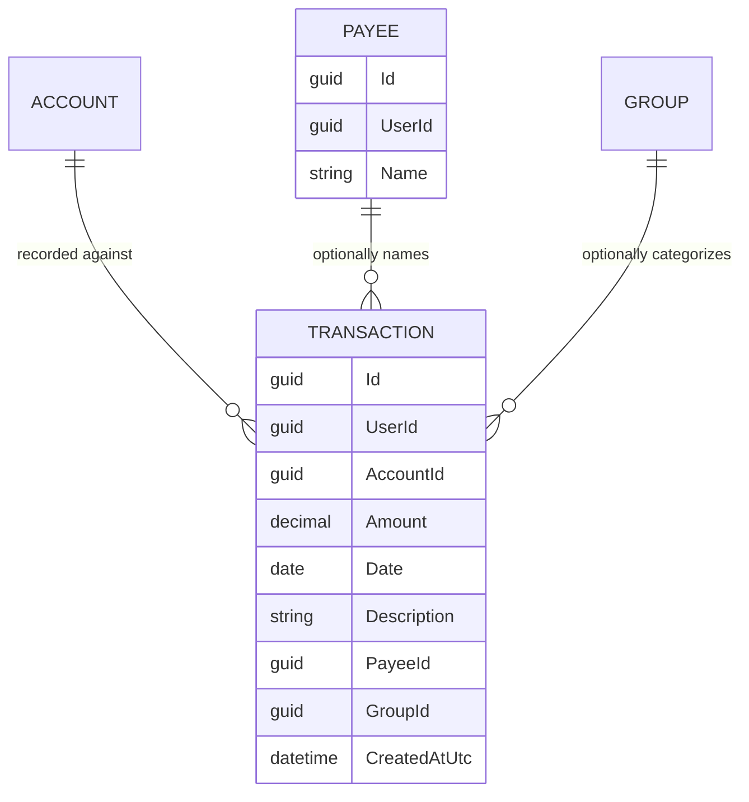

# Transactions

## Table of Contents

- [Purpose](#purpose)
- [Key Entities](#key-entities)
- [Constraints](#constraints)
- [Business Rules & Invariants](#business-rules--invariants)
- [Integration Points](#integration-points)
- [Edge Cases & Known Gotchas](#edge-cases--known-gotchas)

## Purpose

A **Transaction** is a single money movement: a signed amount, on a date, recorded against one
account. It is the central record of the app — everything else (accounts, payees, groups) exists to
give transactions context. A transaction can optionally name a **Payee** (the counterparty) and be
filed under a **Group** (a category).

This file also documents **Payees**, because a payee has no independent lifecycle — payees exist
only as a byproduct of recording transactions, so they belong with the flow that creates them.

## Key Entities

- **Transaction** — `Id`, `UserId` (owner), `AccountId` (required), `Amount` (signed, non-zero),
  `Date` (a calendar date), optional `Description`, optional `PayeeId`, optional `GroupId`,
  `CreatedAtUtc`.
- **Payee** — `Id`, `UserId` (owner), `Name`, `CreatedAtUtc`. The counterparty of a transaction
  (a shop, an employer, a person). Entered as free text with autocomplete; created automatically on
  first use; never edited or deleted directly.

## Constraints

### MUST

- **A transaction's `Amount` must be non-zero.**
  - **Why**: A zero-amount transaction records no money movement — it's meaningless noise in the
    ledger. The sign additionally carries meaning (see the sign rule below), and zero has no sign.
  - **Enforced in**: `Transaction.Create` in `Domain/Transactions/Transaction.cs`.

- **A transaction must be recorded against an account that exists (and belongs to the user).**
  - **Why**: A transaction with no valid account has nowhere to live and no currency to be
    interpreted in.
  - **Enforced in**: `CreateTransactionHandler` loads the account first and throws a validation
    error ("Account was not found.") if missing; ownership is guaranteed by the `UserIsolation`
    filter, so another user's account resolves as missing.

### MUST NOT

- **A transaction MUST NOT reference a group that does not exist (when a group is supplied).**
  - **Why**: A dangling category reference would break the categorized views and imply data the user
    never created.
  - **Enforced in**: `CreateTransactionHandler` loads the group when `GroupId` is provided and throws
    "Group was not found." if absent.

## Business Rules & Invariants

- **Rule**: The **sign of `Amount` encodes direction: negative = expense (money out), positive =
  income (money in).**
- **Why**: Modeling direction as the sign of a single amount (rather than a separate income/expense
  flag) keeps arithmetic trivial — the effect on an account is just the sum of its amounts — and
  makes it impossible to have a "positive expense" contradiction.
- **Enforced in**: not enforced by a code check beyond non-zero — it is a **semantic convention**
  that all readers and writers must honor. `Transaction.Create` enforces only non-zero/precision.
  <!-- TODO: add code location if/when a sign-aware feature (e.g. balances, income vs expense views) is implemented -->
- **Example**: Spending £40 on groceries is `Amount = -40.00`. Receiving a £1,500 paycheck is
  `Amount = 1500.00`.
- **Counterexample**: Recording that same £40 grocery spend as `Amount = 40.00` would later count as
  income — inflating any income total and understating spending. The sign is not cosmetic.
- **Source**: `[SOURCE: discussion — 2026-07-13]`

---

- **Rule**: `Amount` must have at most 2 decimal places and an absolute value ≤ 1,000,000,000.
- **Why**: Money is tracked to cent precision; extra places imply an entry error. The cap is a
  fat-finger sanity bound.
- **Enforced in**: `Transaction.Create`.
- **Example**: `-12.34` is valid; `-12.345` is rejected (3 decimals); `5000000000` is rejected (over
  the cap).
- **Source**: `[SOURCE: code-audit]`

---

- **Rule**: `Description` is optional; a blank value is stored as null; if present it must be ≤ 500
  characters.
- **Why**: Descriptions are free-form memos — not every transaction needs one, but an unbounded memo
  would be a storage/UI hazard.
- **Enforced in**: `Transaction.Create` (blank → null, else length check).
- **Source**: `[SOURCE: code-audit]`

---

- **Rule (Payees)**: A payee is **found-or-created by name**, case-insensitively, and only ever as a
  side effect of creating a transaction that names one. There is no create/edit/delete payee
  endpoint.
- **Why**: Payees are meant to feel like free text with helpful autocomplete, not a list the user has
  to manage. Reusing an existing payee case-insensitively ("Tesco" and "tesco" are the same payee)
  keeps the suggestion list clean and avoids near-duplicate clutter.
- **Enforced in**: `CreateTransactionHandler` (calls `IPayeeRepository.GetOrCreateAsync` when
  `PayeeName` is non-blank), backed by `PayeeRepository.GetOrCreateAsync` which uses a PostgreSQL
  case-insensitive ICU collation + unique index and retries on a unique-violation race.
- **Example**: Typing "Amazon" on one transaction and "amazon" on the next reuses the same payee row,
  so the autocomplete shows a single "Amazon" suggestion.
- **Source**: `[SOURCE: code-audit]`

## Integration Points

- **[Accounts](accounts.md)**: the required target of every transaction; the account's currency
  determines how the amount is displayed. The account cannot be deleted while transactions reference
  it.
- **[Groups](groups.md)**: optional category on a transaction; must exist when supplied. A group
  cannot be deleted while transactions reference it.
- **[Users & Ownership](users-and-ownership.md)**: transactions and payees are stamped with and
  filtered by the owner's `UserId`.

## Edge Cases & Known Gotchas

- **Transactions are append-only today**: there is currently no update or delete endpoint — the
  transaction repository only supports `AddAsync`, and the list read is ordered by date descending,
  then created-at descending. This is the **current state of the code, not a deliberate
  immutability rule**; edit/delete simply isn't built yet. Do not document or defend append-only as
  an intended constraint.
- **Payee is passed by name, group is passed by id**: on create, the payee comes in as a free-text
  `PayeeName` (find-or-create), while the group comes in as a `GroupId` (must already exist). They
  are deliberately asymmetric — don't "normalize" them to the same shape.
- **A missing currency for the account's code fails loudly**: if the account references a currency
  code with no matching seeded row, `CreateTransactionHandler` throws `InvalidOperationException`
  rather than guessing a symbol. That signals a broken schema invariant, not user error — see
  [currencies.md](currencies.md).
- **`Date` is a calendar date, not a timestamp**: it carries no time or timezone. `CreatedAtUtc` is
  the separate audit timestamp. Don't conflate them.
