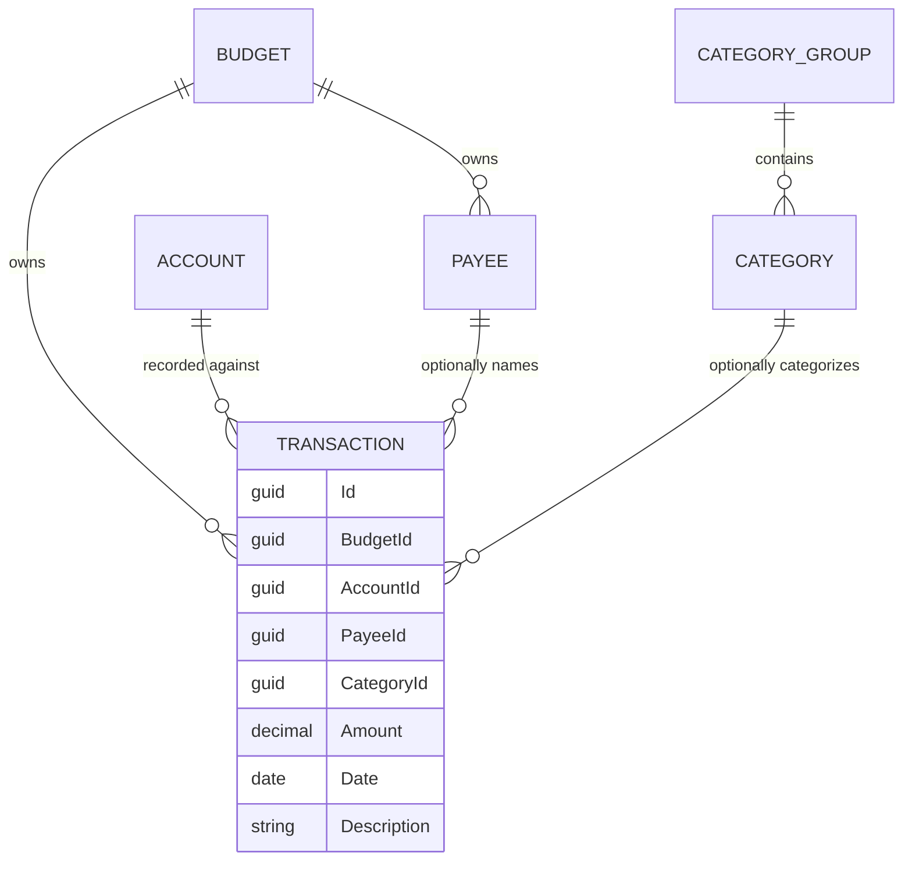

# Transactions

## Table of Contents

- [Purpose](#purpose)
- [Key Entities](#key-entities)
- [Constraints](#constraints)
- [Business Rules & Invariants](#business-rules--invariants)
- [Integration Points](#integration-points)
- [Edge Cases & Known Gotchas](#edge-cases--known-gotchas)

## Purpose

A **Transaction** is a signed money movement on a date, recorded against one Account. It can
optionally name a **Payee** and select a **Category**. Payees are documented here because they are
created as a side effect of transaction entry rather than managed independently.

## Key Entities

- **Transaction** — `Id`, `BudgetId`, required `AccountId`, signed non-zero `Amount`, `Date`, optional
  `Description`, optional `PayeeId`, optional `CategoryId`, `CreatedAtUtc`.
- **Payee** — `Id`, `BudgetId`, `Name`, `CreatedAtUtc`; entered as free text with autocomplete and
  created automatically on first use.

```mermaid
erDiagram
    BUDGET ||--o{ TRANSACTION : owns
    BUDGET ||--o{ PAYEE : owns
    ACCOUNT ||--o{ TRANSACTION : "recorded against"
    PAYEE ||--o{ TRANSACTION : "optionally names"
    CATEGORY ||--o{ TRANSACTION : "optionally categorizes"
    CATEGORY_GROUP ||--o{ CATEGORY : contains
    TRANSACTION {
        guid Id
        guid BudgetId
        guid AccountId
        guid PayeeId
        guid CategoryId
        decimal Amount
        date Date
        string Description
    }
```

## Constraints

### MUST

- **Amount must be non-zero.** Zero records no movement and has no income/expense direction.
- **The Account must exist and belong to the current budget.** `CreateTransactionHandler` resolves it
  through the budget-filtered repository and reports “Account was not found.” otherwise.
- **A supplied Category must exist and belong to the current budget.** The handler resolves
  `CategoryId` through the budget-filtered repository and reports “Category was not found.”
  otherwise.

### MAY

- **A Transaction may be uncategorized.** `CategoryId` is nullable even though every Category's own
  `CategoryGroupId` is required.

## Business Rules & Invariants

- **The sign of Amount encodes direction: negative = expense; positive = income.** This is a semantic
  convention; `Transaction.Create` enforces non-zero, precision, and range.
  - Example: groceries costing £40 are `-40.00`; a £1,500 paycheck is `1500.00`.
  - Source: `[SOURCE: discussion — 2026-07-13]`
- **Amount has at most two decimal places and absolute value ≤ 1,000,000,000.** Enforced by
  `Transaction.Create`.
- **Description is optional, blank becomes null, and a value is at most 500 characters.**
- **Payees are case-insensitive find-or-create free text, within the current budget.**
  `CreateTransactionHandler` calls `IPayeeRepository.GetOrCreateAsync`, which matches an existing
  payee case-insensitively and inserts one only when there is no match, retrying the lookup when a
  concurrent request wins the insert. Name uniqueness is per budget and case-insensitive (see
  [budgets.md](budgets.md#constraints)), so "Tesco" typed as "tesco" reuses the existing payee, while
  the same payee name in another budget is a separate row — payees never cross budgets.
- **Categorization is selected by Category ID only.** Category Group is derived from the selected
  Category and is not copied onto the Transaction.
- **Transaction responses are self-contained for display.** They include `CategoryId`,
  `CategoryName`, `CategoryGroupId`, and `CategoryGroupName`, all projected from current data.

## Integration Points

- **[Accounts](accounts.md)**: required target; its Currency determines display. It cannot be deleted
  while Transactions reference it.
- **[Categories and Category Groups](categories.md)**: optional Category context. A referenced
  Category cannot be deleted; its Category Group cannot be deleted while the Category exists.
- **[Budgets](budgets.md)**: Transactions, Payees, Accounts, Categories, and Category Groups are
  budget-filtered. Note that `transactions → accounts / categories / payees` are plain single-column
  foreign keys, so the same-budget guarantee for those three references comes from the query filter on
  the resolving repositories, not from the schema.

## Edge Cases & Known Gotchas

- Transactions are append-only in the current implementation because update/delete is not built,
  not because immutability is a deliberate business rule.
- Payee input is a name (find-or-create), while Category input is an existing ID. This asymmetry is
  intentional.
- Renaming a Category or Category Group, or moving a Category, immediately changes historical
  Transaction display because hierarchy names are joined at read time rather than snapshotted.
- A missing Currency row for an Account is a broken schema invariant and fails loudly rather than
  guessing a symbol.
- `Date` is a calendar date with no timezone. `CreatedAtUtc` is the separate audit timestamp.
