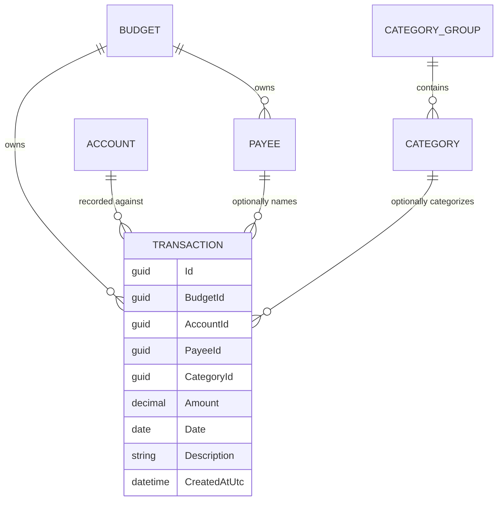

# Transactions

## Table of Contents

- [Purpose](#purpose)
- [Key Entities](#key-entities)
- [Constraints](#constraints)
- [Business Rules & Invariants](#business-rules--invariants)
- [Workflows & State Transitions](#workflows--state-transitions)
- [Decision Trees](#decision-trees)
- [Integration Points](#integration-points)
- [Edge Cases & Known Gotchas](#edge-cases--known-gotchas)

## Purpose

A **Transaction** is a signed amount recorded against one Account on a date. It can optionally name
a **Payee** and select a **Category**. What a transaction does with a payee — supply a name and get
back a row — is documented here; everything about the payee itself is in [payees.md](payees.md).

## Key Entities

- **Transaction** — `Id`, `BudgetId`, required `AccountId`, signed `Amount`, `Date`, optional
  `Description`, optional `PayeeId`, optional `CategoryId`, `CreatedAtUtc`.


```mermaid
erDiagram
    BUDGET ||--o{ TRANSACTION : owns
    BUDGET ||--o{ PAYEE : owns
    ACCOUNT ||--o{ TRANSACTION : "recorded against"
    PAYEE ||--o{ TRANSACTION : "optionally names"
    CATEGORY ||--o{ TRANSACTION : "optionally categorizes"
    CATEGORY_GROUP ||--o{ CATEGORY : contains
    TRANSACTION {
        guid Id
        guid BudgetId
        guid AccountId
        guid PayeeId
        guid CategoryId
        decimal Amount
        date Date
        string Description
        datetime CreatedAtUtc
    }
```

## Constraints

### MUST

- **The Account must exist and belong to the ambient budget.**
  - **Why**: The account is what the movement happened to, and it supplies the currency every amount
    on the transaction is displayed in. A transaction against another budget's account would put one
    pool's money into another's picture.
  - **Enforced in**: `CreateTransactionHandler` and `UpdateTransactionHandler` each resolve it
    through the budget-filtered repository and report "Account was not found." otherwise; the
    composite `(account_id, budget_id)` foreign key is what holds beneath them.

- **A supplied Category must exist and belong to the ambient budget.**
  - **Why**: Categorization is what the money picture is grouped by, so a category from another pool
    would file this budget's spending under a heading that is not its own.
  - **Enforced in**: `CreateTransactionHandler` and `UpdateTransactionHandler` each resolve
    `CategoryId` through the budget-filtered repository and report "Category was not found."
    otherwise; the composite `(category_id, budget_id)` foreign key is what holds beneath them.

### MUST NOT

- **Recorded money movement MUST NOT be discarded as a side effect of deleting something else. It is
  discarded only by explicit intent.**
  - **Why**: a transaction is the only data in the system its owner cannot reconstruct from memory.
    Removing one deliberately is a correction — the movement is what the user is aiming at, and a
    ledger that cannot drop a row typed twice holds a movement that never happened. Losing one as
    collateral of a delete aimed at a budget, an account or a category is data loss nobody chose,
    and the user finds out by reading a total that no longer adds up. The distinction between the
    two acts is the whole rule.
  - **Enforced in**: **database-owned, with the application supplying the sentences.**
    `TransactionConfiguration` maps `transactions.budget_id → budgets.id` on `Restrict` while the
    four structural tables cascade, so a budget holding any transaction cannot be deleted at all —
    stated once, in [budgets.md](budgets.md#business-rules--invariants). The composite
    `(account_id, budget_id)` and `(category_id, budget_id)` references are `Restrict` too, so an
    account or a category cannot be removed out from under the transactions that name it, whatever
    wrote the delete; `DeleteAccountHandler` and `DeleteCategoryHandler` precheck with
    `HasTransactionsAsync` for the message rather than for the guarantee, per
    [ADR 0002](../decisions/0002-enforce-rules-at-the-lowest-capable-layer.md). Two paths remove
    recorded movement: a delete aimed at the transaction itself, a rule of its own below, and
    account erasure, which deletes every transaction in the budget before it deletes the account —
    the `Restrict` edge above is exactly why erasure cannot leave that to the cascade, and
    [erasure.md](erasure.md) owns the order.

- **A Payee referenced by any Transaction MUST NOT be deleted.** The Transaction's existence is what
  makes the rule bite.
  - **Why**: stated once, in [payees.md](payees.md#must-not), which owns the rule.
  - **Enforced in**: the mechanism [payees.md](payees.md#must-not) names — this file does not
    restate it.

## Business Rules & Invariants

- **Rule**: The sign of Amount encodes direction — negative is an expense, positive is income. Zero
  is neither, and is a valid transaction.
- **Why**: The net effect on an account is then simply the sum of its amounts, and a "positive
  expense" contradiction is structurally impossible. Zero is legal because a ledger records what
  happened, not only where money moved: a fully discounted purchase, a refund that exactly cancels
  the purchase it reverses, or a zero-value invoice is a real event whose worth is its date, payee
  and category rather than its magnitude. Refusing it would not remove the event — it would force
  the user to invent an amount or drop the entry, and both store something less true than zero.
- **Enforced in**: nothing enforces the meaning; it is a semantic convention.
  `Transaction.ValidateOrThrow`, which both `Transaction.Create` and `Transaction.Update` run,
  enforces only precision and magnitude, so no validation reads the sign at all.
- **Example**: groceries costing £40 are `-40.00`; a £1,500 paycheck is `1500.00`; an order that a
  voucher covered in full is `0`.
- **Counterexample**: recording an expense as `40.00` because the form already labels the row an
  expense makes the account's total climb with every purchase. Nothing rejects it — no validation
  reads the sign — so the mistake never surfaces as an error, only as a total nobody can explain.
- **Source**: `[SOURCE: discussion]`

---

- **Rule**: Amount has at most as many decimal places as its Account's currency has minor units, and
  an absolute value of at most 1,000,000,000.
- **Why**: Precision belongs to the currency rather than to the column — a yen has no sub-unit, a
  dinar has three — so a place beyond what the currency has implies a rounding or entry error rather
  than a smaller amount. The cap is a sanity bound against fat-finger entries.
- **Enforced in**: split by layer for the same reason as the identical rule on
  [accounts](accounts.md#business-rules--invariants). `CK_transactions_amount`
  (`abs(amount) <= 1000000000`) owns the magnitude bound, so it holds whatever wrote the row.
  `Transaction.ValidateOrThrow` owns the decimal-places half alone, against the minor unit the
  handler resolved from the Account's currency, and restates the magnitude bound for the message.
  `Transaction.Create` and `Transaction.Update` share that one validator, so an edit is held to the
  same precision as an entry. That half has nowhere lower to go twice over: `numeric(14,4)` rounds
  an over-precise amount rather than refusing it, and a coercion is not enforcement under
  [ADR 0002](../decisions/0002-enforce-rules-at-the-lowest-capable-layer.md), while a check
  constraint cannot read the currency's precision without joining another table. The reasoning is in
  [currencies.md](currencies.md#business-rules--invariants).
- **Example**: on a USD account `-40.00` is accepted and `10.005` is rejected as too precise; on a
  JPY account `-4000` is accepted and `-40.5` is rejected as not a whole number; `2000000000` is
  rejected as over the cap in any currency.
- **Source**: `[SOURCE: discussion]`

---

- **Rule**: Description is optional, a blank value is stored as null, and a value is at most 500
  characters.
- **Why**: The description is a free-text memo, so an empty string and "no memo" are the same thing
  and should not be two states a reader has to handle.
- **Enforced in**: `Transaction.ValidateOrThrow`, shared by `Transaction.Create` and
  `Transaction.Update`.
- **Example**: `"   "` is stored as null, not as a blank string.
- **Source**: `[SOURCE: discussion]`

---

- **Rule**: A Transaction may be uncategorized, even though every Category's own `CategoryGroupId`
  is required.
- **Why**: Recording that money moved must never be blocked on deciding what it was for — the entry
  has to stay fast enough to do at the till. An unfiled Category, by contrast, has no such excuse:
  the hierarchy is arranged deliberately, not in a hurry.
- **Enforced in**: `Transaction.CategoryId` is nullable and reachable only through `AssignCategory`
  and `ClearCategory`; `CreateTransactionHandler` resolves a category only when one is supplied, and
  `UpdateTransactionHandler` only when the field is mentioned.
- **Example**: a `-12.50` corner-shop transaction with no category is valid and appears in lists
  with an empty category column.
- **Source**: `[SOURCE: discussion]`

---

- **Rule**: A Transaction may name a Payee or none, and the Payee is supplied as a free-text
  **name** while the Category is supplied as an existing **id**.
- **Why**: The asymmetry follows from when each is chosen. The counterparty is typed mid-entry, and
  making the user create one first would slow down the entry the model most needs to keep fast; the
  category is picked from a list they arranged deliberately, where a name would be a second way to
  say something they can already point at. Both are optional for the same reason a Transaction may
  be uncategorized: recording that money moved must never be blocked on describing it.
- **Enforced in**: `CreateTransactionCommand` carries a nullable `PayeeName` and a nullable
  `CategoryId`; `Transaction.PayeeId` is nullable and set only through `AssignPayee`.
  `CreateTransactionHandler` turns the name into a row by calling
  `IPayeeRepository.GetOrCreateAsync` in the ambient budget. What that call does with the name —
  trimming, case-insensitive matching, what a blank name means, and what happens when two requests
  race — is documented in [payees.md](payees.md#business-rules--invariants).
- **Example**: a transaction submitted with `payeeName: "tesco"` comes back carrying the `payeeId`
  and the stored spelling `Tesco` of the payee that already existed.
- **Source**: `[SOURCE: discussion]`

---

- **Rule**: Categorization is selected by Category ID only. Category Group is derived from the
  selected Category and is not copied onto the Transaction.
- **Why**: Storing the group too would let the two disagree the moment a Category is moved to
  another group, and there is no question the stored group could answer that the Category cannot.
- **Enforced in**: `CreateTransactionCommand` carries `CategoryId`; `Transaction` has no
  `CategoryGroupId`.
- **Example**: moving "Groceries" from "Essential Obligations" to "Household" changes what every
  past grocery transaction displays as its group, with no transaction rows written.
- **Counterexample**: copying `CategoryGroupId` onto the Transaction makes the two disagree the
  moment the Category moves — the transaction keeps naming the old heading while the category list
  shows the new one, and no read can tell which of the two was meant.
- **Source**: `[SOURCE: discussion]`

---

- **Rule**: Transaction responses are self-contained for display — they carry `CategoryId`,
  `CategoryName`, `CategoryGroupId` and `CategoryGroupName`, plus the account's name, currency code
  and symbol.
- **Why**: A transaction list has to render an amount and its context without the client stitching
  together three other endpoints, and the projection is from current data so a rename shows up
  immediately.
- **Enforced in**: `TransactionDto.FromTransaction`, fed by the handler's resolved account,
  currency, payee, category and category group.
- **Example**: renaming an account is visible in the transaction list on the next read, because the
  name is joined rather than snapshotted.
- **Source**: `[SOURCE: discussion]`

---

- **Rule**: A Transaction is corrected **in place**, by a partial edit that keeps its identity.
  Every mutable field carries three states: **absent** leaves the stored value alone, **present with
  a value** replaces it, and **present and null** clears it. The mutable fields are `amount`,
  `date`, `description`, `accountId`, `payeeName` and `categoryId`; the budget, the `id` and
  `CreatedAtUtc` are not accepted at all. Success is 204 No Content, and an id belonging to another
  budget answers 404 exactly as an id that never existed does.
- **Why**: a partial edit has to answer a question a whole-row replace never asks — what does an
  unmentioned field mean? — and a wire format with only two states cannot answer it. Collapse the
  three states one way, and an absent property reads as null: an edit that fixes a fat-fingered
  amount silently erases the memo, the payee and the category the caller never mentioned, and
  nothing rejects it, because all three are legitimately empty. Collapse them the other way, and an
  absent property reads as "leave it": clearing an optional field becomes impossible. Both are
  defects, which is what the wrapper type buys. Correction in place rather than by re-entry is the
  same argument at the row level: retyping an entry to change one digit costs the user every other
  field, and hands back a different `Id` and `CreatedAtUtc` for what the person experienced as
  fixing a typo.
- **Enforced in**: **application- and transport-owned by necessity.** The database has no opinion
  about which properties a request mentioned — by the time a row is written the distinction has been
  resolved into a value — so there is no lower layer for this to sit in. `Optional<T>` carries the
  three states: `IsSet` separates absent from supplied, and `OrElse` merges a supplied value over
  the stored one. `default(Optional<T>)` is the absent state because a deserializer cannot signal a
  missing property — it leaves the parameter at its default — so absence has to fall out of the
  default rather than be constructed. `OptionalJsonConverterFactory`, registered on the HTTP JSON
  options, is what makes an explicit null deserialize into a **set** `Optional` rather than an
  absent one, through `HandleNull => true`. `TransactionEndpoints` maps
  `PATCH /api/transactions/{id:guid}` over an `UpdateTransactionRequest` of one `Optional` per
  mutable field; `UpdateTransactionHandler` resolves the id through the filtered `GetByIdAsync` and
  throws `NotFoundException` on a miss. `Transaction.Update` re-validates the merged result through
  the same `ValidateOrThrow` that `Transaction.Create` uses, so the two write paths cannot drift
  apart.
- **Example**: `{"amount": -42.00}` changes the amount and leaves the date, description, account,
  payee and category untouched. `{"categoryId": null}` uncategorizes the transaction and touches
  nothing else. `{}` is a valid request that changes nothing.
- **Counterexample**: reading a missing property as null. A client fixing an amount also wipes the
  memo, the counterparty and the category — every field it did not echo back — and no error is
  raised, because each of them may legitimately be empty. The loss surfaces days later as a
  transaction stripped of its context, with nothing to point at as the cause.
- **Source**: `[SOURCE: discussion]`

---

- **Rule**: Clearing a field and not mentioning it are different requests, and only three of the six
  mutable fields can be cleared. `description`, `payeeName` and `categoryId` accept an explicit null
  and empty out. `amount`, `date` and `accountId` have no empty state: an explicit null for one of
  them is a malformed request answered with 400, not an instruction to empty the field.
- **Why**: a transaction without an amount, a date or an account is not a transaction — it records
  that nothing happened, nowhere, at no time. The account carries a second load besides identity: it
  is what denominates the amount, so a transaction with no account has no currency and therefore no
  rule left to validate its amount's precision against. Description, payee and category are context,
  and context can honestly be absent.
- **Enforced in**: **transport-owned, and it falls out of the type rather than from a check.**
  `UpdateTransactionCommand` and `UpdateTransactionRequest` declare `Optional<decimal>`,
  `Optional<DateOnly>` and `Optional<Guid>` for the three unclearable fields, against
  `Optional<string?>` and `Optional<Guid?>` for the clearable ones. The converter's `Read`
  deserializes the null token instead of short-circuiting on it, so `Deserialize<decimal>` against a
  null throws `JsonException` and minimal-API body binding reports the 400. No branch in
  `UpdateTransactionHandler` mentions the case, and under
  [ADR 0002](../decisions/0002-enforce-rules-at-the-lowest-capable-layer.md) none should: the type
  system is the lowest layer that can state this declaratively.
- **Example**: `{"description": null}` stores a null description; `{"payeeName": null}` and
  `{"categoryId": null}` detach the payee and the category. `{"amount": null}` is a 400 naming the
  field, and so are `{"date": null}` and `{"accountId": null}`.
- **Counterexample**: declaring all six over nullable types and treating a null amount as a clear.
  There is no empty `decimal` to clear to, so the merge falls back on `0` — a perfectly legal amount
  under the sign rule above — and a request that meant nothing coherent silently zeroes the entry
  instead of being refused. The date is worse: it falls back on `default(DateOnly)`, which no
  validation reads and the `date` column accepts, so the entry quietly moves to the year one and
  sorts to the top of every list. Only the account fails loudly, and it fails badly — `Guid.Empty`
  reaches `Transaction.Update`, which answers "Account id is required." about a field the caller
  explicitly sent.
- **Source**: `[SOURCE: discussion]`

---

- **Rule**: An edit MUST NOT move a Transaction to another budget, and MUST NOT repoint it at
  another budget's Account or Category. A cross-budget `accountId` or `categoryId` answers 400 with
  "Account was not found." or "Category was not found." — indistinguishable from an id that matches
  no row anywhere — and a cross-budget transaction id answers 404.
- **Why**: the standing tenancy rule rather than a rule about editing: a transaction that changed
  pools would take its amount into a total that never contained it. The reasoning and the
  404-rather-than-403 answer are stated once, in [budgets.md](budgets.md#must-not).
- **Enforced in**: **layered, and the lowest layer is the schema.** `UpdateTransactionRequest`
  carries no budget field and `Transaction.Update` takes none, so there is nothing to rewrite.
  `UpdateTransactionHandler` resolves the account the transaction will end up on — the one named, or
  the one it already has — through the `BudgetIsolation`-filtered `IAccountRepository`, and that
  filtered read **is** the cross-budget check: a stranger's account reads as null and lands on the
  ordinary "Account was not found." validation error, with no separate tenancy branch to forget. A
  supplied `categoryId` resolves the same way. `TransactionRepository.GetByIdAsync` queries the
  filtered `DbSet` rather than `Find`, because `Find` can answer from the change tracker without
  reaching the filter. Underneath sits the backstop: the composite foreign keys hold whatever code
  path wrote the row, and `TransactionRepository.UpdateAsync` catches each `23503` **by constraint
  name** — which is the concurrent-delete race, not the primary guard.
- **Example**: an edit naming an account id that exists in another user's budget answers 400
  "Account was not found.", byte for byte the answer a randomly generated GUID gets.
- **Counterexample**: resolving the account through an unfiltered lookup and comparing its
  `BudgetId` against the ambient budget afterwards. It gives the same answer while it is written
  correctly, and it puts the tenancy decision in a branch that a later refactor can drop without any
  test that reads only same-budget data noticing.
- **Source**: `[SOURCE: discussion]`

---

- **Rule**: On an edit the Payee is supplied **by name** with the same find-or-create as on
  creation, so an edit can bring a new Payee into existence. A blank or whitespace-only name means
  **no payee** — the same as an explicit null — rather than a payee named with whitespace.
- **Why**: it is the same field, filled in the same way, and an edit is where a mistyped
  counterparty is corrected. Resolving "Tesco" differently according to which verb carried it would
  leave a corrected transaction pointing at a different row from an identical one typed right the
  first time — exactly the duplication a shared payee row exists to prevent. The blank case keeps
  meaning what it means on creation for the same reason it means it there.
- **Enforced in**: **application-owned**, and nothing lower can hold it — "no payee" and "a rejected
  blank name" are indistinguishable to a column. `UpdateTransactionHandler` treats a set `PayeeName`
  that is null or whitespace as `Transaction.ClearPayee`, and any other value as
  `IPayeeRepository.GetOrCreateAsync` followed by `Transaction.AssignPayee`; an absent `PayeeName`
  leaves `PayeeId` alone. Because that call can insert a row, it runs inside the handler's
  `ITransactionalExecutor` boundary. Trimming, case-insensitive matching and what happens when two
  requests race are in [payees.md](payees.md#business-rules--invariants).
- **Example**: editing a transaction with `payeeName: "  tesco "` attaches the existing `Tesco` row
  and writes no new payee; `payeeName: "Tescoo"` on a budget that has never seen that spelling mints
  a second payee, permanently. `payeeName: null` and `payeeName: "   "` both leave the transaction
  with no payee and write nothing to `payees`. Omitting `payeeName` leaves the existing payee
  attached.
- **Counterexample**: passing a blank name through to `GetOrCreateAsync`. `Payee.Create` throws on
  the empty name, so clearing the counterparty comes back a 400 naming a field the person
  deliberately emptied.
- **Source**: `[SOURCE: discussion]`

---

- **Rule**: A Transaction can be deleted by id by the owner of the budget that holds it. The row is
  removed outright — there is no voided, archived or flagged state — and the response is 204 No
  Content. An id that belongs to another budget answers 404, exactly as an id that never existed
  does.
- **Why**: every entry is typed by hand, so the ledger carries hand-made mistakes: a purchase
  recorded twice because the first attempt looked like it failed, an amount entered against the
  wrong account, a figure fat-fingered by a decimal place. Removing such a row is the correction,
  not the loss — what money movement is protected from is being discarded as collateral, and this is
  the one act where the movement is what the user is aiming at. The removal is **hard, not
  flagged,** because a flag would buy nothing this product has asked for: nothing restores a deleted
  row, there is no trash, no second person whose view has to be reconciled, no retention
  requirement, and no soft-delete anywhere else in the schema. What it would cost is a predicate on
  every transaction query, a second filter interacting with `BudgetIsolation`, and a row still
  sitting in storage after the user asked for it to be gone.
- **Enforced in**: **application-owned, and necessarily so** — no constraint can express that a row
  *may* go. `TransactionEndpoints` maps `DELETE /api/transactions/{id:guid}` and returns
  `TypedResults.NoContent()`. `DeleteTransactionHandler` resolves the id through the
  `BudgetIsolation`-filtered `GetByIdAsync` — not `Find`, which can answer from the change tracker
  without reaching the filter — and throws `NotFoundException` on a miss.
  `TransactionRepository.DeleteAsync` removes the row and saves, with no exception translation and
  no precheck behind it: nothing in the schema references `transactions`, so a delete has no foreign
  key to violate — unlike `AccountRepository.DeleteAsync` and `CategoryRepository.DeleteAsync`.
- **Example**: a `-40.00` grocery entry recorded twice is deleted once; the response carries no
  body, the surviving entry is untouched, and repeating the same delete answers 404.
- **Counterexample**: flagging the row deleted and filtering it out on read. Every query over
  transactions then carries a second predicate beside the budget filter, and the first one that
  forgets it puts the row back into the list the user thought they had corrected — silently, because
  it still exists and still satisfies every constraint. The delete guards on accounts and categories
  would have to be taught about the flag too, or an account would stay undeletable on the strength
  of transactions the user has already removed.
- **Source**: `[SOURCE: discussion]`

## Workflows & State Transitions

A Transaction has no lifecycle states and therefore no state machine. It is created, edited any
number of times, and eventually deleted whole. There is no status field and nothing that reads one:
a Transaction is never draft, pending, cleared, posted, reconciled, voided or archived, and the
delete leaves no state behind to move to. What is mutable is its **fields** — amount, date,
description, account, payee and category all change in place, keeping the row's `Id` and
`CreatedAtUtc` — and a field changing is not a transition, because no rule anywhere reads what the
previous value was or restricts which value may follow it. The branching that exists is in creation,
in editing, and in resolving the id to delete, all three below.

## Decision Trees

Creating a transaction (`CreateTransactionHandler`):

```
IF the account id does not resolve in the ambient budget
  THEN validation error "Account was not found."          ← also the cross-budget answer
ELSE IF the account's currency code has no seeded Currency row
  THEN InvalidOperationException                          ← unreachable; the currency FK forbids it
ELSE
  Transaction.Create validates the amount's precision against that currency's minor unit,
    its magnitude, and the description length
  IF a CategoryId was supplied
    IF it does not resolve in the ambient budget
      THEN validation error "Category was not found."
    ELSE resolve its Category Group and assign the category
  ── the database transaction opens here ──               ← reads and validation above, writes below
  IF a PayeeName was supplied and is not blank
    THEN find-or-create the payee in the ambient budget and assign it
  THEN persist and return the self-contained response
```

The category and payee steps are independent — either, both, or neither may run.

Editing a transaction (`UpdateTransactionHandler`):

```
IF the transaction id does not resolve in the ambient budget
  THEN 404 "Transaction was not found."                   ← also the cross-budget answer
ELSE
  the target account is the one AccountId names, or the current one if it was not mentioned
  IF that account does not resolve in the ambient budget
    THEN validation error "Account was not found."        ← also the cross-budget answer
  ELSE IF the account's currency code has no seeded Currency row
    THEN InvalidOperationException                        ← unreachable; the currency FK forbids it
  IF CategoryId was mentioned with a value
    IF it does not resolve in the ambient budget
      THEN validation error "Category was not found."
  Transaction.Update lays the mentioned fields over the stored ones and re-validates the amount's
    precision against the target account's currency, its magnitude, and the description length
  IF CategoryId was mentioned
    THEN assign the resolved category, or clear it if the value was null
  ── the database transaction opens here ──               ← reads and validation above, writes below
  IF PayeeName was mentioned
    IF it is null, blank or whitespace-only
      THEN clear the payee
    ELSE find-or-create the payee in the ambient budget and assign it
  THEN save and return 204 No Content
```

Every field step is independent — any subset may run, and a request that mentions no field at all is
valid and changes nothing. An explicit null for `amount`, `date` or `accountId` never reaches this
tree: body binding refuses it as a 400 before the handler is entered.

Deleting a transaction (`DeleteTransactionHandler`):

```
IF the transaction id does not resolve in the ambient budget
  THEN 404 "Transaction was not found."                   ← also the cross-budget answer
ELSE
  THEN remove the row                                     ← nothing references a transaction,
                                                            so there is no guard to run first
```

## Integration Points

- **[Accounts](accounts.md)**: required target; its Currency determines both the precision an amount
  may carry and how it is displayed. It cannot be deleted while Transactions reference it, and
  clearing that refusal means emptying it of Transactions — by deleting the last one that named it
  or by editing it onto another Account — which is what makes "Account cannot be deleted because it
  has transactions." an instruction the user can follow rather than a dead end.
- **[Categories and Category Groups](categories.md)**: optional Category context. A referenced
  Category cannot be deleted; its Category Group cannot be deleted while the Category exists.
  Deleting the last Transaction filed under a Category, or editing it onto another Category or none,
  clears the first refusal the same way, and emptying the Category out of its group clears the
  second.
- **[Payees](payees.md)**: optional counterparty, and the only thing a Transaction can bring into
  existence. Recording a transaction and editing one are the two writers of the `payees` table, both
  through the same find-or-create, and a Transaction that references a payee is what makes that
  payee undeletable. The relationship is one-way: neither deleting the Transaction nor editing it to
  name a different counterparty removes the payee it created, and nothing else will either.
- **[Budgets](budgets.md)**: Transactions, Payees, Accounts, Categories and Category Groups are
  budget-filtered, and the `transactions → accounts | categories | payees` references are composite
  foreign keys so PostgreSQL, not only the query filter, refuses a cross-budget reference. Both
  rules and their reasoning live in [budgets.md](budgets.md#constraints). A Transaction's existence
  is also what makes its Budget undeletable, unlike the Budget's other owned entities — the
  budget-level half of the never-as-a-side-effect rule stated under [Constraints](#must-not) above.
- **Angular client**: `/app/transactions` records and edits entries (`TransactionsComponent`). It
  owns one rule outright rather than restating one: the amount input must require a value rather
  than default to `0`, and an edit form must omit a field it did not collect rather than send a
  default — there is no layer beneath it that can tell a deliberate zero from an untouched input.
  See [Edge Cases & Known Gotchas](#edge-cases--known-gotchas) below.

## Edge Cases & Known Gotchas

- **Moving a Transaction to an Account in another currency re-validates the amount, and can refuse
  the move over a field the request never mentioned.** `UpdateTransactionHandler` resolves the
  currency from the account the transaction will *end up* on — which is why the account lookup has
  to precede everything else — and `Transaction.Update` runs the same precision check as creation
  against that currency's minor unit. So a `-40.50` entry moved from a USD account to a JPY one is
  rejected with "Amount must be a whole number.", naming `Amount` even though the caller supplied
  only `accountId`. That is correct rather than awkward: the amount is denominated in the account's
  currency, and half a yen is not a denomination. The remedy is to send an amount valid in the
  target currency in the same request, which the three-state contract allows — but the error message
  does not say so, and a client that surfaces it against the amount input will point the user at a
  field they never touched.
- **A Payee can be stranded by two different acts, and both are permanent.** Deleting a Transaction
  strands the payee it named; so does editing a Transaction to name a different counterparty, or
  none. The payee row stays behind either way and nothing removes it, so a counterparty reached by
  either route sits in the autocomplete list forever. These are the two routes to the state
  [payees.md](payees.md#edge-cases--known-gotchas) describes.
- **The account and category delete guards are racy in both directions, and their foreign-key
  catches are what actually holds.** `DeleteAccountHandler` and `DeleteCategoryHandler` ask
  `HasTransactionsAsync` before removing the row, and either answer can be stale by the time the
  delete runs: "no transactions" can be invalidated by a concurrent insert or by an edit that moves
  a transaction onto that row, and "has transactions" by a concurrent delete or by an edit that
  moves the last one off it. The first direction lands on the constraint, which is why the two
  repositories catch `23503` **by constraint name**; the second fails safe. Under
  [ADR 0002](../decisions/0002-enforce-rules-at-the-lowest-capable-layer.md) that split is the
  intended one — the precheck exists for the *message*, the foreign key is what is *correct*. Do not
  simplify either away, and do not close the race with a lock.
- **An untouched amount field is a zero, and only the client can tell the two apart.** An empty
  numeric input binds to `0`, so a form submitted with nothing typed records a perfectly valid zero
  transaction — and on an edit form it sends a `0` that overwrites the stored amount, since a value
  the client did send is exactly what the three-state contract is obliged to honour. The domain
  cannot refuse it without refusing the deliberate zeros the sign rule allows, so the guard is the
  form's: **the amount input MUST require a value rather than default to one, and an edit form MUST
  omit the field it did not collect rather than send a default.** That is the right layer — the rule
  is about the interaction, not about what a ledger may hold — but it is also the only layer holding
  it.
- **A write that names a new payee writes two rows, and both go in one database transaction.** Both
  handlers run the payee find-or-create and the transaction save inside `ITransactionalExecutor`, so
  a failure between them commits neither. The boundary is load-bearing rather than tidy: payees have
  no delete path, so a payee committed without the write that named it would be permanent litter,
  and a client disconnect is enough to reach that point — the handlers' `CancellationToken` is the
  request's `RequestAborted`. In both it starts *after* the account, currency and category lookups,
  which commit nothing and would only hold the connection and its locks longer. Do not narrow
  either, and do not widen either to the whole handler; the reasoning is in
  [ADR 0003](../decisions/0003-wrap-multi-repository-writes-in-one-transaction.md).
- Renaming a Category or Category Group, or moving a Category, immediately changes historical
  Transaction display; see [categories.md](categories.md#edge-cases--known-gotchas).
- A missing Currency row for an Account fails loudly rather than guessing a symbol, but the
  `accounts.currency_code` foreign key means it cannot happen — see
  [currencies.md](currencies.md#edge-cases--known-gotchas).
- `Date` is a calendar date with no timezone. `CreatedAtUtc` is the separate audit timestamp.
