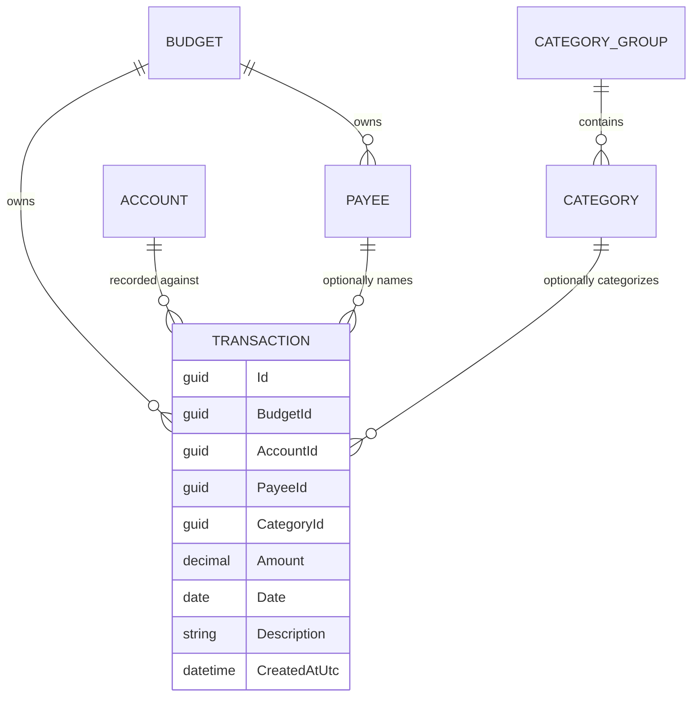

# Transactions

## Table of Contents

- [Purpose](#purpose)
- [Key Entities](#key-entities)
- [Constraints](#constraints)
- [Business Rules & Invariants](#business-rules--invariants)
- [Workflows & State Transitions](#workflows--state-transitions)
- [Decision Trees](#decision-trees)
- [Integration Points](#integration-points)
- [Edge Cases & Known Gotchas](#edge-cases--known-gotchas)

## Purpose

A **Transaction** is a signed money movement on a date, recorded against one Account. It can
optionally name a **Payee** and select a **Category**. Payees are documented here because they are
created as a side effect of transaction entry rather than managed independently.

## Key Entities

- **Transaction** — `Id`, `BudgetId`, required `AccountId`, signed non-zero `Amount`, `Date`, optional
  `Description`, optional `PayeeId`, optional `CategoryId`, `CreatedAtUtc`.
- **Payee** — `Id`, `BudgetId`, `Name`, `CreatedAtUtc`; entered as free text with autocomplete and
  created automatically on first use.


```mermaid
erDiagram
    BUDGET ||--o{ TRANSACTION : owns
    BUDGET ||--o{ PAYEE : owns
    ACCOUNT ||--o{ TRANSACTION : "recorded against"
    PAYEE ||--o{ TRANSACTION : "optionally names"
    CATEGORY ||--o{ TRANSACTION : "optionally categorizes"
    CATEGORY_GROUP ||--o{ CATEGORY : contains
    TRANSACTION {
        guid Id
        guid BudgetId
        guid AccountId
        guid PayeeId
        guid CategoryId
        decimal Amount
        date Date
        string Description
        datetime CreatedAtUtc
    }
```

## Constraints

### MUST

- **Amount must be non-zero.**
  - **Why**: Zero records no movement and has no income/expense direction, so it is not a
    transaction — it is an empty row that would still appear in every list and total.
  - **Enforced in**: `Transaction.Create`.

- **The Account must exist and belong to the current budget.**
  - **Why**: The account is what the movement happened to, and it supplies the currency every amount
    on the transaction is displayed in. A transaction against another budget's account would put one
    pool's money into another's picture.
  - **Enforced in**: `CreateTransactionHandler` resolves it through the budget-filtered repository
    and reports "Account was not found." otherwise.

- **A supplied Category must exist and belong to the current budget.**
  - **Why**: Categorization is what the money picture is grouped by, so a category from another pool
    would file this budget's spending under a heading that is not its own.
  - **Enforced in**: `CreateTransactionHandler` resolves `CategoryId` through the budget-filtered
    repository and reports "Category was not found." otherwise.

### MUST NOT

- **A Payee referenced by any Transaction MUST NOT be deleted.**
  - **Why**: Refusing forces an explicit decision about historical rows instead of silently erasing
    the counterparty from past transactions — the same protection [Accounts](accounts.md) and
    [Categories](categories.md) have.
  - **Enforced in**: the composite `transactions → payees` foreign key is `Restrict`. The mechanism
    differs from accounts and categories, which are prechecked by their delete handlers and report a
    validation error: no code path deletes a payee at all (`IPayeeRepository` exposes only
    `GetOrCreateAsync`), so this rule lives purely in the database, pinned by
    `PayeeIntegrationTests.DeletingAReferencedPayee_IsRefusedByTheDatabase`.

## Business Rules & Invariants

- **Rule**: The sign of Amount encodes direction — negative is an expense, positive is income.
- **Why**: The net effect on an account is then simply the sum of its amounts, and a "positive
  expense" contradiction is structurally impossible.
- **Enforced in**: nothing enforces the meaning; it is a semantic convention. `Transaction.Create`
  enforces only that the amount is non-zero and within precision and range.
- **Example**: groceries costing £40 are `-40.00`; a £1,500 paycheck is `1500.00`.
- **Counterexample**: recording an expense as `40.00` because the form already labels the row an
  expense makes the account's total climb with every purchase. Nothing rejects it — no validation
  reads the sign — so the mistake never surfaces as an error, only as a total nobody can explain.
- **Source**: `[SOURCE: discussion — 2026-07-13]`

---

- **Rule**: Amount has at most two decimal places and an absolute value of at most 1,000,000,000.
- **Why**: Money is recorded to cent precision, so a third decimal implies a rounding or entry error
  rather than a smaller amount. The cap is a sanity bound against fat-finger entries.
- **Enforced in**: `Transaction.Create`; the column is `numeric(14,2)`.
- **Example**: `-40.00` is accepted; `10.005` is rejected as too precise; `2000000000` is rejected as
  over the cap.
- **Source**: `[SOURCE: discussion — 2026-07-26]`

---

- **Rule**: Description is optional, a blank value is stored as null, and a value is at most 500
  characters.
- **Why**: The description is a free-text memo, so an empty string and "no memo" are the same thing
  and should not be two states a reader has to handle.
- **Enforced in**: `Transaction.Create`.
- **Example**: `"   "` is stored as null, not as a blank string.
- **Source**: `[SOURCE: discussion — 2026-07-26]`

---

- **Rule**: A Transaction may be uncategorized, even though every Category's own `CategoryGroupId` is
  required.
- **Why**: Recording that money moved must never be blocked on deciding what it was for — the entry
  has to stay fast enough to do at the till. An unfiled Category, by contrast, has no such excuse:
  the hierarchy is arranged deliberately, not in a hurry.
- **Enforced in**: `Transaction.CategoryId` is nullable; `CreateTransactionHandler` resolves a
  category only when one is supplied.
- **Example**: a `-12.50` corner-shop transaction with no category is valid and appears in lists with
  an empty category column.
- **Source**: `[SOURCE: discussion — 2026-07-14]`

---

- **Rule**: Payees are case-insensitive find-or-create free text within the current budget.
- **Why**: A shared payee entity is what powers autocomplete and consistent naming across
  transactions, but making the user create one first would slow down the entry this rule exists to
  keep fast. Case-insensitive matching is what stops "Tesco" and "tesco" becoming two counterparties.
- **Enforced in**: `CreateTransactionHandler` calls `IPayeeRepository.GetOrCreateAsync`, which
  matches an existing payee case-insensitively and inserts one only when there is no match, retrying
  the lookup when a concurrent request wins the insert. Per-budget, case-insensitive name uniqueness
  and the mechanism behind it are documented in [budgets.md](budgets.md#constraints).
- **Example**: "Tesco" typed as "tesco" reuses the existing payee; the same name in another budget is
  a separate row, because payees never cross budgets.
- **Source**: `[SOURCE: discussion — 2026-07-13]`

---

- **Rule**: Categorization is selected by Category ID only. Category Group is derived from the
  selected Category and is not copied onto the Transaction.
- **Why**: Storing the group too would let the two disagree the moment a Category is moved to another
  group, and there is no question the stored group could answer that the Category cannot.
- **Enforced in**: `CreateTransactionCommand` carries `CategoryId`; `Transaction` has no
  `CategoryGroupId`.
- **Example**: moving "Groceries" from "Essential Obligations" to "Household" changes what every past
  grocery transaction displays as its group, with no transaction rows written.
- **Counterexample**: copying `CategoryGroupId` onto the Transaction makes the two disagree the
  moment the Category moves — the transaction keeps naming the old heading while the category list
  shows the new one, and no read can tell which of the two was meant.
- **Source**: `[SOURCE: discussion — 2026-07-14]`

---

- **Rule**: Transaction responses are self-contained for display — they carry `CategoryId`,
  `CategoryName`, `CategoryGroupId` and `CategoryGroupName`, plus the account's name, currency code
  and symbol.
- **Why**: A transaction list has to render an amount and its context without the client stitching
  together three other endpoints, and the projection is from current data so a rename shows up
  immediately.
- **Enforced in**: `TransactionDto.FromTransaction`, fed by the handler's resolved account, currency,
  payee, category and category group.
- **Example**: renaming an account is visible in the transaction list on the next read, because the
  name is joined rather than snapshotted.
- **Source**: `[SOURCE: discussion — 2026-07-26]`

## Workflows & State Transitions

A Transaction has no lifecycle states and therefore no state machine: it is created and then read.
Nothing transitions it, because no update or delete path exists (see Edge Cases). The branching that
does exist is in creation, below.

## Decision Trees

Creating a transaction (`CreateTransactionHandler`):

```
IF the account id does not resolve in the ambient budget
  THEN validation error "Account was not found."          ← also the cross-budget answer
ELSE IF the account's currency code has no seeded Currency row
  THEN InvalidOperationException                          ← unreachable; the currency FK forbids it
ELSE
  Transaction.Create validates amount, precision, range and description length
  IF a CategoryId was supplied
    IF it does not resolve in the ambient budget
      THEN validation error "Category was not found."
    ELSE resolve its Category Group and assign the category
  IF a PayeeName was supplied and is not blank
    THEN find-or-create the payee in the ambient budget and assign it
  THEN persist and return the self-contained response
```

The category and payee steps are independent — either, both, or neither may run.

## Integration Points

- **[Accounts](accounts.md)**: required target; its Currency determines display. It cannot be deleted
  while Transactions reference it.
- **[Categories and Category Groups](categories.md)**: optional Category context. A referenced
  Category cannot be deleted; its Category Group cannot be deleted while the Category exists.
- **[Budgets](budgets.md)**: Transactions, Payees, Accounts, Categories and Category Groups are
  budget-filtered, and the `transactions → accounts | categories | payees` references are composite
  foreign keys so PostgreSQL, not only the query filter, refuses a cross-budget reference. Both rules
  and their reasoning live in [budgets.md](budgets.md#constraints). A Transaction's existence is also
  what makes its Budget undeletable, unlike the Budget's other owned entities.

## Edge Cases & Known Gotchas

- Transactions are append-only in the current implementation because update and delete are not built,
  not because immutability is a deliberate business rule. Do not cite the append-only behaviour as a
  constraint.
- Payee input is a name (find-or-create), while Category input is an existing ID. This asymmetry is
  intentional: a payee is typed in mid-entry, a category is picked from a list the user arranged.
- `GET /api/payees` lists the ambient budget's payees for autocomplete. It is the only payee endpoint
  — there is no create, rename or delete.
- Renaming a Category or Category Group, or moving a Category, immediately changes historical
  Transaction display; see [categories.md](categories.md#edge-cases--known-gotchas).
- A missing Currency row for an Account fails loudly rather than guessing a symbol, but the
  `accounts.currency_code` foreign key means it cannot happen — see
  [currencies.md](currencies.md#edge-cases--known-gotchas).
- `Date` is a calendar date with no timezone. `CreatedAtUtc` is the separate audit timestamp.
