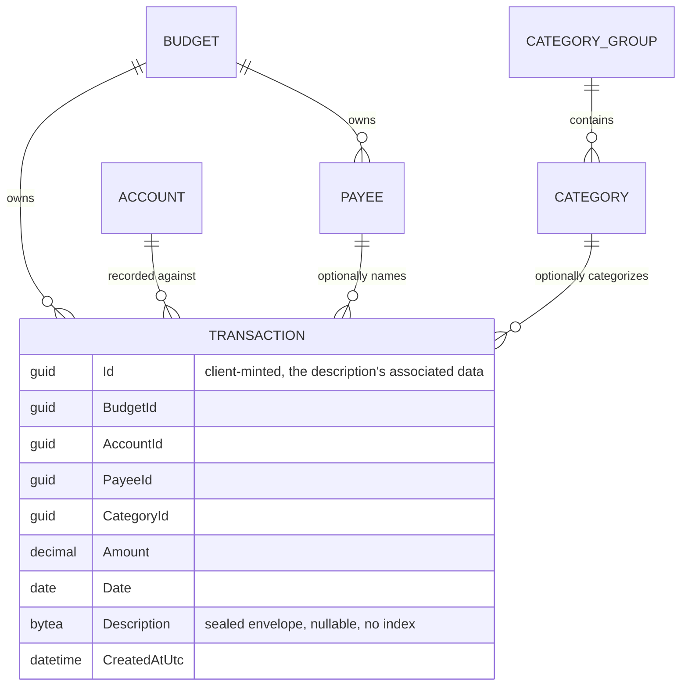

# Transactions

## Table of Contents

- [Purpose](#purpose)
- [Key Entities](#key-entities)
- [Constraints](#constraints)
- [Business Rules & Invariants](#business-rules--invariants)
- [Workflows & State Transitions](#workflows--state-transitions)
- [Decision Trees](#decision-trees)
- [Integration Points](#integration-points)
- [Edge Cases & Known Gotchas](#edge-cases--known-gotchas)

## Purpose

A **Transaction** is a signed amount recorded against one Account on a date. It can optionally name
a **Payee** and select a **Category**. What a transaction does with a payee — name one that already
exists, by its id — is documented here; everything about the payee itself, including the separate
request that brings one into existence, is in [payees.md](payees.md).

## Key Entities

- **Transaction** — `Id`, `BudgetId`, required `AccountId`, signed `Amount`, `Date`, optional
  `Description`, optional `PayeeId`, optional `CategoryId`, `CreatedAtUtc`.
  - **`Description` is a sealed narrative envelope and not text.** The property is typed
    `NarrativeField?` and the column is nullable `bytea`, capped at
    `NarrativeFieldLimits.DescriptionBytes` and carrying **no blind index, ever**. That type has no
    constructor, factory or conversion taking a `string`, so writing plaintext into this column does
    not compile — see [ciphertext-envelope.md](ciphertext-envelope.md). What it forecloses on *this*
    table is the most specific disclosure in the product: a memo is what somebody wrote to remind
    themselves what a particular payment was, beside the amount, the date and the counterparty.
  - **`Id` is supplied to the factory, never minted inside it.** `Guid.CreateVersion7` has left
    `Transaction.cs` entirely, with no minting overload behind it; the identifier is the associated
    data the client sealed `Description` against.
  - **There is no `Name`, no `NameKey` and no `IndexedName` anywhere on this entity**, and
    `transactions` is the only sealed table in the product like that. What follows from it is a rule
    of its own below.


```mermaid
erDiagram
    BUDGET ||--o{ TRANSACTION : owns
    BUDGET ||--o{ PAYEE : owns
    ACCOUNT ||--o{ TRANSACTION : "recorded against"
    PAYEE ||--o{ TRANSACTION : "optionally names"
    CATEGORY ||--o{ TRANSACTION : "optionally categorizes"
    CATEGORY_GROUP ||--o{ CATEGORY : contains
    TRANSACTION {
        guid Id "client-minted, the description's associated data"
        guid BudgetId
        guid AccountId
        guid PayeeId
        guid CategoryId
        decimal Amount
        date Date
        bytea Description "sealed envelope, nullable, no index"
        datetime CreatedAtUtc
    }
```

## Constraints

### MUST

- **The Account must exist and belong to the ambient budget.**
  - **Why**: The account is what the movement happened to, and it supplies the currency every amount
    on the transaction is displayed in. A transaction against another budget's account would put one
    pool's money into another's picture.
  - **Enforced in**: `CreateTransactionHandler` and `UpdateTransactionHandler` each resolve it
    through the budget-filtered repository and report "Account was not found." otherwise; the
    composite `(account_id, budget_id)` foreign key is what holds beneath them.

- **A supplied Payee must exist and belong to the ambient budget.** This is new: while the payee
  arrived as a name there was nothing to resolve, because a miss created the row.
  - **Why**: the counterparty is part of what a recorded movement says, so a payee from another pool
    would file this budget's spending against a party it never dealt with. The check has to be a
    *read*, not a catch: without it the id reaches the composite `(payee_id, budget_id)` foreign key,
    and `TransactionRepository` translates no payee violation, so a bad request would be reported as
    a 500.
  - **Enforced in**: `CreateTransactionHandler` and `UpdateTransactionHandler` each resolve it
    through the budget-filtered repository, above every mutation, and report "Payee was not found."
    otherwise — indistinguishable from an id matching no row anywhere, which is the tenancy answer
    [budgets.md](budgets.md#must-not) owns. The composite foreign key is what holds beneath them.

- **A supplied Category must exist and belong to the ambient budget.**
  - **Why**: Categorization is what the money picture is grouped by, so a category from another pool
    would file this budget's spending under a heading that is not its own.
  - **Enforced in**: `CreateTransactionHandler` and `UpdateTransactionHandler` each resolve
    `CategoryId` through the budget-filtered repository and report "Category was not found."
    otherwise; the composite `(category_id, budget_id)` foreign key is what holds beneath them.

### MUST NOT

- **Recorded money movement MUST NOT be discarded as a side effect of deleting something else. It is
  discarded only by explicit intent.**
  - **Why**: a transaction is the only data in the system its owner cannot reconstruct from memory.
    Removing one deliberately is a correction — the movement is what the user is aiming at, and a
    ledger that cannot drop a row typed twice holds a movement that never happened. Losing one as
    collateral of a delete aimed at a budget, an account or a category is data loss nobody chose,
    and the user finds out by reading a total that no longer adds up. The distinction between the
    two acts is the whole rule.
  - **Enforced in**: **database-owned, with the application supplying the sentences.**
    `TransactionConfiguration` maps `transactions.budget_id → budgets.id` on `Restrict` while the
    four structural tables cascade, so a budget holding any transaction cannot be deleted at all —
    stated once, in [budgets.md](budgets.md#business-rules--invariants). The composite
    `(account_id, budget_id)` and `(category_id, budget_id)` references are `Restrict` too, so an
    account or a category cannot be removed out from under the transactions that name it, whatever
    wrote the delete; `DeleteAccountHandler` and `DeleteCategoryHandler` precheck with
    `HasTransactionsAsync` for the message rather than for the guarantee, per
    [ADR 0002](../decisions/0002-enforce-rules-at-the-lowest-capable-layer.md). Two paths remove
    recorded movement: a delete aimed at the transaction itself, a rule of its own below, and
    account erasure, which deletes every transaction in the budget before it deletes the account —
    the `Restrict` edge above is exactly why erasure cannot leave that to the cascade, and
    [erasure.md](erasure.md) owns the order.

- **A Payee referenced by any Transaction MUST NOT be deleted.** The Transaction's existence is what
  makes the rule bite.
  - **Why**: stated once, in [payees.md](payees.md#must-not), which owns the rule.
  - **Enforced in**: the mechanism [payees.md](payees.md#must-not) names — this file does not
    restate it.

## Business Rules & Invariants

- **Rule**: The sign of Amount encodes direction — negative is an expense, positive is income. Zero
  is neither, and is a valid transaction.
- **Why**: The net effect on an account is then simply the sum of its amounts, and a "positive
  expense" contradiction is structurally impossible. Zero is legal because a ledger records what
  happened, not only where money moved: a fully discounted purchase, a refund that exactly cancels
  the purchase it reverses, or a zero-value invoice is a real event whose worth is its date, payee
  and category rather than its magnitude. Refusing it would not remove the event — it would force
  the user to invent an amount or drop the entry, and both store something less true than zero.
- **Enforced in**: nothing enforces the meaning; it is a semantic convention.
  `Transaction.ValidateOrThrow`, which both `Transaction.Create` and `Transaction.Update` run,
  enforces only precision and magnitude, so no validation reads the sign at all.
- **Example**: groceries costing £40 are `-40.00`; a £1,500 paycheck is `1500.00`; an order that a
  voucher covered in full is `0`.
- **Counterexample**: recording an expense as `40.00` because the form already labels the row an
  expense makes the account's total climb with every purchase. Nothing rejects it — no validation
  reads the sign — so the mistake never surfaces as an error, only as a total nobody can explain.
- **Source**: `[SOURCE: discussion]`

---

- **Rule**: Amount has at most as many decimal places as its Account's currency has minor units, and
  an absolute value of at most 1,000,000,000.
- **Why**: Precision belongs to the currency rather than to the column — a yen has no sub-unit, a
  dinar has three — so a place beyond what the currency has implies a rounding or entry error rather
  than a smaller amount. The cap is a sanity bound against fat-finger entries.
- **Enforced in**: split by layer for the same reason as the identical rule on
  [accounts](accounts.md#business-rules--invariants). `CK_transactions_amount`
  (`abs(amount) <= 1000000000`) owns the magnitude bound, so it holds whatever wrote the row.
  `Transaction.ValidateOrThrow` owns the decimal-places half alone, against the minor unit the
  handler resolved from the Account's currency, and restates the magnitude bound for the message.
  `Transaction.Create` and `Transaction.Update` share that one validator, so an edit is held to the
  same precision as an entry. That half has nowhere lower to go twice over: `numeric(14,4)` rounds
  an over-precise amount rather than refusing it, and a coercion is not enforcement under
  [ADR 0002](../decisions/0002-enforce-rules-at-the-lowest-capable-layer.md), while a check
  constraint cannot read the currency's precision without joining another table. The reasoning is in
  [currencies.md](currencies.md#business-rules--invariants).
- **Example**: on a USD account `-40.00` is accepted and `10.005` is rejected as too precise; on a
  JPY account `-4000` is accepted and `-40.5` is rejected as not a whole number; `2000000000` is
  rejected as over the cap in any currency.
- **Source**: `[SOURCE: discussion]`

---

- **Rule**: **The description reaches this server sealed, and every rule this file used to state
  about its text is gone.** Not a trim, not a blankness fold, not a 500-character ceiling. What
  replaces them is one byte band and one version byte, and nothing else.
- **Why**: this is a **capability that moved**, not a rule that was quietly dropped, and the
  distinction is why it is written down rather than left as a gap in a validator. What arrives is an
  AEAD envelope over text this server has never seen and holds no key for; "is this nothing but
  spaces?" and "is it longer than a memo?" are questions about plaintext. A reader who finds the
  absence and restores a check can only restore it against the **envelope** — measuring bytes and
  calling them characters, or refusing a 29-byte envelope that is the correct sealing of an empty
  string. Both are wrong answers wearing the shape of the right one. **The old rule's own premise
  went with it**: it claimed an empty string and "no memo" were the same thing, and the schema now
  says otherwise — see the two-states rule below.
- **Enforced in**: `Transaction.ValidateOrThrow` keeps the identifier, the tenancy, the account, the
  amount's precision and its magnitude, and **no description rule at all**; its old return value went
  with the normalisation it used to hand back, so the member is `void`. What replaced the ceiling is
  `NarrativeFieldLimits.DescriptionBytes` — a cap on **stored envelope bytes**, applied by
  `NarrativeField.SealedOrAbsent` and restated as the upper bound of
  `CK_transactions_description_length`, with `CiphertextEnvelope.MinimumLength` as its floor and
  `CK_transactions_description_version` requiring the leading version byte through `substring`.
  Neither check is the blank-memo rule restored: an envelope over an empty string satisfies both
  exactly, and both are vacuously satisfied by NULL.
- **Example**: a client that seals `"   "` gets a `201`. The row is well-formed, the constraints are
  satisfied, and nothing in this deployment can tell that value from a paragraph.
- **Counterexample**: adding a floor above the format's own to approximate "not blank". It refuses
  short real memos, admits long blank ones, and is a rule about ciphertext claiming to be a rule
  about text.
- **Source**: `[SOURCE: discussion]`

---

- **Rule**: **"Cleared" and "never filled" are two different rows, and they must stay two.** An
  emptied memo is an envelope of exactly `CiphertextEnvelope.MinimumLength` bytes; a memo nobody
  wrote is `NULL`. **`TransactionDto.Description` is therefore `string?` with no `?? string.Empty`.**
- **Why**: that coercion is the **shipped instance** of this defect, and it lived here rather than
  anywhere else in the product — the DTO folded a null onto an empty string because a screen had to
  render something, and the export document already refused to reuse the DTO partly on those
  grounds. Under a sealed column the coercion stops being lossy-but-tolerable and becomes wrong:
  `""` is not a legal envelope, so a client that decodes what it is handed gets a failure on a row
  that is perfectly fine, and it cannot tell the coercion from a value it is expected to open.
  **And a lost description here is invisible where a lost name elsewhere is `23502`**: the column is
  nullable, so a write path that decodes a memo and then forgets to assign it writes a legal `NULL`,
  byte-identical to one belonging to somebody who deliberately filed no memo.
- **Enforced in**: the member's type and three habits around it. `Transaction.Description` is
  **assigned and never normalised** — the fold that mapped whitespace onto `null` is deleted and may
  not return in any form, because there is no `string` on this side to inspect. Both handlers test
  `is null` and never `string.IsNullOrEmpty` or `string.IsNullOrWhiteSpace`, since the decoder
  underneath refuses `null` and `""` identically and the distinction cannot live down there. And what
  holds the *invisible* half is neither a constraint nor a type but a **test shape**: both write
  paths are covered by a case reading a **non-null** description back through a route, never one
  asserting the member is merely present or that the response was a 201 or a 204.
- **Example**: somebody clears the memo on an entry. The row keeps a 29-byte envelope, which is what
  they wrote — nothing. Somebody who never filed one keeps `NULL`. Both render as no memo and the
  rows are not the same row.
- **Counterexample**: restoring `?? string.Empty` on the DTO. It passes every case in the suite
  except one asserting the member comes back as JSON `null`, and that single case is the whole of
  what stands between a client and an unopenable `""`.
- **Source**: `[SOURCE: discussion]`

---

- **Rule**: **`transactions` is the only sealed table with no name column, so it has no blind index,
  no unique name rule and no alternate key** — and none of those absences is an oversight.
- **Why**: the four blind indexes exist so equal *names* can be found equal, for a uniqueness
  constraint or a lookup; a memo is none of those things, so an index over one would publish a
  deterministic per-account fingerprint of somebody's free text with nothing on the other side asking
  for it. The missing `AK_transactions_id_budget_id` has a sharper reason than "nothing needs it":
  every other budget-owned table carries `(id, budget_id)` **because `transactions` references it
  compositely**, and `transactions` is the leaf of that graph — nothing in the schema references it
  at all. An alternate key here would be a constraint no foreign key points at and no failure can
  ever report, which is dead code that reads convincingly.
- **Enforced in**: the absences themselves, and the types that make them safe. `IndexedName` and its
  self-chosen `NameBytes` ceiling are reachable only *through* a name, so nothing in the established
  pattern silently assumed one and nothing had to be worked around; `NarrativeField`,
  `NarrativeFieldLimits` and the envelope edge are name-agnostic by construction. The one place a
  name was assumed was **prose and fixtures**, not code.
- **Counterexample**: adding the alternate key for symmetry with the other four tables. It compiles,
  it migrates, and it creates a constraint name nothing can ever produce — the same dead guard
  [ciphertext-envelope.md](ciphertext-envelope.md#which-constraint-a-row-is-reported-under-is-decided-by-oid)
  argues against for the four keys that *do* exist.
- **Source**: `[SOURCE: discussion]`

---

- **Rule**: A transaction's identifier is **supplied by the client and crosses as text**, in the
  lower-case 36-character hyphenated spelling and nothing else, and a create carrying an identifier
  the table already holds answers **409 with a sentence of its own**.
- **Why**: the identifier is the associated data the memo was sealed against, and associated data is
  rebuilt from where a ciphertext was found rather than carried inside it — so this API has to hand
  back the same spelling it was sent and refuse the ones it cannot reproduce. Bound as a `Guid`,
  `System.Text.Json` folds the braced, upper-case and canonical forms before any handler sees text,
  and the refusal becomes **unwritable**. The 409 follows from the same client custody: a retry after
  a network timeout carries a byte-identical body, and the row already wearing that id may hold a
  different memo — or sit in a budget the caller cannot read — so a sentence sending them off to
  re-read a list would send them looking for something that is not on it.
- **Enforced in**: `CreateTransactionCommand.Id` is a `string`, judged by
  `CanonicalIdentifier.TryParse` in the handler — first of the opaque members, because a spelling
  this API cannot reproduce makes the envelope beside it irrelevant. `Transaction.Create` takes the
  id as a parameter and refuses `Guid.Empty`, reachable for the first time now that the value arrives
  from outside and refused there rather than left to the primary key, which accepts all-zero as a
  legal uuid and would answer the *second* such row with a sentence true of the row and wrong about
  the caller. `TransactionRepository.AddAsync` gains its **first** `catch` block for the
  `PK_transactions` violation; it needs no second arm, because this table has no other unique rule
  for a row to break.
- **Counterexample**: `UpdateTransactionCommand.Id` is a `Guid` and the route parameter stays
  `{id:guid}`. On an edit the client re-seals against the row's **existing** id, read back from this
  API in the one form a `Guid` renders, so there is no spelling to preserve. The rule lives where an
  identifier is *chosen*.
- **Source**: `[SOURCE: discussion]`

---

- **Rule**: A Transaction may be uncategorized, even though every Category's own `CategoryGroupId`
  is required.
- **Why**: Recording that money moved must never be blocked on deciding what it was for — the entry
  has to stay fast enough to do at the till. An unfiled Category, by contrast, has no such excuse:
  the hierarchy is arranged deliberately, not in a hurry.
- **Enforced in**: `Transaction.CategoryId` is nullable and reachable only through `AssignCategory`
  and `ClearCategory`; `CreateTransactionHandler` resolves a category only when one is supplied, and
  `UpdateTransactionHandler` only when the field is mentioned.
- **Example**: a `-12.50` corner-shop transaction with no category is valid and appears in lists
  with an empty category column.
- **Source**: `[SOURCE: discussion]`

---

- **Rule**: A Transaction may name a Payee or none, and **both the Payee and the Category are
  supplied as existing ids.** The asymmetry this rule used to describe — a free-text payee name
  against a category id — is gone.
- **Why**: it was never a preference about entry speed alone; it rested on the server being able to
  turn a typed name into a row. It cannot: `payees.name` is an AEAD envelope drawn under a fresh
  nonce, so two seals of one name are different bytes, and the digest that is stable is computed
  under a key that lives in a browser. A name arriving here is a value nothing on this side can
  match, so what arrives is the row the caller already created through `POST /api/payees`. Both are
  optional for the same reason a Transaction may be uncategorized: recording that money moved must
  never be blocked on describing it — and the entry stays fast because the browser resolves the
  counterparty against its own decrypted list, not because the server guesses.
- **Enforced in**: `CreateTransactionCommand` carries a nullable `PayeeId` and a nullable
  `CategoryId`; `Transaction.PayeeId` is nullable and set only through `AssignPayee`.
  `CreateTransactionHandler` resolves the id through the `BudgetIsolation`-filtered
  `IPayeeRepository` **above** the write and reports "Payee was not found." on a miss — the same
  shape the account and the category use, and the reason a cross-budget id is a 400 rather than a
  `23503` becoming a 500. It writes nothing to `payees`; what a payee is and how one comes to exist
  is documented in [payees.md](payees.md#business-rules--invariants).
- **Example**: a transaction submitted with the `payeeId` of a payee created a moment earlier comes
  back carrying that id and that payee's **sealed** name.
- **Counterexample**: keeping a `payeeName` member and resolving it here. There is no lookup it
  could perform, so the only implementations available are one that creates a payee unconditionally
  — a second creating path, and a duplicate per transaction — and one that compares ciphertext
  against ciphertext, which answers "no such payee" for a payee sitting in the table.
- **Source**: `[SOURCE: discussion]`

---

- **Rule**: Categorization is selected by Category ID only. Category Group is derived from the
  selected Category and is not copied onto the Transaction.
- **Why**: Storing the group too would let the two disagree the moment a Category is moved to
  another group, and there is no question the stored group could answer that the Category cannot.
- **Enforced in**: `CreateTransactionCommand` carries `CategoryId`; `Transaction` has no
  `CategoryGroupId`.
- **Example**: moving "Groceries" from "Essential Obligations" to "Household" changes what every
  past grocery transaction displays as its group, with no transaction rows written.
- **Counterexample**: copying `CategoryGroupId` onto the Transaction makes the two disagree the
  moment the Category moves — the transaction keeps naming the old heading while the category list
  shows the new one, and no read can tell which of the two was meant.
- **Source**: `[SOURCE: discussion]`

---

- **Rule**: Transaction responses are self-contained for display — they carry `CategoryId`,
  `CategoryName`, `CategoryGroupId` and `CategoryGroupName`, plus the account's name, currency code
  and symbol. **All four names are envelopes now, and so is the transaction's own description, so
  one rule finally covers every narrative member on this record.**
- **Why**: A transaction list has to render an amount and its context without the client stitching
  together three other endpoints, and the projection is from current data so a rename shows up
  immediately. What the sealing changed is not the shape but what the members mean: `AccountName`,
  `PayeeName`, `CategoryName` and `CategoryGroupName` are all still typed `string` and none of them
  holds a name — each is its column's AEAD envelope as unpadded base64url. **The paragraph this
  replaces said three of four and called itself provisional; the fourth has moved, and the rule was
  rewritten rather than patched, which is what it asked for.** Folding the four into one rule is now
  correct in the one direction that used to be wrong: there is no member here to render as a caption.
  **Each envelope is also bound to a different row than the response is about, and there are now
  five bindings on one record rather than three.** Associated data is rebuilt from wherever a
  ciphertext was found, so opening `PayeeName` needs the binding for
  `payees.name` under the **payee's** row id — which the client rebuilds from `PayeeId` —
  `AccountName` needs `accounts.name` under `AccountId`, `CategoryName` needs `categories.name` under
  `CategoryId`, `CategoryGroupName` needs `category_groups.name` under `CategoryGroupId`, and
  `Description` is the only one bound to the transaction's **own** id. **Keeping `CategoryName` on
  the record was taken deliberately rather than inherited**: dropping it would mean the list cannot
  render a category until a second request lands, which is the client-side join this product already
  considered and rejected. The argument gets stronger with each member rather
  than weaker. A client reaching for the wrong
  binding gets an authentication failure rather than garbage, with nothing naming the cause; each
  envelope travels beside the identifier it was sealed against, which is why all four identifiers are
  on the wire.
- **Enforced in**: `TransactionDto.FromTransaction`, fed by the handler's resolved account,
  currency, payee, category and category group. Its sealed parameters are all typed `string`, so
  nothing in the signature tells a caller which member carries what — every caller
  encodes through `PasskeyEncoding.Encode`, the one alphabet every binary member of this API crosses
  JSON in, and never `System.Text.Json`'s own `byte[]` handling, which emits padded standard base64
  the client's strict decoder refuses. `TransactionReadService` carries **every** sealed name and the
  description out
  of its `Select` and encodes them once the row has materialised, because a value converter is not
  something the provider can translate a call over. **The split this paragraph used to describe is
  gone**: the category's name left the `Select` with the others when its column was sealed, so there
  is no member still projected in-query, and the "statement about today" it was hedged with has been
  answered.
- **Example**: renaming a payee or a category is visible in the transaction list on the next read,
  because the name is joined rather than snapshotted — and what appears is the new envelope, which
  only a browser holding the account's content key can turn back into a name.
- **Source**: `[SOURCE: discussion]`

---

- **Rule**: A Transaction is corrected **in place**, by a partial edit that keeps its identity.
  Every mutable field carries three states: **absent** leaves the stored value alone, **present with
  a value** replaces it, and **present and null** clears it. The mutable fields are `amount`,
  `date`, `description`, `accountId`, `payeeId` and `categoryId`; the budget, the `id` and
  `CreatedAtUtc` are not accepted at all. Success is 204 No Content, and an id belonging to another
  budget answers 404 exactly as an id that never existed does.
- **Why**: a partial edit has to answer a question a whole-row replace never asks — what does an
  unmentioned field mean? — and a wire format with only two states cannot answer it. Collapse the
  three states one way, and an absent property reads as null: an edit that fixes a fat-fingered
  amount silently erases the memo, the payee and the category the caller never mentioned, and
  nothing rejects it, because all three are legitimately empty. Collapse them the other way, and an
  absent property reads as "leave it": clearing an optional field becomes impossible. Both are
  defects, which is what the wrapper type buys. Correction in place rather than by re-entry is the
  same argument at the row level: retyping an entry to change one digit costs the user every other
  field, and hands back a different `Id` and `CreatedAtUtc` for what the person experienced as
  fixing a typo.
- **Enforced in**: **application- and transport-owned by necessity.** The database has no opinion
  about which properties a request mentioned — by the time a row is written the distinction has been
  resolved into a value — so there is no lower layer for this to sit in. `Optional<T>` carries the
  three states: `IsSet` separates absent from supplied, and `OrElse` merges a supplied value over
  the stored one. `default(Optional<T>)` is the absent state because a deserializer cannot signal a
  missing property — it leaves the parameter at its default — so absence has to fall out of the
  default rather than be constructed. `OptionalJsonConverterFactory`, registered on the HTTP JSON
  options, is what makes an explicit null deserialize into a **set** `Optional` rather than an
  absent one, through `HandleNull => true`. `TransactionEndpoints` maps
  `PATCH /api/transactions/{id:guid}` over an `UpdateTransactionRequest` of one `Optional` per
  mutable field; `UpdateTransactionHandler` resolves the id through the filtered `GetByIdAsync` and
  throws `NotFoundException` on a miss. `Transaction.Update` re-validates the merged result through
  the same `ValidateOrThrow` that `Transaction.Create` uses, so the two write paths cannot drift
  apart.
- **Example**: `{"amount": -42.00}` changes the amount and leaves the date, description, account,
  payee and category untouched. `{"categoryId": null}` uncategorizes the transaction and touches
  nothing else. `{}` is a valid request that changes nothing.
- **Counterexample**: reading a missing property as null. A client fixing an amount also wipes the
  memo, the counterparty and the category — every field it did not echo back — and no error is
  raised, because each of them may legitimately be empty. The loss surfaces days later as a
  transaction stripped of its context, with nothing to point at as the cause.
- **Source**: `[SOURCE: discussion]`

---

- **Rule**: Clearing a field and not mentioning it are different requests, and only three of the six
  mutable fields can be cleared. `description`, `payeeId` and `categoryId` accept an explicit null
  and empty out. `amount`, `date` and `accountId` have no empty state: an explicit null for one of
  them is a malformed request answered with 400, not an instruction to empty the field.
  **`description` has a fourth wire state the other five do not**, and it is the one a reader will
  fold away: `""` is present-with-a-value, it is not a legal envelope, and it answers **400 keyed on
  `Description`** — never "clear the memo". Measured against the shipped converter and the shipped
  request shape: absent arrives unset, explicit null arrives set-and-null, and `""` and `"   "` both
  arrive set-with-a-value, so all four are distinguishable and the contract is writable rather than
  aspirational.
- **Why**: a transaction without an amount, a date or an account is not a transaction — it records
  that nothing happened, nowhere, at no time. The account carries a second load besides identity: it
  is what denominates the amount, so a transaction with no account has no currency and therefore no
  rule left to validate its amount's precision against. Description, payee and category are context,
  and context can honestly be absent.
- **Enforced in**: **transport-owned, and it falls out of the type rather than from a check.**
  `UpdateTransactionCommand` and `UpdateTransactionRequest` declare `Optional<decimal>`,
  `Optional<DateOnly>` and `Optional<Guid>` for the three unclearable fields, against
  `Optional<string?>` and `Optional<Guid?>` for the clearable ones. The converter's `Read`
  deserializes the null token instead of short-circuiting on it, so `Deserialize<decimal>` against a
  null throws `JsonException` and minimal-API body binding reports the 400. No branch in
  `UpdateTransactionHandler` mentions the case, and under
  [ADR 0002](../decisions/0002-enforce-rules-at-the-lowest-capable-layer.md) none should: the type
  system is the lowest layer that can state this declaratively.
- **Example**: `{"description": null}` stores a null description; `{"payeeId": null}` and
  `{"categoryId": null}` detach the payee and the category. `{"amount": null}` is a 400 naming the
  field, and so are `{"date": null}` and `{"accountId": null}`. `{"description": ""}` is a 400 too,
  and it is the one of those that is *not* the type system's doing — the member is legally set, and
  what refuses it is the envelope decoder above the mutation.
- **Counterexample, and it is the ordering rather than the shape**: reading `Value is { } text`
  before `IsSet` on the description. Present-and-null then falls through with absent, the memo the
  caller asked to remove is silently left attached, and the request answers 204 having done nothing —
  the same trap this handler already documents for `PayeeId` and `CategoryId`, now with a third
  member in it. The case that catches it has to read the **column** back, since `octet_length` of
  NULL is NULL and the 204 is identical either way.
- **Counterexample**: declaring all six over nullable types and treating a null amount as a clear.
  There is no empty `decimal` to clear to, so the merge falls back on `0` — a perfectly legal amount
  under the sign rule above — and a request that meant nothing coherent silently zeroes the entry
  instead of being refused. The date is worse: it falls back on `default(DateOnly)`, which no
  validation reads and the `date` column accepts, so the entry quietly moves to the year one and
  sorts to the top of every list. Only the account fails loudly, and it fails badly — `Guid.Empty`
  reaches `Transaction.Update`, which answers "Account id is required." about a field the caller
  explicitly sent.
- **Source**: `[SOURCE: discussion]`

---

- **Rule**: An edit MUST NOT move a Transaction to another budget, and MUST NOT repoint it at
  another budget's Account or Category. A cross-budget `accountId` or `categoryId` answers 400 with
  "Account was not found." or "Category was not found." — indistinguishable from an id that matches
  no row anywhere — and a cross-budget transaction id answers 404.
- **Why**: the standing tenancy rule rather than a rule about editing: a transaction that changed
  pools would take its amount into a total that never contained it. The reasoning and the
  404-rather-than-403 answer are stated once, in [budgets.md](budgets.md#must-not).
- **Enforced in**: **layered, and the lowest layer is the schema.** `UpdateTransactionRequest`
  carries no budget field and `Transaction.Update` takes none, so there is nothing to rewrite.
  `UpdateTransactionHandler` resolves the account the transaction will end up on — the one named, or
  the one it already has — through the `BudgetIsolation`-filtered `IAccountRepository`, and that
  filtered read **is** the cross-budget check: a stranger's account reads as null and lands on the
  ordinary "Account was not found." validation error, with no separate tenancy branch to forget. A
  supplied `categoryId` resolves the same way. `TransactionRepository.GetByIdAsync` queries the
  filtered `DbSet` rather than `Find`, because `Find` can answer from the change tracker without
  reaching the filter. Underneath sits the backstop: the composite foreign keys hold whatever code
  path wrote the row, and `TransactionRepository.UpdateAsync` catches each `23503` **by constraint
  name** — which is the concurrent-delete race, not the primary guard.
- **Example**: an edit naming an account id that exists in another user's budget answers 400
  "Account was not found.", byte for byte the answer a randomly generated GUID gets.
- **Counterexample**: resolving the account through an unfiltered lookup and comparing its
  `BudgetId` against the ambient budget afterwards. It gives the same answer while it is written
  correctly, and it puts the tenancy decision in a branch that a later refactor can drop without any
  test that reads only same-budget data noticing.
- **Source**: `[SOURCE: discussion]`

---

- **Rule**: On an edit the Payee is supplied **by id**, exactly as on creation, and **an edit brings
  no Payee into existence.** The three states are the whole of the semantics: absent leaves whatever
  payee the transaction already names, present-and-null detaches it, present with an id attaches the
  payee that id names. **There is no blank branch**, because there is no blank id.
- **Why**: it is the same field, filled the same way, and resolving a counterparty differently
  according to which verb carried it would leave a corrected transaction pointing at a different row
  from an identical one typed right the first time. What went with the name is the fourth reading it
  carried: a blank or whitespace-only string used to mean "no payee", because a name was something
  somebody typed and an empty one identified nothing. An identifier has no empty spelling, so the
  clear is expressed by the explicit null and by nothing else — which removes an ambiguity rather
  than a capability.
- **Enforced in**: **application- and transport-owned**, and it falls out of the type as much as
  from a branch. `UpdateTransactionCommand.PayeeId` is an `Optional<Guid?>`;
  `UpdateTransactionHandler` resolves a present, non-null id through the `BudgetIsolation`-filtered
  `IPayeeRepository` **above every mutation**, reporting "Payee was not found." on a miss, and then
  branches on `IsSet` **outside** and the value **inside** — `ClearPayee` when the member was
  present and null, `AssignPayee` otherwise. That order is the contract rather than a style: tested
  the other way round, present-and-null falls through with the absent case, the payee is silently
  left attached, and the one request that asks for a counterparty to be detached does nothing and
  answers 204.
- **Example**: `{"payeeId": "<an existing payee>"}` repoints the transaction at that payee and
  writes nothing to `payees`. `{"payeeId": null}` detaches whatever payee it had. Omitting `payeeId`
  leaves the existing payee attached. An id belonging to another budget answers 400 "Payee was not
  found.", byte for byte the answer a randomly generated GUID gets.
- **Counterexample**: dropping the filtered read and letting the id reach the database. The
  composite `(payee_id, budget_id)` foreign key still refuses it, but `TransactionRepository.AddAsync`
  carries no `catch` at all and `UpdateAsync` filters `23503` by constraint name for the account and
  category keys only — so a payee violation reaches the catch-all handler and a bad request is
  reported as a 500.
- **Source**: `[SOURCE: discussion]`

---

- **Rule**: A Transaction can be deleted by id by the owner of the budget that holds it. The row is
  removed outright — there is no voided, archived or flagged state — and the response is 204 No
  Content. An id that belongs to another budget answers 404, exactly as an id that never existed
  does.
- **Why**: every entry is typed by hand, so the ledger carries hand-made mistakes: a purchase
  recorded twice because the first attempt looked like it failed, an amount entered against the
  wrong account, a figure fat-fingered by a decimal place. Removing such a row is the correction,
  not the loss — what money movement is protected from is being discarded as collateral, and this is
  the one act where the movement is what the user is aiming at. The removal is **hard, not
  flagged,** because a flag would buy nothing this product has asked for: nothing restores a deleted
  row, there is no trash, no second person whose view has to be reconciled, no retention
  requirement, and no soft-delete anywhere else in the schema. What it would cost is a predicate on
  every transaction query, a second filter interacting with `BudgetIsolation`, and a row still
  sitting in storage after the user asked for it to be gone.
- **Enforced in**: **application-owned, and necessarily so** — no constraint can express that a row
  *may* go. `TransactionEndpoints` maps `DELETE /api/transactions/{id:guid}` and returns
  `TypedResults.NoContent()`. `DeleteTransactionHandler` resolves the id through the
  `BudgetIsolation`-filtered `GetByIdAsync` — not `Find`, which can answer from the change tracker
  without reaching the filter — and throws `NotFoundException` on a miss.
  `TransactionRepository.DeleteAsync` removes the row and saves, with no exception translation and
  no precheck behind it: nothing in the schema references `transactions`, so a delete has no foreign
  key to violate — unlike `AccountRepository.DeleteAsync` and `CategoryRepository.DeleteAsync`.
- **Example**: a `-40.00` grocery entry recorded twice is deleted once; the response carries no
  body, the surviving entry is untouched, and repeating the same delete answers 404.
- **Counterexample**: flagging the row deleted and filtering it out on read. Every query over
  transactions then carries a second predicate beside the budget filter, and the first one that
  forgets it puts the row back into the list the user thought they had corrected — silently, because
  it still exists and still satisfies every constraint. The delete guards on accounts and categories
  would have to be taught about the flag too, or an account would stay undeletable on the strength
  of transactions the user has already removed.
- **Source**: `[SOURCE: discussion]`

## Workflows & State Transitions

A Transaction has no lifecycle states and therefore no state machine. It is created, edited any
number of times, and eventually deleted whole. There is no status field and nothing that reads one:
a Transaction is never draft, pending, cleared, posted, reconciled, voided or archived, and the
delete leaves no state behind to move to. What is mutable is its **fields** — amount, date,
description, account, payee and category all change in place, keeping the row's `Id` and
`CreatedAtUtc` — and a field changing is not a transition, because no rule anywhere reads what the
previous value was or restricts which value may follow it. The branching that exists is in creation,
in editing, and in resolving the id to delete, all three below.

## Decision Trees

Creating a transaction (`CreateTransactionHandler`):

```
IF the account id does not resolve in the ambient budget
  THEN validation error "Account was not found."          ← also the cross-budget answer
ELSE IF the account's currency code has no seeded Currency row
  THEN InvalidOperationException                          ← unreachable; the currency FK forbids it
ELSE
  judge the opaque members and collect every failure         ← Id first: a spelling this API cannot
    IF Id is not the lower-case 36-character hyphenated        reproduce makes the envelope beside it
       uuid, or is the all-zero one                            irrelevant whatever it looks like
      THEN an error keyed on Id
    IF Description is present and is not base64url           ← `is null` and never IsNullOrEmpty: an
       decoding to a v1 envelope within                        absent member is an entry with no memo,
       NarrativeFieldLimits.DescriptionBytes                    "" is a malformed one
      THEN an error keyed on Description
  Transaction.Create validates the amount's precision against that currency's minor unit
    and its magnitude — and nothing about the memo, which it cannot read
  IF a PayeeId was supplied
    IF it does not resolve in the ambient budget
      THEN validation error "Payee was not found."        ← also the cross-budget answer
    ELSE assign it
  IF a CategoryId was supplied
    IF it does not resolve in the ambient budget
      THEN validation error "Category was not found."
    ELSE resolve its Category Group and assign the category
  THEN persist and return the self-contained response     ← one SaveChanges, and no database
    IF PK_transactions refused it                            transaction: there is only one write
      THEN 409 with its own sentence                      ← the table's only unique rule, so this
                                                            arm needs no constraint-name sibling
```

The category and payee steps are independent — either, both, or neither may run.

Editing a transaction (`UpdateTransactionHandler`):

```
IF the transaction id does not resolve in the ambient budget
  THEN 404 "Transaction was not found."                   ← also the cross-budget answer
ELSE
  the target account is the one AccountId names, or the current one if it was not mentioned
  IF that account does not resolve in the ambient budget
    THEN validation error "Account was not found."        ← also the cross-budget answer
  ELSE IF the account's currency code has no seeded Currency row
    THEN InvalidOperationException                        ← unreachable; the currency FK forbids it
  IF PayeeId was mentioned with a value
    IF it does not resolve in the ambient budget
      THEN validation error "Payee was not found."        ← also the cross-budget answer
  IF CategoryId was mentioned with a value
    IF it does not resolve in the ambient budget
      THEN validation error "Category was not found."
  IF Description was mentioned with a value               ← decoded ABOVE every mutation, for the
    IF it is not base64url decoding to a v1 envelope        tracked-entity reason the account, payee
       within NarrativeFieldLimits.DescriptionBytes         and category resolutions are: a handler
      THEN validation error keyed on Description            that mutated and then threw would leave
                                                            the edit waiting for the next save
  Transaction.Update lays the mentioned fields over the stored ones and re-validates the amount's
    precision against the target account's currency and its magnitude — and nothing about the memo
  IF Description was mentioned                            ← IsSet outside, the value inside; the
    THEN assign the decoded envelope, or clear it if the    other order drops the clear silently, on
         value was null                                     all three of these members alike
  IF PayeeId was mentioned
    THEN assign the resolved payee, or clear it if the
         value was null
  IF CategoryId was mentioned
    THEN assign the resolved category, or clear it if the value was null
  THEN save and return 204 No Content                     ← one SaveChanges, and no database
                                                            transaction: there is only one write
```

Every field step is independent — any subset may run, and a request that mentions no field at all is
valid and changes nothing. An explicit null for `amount`, `date` or `accountId` never reaches this
tree: body binding refuses it as a 400 before the handler is entered.

Deleting a transaction (`DeleteTransactionHandler`):

```
IF the transaction id does not resolve in the ambient budget
  THEN 404 "Transaction was not found."                   ← also the cross-budget answer
ELSE
  THEN remove the row                                     ← nothing references a transaction,
                                                            so there is no guard to run first
```

## Integration Points

- **[Accounts](accounts.md)**: required target; its Currency determines both the precision an amount
  may carry and how it is displayed. It cannot be deleted while Transactions reference it, and
  clearing that refusal means emptying it of Transactions — by deleting the last one that named it
  or by editing it onto another Account — which is what makes "Account cannot be deleted because it
  has transactions." an instruction the user can follow rather than a dead end.
- **[Categories and Category Groups](categories.md)**: optional Category context. A referenced
  Category cannot be deleted; its Category Group cannot be deleted while the Category exists.
  Deleting the last Transaction filed under a Category, or editing it onto another Category or none,
  clears the first refusal the same way, and emptying the Category out of its group clears the
  second. **Both the category's name and its group's are envelopes on a transaction response**, each
  bound to its own row's id and joined at read time. A rename of either
  reaches every transaction that named it without a transaction row being written, and what arrives
  is a fresh envelope only a browser holding the account's content key can read.
- **[Payees](payees.md)**: optional counterparty, **named by id and never created here.** Neither
  handler writes to `payees` any more — the server cannot resolve a name to a row, so a payee is
  created by `POST /api/payees` before the transaction that names it. A Transaction that references
  a payee is what makes that payee undeletable, and the relationship is one-way: neither deleting
  the Transaction nor editing it to name a different counterparty removes the payee, and nothing
  else will either. The payee's name on a transaction response is that payee's **envelope**, bound
  to the payee's own row id.
- **[Budgets](budgets.md)**: Transactions, Payees, Accounts, Categories and Category Groups are
  budget-filtered, and the `transactions → accounts | categories | payees` references are composite
  foreign keys so PostgreSQL, not only the query filter, refuses a cross-budget reference. Both
  rules and their reasoning live in [budgets.md](budgets.md#constraints). A Transaction's existence
  is also what makes its Budget undeletable, unlike the Budget's other owned entities — the
  budget-level half of the never-as-a-side-effect rule stated under [Constraints](#must-not) above.
- **Angular client**: `/app/transactions` records entries (`TransactionsComponent`), and **it is
  wired**: it mints its own row id, seals the note against it, sends `payeeId` where it used to send
  `payeeName`, and opens all five narrative members on the way back. Four of those five are
  ciphertext belonging to **another row** — `accountName` to `accountId`, `payeeName` to `payeeId`,
  `categoryName` to `categoryId`, `categoryGroupName` to `categoryGroupId` — and only `description`
  binds to the entry's own id, so each is opened under the **foreign** binding rebuilt from the id
  already on the DTO. Opening one under this row's id authenticates against nothing, permanently,
  with no error naming the cause.

  **Resolving the counterparty is the client's, and three of its rules read as fussy until they are
  not.** It indexes the typed name and matches on the **blind index, never on decrypted text**, so
  the local match and the server's unique index are decided by the same bytes. A **409 re-reads the
  payee list once and then abandons** rather than looping — a payee whose own name did not open
  carries no index, can never match, and would retry until stopped. The note is **sealed before the
  payee is created**, because the reverse order strands an orphan payee on a table with no `DELETE`
  grant the moment a seal refuses. And the write is **two round trips**, so the running flag is the
  only thing between a double press and a duplicate entry wearing a legitimate client-minted id: the
  payee half survives one by accident, since the second create answers 409, re-reads and matches; the
  transaction half mints a fresh id and posts again.

  **What is still an envelope on screen is the category picker.** `category_groups.name` and
  `categories.name` are sealed and this screen prints their base64url, because opening them needs a
  categories view model that belongs to `/app/categories` — building a second one here would
  guarantee a duplicate. Named as a gap rather than described as if it worked; it closes when that
  screen is wired. This screen
  also owns one rule outright rather than restating one:
  the amount input must require a value rather
  than default to `0`, and an edit form must omit a field it did not collect rather than send a
  default — there is no layer beneath it that can tell a deliberate zero from an untouched input.
  See [Edge Cases & Known Gotchas](#edge-cases--known-gotchas) below.

## Edge Cases & Known Gotchas

- **Moving a Transaction to an Account in another currency re-validates the amount, and can refuse
  the move over a field the request never mentioned.** `UpdateTransactionHandler` resolves the
  currency from the account the transaction will *end up* on — which is why the account lookup has
  to precede everything else — and `Transaction.Update` runs the same precision check as creation
  against that currency's minor unit. So a `-40.50` entry moved from a USD account to a JPY one is
  rejected with "Amount must be a whole number.", naming `Amount` even though the caller supplied
  only `accountId`. That is correct rather than awkward: the amount is denominated in the account's
  currency, and half a yen is not a denomination. The remedy is to send an amount valid in the
  target currency in the same request, which the three-state contract allows — but the error message
  does not say so, and a client that surfaces it against the amount input will point the user at a
  field they never touched.
- **A Payee can be stranded by three different acts, and all are permanent.** Deleting a Transaction
  strands the payee it named; so does editing a Transaction to name a different counterparty, or
  none; and so does a `POST /api/payees` whose transaction never lands, which is new and is the one
  reachable without any transaction ever existing. The payee row stays behind in every case and
  nothing removes it — the role holds no `DELETE` on that table — so a counterparty reached by any of
  the three sits in the list forever. [payees.md](payees.md#edge-cases--known-gotchas) argues why the
  third is accepted rather than answered with a compensating delete.
- **The account and category delete guards are racy in both directions, and their foreign-key
  catches are what actually holds.** `DeleteAccountHandler` and `DeleteCategoryHandler` ask
  `HasTransactionsAsync` before removing the row, and either answer can be stale by the time the
  delete runs: "no transactions" can be invalidated by a concurrent insert or by an edit that moves
  a transaction onto that row, and "has transactions" by a concurrent delete or by an edit that
  moves the last one off it. The first direction lands on the constraint, which is why the two
  repositories catch `23503` **by constraint name**; the second fails safe. Under
  [ADR 0002](../decisions/0002-enforce-rules-at-the-lowest-capable-layer.md) that split is the
  intended one — the precheck exists for the *message*, the foreign key is what is *correct*. Do not
  simplify either away, and do not close the race with a lock.
- **An untouched amount field is a zero, and only the client can tell the two apart.** An empty
  numeric input binds to `0`, so a form submitted with nothing typed records a perfectly valid zero
  transaction — and on an edit form it sends a `0` that overwrites the stored amount, since a value
  the client did send is exactly what the three-state contract is obliged to honour. The domain
  cannot refuse it without refusing the deliberate zeros the sign rule allows, so the guard is the
  form's: **the amount input MUST require a value rather than default to one, and an edit form MUST
  omit the field it did not collect rather than send a default.** That is the right layer — the rule
  is about the interaction, not about what a ledger may hold — but it is also the only layer holding
  it.
- **Neither handler opens a database transaction, because each has exactly one write left.** Both
  used to commit two rows — a payee found-or-created from a name, and the transaction that needed it
  — inside `ITransactionalExecutor`, so a failure between them committed neither. The payee write is
  gone: the server can no longer resolve a name to a row, so a payee is created by a request of its
  own, and everything above each handler's single `SaveChangesAsync` is reads and domain validation.
  An `ITransactionalExecutor` around one save commits exactly what the save commits and reads to the
  next author as though something here needed atomicity. **What the boundary used to prevent is now
  reachable from the other side, and it is accepted**: a successful `POST /api/payees` followed by a
  failing `POST /api/transactions` leaves a payee no transaction names, on a table with no `DELETE`
  grant. The alternatives and why each is worse are argued in
  [payees.md](payees.md#edge-cases--known-gotchas). Do not re-add a boundary here to "restore" the
  guarantee: the two writes are in two requests, so no server-side transaction can span them.

- **A transaction body still carrying `payeeName` is refused with a 400, and the Angular form sends
  exactly that shape.** The member no longer binds, and **both** transaction wire shapes —
  `CreateTransactionCommand` and the `UpdateTransactionRequest` the `PATCH` binds — carry
  `[JsonUnmappedMemberHandling(JsonUnmappedMemberHandling.Disallow)]`, so `System.Text.Json` refuses
  a member it cannot map rather than dropping it. The attribute is **per-type**, reaching the shape
  it sits on and no other: the payee routes' own shapes still ignore an unmappable member, because
  that is a decision each shape makes for itself, and the API's shared JSON options carry no
  `UnmappedMemberHandling` at all. **What earns it here is not what earns it elsewhere** — these two
  shapes retired a member, so the attribute answers wire *drift*, while the four category and
  category-group write shapes carry it for a different reason entirely, a nullable narrative column
  on which an unmapped member is indistinguishable from an absent one; see
  [categories.md](categories.md#business-rules--invariants). Do not fold the two arguments, and do
  not paste either onto a shape that has made neither decision.
  - **Sealing `transactions.description` did not give this pair the second reason, and it is worth
    saying so because the inference is tidy and wrong.** That argument turns on what *absent* means
    on the route. On a category-group `PUT` a nullable `string? Description` reads absent as **clear
    the note**, so a misspelled member under `Skip` clears a note nobody asked to remove — data loss.
    Here the member is an `Optional<string?>` and absent reads as **leave the memo alone**, so the
    same misspelling silently drops an *edit*: a real defect, and a different one. `Optional<T>` is
    precisely what makes the category-group reason not apply, so the attribute here keeps exactly
    one reason and the paragraph above it must not be widened.
  What it cost, until the form was wired, was that `/app/transactions` could not write at all — and
  the cost grew with the sealing, since the form also needs a client-minted `id` and a sealed
  `description` before a create can succeed, so removing `payeeName` alone would have rescued
  nothing. Chosen, because a
  screen that fails visibly beats a record that quietly loses who the money went to. The caller gets
  a bare 400 dressed as `application/problem+json`, naming no field; the member is named in the
  server log. See [payees.md](payees.md#edge-cases--known-gotchas).
- **This table's change-tracking class is narrower than the two on `categories` and
  `category_groups`, and the reason is structural rather than an omission.** `description` is the
  **only** converted property on `transactions`, so no comparer defect here can put a second column
  into a `SET` clause. Measured: dropping the content comparer reddens the case asserting that a
  memo rebuilt from identical bytes emits no statement at all, and it does **not** redden the case
  asserting that a new memo names only `description` — that second case cannot fail from a comparer
  defect on this table and is a pin against a different class of defect entirely. Its sibling on
  `categories` reddens only because `name` and `name_key` sit beside the description there. The
  control column here is `amount` or `date`, values the server can still read, rather than the
  `position` its neighbours use. The snapshot arm is held by review as on every other sealed table,
  and that is measured rather than argued: aliasing the copy instead of copying it killed nothing in
  either suite.

- Renaming a Category or Category Group, or moving a Category, immediately changes historical
  Transaction display; see [categories.md](categories.md#edge-cases--known-gotchas).
- A missing Currency row for an Account fails loudly rather than guessing a symbol, but the
  `accounts.currency_code` foreign key means it cannot happen — see
  [currencies.md](currencies.md#edge-cases--known-gotchas).
- `Date` is a calendar date with no timezone. `CreatedAtUtc` is the separate audit timestamp.
